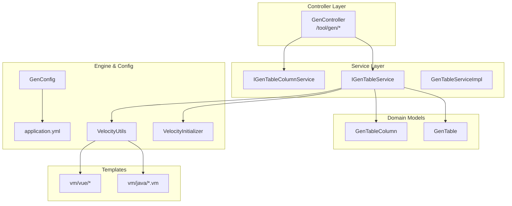
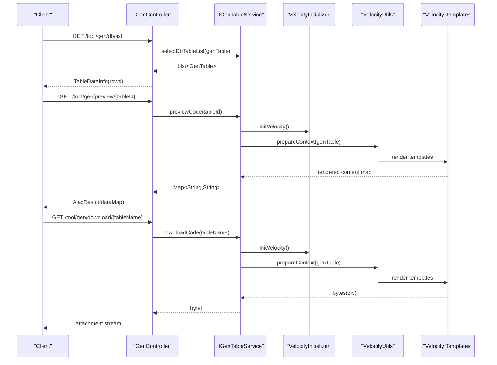
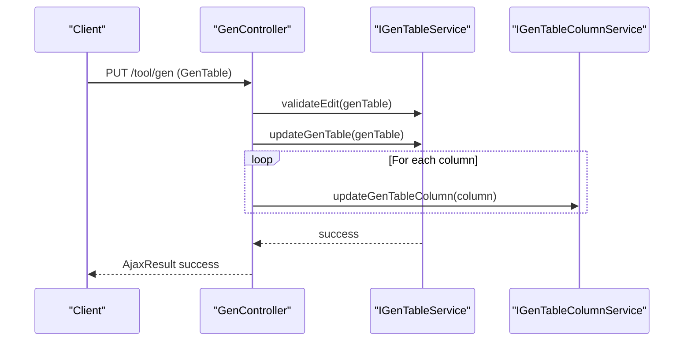
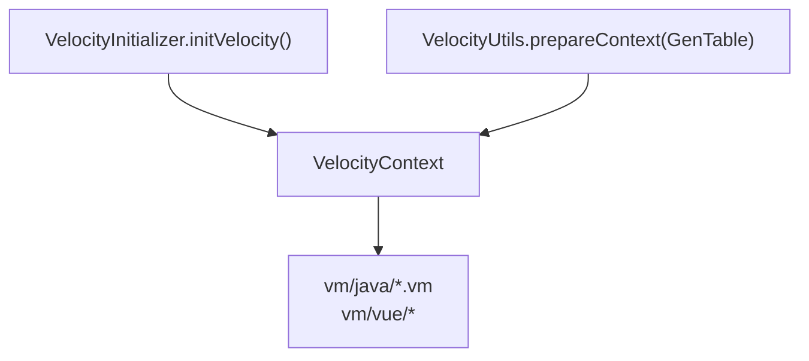
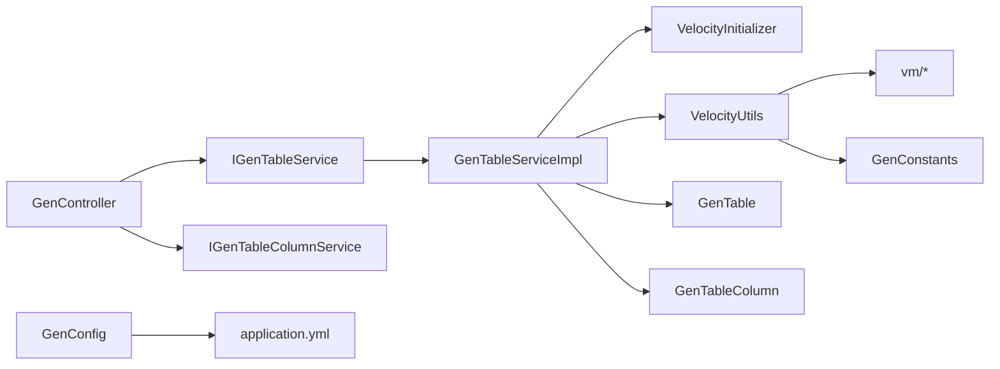

# Code Generation API

<cite>
**Referenced Files in This Document**
- [GenController.java](file://src/main/java/com/ruoyi/project/tool/gen/controller/GenController.java)
- [IGenTableService.java](file://src/main/java/com/ruoyi/project/tool/gen/service/IGenTableService.java)
- [IGenTableColumnService.java](file://src/main/java/com/ruoyi/project/tool/gen/service/IGenTableColumnService.java)
- [GenTable.java](file://src/main/java/com/ruoyi/project/tool/gen/domain/GenTable.java)
- [GenTableColumn.java](file://src/main/java/com/ruoyi/project/tool/gen/domain/GenTableColumn.java)
- [GenConfig.java](file://src/main/java/com/ruoyi/framework/config/GenConfig.java)
- [VelocityInitializer.java](file://src/main/java/com/ruoyi/project/tool/gen/util/VelocityInitializer.java)
- [VelocityUtils.java](file://src/main/java/com/ruoyi/project/tool/gen/util/VelocityUtils.java)
- [GenConstants.java](file://src/main/java/com/ruoyi/common/constant/GenConstants.java)
- [application.yml](file://src/main/resources/application.yml)
- [domain.java.vm](file://src/main/resources/vm/java/domain.java.vm)
- [index.vue.vm](file://src/main/resources/vm/vue/index.vue.vm)
</cite>

## Table of Contents
1. [Introduction](#introduction)
2. [Project Structure](#project-structure)
3. [Core Components](#core-components)
4. [Architecture Overview](#architecture-overview)
5. [Detailed Component Analysis](#detailed-component-analysis)
6. [Dependency Analysis](#dependency-analysis)
7. [Performance Considerations](#performance-considerations)
8. [Troubleshooting Guide](#troubleshooting-guide)
9. [Conclusion](#conclusion)
10. [Appendices](#appendices)

## Introduction
This document provides API documentation for the Code Generation module. It covers the endpoints used to manage code generation configurations, list and retrieve database tables, preview generated code, and generate backend Java and frontend Vue artifacts using Apache Velocity templates located under the vm/ directory. It also explains how the /gen/edit endpoint updates generation parameters such as className, functionName, and column settings, and details the response format used by the frontend generator. Security requirements and permission checks are documented, along with common issues and error scenarios.

## Project Structure
The Code Generation module is organized around a REST controller, service interfaces and implementations, domain models, and Velocity template files. The controller exposes endpoints under /tool/gen. Services orchestrate database operations and template rendering. Templates define the structure for generated Java and Vue code.

**Diagram sources**
- [GenController.java](file://src/main/java/com/ruoyi/project/tool/gen/controller/GenController.java#L45-L263)
- [IGenTableService.java](file://src/main/java/com/ruoyi/project/tool/gen/service/IGenTableService.java#L1-L131)
- [IGenTableColumnService.java](file://src/main/java/com/ruoyi/project/tool/gen/service/IGenTableColumnService.java#L1-L45)
- [GenTable.java](file://src/main/java/com/ruoyi/project/tool/gen/domain/GenTable.java#L1-L385)
- [GenTableColumn.java](file://src/main/java/com/ruoyi/project/tool/gen/domain/GenTableColumn.java#L1-L373)
- [VelocityInitializer.java](file://src/main/java/com/ruoyi/project/tool/gen/util/VelocityInitializer.java#L1-L35)
- [VelocityUtils.java](file://src/main/java/com/ruoyi/project/tool/gen/util/VelocityUtils.java#L1-L409)
- [GenConfig.java](file://src/main/java/com/ruoyi/framework/config/GenConfig.java#L1-L80)
- [application.yml](file://src/main/resources/application.yml#L138-L149)

**Section sources**
- [GenController.java](file://src/main/java/com/ruoyi/project/tool/gen/controller/GenController.java#L45-L263)
- [IGenTableService.java](file://src/main/java/com/ruoyi/project/tool/gen/service/IGenTableService.java#L1-L131)
- [IGenTableColumnService.java](file://src/main/java/com/ruoyi/project/tool/gen/service/IGenTableColumnService.java#L1-L45)
- [GenTable.java](file://src/main/java/com/ruoyi/project/tool/gen/domain/GenTable.java#L1-L385)
- [GenTableColumn.java](file://src/main/java/com/ruoyi/project/tool/gen/domain/GenTableColumn.java#L1-L373)
- [VelocityInitializer.java](file://src/main/java/com/ruoyi/project/tool/gen/util/VelocityInitializer.java#L1-L35)
- [VelocityUtils.java](file://src/main/java/com/ruoyi/project/tool/gen/util/VelocityUtils.java#L1-L409)
- [GenConfig.java](file://src/main/java/com/ruoyi/framework/config/GenConfig.java#L1-L80)
- [application.yml](file://src/main/resources/application.yml#L138-L149)

## Core Components
- GenController: Exposes REST endpoints for listing, retrieving, importing, creating, editing, deleting, previewing, and generating code. It enforces permissions using @PreAuthorize annotations.
- IGenTableService and GenTableServiceImpl: Define and implement business logic for managing generation configurations, database table lists, previewing, downloading, and generating code.
- IGenTableColumnService: Manages table column configurations.
- GenTable and GenTableColumn: Domain models representing generation configuration and column metadata.
- VelocityInitializer and VelocityUtils: Initialize the Velocity engine and prepare VelocityContext with data for templates.
- GenConstants and GenConfig: Provide constants and configurable settings for generation behavior.
- application.yml: Contains the gen.* configuration keys controlling author, package name, table prefix, and overwrite policy.

Key responsibilities:
- Endpoint-driven orchestration for CRUD and generation operations.
- Template-driven code generation for backend Java and frontend Vue.
- Validation and persistence of generation parameters and column settings.
- Permission enforcement for sensitive operations.

**Section sources**
- [GenController.java](file://src/main/java/com/ruoyi/project/tool/gen/controller/GenController.java#L45-L263)
- [IGenTableService.java](file://src/main/java/com/ruoyi/project/tool/gen/service/IGenTableService.java#L1-L131)
- [IGenTableColumnService.java](file://src/main/java/com/ruoyi/project/tool/gen/service/IGenTableColumnService.java#L1-L45)
- [GenTable.java](file://src/main/java/com/ruoyi/project/tool/gen/domain/GenTable.java#L1-L385)
- [GenTableColumn.java](file://src/main/java/com/ruoyi/project/tool/gen/domain/GenTableColumn.java#L1-L373)
- [VelocityInitializer.java](file://src/main/java/com/ruoyi/project/tool/gen/util/VelocityInitializer.java#L1-L35)
- [VelocityUtils.java](file://src/main/java/com/ruoyi/project/tool/gen/util/VelocityUtils.java#L1-L409)
- [GenConstants.java](file://src/main/java/com/ruoyi/common/constant/GenConstants.java#L1-L118)
- [GenConfig.java](file://src/main/java/com/ruoyi/framework/config/GenConfig.java#L1-L80)
- [application.yml](file://src/main/resources/application.yml#L138-L149)

## Architecture Overview
The generation pipeline integrates REST endpoints, services, and Velocity templates. The controller delegates to services, which prepare VelocityContext and render templates to produce Java and Vue artifacts. Generated files are either downloaded as a zip archive or written to a configured path depending on the operation.

**Diagram sources**
- [GenController.java](file://src/main/java/com/ruoyi/project/tool/gen/controller/GenController.java#L83-L207)
- [IGenTableService.java](file://src/main/java/com/ruoyi/project/tool/gen/service/IGenTableService.java#L85-L123)
- [VelocityInitializer.java](file://src/main/java/com/ruoyi/project/tool/gen/util/VelocityInitializer.java#L1-L35)
- [VelocityUtils.java](file://src/main/java/com/ruoyi/project/tool/gen/util/VelocityUtils.java#L37-L160)

## Detailed Component Analysis

### API Endpoints

- GET /tool/gen/db/list
  - Purpose: List database tables available for generation.
  - Pagination: Uses TableDataInfo and startPage() from BaseController for pagination.
  - Parameters: Query parameters bound to GenTable (e.g., table name filters).
  - Response: TableDataInfo with rows of GenTable entries.
  - Permissions: tool:gen:list.

- GET /tool/gen/preview/{tableId}
  - Purpose: Preview generated code for a given tableId.
  - Response: AjaxResult with a Map<String,String> where keys are file paths and values are generated content.
  - Permissions: tool:gen:preview.

- GET /tool/gen/download/{tableName}
  - Purpose: Download a zip archive containing generated backend Java and frontend Vue files for a single table.
  - Response: Binary stream as an attachment.
  - Permissions: tool:gen:code.

- GET /tool/gen/batchGenCode?tables={tableNames}
  - Purpose: Download a zip archive containing generated files for multiple tables.
  - Query parameter: tables (comma-separated).
  - Response: Binary stream as an attachment.
  - Permissions: tool:gen:code.

- PUT /tool/gen (PATCH not used)
  - Purpose: Edit and save generation parameters (e.g., className, functionName, options).
  - Request body: GenTable (validated).
  - Response: AjaxResult success.
  - Permissions: tool:gen:edit.

- DELETE /tool/gen/{tableIds}
  - Purpose: Delete generation configurations by tableIds.
  - Path variable: tableIds (multiple IDs).
  - Response: AjaxResult success.
  - Permissions: tool:gen:remove.

Security requirements:
- @PreAuthorize("hasPermission('tool:gen:list')") for listing endpoints.
- @PreAuthorize("hasPermission('tool:gen:preview')") for preview.
- @PreAuthorize("hasPermission('tool:gen:code')") for code generation endpoints.
- @PreAuthorize("hasPermission('tool:gen:edit')") for editing.
- @PreAuthorize("hasPermission('tool:gen:remove')") for deletion.

Notes:
- The controller uses BaseController.startPage() for pagination and returns TableDataInfo for list endpoints.
- The /gen/edit endpoint updates GenTable and its columns via IGenTableService.updateGenTable and IGenTableColumnService operations.

**Section sources**
- [GenController.java](file://src/main/java/com/ruoyi/project/tool/gen/controller/GenController.java#L55-L207)
- [IGenTableService.java](file://src/main/java/com/ruoyi/project/tool/gen/service/IGenTableService.java#L1-L131)
- [IGenTableColumnService.java](file://src/main/java/com/ruoyi/project/tool/gen/service/IGenTableColumnService.java#L1-L45)
- [GenTable.java](file://src/main/java/com/ruoyi/project/tool/gen/domain/GenTable.java#L1-L385)
- [GenTableColumn.java](file://src/main/java/com/ruoyi/project/tool/gen/domain/GenTableColumn.java#L1-L373)

### Request Body and Response Formats

- Request body for PUT /tool/gen:
  - GenTable object with fields such as tableName, tableComment, className, tplCategory, tplWebType, packageName, moduleName, businessName, functionName, functionAuthor, genType, genPath, options, columns, and subTable (for sub tables).
  - Validation: @NotBlank constraints on required fields; service-side validation via validateEdit.

- Response format for GET /tool/gen/preview/{tableId}:
  - AjaxResult with dataMap: Map<String,String> where keys are file paths and values are generated content.

- Response format for GET /tool/gen/db/list:
  - TableDataInfo with rows as List<GenTable>.

- Response format for GET /tool/gen/download/{tableName} and GET /tool/gen/batchGenCode:
  - Binary attachment (zip) containing generated files.

- Response format for PUT /tool/gen and DELETE /tool/gen/{tableIds}:
  - AjaxResult success.

- Column settings:
  - GenTableColumn includes attributes such as javaField, javaType, columnType, columnComment, isPk, isRequired, isInsert, isEdit, isList, isQuery, queryType, htmlType, dictType, sort, and helpers for determining super columns and usable columns.

**Section sources**
- [GenTable.java](file://src/main/java/com/ruoyi/project/tool/gen/domain/GenTable.java#L1-L385)
- [GenTableColumn.java](file://src/main/java/com/ruoyi/project/tool/gen/domain/GenTableColumn.java#L1-L373)
- [GenController.java](file://src/main/java/com/ruoyi/project/tool/gen/controller/GenController.java#L161-L184)
- [IGenTableService.java](file://src/main/java/com/ruoyi/project/tool/gen/service/IGenTableService.java#L85-L123)

### How /gen/edit Updates Generation Parameters
- The PUT /tool/gen endpoint validates and persists GenTable and its columns.
- IGenTableService.updateGenTable serializes GenTable.params into options and updates the record and columns.
- Column-specific toggles (insert, edit, list, query) and display settings (htmlType, dictType) are updated via column mappers.

**Diagram sources**
- [GenController.java](file://src/main/java/com/ruoyi/project/tool/gen/controller/GenController.java#L161-L172)
- [IGenTableService.java](file://src/main/java/com/ruoyi/project/tool/gen/service/IGenTableService.java#L53-L68)
- [IGenTableColumnService.java](file://src/main/java/com/ruoyi/project/tool/gen/service/IGenTableColumnService.java#L27-L41)

**Section sources**
- [GenController.java](file://src/main/java/com/ruoyi/project/tool/gen/controller/GenController.java#L161-L172)
- [IGenTableService.java](file://src/main/java/com/ruoyi/project/tool/gen/service/IGenTableService.java#L53-L68)
- [IGenTableColumnService.java](file://src/main/java/com/ruoyi/project/tool/gen/service/IGenTableColumnService.java#L27-L41)

### Template Integration and Generated Artifacts
- Velocity templates under vm/ drive code generation:
  - Java templates: domain.java.vm, mapper.java.vm, service.java.vm, serviceImpl.java.vm, controller.java.vm, xml/mapper.xml.vm, sql/sql.vm, java/sub-domain.java.vm.
  - Vue templates: js/api.js.vm, vue/index.vue.vm, vue/index-tree.vue.vm, vue/v3/index.vue.vm, vue/v3/index-tree.vue.vm.
- VelocityUtils prepares the VelocityContext with:
  - Table metadata (tableName, functionName, className, businessName, moduleName, packageName, author, datetime, options).
  - Column metadata (columns) and imports (importList).
  - Special contexts for tree and sub tables.
  - Permission prefix and dictionary types.
- VelocityInitializer initializes the Velocity engine to load templates from classpath.

**Diagram sources**
- [VelocityUtils.java](file://src/main/java/com/ruoyi/project/tool/gen/util/VelocityUtils.java#L37-L160)
- [VelocityInitializer.java](file://src/main/java/com/ruoyi/project/tool/gen/util/VelocityInitializer.java#L1-L35)
- [domain.java.vm](file://src/main/resources/vm/java/domain.java.vm#L1-L106)
- [index.vue.vm](file://src/main/resources/vm/vue/index.vue.vm#L1-L603)

**Section sources**
- [VelocityUtils.java](file://src/main/java/com/ruoyi/project/tool/gen/util/VelocityUtils.java#L130-L227)
- [VelocityInitializer.java](file://src/main/java/com/ruoyi/project/tool/gen/util/VelocityInitializer.java#L17-L33)
- [domain.java.vm](file://src/main/resources/vm/java/domain.java.vm#L1-L106)
- [index.vue.vm](file://src/main/resources/vm/vue/index.vue.vm#L1-L603)

### Example Successful Generation Responses
- Preview response: AjaxResult with dataMap containing file paths and generated content.
- Download response: Binary zip attachment named "ruoyi.zip".
- Batch generation response: Binary zip attachment containing files for multiple tables.

These responses are produced by the controller’s download and preview methods and the service’s downloadCode and previewCode implementations.

**Section sources**
- [GenController.java](file://src/main/java/com/ruoyi/project/tool/gen/controller/GenController.java#L197-L207)
- [GenController.java](file://src/main/java/com/ruoyi/project/tool/gen/controller/GenController.java#L240-L248)
- [IGenTableService.java](file://src/main/java/com/ruoyi/project/tool/gen/service/IGenTableService.java#L85-L123)

### Error Cases and Common Issues
- Invalid template paths or missing templates: Velocity initialization and template resolution failures will cause exceptions during preview or generation.
- Overwrite policy: When gen.allowOverwrite is false, custom path generation is blocked.
- Table not found: Retrieving a non-existent tableId or tableName will lead to empty results or exceptions depending on the operation.
- SQL injection prevention: Creation endpoints filter SQL keywords and parse statements carefully.

Mitigations:
- Ensure templates exist under vm/ and are accessible via classpath.
- Configure gen.allowOverwrite appropriately in application.yml.
- Validate table existence before invoking generation endpoints.

**Section sources**
- [GenController.java](file://src/main/java/com/ruoyi/project/tool/gen/controller/GenController.java#L124-L159)
- [GenConfig.java](file://src/main/java/com/ruoyi/framework/config/GenConfig.java#L70-L78)
- [application.yml](file://src/main/resources/application.yml#L138-L149)

## Dependency Analysis
The controller depends on service interfaces, which depend on mappers and the Velocity engine. VelocityUtils constructs the context and selects templates based on tplCategory and tplWebType. GenConstants defines shared constants for templates and column behaviors.

**Diagram sources**
- [GenController.java](file://src/main/java/com/ruoyi/project/tool/gen/controller/GenController.java#L45-L263)
- [IGenTableService.java](file://src/main/java/com/ruoyi/project/tool/gen/service/IGenTableService.java#L1-L131)
- [IGenTableColumnService.java](file://src/main/java/com/ruoyi/project/tool/gen/service/IGenTableColumnService.java#L1-L45)
- [GenTableServiceImpl.java](file://src/main/java/com/ruoyi/project/tool/gen/service/GenTableServiceImpl.java#L1-L200)
- [VelocityUtils.java](file://src/main/java/com/ruoyi/project/tool/gen/util/VelocityUtils.java#L130-L227)
- [GenConstants.java](file://src/main/java/com/ruoyi/common/constant/GenConstants.java#L1-L118)
- [GenConfig.java](file://src/main/java/com/ruoyi/framework/config/GenConfig.java#L1-L80)
- [application.yml](file://src/main/resources/application.yml#L138-L149)

**Section sources**
- [GenController.java](file://src/main/java/com/ruoyi/project/tool/gen/controller/GenController.java#L45-L263)
- [GenTableServiceImpl.java](file://src/main/java/com/ruoyi/project/tool/gen/service/GenTableServiceImpl.java#L1-L200)
- [VelocityUtils.java](file://src/main/java/com/ruoyi/project/tool/gen/util/VelocityUtils.java#L130-L227)
- [GenConstants.java](file://src/main/java/com/ruoyi/common/constant/GenConstants.java#L1-L118)
- [GenConfig.java](file://src/main/java/com/ruoyi/framework/config/GenConfig.java#L1-L80)
- [application.yml](file://src/main/resources/application.yml#L138-L149)

## Performance Considerations
- Template rendering overhead: Rendering many templates for large projects can be CPU-intensive. Consider caching rendered previews when appropriate.
- Zip generation: Large downloads can consume memory; ensure adequate heap size and streaming where possible.
- Pagination: Use startPage() and TableDataInfo to avoid loading entire datasets.
- Column processing: Avoid unnecessary computations in column loops; leverage VelocityUtils’ precomputed sets (imports, dicts).

## Troubleshooting Guide
- Preview fails with template errors:
  - Verify template files exist under vm/ and are readable.
  - Check Velocity context construction and ensure required fields are populated.
- Download returns empty or partial content:
  - Confirm tableId or tableName exists and corresponds to imported records.
  - Validate that templates are selected correctly based on tplCategory and tplWebType.
- Overwrite disabled:
  - Set gen.allowOverwrite=true in application.yml to enable custom path generation.
- SQL creation errors:
  - Review SQL statement parsing and filtering logic; ensure statements are valid MySQL CREATE TABLE statements.

**Section sources**
- [GenController.java](file://src/main/java/com/ruoyi/project/tool/gen/controller/GenController.java#L124-L159)
- [GenConfig.java](file://src/main/java/com/ruoyi/framework/config/GenConfig.java#L70-L78)
- [application.yml](file://src/main/resources/application.yml#L138-L149)

## Conclusion
The Code Generation module provides a robust REST API for managing generation configurations and producing backend Java and frontend Vue artifacts via Velocity templates. It enforces permissions, supports preview and batch generation, and integrates cleanly with the application’s configuration and constants. Proper template maintenance and configuration ensure reliable generation outcomes.

## Appendices

### API Definitions

- GET /tool/gen/db/list
  - Description: List database tables available for generation.
  - Query parameters: Bound to GenTable (e.g., table name filters).
  - Response: TableDataInfo(rows).
  - Permissions: tool:gen:list.

- GET /tool/gen/preview/{tableId}
  - Description: Preview generated code for a table.
  - Response: AjaxResult(dataMap).
  - Permissions: tool:gen:preview.

- GET /tool/gen/download/{tableName}
  - Description: Download generated files for a single table as a zip.
  - Response: Binary attachment.
  - Permissions: tool:gen:code.

- GET /tool/gen/batchGenCode?tables={tableNames}
  - Description: Download generated files for multiple tables as a zip.
  - Query parameter: tables (comma-separated).
  - Response: Binary attachment.
  - Permissions: tool:gen:code.

- PUT /tool/gen
  - Description: Update generation parameters (className, functionName, options, columns).
  - Request body: GenTable.
  - Response: AjaxResult success.
  - Permissions: tool:gen:edit.

- DELETE /tool/gen/{tableIds}
  - Description: Delete generation configurations by IDs.
  - Path variable: tableIds.
  - Response: AjaxResult success.
  - Permissions: tool:gen:remove.

### Configuration Keys (application.yml)
- gen.author: Default author for generated code.
- gen.packageName: Default package name for generated Java classes.
- gen.autoRemovePre: Whether to remove table prefixes from class names.
- gen.tablePrefix: Comma-separated list of table prefixes to remove.
- gen.allowOverwrite: Whether to allow writing generated files to local path.

**Section sources**
- [application.yml](file://src/main/resources/application.yml#L138-L149)
- [GenConfig.java](file://src/main/java/com/ruoyi/framework/config/GenConfig.java#L1-L80)