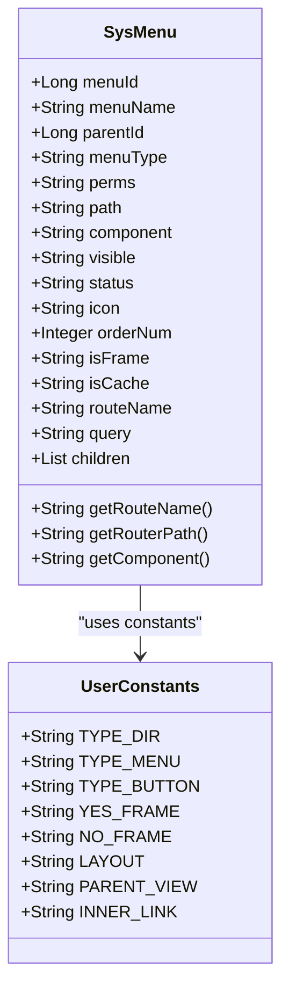
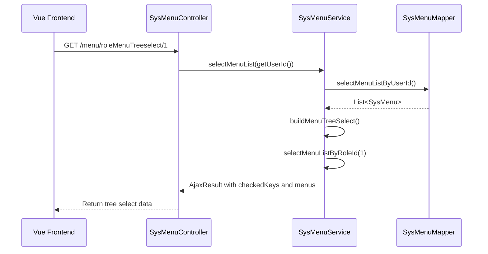
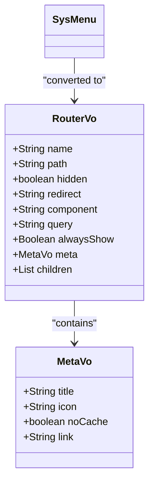
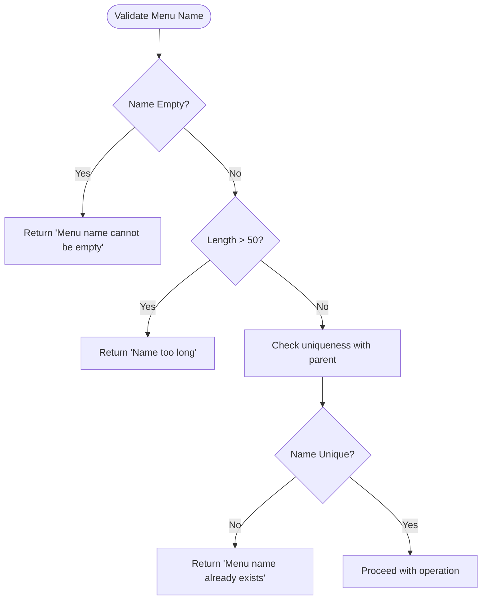
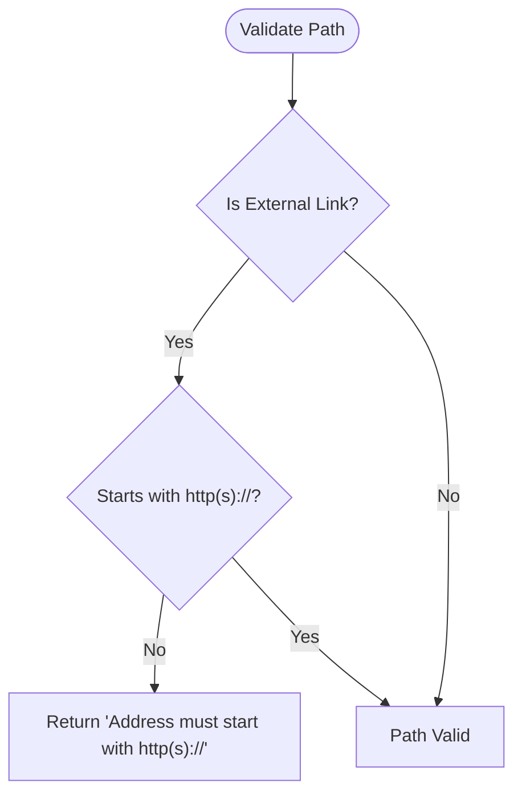
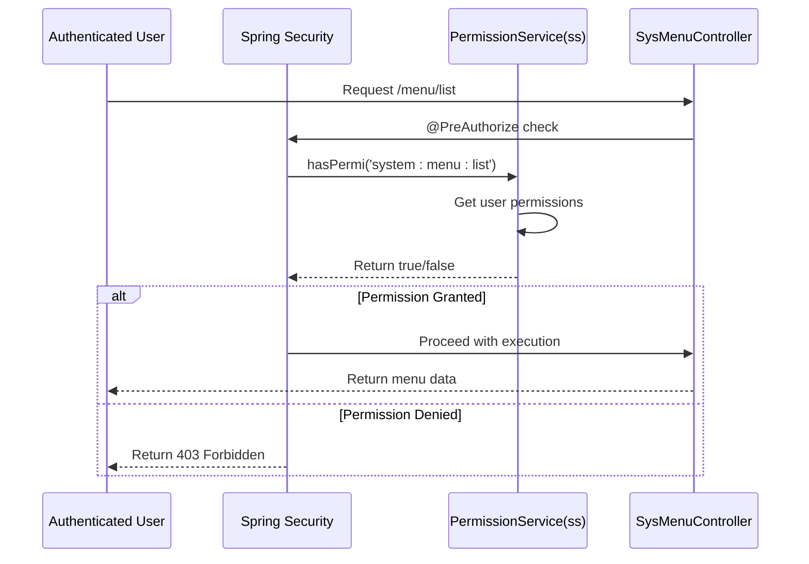
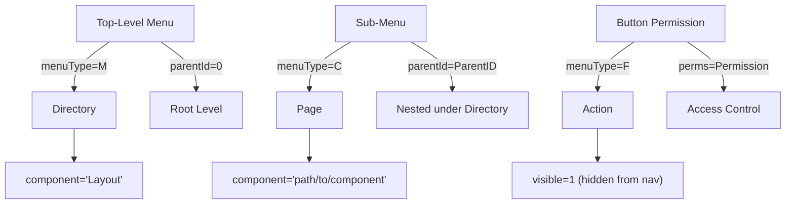

# Menu Management API

<cite>
**Referenced Files in This Document**   
- [SysMenuController.java](file://src/main/java/com/ruoyi/project/system/controller/SysMenuController.java)
- [SysMenu.java](file://src/main/java/com/ruoyi/project/system/domain/SysMenu.java)
- [ISysMenuService.java](file://src/main/java/com/ruoyi/project/system/service/ISysMenuService.java)
- [SysMenuServiceImpl.java](file://src/main/java/com/ruoyi/project/system/service/impl/SysMenuServiceImpl.java)
- [SysMenuMapper.xml](file://src/main/resources/mybatis/system/SysMenuMapper.xml)
- [RouterVo.java](file://src/main/java/com/ruoyi/project/system/domain/vo/RouterVo.java)
- [TreeSelect.java](file://src/main/java/com/ruoyi/framework/web/domain/TreeSelect.java)
- [UserConstants.java](file://src/main/java/com/ruoyi/common/constant/UserConstants.java)
- [PermissionService.java](file://src/main/java/com/ruoyi/framework/security/service/PermissionService.java)
- [index-tree.vue.vm](file://src/main/resources/vm/vue/index-tree.vue.vm)
- [MetaVo.java](file://src/main/java/com/ruoyi/project/system/domain/vo/MetaVo.java)
</cite>

## Table of Contents
1. [Introduction](#introduction)
2. [API Endpoints](#api-endpoints)
3. [SysMenu Entity Fields](#sysmenu-entity-fields)
4. [Role-Based Menu Tree Selection](#role-based-menu-tree-selection)
5. [Dynamic Routing Payload Structure](#dynamic-routing-payload-structure)
6. [Validation Rules](#validation-rules)
7. [Menu Visibility and Permission Enforcement](#menu-visibility-and-permission-enforcement)
8. [Menu Hierarchy Creation](#menu-hierarchy-creation)
9. [Conclusion](#conclusion)

## Introduction
The Menu Management API provides a comprehensive set of endpoints for managing application navigation and access control. It enables administrators to create, modify, and organize menu structures that define the user interface navigation and enforce role-based permissions. The API supports hierarchical tree structures for organizing menus, sub-menus, and button-level permissions, with integration between backend security enforcement and frontend Vue router configuration. This documentation details the available endpoints, entity structure, validation rules, and integration patterns for effective menu management.

## API Endpoints

### GET /menu/list (Tree Structure)
Retrieves a hierarchical list of menus based on filtering criteria. The response returns a tree structure of menu items with nested children.

**Request Parameters:**
- `menuName` (optional): Filter menus by name (partial match)
- `visible` (optional): Filter by visibility status (0=visible, 1=hidden)
- `status` (optional): Filter by menu status (0=normal, 1=disabled)

**Response Format:**
Returns a JSON array of menu objects with hierarchical nesting through the `children` property.

**Section sources**
- [SysMenuController.java](file://src/main/java/com/ruoyi/project/system/controller/SysMenuController.java#L39-L45)
- [ISysMenuService.java](file://src/main/java/com/ruoyi/project/system/service/ISysMenuService.java#L31-L32)
- [SysMenuServiceImpl.java](file://src/main/java/com/ruoyi/project/system/service/impl/SysMenuServiceImpl.java#L66-L80)

### POST /menu
Creates a new menu item in the system.

**Request Body:**
JSON object containing SysMenu entity fields (menuName, menuType, perms, path, component, parentId, etc.)

**Validation:**
- Validates unique menu name within parent context
- Validates routing path format for external links
- Prevents circular parent-child relationships

**Response:**
Returns success status with created menu details or error message if validation fails.

**Section sources**
- [SysMenuController.java](file://src/main/java/com/ruoyi/project/system/controller/SysMenuController.java#L83-L98)
- [ISysMenuService.java](file://src/main/java/com/ruoyi/project/system/service/ISysMenuService.java#L119-L120)
- [SysMenuServiceImpl.java](file://src/main/java/com/ruoyi/project/system/service/impl/SysMenuServiceImpl.java#L302-L305)

### PUT /menu
Updates an existing menu item.

**Request Body:**
JSON object containing SysMenu entity fields with menuId specified

**Validation:**
- Validates unique menu name within parent context
- Validates routing path format for external links
- Prevents menu from being its own parent
- Ensures data integrity during update

**Response:**
Returns success status with updated menu details or error message if validation fails.

**Section sources**
- [SysMenuController.java](file://src/main/java/com/ruoyi/project/system/controller/SysMenuController.java#L103-L122)
- [ISysMenuService.java](file://src/main/java/com/ruoyi/project/system/service/ISysMenuService.java#L127-L128)
- [SysMenuServiceImpl.java](file://src/main/java/com/ruoyi/project/system/service/impl/SysMenuServiceImpl.java#L314-L317)

### DELETE /menu/{menuId}
Deletes a menu item by its ID.

**Request Parameters:**
- `menuId`: Path parameter specifying the ID of the menu to delete

**Deletion Rules:**
- Cannot delete menus that have child menus
- Cannot delete menus that are assigned to roles
- Performs cascade checks before deletion

**Response:**
Returns success status if deleted or warning message if deletion is blocked by constraints.

**Section sources**
- [SysMenuController.java](file://src/main/java/com/ruoyi/project/system/controller/SysMenuController.java#L127-L141)
- [ISysMenuService.java](file://src/main/java/com/ruoyi/project/system/service/ISysMenuService.java#L135-L136)
- [SysMenuServiceImpl.java](file://src/main/java/com/ruoyi/project/system/service/impl/SysMenuServiceImpl.java#L326-L329)

### GET /menu/treeselect
Retrieves menu data in a format suitable for tree selection components.

**Response Format:**
Returns a tree structure with:
- `id`: Menu ID
- `label`: Menu name
- `children`: Nested tree nodes

This endpoint is optimized for UI components that require hierarchical selection interfaces.

**Section sources**
- [SysMenuController.java](file://src/main/java/com/ruoyi/project/system/controller/SysMenuController.java#L60-L65)
- [ISysMenuService.java](file://src/main/java/com/ruoyi/project/system/service/ISysMenuService.java#L87-L88)
- [SysMenuServiceImpl.java](file://src/main/java/com/ruoyi/project/system/service/impl/SysMenuServiceImpl.java#L251-L255)
- [TreeSelect.java](file://src/main/java/com/ruoyi/framework/web/domain/TreeSelect.java#L47-L52)

## SysMenu Entity Fields
The SysMenu entity represents a menu item in the application with the following key fields:



**Diagram sources**
- [SysMenu.java](file://src/main/java/com/ruoyi/project/system/domain/SysMenu.java#L22-L70)
- [UserConstants.java](file://src/main/java/com/ruoyi/common/constant/UserConstants.java#L48-L64)

### Field Details:
- **menuName**: The display name of the menu item (required, max 50 characters)
- **menuType**: Type of menu item (M=Directory, C=Menu, F=Button) 
- **perms**: Permission string used for access control (max 100 characters)
- **path**: The route path for Vue router navigation
- **component**: The Vue component path to load when navigating to this route
- **parentId**: Reference to parent menu ID (0 for top-level menus)
- **visible**: Display status in navigation (0=visible, 1=hidden)
- **status**: Menu operational status (0=normal, 1=disabled)
- **icon**: Icon identifier for display in the menu
- **orderNum**: Sorting order for menu items
- **isFrame**: Indicates if the menu is an external link (0=yes, 1=no)
- **isCache**: Indicates if the route should be cached (0=cached, 1=not cached)
- **routeName**: Name of the Vue route (auto-generated if not specified)
- **query**: Route parameters to be passed
- **children**: Collection of child menu items forming the tree hierarchy

## Role-Based Menu Tree Selection
The endpoint GET /menu/roleMenuTreeSelect retrieves menu trees specifically for role permission assignment, providing both the complete menu hierarchy and the currently assigned menus for a specific role.

### GET /menu/roleMenuTreeSelect/{roleId}
Retrieves menu tree data for assigning permissions to a role.

**Response Structure:**
```json
{
  "code": 200,
  "msg": "success",
  "data": {
    "checkedKeys": [100, 101, 102],
    "menus": [
      {
        "id": 1,
        "label": "System Management",
        "children": [
          {
            "id": 100,
            "label": "User Management"
          },
          {
            "id": 101,
            "label": "Role Management"
          }
        ]
      }
    ]
  }
}
```

**Key Components:**
- `checkedKeys`: Array of menu IDs currently assigned to the role
- `menus`: Complete menu tree structure in TreeSelect format

**Implementation Logic:**
1. Retrieves all available menus for the current user
2. Identifies menus already assigned to the specified role
3. Returns both datasets for UI rendering of permission assignment



**Diagram sources**
- [SysMenuController.java](file://src/main/java/com/ruoyi/project/system/controller/SysMenuController.java#L70-L78)
- [ISysMenuService.java](file://src/main/java/com/ruoyi/project/system/service/ISysMenuService.java#L63-L64)
- [SysMenuServiceImpl.java](file://src/main/java/com/ruoyi/project/system/service/impl/SysMenuServiceImpl.java#L152-L156)
- [TreeSelect.java](file://src/main/java/com/ruoyi/framework/web/domain/TreeSelect.java#L47-L52)

**Section sources**
- [SysMenuController.java](file://src/main/java/com/ruoyi/project/system/controller/SysMenuController.java#L70-L78)
- [SysMenuServiceImpl.java](file://src/main/java/com/ruoyi/project/system/service/impl/SysMenuServiceImpl.java#L152-L156)

## Dynamic Routing Payload Structure
The menu system generates dynamic routing configurations for Vue Router based on the menu hierarchy and properties.

### RouterVo Structure
The backend converts SysMenu entities to RouterVo objects for frontend routing:



**Diagram sources**
- [RouterVo.java](file://src/main/java/com/ruoyi/project/system/domain/vo/RouterVo.java#L17-L57)
- [MetaVo.java](file://src/main/java/com/ruoyi/project/system/domain/vo/MetaVo.java#L15-L30)
- [SysMenuServiceImpl.java](file://src/main/java/com/ruoyi/project/system/service/impl/SysMenuServiceImpl.java#L165-L214)

### Route Generation Rules
The `buildMenus` method in SysMenuServiceImpl converts menu data to routing configuration:

- **Directory (M)**: Creates a parent route with `alwaysShow: true` and `redirect: "noRedirect"`
- **Menu (C)**: Creates a standard route with component loading
- **External Links**: Handled with special component routing
- **Hidden Menus**: Set `hidden: true` to exclude from sidebar
- **Caching**: Set `noCache: true` based on isCache flag

**Example Payload:**
```json
[
  {
    "name": "SystemManagement",
    "path": "/system",
    "component": "Layout",
    "alwaysShow": true,
    "meta": {
      "title": "System Management",
      "icon": "system",
      "noCache": false
    },
    "children": [
      {
        "name": "UserManagement",
        "path": "user",
        "component": "system/user/index",
        "meta": {
          "title": "User Management",
          "icon": "user",
          "noCache": false
        }
      }
    ]
  }
]
```

**Section sources**
- [SysMenuServiceImpl.java](file://src/main/java/com/ruoyi/project/system/service/impl/SysMenuServiceImpl.java#L165-L214)
- [RouterVo.java](file://src/main/java/com/ruoyi/project/system/domain/vo/RouterVo.java#L17-L57)
- [MetaVo.java](file://src/main/java/com/ruoyi/project/system/domain/vo/MetaVo.java#L15-L30)

## Validation Rules
The menu system enforces several validation rules to maintain data integrity and proper functionality.

### Menu Name Validation
- **Required**: Menu name cannot be empty
- **Length**: Limited to 50 characters maximum
- **Uniqueness**: Must be unique among siblings (same parent)
- **Implementation**: Checked via `checkMenuNameUnique` method



**Diagram sources**
- [SysMenu.java](file://src/main/java/com/ruoyi/project/system/domain/SysMenu.java#L82-L84)
- [SysMenuServiceImpl.java](file://src/main/java/com/ruoyi/project/system/service/impl/SysMenuServiceImpl.java#L337-L347)
- [SysMenuMapper.xml](file://src/main/resources/mybatis/system/SysMenuMapper.xml#L131-L134)

### Routing Path Validation
- **External Links**: Must start with http:// or https://
- **Internal Routes**: Must be valid Vue route paths
- **Format Check**: Validated using StringUtils.ishttp() method
- **Implementation**: Enforced in both add and edit operations



**Diagram sources**
- [SysMenuController.java](file://src/main/java/com/ruoyi/project/system/controller/SysMenuController.java#L92-L95)
- [SysMenuController.java](file://src/main/java/com/ruoyi/project/system/controller/SysMenuController.java#L112-L115)
- [SysMenuServiceImpl.java](file://src/main/java/com/ruoyi/project/system/service/impl/SysMenuServiceImpl.java#L460-L462)

**Section sources**
- [SysMenuController.java](file://src/main/java/com/ruoyi/project/system/controller/SysMenuController.java#L88-L95)
- [SysMenuController.java](file://src/main/java/com/ruoyi/project/system/controller/SysMenuController.java#L108-L115)
- [SysMenuServiceImpl.java](file://src/main/java/com/ruoyi/project/system/service/impl/SysMenuServiceImpl.java#L337-L347)

## Menu Visibility and Permission Enforcement
The system implements a comprehensive security model combining backend authorization and frontend integration.

### Backend Authorization with @PreAuthorize
The system uses Spring Security's @PreAuthorize annotation with custom permission checks:

```java
@PreAuthorize("@ss.hasPermi('system:menu:list')")
@GetMapping("/list")
public AjaxResult list(SysMenu menu) {
    // Endpoint implementation
}
```

**Permission Expressions:**
- `@ss.hasPermi('permission.string')`: Checks if user has specific permission
- PermissionService (aliased as 'ss') handles the actual validation
- Permissions are defined in the perms field of SysMenu entities



**Diagram sources**
- [SysMenuController.java](file://src/main/java/com/ruoyi/project/system/controller/SysMenuController.java#L39-L40)
- [SysMenuController.java](file://src/main/java/com/ruoyi/project/system/controller/SysMenuController.java#L83-L84)
- [PermissionService.java](file://src/main/java/com/ruoyi/framework/security/service/PermissionService.java#L27-L40)

### Frontend Integration with Vue Router
The frontend implements permission-based rendering using custom directives:

```vue
<el-button v-hasPermi="['system:menu:add']">Add</el-button>
```

**Integration Flow:**
1. User logs in and receives assigned permissions
2. Frontend fetches menu list filtered by user permissions
3. Vue router dynamically generates routes based on authorized menus
4. UI elements are shown/hidden based on v-hasPermi directives
5. Navigation is restricted to authorized routes only

**Section sources**
- [SysMenuController.java](file://src/main/java/com/ruoyi/project/system/controller/SysMenuController.java#L39-L40)
- [PermissionService.java](file://src/main/java/com/ruoyi/framework/security/service/PermissionService.java#L27-L40)
- [index-tree.vue.vm](file://src/main/resources/vm/vue/index-tree.vue.vm#L78)

## Menu Hierarchy Creation
The system supports creating hierarchical menu structures with different levels of organization.

### Creating Top-Level Menus
Top-level menus (directories) serve as containers for related functionality:

**Requirements:**
- Set `parentId = 0`
- Set `menuType = 'M'` (Directory)
- Define `path` that will serve as the base route
- Use `component = 'Layout'` for standard layout

**Example:**
```json
{
  "menuName": "System Management",
  "parentId": 0,
  "menuType": "M",
  "path": "/system",
  "component": "Layout",
  "orderNum": 1
}
```

### Creating Sub-Menus
Sub-menus represent actual pages within a functional area:

**Requirements:**
- Set `parentId` to the ID of the parent directory
- Set `menuType = 'C'` (Menu)
- Define `path` relative to parent
- Specify the component path to load

**Example:**
```json
{
  "menuName": "User Management",
  "parentId": 1,
  "menuType": "C",
  "path": "user",
  "component": "system/user/index",
  "perms": "system:user:list"
}
```

### Creating Button-Level Permissions
Button-level permissions control access to specific actions:

**Requirements:**
- Set `parentId` to the ID of the associated menu
- Set `menuType = 'F'` (Button)
- Define `perms` string that matches the v-hasPermi directive
- Typically hidden from navigation (visible = 1)

**Example:**
```json
{
  "menuName": "Add User",
  "parentId": 2,
  "menuType": "F",
  "perms": "system:user:add"
}
```



**Diagram sources**
- [SysMenu.java](file://src/main/java/com/ruoyi/project/system/domain/SysMenu.java#L54-L55)
- [UserConstants.java](file://src/main/java/com/ruoyi/common/constant/UserConstants.java#L48-L55)
- [index-tree.vue.vm](file://src/main/resources/vm/vue/index-tree.vue.vm#L154-L163)

**Section sources**
- [SysMenu.java](file://src/main/java/com/ruoyi/project/system/domain/SysMenu.java#L54-L55)
- [UserConstants.java](file://src/main/java/com/ruoyi/common/constant/UserConstants.java#L48-L55)

## Conclusion
The Menu Management API provides a robust framework for organizing application navigation and enforcing role-based access control. By leveraging hierarchical tree structures, the system enables administrators to create intuitive navigation flows while maintaining strict security controls. The integration between backend permission validation through @PreAuthorize annotations and frontend rendering via v-hasPermi directives ensures consistent access control across the entire application. Key features include comprehensive validation rules for menu names and routing paths, support for dynamic routing configuration, and specialized endpoints for role-based permission assignment. This architecture allows for flexible menu organization with top-level directories, sub-menus for pages, and button-level permissions for fine-grained access control, making it suitable for complex enterprise applications with sophisticated permission requirements.