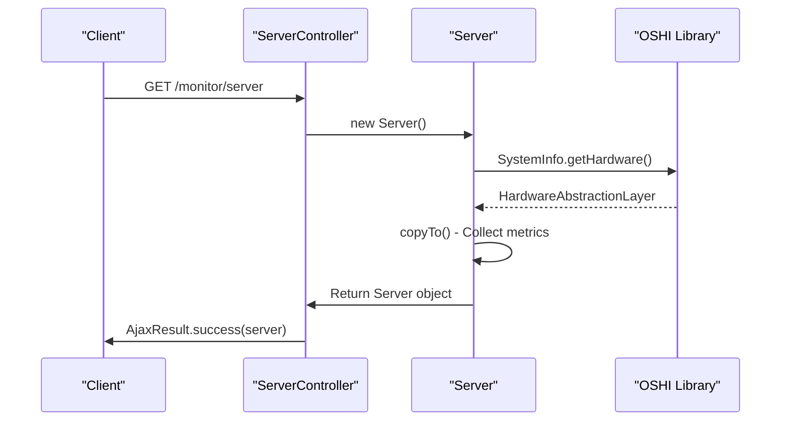
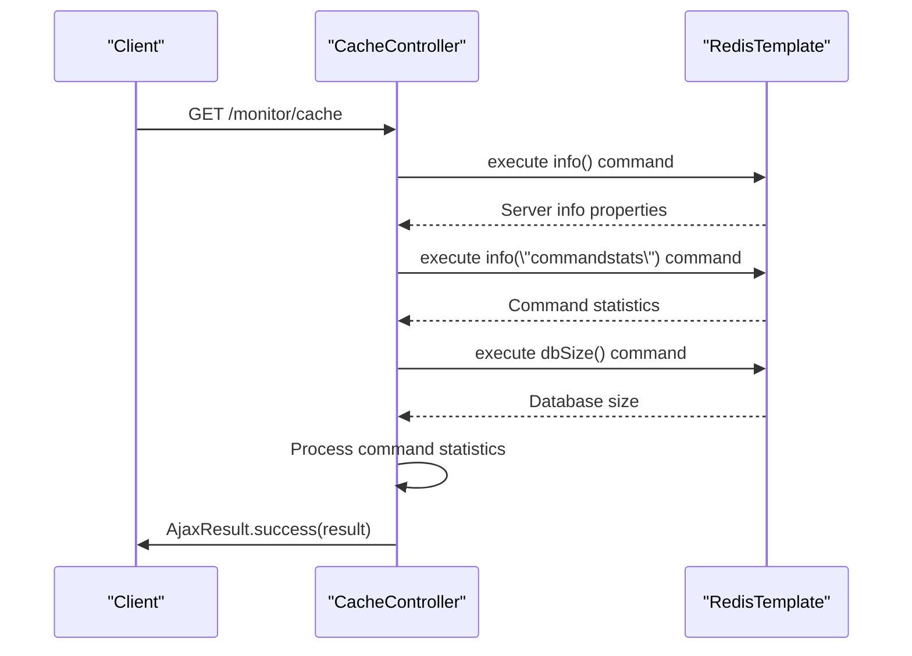
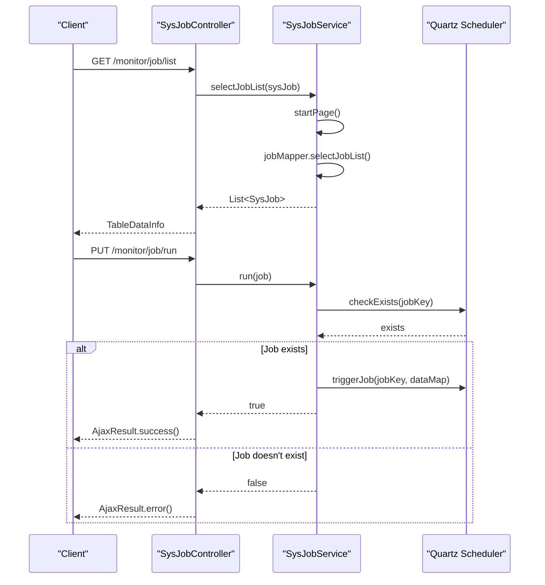
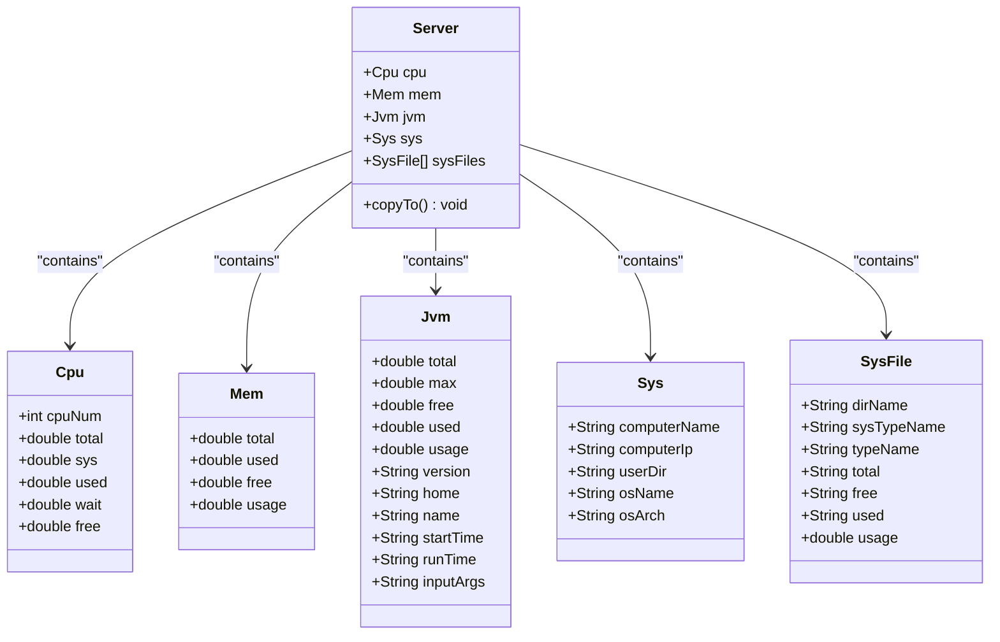
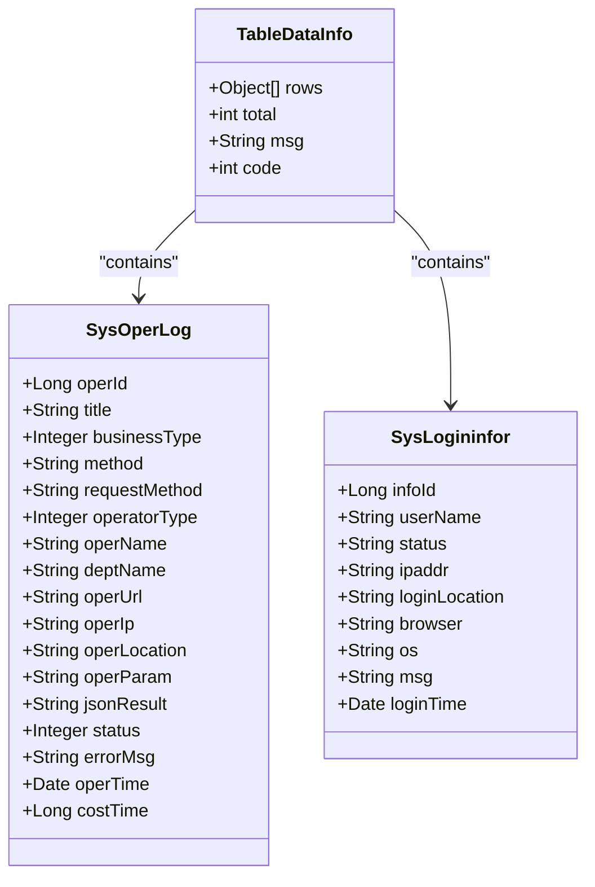

# Monitoring API

<cite>
**Referenced Files in This Document**   
- [ServerController.java](file://src/main/java/com/ruoyi/project/monitor/controller/ServerController.java)
- [CacheController.java](file://src/main/java/com/ruoyi/project/monitor/controller/CacheController.java)
- [SysJobController.java](file://src/main/java/com/ruoyi/project/monitor/controller/SysJobController.java)
- [SysOperlogController.java](file://src/main/java/com/ruoyi/project/monitor/controller/SysOperlogController.java)
- [SysLogininforController.java](file://src/main/java/com/ruoyi/project/monitor/controller/SysLogininforController.java)
- [Server.java](file://src/main/java/com/ruoyi/framework/web/domain/Server.java)
- [SysJob.java](file://src/main/java/com/ruoyi/project/monitor/domain/SysJob.java)
- [SysOperLog.java](file://src/main/java/com/ruoyi/project/monitor/domain/SysOperLog.java)
- [SysLogininfor.java](file://src/main/java/com/ruoyi/project/monitor/domain/SysLogininfor.java)
- [SysCache.java](file://src/main/java/com/ruoyi/project/monitor/domain/SysCache.java)
</cite>

## Table of Contents
1. [Introduction](#introduction)
2. [System Monitoring Endpoints](#system-monitoring-endpoints)
3. [Cache Monitoring Endpoints](#cache-monitoring-endpoints)
4. [Job Monitoring Endpoints](#job-monitoring-endpoints)
5. [Log Monitoring Endpoints](#log-monitoring-endpoints)
6. [Response Schema Definitions](#response-schema-definitions)
7. [Security Constraints](#security-constraints)
8. [Integration with Admin Dashboard](#integration-with-admin-dashboard)

## Introduction
The Monitoring API provides comprehensive system monitoring capabilities for the RuoYi-Vue application. This API enables administrators to monitor server health, cache performance, scheduled job status, and user activity through a set of RESTful endpoints. The monitoring system collects real-time data from various components including system resources, JVM metrics, Redis cache statistics, and application logs. All endpoints are secured with role-based access control, ensuring that only authorized personnel can access sensitive monitoring information.

## System Monitoring Endpoints

The system monitoring endpoints provide real-time information about server performance and JVM health. The primary endpoint `GET /monitor/server` collects comprehensive system metrics using the OSHI (Operating System and Hardware Information) library, which provides a cross-platform way to retrieve system and hardware information.



**Diagram sources**
- [ServerController.java](file://src/main/java/com/ruoyi/project/monitor/controller/ServerController.java#L19-L25)
- [Server.java](file://src/main/java/com/ruoyi/framework/web/domain/Server.java#L108-L122)

**Section sources**
- [ServerController.java](file://src/main/java/com/ruoyi/project/monitor/controller/ServerController.java#L15-L27)
- [Server.java](file://src/main/java/com/ruoyi/framework/web/domain/Server.java#L29-L241)

## Cache Monitoring Endpoints

The cache monitoring endpoints provide detailed insights into Redis cache performance and statistics. The `GET /monitor/cache` endpoint retrieves comprehensive Redis server information including command execution statistics, memory usage, and database size. The controller also provides endpoints to explore and manage specific cache entries.



**Diagram sources**
- [CacheController.java](file://src/main/java/com/ruoyi/project/monitor/controller/CacheController.java#L48-L69)
- [SysCache.java](file://src/main/java/com/ruoyi/project/monitor/domain/SysCache.java#L10-L82)

**Section sources**
- [CacheController.java](file://src/main/java/com/ruoyi/project/monitor/controller/CacheController.java#L30-L122)
- [SysCache.java](file://src/main/java/com/ruoyi/project/monitor/domain/SysCache.java#L1-L82)

## Job Monitoring Endpoints

The job monitoring endpoints provide comprehensive management of scheduled tasks in the system. These endpoints allow administrators to view, create, modify, execute, and control scheduled jobs. The system uses Quartz scheduler for job management, and the endpoints provide a RESTful interface to interact with the scheduler.



**Diagram sources**
- [SysJobController.java](file://src/main/java/com/ruoyi/project/monitor/controller/SysJobController.java#L45-L52)
- [SysJobController.java](file://src/main/java/com/ruoyi/project/monitor/controller/SysJobController.java#L165-L172)
- [SysJobServiceImpl.java](file://src/main/java/com/ruoyi/project/monitor/service/impl/SysJobServiceImpl.java#L177-L192)

**Section sources**
- [SysJobController.java](file://src/main/java/com/ruoyi/project/monitor/controller/SysJobController.java#L35-L186)
- [SysJob.java](file://src/main/java/com/ruoyi/project/monitor/domain/SysJob.java#L1-L171)

## Log Monitoring Endpoints

The log monitoring endpoints provide access to system operation logs and user login information. These endpoints support pagination and filtering capabilities, allowing administrators to search through logs based on various criteria such as username, date range, and operation type.

```mermaid
flowchart TD
Start([GET /monitor/operlog/list]) --> ValidateInput["Validate Request Parameters"]
ValidateInput --> ApplyPagination["Apply Pagination (startPage)"]
ApplyPagination --> QueryDatabase["Query Database via selectOperLogList"]
QueryDatabase --> FormatResponse["Format as TableDataInfo"]
FormatResponse --> ReturnResult["Return AjaxResult with log data"]
subgraph Filtering Options
Direction LR
UsernameFilter["Filter by username"] --> DateRangeFilter["Filter by date range"]
OperationTypeFilter["Filter by operation type"] --> StatusFilter["Filter by status"]
end
FilteringOptions --> QueryDatabase
```

**Diagram sources**
- [SysOperlogController.java](file://src/main/java/com/ruoyi/project/monitor/controller/SysOperlogController.java#L34-L41)
- [SysLogininforController.java](file://src/main/java/com/ruoyi/project/monitor/controller/SysLogininforController.java#L38-L45)

**Section sources**
- [SysOperlogController.java](file://src/main/java/com/ruoyi/project/monitor/controller/SysOperlogController.java#L27-L70)
- [SysLogininforController.java](file://src/main/java/com/ruoyi/project/monitor/controller/SysLogininforController.java#L28-L83)
- [SysOperLog.java](file://src/main/java/com/ruoyi/project/monitor/domain/SysOperLog.java#L1-L270)
- [SysLogininfor.java](file://src/main/java/com/ruoyi/project/monitor/domain/SysLogininfor.java#L1-L144)

## Response Schema Definitions

The monitoring API returns structured responses that contain detailed information about system status. The response schemas are defined by various domain classes that encapsulate the monitoring data.

### Server Monitoring Response Schema
The server monitoring response includes comprehensive system and JVM metrics:



**Diagram sources**
- [Server.java](file://src/main/java/com/ruoyi/framework/web/domain/Server.java#L29-L241)
- [Cpu.java](file://src/main/java/com/ruoyi/framework/web/domain/server/Cpu.java#L10-L102)
- [Mem.java](file://src/main/java/com/ruoyi/framework/web/domain/server/Mem.java#L10-L62)
- [Jvm.java](file://src/main/java/com/ruoyi/framework/web/domain/server/Jvm.java#L12-L131)
- [Sys.java](file://src/main/java/com/ruoyi/framework/web/domain/server/Sys.java#L8-L85)
- [SysFile.java](file://src/main/java/com/ruoyi/framework/web/domain/server/SysFile.java#L8-L115)

### Cache Monitoring Response Schema
The cache monitoring response includes Redis server statistics and command execution metrics:

```json
{
  "msg": "操作成功",
  "code": 200,
  "data": {
    "info": {
      "redis_version": "6.2.6",
      "redis_mode": "standalone",
      "os": "Linux 5.4.0-88-generic x86_64",
      "arch_bits": "64",
      "mem_used_human": "2.13M",
      "mem_peak_human": "2.15M",
      "tcp_port": "6379",
      "uptime_in_seconds": "12345"
    },
    "dbSize": 15,
    "commandStats": [
      {
        "name": "get",
        "value": "1500"
      },
      {
        "name": "set",
        "value": "800"
      },
      {
        "name": "hget",
        "value": "450"
      }
    ]
  }
}
```

### Job Monitoring Response Schema
The job monitoring response includes scheduled job details and status:

```json
{
  "msg": "操作成功",
  "code": 200,
  "data": {
    "rows": [
      {
        "jobId": 1,
        "jobName": "Data Cleanup",
        "jobGroup": "DEFAULT",
        "invokeTarget": "ryTask.cleanExpiredSessions()",
        "cronExpression": "0 0 2 * * ?",
        "status": "0",
        "createTime": "2023-01-15 10:30:00",
        "nextValidTime": "2023-01-16 02:00:00"
      }
    ],
    "total": 1,
    "code": 200,
    "msg": "查询成功"
  }
}
```

### Log Monitoring Response Schema
The log monitoring responses follow a consistent structure for both operation logs and login logs:



**Diagram sources**
- [TableDataInfo.java](file://src/main/java/com/ruoyi/framework/web/page/TableDataInfo.java)
- [SysOperLog.java](file://src/main/java/com/ruoyi/project/monitor/domain/SysOperLog.java#L1-L270)
- [SysLogininfor.java](file://src/main/java/com/ruoyi/project/monitor/domain/SysLogininfor.java#L1-L144)

## Security Constraints

All monitoring endpoints are protected by role-based access control using the `@PreAuthorize` annotation. The security system checks permissions through the `@ss.hasPermi` expression, which validates that the authenticated user has the required permissions to access the endpoint.

```mermaid
flowchart TD
ClientRequest --> AuthenticationCheck["Authentication Check"]
AuthenticationCheck --> PermissionCheck["Permission Check @ss.hasPermi"]
subgraph Permission Matrix
Direction TB
ServerList["monitor:server:list"] --> ServerAccess["Access to GET /monitor/server"]
CacheList["monitor:cache:list"] --> CacheAccess["Access to all /monitor/cache endpoints"]
JobList["monitor:job:list"] --> JobView["Access to GET /monitor/job/list"]
JobAdd["monitor:job:add"] --> JobCreate["Access to POST /monitor/job"]
JobEdit["monitor:job:edit"] --> JobUpdate["Access to PUT /monitor/job"]
JobChangeStatus["monitor:job:changeStatus"] --> JobControl["Access to /monitor/job/run and /monitor/job/pause"]
JobExport["monitor:job:export"] --> JobExportAccess["Access to POST /monitor/job/export"]
JobRemove["monitor:job:remove"] --> JobDelete["Access to DELETE /monitor/job/{jobIds}"]
OperLogList["monitor:operlog:list"] --> OperLogView["Access to GET /monitor/operlog/list"]
OperLogExport["monitor:operlog:export"] --> OperLogExportAccess["Access to POST /monitor/operlog/export"]
OperLogRemove["monitor:operlog:remove"] --> OperLogDelete["Access to DELETE /monitor/operlog/{operIds}"]
LoginLogList["monitor:logininfor:list"] --> LoginLogView["Access to GET /monitor/logininfor/list"]
LoginLogExport["monitor:logininfor:export"] --> LoginLogExportAccess["Access to POST /monitor/logininfor/export"]
LoginLogRemove["monitor:logininfor:remove"] --> LoginLogDelete["Access to DELETE /monitor/logininfor/{infoIds}"]
LoginLogUnlock["monitor:logininfor:unlock"] --> AccountUnlock["Access to GET /monitor/logininfor/unlock/{userName}"]
end
PermissionCheck --> PermissionMatrix
PermissionMatrix --> Response["Return appropriate response"]
```

**Diagram sources**
- [ServerController.java](file://src/main/java/com/ruoyi/project/monitor/controller/ServerController.java#L19)
- [CacheController.java](file://src/main/java/com/ruoyi/project/monitor/controller/CacheController.java#L48)
- [SysJobController.java](file://src/main/java/com/ruoyi/project/monitor/controller/SysJobController.java#L45)
- [SysOperlogController.java](file://src/main/java/com/ruoyi/project/monitor/controller/SysOperlogController.java#L34)
- [SysLogininforController.java](file://src/main/java/com/ruoyi/project/monitor/controller/SysLogininforController.java#L38)

**Section sources**
- [ServerController.java](file://src/main/java/com/ruoyi/project/monitor/controller/ServerController.java#L19-L25)
- [CacheController.java](file://src/main/java/com/ruoyi/project/monitor/controller/CacheController.java#L48-L122)
- [SysJobController.java](file://src/main/java/com/ruoyi/project/monitor/controller/SysJobController.java#L45-L186)
- [SysOperlogController.java](file://src/main/java/com/ruoyi/project/monitor/controller/SysOperlogController.java#L34-L70)
- [SysLogininforController.java](file://src/main/java/com/ruoyi/project/monitor/controller/SysLogininforController.java#L38-L83)

## Integration with Admin Dashboard

The monitoring data is integrated into the admin dashboard through a series of API calls that populate various monitoring widgets. The dashboard makes concurrent requests to different monitoring endpoints to provide a comprehensive system overview.

```mermaid
graph TB
Dashboard["Admin Dashboard"] --> ServerAPI["GET /monitor/server"]
Dashboard --> CacheAPI["GET /monitor/cache"]
Dashboard --> JobAPI["GET /monitor/job/list"]
Dashboard --> OperLogAPI["GET /monitor/operlog/list"]
Dashboard --> LoginLogAPI["GET /monitor/logininfor/list"]
subgraph Dashboard Components
ServerWidget["Server Metrics Widget"]
CacheWidget["Cache Statistics Widget"]
JobWidget["Scheduled Jobs Widget"]
LogWidget["Recent Activity Widget"]
end
ServerAPI --> ServerWidget
CacheAPI --> CacheWidget
JobAPI --> JobWidget
OperLogAPI --> LogWidget
LoginLogAPI --> LogWidget
ServerWidget --> CPUChart["CPU Usage Chart"]
ServerWidget --> MemoryChart["Memory Usage Chart"]
ServerWidget --> DiskChart["Disk Usage Chart"]
ServerWidget --> JVMInfo["JVM Information"]
CacheWidget --> CommandStats["Command Execution Stats"]
CacheWidget --> MemoryUsage["Memory Usage"]
CacheWidget --> KeyCount["Key Count"]
JobWidget --> ActiveJobs["Active Jobs Count"]
JobWidget --> JobStatus["Job Status Table"]
JobWidget --> NextRun["Next Execution Times"]
LogWidget --> RecentOperations["Recent Operations"]
LogWidget --> LoginAttempts["Login Attempts"]
LogWidget --> ErrorLogs["Error Logs"]
style Dashboard fill:#f9f,stroke:#333
style ServerAPI fill:#bbf,stroke:#333
style CacheAPI fill:#bbf,stroke:#333
style JobAPI fill:#bbf,stroke:#333
style OperLogAPI fill:#bbf,stroke:#333
style LoginLogAPI fill:#bbf,stroke:#333
```



**Diagram sources**
- [ServerController.java](file://src/main/java/com/ruoyi/project/monitor/controller/ServerController.java#L19-L25)
- [CacheController.java](file://src/main/java/com/ruoyi/project/monitor/controller/CacheController.java#L48-L69)
- [SysJobController.java](file://src/main/java/com/ruoyi/project/monitor/controller/SysJobController.java#L45-L52)
- [SysOperlogController.java](file://src/main/java/com/ruoyi/project/monitor/controller/SysOperlogController.java#L34-L41)
- [SysLogininforController.java](file://src/main/java/com/ruoyi/project/monitor/controller/SysLogininforController.java#L38-L45)

**Section sources**
- [ServerController.java](file://src/main/java/com/ruoyi/project/monitor/controller/ServerController.java#L15-L27)
- [CacheController.java](file://src/main/java/com/ruoyi/project/monitor/controller/CacheController.java#L30-L122)
- [SysJobController.java](file://src/main/java/com/ruoyi/project/monitor/controller/SysJobController.java#L35-L186)
- [SysOperlogController.java](file://src/main/java/com/ruoyi/project/monitor/controller/SysOperlogController.java#L27-L70)
- [SysLogininforController.java](file://src/main/java/com/ruoyi/project/monitor/controller/SysLogininforController.java#L28-L83)