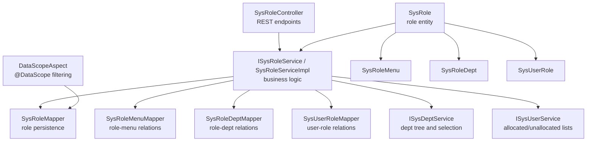
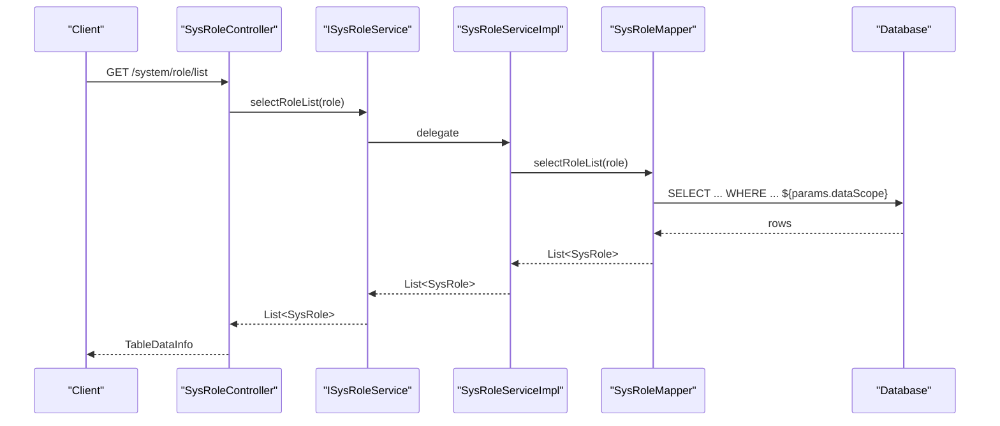
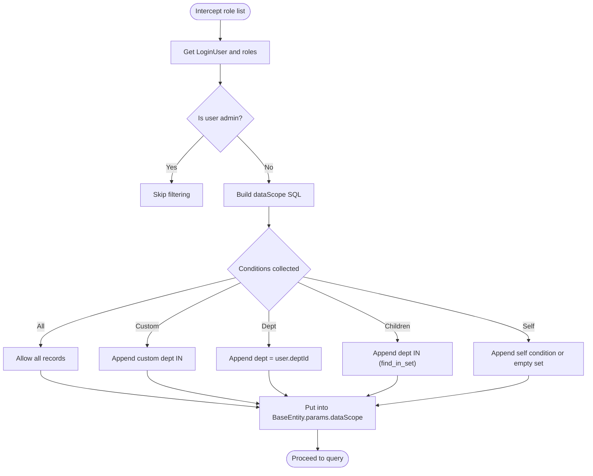

# Role Management API

<cite>
**Referenced Files in This Document**
- [SysRoleController.java](file://src/main/java/com/ruoyi/project/system/controller/SysRoleController.java)
- [ISysRoleService.java](file://src/main/java/com/ruoyi/project/system/service/ISysRoleService.java)
- [SysRoleServiceImpl.java](file://src/main/java/com/ruoyi/project/system/service/impl/SysRoleServiceImpl.java)
- [SysRole.java](file://src/main/java/com/ruoyi/project/system/domain/SysRole.java)
- [DataScopeAspect.java](file://src/main/java/com/ruoyi/framework/aspectj/DataScopeAspect.java)
- [DataScope.java](file://src/main/java/com/ruoyi/framework/aspectj/lang/annotation/DataScope.java)
- [SysRoleMapper.java](file://src/main/java/com/ruoyi/project/system/mapper/SysRoleMapper.java)
- [SysRoleMapper.xml](file://src/main/resources/mybatis/system/SysRoleMapper.xml)
- [SysRoleMenu.java](file://src/main/java/com/ruoyi/project/system/domain/SysRoleMenu.java)
- [SysRoleDept.java](file://src/main/java/com/ruoyi/project/system/domain/SysRoleDept.java)
- [SysUserRole.java](file://src/main/java/com/ruoyi/project/system/domain/SysUserRole.java)
- [SysPermissionService.java](file://src/main/java/com/ruoyi/framework/security/service/SysPermissionService.java)
- [ISysUserService.java](file://src/main/java/com/ruoyi/project/system/service/ISysUserService.java)
- [SysUserMapper.java](file://src/main/java/com/ruoyi/project/system/mapper/SysUserMapper.java)
- [messages.properties](file://src/main/resources/i18n/messages.properties)
- [ry_20250522.sql](file://sql/ry_20250522.sql)
</cite>

## Table of Contents
1. [Introduction](#introduction)
2. [Project Structure](#project-structure)
3. [Core Components](#core-components)
4. [Architecture Overview](#architecture-overview)
5. [Detailed Component Analysis](#detailed-component-analysis)
6. [Dependency Analysis](#dependency-analysis)
7. [Performance Considerations](#performance-considerations)
8. [Troubleshooting Guide](#troubleshooting-guide)
9. [Conclusion](#conclusion)
10. [Appendices](#appendices)

## Introduction
This document provides comprehensive API documentation for Role Management functionality. It covers role CRUD endpoints, permission assignment via menuIds and deptIds, data scope filtering via the @DataScope aspect, and user-role assignment endpoints. It also details validation rules for role names and keys, propagation of role changes to user permissions, and security constraints enforced by @PreAuthorize.

## Project Structure
Role Management spans the controller, service, domain, mapper, and aspect layers. The controller exposes REST endpoints under /system/role. The service layer implements business logic including role CRUD, data scope enforcement, and user-role assignment. The domain model defines role attributes and arrays for menuIds and deptIds. The @DataScope aspect enforces data scope filters during role list queries. MyBatis mappers persist and query roles and related associations.



**Diagram sources**
- [SysRoleController.java](file://src/main/java/com/ruoyi/project/system/controller/SysRoleController.java#L58-L261)
- [SysRoleServiceImpl.java](file://src/main/java/com/ruoyi/project/system/service/impl/SysRoleServiceImpl.java#L54-L335)
- [SysRoleMapper.java](file://src/main/java/com/ruoyi/project/system/mapper/SysRoleMapper.java#L1-L108)
- [DataScopeAspect.java](file://src/main/java/com/ruoyi/framework/aspectj/DataScopeAspect.java#L66-L170)
- [SysRole.java](file://src/main/java/com/ruoyi/project/system/domain/SysRole.java#L22-L241)
- [SysRoleMenu.java](file://src/main/java/com/ruoyi/project/system/domain/SysRoleMenu.java#L1-L47)
- [SysRoleDept.java](file://src/main/java/com/ruoyi/project/system/domain/SysRoleDept.java#L1-L47)
- [SysUserRole.java](file://src/main/java/com/ruoyi/project/system/domain/SysUserRole.java#L1-L46)

**Section sources**
- [SysRoleController.java](file://src/main/java/com/ruoyi/project/system/controller/SysRoleController.java#L58-L261)
- [SysRoleServiceImpl.java](file://src/main/java/com/ruoyi/project/system/service/impl/SysRoleServiceImpl.java#L54-L335)
- [SysRole.java](file://src/main/java/com/ruoyi/project/system/domain/SysRole.java#L22-L241)
- [DataScopeAspect.java](file://src/main/java/com/ruoyi/framework/aspectj/DataScopeAspect.java#L66-L170)

## Core Components
- REST Controller: Exposes role endpoints, applies @PreAuthorize checks, and delegates to services.
- Service Layer: Implements role CRUD, data scope validation, permission computation, and user-role assignment.
- Domain Model: Defines role attributes including roleKey, roleSort, dataScope, menuIds, deptIds, and permissions.
- Data Scope Aspect: Intercepts role list queries annotated with @DataScope and appends SQL filters based on user roles and dataScope.
- Mappers: Persist and query roles, menus, departments, and user-role relations.

**Section sources**
- [SysRoleController.java](file://src/main/java/com/ruoyi/project/system/controller/SysRoleController.java#L58-L261)
- [ISysRoleService.java](file://src/main/java/com/ruoyi/project/system/service/ISysRoleService.java#L1-L174)
- [SysRoleServiceImpl.java](file://src/main/java/com/ruoyi/project/system/service/impl/SysRoleServiceImpl.java#L54-L335)
- [SysRole.java](file://src/main/java/com/ruoyi/project/system/domain/SysRole.java#L22-L241)
- [DataScopeAspect.java](file://src/main/java/com/ruoyi/framework/aspectj/DataScopeAspect.java#L66-L170)

## Architecture Overview
The Role Management API follows a layered architecture:
- Controller layer handles HTTP requests and responses.
- Service layer encapsulates business rules, validation, and transaction boundaries.
- Persistence layer uses MyBatis mappers to interact with database tables for roles, role-menu, role-dept, and user-role relations.
- Security layer enforces permissions via @PreAuthorize and computes effective permissions via SysPermissionService.
- Data scope enforcement occurs via @DataScope aspect around role list queries.



**Diagram sources**
- [SysRoleController.java](file://src/main/java/com/ruoyi/project/system/controller/SysRoleController.java#L58-L65)
- [SysRoleServiceImpl.java](file://src/main/java/com/ruoyi/project/system/service/impl/SysRoleServiceImpl.java#L54-L59)
- [SysRoleMapper.xml](file://src/main/resources/mybatis/system/SysRoleMapper.xml#L33-L57)
- [DataScopeAspect.java](file://src/main/java/com/ruoyi/framework/aspectj/DataScopeAspect.java#L91-L170)

## Detailed Component Analysis

### Role CRUD Endpoints
- GET /system/role/list
  - Purpose: Paginated list of roles filtered by query criteria and data scope.
  - Security: @PreAuthorize("@ss.hasPermi('system:role:list')").
  - Request: Query parameters mapped to SysRole (e.g., roleName, roleKey, status).
  - Response: TableDataInfo containing rows and total count.
  - Data Scope: Enforced via @DataScope on selectRoleList; SQL appended via params.dataScope.

- POST /system/role
  - Purpose: Create a new role.
  - Security: @PreAuthorize("@ss.hasPermi('system:role:add')").
  - Request Body: SysRole with roleKey, roleSort, dataScope, menuIds, deptIds.
  - Validation: Unique role name and roleKey checked before insert.
  - Response: AjaxResult indicating success/failure.

- PUT /system/role
  - Purpose: Update an existing role.
  - Security: @PreAuthorize("@ss.hasPermi('system:role:edit')").
  - Request Body: SysRole with roleId and updated fields.
  - Validation: Unique role name and roleKey; admin role protection.
  - Behavior: Updates role, removes old role-menu relations, re-inserts from menuIds.
  - Response: AjaxResult; refreshes current user permissions if applicable.

- DELETE /system/role/{roleIds}
  - Purpose: Delete roles by IDs.
  - Security: @PreAuthorize("@ss.hasPermi('system:role:remove')").
  - Path Variable: roleIds (Long[]).
  - Behavior: Validates allowed roles and data scope; checks usage; deletes relations and role.

- GET /system/role/{roleId}
  - Purpose: Retrieve role details by ID.
  - Security: @PreAuthorize("@ss.hasPermi('system:role:query')").
  - Path Variable: roleId (Long).
  - Behavior: checkRoleDataScope(roleId) ensures access; returns role with associated permissions.

- PUT /system/role/dataScope
  - Purpose: Update data scope and associated departments for a role.
  - Security: @PreAuthorize("@ss.hasPermi('system:role:edit')").
  - Request Body: SysRole with roleId, dataScope, deptIds.
  - Behavior: Updates role and replaces role-dept relations with deptIds.

- PUT /system/role/changeStatus
  - Purpose: Toggle role status.
  - Security: @PreAuthorize("@ss.hasPermi('system:role:edit')").
  - Request Body: SysRole with roleId and status.
  - Behavior: Validates allowed role and data scope; updates status.

- GET /system/role/optionselect
  - Purpose: Fetch all roles for selection dropdowns.
  - Security: @PreAuthorize("@ss.hasPermi('system:role:query')").

- GET /system/role/deptTree/{roleId}
  - Purpose: Get department tree with checked keys for a role.
  - Security: @PreAuthorize("@ss.hasPermi('system:role:query')").
  - Response: AjaxResult with checkedKeys (deptIds) and depts (dept tree nodes).

- GET /system/role/authUser/allocatedList
  - Purpose: List users who are assigned a role (paginated).
  - Security: @PreAuthorize("@ss.hasPermi('system:role:list')").
  - Response: TableDataInfo.

- GET /system/role/authUser/unallocatedList
  - Purpose: List users who are not assigned a role (paginated).
  - Security: @PreAuthorize("@ss.hasPermi('system:role:list')").
  - Response: TableDataInfo.

- PUT /system/role/authUser/cancel
  - Purpose: Unassign a user from a role.
  - Security: @PreAuthorize("@ss.hasPermi('system:role:edit')").
  - Request Body: SysUserRole (userId, roleId).

- PUT /system/role/authUser/cancelAll
  - Purpose: Batch unassign users from a role.
  - Security: @PreAuthorize("@ss.hasPermi('system:role:edit')").
  - Request: roleId (Long), userIds (Long[]).

- PUT /system/role/authUser/selectAll
  - Purpose: Batch assign users to a role.
  - Security: @PreAuthorize("@ss.hasPermi('system:role:edit')").
  - Request: roleId (Long), userIds (Long[]).

**Section sources**
- [SysRoleController.java](file://src/main/java/com/ruoyi/project/system/controller/SysRoleController.java#L58-L261)
- [ISysUserService.java](file://src/main/java/com/ruoyi/project/system/service/ISysUserService.java#L1-L56)
- [SysUserMapper.java](file://src/main/java/com/ruoyi/project/system/mapper/SysUserMapper.java#L1-L57)

### Request/Response Schemas
- Role Entity (SysRole)
  - Fields: roleId, roleName, roleKey, roleSort, dataScope, menuCheckStrictly, deptCheckStrictly, status, delFlag, permissions, menuIds (Long[]), deptIds (Long[]).
  - Validation:
    - roleName: Not blank, length <= 30.
    - roleKey: Not blank, length <= 100.
    - roleSort: Not null.
  - Notes: Admin role detection via roleId equals 1.

- Role Creation Payload Example
  - Include: roleName, roleKey, roleSort, dataScope, menuIds[], deptIds[].
  - Example fields: roleName, roleKey, roleSort, dataScope, menuIds=[1001,1002], deptIds=[100,101].

- Role Update Payload Example
  - Include: roleId, roleName, roleKey, roleSort, dataScope, menuIds[], deptIds[].

- Data Scope Values
  - 1: All data
  - 2: Custom data scope
  - 3: Department only
  - 4: Department and children
  - 5: Self only

- Response
  - Standardized via AjaxResult for CRUD operations.
  - Lists via TableDataInfo for paginated results.

**Section sources**
- [SysRole.java](file://src/main/java/com/ruoyi/project/system/domain/SysRole.java#L97-L140)
- [SysRole.java](file://src/main/java/com/ruoyi/project/system/domain/SysRole.java#L192-L210)
- [SysRoleMapper.xml](file://src/main/resources/mybatis/system/SysRoleMapper.xml#L33-L57)
- [ry_20250522.sql](file://sql/ry_20250522.sql#L101-L121)

### Data Scope Filtering with @DataScope
- Annotation: @DataScope(deptAlias, userAlias, permission) controls SQL filter injection.
- Aspect behavior:
  - Clears previous params.dataScope to prevent injection.
  - Builds OR conditions based on user roles’ dataScope and status.
  - Supports multiple custom scopes via IN clauses.
  - Appends filter to BaseEntity.params.dataScope for MyBatis mapper consumption.
- Mapper usage:
  - SysRoleMapper.xml includes ${params.dataScope} in selectRoleList to apply filters.



**Diagram sources**
- [DataScopeAspect.java](file://src/main/java/com/ruoyi/framework/aspectj/DataScopeAspect.java#L66-L170)
- [SysRoleMapper.xml](file://src/main/resources/mybatis/system/SysRoleMapper.xml#L54-L57)

**Section sources**
- [DataScope.java](file://src/main/java/com/ruoyi/framework/aspectj/lang/annotation/DataScope.java#L1-L34)
- [DataScopeAspect.java](file://src/main/java/com/ruoyi/framework/aspectj/DataScopeAspect.java#L66-L170)
- [SysRoleMapper.xml](file://src/main/resources/mybatis/system/SysRoleMapper.xml#L54-L57)

### Permission Assignment Details
- Menu Permissions
  - On role creation/update, service inserts role-menu relations from role.menuIds.
  - On role deletion, service removes role-menu relations.

- Department Permissions (Data Scope)
  - On dataScope update, service replaces role-dept relations with role.deptIds.
  - Data scope determines visibility via @DataScope aspect.

- User-Role Assignment
  - Cancel single: PUT /system/role/authUser/cancel with SysUserRole payload.
  - Cancel batch: PUT /system/role/authUser/cancelAll with roleId and userIds[].
  - Assign batch: PUT /system/role/authUser/selectAll with roleId and userIds[].
  - Query assigned/unassigned users: GET /system/role/authUser/allocatedList and /unallocatedList.

**Section sources**
- [SysRoleServiceImpl.java](file://src/main/java/com/ruoyi/project/system/service/impl/SysRoleServiceImpl.java#L294-L335)
- [SysRoleServiceImpl.java](file://src/main/java/com/ruoyi/project/system/service/impl/SysRoleServiceImpl.java#L318-L335)
- [SysRoleController.java](file://src/main/java/com/ruoyi/project/system/controller/SysRoleController.java#L192-L249)
- [SysRoleMenu.java](file://src/main/java/com/ruoyi/project/system/domain/SysRoleMenu.java#L1-L47)
- [SysRoleDept.java](file://src/main/java/com/ruoyi/project/system/domain/SysRoleDept.java#L1-L47)
- [SysUserRole.java](file://src/main/java/com/ruoyi/project/system/domain/SysUserRole.java#L1-L46)

### Validation Rules for Role Names and Keys
- Role Name
  - Not blank.
  - Length constraint: <= 30 characters.
- Role Key
  - Not blank.
  - Length constraint: <= 100 characters.
- Role Sort
  - Not null.
- Additional checks:
  - Unique role name and roleKey enforced before insert/update.
  - Super-admin role cannot be edited or deleted.

**Section sources**
- [SysRole.java](file://src/main/java/com/ruoyi/project/system/domain/SysRole.java#L97-L140)
- [SysRoleServiceImpl.java](file://src/main/java/com/ruoyi/project/system/service/impl/SysRoleServiceImpl.java#L148-L176)
- [SysRoleServiceImpl.java](file://src/main/java/com/ruoyi/project/system/service/impl/SysRoleServiceImpl.java#L183-L190)

### How Role Changes Propagate to User Permissions
- On role edit, if the current user is not admin, the controller refreshes:
  - Reloads user profile.
  - Recomputes permissions via SysPermissionService.
  - Updates token with refreshed LoginUser.
- SysPermissionService:
  - Aggregates role permissions and menu permissions for non-admin users.
  - Sets role.permissions for data scope matching.

**Section sources**
- [SysRoleController.java](file://src/main/java/com/ruoyi/project/system/controller/SysRoleController.java#L129-L141)
- [SysPermissionService.java](file://src/main/java/com/ruoyi/framework/security/service/SysPermissionService.java#L37-L88)
- [SysRoleServiceImpl.java](file://src/main/java/com/ruoyi/project/system/service/impl/SysRoleServiceImpl.java#L92-L105)

### Security Constraints
- All endpoints are guarded by @PreAuthorize with permission strings:
  - system:role:list
  - system:role:export
  - system:role:query
  - system:role:add
  - system:role:edit
  - system:role:remove
- Data scope enforcement prevents unauthorized access to roles and their data.

**Section sources**
- [SysRoleController.java](file://src/main/java/com/ruoyi/project/system/controller/SysRoleController.java#L58-L261)
- [SysRoleServiceImpl.java](file://src/main/java/com/ruoyi/project/system/service/impl/SysRoleServiceImpl.java#L198-L213)

## Dependency Analysis
- Controller depends on ISysRoleService, ISysUserService, ISysDeptService, SysPermissionService, TokenService.
- Service depends on mappers for roles, role-menu, role-dept, and user-role relations.
- Domain models link roles to menus, departments, and users via association entities.
- DataScopeAspect depends on SecurityUtils, LoginUser, SysUser roles, and constants.

```mermaid
classDiagram
class SysRoleController {
+GET /list
+POST /
+PUT /
+DELETE /{roleIds}
+GET /{roleId}
+PUT /dataScope
+PUT /changeStatus
+GET /optionselect
+GET /authUser/allocatedList
+GET /authUser/unallocatedList
+PUT /authUser/cancel
+PUT /authUser/cancelAll
+PUT /authUser/selectAll
+GET /deptTree/{roleId}
}
class ISysRoleService {
+selectRoleList(role)
+insertRole(role)
+updateRole(role)
+authDataScope(role)
+deleteRoleByIds(roleIds)
+checkRoleNameUnique(role)
+checkRoleKeyUnique(role)
+checkRoleAllowed(role)
+checkRoleDataScope(roleIds)
}
class SysRoleServiceImpl
class SysRole
class SysRoleMenu
class SysRoleDept
class SysUserRole
class DataScopeAspect
class SysRoleMapper
class SysPermissionService
SysRoleController --> ISysRoleService : "uses"
SysRoleController --> SysPermissionService : "refreshes"
SysRoleController --> ISysUserService : "allocated/unallocated"
SysRoleController --> ISysDeptService : "deptTree"
SysRoleServiceImpl ..|> ISysRoleService
SysRoleServiceImpl --> SysRoleMapper : "persists"
SysRoleServiceImpl --> SysRoleMenu : "insertRoleMenu()"
SysRoleServiceImpl --> SysRoleDept : "authDataScope()"
SysRoleServiceImpl --> SysUserRole : "insertAuthUsers()"
SysRole ..> SysRoleMenu : "has menuIds"
SysRole ..> SysRoleDept : "has deptIds"
DataScopeAspect --> SysRoleMapper : "filters SQL"
SysPermissionService --> SysRole : "role.permissions"
```

**Diagram sources**
- [SysRoleController.java](file://src/main/java/com/ruoyi/project/system/controller/SysRoleController.java#L58-L261)
- [ISysRoleService.java](file://src/main/java/com/ruoyi/project/system/service/ISysRoleService.java#L1-L174)
- [SysRoleServiceImpl.java](file://src/main/java/com/ruoyi/project/system/service/impl/SysRoleServiceImpl.java#L54-L335)
- [SysRole.java](file://src/main/java/com/ruoyi/project/system/domain/SysRole.java#L22-L241)
- [SysRoleMenu.java](file://src/main/java/com/ruoyi/project/system/domain/SysRoleMenu.java#L1-L47)
- [SysRoleDept.java](file://src/main/java/com/ruoyi/project/system/domain/SysRoleDept.java#L1-L47)
- [SysUserRole.java](file://src/main/java/com/ruoyi/project/system/domain/SysUserRole.java#L1-L46)
- [DataScopeAspect.java](file://src/main/java/com/ruoyi/framework/aspectj/DataScopeAspect.java#L66-L170)
- [SysRoleMapper.java](file://src/main/java/com/ruoyi/project/system/mapper/SysRoleMapper.java#L1-L108)
- [SysPermissionService.java](file://src/main/java/com/ruoyi/framework/security/service/SysPermissionService.java#L37-L88)

**Section sources**
- [SysRoleController.java](file://src/main/java/com/ruoyi/project/system/controller/SysRoleController.java#L58-L261)
- [SysRoleServiceImpl.java](file://src/main/java/com/ruoyi/project/system/service/impl/SysRoleServiceImpl.java#L54-L335)
- [SysRole.java](file://src/main/java/com/ruoyi/project/system/domain/SysRole.java#L22-L241)
- [DataScopeAspect.java](file://src/main/java/com/ruoyi/framework/aspectj/DataScopeAspect.java#L66-L170)

## Performance Considerations
- Data scope filtering uses IN clauses for multiple custom roles to minimize repeated joins.
- Role list queries leverage distinct and parameterized LIKE conditions to avoid unnecessary scans.
- Transactional boundaries for role updates ensure referential integrity and reduce orphaned relations.
- Consider indexing role_name, role_key, and role_id for improved query performance.

[No sources needed since this section provides general guidance]

## Troubleshooting Guide
- Duplicate Role Name or Key
  - Symptom: Insert/Update fails with uniqueness error.
  - Resolution: Change roleName or roleKey to unique values.

- Attempt to Edit/Delete Admin Role
  - Symptom: ServiceException indicating admin role cannot be operated.
  - Resolution: Do not target the built-in admin role.

- Unauthorized Access to Role Data
  - Symptom: Error when accessing role details or listing roles.
  - Resolution: Ensure user has appropriate permissions and belongs to allowed data scope.

- No Data Returned Due to Data Scope
  - Symptom: Empty role list despite existing roles.
  - Resolution: Verify dataScope configuration and user’s department/roles.

- Permission Propagation Not Immediate
  - Symptom: User still sees old permissions after role edit.
  - Resolution: Current user session is refreshed; log out/in or wait for token refresh.

**Section sources**
- [SysRoleServiceImpl.java](file://src/main/java/com/ruoyi/project/system/service/impl/SysRoleServiceImpl.java#L183-L190)
- [SysRoleServiceImpl.java](file://src/main/java/com/ruoyi/project/system/service/impl/SysRoleServiceImpl.java#L360-L379)
- [DataScopeAspect.java](file://src/main/java/com/ruoyi/framework/aspectj/DataScopeAspect.java#L155-L169)
- [messages.properties](file://src/main/resources/i18n/messages.properties#L32-L39)

## Conclusion
The Role Management API provides robust CRUD operations for roles, integrates menu and department permissions, enforces data scope via @DataScope, and propagates permission changes to users. Security is enforced through @PreAuthorize and role validation. The design cleanly separates concerns across controller, service, domain, and persistence layers, enabling maintainable and secure role administration.

[No sources needed since this section summarizes without analyzing specific files]

## Appendices

### Endpoint Reference Summary
- GET /system/role/list
- POST /system/role
- PUT /system/role
- DELETE /system/role/{roleIds}
- GET /system/role/{roleId}
- PUT /system/role/dataScope
- PUT /system/role/changeStatus
- GET /system/role/optionselect
- GET /system/role/deptTree/{roleId}
- GET /system/role/authUser/allocatedList
- GET /system/role/authUser/unallocatedList
- PUT /system/role/authUser/cancel
- PUT /system/role/authUser/cancelAll
- PUT /system/role/authUser/selectAll

**Section sources**
- [SysRoleController.java](file://src/main/java/com/ruoyi/project/system/controller/SysRoleController.java#L58-L261)

### Database Schema Highlights
- sys_role: role_id, role_name, role_key, role_sort, data_scope, status, etc.
- sys_role_dept: role_id, dept_id (many-to-many).
- sys_role_menu: role_id, menu_id (many-to-many).
- sys_user_role: user_id, role_id (many-to-many).

**Section sources**
- [ry_20250522.sql](file://sql/ry_20250522.sql#L101-L121)
- [ry_20250522.sql](file://sql/ry_20250522.sql#L380-L396)