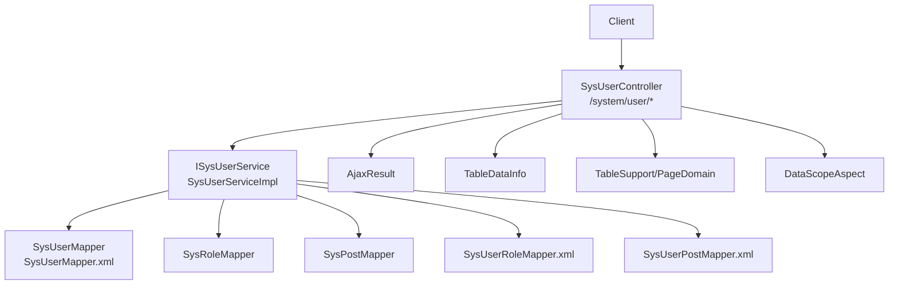
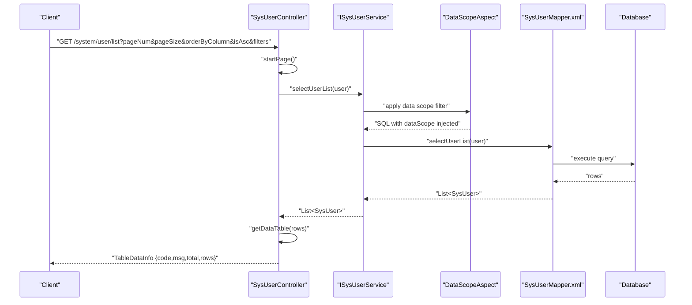

# User Management API

<cite>
**Referenced Files in This Document**
- [SysUserController.java](file://src/main/java/com/ruoyi/project/system/controller/SysUserController.java)
- [SysUser.java](file://src/main/java/com/ruoyi/project/system/domain/SysUser.java)
- [ISysUserService.java](file://src/main/java/com/ruoyi/project/system/service/ISysUserService.java)
- [SysUserMapper.java](file://src/main/java/com/ruoyi/project/system/mapper/SysUserMapper.java)
- [SysUserMapper.xml](file://src/main/resources/mybatis/system/SysUserMapper.xml)
- [SysUserServiceImpl.java](file://src/main/java/com/ruoyi/project/system/service/impl/SysUserServiceImpl.java)
- [BaseController.java](file://src/main/java/com/ruoyi/framework/web/controller/BaseController.java)
- [TableSupport.java](file://src/main/java/com/ruoyi/framework/web/page/TableSupport.java)
- [PageDomain.java](file://src/main/java/com/ruoyi/framework/web/page/PageDomain.java)
- [TableDataInfo.java](file://src/main/java/com/ruoyi/framework/web/page/TableDataInfo.java)
- [AjaxResult.java](file://src/main/java/com/ruoyi/framework/web/domain/AjaxResult.java)
- [SysRole.java](file://src/main/java/com/ruoyi/project/system/domain/SysRole.java)
- [SysPost.java](file://src/main/java/com/ruoyi/project/system/domain/SysPost.java)
- [DataScopeAspect.java](file://src/main/java/com/ruoyi/framework/aspectj/DataScopeAspect.java)
- [DataScope.java](file://src/main/java/com/ruoyi/framework/aspectj/lang/annotation/DataScope.java)
- [SysUserRoleMapper.xml](file://src/main/resources/mybatis/system/SysUserRoleMapper.xml)
- [SysUserPostMapper.xml](file://src/main/resources/mybatis/system/SysUserPostMapper.xml)
</cite>

## Table of Contents
1. [Introduction](#introduction)
2. [Project Structure](#project-structure)
3. [Core Components](#core-components)
4. [Architecture Overview](#architecture-overview)
5. [Detailed Component Analysis](#detailed-component-analysis)
6. [Dependency Analysis](#dependency-analysis)
7. [Performance Considerations](#performance-considerations)
8. [Troubleshooting Guide](#troubleshooting-guide)
9. [Conclusion](#conclusion)
10. [Appendices](#appendices)

## Introduction
This document provides comprehensive API documentation for User Management endpoints in the system. It covers the endpoints GET /system/user/list, POST /system/user, PUT /system/user, DELETE /system/user/{userIds}, and GET /system/user/{userId}. It specifies pagination and filtering query parameters, request body schema for user creation and editing, response structures including role, department, and post associations, permission requirements using @PreAuthorize annotations, examples of user data payloads and error responses for constraint violations, data scope filters based on role permissions, password reset, status modification, and batch operations. It also includes usage examples for common scenarios such as user search, role assignment, and profile updates.

## Project Structure
The User Management API is implemented as a Spring MVC REST controller with a layered architecture:
- Controller layer: exposes HTTP endpoints under /system/user
- Service layer: business logic for user CRUD, validation, and data scope enforcement
- Mapper layer: MyBatis mappers for database operations
- Domain models: SysUser, SysRole, SysPost define entity structures and associations
- Web utilities: BaseController, TableSupport, PageDomain, TableDataInfo, AjaxResult standardize request handling, pagination, and response formats
- Data scope filtering: DataScopeAspect applies role-based data scope filters to queries



**Diagram sources**
- [SysUserController.java](file://src/main/java/com/ruoyi/project/system/controller/SysUserController.java#L41-L256)
- [ISysUserService.java](file://src/main/java/com/ruoyi/project/system/service/ISysUserService.java#L1-L218)
- [SysUserMapper.java](file://src/main/java/com/ruoyi/project/system/mapper/SysUserMapper.java#L1-L148)
- [SysUserMapper.xml](file://src/main/resources/mybatis/system/SysUserMapper.xml#L64-L94)
- [SysUserServiceImpl.java](file://src/main/java/com/ruoyi/project/system/service/impl/SysUserServiceImpl.java#L70-L106)
- [AjaxResult.java](file://src/main/java/com/ruoyi/framework/web/domain/AjaxResult.java#L1-L217)
- [TableDataInfo.java](file://src/main/java/com/ruoyi/framework/web/page/TableDataInfo.java#L1-L85)
- [TableSupport.java](file://src/main/java/com/ruoyi/framework/web/page/TableSupport.java#L1-L57)
- [PageDomain.java](file://src/main/java/com/ruoyi/framework/web/page/PageDomain.java#L1-L102)
- [DataScopeAspect.java](file://src/main/java/com/ruoyi/framework/aspectj/DataScopeAspect.java#L1-L139)

**Section sources**
- [SysUserController.java](file://src/main/java/com/ruoyi/project/system/controller/SysUserController.java#L41-L256)
- [SysUserServiceImpl.java](file://src/main/java/com/ruoyi/project/system/service/impl/SysUserServiceImpl.java#L70-L106)

## Core Components
- SysUserController: Exposes REST endpoints for user management, handles pagination, filtering, validation, and permission checks.
- ISysUserService: Defines user business operations including CRUD, uniqueness checks, data scope validation, and batch operations.
- SysUserServiceImpl: Implements user operations with data scope filtering via @DataScope, transactional batch deletes, and role/post associations.
- SysUserMapper and SysUserMapper.xml: Provide SQL queries for user listing with dynamic filters and data scope injection.
- Domain models: SysUser, SysRole, SysPost define fields and associations used in requests and responses.
- Web utilities: BaseController standardizes pagination and response helpers; AjaxResult and TableDataInfo standardize JSON responses.

**Section sources**
- [SysUserController.java](file://src/main/java/com/ruoyi/project/system/controller/SysUserController.java#L41-L256)
- [ISysUserService.java](file://src/main/java/com/ruoyi/project/system/service/ISysUserService.java#L1-L218)
- [SysUserServiceImpl.java](file://src/main/java/com/ruoyi/project/system/service/impl/SysUserServiceImpl.java#L70-L106)
- [SysUserMapper.java](file://src/main/java/com/ruoyi/project/system/mapper/SysUserMapper.java#L1-L148)
- [SysUserMapper.xml](file://src/main/resources/mybatis/system/SysUserMapper.xml#L64-L94)
- [SysUser.java](file://src/main/java/com/ruoyi/project/system/domain/SysUser.java#L1-L341)
- [SysRole.java](file://src/main/java/com/ruoyi/project/system/domain/SysRole.java#L1-L242)
- [SysPost.java](file://src/main/java/com/ruoyi/project/system/domain/SysPost.java#L1-L125)
- [BaseController.java](file://src/main/java/com/ruoyi/framework/web/controller/BaseController.java#L50-L91)
- [AjaxResult.java](file://src/main/java/com/ruoyi/framework/web/domain/AjaxResult.java#L1-L217)
- [TableDataInfo.java](file://src/main/java/com/ruoyi/framework/web/page/TableDataInfo.java#L1-L85)

## Architecture Overview
The User Management API follows a layered architecture:
- Controllers accept HTTP requests and delegate to services.
- Services enforce business rules, validate inputs, and apply data scope filters.
- Mappers execute SQL queries with dynamic filters and injected data scope conditions.
- Responses are standardized using AjaxResult and TableDataInfo.



**Diagram sources**
- [SysUserController.java](file://src/main/java/com/ruoyi/project/system/controller/SysUserController.java#L57-L66)
- [BaseController.java](file://src/main/java/com/ruoyi/framework/web/controller/BaseController.java#L50-L91)
- [SysUserServiceImpl.java](file://src/main/java/com/ruoyi/project/system/service/impl/SysUserServiceImpl.java#L70-L80)
- [DataScopeAspect.java](file://src/main/java/com/ruoyi/framework/aspectj/DataScopeAspect.java#L66-L139)
- [SysUserMapper.xml](file://src/main/resources/mybatis/system/SysUserMapper.xml#L64-L94)

## Detailed Component Analysis

### Endpoint: GET /system/user/list
- Purpose: Retrieve paginated and filtered user list with role, department, and post associations.
- Path: /system/user/list
- Method: GET
- Permissions: system:user:list
- Query parameters:
  - Pagination: pageNum, pageSize, orderByColumn, isAsc, reasonable
  - Filters: userId, userName, status, phonenumber, beginTime, endTime, deptId
- Response: TableDataInfo with code, msg, total, rows
  - rows: List of SysUser entries
  - Each SysUser includes associated SysRole and SysPost arrays via roleIds and postIds
- Data scope: Applies role-based data scope filtering automatically via @DataScope on service method.

Example request:
- GET /system/user/list?pageNum=1&pageSize=10&orderByColumn=createTime&isAsc=desc&userName=tom&deptId=10

Response structure:
- code: SUCCESS
- msg: "query success"
- total: integer
- rows: array of user objects with embedded roles and posts

**Section sources**
- [SysUserController.java](file://src/main/java/com/ruoyi/project/system/controller/SysUserController.java#L57-L66)
- [TableSupport.java](file://src/main/java/com/ruoyi/framework/web/page/TableSupport.java#L1-L57)
- [PageDomain.java](file://src/main/java/com/ruoyi/framework/web/page/PageDomain.java#L1-L102)
- [SysUserMapper.xml](file://src/main/resources/mybatis/system/SysUserMapper.xml#L64-L94)
- [SysUserServiceImpl.java](file://src/main/java/com/ruoyi/project/system/service/impl/SysUserServiceImpl.java#L70-L80)
- [TableDataInfo.java](file://src/main/java/com/ruoyi/framework/web/page/TableDataInfo.java#L1-L85)

### Endpoint: POST /system/user
- Purpose: Create a new user.
- Path: /system/user
- Method: POST
- Permissions: system:user:add
- Request body: SysUser
  - Required: userName, nickName, email, phonenumber, sex, deptId
  - Optional: roleIds, postIds, status, remark
  - Password is required and encrypted server-side
- Validation:
  - Unique constraints: userName, email, phonenumber
  - Size and format constraints enforced by annotations on SysUser fields
- Response: AjaxResult indicating success or error

Request body schema (SysUser):
- userId: number
- deptId: number
- userName: string
- nickName: string
- email: string
- phonenumber: string
- sex: string
- avatar: string
- password: string
- status: string
- delFlag: string
- loginIp: string
- loginDate: datetime
- pwdUpdateDate: datetime
- roleIds: array<number>
- postIds: array<number>
- roleId: number

Example payload:
{
  "userName": "alice",
  "nickName": "Alice",
  "email": "alice@example.com",
  "phonenumber": "13800001111",
  "sex": "0",
  "deptId": 10,
  "roleIds": [2, 3],
  "postIds": [1],
  "status": "0",
  "password": "TempPass123!"
}

Error responses:
- Duplicate userName/email/phonenumber: error message indicating duplication
- Validation failures: error message with validation details

**Section sources**
- [SysUserController.java](file://src/main/java/com/ruoyi/project/system/controller/SysUserController.java#L119-L144)
- [SysUser.java](file://src/main/java/com/ruoyi/project/system/domain/SysUser.java#L136-L213)
- [ISysUserService.java](file://src/main/java/com/ruoyi/project/system/service/ISysUserService.java#L70-L92)
- [SysUserMapper.java](file://src/main/java/com/ruoyi/project/system/mapper/SysUserMapper.java#L130-L147)
- [AjaxResult.java](file://src/main/java/com/ruoyi/framework/web/domain/AjaxResult.java#L133-L171)

### Endpoint: PUT /system/user
- Purpose: Update an existing user.
- Path: /system/user
- Method: PUT
- Permissions: system:user:edit
- Request body: SysUser with userId set
- Validation:
  - Unique constraints: userName, email, phonenumber (excluding current user)
  - Size and format constraints enforced by annotations on SysUser fields
- Response: AjaxResult indicating success or error

Request body schema (SysUser):
- userId: number (required)
- deptId: number
- userName: string
- nickName: string
- email: string
- phonenumber: string
- sex: string
- avatar: string
- password: string (optional)
- status: string
- delFlag: string
- loginIp: string
- loginDate: datetime
- pwdUpdateDate: datetime
- roleIds: array<number>
- postIds: array<number>
- roleId: number

Example payload:
{
  "userId": 101,
  "nickName": "Alice Updated",
  "email": "alice.updated@example.com",
  "phonenumber": "13800001112",
  "deptId": 11,
  "roleIds": [2],
  "postIds": [1],
  "status": "1"
}

Error responses:
- Duplicate userName/email/phonenumber: error message indicating duplication
- Validation failures: error message with validation details

**Section sources**
- [SysUserController.java](file://src/main/java/com/ruoyi/project/system/controller/SysUserController.java#L146-L172)
- [SysUser.java](file://src/main/java/com/ruoyi/project/system/domain/SysUser.java#L136-L213)
- [ISysUserService.java](file://src/main/java/com/ruoyi/project/system/service/ISysUserService.java#L70-L92)
- [SysUserMapper.java](file://src/main/java/com/ruoyi/project/system/mapper/SysUserMapper.java#L130-L147)
- [AjaxResult.java](file://src/main/java/com/ruoyi/framework/web/domain/AjaxResult.java#L133-L171)

### Endpoint: DELETE /system/user/{userIds}
- Purpose: Delete one or more users (batch delete).
- Path: /system/user/{userIds}
- Method: DELETE
- Permissions: system:user:remove
- Path variable: userIds (array of numbers)
- Constraints:
  - Cannot delete the currently authenticated user
- Response: AjaxResult indicating success or error

Example request:
- DELETE /system/user/101,102,103

Error responses:
- Attempting to delete self: error message indicating self deletion is not allowed

Batch operations:
- Supports multiple user IDs in path
- Internally validates each user against allowed and data scope rules before deletion

**Section sources**
- [SysUserController.java](file://src/main/java/com/ruoyi/project/system/controller/SysUserController.java#L174-L187)
- [SysUserServiceImpl.java](file://src/main/java/com/ruoyi/project/system/service/impl/SysUserServiceImpl.java#L470-L489)
- [SysUserRoleMapper.xml](file://src/main/resources/mybatis/system/SysUserRoleMapper.xml#L1-L44)
- [SysUserPostMapper.xml](file://src/main/resources/mybatis/system/SysUserPostMapper.xml#L1-L34)

### Endpoint: GET /system/user/{userId}
- Purpose: Retrieve detailed user information including roles and posts.
- Path: /system/user or /system/user/{userId}
- Method: GET
- Permissions: system:user:query
- Path variable: userId (optional)
- Response: AjaxResult with:
  - data: SysUser object
  - postIds: array<number> of assigned posts
  - roleIds: array<number> of assigned roles
  - roles: array of SysRole objects (admin users can see all roles; non-admins excluded admin roles)
  - posts: array of SysPost objects

Example response:
{
  "code": 200,
  "msg": "success",
  "data": {
    "userId": 101,
    "userName": "alice",
    "nickName": "Alice",
    "email": "alice@example.com",
    "phonenumber": "13800001111",
    "deptId": 10,
    "status": "0"
  },
  "postIds": [1],
  "roleIds": [2],
  "roles": [...],
  "posts": [...]
}

**Section sources**
- [SysUserController.java](file://src/main/java/com/ruoyi/project/system/controller/SysUserController.java#L97-L117)
- [SysUser.java](file://src/main/java/com/ruoyi/project/system/domain/SysUser.java#L265-L340)
- [SysRole.java](file://src/main/java/com/ruoyi/project/system/domain/SysRole.java#L1-L242)
- [SysPost.java](file://src/main/java/com/ruoyi/project/system/domain/SysPost.java#L1-L125)

### Additional Endpoints

#### Reset Password: PUT /system/user/resetPwd
- Purpose: Reset a user’s password.
- Path: /system/user/resetPwd
- Method: PUT
- Permissions: system:user:resetPwd
- Request body: SysUser with userId and new password
- Response: AjaxResult indicating success or error

**Section sources**
- [SysUserController.java](file://src/main/java/com/ruoyi/project/system/controller/SysUserController.java#L190-L202)

#### Change Status: PUT /system/user/changeStatus
- Purpose: Modify a user’s status (enable/disable).
- Path: /system/user/changeStatus
- Method: PUT
- Permissions: system:user:edit
- Request body: SysUser with userId and status
- Response: AjaxResult indicating success or error

**Section sources**
- [SysUserController.java](file://src/main/java/com/ruoyi/project/system/controller/SysUserController.java#L204-L216)

#### Assign Roles: PUT /system/user/authRole
- Purpose: Assign roles to a user.
- Path: /system/user/authRole
- Method: PUT
- Permissions: system:user:edit
- Request body: userId and roleIds
- Response: AjaxResult indicating success or error

**Section sources**
- [SysUserController.java](file://src/main/java/com/ruoyi/project/system/controller/SysUserController.java#L233-L245)

#### Get Available Roles for Assignment: GET /system/user/authRole/{userId}
- Purpose: Retrieve roles available for assignment to a user.
- Path: /system/user/authRole/{userId}
- Method: GET
- Permissions: system:user:query
- Response: AjaxResult with user and roles (admin users can see all roles; non-admins excluded admin roles)

**Section sources**
- [SysUserController.java](file://src/main/java/com/ruoyi/project/system/controller/SysUserController.java#L218-L232)

## Dependency Analysis
- Controller depends on services for business logic and on AjaxResult/TableDataInfo for responses.
- Service layer applies @DataScope to enforce data scope filters and delegates to mappers.
- DataScopeAspect dynamically constructs SQL conditions based on user roles and dataScope values.
- Mappers use dynamic SQL with filters and inject dataScope conditions.

```mermaid
classDiagram
class SysUserController {
+GET /system/user/list
+POST /system/user
+PUT /system/user
+DELETE /system/user/{userIds}
+GET /system/user/{userId}
+PUT /system/user/resetPwd
+PUT /system/user/changeStatus
+GET /system/user/authRole/{userId}
+PUT /system/user/authRole
}
class ISysUserService {
+selectUserList(user)
+insertUser(user)
+updateUser(user)
+deleteUserByIds(userIds)
+checkUserDataScope(userId)
}
class SysUserServiceImpl {
+@DataScope(deptAlias,userAlias)
+selectUserList(user)
+deleteUserByIds(userIds)
}
class DataScopeAspect {
+dataScopeFilter(joinPoint,user,deptAlias,userAlias,permission)
}
class SysUserMapper {
+selectUserList(user)
}
class AjaxResult
class TableDataInfo
SysUserController --> ISysUserService : "calls"
ISysUserService <|.. SysUserServiceImpl : "implements"
SysUserServiceImpl --> DataScopeAspect : "applies"
SysUserServiceImpl --> SysUserMapper : "delegates"
SysUserController --> AjaxResult : "returns"
SysUserController --> TableDataInfo : "returns"
```

**Diagram sources**
- [SysUserController.java](file://src/main/java/com/ruoyi/project/system/controller/SysUserController.java#L41-L256)
- [ISysUserService.java](file://src/main/java/com/ruoyi/project/system/service/ISysUserService.java#L1-L218)
- [SysUserServiceImpl.java](file://src/main/java/com/ruoyi/project/system/service/impl/SysUserServiceImpl.java#L70-L106)
- [DataScopeAspect.java](file://src/main/java/com/ruoyi/framework/aspectj/DataScopeAspect.java#L66-L139)
- [SysUserMapper.java](file://src/main/java/com/ruoyi/project/system/mapper/SysUserMapper.java#L1-L148)
- [AjaxResult.java](file://src/main/java/com/ruoyi/framework/web/domain/AjaxResult.java#L1-L217)
- [TableDataInfo.java](file://src/main/java/com/ruoyi/framework/web/page/TableDataInfo.java#L1-L85)

**Section sources**
- [SysUserController.java](file://src/main/java/com/ruoyi/project/system/controller/SysUserController.java#L41-L256)
- [SysUserServiceImpl.java](file://src/main/java/com/ruoyi/project/system/service/impl/SysUserServiceImpl.java#L70-L106)
- [DataScopeAspect.java](file://src/main/java/com/ruoyi/framework/aspectj/DataScopeAspect.java#L66-L139)

## Performance Considerations
- Pagination: Uses PageHelper via BaseController.startPage() and TableSupport to efficiently paginate results.
- Sorting: Supports orderByColumn and isAsc parameters; sorting is sanitized and escaped to prevent SQL injection.
- Data scope filtering: Applies SQL conditions based on role dataScope to limit result sets early in the query.
- Batch operations: Batch delete uses bulk SQL statements to minimize round trips.

[No sources needed since this section provides general guidance]

## Troubleshooting Guide
Common issues and resolutions:
- Constraint violations:
  - Duplicate userName/email/phonenumber: Controller returns error with details; adjust input values.
  - Validation errors: SysUser annotations enforce size/format; fix payload accordingly.
- Self deletion attempt:
  - DELETE /system/user/{userIds} rejects deleting the current user; avoid passing the authenticated user ID.
- Data scope filtering:
  - Queries return only permitted records based on role dataScope; if results are empty, verify role permissions and deptId filters.
- Error responses:
  - All endpoints return AjaxResult with code and msg; inspect msg for detailed error information.

**Section sources**
- [SysUserController.java](file://src/main/java/com/ruoyi/project/system/controller/SysUserController.java#L119-L144)
- [SysUserController.java](file://src/main/java/com/ruoyi/project/system/controller/SysUserController.java#L146-L172)
- [SysUserController.java](file://src/main/java/com/ruoyi/project/system/controller/SysUserController.java#L174-L187)
- [AjaxResult.java](file://src/main/java/com/ruoyi/framework/web/domain/AjaxResult.java#L133-L171)

## Conclusion
The User Management API provides robust CRUD operations with strong validation, permission enforcement, and data scope filtering. It supports pagination, filtering, role and post assignments, password reset, status modification, and batch operations. Responses are standardized for easy consumption by clients.

[No sources needed since this section summarizes without analyzing specific files]

## Appendices

### API Definitions

- GET /system/user/list
  - Permissions: system:user:list
  - Query parameters: pageNum, pageSize, orderByColumn, isAsc, reasonable, userId, userName, status, phonenumber, beginTime, endTime, deptId
  - Response: TableDataInfo {code, msg, total, rows}

- POST /system/user
  - Permissions: system:user:add
  - Request body: SysUser
  - Response: AjaxResult {code, msg, data}

- PUT /system/user
  - Permissions: system:user:edit
  - Request body: SysUser with userId
  - Response: AjaxResult {code, msg, data}

- DELETE /system/user/{userIds}
  - Permissions: system:user:remove
  - Path variable: userIds (array)
  - Response: AjaxResult {code, msg, data}

- GET /system/user/{userId}
  - Permissions: system:user:query
  - Response: AjaxResult {code, msg, data, postIds, roleIds, roles, posts}

- PUT /system/user/resetPwd
  - Permissions: system:user:resetPwd
  - Request body: SysUser with userId and password
  - Response: AjaxResult {code, msg, data}

- PUT /system/user/changeStatus
  - Permissions: system:user:edit
  - Request body: SysUser with userId and status
  - Response: AjaxResult {code, msg, data}

- PUT /system/user/authRole
  - Permissions: system:user:edit
  - Request body: userId, roleIds
  - Response: AjaxResult {code, msg, data}

- GET /system/user/authRole/{userId}
  - Permissions: system:user:query
  - Response: AjaxResult {code, msg, user, roles}

### Data Scope Filtering Behavior
- DataScopeAspect applies SQL conditions based on role.dataScope:
  - All data: no restriction
  - Custom: restricts by departments linked to selected roles
  - Department: restricts by current user’s department
  - Department and below: restricts by current user’s department and descendants
  - Self: restricts by current user’s ID
- The injected condition is appended to the SQL via ${params.dataScope} in SysUserMapper.xml.

**Section sources**
- [DataScopeAspect.java](file://src/main/java/com/ruoyi/framework/aspectj/DataScopeAspect.java#L66-L139)
- [SysUserMapper.xml](file://src/main/resources/mybatis/system/SysUserMapper.xml#L82-L87)
- [SysRole.java](file://src/main/java/com/ruoyi/project/system/domain/SysRole.java#L38-L41)

### Usage Examples

- User search:
  - GET /system/user/list?pageNum=1&pageSize=20&orderByColumn=createTime&isAsc=desc&userName=tom&deptId=10
  - Response: TableDataInfo with matching users

- Role assignment:
  - PUT /system/user/authRole with {userId: 101, roleIds: [2,3]}
  - Response: success

- Profile update:
  - PUT /system/user with {userId: 101, nickName: "Updated Name", email: "updated@example.com"}
  - Response: success

- Password reset:
  - PUT /system/user/resetPwd with {userId: 101, password: "NewSecurePass!"}
  - Response: success

- Status modification:
  - PUT /system/user/changeStatus with {userId: 101, status: "1"}
  - Response: success

- Batch delete:
  - DELETE /system/user/101,102,103
  - Response: success

**Section sources**
- [SysUserController.java](file://src/main/java/com/ruoyi/project/system/controller/SysUserController.java#L57-L66)
- [SysUserController.java](file://src/main/java/com/ruoyi/project/system/controller/SysUserController.java#L119-L144)
- [SysUserController.java](file://src/main/java/com/ruoyi/project/system/controller/SysUserController.java#L146-L172)
- [SysUserController.java](file://src/main/java/com/ruoyi/project/system/controller/SysUserController.java#L174-L187)
- [SysUserController.java](file://src/main/java/com/ruoyi/project/system/controller/SysUserController.java#L190-L202)
- [SysUserController.java](file://src/main/java/com/ruoyi/project/system/controller/SysUserController.java#L204-L216)
- [SysUserController.java](file://src/main/java/com/ruoyi/project/system/controller/SysUserController.java#L233-L245)