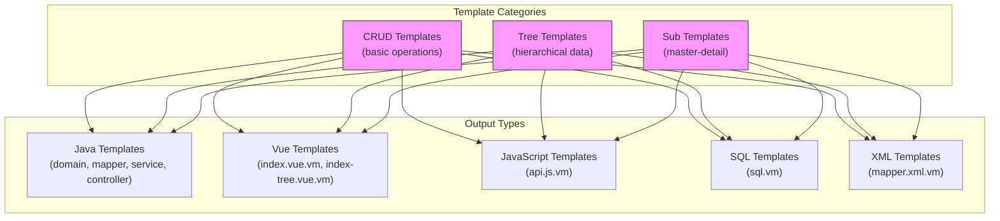
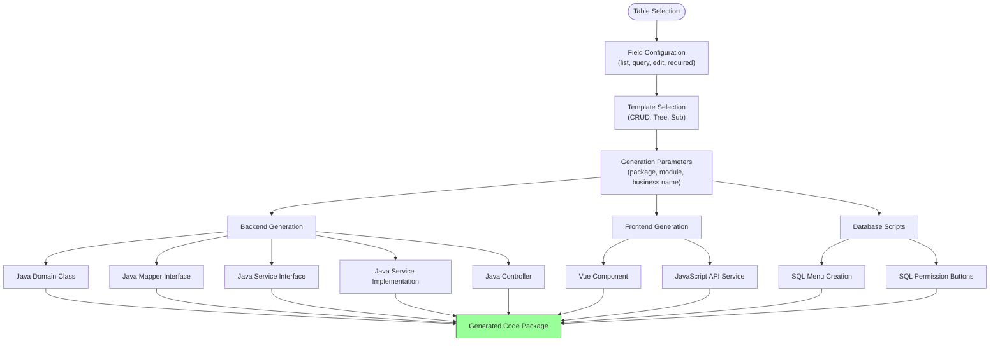
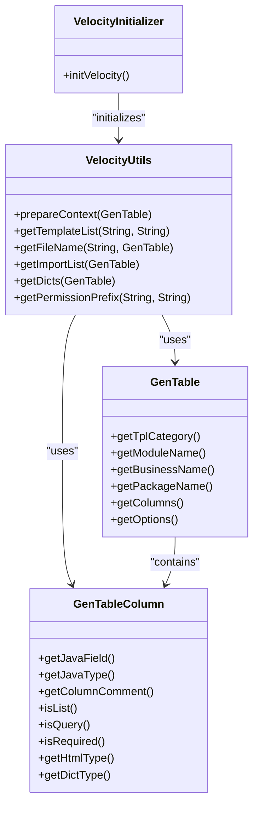
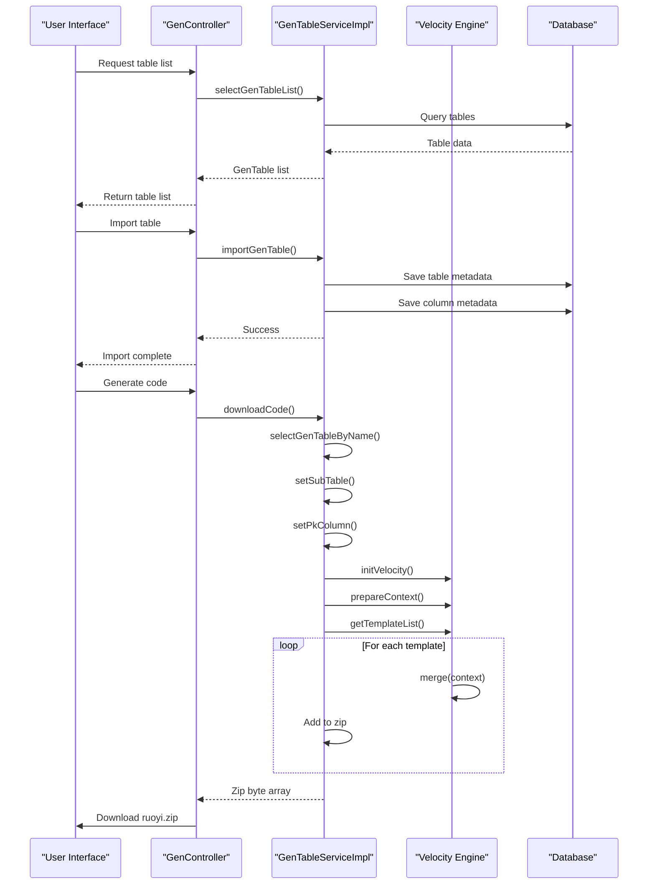

# Code Generation

<cite>
**Referenced Files in This Document**   
- [GenConfig.java](file://src/main/java/com/ruoyi/framework/config/GenConfig.java)
- [GenConstants.java](file://src/main/java/com/ruoyi/common/constant/GenConstants.java)
- [GenController.java](file://src/main/java/com/ruoyi/project/tool/gen/controller/GenController.java)
- [GenTableServiceImpl.java](file://src/main/java/com/ruoyi/project/tool/gen/service/GenTableServiceImpl.java)
- [GenTable.java](file://src/main/java/com/ruoyi/project/tool/gen/domain/GenTable.java)
- [GenTableColumn.java](file://src/main/java/com/ruoyi/project/tool/gen/domain/GenTableColumn.java)
- [VelocityUtils.java](file://src/main/java/com/ruoyi/project/tool/gen/util/VelocityUtils.java)
- [VelocityInitializer.java](file://src/main/java/com/ruoyi/project/tool/gen/util/VelocityInitializer.java)
- [controller.java.vm](file://src/main/resources/vm/java/controller.java.vm)
- [domain.java.vm](file://src/main/resources/vm/java/domain.java.vm)
- [mapper.java.vm](file://src/main/resources/vm/java/mapper.java.vm)
- [service.java.vm](file://src/main/resources/vm/java/service.java.vm)
- [serviceImpl.java.vm](file://src/main/resources/vm/java/serviceImpl.java.vm)
- [mapper.xml.vm](file://src/main/resources/vm/xml/mapper.xml.vm)
- [api.js.vm](file://src/main/resources/vm/js/api.js.vm)
- [index.vue.vm](file://src/main/resources/vm/vue/index.vue.vm)
- [index-tree.vue.vm](file://src/main/resources/vm/vue/index-tree.vue.vm)
- [sub-domain.java.vm](file://src/main/resources/vm/java/sub-domain.java.vm)
- [sql.vm](file://src/main/resources/vm/sql/sql.vm)
- [application.yml](file://src/main/resources/application.yml)
</cite>

## Table of Contents
1. [Configuration Options](#configuration-options)
2. [Template Management](#template-management)
3. [Code Generation Process](#code-generation-process)
4. [Output Generation](#output-generation)
5. [Velocity Template System](#velocity-template-system)
6. [Generation Orchestration](#generation-orchestration)
7. [Customization and Extension](#customization-and-extension)

## Configuration Options

The RuoYi-Vue code generator provides comprehensive configuration options through the `GenConfig` class and `application.yml` file. These configurations control global generation behavior and default values. The `GenConfig` class exposes static methods to access configuration parameters such as author name, package name, table prefix handling, and file overwrite permissions. The system reads these values from the `application.yml` file under the `gen` namespace, allowing administrators to customize the generation environment without code changes. Key configuration options include the default author name for generated files, the base package path for generated Java classes, automatic removal of table prefixes (like "sys_"), and a safety switch to prevent accidental overwriting of existing files when generating to custom paths.

**Section sources**
- [GenConfig.java](file://src/main/java/com/ruoyi/framework/config/GenConfig.java#L1-L80)
- [application.yml](file://src/main/resources/application.yml#L138-L149)

## Template Management

The code generator employs a flexible template management system based on Apache Velocity, with templates organized in the `vm` directory. Templates are categorized by output type (Java, JavaScript, Vue, SQL, XML) and further specialized by generation pattern. The system supports three primary template categories defined in `GenConstants`: CRUD (basic create-read-update-delete operations), Tree (hierarchical data structures), and Sub (master-detail relationships). Each category triggers different template sets during generation. The Vue templates support both Element UI and Element Plus frontend frameworks, with separate template directories for each. Template variables are defined in the Velocity context and include metadata such as class names, package names, author information, and database column details, enabling highly customizable output generation.

**Diagram sources**
- [GenConstants.java](file://src/main/java/com/ruoyi/common/constant/GenConstants.java#L10-L17)
- [vm](file://src/main/resources/vm)

## Code Generation Process

The code generation process in RuoYi-Vue follows a structured workflow from table selection to final output generation. Users begin by selecting database tables through the generation interface, which retrieves table metadata including column definitions, data types, and constraints. After table selection, users configure field properties such as whether fields are displayed in lists, included in search forms, or marked as required. The system then allows template selection based on the desired functionality pattern (CRUD, Tree, or Sub). During configuration, users can specify entity names, module locations, business names, and other generation parameters. The process validates user inputs, particularly ensuring that tree tables have properly configured parent-child relationships and that master-detail relationships specify correct foreign key mappings before proceeding to code generation.

**Section sources**
- [GenController.java](file://src/main/java/com/ruoyi/project/tool/gen/controller/GenController.java#L57-L184)
- [GenTable.java](file://src/main/java/com/ruoyi/project/tool/gen/domain/GenTable.java#L18-L384)
- [GenTableColumn.java](file://src/main/java/com/ruoyi/project/tool/gen/domain/GenTableColumn.java#L16-L372)

## Output Generation

The code generator produces a comprehensive set of artifacts across multiple technology stacks. For the backend, it generates Java domain objects, MyBatis mappers, service interfaces, service implementations, and Spring MVC controllers. The frontend output includes Vue.js components with complete template, script, and style sections, JavaScript API service files for HTTP communication, and SQL scripts for menu and permission setup. The generation process creates properly structured files with correct package declarations, import statements, and directory hierarchies. Domain objects extend appropriate base classes (BaseEntity for CRUD operations, TreeEntity for hierarchical data), and service implementations include transaction management for master-detail scenarios. The SQL output creates menu entries and associated permission buttons in the security system, enabling immediate integration with the application's access control.

**Diagram sources**
- [GenTableServiceImpl.java](file://src/main/java/com/ruoyi/project/tool/gen/service/GenTableServiceImpl.java#L237-L401)
- [domain.java.vm](file://src/main/resources/vm/java/domain.java.vm)
- [controller.java.vm](file://src/main/resources/vm/java/controller.java.vm)
- [index.vue.vm](file://src/main/resources/vm/vue/index.vue.vm)
- [sql.vm](file://src/main/resources/vm/sql/sql.vm)

## Velocity Template System

The RuoYi-Vue code generator utilizes Apache Velocity as its template engine, with the `VelocityUtils` and `VelocityInitializer` classes providing the core infrastructure. The `VelocityInitializer` configures the Velocity engine to load templates from the classpath, ensuring that all `.vm` files in the `vm` directory are accessible. The `VelocityUtils` class manages the template processing workflow by creating Velocity contexts populated with generation metadata from the `GenTable` object. The system dynamically selects template files based on the chosen generation category (CRUD, Tree, or Sub) and frontend framework (Element UI or Element Plus). Template variables include class names in various formats (camelCase, PascalCase), package information, author details, column metadata, and conditional flags for UI components. The template engine processes these variables to produce syntactically correct code files with proper formatting and structure.

**Diagram sources**
- [VelocityInitializer.java](file://src/main/java/com/ruoyi/project/tool/gen/util/VelocityInitializer.java#L1-L35)
- [VelocityUtils.java](file://src/main/java/com/ruoyi/project/tool/gen/util/VelocityUtils.java#L1-L409)
- [GenTable.java](file://src/main/java/com/ruoyi/project/tool/gen/domain/GenTable.java#L1-L385)
- [GenTableColumn.java](file://src/main/java/com/ruoyi/project/tool/gen/domain/GenTableColumn.java#L1-L373)

## Generation Orchestration

The code generation process is orchestrated through the `GenController` and `GenTableServiceImpl` classes, which work together to manage the entire workflow. The `GenController` handles HTTP requests from the user interface, providing endpoints for listing tables, retrieving table metadata, importing database schemas, and triggering code generation. It delegates business logic to the `GenTableServiceImpl`, which coordinates the actual generation process. The service layer manages database operations for storing table and column metadata, validates generation parameters, and executes the template rendering process. The `previewCode` method allows users to view generated code before download, while `downloadCode` and `generatorCode` methods handle zip file creation and direct file system output respectively. The orchestration includes proper error handling, transaction management for database operations, and validation of template-specific requirements such as tree structure fields or master-detail relationships.

**Diagram sources**
- [GenController.java](file://src/main/java/com/ruoyi/project/tool/gen/controller/GenController.java#L1-L263)
- [GenTableServiceImpl.java](file://src/main/java/com/ruoyi/project/tool/gen/service/GenTableServiceImpl.java#L1-L531)

## Customization and Extension

The RuoYi-Vue code generator provides multiple extension points for customization. Developers can modify existing Velocity templates or create new ones to generate code that follows specific architectural patterns or coding standards. The template system supports conditional logic based on field types, UI components, and generation categories, allowing for highly customized output. The `GenTable` and `GenTableColumn` domain classes expose numerous configuration options that influence code generation, including field visibility in different contexts (list, query, edit), required field validation, and dictionary type integration for dropdowns and radio buttons. The system also allows customization of file generation paths and package structures. For advanced scenarios, developers can extend the generation service to add new template categories or modify the code generation workflow, leveraging the well-defined service interface and implementation structure.

**Section sources**
- [GenTable.java](file://src/main/java/com/ruoyi/project/tool/gen/domain/GenTable.java#L1-L385)
- [GenTableColumn.java](file://src/main/java/com/ruoyi/project/tool/gen/domain/GenTableColumn.java#L1-L373)
- [VelocityUtils.java](file://src/main/java/com/ruoyi/project/tool/gen/util/VelocityUtils.java#L1-L409)
- [vm](file://src/main/resources/vm)