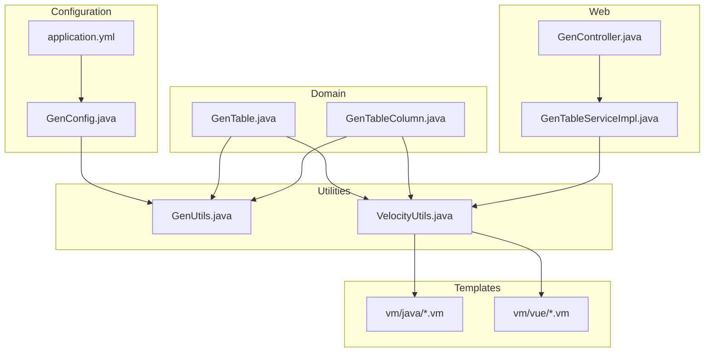
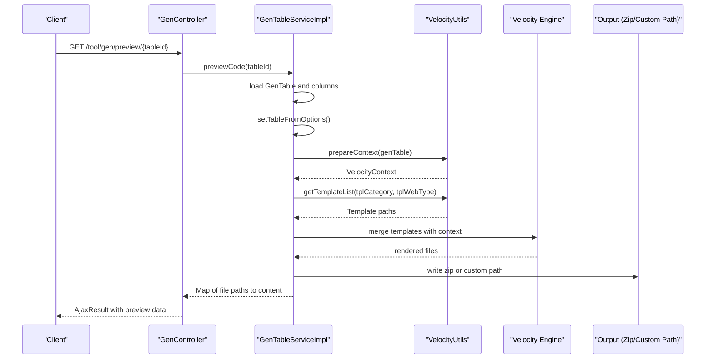
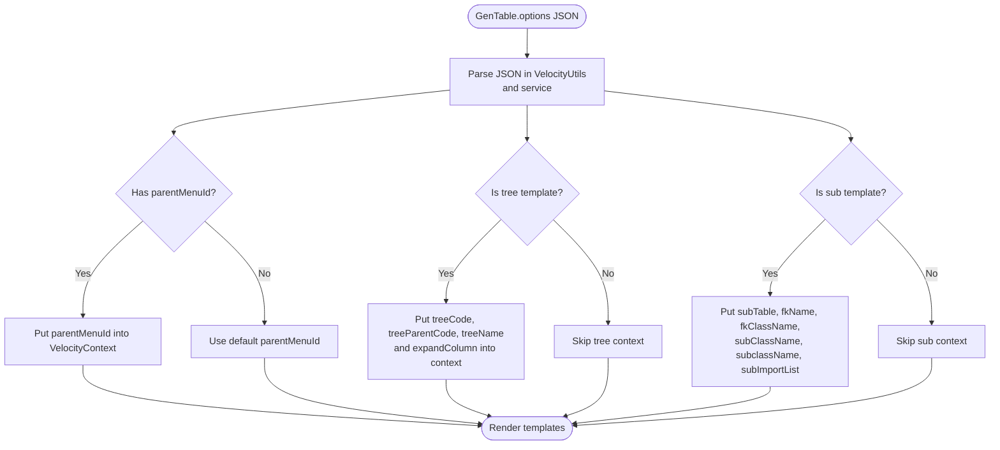
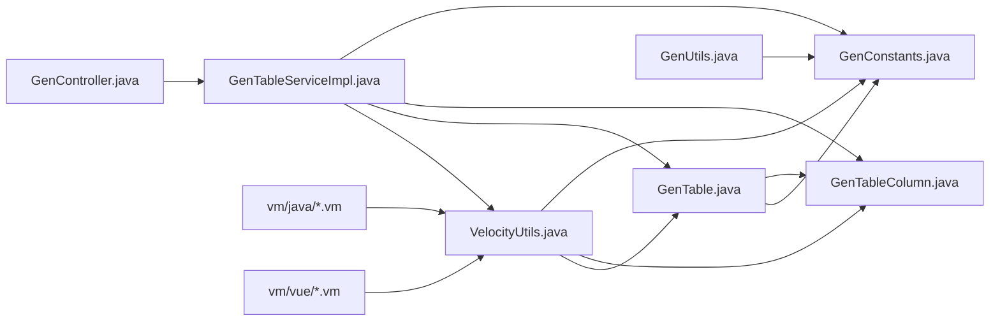

# Configuration

<cite>
**Referenced Files in This Document**
- [GenConstants.java](file://src/main/java/com/ruoyi/common/constant/GenConstants.java)
- [GenTable.java](file://src/main/java/com/ruoyi/project/tool/gen/domain/GenTable.java)
- [GenTableColumn.java](file://src/main/java/com/ruoyi/project/tool/gen/domain/GenTableColumn.java)
- [VelocityUtils.java](file://src/main/java/com/ruoyi/project/tool/gen/util/VelocityUtils.java)
- [GenUtils.java](file://src/main/java/com/ruoyi/project/tool/gen/util/GenUtils.java)
- [GenConfig.java](file://src/main/java/com/ruoyi/framework/config/GenConfig.java)
- [GenController.java](file://src/main/java/com/ruoyi/project/tool/gen/controller/GenController.java)
- [GenTableServiceImpl.java](file://src/main/java/com/ruoyi/project/tool/gen/service/GenTableServiceImpl.java)
- [application.yml](file://src/main/resources/application.yml)
- [domain.java.vm](file://src/main/resources/vm/java/domain.java.vm)
- [controller.java.vm](file://src/main/resources/vm/java/controller.java.vm)
- [index.vue.vm](file://src/main/resources/vm/vue/index.vue.vm)
- [index-tree.vue.vm](file://src/main/resources/vm/vue/index-tree.vue.vm)
- [GenTableMapper.xml](file://src/main/resources/mybatis/tool/GenTableMapper.xml)
</cite>

## Table of Contents
1. [Introduction](#introduction)
2. [Project Structure](#project-structure)
3. [Core Components](#core-components)
4. [Architecture Overview](#architecture-overview)
5. [Detailed Component Analysis](#detailed-component-analysis)
6. [Dependency Analysis](#dependency-analysis)
7. [Performance Considerations](#performance-considerations)
8. [Troubleshooting Guide](#troubleshooting-guide)
9. [Conclusion](#conclusion)
10. [Appendices](#appendices)

## Introduction
This document explains the code generation configuration in RuoYi-Vue, focusing on how the GenTable entity stores generation options, how template categories are defined and used, how JSON options are parsed and injected into Velocity templates, and how developers can customize templates and integrate new template types for both Java backend and Vue frontend.

## Project Structure
The code generation feature spans several packages and resources:
- Domain model: GenTable and GenTableColumn define the metadata for a generated table and its columns.
- Configuration: GenConfig reads YAML settings for default package, author, and overwrite policy.
- Utilities: GenUtils initializes table/column metadata; VelocityUtils prepares VelocityContext and selects templates.
- Templates: Velocity (.vm) files under src/main/resources/vm define Java and Vue artifacts.
- Web controller and service: GenController exposes endpoints; GenTableServiceImpl orchestrates generation and file output.

**Diagram sources**
- [GenConfig.java](file://src/main/java/com/ruoyi/framework/config/GenConfig.java#L1-L80)
- [application.yml](file://src/main/resources/application.yml#L138-L149)
- [GenTable.java](file://src/main/java/com/ruoyi/project/tool/gen/domain/GenTable.java#L1-L385)
- [GenTableColumn.java](file://src/main/java/com/ruoyi/project/tool/gen/domain/GenTableColumn.java#L1-L373)
- [GenUtils.java](file://src/main/java/com/ruoyi/project/tool/gen/util/GenUtils.java#L1-L258)
- [VelocityUtils.java](file://src/main/java/com/ruoyi/project/tool/gen/util/VelocityUtils.java#L1-L409)
- [GenController.java](file://src/main/java/com/ruoyi/project/tool/gen/controller/GenController.java#L1-L263)
- [GenTableServiceImpl.java](file://src/main/java/com/ruoyi/project/tool/gen/service/GenTableServiceImpl.java#L1-L200)

**Section sources**
- [GenConfig.java](file://src/main/java/com/ruoyi/framework/config/GenConfig.java#L1-L80)
- [application.yml](file://src/main/resources/application.yml#L138-L149)
- [GenTable.java](file://src/main/java/com/ruoyi/project/tool/gen/domain/GenTable.java#L1-L385)
- [GenTableColumn.java](file://src/main/java/com/ruoyi/project/tool/gen/domain/GenTableColumn.java#L1-L373)
- [GenUtils.java](file://src/main/java/com/ruoyi/project/tool/gen/util/GenUtils.java#L1-L258)
- [VelocityUtils.java](file://src/main/java/com/ruoyi/project/tool/gen/util/VelocityUtils.java#L1-L409)
- [GenController.java](file://src/main/java/com/ruoyi/project/tool/gen/controller/GenController.java#L1-L263)
- [GenTableServiceImpl.java](file://src/main/java/com/ruoyi/project/tool/gen/service/GenTableServiceImpl.java#L1-L200)

## Core Components
- GenTable: Stores generation metadata including package/module/business/function names, template category, web type, author, generation type/path, options JSON, and tree-related fields. It also exposes helpers to detect template categories and super columns.
- GenTableColumn: Defines per-column attributes such as Java type, HTML widget, query/edit/list visibility, required flag, and dict type.
- GenConstants: Centralized constants for template types (crud, tree, sub), tree field names, HTML widgets, Java types, and query operators.
- GenUtils: Initializes table and column metadata, derives class/business names, and infers HTML and Java types from database types.
- VelocityUtils: Prepares VelocityContext, parses options JSON, sets menu/tree/sub contexts, selects template lists, computes filenames, and builds import/dict lists.
- GenConfig: Reads YAML gen.* settings for author, package name, table prefix removal, and overwrite policy.
- Templates: Java domain/controller/service/mapper and Vue index/index-tree pages, plus API JS and SQL.

**Section sources**
- [GenTable.java](file://src/main/java/com/ruoyi/project/tool/gen/domain/GenTable.java#L1-L385)
- [GenTableColumn.java](file://src/main/java/com/ruoyi/project/tool/gen/domain/GenTableColumn.java#L1-L373)
- [GenConstants.java](file://src/main/java/com/ruoyi/common/constant/GenConstants.java#L1-L118)
- [GenUtils.java](file://src/main/java/com/ruoyi/project/tool/gen/util/GenUtils.java#L1-L258)
- [VelocityUtils.java](file://src/main/java/com/ruoyi/project/tool/gen/util/VelocityUtils.java#L1-L409)
- [GenConfig.java](file://src/main/java/com/ruoyi/framework/config/GenConfig.java#L1-L80)

## Architecture Overview
The generation pipeline:
- GenController handles requests for listing, importing, previewing, downloading, and generating code.
- GenTableServiceImpl orchestrates generation: loads GenTable, sets sub-table info, initializes PK columns, prepares VelocityContext, selects templates, renders files, and writes output (zip or custom path).
- VelocityUtils injects configuration into VelocityContext and resolves template lists based on template category and web type.
- Templates consume context variables (e.g., className, businessName, packageName, permissionPrefix, columns, dicts, tree fields, sub-table info) to produce Java and Vue artifacts.

**Diagram sources**
- [GenController.java](file://src/main/java/com/ruoyi/project/tool/gen/controller/GenController.java#L186-L195)
- [GenTableServiceImpl.java](file://src/main/java/com/ruoyi/project/tool/gen/service/GenTableServiceImpl.java#L198-L260)
- [VelocityUtils.java](file://src/main/java/com/ruoyi/project/tool/gen/util/VelocityUtils.java#L37-L160)

**Section sources**
- [GenController.java](file://src/main/java/com/ruoyi/project/tool/gen/controller/GenController.java#L186-L195)
- [GenTableServiceImpl.java](file://src/main/java/com/ruoyi/project/tool/gen/service/GenTableServiceImpl.java#L198-L260)
- [VelocityUtils.java](file://src/main/java/com/ruoyi/project/tool/gen/util/VelocityUtils.java#L37-L160)

## Detailed Component Analysis

### GenTable: Configuration Storage and Template Category
- Fields capture generation configuration:
  - Package/module/business/function names
  - Template category (crud, tree, sub)
  - Frontend web type (element-ui or element-plus)
  - Author, generation type, and path
  - Options JSON string for extra parameters
  - Tree fields (code, parent code, name)
  - Menu parent fields
- Helper methods:
  - isCrud/isTree/isSub detect template category
  - isSuperColumn determines base fields to exclude from UI generation
- Options JSON:
  - Stored as a string; parsed into a JSON object in VelocityUtils and service layer to derive tree/menu/sub parameters

**Section sources**
- [GenTable.java](file://src/main/java/com/ruoyi/project/tool/gen/domain/GenTable.java#L1-L385)
- [GenConstants.java](file://src/main/java/com/ruoyi/common/constant/GenConstants.java#L1-L118)

### GenConstants: Template Types and Field Names
- Template types:
  - crud: single-table CRUD
  - tree: hierarchical tree table
  - sub: master-detail sub-table
- Tree field constants:
  - treeCode, treeParentCode, treeName
- Menu parent constants:
  - parentMenuId, parentMenuName
- HTML widgets and Java types:
  - Used to infer UI controls and Java types for columns

**Section sources**
- [GenConstants.java](file://src/main/java/com/ruoyi/common/constant/GenConstants.java#L1-L118)

### VelocityUtils: Context Preparation and Template Selection
- prepareContext:
  - Injects basic context: tplCategory, tableName, functionName, ClassName, className, moduleName, BusinessName, businessName, basePackage, packageName, author, datetime, pkColumn, importList, permissionPrefix, columns, table, dicts
  - Adds menu context from options JSON
  - Adds tree context (treeCode, treeParentCode, treeName, expandColumn) when tplCategory is tree
  - Adds sub context (subTable, subTableName, subTableFkName, subTableFkClassName, subClassName, subclassName, subImportList) when tplCategory is sub
- getTemplateList:
  - Selects template list based on tplCategory and tplWebType
  - Uses vm/vue or vm/vue/v3 depending on web type
  - Adds index.vue or index-tree.vue for CRUD/tree; adds sub-domain.java.vm for sub
- getFileName:
  - Computes file paths for Java, XML, JS, and Vue files based on packageName, moduleName, className, businessName, and template type
- getImportList/getDicts:
  - Builds import statements and dictionary list from columns
- getPermissionPrefix:
  - Constructs permission prefix from moduleName and businessName

**Section sources**
- [VelocityUtils.java](file://src/main/java/com/ruoyi/project/tool/gen/util/VelocityUtils.java#L37-L227)
- [VelocityUtils.java](file://src/main/java/com/ruoyi/project/tool/gen/util/VelocityUtils.java#L229-L409)

### GenUtils: Initialization and Metadata Inference
- initTable:
  - Sets className, packageName, moduleName, businessName, functionName, author from GenConfig defaults
- initColumnField:
  - Infers Java type, HTML type, insert/edit/list/query flags, query type, and HTML widget based on database column type and naming conventions
- getModuleName/getBusinessName/convertClassName:
  - Derives module and business names from package/table names
- replaceText:
  - Cleans table comments for function names

**Section sources**
- [GenUtils.java](file://src/main/java/com/ruoyi/project/tool/gen/util/GenUtils.java#L1-L258)

### GenConfig and application.yml: Default Settings
- application.yml defines gen.author, gen.packageName, gen.autoRemovePre, gen.tablePrefix, gen.allowOverwrite
- GenConfig binds these properties and exposes getters/setters

**Section sources**
- [application.yml](file://src/main/resources/application.yml#L138-L149)
- [GenConfig.java](file://src/main/java/com/ruoyi/framework/config/GenConfig.java#L1-L80)

### Templates: How Values Are Used During Generation
- Java domain.java.vm:
  - Uses packageName, ClassName, importList, table.crud/table.sub/table.tree, columns, subTable info
- Java controller.java.vm:
  - Uses packageName, ClassName, businessName, moduleName, permissionPrefix, pkColumn, table.crud/table.tree/table.sub
- Vue index.vue.vm:
  - Uses columns, dicts, businessName, moduleName, permissionPrefix, query params, form rules, API imports
- Vue index-tree.vue.vm:
  - Uses treeCode, treeParentCode, treeName, expandColumn, columns, dicts, businessName, moduleName, permissionPrefix

**Section sources**
- [domain.java.vm](file://src/main/resources/vm/java/domain.java.vm#L1-L106)
- [controller.java.vm](file://src/main/resources/vm/java/controller.java.vm#L1-L116)
- [index.vue.vm](file://src/main/resources/vm/vue/index.vue.vm#L1-L603)
- [index-tree.vue.vm](file://src/main/resources/vm/vue/index-tree.vue.vm#L1-L506)

### Example: Options JSON Parsing and Usage
- In VelocityUtils:
  - Options JSON is parsed and used to set parentMenuId, treeCode, treeParentCode, treeName, and expandColumn
- In GenTableServiceImpl:
  - Options JSON is parsed to set tree-specific fields and sub-table info

**Diagram sources**
- [VelocityUtils.java](file://src/main/java/com/ruoyi/project/tool/gen/util/VelocityUtils.java#L76-L122)
- [GenTableServiceImpl.java](file://src/main/java/com/ruoyi/project/tool/gen/service/GenTableServiceImpl.java#L496-L520)

**Section sources**
- [VelocityUtils.java](file://src/main/java/com/ruoyi/project/tool/gen/util/VelocityUtils.java#L76-L122)
- [GenTableServiceImpl.java](file://src/main/java/com/ruoyi/project/tool/gen/service/GenTableServiceImpl.java#L496-L520)

### Customization and Extending Templates
- Adding a new template type:
  - Define a new constant in GenConstants (e.g., TPL_CUSTOM)
  - Extend getTemplateList in VelocityUtils to include new template paths for the custom category
  - Add a new branch in prepareContext to populate context for the custom type
  - Create .vm files under vm/java or vm/vue as needed
- Customizing frontend (Vue):
  - Modify Vue templates to change UI behavior, add new widgets, or adjust permissions
  - Use context variables like businessName, moduleName, columns, dicts, permissionPrefix
- Customizing backend (Java):
  - Adjust Java templates to introduce new annotations, imports, or method signatures
  - Use context variables like ClassName, className, packageName, importList, table.* flags

[No sources needed since this section provides general guidance]

## Dependency Analysis
- Coupling:
  - GenTable depends on GenConstants for template/category checks and GenUtils for initialization
  - VelocityUtils depends on GenTable, GenTableColumn, GenConstants, and JSON parsing
  - GenTableServiceImpl depends on VelocityUtils, GenTableMapper, GenTableColumnMapper, and GenConfig
  - Templates depend on VelocityUtils-provided context variables
- Cohesion:
  - GenUtils and VelocityUtils encapsulate generation logic cleanly
  - GenTable centralizes configuration for rendering
- External dependencies:
  - JSON parsing via fastjson2
  - Velocity engine for template rendering
  - MyBatis mapper XML for GenTable persistence

**Diagram sources**
- [GenTable.java](file://src/main/java/com/ruoyi/project/tool/gen/domain/GenTable.java#L1-L385)
- [GenTableColumn.java](file://src/main/java/com/ruoyi/project/tool/gen/domain/GenTableColumn.java#L1-L373)
- [GenConstants.java](file://src/main/java/com/ruoyi/common/constant/GenConstants.java#L1-L118)
- [GenUtils.java](file://src/main/java/com/ruoyi/project/tool/gen/util/GenUtils.java#L1-L258)
- [VelocityUtils.java](file://src/main/java/com/ruoyi/project/tool/gen/util/VelocityUtils.java#L1-L409)
- [GenTableServiceImpl.java](file://src/main/java/com/ruoyi/project/tool/gen/service/GenTableServiceImpl.java#L1-L200)
- [GenController.java](file://src/main/java/com/ruoyi/project/tool/gen/controller/GenController.java#L1-L263)

**Section sources**
- [GenTable.java](file://src/main/java/com/ruoyi/project/tool/gen/domain/GenTable.java#L1-L385)
- [GenTableColumn.java](file://src/main/java/com/ruoyi/project/tool/gen/domain/GenTableColumn.java#L1-L373)
- [GenConstants.java](file://src/main/java/com/ruoyi/common/constant/GenConstants.java#L1-L118)
- [GenUtils.java](file://src/main/java/com/ruoyi/project/tool/gen/util/GenUtils.java#L1-L258)
- [VelocityUtils.java](file://src/main/java/com/ruoyi/project/tool/gen/util/VelocityUtils.java#L1-L409)
- [GenTableServiceImpl.java](file://src/main/java/com/ruoyi/project/tool/gen/service/GenTableServiceImpl.java#L1-L200)
- [GenController.java](file://src/main/java/com/ruoyi/project/tool/gen/controller/GenController.java#L1-L263)

## Performance Considerations
- Template rendering is lightweight; performance primarily depends on the number of tables and columns.
- JSON parsing occurs once per table during context preparation.
- Avoid excessive customizations that increase template complexity or generate large files.

[No sources needed since this section provides general guidance]

## Troubleshooting Guide
- Options JSON invalid:
  - Ensure GenTable.options is valid JSON; VelocityUtils parses it and sets context fields accordingly.
- Missing tree fields:
  - Verify GenTable.options contains treeCode/treeParentCode/treeName for tree templates.
- Incorrect package/module/business names:
  - Confirm GenConfig settings and GenUtils initialization logic.
- Overwrite policy:
  - GenController enforces allowOverwrite from GenConfig when generating to custom path.

**Section sources**
- [VelocityUtils.java](file://src/main/java/com/ruoyi/project/tool/gen/util/VelocityUtils.java#L76-L122)
- [GenController.java](file://src/main/java/com/ruoyi/project/tool/gen/controller/GenController.java#L210-L223)
- [GenConfig.java](file://src/main/java/com/ruoyi/framework/config/GenConfig.java#L60-L80)

## Conclusion
RuoYi-Vue’s code generation centers around GenTable and GenConstants, with VelocityUtils bridging configuration and templates. Options JSON enables flexible customization for menus, trees, and sub-tables. Developers can extend templates by adding new constants, updating template selection logic, and creating new .vm files. Default settings are configured via application.yml and GenConfig.

## Appendices

### Appendix A: Configuration Options Reference
- GenTable fields:
  - packageName, moduleName, businessName, functionName, functionAuthor, tplCategory, tplWebType, options, genType, genPath, treeCode, treeParentCode, treeName, parentMenuId, parentMenuName
- GenConfig properties:
  - author, packageName, autoRemovePre, tablePrefix, allowOverwrite

**Section sources**
- [GenTable.java](file://src/main/java/com/ruoyi/project/tool/gen/domain/GenTable.java#L1-L385)
- [GenConfig.java](file://src/main/java/com/ruoyi/framework/config/GenConfig.java#L1-L80)
- [application.yml](file://src/main/resources/application.yml#L138-L149)

### Appendix B: Template Categories and Files
- CRUD (single-table): domain.java.vm, mapper.java.vm, service.java.vm, serviceImpl.java.vm, controller.java.vm, mapper.xml.vm, sql.vm, api.js.vm, index.vue.vm
- Tree (hierarchical): index-tree.vue.vm
- Sub (master-detail): sub-domain.java.vm, index.vue.vm

**Section sources**
- [VelocityUtils.java](file://src/main/java/com/ruoyi/project/tool/gen/util/VelocityUtils.java#L130-L160)
- [index.vue.vm](file://src/main/resources/vm/vue/index.vue.vm#L1-L603)
- [index-tree.vue.vm](file://src/main/resources/vm/vue/index-tree.vue.vm#L1-L506)