# Backend Code

<cite>
**Referenced Files in This Document**   
- [GenUtils.java](file://src/main/java/com/ruoyi/project/tool/gen/util/GenUtils.java)
- [VelocityInitializer.java](file://src/main/java/com/ruoyi/project/tool/gen/util/VelocityInitializer.java)
- [VelocityUtils.java](file://src/main/java/com/ruoyi/project/tool/gen/util/VelocityUtils.java)
- [GenTable.java](file://src/main/java/com/ruoyi/project/tool/gen/domain/GenTable.java)
- [GenTableColumn.java](file://src/main/java/com/ruoyi/project/tool/gen/domain/GenTableColumn.java)
- [controller.java.vm](file://src/main/resources/vm/java/controller.java.vm)
- [domain.java.vm](file://src/main/resources/vm/java/domain.java.vm)
- [mapper.java.vm](file://src/main/resources/vm/java/mapper.java.vm)
- [service.java.vm](file://src/main/resources/vm/java/service.java.vm)
- [serviceImpl.java.vm](file://src/main/resources/vm/java/serviceImpl.java.vm)
- [mapper.xml.vm](file://src/main/resources/vm/xml/mapper.xml.vm)
- [BaseController.java](file://src/main/java/com/ruoyi/framework/web/controller/BaseController.java)
- [R.java](file://src/main/java/com/ruoyi/framework/web/domain/R.java)
- [SysPermissionService.java](file://src/main/java/com/ruoyi/framework/security/service/SysPermissionService.java)
- [sub-domain.java.vm](file://src/main/resources/vm/java/sub-domain.java.vm)
</cite>

## Table of Contents
1. [Introduction](#introduction)
2. [Code Generation Architecture](#code-generation-architecture)
3. [Backend Component Generation](#backend-component-generation)
4. [Velocity Template Structure](#velocity-template-structure)
5. [Metadata Usage in Templates](#metadata-usage-in-templates)
6. [Generated Component Analysis](#generated-component-analysis)
7. [MyBatis XML Mapper Generation](#mybatis-xml-mapper-generation)
8. [Framework Integration](#framework-integration)
9. [Customization and Extension](#customization-and-extension)
10. [Conclusion](#conclusion)

## Introduction

The RuoYi-Vue code generator employs Velocity templates to automatically generate backend components for Spring Boot applications integrated with MyBatis. This documentation details the generation process for Java components including Controller, Domain/Entity, Mapper, Service, and ServiceImpl layers. The system leverages metadata extracted from database tables to produce fully functional CRUD operations with proper annotations, security integration, and framework-specific features. The generated code follows a consistent architecture pattern and integrates seamlessly with the RuoYi framework's base classes and services.

**Section sources**
- [GenUtils.java](file://src/main/java/com/ruoyi/project/tool/gen/util/GenUtils.java#L1-L258)
- [VelocityUtils.java](file://src/main/java/com/ruoyi/project/tool/gen/util/VelocityUtils.java#L1-L409)

## Code Generation Architecture

The code generation system in RuoYi-Vue follows a structured architecture that transforms database metadata into complete backend components. The process begins with the extraction of table information from the database, which is then processed by utility classes to determine appropriate Java types, field names, and component relationships. The core of the generation process relies on Velocity templates that use this metadata to produce Java source files and MyBatis XML configuration.

The architecture consists of several key components:
- **GenTable and GenTableColumn**: Domain objects that represent database tables and columns with additional metadata for code generation
- **GenUtils**: Utility class that processes table and column information, determining Java types, field names, and UI components based on column characteristics
- **VelocityInitializer**: Initializes the Velocity template engine for processing templates
- **VelocityUtils**: Prepares the context for template processing by organizing metadata into a format suitable for template variables

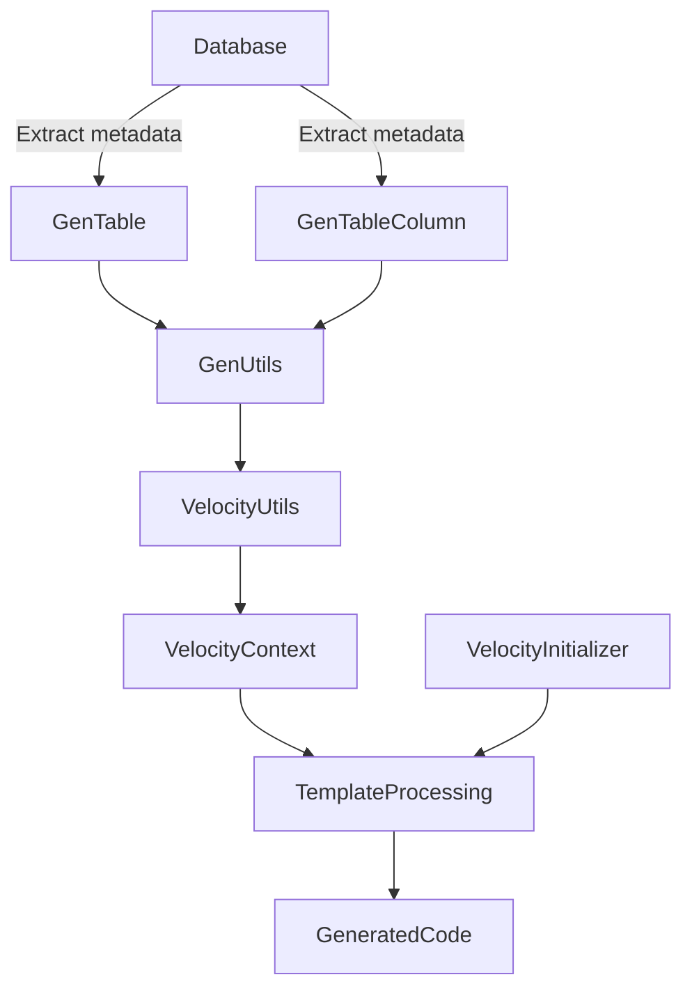

**Diagram sources **
- [GenTable.java](file://src/main/java/com/ruoyi/project/tool/gen/domain/GenTable.java#L1-L385)
- [GenTableColumn.java](file://src/main/java/com/ruoyi/project/tool/gen/domain/GenTableColumn.java#L1-L373)
- [GenUtils.java](file://src/main/java/com/ruoyi/project/tool/gen/util/GenUtils.java#L1-L258)
- [VelocityUtils.java](file://src/main/java/com/ruoyi/project/tool/gen/util/VelocityUtils.java#L1-L409)
- [VelocityInitializer.java](file://src/main/java/com/ruoyi/project/tool/gen/util/VelocityInitializer.java#L1-L35)

**Section sources**
- [GenTable.java](file://src/main/java/com/ruoyi/project/tool/gen/domain/GenTable.java#L1-L385)
- [GenTableColumn.java](file://src/main/java/com/ruoyi/project/tool/gen/domain/GenTableColumn.java#L1-L373)
- [GenUtils.java](file://src/main/java/com/ruoyi/project/tool/gen/util/GenUtils.java#L1-L258)
- [VelocityUtils.java](file://src/main/java/com/ruoyi/project/tool/gen/util/VelocityUtils.java#L1-L409)

## Backend Component Generation

The RuoYi-Vue code generator produces five primary backend components for each database table: Controller, Domain/Entity, Mapper, Service interface, and Service implementation. Each component serves a specific role in the Spring Boot application architecture and is generated with appropriate annotations and dependencies.

The generation process follows these steps:
1. Extract table metadata from the database
2. Process column information to determine Java types and field characteristics
3. Prepare Velocity context with all necessary variables
4. Process each Velocity template with the prepared context
5. Output generated files to appropriate directories

The system supports different template categories (CRUD, tree, and sub-table) that generate components with specialized functionality. For example, tree-structured data generates components with hierarchical relationships, while sub-table templates create master-detail relationships between entities.

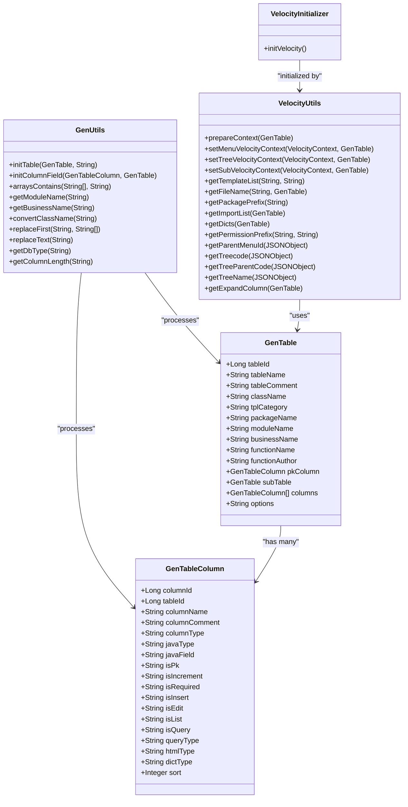

**Diagram sources **
- [GenTable.java](file://src/main/java/com/ruoyi/project/tool/gen/domain/GenTable.java#L1-L385)
- [GenTableColumn.java](file://src/main/java/com/ruoyi/project/tool/gen/domain/GenTableColumn.java#L1-L373)
- [GenUtils.java](file://src/main/java/com/ruoyi/project/tool/gen/util/GenUtils.java#L1-L258)
- [VelocityUtils.java](file://src/main/java/com/ruoyi/project/tool/gen/util/VelocityUtils.java#L1-L409)
- [VelocityInitializer.java](file://src/main/java/com/ruoyi/project/tool/gen/util/VelocityInitializer.java#L1-L35)

**Section sources**
- [GenTable.java](file://src/main/java/com/ruoyi/project/tool/gen/domain/GenTable.java#L1-L385)
- [GenTableColumn.java](file://src/main/java/com/ruoyi/project/tool/gen/domain/GenTableColumn.java#L1-L373)
- [GenUtils.java](file://src/main/java/com/ruoyi/project/tool/gen/util/GenUtils.java#L1-L258)
- [VelocityUtils.java](file://src/main/java/com/ruoyi/project/tool/gen/util/VelocityUtils.java#L1-L409)

## Velocity Template Structure

The RuoYi-Vue code generator utilizes Velocity templates to produce Java source files and XML configuration. These templates contain placeholders that are replaced with actual values during the generation process. The template system supports conditional logic, loops, and variable substitution to create customized output based on the input metadata.

The main Velocity templates for backend code generation include:
- **controller.java.vm**: Generates Spring MVC controllers with REST endpoints
- **domain.java.vm**: Creates entity classes with appropriate annotations
- **mapper.java.vm**: Produces MyBatis mapper interfaces
- **service.java.vm**: Generates service interfaces
- **serviceImpl.java.vm**: Creates service implementation classes
- **mapper.xml.vm**: Produces MyBatis XML mapping files

Each template follows a consistent structure with package declarations, imports, class definitions, and method implementations. The templates use Velocity syntax for variable substitution (${variable}), conditional statements (#if, #elseif, #else, #end), and loops (#foreach, #end).

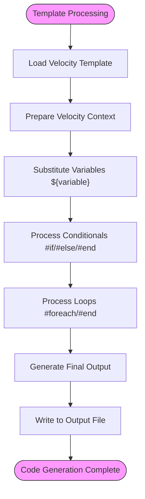

**Diagram sources **
- [controller.java.vm](file://src/main/resources/vm/java/controller.java.vm#L1-L116)
- [domain.java.vm](file://src/main/resources/vm/java/domain.java.vm#L1-L106)
- [mapper.java.vm](file://src/main/resources/vm/java/mapper.java.vm#L1-L92)
- [service.java.vm](file://src/main/resources/vm/java/service.java.vm#L1-L62)
- [serviceImpl.java.vm](file://src/main/resources/vm/java/serviceImpl.java.vm#L1-L170)
- [mapper.xml.vm](file://src/main/resources/vm/xml/mapper.xml.vm#L1-L140)

**Section sources**
- [controller.java.vm](file://src/main/resources/vm/java/controller.java.vm#L1-L116)
- [domain.java.vm](file://src/main/resources/vm/java/domain.java.vm#L1-L106)
- [mapper.java.vm](file://src/main/resources/vm/java/mapper.java.vm#L1-L92)
- [service.java.vm](file://src/main/resources/vm/java/service.java.vm#L1-L62)
- [serviceImpl.java.vm](file://src/main/resources/vm/java/serviceImpl.java.vm#L1-L170)

## Metadata Usage in Templates

The Velocity templates in RuoYi-Vue leverage various metadata variables to generate appropriate code. These variables are populated from the GenTable and GenTableColumn objects and include table information, column details, and configuration options.

Key metadata variables used in templates include:
- **$!{tableName}**: The database table name
- **$!{className}**: The Java class name (converted from table name)
- **$!{fields}**: Collection of column information for field generation
- **$!{crudFlag}**: Indicates whether CRUD operations should be generated
- **$!{moduleName}**: The module name for package organization
- **$!{businessName}**: The business name for URL mapping
- **$!{functionName}**: The display name for the entity
- **$!{packageName}**: The Java package name
- **$!{author}**: The developer name
- **$!{datetime}**: Generation timestamp
- **$!{pkColumn}**: Primary key column information
- **$!{permissionPrefix}**: Permission prefix for security annotations

The templates use these variables to generate consistent and accurate code across all components. For example, the controller template uses $!{moduleName} and $!{businessName} to create appropriate URL mappings, while the domain template uses $!{fields} to generate class properties with proper annotations.

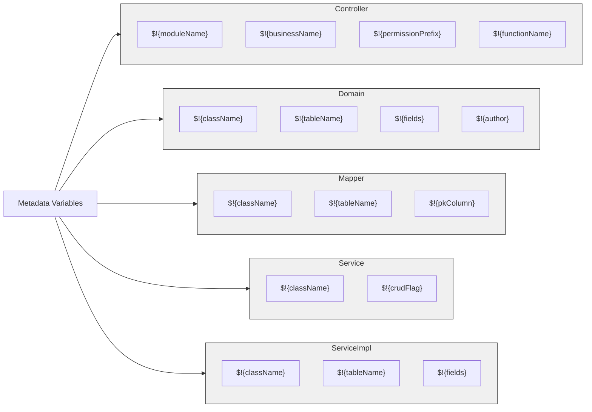

**Diagram sources **
- [controller.java.vm](file://src/main/resources/vm/java/controller.java.vm#L1-L116)
- [domain.java.vm](file://src/main/resources/vm/java/domain.java.vm#L1-L106)
- [mapper.java.vm](file://src/main/resources/vm/java/mapper.java.vm#L1-L92)
- [service.java.vm](file://src/main/resources/vm/java/service.java.vm#L1-L62)
- [serviceImpl.java.vm](file://src/main/resources/vm/java/serviceImpl.java.vm#L1-L170)
- [VelocityUtils.java](file://src/main/java/com/ruoyi/project/tool/gen/util/VelocityUtils.java#L1-L409)

**Section sources**
- [controller.java.vm](file://src/main/resources/vm/java/controller.java.vm#L1-L116)
- [domain.java.vm](file://src/main/resources/vm/java/domain.java.vm#L1-L106)
- [mapper.java.vm](file://src/main/resources/vm/java/mapper.java.vm#L1-L92)
- [service.java.vm](file://src/main/resources/vm/java/service.java.vm#L1-L62)
- [serviceImpl.java.vm](file://src/main/resources/vm/java/serviceImpl.java.vm#L1-L170)
- [VelocityUtils.java](file://src/main/java/com/ruoyi/project/tool/gen/util/VelocityUtils.java#L1-L409)

## Generated Component Analysis

The RuoYi-Vue code generator produces five main backend components, each with specific responsibilities in the Spring Boot application architecture. These components follow established design patterns and integrate with the RuoYi framework's base classes and services.

### Controller Component

The generated controller component handles HTTP requests and responses, acting as the entry point for API endpoints. It extends BaseController and uses various Spring annotations to define REST endpoints.

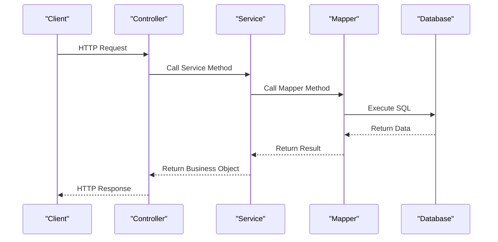

**Diagram sources **
- [controller.java.vm](file://src/main/resources/vm/java/controller.java.vm#L1-L116)
- [BaseController.java](file://src/main/java/com/ruoyi/framework/web/controller/BaseController.java#L1-L195)

### Domain/Entity Component

The generated domain component represents the data model and maps to database tables. It extends either BaseEntity or TreeEntity depending on the template category and includes appropriate annotations for MyBatis and Excel export.

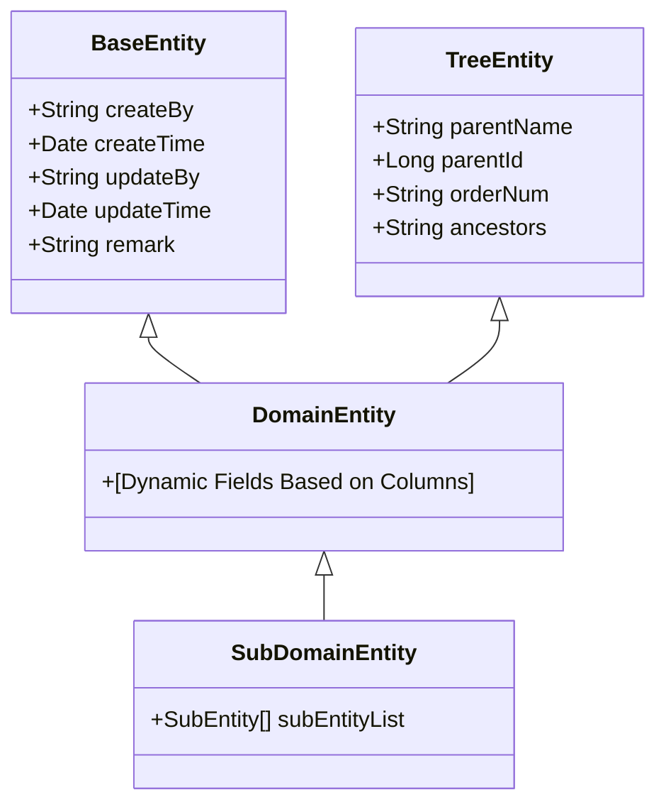

**Diagram sources **
- [domain.java.vm](file://src/main/resources/vm/java/domain.java.vm#L1-L106)
- [BaseEntity.java](file://src/main/java/com/ruoyi/framework/web/domain/BaseEntity.java)
- [TreeEntity.java](file://src/main/java/com/ruoyi/framework/web/domain/TreeEntity.java)

### Mapper Component

The generated mapper component defines the interface between Java code and database operations. It uses MyBatis annotations and XML configuration to execute SQL statements.

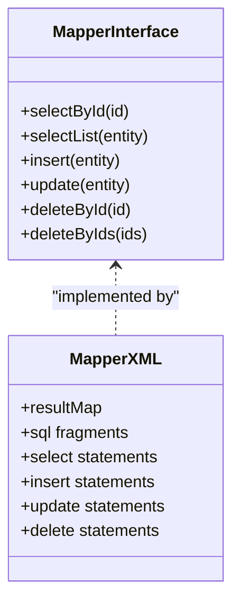

**Diagram sources **
- [mapper.java.vm](file://src/main/resources/vm/java/mapper.java.vm#L1-L92)
- [mapper.xml.vm](file://src/main/resources/vm/xml/mapper.xml.vm#L1-L140)

### Service Component

The generated service component contains the business logic and orchestrates operations between the controller and data access layers. It follows the service interface and implementation pattern.

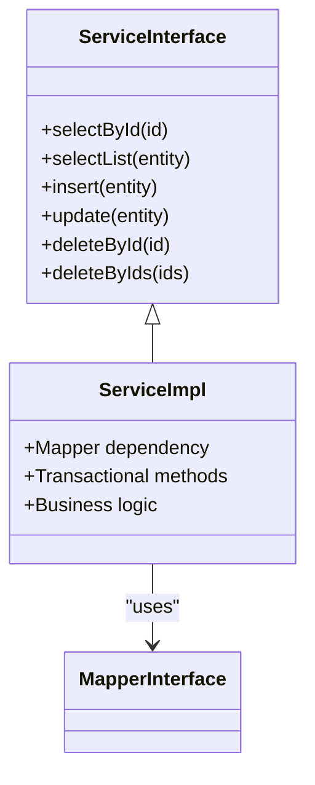

**Diagram sources **
- [service.java.vm](file://src/main/resources/vm/java/service.java.vm#L1-L62)
- [serviceImpl.java.vm](file://src/main/resources/vm/java/serviceImpl.java.vm#L1-L170)

**Section sources**
- [controller.java.vm](file://src/main/resources/vm/java/controller.java.vm#L1-L116)
- [domain.java.vm](file://src/main/resources/vm/java/domain.java.vm#L1-L106)
- [mapper.java.vm](file://src/main/resources/vm/java/mapper.java.vm#L1-L92)
- [service.java.vm](file://src/main/resources/vm/java/service.java.vm#L1-L62)
- [serviceImpl.java.vm](file://src/main/resources/vm/java/serviceImpl.java.vm#L1-L170)
- [BaseController.java](file://src/main/java/com/ruoyi/framework/web/controller/BaseController.java#L1-L195)

## MyBatis XML Mapper Generation

The mapper.xml.vm template generates MyBatis XML configuration files that define SQL queries, result mappings, and dynamic SQL blocks. These XML files work in conjunction with the mapper interface to provide database access functionality.

The generated XML mapper includes several key components:
- **resultMap**: Defines the mapping between database columns and Java object properties
- **sql fragments**: Reusable SQL code snippets
- **select statements**: Queries for retrieving data
- **insert statements**: Commands for adding new records
- **update statements**: Commands for modifying existing records
- **delete statements**: Commands for removing records

The template uses Velocity's conditional and looping constructs to generate dynamic SQL that handles various scenarios:

```mermaid
flowchart TD
XMLMapper[MyBatis XML Mapper] --> ResultMap["<resultMap> Definition"]
XMLMapper --> SqlFragment["<sql> Fragment"]
XMLMapper --> Select["<select> Statements"]
XMLMapper --> Insert["<insert> Statements"]
XMLMapper --> Update["<update> Statements"]
XMLMapper --> Delete["<delete> Statements"]
ResultMap --> DynamicColumns["Dynamic Column Mapping"]
SqlFragment --> SelectVo["selectVo Fragment"]
Select --> ListQuery["List Query with WHERE"]
Select --> GetById["Get By ID Query"]
Insert --> DynamicInsert["Dynamic INSERT with NULL handling"]
Update --> DynamicUpdate["Dynamic UPDATE with NULL handling"]
Delete --> SingleDelete["Delete by ID"]
Delete --> BatchDelete["Batch Delete by IDs"]
style XMLMapper fill:#f0f0f0,stroke:#333
```

The XML mapper also supports advanced features like:
- **Dynamic WHERE clauses**: Conditional inclusion of WHERE conditions based on parameter values
- **Batch operations**: Support for inserting, updating, and deleting multiple records
- **Sub-table operations**: Special handling for master-detail relationships
- **Pagination**: Integration with PageHelper for result pagination
- **Conditional logic**: Use of <if> elements to include SQL fragments conditionally
- **Looping**: Use of <foreach> elements for batch operations

**Diagram sources **
- [mapper.xml.vm](file://src/main/resources/vm/xml/mapper.xml.vm#L1-L140)

**Section sources**
- [mapper.xml.vm](file://src/main/resources/vm/xml/mapper.xml.vm#L1-L140)

## Framework Integration

The generated backend components integrate with the RuoYi framework through various mechanisms, including base classes, annotations, and service dependencies. This integration provides consistent functionality across all generated code.

### Base Classes and Response Handling

The generated controller extends BaseController, which provides common functionality for web requests:

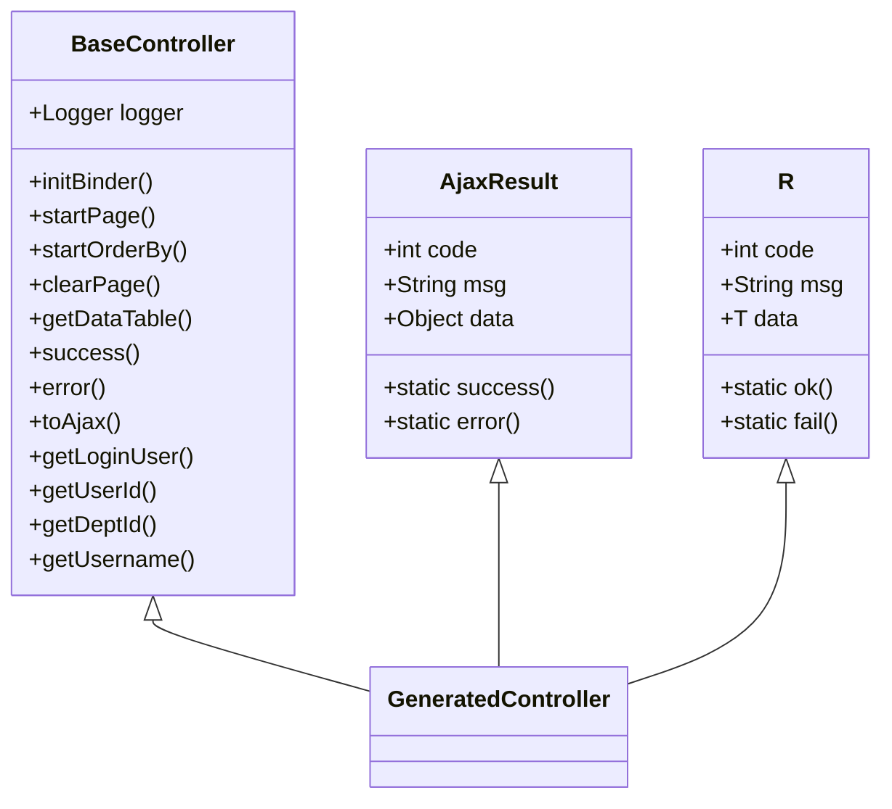

**Diagram sources **
- [BaseController.java](file://src/main/java/com/ruoyi/framework/web/controller/BaseController.java#L1-L195)
- [R.java](file://src/main/java/com/ruoyi/framework/web/domain/R.java#L1-L116)

### Security and Permission Integration

The generated components integrate with the RuoYi security framework through annotations and service dependencies:

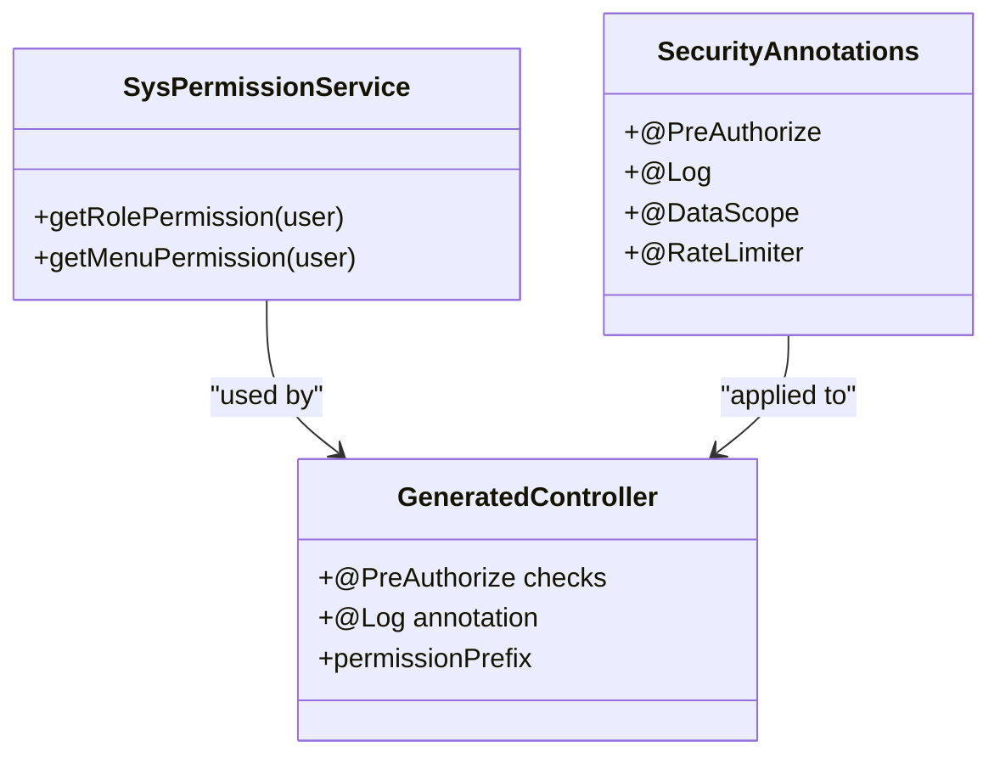

The security integration includes:
- **@PreAuthorize**: Spring Security annotation for method-level security
- **@Log**: Custom annotation for operation logging
- **@DataScope**: Custom annotation for data scope filtering
- **Permission checks**: Integration with SysPermissionService for role and menu permissions
- **Operation logging**: Automatic logging of CRUD operations

**Diagram sources **
- [SysPermissionService.java](file://src/main/java/com/ruoyi/framework/security/service/SysPermissionService.java#L1-L90)
- [controller.java.vm](file://src/main/resources/vm/java/controller.java.vm#L1-L116)

**Section sources**
- [BaseController.java](file://src/main/java/com/ruoyi/framework/web/controller/BaseController.java#L1-L195)
- [R.java](file://src/main/java/com/ruoyi/framework/web/domain/R.java#L1-L116)
- [SysPermissionService.java](file://src/main/java/com/ruoyi/framework/security/service/SysPermissionService.java#L1-L90)

## Customization and Extension

The RuoYi-Vue code generator supports various customization and extension points that allow developers to modify the generated code to meet specific requirements.

### Template Customization

Developers can customize the Velocity templates to change the generated code's structure, naming conventions, or functionality. The templates are located in the vm directory and can be modified to:

- Change package naming conventions
- Modify class and method naming patterns
- Add custom annotations
- Include additional imports
- Change method signatures
- Modify SQL generation patterns

### Post-Generation Modifications

After code generation, developers can extend the generated components through:

- **Controller**: Add custom endpoints, modify existing methods, or add validation
- **Service**: Implement complex business logic, add transaction management, or integrate with external services
- **Mapper**: Add custom SQL queries or modify existing ones
- **Domain**: Add validation annotations, custom methods, or transient properties

### Configuration Options

The code generator supports various configuration options that affect the generated code:

- **Template category**: Choose between CRUD, tree, or sub-table templates
- **Frontend type**: Select between element-ui and element-plus templates
- **Package structure**: Define custom package names and module organization
- **Naming conventions**: Configure table-to-class name conversion rules
- **Field type mapping**: Customize how database types map to Java types

These customization points allow the generated code to be adapted to specific project requirements while maintaining the benefits of automated code generation.

**Section sources**
- [GenUtils.java](file://src/main/java/com/ruoyi/project/tool/gen/util/GenUtils.java#L1-L258)
- [VelocityUtils.java](file://src/main/java/com/ruoyi/project/tool/gen/util/VelocityUtils.java#L1-L409)
- [GenTable.java](file://src/main/java/com/ruoyi/project/tool/gen/domain/GenTable.java#L1-L385)

## Conclusion

The RuoYi-Vue code generator provides a comprehensive solution for generating backend components in Spring Boot applications with MyBatis integration. By leveraging Velocity templates and metadata from database tables, it produces consistent, well-structured code that follows established design patterns and integrates with the RuoYi framework.

The system generates five main components—Controller, Domain/Entity, Mapper, Service, and ServiceImpl—each with specific responsibilities in the application architecture. These components are created using Velocity templates that utilize metadata variables such as $!{tableName}, $!{className}, $!{fields}, and $!{crudFlag} to produce accurate CRUD operations.

The generated code incorporates various annotations including @RestController, @RequestMapping, @Autowired, @Log, and @DataScope to provide functionality for REST endpoints, dependency injection, operation logging, and data scope filtering. The MyBatis XML mapper is generated with dynamic SQL blocks for conditional WHERE clauses and pagination support.

Integration with the RuoYi framework is achieved through base classes like BaseController and R, as well as services like SysPermissionService for security and permission management. The system supports customization through template modification, post-generation code changes, and configuration options, allowing developers to adapt the generated code to specific requirements.

Overall, the RuoYi-Vue code generator significantly reduces development time by automating the creation of boilerplate code while maintaining flexibility for customization and extension.