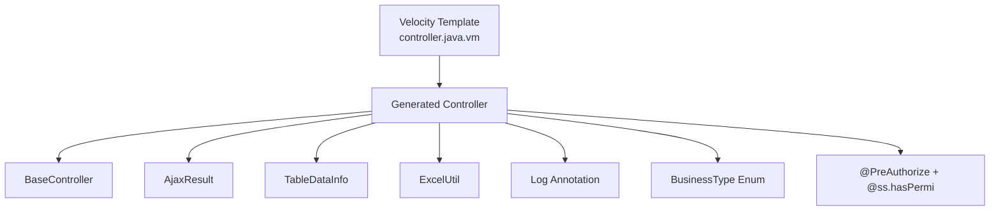
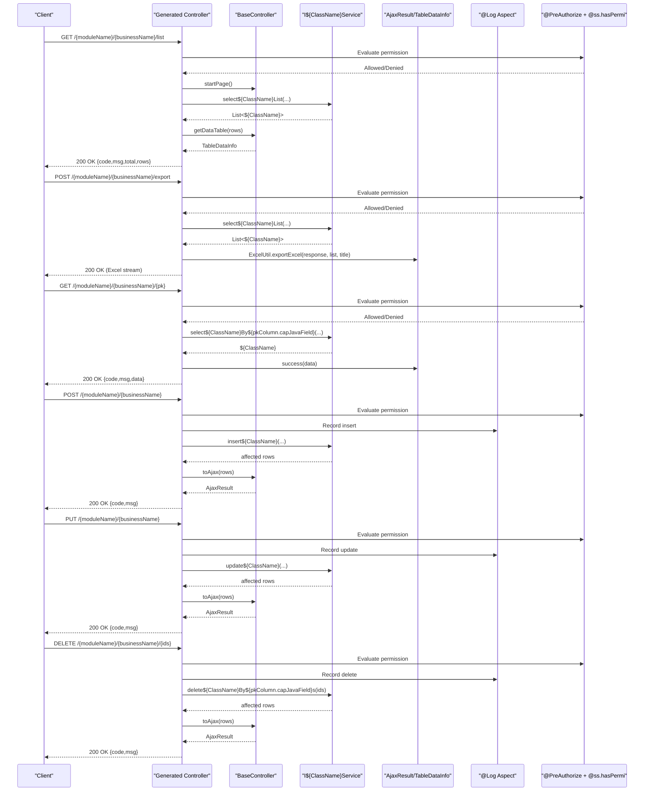
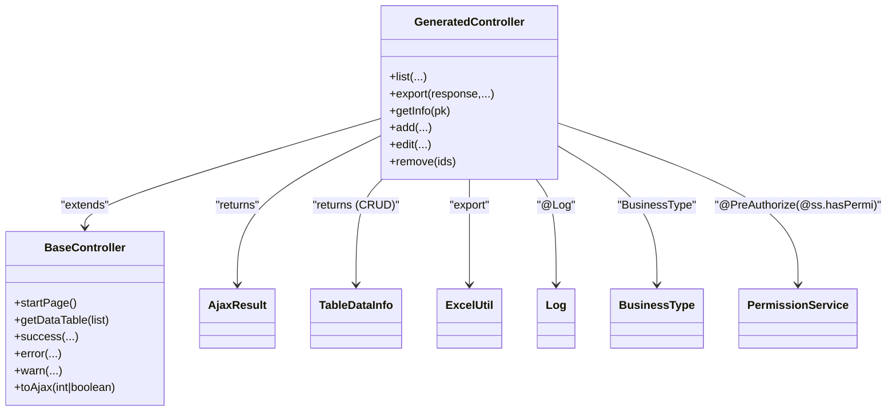

# Controller

<cite>
**Referenced Files in This Document**
- [controller.java.vm](file://src/main/resources/vm/java/controller.java.vm)
- [BaseController.java](file://src/main/java/com/ruoyi/framework/web/controller/BaseController.java)
- [AjaxResult.java](file://src/main/java/com/ruoyi/framework/web/domain/AjaxResult.java)
- [TableDataInfo.java](file://src/main/java/com/ruoyi/framework/web/page/TableDataInfo.java)
- [ExcelUtil.java](file://src/main/java/com/ruoyi/common/utils/poi/ExcelUtil.java)
- [Log.java](file://src/main/java/com/ruoyi/framework/aspectj/lang/annotation/Log.java)
- [BusinessType.java](file://src/main/java/com/ruoyi/framework/aspectj/lang/enums/BusinessType.java)
- [PermissionService.java](file://src/main/java/com/ruoyi/framework/security/service/PermissionService.java)
- [SysUserController.java](file://src/main/java/com/ruoyi/project/system/controller/SysUserController.java)
- [SysDeptController.java](file://src/main/java/com/ruoyi/project/system/controller/SysDeptController.java)
</cite>

## Table of Contents
1. [Introduction](#introduction)
2. [Project Structure](#project-structure)
3. [Core Components](#core-components)
4. [Architecture Overview](#architecture-overview)
5. [Detailed Component Analysis](#detailed-component-analysis)
6. [Dependency Analysis](#dependency-analysis)
7. [Performance Considerations](#performance-considerations)
8. [Troubleshooting Guide](#troubleshooting-guide)
9. [Conclusion](#conclusion)

## Introduction
This document explains how the Velocity template controller.java.vm generates RESTful Controllers for the RuoYi-Vue backend. It covers Spring MVC annotations (@RestController, @RequestMapping, @GetMapping, @PostMapping, @PutMapping, @DeleteMapping), integration with RuoYi’s BaseController for pagination and response handling, role-based permissions via @PreAuthorize and the @ss.hasPermi expression, operation logging with @Log and BusinessType, conditional generation for CRUD, tree, and sub-table scenarios, export functionality using ExcelUtil, and batch deletion with path variable arrays. It also demonstrates how template variables like $!{moduleName}, $!{businessName}, $!{permissionPrefix}, and $!{pkColumn} are used to produce correct routing and security expressions.

## Project Structure
The generated Controller is produced from a Velocity template and integrates with shared web infrastructure:
- Template: controller.java.vm
- Base Controller: BaseController (pagination and response helpers)
- Response model: AjaxResult (standard JSON envelope)
- Pagination model: TableDataInfo (for paginated lists)
- Export utility: ExcelUtil (Excel export/import)
- Logging: @Log annotation and BusinessType enum
- Permissions: @PreAuthorize with @ss.hasPermi from PermissionService

**Diagram sources**
- [controller.java.vm](file://src/main/resources/vm/java/controller.java.vm#L1-L116)
- [BaseController.java](file://src/main/java/com/ruoyi/framework/web/controller/BaseController.java#L50-L161)
- [AjaxResult.java](file://src/main/java/com/ruoyi/framework/web/domain/AjaxResult.java#L62-L110)
- [TableDataInfo.java](file://src/main/java/com/ruoyi/framework/web/page/TableDataInfo.java#L11-L85)
- [ExcelUtil.java](file://src/main/java/com/ruoyi/common/utils/poi/ExcelUtil.java#L561-L653)
- [Log.java](file://src/main/java/com/ruoyi/framework/aspectj/lang/annotation/Log.java#L17-L52)
- [BusinessType.java](file://src/main/java/com/ruoyi/framework/aspectj/lang/enums/BusinessType.java#L8-L60)
- [PermissionService.java](file://src/main/java/com/ruoyi/framework/security/service/PermissionService.java#L27-L40)

**Section sources**
- [controller.java.vm](file://src/main/resources/vm/java/controller.java.vm#L1-L116)

## Core Components
- Generated Controller: REST endpoints for list, export, get by ID, add, edit, delete. Uses @RequestMapping for module/business routing and @GetMapping/@PostMapping/@PutMapping/@DeleteMapping for HTTP verbs.
- BaseController: Provides startPage(), getDataTable(), success(), error(), warn(), toAjax(), and user/session helpers.
- AjaxResult: Standard JSON envelope with code/msg/data fields and convenience constructors.
- TableDataInfo: Paginated response container with total, rows, code, and msg.
- ExcelUtil: Export/import support for lists to/from Excel with HttpServletResponse.
- @Log + BusinessType: Aspect-oriented logging for CRUD and export/import operations.
- @PreAuthorize + @ss.hasPermi: Role-based authorization using a custom PermissionService bean named “ss”.

**Section sources**
- [controller.java.vm](file://src/main/resources/vm/java/controller.java.vm#L33-L116)
- [BaseController.java](file://src/main/java/com/ruoyi/framework/web/controller/BaseController.java#L50-L161)
- [AjaxResult.java](file://src/main/java/com/ruoyi/framework/web/domain/AjaxResult.java#L62-L110)
- [TableDataInfo.java](file://src/main/java/com/ruoyi/framework/web/page/TableDataInfo.java#L11-L85)
- [ExcelUtil.java](file://src/main/java/com/ruoyi/common/utils/poi/ExcelUtil.java#L561-L653)
- [Log.java](file://src/main/java/com/ruoyi/framework/aspectj/lang/annotation/Log.java#L17-L52)
- [BusinessType.java](file://src/main/java/com/ruoyi/framework/aspectj/lang/enums/BusinessType.java#L8-L60)
- [PermissionService.java](file://src/main/java/com/ruoyi/framework/security/service/PermissionService.java#L27-L40)

## Architecture Overview
The generated Controller extends BaseController and delegates to a service interface. It uses Spring MVC annotations for routing and HTTP methods, applies @PreAuthorize for permission checks, logs operations via @Log, and returns standardized responses via AjaxResult or TableDataInfo depending on table type.

**Diagram sources**
- [controller.java.vm](file://src/main/resources/vm/java/controller.java.vm#L33-L116)
- [BaseController.java](file://src/main/java/com/ruoyi/framework/web/controller/BaseController.java#L50-L161)
- [AjaxResult.java](file://src/main/java/com/ruoyi/framework/web/domain/AjaxResult.java#L62-L110)
- [TableDataInfo.java](file://src/main/java/com/ruoyi/framework/web/page/TableDataInfo.java#L11-L85)
- [ExcelUtil.java](file://src/main/java/com/ruoyi/common/utils/poi/ExcelUtil.java#L561-L653)
- [Log.java](file://src/main/java/com/ruoyi/framework/aspectj/lang/annotation/Log.java#L17-L52)
- [BusinessType.java](file://src/main/java/com/ruoyi/framework/aspectj/lang/enums/BusinessType.java#L8-L60)
- [PermissionService.java](file://src/main/java/com/ruoyi/framework/security/service/PermissionService.java#L27-L40)

## Detailed Component Analysis

### Generated Controller Template Behavior
- Routing: The controller class is annotated with @RestController and @RequestMapping("/${moduleName}/${businessName}"). This produces consistent routes like /system/user for the user module.
- Endpoints:
  - List: GET /list returns either TableDataInfo (for CRUD/sub-table) or AjaxResult (for tree).
  - Export: POST /export streams an Excel file using ExcelUtil.
  - Get by ID: GET /{pkColumn.javaField} returns AjaxResult with the entity.
  - Add: POST / returns AjaxResult from toAjax().
  - Edit: PUT / returns AjaxResult from toAjax().
  - Delete: DELETE /{pkColumn.javaField}s accepts an array and deletes by ids.
- Conditional generation:
  - For CRUD and sub-table: imports TableDataInfo and returns getDataTable(list).
  - For tree: returns success(list) with AjaxResult.
- Path variables and arrays:
  - Batch delete uses @DeleteMapping("/{${pkColumn.javaField}s}") and @PathVariable ${pkColumn.javaType}[] to accept arrays.

**Section sources**
- [controller.java.vm](file://src/main/resources/vm/java/controller.java.vm#L33-L116)

### Pagination and Response Handling via BaseController
- Pagination:
  - startPage() initializes PageHelper for the current request.
  - getDataTable(list) wraps the list into TableDataInfo with SUCCESS code, message, rows, and total count computed from PageInfo.
- Response helpers:
  - success()/success(message)/success(data): convenience wrappers around AjaxResult.success.
  - error()/warn(): convenience wrappers around AjaxResult.error/warn.
  - toAjax(int rows)/toAjax(boolean result): converts effect counts or booleans into AjaxResult success/error.

**Section sources**
- [BaseController.java](file://src/main/java/com/ruoyi/framework/web/controller/BaseController.java#L50-L161)
- [TableDataInfo.java](file://src/main/java/com/ruoyi/framework/web/page/TableDataInfo.java#L11-L85)
- [AjaxResult.java](file://src/main/java/com/ruoyi/framework/web/domain/AjaxResult.java#L62-L110)

### Role-Based Authorization with @PreAuthorize and @ss.hasPermi
- The template uses @PreAuthorize("@ss.hasPermi('${permissionPrefix}:operation')") for each endpoint:
  - ${permissionPrefix} is derived from the module and business name.
  - Operations include list, export, query, add, edit, remove.
- Permission evaluation is delegated to a Spring bean named “ss” (PermissionService), which checks the logged-in user’s permissions against the given permission string.

**Section sources**
- [controller.java.vm](file://src/main/resources/vm/java/controller.java.vm#L43-L114)
- [PermissionService.java](file://src/main/java/com/ruoyi/framework/security/service/PermissionService.java#L27-L40)

### Operation Logging with @Log and BusinessType
- Each mutating endpoint is annotated with @Log(title = "${functionName}", businessType = BusinessType.{INSERT|UPDATE|DELETE|EXPORT|IMPORT}).
- BusinessType enumerates common operations like INSERT, UPDATE, DELETE, EXPORT, IMPORT, etc.
- The @Log annotation captures request/response metadata according to its attributes.

**Section sources**
- [controller.java.vm](file://src/main/resources/vm/java/controller.java.vm#L63-L114)
- [Log.java](file://src/main/java/com/ruoyi/framework/aspectj/lang/annotation/Log.java#L17-L52)
- [BusinessType.java](file://src/main/java/com/ruoyi/framework/aspectj/lang/enums/BusinessType.java#L8-L60)

### Conditional Generation for Table Types
- CRUD/Sub-table:
  - Imports TableDataInfo.
  - List endpoint returns TableDataInfo via getDataTable(list).
- Tree:
  - Does not import TableDataInfo.
  - List endpoint returns AjaxResult.success(list).

**Section sources**
- [controller.java.vm](file://src/main/resources/vm/java/controller.java.vm#L22-L58)

### Export Functionality with ExcelUtil
- Export endpoint:
  - POST /export retrieves the list from the service.
  - Creates ExcelUtil<${ClassName}> and calls exportExcel(response, list, "${functionName}数据").
  - Streams an Excel file to the client.

**Section sources**
- [controller.java.vm](file://src/main/resources/vm/java/controller.java.vm#L63-L71)
- [ExcelUtil.java](file://src/main/java/com/ruoyi/common/utils/poi/ExcelUtil.java#L561-L653)

### Batch Deletion with Path Variable Arrays
- Delete endpoint:
  - DELETE /{${pkColumn.javaField}s} accepts an array of IDs via @PathVariable ${pkColumn.javaType}[].
  - Calls the service method delete${ClassName}By${pkColumn.capJavaField}s(ids).
  - Returns AjaxResult via toAjax(rows).

**Section sources**
- [controller.java.vm](file://src/main/resources/vm/java/controller.java.vm#L110-L114)

### Template Variables Usage
- $!{moduleName}, $!{businessName}: Used in @RequestMapping("/${moduleName}/${businessName}") to form the base route.
- $!{permissionPrefix}: Used in @PreAuthorize expressions like "@ss.hasPermi('${permissionPrefix}:list')".
- $!{pkColumn}: Used to define path variables and method parameters for getById and deleteByIds, e.g., @PathVariable("${pkColumn.javaField}") and @PathVariable ${pkColumn.javaType}[].

**Section sources**
- [controller.java.vm](file://src/main/resources/vm/java/controller.java.vm#L33-L116)

### Real-World Examples from the Codebase
- CRUD example (users):
  - List returns TableDataInfo and uses startPage/getDataTable.
  - Export uses ExcelUtil to stream an Excel file.
  - Get by ID returns AjaxResult.success(data).
  - Add/Edit/Delete use @PreAuthorize and @Log with appropriate BusinessType.
- Tree example (departments):
  - List returns AjaxResult.success(list) without pagination wrapper.

**Section sources**
- [SysUserController.java](file://src/main/java/com/ruoyi/project/system/controller/SysUserController.java#L56-L187)
- [SysDeptController.java](file://src/main/java/com/ruoyi/project/system/controller/SysDeptController.java#L38-L131)

## Dependency Analysis
The generated Controller depends on:
- Service interface I${ClassName}Service for business logic.
- BaseController for pagination and response helpers.
- AjaxResult/TableDataInfo for response envelopes.
- ExcelUtil for export.
- @Log and BusinessType for logging.
- @PreAuthorize and PermissionService for authorization.

**Diagram sources**
- [controller.java.vm](file://src/main/resources/vm/java/controller.java.vm#L33-L116)
- [BaseController.java](file://src/main/java/com/ruoyi/framework/web/controller/BaseController.java#L50-L161)
- [AjaxResult.java](file://src/main/java/com/ruoyi/framework/web/domain/AjaxResult.java#L62-L110)
- [TableDataInfo.java](file://src/main/java/com/ruoyi/framework/web/page/TableDataInfo.java#L11-L85)
- [ExcelUtil.java](file://src/main/java/com/ruoyi/common/utils/poi/ExcelUtil.java#L561-L653)
- [Log.java](file://src/main/java/com/ruoyi/framework/aspectj/lang/annotation/Log.java#L17-L52)
- [BusinessType.java](file://src/main/java/com/ruoyi/framework/aspectj/lang/enums/BusinessType.java#L8-L60)
- [PermissionService.java](file://src/main/java/com/ruoyi/framework/security/service/PermissionService.java#L27-L40)

**Section sources**
- [controller.java.vm](file://src/main/resources/vm/java/controller.java.vm#L33-L116)
- [BaseController.java](file://src/main/java/com/ruoyi/framework/web/controller/BaseController.java#L50-L161)
- [AjaxResult.java](file://src/main/java/com/ruoyi/framework/web/domain/AjaxResult.java#L62-L110)
- [TableDataInfo.java](file://src/main/java/com/ruoyi/framework/web/page/TableDataInfo.java#L11-L85)
- [ExcelUtil.java](file://src/main/java/com/ruoyi/common/utils/poi/ExcelUtil.java#L561-L653)
- [Log.java](file://src/main/java/com/ruoyi/framework/aspectj/lang/annotation/Log.java#L17-L52)
- [BusinessType.java](file://src/main/java/com/ruoyi/framework/aspectj/lang/enums/BusinessType.java#L8-L60)
- [PermissionService.java](file://src/main/java/com/ruoyi/framework/security/service/PermissionService.java#L27-L40)

## Performance Considerations
- Pagination: Use startPage() and getDataTable() to avoid loading entire datasets. This reduces memory and network overhead for list endpoints.
- Export: ExcelUtil writes directly to HttpServletResponse for streaming large datasets efficiently.
- Logging: @Log records operation metadata; keep excludeParamNames minimal to reduce payload size when saving request/response data.
- Batch deletion: Accepting arrays via path variables reduces round-trips for bulk operations.

[No sources needed since this section provides general guidance]

## Troubleshooting Guide
- Permission denied:
  - Verify @PreAuthorize expressions match the configured permissionPrefix and that the logged-in user has the required permissions via @ss.hasPermi.
- Export failures:
  - Confirm ExcelUtil is instantiated with the correct entity class and that the response is set to the proper content type.
- Pagination not applied:
  - Ensure startPage() is called before querying the service and that getDataTable(list) is used for CRUD/sub-table list responses.
- Batch delete errors:
  - Check that the path variable name matches the pkColumn.javaField and that the service method delete${ClassName}By${pkColumn.capJavaField}s(ids) exists.

**Section sources**
- [controller.java.vm](file://src/main/resources/vm/java/controller.java.vm#L43-L114)
- [ExcelUtil.java](file://src/main/java/com/ruoyi/common/utils/poi/ExcelUtil.java#L561-L653)
- [BaseController.java](file://src/main/java/com/ruoyi/framework/web/controller/BaseController.java#L50-L161)

## Conclusion
The Velocity template controller.java.vm produces robust, secure, and consistent REST controllers that integrate tightly with RuoYi’s web infrastructure. It leverages Spring MVC annotations for routing, BaseController for pagination and response formatting, @PreAuthorize with @ss.hasPermi for authorization, @Log with BusinessType for auditing, and ExcelUtil for export. Conditional logic in the template ensures appropriate response types for CRUD, tree, and sub-table scenarios, while batch deletion and path variable arrays streamline admin operations.