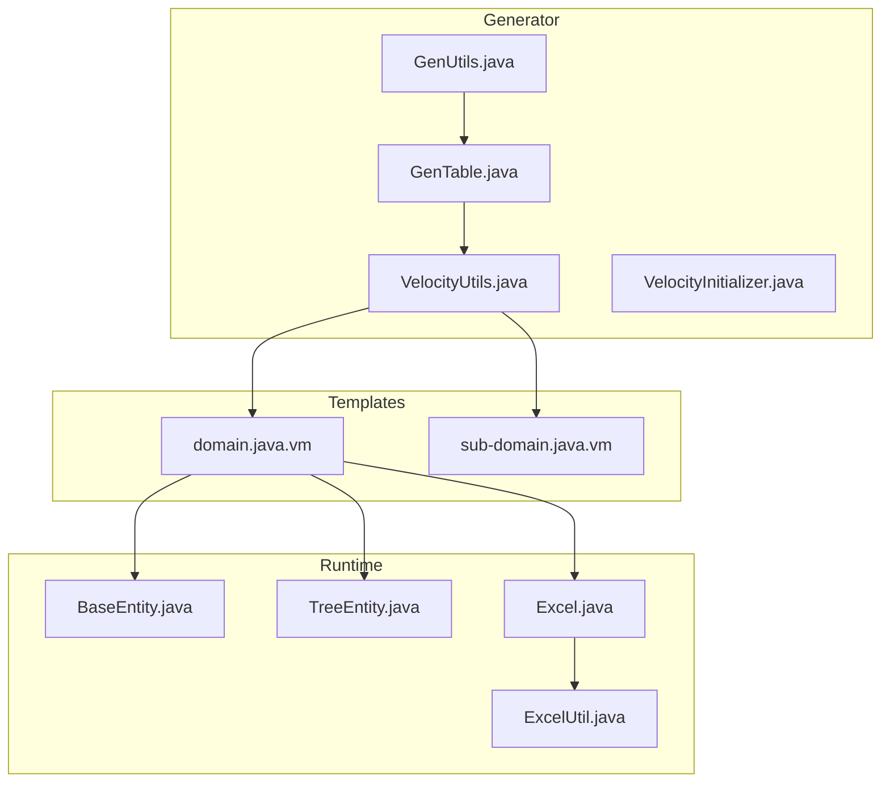
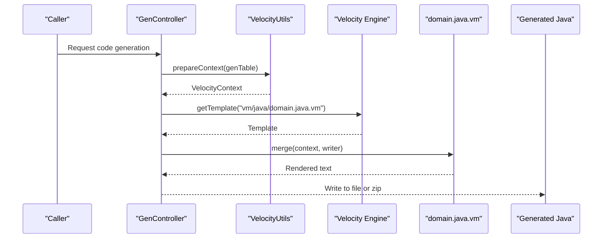
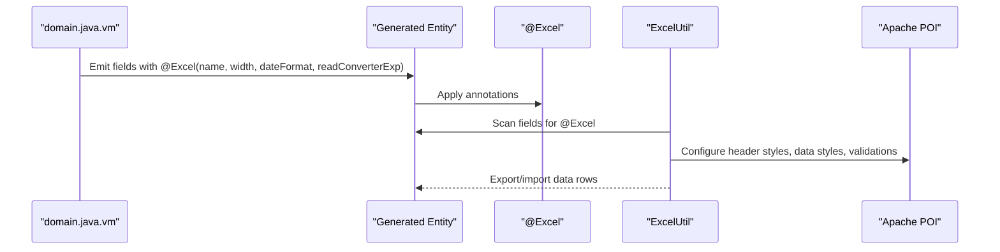
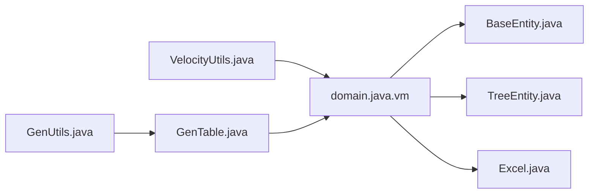

# Domain

<cite>
**Referenced Files in This Document**
- [domain.java.vm](file://src/main/resources/vm/java/domain.java.vm)
- [sub-domain.java.vm](file://src/main/resources/vm/java/sub-domain.java.vm)
- [GenTable.java](file://src/main/java/com/ruoyi/project/tool/gen/domain/GenTable.java)
- [GenUtils.java](file://src/main/java/com/ruoyi/project/tool/gen/util/GenUtils.java)
- [VelocityUtils.java](file://src/main/java/com/ruoyi/project/tool/gen/util/VelocityUtils.java)
- [GenController.java](file://src/main/java/com/ruoyi/project/tool/gen/controller/GenController.java)
- [Excel.java](file://src/main/java/com/ruoyi/framework/aspectj/lang/annotation/Excel.java)
- [ExcelUtil.java](file://src/main/java/com/ruoyi/common/utils/poi/ExcelUtil.java)
- [BaseEntity.java](file://src/main/java/com/ruoyi/framework/web/domain/BaseEntity.java)
- [TreeEntity.java](file://src/main/java/com/ruoyi/framework/web/domain/TreeEntity.java)
- [SysUser.java](file://src/main/java/com/ruoyi/project/system/domain/SysUser.java)
- [SysDept.java](file://src/main/java/com/ruoyi/project/system/domain/SysDept.java)
</cite>

## Table of Contents
1. [Introduction](#introduction)
2. [Project Structure](#project-structure)
3. [Core Components](#core-components)
4. [Architecture Overview](#architecture-overview)
5. [Detailed Component Analysis](#detailed-component-analysis)
6. [Dependency Analysis](#dependency-analysis)
7. [Performance Considerations](#performance-considerations)
8. [Troubleshooting Guide](#troubleshooting-guide)
9. [Conclusion](#conclusion)

## Introduction
This document explains how the Domain (Entity) component is generated in the RuoYi-Vue backend using the Velocity template domain.java.vm. It covers how the template chooses the base class (BaseEntity or TreeEntity) based on table configuration, how @Excel annotations are applied for import/export, how column comments are processed to derive display names and Excel headers, how getters, setters, and toString() are generated, and how sub-table relationships are handled. It also describes how dynamic imports and serialization compatibility are ensured via template variables.

## Project Structure
The Domain generation pipeline integrates several layers:
- Generator configuration and utilities define metadata and templates.
- Velocity renders templates to produce Java source files.
- Generated entities extend either BaseEntity or TreeEntity depending on table category.
- @Excel annotations enable import/export features.

**Diagram sources**
- [GenTable.java](file://src/main/java/com/ruoyi/project/tool/gen/domain/GenTable.java#L1-L385)
- [GenUtils.java](file://src/main/java/com/ruoyi/project/tool/gen/util/GenUtils.java#L1-L258)
- [VelocityUtils.java](file://src/main/java/com/ruoyi/project/tool/gen/util/VelocityUtils.java#L1-L189)
- [domain.java.vm](file://src/main/resources/vm/java/domain.java.vm#L1-L106)
- [sub-domain.java.vm](file://src/main/resources/vm/java/sub-domain.java.vm#L1-L77)
- [BaseEntity.java](file://src/main/java/com/ruoyi/framework/web/domain/BaseEntity.java#L1-L119)
- [TreeEntity.java](file://src/main/java/com/ruoyi/framework/web/domain/TreeEntity.java#L1-L80)
- [Excel.java](file://src/main/java/com/ruoyi/framework/aspectj/lang/annotation/Excel.java#L1-L197)
- [ExcelUtil.java](file://src/main/java/com/ruoyi/common/utils/poi/ExcelUtil.java#L1-L1665)

**Section sources**
- [GenTable.java](file://src/main/java/com/ruoyi/project/tool/gen/domain/GenTable.java#L1-L385)
- [GenUtils.java](file://src/main/java/com/ruoyi/project/tool/gen/util/GenUtils.java#L1-L258)
- [VelocityUtils.java](file://src/main/java/com/ruoyi/project/tool/gen/util/VelocityUtils.java#L1-L189)
- [domain.java.vm](file://src/main/resources/vm/java/domain.java.vm#L1-L106)
- [sub-domain.java.vm](file://src/main/resources/vm/java/sub-domain.java.vm#L1-L77)

## Core Components
- Domain template (domain.java.vm): Generates entity classes with imports, base class selection, field declarations, getters/setters, toString(), and optional sub-list support.
- Sub-domain template (sub-domain.java.vm): Generates child entities for master-detail relationships.
- Generator metadata (GenTable.java): Holds table-level configuration including category (crud/tree/sub), tree fields, and columns.
- Utilities (GenUtils.java, VelocityUtils.java): Prepare context variables and render templates.
- Runtime base classes (BaseEntity.java, TreeEntity.java): Provide common fields and serialization.
- Import/export annotations (Excel.java) and utilities (ExcelUtil.java): Define and apply Excel-related behaviors.

**Section sources**
- [domain.java.vm](file://src/main/resources/vm/java/domain.java.vm#L1-L106)
- [sub-domain.java.vm](file://src/main/resources/vm/java/sub-domain.java.vm#L1-L77)
- [GenTable.java](file://src/main/java/com/ruoyi/project/tool/gen/domain/GenTable.java#L1-L385)
- [GenUtils.java](file://src/main/java/com/ruoyi/project/tool/gen/util/GenUtils.java#L1-L258)
- [VelocityUtils.java](file://src/main/java/com/ruoyi/project/tool/gen/util/VelocityUtils.java#L1-L189)
- [BaseEntity.java](file://src/main/java/com/ruoyi/framework/web/domain/BaseEntity.java#L1-L119)
- [TreeEntity.java](file://src/main/java/com/ruoyi/framework/web/domain/TreeEntity.java#L1-L80)
- [Excel.java](file://src/main/java/com/ruoyi/framework/aspectj/lang/annotation/Excel.java#L1-L197)
- [ExcelUtil.java](file://src/main/java/com/ruoyi/common/utils/poi/ExcelUtil.java#L1-L1665)

## Architecture Overview
The generator sets up Velocity, prepares a VelocityContext with metadata, selects templates, and merges them to produce Java source files. The Domain template decides the base class and applies @Excel annotations based on column metadata and table category.

**Diagram sources**
- [GenController.java](file://src/main/java/com/ruoyi/project/tool/gen/controller/GenController.java)
- [VelocityUtils.java](file://src/main/java/com/ruoyi/project/tool/gen/util/VelocityUtils.java#L1-L189)
- [domain.java.vm](file://src/main/resources/vm/java/domain.java.vm#L1-L106)

## Detailed Component Analysis

### Base Class Selection: BaseEntity vs TreeEntity
- The template conditionally imports and extends either BaseEntity or TreeEntity based on table category:
  - If crud or sub: extends BaseEntity.
  - If tree: extends TreeEntity.
- This decision is driven by table category flags exposed in the template context.

Key template logic:
- Imports and base class selection:
  - Lines 9–13: Conditional import of BaseEntity or TreeEntity.
  - Lines 21–25: Set $Entity to BaseEntity or TreeEntity.
  - Line 26: Class declaration extends $Entity.

Implications:
- CRUD/sub tables inherit common auditing fields and serialization.
- Tree tables additionally inherit tree-specific fields (parent, order, ancestors, children).

**Section sources**
- [domain.java.vm](file://src/main/resources/vm/java/domain.java.vm#L1-L106)
- [GenTable.java](file://src/main/java/com/ruoyi/project/tool/gen/domain/GenTable.java#L341-L385)
- [BaseEntity.java](file://src/main/java/com/ruoyi/framework/web/domain/BaseEntity.java#L1-L119)
- [TreeEntity.java](file://src/main/java/com/ruoyi/framework/web/domain/TreeEntity.java#L1-L80)

### Column Comments to Display Names and Excel Headers
- The template extracts display names from column comments:
  - If comment contains a left parenthesis character, the part before it is used as the display name.
  - Otherwise, the whole comment is used.
- For list-display columns, the template applies @Excel with:
  - name set to the derived display name.
  - width and dateFormat applied for Date fields.
  - readConverterExp applied for dictionary-type fields.
- This logic is repeated in both domain.java.vm and sub-domain.java.vm.

Template flow:
- Lines 30–47: Iterate columns and conditionally apply @Excel with name, width, dateFormat, and readConverterExp.
- Lines 21–41: Extract display name from comment and set $comment accordingly.

Notes:
- The comment extraction handles Chinese parentheses (left parenthesis) to strip suffixes like “(status)”.
- Date fields receive a default width and date format for Excel rendering.

**Section sources**
- [domain.java.vm](file://src/main/resources/vm/java/domain.java.vm#L1-L106)
- [sub-domain.java.vm](file://src/main/resources/vm/java/sub-domain.java.vm#L1-L77)
- [Excel.java](file://src/main/java/com/ruoyi/framework/aspectj/lang/annotation/Excel.java#L1-L197)
- [ExcelUtil.java](file://src/main/java/com/ruoyi/common/utils/poi/ExcelUtil.java#L1-L1665)

### Standard Getters, Setters, and toString()
- The template generates getters and setters for each non-super-column field.
- Attribute naming respects camelCase and capitalization rules.
- toString() uses Apache Commons Lang3’s ToStringBuilder with MULTI_LINE_STYLE and appends all fields.
- For sub-table entities, toString() also includes the sub-list field.

Template logic:
- Lines 58–76: Generate setter/getter pairs for each field.
- Lines 89–104: Override toString() to include all fields and, for sub entities, the sub-list.

Runtime usage:
- Example entities demonstrate toString() usage with ToStringBuilder and ToStringStyle.MULTI_LINE_STYLE.

**Section sources**
- [domain.java.vm](file://src/main/resources/vm/java/domain.java.vm#L1-L106)
- [sub-domain.java.vm](file://src/main/resources/vm/java/sub-domain.java.vm#L1-L77)
- [SysUser.java](file://src/main/java/com/ruoyi/project/system/domain/SysUser.java#L1-L341)
- [SysDept.java](file://src/main/java/com/ruoyi/project/system/domain/SysDept.java#L1-L204)

### Special Handling for Sub-Table Relationships
- When the table is configured as sub (master-detail), the template declares a field named ${subclassName}List of type List<${subClassName}>.
- It also generates dedicated getter/setter methods for this list field.
- The sub-class name and list variable are prepared in the Velocity context.

Template logic:
- Lines 53–56: Declare the sub-list field.
- Lines 77–87: Generate getter/setter for the sub-list.

Context preparation:
- VelocityUtils sets subClassName, subclassName, and subImportList for sub-table templates.

**Section sources**
- [domain.java.vm](file://src/main/resources/vm/java/domain.java.vm#L1-L106)
- [sub-domain.java.vm](file://src/main/resources/vm/java/sub-domain.java.vm#L1-L77)
- [VelocityUtils.java](file://src/main/java/com/ruoyi/project/tool/gen/util/VelocityUtils.java#L1-L189)

### Dynamic Imports and Serialization Compatibility
- Dynamic imports:
  - $!{importList} injects required imports for the entity (e.g., Apache Commons Lang3, Excel annotation).
  - $!{subImportList} similarly injects imports for sub entities.
- Serialization:
  - All generated entities include a serialVersionUID field set to 1L.
  - Base classes also declare serialVersionUID.

Template logic:
- Lines 3–9: foreach over $importList and $subImportList to emit import statements.
- Line 28: serialVersionUID declaration in the main entity.
- BaseEntity and TreeEntity also declare serialVersionUID.

**Section sources**
- [domain.java.vm](file://src/main/resources/vm/java/domain.java.vm#L1-L106)
- [sub-domain.java.vm](file://src/main/resources/vm/java/sub-domain.java.vm#L1-L77)
- [BaseEntity.java](file://src/main/java/com/ruoyi/framework/web/domain/BaseEntity.java#L1-L119)
- [TreeEntity.java](file://src/main/java/com/ruoyi/framework/web/domain/TreeEntity.java#L1-L80)

### How $!{columns} Metadata Drives Field Generation
- The template iterates over $!{columns} to:
  - Skip super columns (common fields inherited from base classes).
  - Generate field declarations with appropriate Java types.
  - Apply @Excel annotations with name, width, dateFormat, and readConverterExp.
  - Generate getters/setters and include fields in toString().
- Null safety:
  - The template avoids generating getters/setters for super columns, preventing redundant or conflicting declarations.
- Conditional logic:
  - Uses $table.isSuperColumn(...) to determine visibility of fields in the generated entity.

Template logic:
- Lines 30–47: Column loop with conditional @Excel application.
- Lines 49: Field declaration using $column.javaType and $column.javaField.
- Lines 58–76: Getter/setter generation with attribute name normalization.
- Lines 90–104: toString() generation appending each field.

**Section sources**
- [domain.java.vm](file://src/main/resources/vm/java/domain.java.vm#L1-L106)
- [GenTable.java](file://src/main/java/com/ruoyi/project/tool/gen/domain/GenTable.java#L371-L385)
- [GenUtils.java](file://src/main/java/com/ruoyi/project/tool/gen/util/GenUtils.java#L1-L258)

### Import/Export Workflow with @Excel
- Annotation attributes:
  - name: Display name derived from column comment.
  - width/dateFormat: Applied for Date fields.
  - readConverterExp: Applied for dictionary-type fields.
  - Additional attributes (align, color, handler, args, type, etc.) are available via Excel.java.
- Runtime behavior:
  - ExcelUtil reads @Excel annotations to configure headers, data styles, validations, and conversions during import/export.

**Diagram sources**
- [domain.java.vm](file://src/main/resources/vm/java/domain.java.vm#L1-L106)
- [Excel.java](file://src/main/java/com/ruoyi/framework/aspectj/lang/annotation/Excel.java#L1-L197)
- [ExcelUtil.java](file://src/main/java/com/ruoyi/common/utils/poi/ExcelUtil.java#L1-L1665)

**Section sources**
- [domain.java.vm](file://src/main/resources/vm/java/domain.java.vm#L1-L106)
- [Excel.java](file://src/main/java/com/ruoyi/framework/aspectj/lang/annotation/Excel.java#L1-L197)
- [ExcelUtil.java](file://src/main/java/com/ruoyi/common/utils/poi/ExcelUtil.java#L1-L1665)

## Dependency Analysis
- Template-to-runtime dependencies:
  - domain.java.vm depends on:
    - BaseEntity or TreeEntity for base fields and serialization.
    - Apache Commons Lang3 for ToStringBuilder.
    - @Excel annotation for import/export.
- Generator-to-template dependencies:
  - VelocityUtils prepares context variables (importList, subImportList, subClassName, subclassName).
  - GenTable exposes table category flags and super-column logic.
  - GenUtils converts database metadata to Java types and HTML types.

**Diagram sources**
- [domain.java.vm](file://src/main/resources/vm/java/domain.java.vm#L1-L106)
- [BaseEntity.java](file://src/main/java/com/ruoyi/framework/web/domain/BaseEntity.java#L1-L119)
- [TreeEntity.java](file://src/main/java/com/ruoyi/framework/web/domain/TreeEntity.java#L1-L80)
- [Excel.java](file://src/main/java/com/ruoyi/framework/aspectj/lang/annotation/Excel.java#L1-L197)
- [VelocityUtils.java](file://src/main/java/com/ruoyi/project/tool/gen/util/VelocityUtils.java#L1-L189)
- [GenTable.java](file://src/main/java/com/ruoyi/project/tool/gen/domain/GenTable.java#L1-L385)
- [GenUtils.java](file://src/main/java/com/ruoyi/project/tool/gen/util/GenUtils.java#L1-L258)

**Section sources**
- [VelocityUtils.java](file://src/main/java/com/ruoyi/project/tool/gen/util/VelocityUtils.java#L1-L189)
- [GenTable.java](file://src/main/java/com/ruoyi/project/tool/gen/domain/GenTable.java#L1-L385)
- [GenUtils.java](file://src/main/java/com/ruoyi/project/tool/gen/util/GenUtils.java#L1-L258)
- [domain.java.vm](file://src/main/resources/vm/java/domain.java.vm#L1-L106)

## Performance Considerations
- toString() generation iterates over all columns; for entities with many columns, consider limiting toString() fields or using selective logging.
- @Excel configurations (width, height, alignment) impact workbook rendering performance; tune these for large datasets.
- Sub-list rendering may increase memory usage; ensure pagination or lazy loading in higher layers.

[No sources needed since this section provides general guidance]

## Troubleshooting Guide
Common issues and resolutions:
- Missing imports:
  - Ensure $!{importList} and $!{subImportList} are populated by VelocityUtils and GenTable.
- Incorrect display names:
  - Verify column comments and the presence of left-parenthesis suffixes; the template strips content after the first left parenthesis.
- Date formatting in Excel:
  - Confirm dateFormat and width are applied for Date fields via @Excel.
- Super-column conflicts:
  - Do not manually add getters/setters for super columns; the template skips them to avoid duplication.
- Sub-list not generated:
  - Confirm table category is sub and VelocityUtils prepared subClassName and subImportList.

**Section sources**
- [domain.java.vm](file://src/main/resources/vm/java/domain.java.vm#L1-L106)
- [sub-domain.java.vm](file://src/main/resources/vm/java/sub-domain.java.vm#L1-L77)
- [VelocityUtils.java](file://src/main/java/com/ruoyi/project/tool/gen/util/VelocityUtils.java#L1-L189)
- [GenTable.java](file://src/main/java/com/ruoyi/project/tool/gen/domain/GenTable.java#L341-L385)

## Conclusion
The Domain template in RuoYi-Vue provides a robust, configurable mechanism to generate Java entities tailored to CRUD, tree, and sub-table scenarios. It leverages Velocity context variables to drive imports, base class selection, field generation, and Excel annotations. The resulting entities integrate seamlessly with the runtime base classes and import/export utilities, ensuring consistent behavior across the backend and frontend.