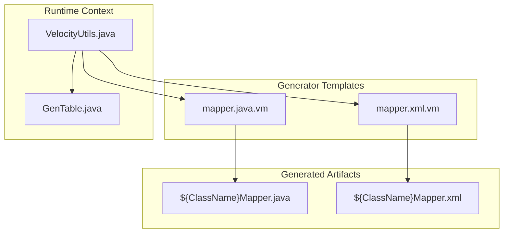
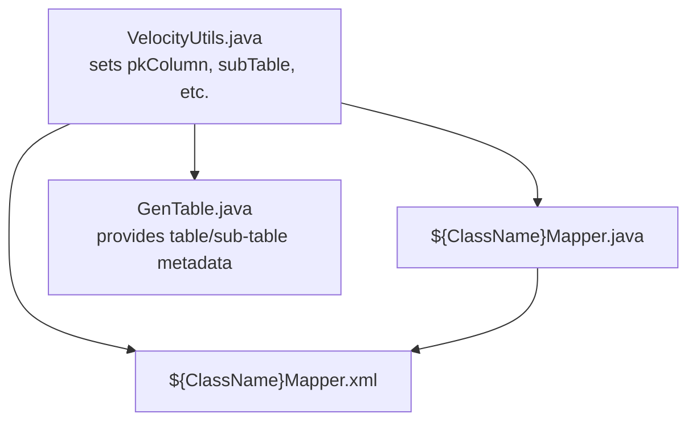
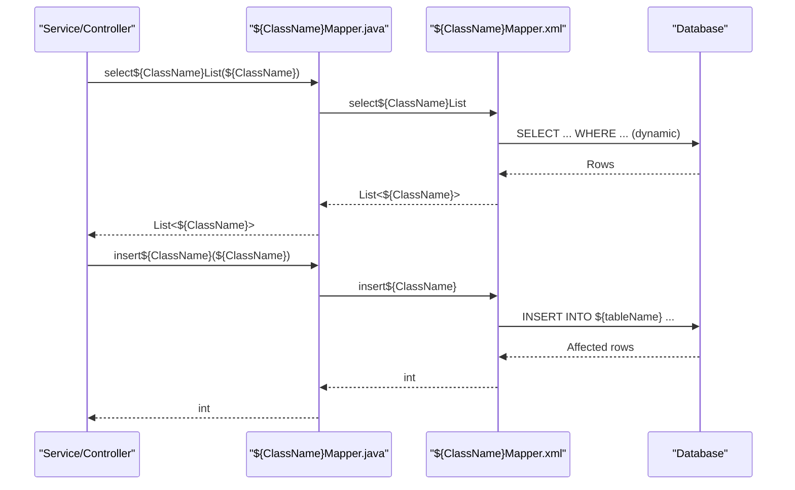
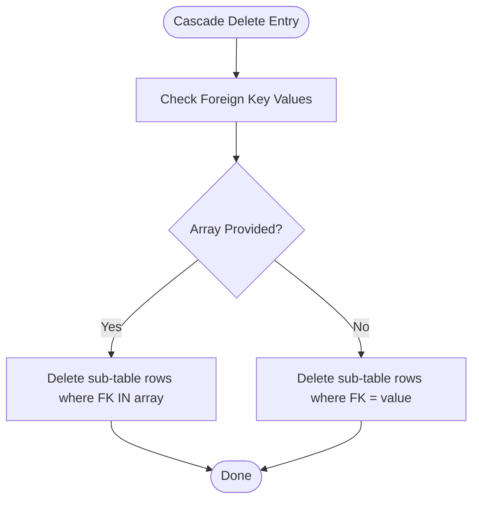
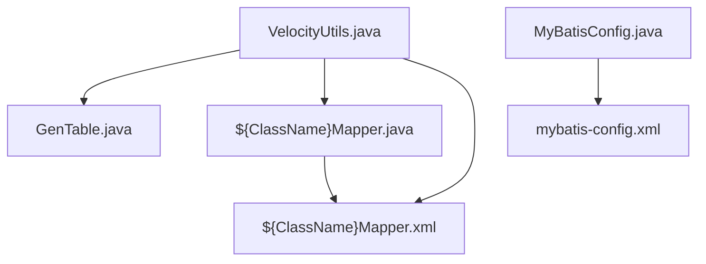

# Mapper

<cite>
**Referenced Files in This Document**
- [mapper.java.vm](file://src/main/resources/vm/java/mapper.java.vm)
- [mapper.xml.vm](file://src/main/resources/vm/xml/mapper.xml.vm)
- [VelocityUtils.java](file://src/main/java/com/ruoyi/project/tool/gen/util/VelocityUtils.java)
- [GenTable.java](file://src/main/java/com/ruoyi/project/tool/gen/domain/GenTable.java)
- [SysUserMapper.java](file://src/main/java/com/ruoyi/project/system/mapper/SysUserMapper.java)
- [SysUserMapper.xml](file://src/main/resources/mybatis/system/SysUserMapper.xml)
- [SysRoleMapper.xml](file://src/main/resources/mybatis/system/SysRoleMapper.xml)
- [SysMenuMapper.xml](file://src/main/resources/mybatis/system/SysMenuMapper.xml)
- [SysUserRoleMapper.xml](file://src/main/resources/mybatis/system/SysUserRoleMapper.xml)
- [SysUserPostMapper.xml](file://src/main/resources/mybatis/system/SysUserPostMapper.xml)
- [MyBatisConfig.java](file://src/main/java/com/ruoyi/framework/config/MyBatisConfig.java)
- [mybatis-config.xml](file://src/main/resources/mybatis/mybatis-config.xml)
</cite>

## Table of Contents
1. [Introduction](#introduction)
2. [Project Structure](#project-structure)
3. [Core Components](#core-components)
4. [Architecture Overview](#architecture-overview)
5. [Detailed Component Analysis](#detailed-component-analysis)
6. [Dependency Analysis](#dependency-analysis)
7. [Performance Considerations](#performance-considerations)
8. [Troubleshooting Guide](#troubleshooting-guide)
9. [Conclusion](#conclusion)

## Introduction
This document explains how the generated Mapper interface is produced by the RuoYi-Vue code generator using the mapper.java.vm template. It covers the CRUD operations (select, insert, update, delete), including single and batch deletion, and sub-table operations when applicable. It also documents how Java generics are used, how MyBatis metadata (notably $!{pkColumn} and $!{subTable}) drives primary-key-based operations and sub-table relationships, and how the template enforces clean separation between business logic and data access while adhering to MyBatis best practices.

## Project Structure
The generator produces:
- A Java interface named ${ClassName}Mapper.java
- A MyBatis XML mapper named ${ClassName}Mapper.xml

These are placed under the generated package’s mapper and mybatis folders respectively. The template variables are populated by the Velocity engine using the VelocityUtils context, which includes metadata such as primary key column, sub-table information, and table-level attributes.

**Diagram sources**
- [mapper.java.vm](file://src/main/resources/vm/java/mapper.java.vm#L1-L92)
- [mapper.xml.vm](file://src/main/resources/vm/xml/mapper.xml.vm#L1-L140)
- [VelocityUtils.java](file://src/main/java/com/ruoyi/project/tool/gen/util/VelocityUtils.java#L37-L74)
- [GenTable.java](file://src/main/java/com/ruoyi/project/tool/gen/domain/GenTable.java#L131-L160)

**Section sources**
- [mapper.java.vm](file://src/main/resources/vm/java/mapper.java.vm#L1-L92)
- [mapper.xml.vm](file://src/main/resources/vm/xml/mapper.xml.vm#L1-L140)
- [VelocityUtils.java](file://src/main/java/com/ruoyi/project/tool/gen/util/VelocityUtils.java#L37-L74)
- [GenTable.java](file://src/main/java/com/ruoyi/project/tool/gen/domain/GenTable.java#L131-L160)

## Core Components
- Generated Mapper interface: Defines CRUD methods with Java generics and primitive/int return types for affected rows.
- Generated Mapper XML: Implements SQL statements and result mappings, including conditional sub-table loading and batch operations.

Key template-driven elements:
- $!{pkColumn}: Provides primary key metadata (javaType, javaField, capJavaField) to drive select-by-id, update, delete, and batch delete operations.
- $!{subTable}: Enables conditional generation of sub-table operations (batch insert, cascade delete by foreign key).

Return values:
- Select methods return entity or lists.
- Insert/update/delete methods return int (affected row count).

**Section sources**
- [mapper.java.vm](file://src/main/resources/vm/java/mapper.java.vm#L15-L91)
- [mapper.xml.vm](file://src/main/resources/vm/xml/mapper.xml.vm#L25-L140)

## Architecture Overview
The generated mapper interface acts as a contract for data access. The XML mapper implements the contract with SQL statements and result mappings. The Velocity context injects metadata so that the template can produce consistent, reusable CRUD and sub-table operations.

**Diagram sources**
- [mapper.java.vm](file://src/main/resources/vm/java/mapper.java.vm#L1-L92)
- [mapper.xml.vm](file://src/main/resources/vm/xml/mapper.xml.vm#L1-L140)
- [VelocityUtils.java](file://src/main/java/com/ruoyi/project/tool/gen/util/VelocityUtils.java#L37-L74)
- [GenTable.java](file://src/main/java/com/ruoyi/project/tool/gen/domain/GenTable.java#L131-L160)

## Detailed Component Analysis

### Mapper Interface Generation
The mapper.java.vm template generates:
- select${ClassName}By${pkColumn.capJavaField}(${pkColumn.javaType} ${pkColumn.javaField}): Single record retrieval by primary key.
- select${ClassName}List(${ClassName} ${className}): Query with dynamic conditions based on the entity fields.
- insert${ClassName}(${ClassName} ${className}): Inserts a new record.
- update${ClassName}(${ClassName} ${className}): Updates an existing record by primary key.
- delete${ClassName}By${pkColumn.capJavaField}(${pkColumn.javaType} ${pkColumn.javaField}): Deletes by primary key.
- delete${ClassName}By${pkColumn.capJavaField}s(${pkColumn.javaType}[] ${pkColumn.javaField}s): Batch delete by array of primary keys.

When sub-tables are present:
- delete${subClassName}By${subTableFkClassName}s(${pkColumn.javaType}[] ${pkColumn.javaField}s): Cascade delete for sub-table records by foreign key array.
- batch${subClassName}(List<${subClassName}> ${subclassName}List): Batch insert for sub-table records.
- delete${subClassName}By${subTableFkClassName}(${pkColumn.javaType} ${pkColumn.javaField}): Cascade delete for sub-table records by a single foreign key.

Method return types:
- CRUD methods return int for affected rows.
- Select methods return entity or List<${ClassName}>.

Generics and parameterization:
- Methods accept ${ClassName} instances and arrays/lists of primary keys.
- Sub-table methods accept List<${subClassName}>.

Conditional generation:
- The template checks $table.sub to include sub-table methods.

Primary key metadata:
- $pkColumn.javaType, $pkColumn.javaField, $pkColumn.capJavaField are used to construct method signatures and SQL where clauses.

Sub-table metadata:
- $subTable, $subTableFkName, $subTableFkClassName, $subClassName, $subclassName are used to generate cascade and batch operations.

**Section sources**
- [mapper.java.vm](file://src/main/resources/vm/java/mapper.java.vm#L15-L91)
- [VelocityUtils.java](file://src/main/java/com/ruoyi/project/tool/gen/util/VelocityUtils.java#L106-L122)
- [GenTable.java](file://src/main/java/com/ruoyi/project/tool/gen/domain/GenTable.java#L131-L160)

### Mapper XML Generation
The mapper.xml.vm template generates:
- ResultMaps for the main entity and sub-table entity, and a combined result map when sub-tables are present.
- SQL fragments for selecting columns.
- Dynamic where clauses based on entity fields and query types (EQ, NE, GT, GTE, LT, LTE, LIKE, BETWEEN).
- Select by primary key with optional sub-table loading via association/collection.
- Select list with dynamic where conditions.
- Insert with conditional field inclusion and auto-generated keys support.
- Update with SET clause and where by primary key.
- Delete by primary key and batch delete by array.
- Sub-table cascade delete by foreign key array and single foreign key.
- Sub-table batch insert.

**Diagram sources**
- [mapper.xml.vm](file://src/main/resources/vm/xml/mapper.xml.vm#L25-L140)
- [mapper.java.vm](file://src/main/resources/vm/java/mapper.java.vm#L15-L91)

**Section sources**
- [mapper.xml.vm](file://src/main/resources/vm/xml/mapper.xml.vm#L1-L140)

### Sub-Table Operations and Cascading Deletion
When $table.sub is true, the template generates:
- delete${subClassName}By${subTableFkClassName}s(${pkColumn.javaType}[] ${pkColumn.javaField}s): Deletes sub-table rows whose foreign key equals any of the provided primary keys.
- delete${subClassName}By${subTableFkClassName}(${pkColumn.javaType} ${pkColumn.javaField}): Deletes sub-table rows by a single foreign key.
- batch${subClassName}(List<${subClassName}> ${subclassName}List): Inserts multiple sub-table rows.

These operations mirror the main table’s batch and single delete patterns, ensuring consistent behavior.

**Diagram sources**
- [mapper.java.vm](file://src/main/resources/vm/java/mapper.java.vm#L64-L91)
- [mapper.xml.vm](file://src/main/resources/vm/xml/mapper.xml.vm#L120-L139)

**Section sources**
- [mapper.java.vm](file://src/main/resources/vm/java/mapper.java.vm#L64-L91)
- [mapper.xml.vm](file://src/main/resources/vm/xml/mapper.xml.vm#L120-L139)

### Method Signatures and Return Types
- select${ClassName}By${pkColumn.capJavaField}(${pkColumn.javaType} ${pkColumn.javaField}): returns ${ClassName}
- select${ClassName}List(${ClassName} ${className}): returns List<${ClassName}>
- insert${ClassName}(${ClassName} ${className}): returns int
- update${ClassName}(${ClassName} ${className}): returns int
- delete${ClassName}By${pkColumn.capJavaField}(${pkColumn.javaType} ${pkColumn.javaField}): returns int
- delete${ClassName}By${pkColumn.capJavaField}s(${pkColumn.javaType}[] ${pkColumn.javaField}s): returns int
- delete${subClassName}By${subTableFkClassName}s(${pkColumn.javaType}[] ${pkColumn.javaField}s): returns int
- delete${subClassName}By${subTableFkClassName}(${pkColumn.javaType} ${pkColumn.javaField}): returns int
- batch${subClassName}(List<${subClassName}> ${subclassName}List): returns int

Parameter types are derived from $pkColumn.javaType and entity/sub-entity fields. Return types consistently use int for DML operations and entity/list types for queries.

**Section sources**
- [mapper.java.vm](file://src/main/resources/vm/java/mapper.java.vm#L15-L91)

### Java Generics and MyBatis Best Practices
- Generics: The interface uses List<${ClassName}> and List<${subClassName}> to represent collections, enabling type-safe handling in services.
- Parameterization: All SQL parameters are bound via MyBatis parameterType and #{...} placeholders, preventing SQL injection.
- Result mapping: ResultMaps define property-to-column mappings and, when applicable, association/collection mappings for sub-tables.
- Auto-generated keys: When the primary key is auto-increment, the XML insert statement sets useGeneratedKeys and keyProperty accordingly.
- Conditional fields: Insert and update statements conditionally include fields based on nullability and required flags.

**Section sources**
- [mapper.xml.vm](file://src/main/resources/vm/xml/mapper.xml.vm#L80-L108)
- [mybatis-config.xml](file://src/main/resources/mybatis/mybatis-config.xml#L1-L20)
- [MyBatisConfig.java](file://src/main/java/com/ruoyi/framework/config/MyBatisConfig.java#L116-L125)

### Example: Generated Interface vs. Real Implementation
The generated interface follows a consistent pattern. For comparison, real mappers in the codebase demonstrate the same patterns:
- SysUserMapper.java defines selectUserList, selectUserById, insertUser, updateUser, deleteUserById, deleteUserByIds, etc.
- SysUserMapper.xml implements the corresponding SQL with result maps and dynamic where clauses.

This validates that the template produces interfaces and XML that match established conventions.

**Section sources**
- [SysUserMapper.java](file://src/main/java/com/ruoyi/project/system/mapper/SysUserMapper.java#L1-L148)
- [SysUserMapper.xml](file://src/main/resources/mybatis/system/SysUserMapper.xml#L1-L227)

## Dependency Analysis
The generator depends on:
- VelocityUtils to populate the VelocityContext with table metadata, including pkColumn and sub-table fields.
- GenTable to carry table and sub-table definitions.

The generated artifacts depend on:
- MyBatis runtime for SQL execution and result mapping.
- MyBatisConfig and mybatis-config.xml for global settings and mapper locations.

**Diagram sources**
- [VelocityUtils.java](file://src/main/java/com/ruoyi/project/tool/gen/util/VelocityUtils.java#L37-L74)
- [GenTable.java](file://src/main/java/com/ruoyi/project/tool/gen/domain/GenTable.java#L131-L160)
- [MyBatisConfig.java](file://src/main/java/com/ruoyi/framework/config/MyBatisConfig.java#L116-L125)
- [mybatis-config.xml](file://src/main/resources/mybatis/mybatis-config.xml#L1-L20)

**Section sources**
- [VelocityUtils.java](file://src/main/java/com/ruoyi/project/tool/gen/util/VelocityUtils.java#L37-L74)
- [GenTable.java](file://src/main/java/com/ruoyi/project/tool/gen/domain/GenTable.java#L131-L160)
- [MyBatisConfig.java](file://src/main/java/com/ruoyi/framework/config/MyBatisConfig.java#L116-L125)
- [mybatis-config.xml](file://src/main/resources/mybatis/mybatis-config.xml#L1-L20)

## Performance Considerations
- Use batch operations for sub-table inserts (batch${subClassName}) to reduce round-trips.
- Prefer indexed primary keys and foreign keys to optimize joins and deletes.
- Leverage dynamic where clauses judiciously; ensure appropriate indexes exist for filtered columns.
- Consider pagination for select${ClassName}List when datasets are large.

[No sources needed since this section provides general guidance]

## Troubleshooting Guide
Common issues and resolutions:
- Incorrect primary key type: Ensure $pkColumn.javaType matches the actual database column type; mismatches cause binding errors.
- Missing sub-table metadata: Verify $table.sub is set and $subTableFkName is configured; otherwise sub-table methods will not be generated.
- Auto-generated keys not applied: Confirm the primary key column is marked auto-increment; the XML insert must set useGeneratedKeys and keyProperty.
- Dynamic where clause not filtering: Review queryType and parameterType usage in the XML template; ensure fields are not null and meet required conditions.
- Transaction boundaries: For cascading deletes and updates, wrap operations in transactions to maintain referential integrity.

**Section sources**
- [mapper.xml.vm](file://src/main/resources/vm/xml/mapper.xml.vm#L80-L108)
- [mapper.java.vm](file://src/main/resources/vm/java/mapper.java.vm#L64-L91)

## Conclusion
The mapper.java.vm template systematically generates a MyBatis mapper interface and XML that implement robust CRUD operations and sub-table handling. By leveraging $!{pkColumn} and $!{subTable} metadata, the template ensures consistent method signatures, parameterization, and result mapping. The generated artifacts adhere to MyBatis best practices, separating business logic from data access and providing clean, maintainable code.