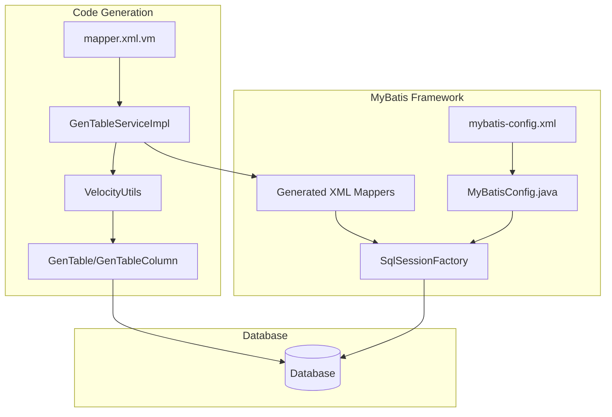
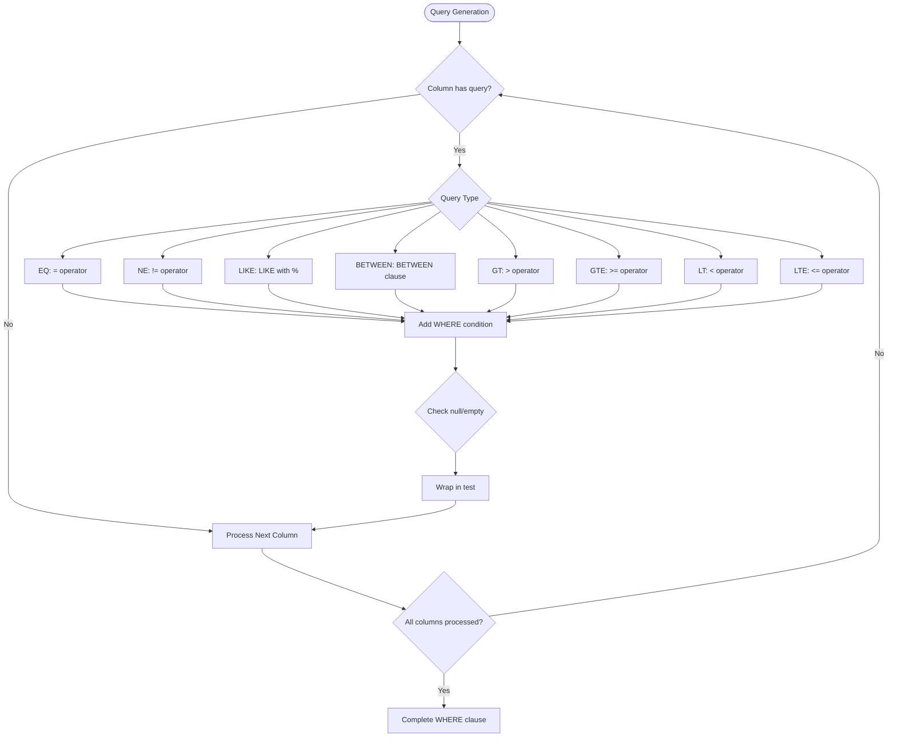
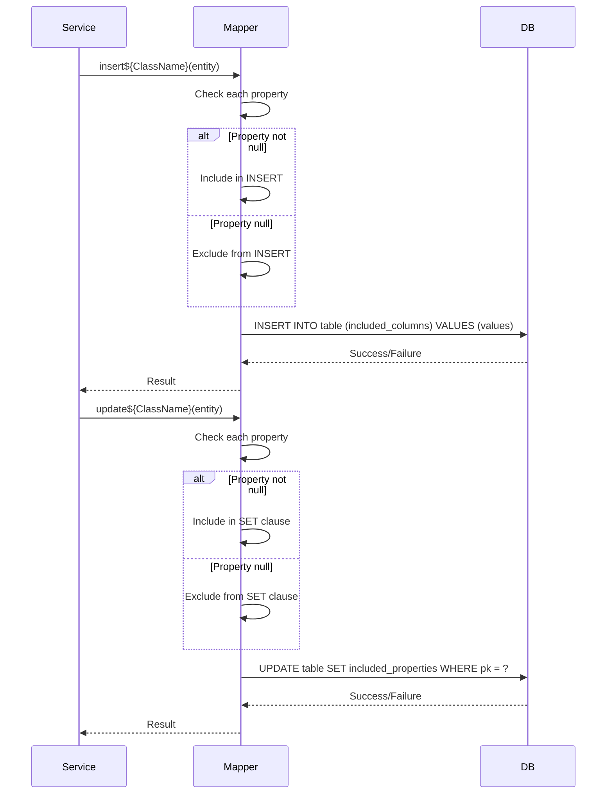
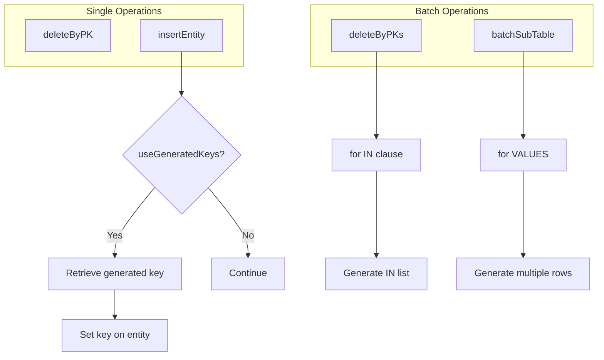
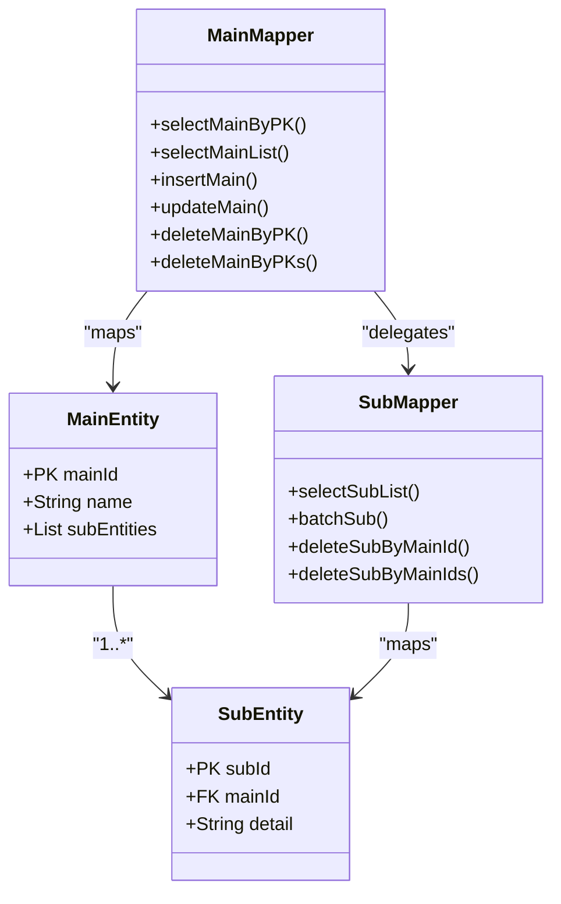
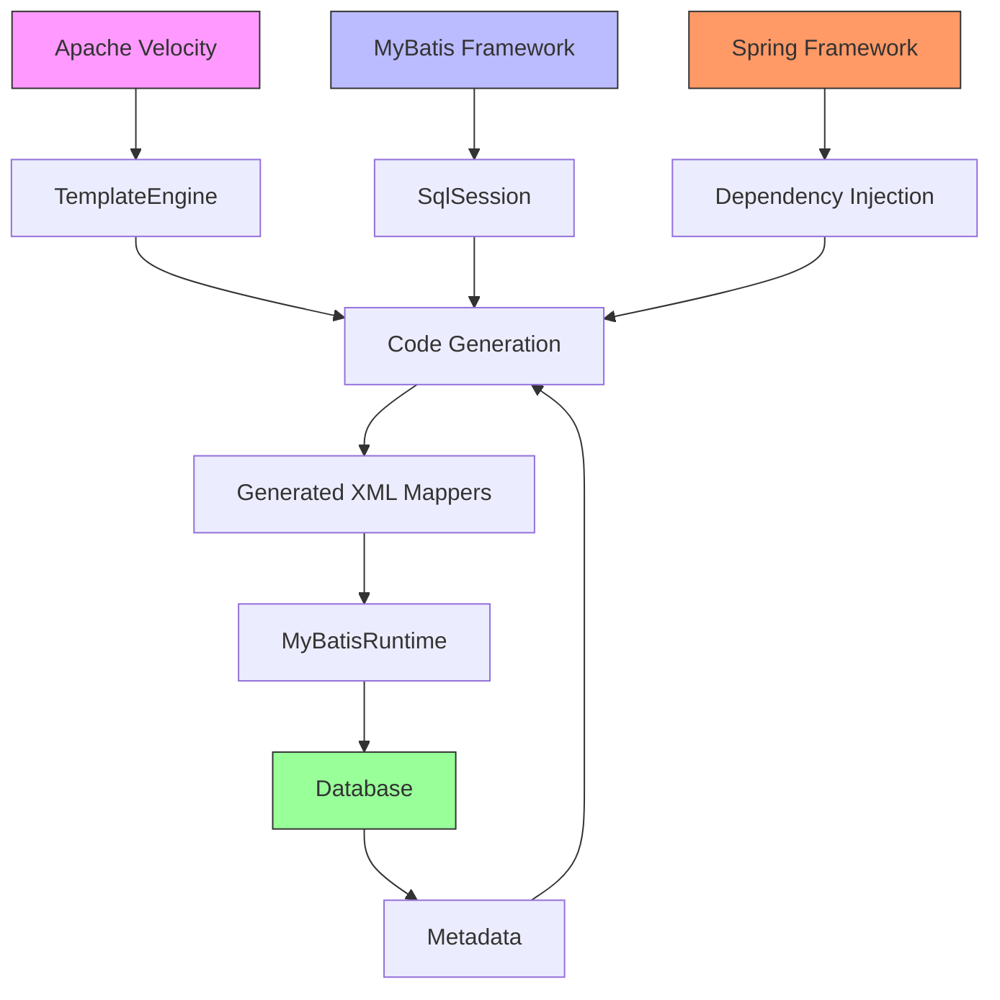

# MyBatis XML

<cite>
**Referenced Files in This Document**   
- [mapper.xml.vm](file://src/main/resources/vm/xml/mapper.xml.vm)
- [MyBatisConfig.java](file://src/main/java/com/ruoyi/framework/config/MyBatisConfig.java)
- [mybatis-config.xml](file://src/main/resources/mybatis/mybatis-config.xml)
- [VelocityUtils.java](file://src/main/java/com/ruoyi/project/tool/gen/util/VelocityUtils.java)
- [GenTable.java](file://src/main/java/com/ruoyi/project/tool/gen/domain/GenTable.java)
- [GenTableColumn.java](file://src/main/java/com/ruoyi/project/tool/gen/domain/GenTableColumn.java)
- [SysUserMapper.xml](file://src/main/resources/mybatis/system/SysUserMapper.xml)
- [SysRoleMapper.xml](file://src/main/resources/mybatis/system/SysRoleMapper.xml)
</cite>

## Table of Contents
1. [Introduction](#introduction)
2. [Core Components](#core-components)
3. [Architecture Overview](#architecture-overview)
4. [Detailed Component Analysis](#detailed-component-analysis)
5. [Dependency Analysis](#dependency-analysis)
6. [Performance Considerations](#performance-considerations)
7. [Troubleshooting Guide](#troubleshooting-guide)
8. [Conclusion](#conclusion)

## Introduction
The RuoYi-Vue backend framework utilizes a code generation system based on Apache Velocity templates to automatically create comprehensive MyBatis XML mapper files. These mappers provide complete SQL mappings for all CRUD operations, handling both simple entities and complex master-detail relationships. The system generates type-safe, efficient SQL statements with dynamic query capabilities, proper parameter handling, and support for batch operations. This documentation details how the `mapper.xml.vm` template creates these XML mappers, covering resultMap definitions, dynamic SQL generation, and special handling for various database operations.

**Section sources**
- [mapper.xml.vm](file://src/main/resources/vm/xml/mapper.xml.vm#L1-L140)

## Core Components

The MyBatis XML mapper generation in RuoYi-Vue is driven by several core components working together. The `mapper.xml.vm` Velocity template serves as the blueprint for generating XML mapper files, using metadata from database tables and configuration settings. This template is processed by the code generation system, which leverages VelocityUtils to prepare the context data from GenTable and GenTableColumn domain objects. The generated XML files are then used by MyBatis, configured through MyBatisConfig.java and mybatis-config.xml, to execute database operations. The system supports various template categories (CRUD, tree, and sub-table) and generates appropriate SQL statements for each use case, including specialized handling for master-detail relationships.

**Section sources**
- [mapper.xml.vm](file://src/main/resources/vm/xml/mapper.xml.vm#L1-L140)
- [MyBatisConfig.java](file://src/main/java/com/ruoyi/framework/config/MyBatisConfig.java#L1-L132)
- [mybatis-config.xml](file://src/main/resources/mybatis/mybatis-config.xml#L1-L21)
- [VelocityUtils.java](file://src/main/java/com/ruoyi/project/tool/gen/util/VelocityUtils.java#L1-L409)
- [GenTable.java](file://src/main/java/com/ruoyi/project/tool/gen/domain/GenTable.java#L1-L385)
- [GenTableColumn.java](file://src/main/java/com/ruoyi/project/tool/gen/domain/GenTableColumn.java#L1-L373)

## Architecture Overview

The MyBatis XML mapper generation architecture in RuoYi-Vue follows a template-based code generation approach. The system uses Velocity templates to generate complete XML mapper files from database metadata. The architecture consists of several layers: the template layer (`.vm` files), the generation service layer (GenTableServiceImpl), the utility layer (VelocityUtils, GenUtils), and the configuration layer (MyBatisConfig). When a user requests code generation, the system retrieves table metadata from the database, processes it through the Velocity template engine with the prepared context, and outputs fully functional XML mapper files. These generated mappers integrate with the MyBatis framework, which is configured to scan for mapper interfaces and XML files, enabling seamless database access throughout the application.

**Diagram sources **
- [mapper.xml.vm](file://src/main/resources/vm/xml/mapper.xml.vm#L1-L140)
- [GenTableServiceImpl.java](file://src/main/java/com/ruoyi/project/tool/gen/service/GenTableServiceImpl.java#L1-L388)
- [VelocityUtils.java](file://src/main/java/com/ruoyi/project/tool/gen/util/VelocityUtils.java#L1-L409)
- [MyBatisConfig.java](file://src/main/java/com/ruoyi/framework/config/MyBatisConfig.java#L1-L132)

## Detailed Component Analysis

### ResultMap and SQL Structure Analysis
The `mapper.xml.vm` template creates comprehensive resultMap definitions for both main and sub-entities. For main entities, it generates a basic resultMap that maps database columns to Java object properties using the `<result>` elements. When sub-table relationships exist (indicated by the `$table.sub` condition), the template creates extended resultMaps that include collection mappings for the sub-table data. These nested resultMaps use the `<collection>` element with a `select` attribute to enable lazy loading of sub-table data. The template also defines reusable SQL fragments using the `<sql>` element, such as `select${ClassName}Vo`, which contains the SELECT clause with all columns from the main table. This approach promotes code reuse and maintainability across multiple queries.

**Section sources**
- [mapper.xml.vm](file://src/main/resources/vm/xml/mapper.xml.vm#L7-L27)

### Dynamic Query Generation
The template implements sophisticated dynamic SQL in the `select${ClassName}List` query, generating conditional WHERE clauses based on the `$!{columns}` metadata and their query types. For each column marked as a query field, the template generates appropriate MyBatis `<if>` conditions that check for null values and, for String types, empty strings after trimming. The query types (EQ, NE, LIKE, BETWEEN, etc.) determine the SQL operator used in the WHERE clause. For example, EQ generates an equality condition, LIKE creates a pattern match with wildcards, and BETWEEN handles range queries with begin and end parameters. This dynamic approach ensures that only relevant conditions are included in the final SQL statement, preventing unnecessary database filtering.

**Diagram sources **
- [mapper.xml.vm](file://src/main/resources/vm/xml/mapper.xml.vm#L29-L58)

### Insert and Update Operations
The template implements insert and update operations with dynamic column inclusion based on null checks and string emptiness. For insert operations, the template uses `<trim>` elements with `suffixOverrides=","` to build both the column list and VALUES clause, wrapping each column in an `<if>` condition that checks if the corresponding Java property is not null (and not empty for required String fields). This ensures that only non-null properties are included in the INSERT statement, allowing the database to apply default values or handle auto-increment keys appropriately. Similarly, update operations use a `<set>` element with `<if>` conditions to include only non-null properties in the SET clause, preventing accidental overwrites of existing data with null values.

**Diagram sources **
- [mapper.xml.vm](file://src/main/resources/vm/xml/mapper.xml.vm#L80-L108)

### Batch Operations and Special Handling
The template includes comprehensive support for batch operations and special database features. It defines delete operations for both single and multiple records, with the latter using MyBatis's `<foreach>` element to generate IN clauses for batch deletion. For sub-table relationships, the template generates specialized batch operations including `batch${subClassName}` for inserting multiple sub-table records and `delete${subClassName}By${subTableFkClassName}s` for deleting sub-table records by foreign key. The template also handles auto-increment keys through the `useGeneratedKeys="true"` attribute in insert statements when the primary key column is configured for auto-increment, allowing MyBatis to retrieve generated keys and set them back on the Java object.

**Diagram sources **
- [mapper.xml.vm](file://src/main/resources/vm/xml/mapper.xml.vm#L110-L138)

### Master-Detail Relationship Handling
For master-detail (sub-table) relationships, the template implements comprehensive data persistence logic. It generates nested resultMaps that map the main entity to its collection of sub-entities using the `<collection>` element with a separate select query. The template creates specialized methods for managing sub-table data, including batch insertion (`batch${subClassName}`) and cascading deletion operations. When a main entity is deleted, the system can automatically delete associated sub-table records through the generated `delete${subClassName}By${subTableFkClassName}` methods. This ensures complete data integrity and provides a complete set of operations for managing hierarchical data structures in the database.

**Diagram sources **
- [mapper.xml.vm](file://src/main/resources/vm/xml/mapper.xml.vm#L12-L23)
- [mapper.xml.vm](file://src/main/resources/vm/xml/mapper.xml.vm#L71-L77)
- [mapper.xml.vm](file://src/main/resources/vm/xml/mapper.xml.vm#L120-L138)

## Dependency Analysis

The MyBatis XML mapper generation system has several key dependencies that enable its functionality. The primary dependency is on Apache Velocity, which processes the `.vm` templates to generate the final XML files. The system depends on MyBatis for database access, with the generated XML mappers integrating directly with MyBatis's SQL mapping framework. The code generation service depends on the GenTable and GenTableColumn domain objects to provide metadata about database tables and columns. Configuration dependencies include the MyBatisConfig class and mybatis-config.xml file, which set up the MyBatis environment. The system also depends on Spring Framework components for dependency injection and configuration management. These dependencies work together to create a cohesive system that transforms database metadata into fully functional data access code.

**Diagram sources **
- [pom.xml](file://pom.xml)
- [MyBatisConfig.java](file://src/main/java/com/ruoyi/framework/config/MyBatisConfig.java#L1-L132)
- [VelocityUtils.java](file://src/main/java/com/ruoyi/project/tool/gen/util/VelocityUtils.java#L1-L409)

## Performance Considerations

The generated MyBatis XML mappers are designed with performance in mind. The use of dynamic SQL ensures that only necessary conditions are included in WHERE clauses, reducing database processing overhead. The template generates efficient batch operations using `<foreach>` elements, minimizing the number of database round-trips for multiple operations. For master-detail relationships, the nested resultMaps with separate select queries enable lazy loading, preventing unnecessary retrieval of sub-table data when not needed. The system also benefits from MyBatis's built-in caching mechanisms, as indicated by the `cacheEnabled` setting in mybatis-config.xml. However, developers should be aware that complex nested selects can lead to the N+1 query problem, and in high-performance scenarios, they may need to implement JOIN-based queries or use eager loading selectively.

**Section sources**
- [mybatis-config.xml](file://src/main/resources/mybatis/mybatis-config.xml#L1-L21)
- [mapper.xml.vm](file://src/main/resources/vm/xml/mapper.xml.vm#L1-L140)

## Troubleshooting Guide

When troubleshooting issues with the generated MyBatis XML mappers, several common problems may arise. If generated SQL statements are not behaving as expected, verify that the column metadata in GenTableColumn is correctly configured, particularly the queryType and isQuery properties. For issues with auto-increment keys not being retrieved, ensure that the primary key column has `isIncrement="1"` in the metadata and that the database table is properly configured for auto-increment. If sub-table data is not being loaded correctly, check that the foreign key relationships are properly defined in the GenTable metadata. Performance issues with complex queries may indicate the need to optimize the generated SQL or adjust the fetching strategy from nested selects to JOINs. Debugging can be facilitated by enabling MyBatis logging through the `logImpl` setting in mybatis-config.xml.

**Section sources**
- [mapper.xml.vm](file://src/main/resources/vm/xml/mapper.xml.vm#L1-L140)
- [mybatis-config.xml](file://src/main/resources/mybatis/mybatis-config.xml#L1-L21)
- [GenTableColumn.java](file://src/main/java/com/ruoyi/project/tool/gen/domain/GenTableColumn.java#L1-L373)

## Conclusion

The MyBatis XML mapper generation system in RuoYi-Vue provides a comprehensive solution for creating data access code. By leveraging Velocity templates and database metadata, the system automatically generates complete XML mappers with support for all CRUD operations, dynamic queries, batch processing, and master-detail relationships. The generated code follows MyBatis best practices, including proper parameter handling, null checks, and reusable SQL fragments. The architecture promotes maintainability and consistency across the application's data access layer while providing flexibility for different use cases through template categories. This automated approach significantly reduces development time and minimizes the risk of SQL-related errors, making it a valuable component of the RuoYi-Vue framework.