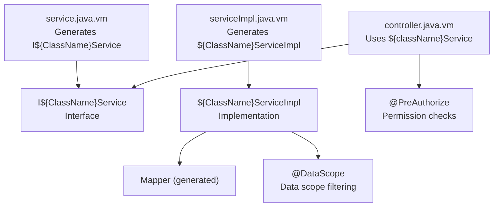
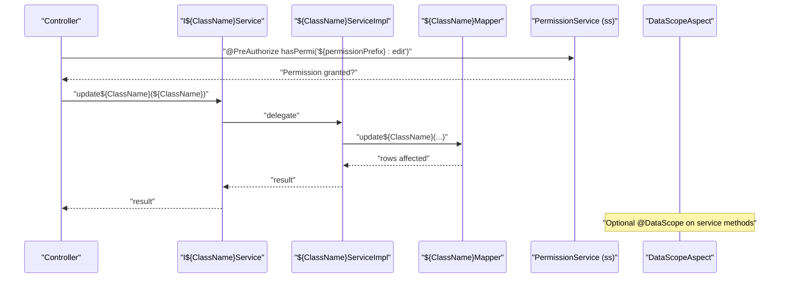
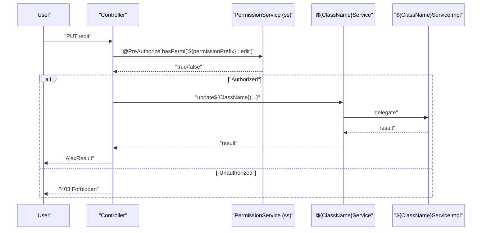
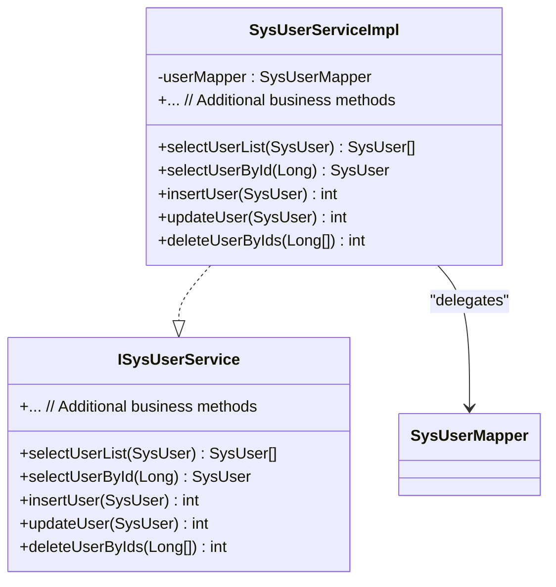
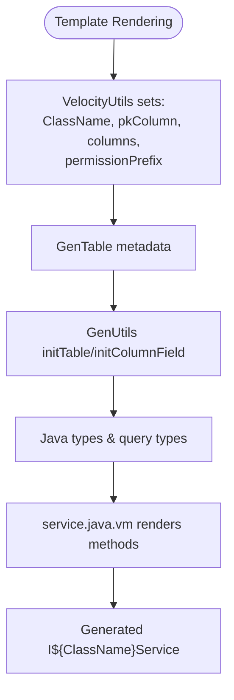
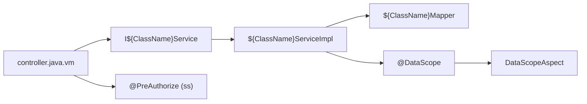

# Service

<cite>
**Referenced Files in This Document**
- [service.java.vm](file://src/main/resources/vm/java/service.java.vm)
- [serviceImpl.java.vm](file://src/main/resources/vm/java/serviceImpl.java.vm)
- [controller.java.vm](file://src/main/resources/vm/java/controller.java.vm)
- [ISysUserService.java](file://src/main/java/com/ruoyi/project/system/service/ISysUserService.java)
- [SysUserServiceImpl.java](file://src/main/java/com/ruoyi/project/system/service/impl/SysUserServiceImpl.java)
- [PermissionService.java](file://src/main/java/com/ruoyi/framework/security/service/PermissionService.java)
- [VelocityUtils.java](file://src/main/java/com/ruoyi/project/tool/gen/util/VelocityUtils.java)
- [GenUtils.java](file://src/main/java/com/ruoyi/project/tool/gen/util/GenUtils.java)
- [DataScope.java](file://src/main/java/com/ruoyi/framework/aspectj/lang/annotation/DataScope.java)
- [DataScopeAspect.java](file://src/main/java/com/ruoyi/framework/aspectj/DataScopeAspect.java)
</cite>

## Table of Contents
1. [Introduction](#introduction)
2. [Project Structure](#project-structure)
3. [Core Components](#core-components)
4. [Architecture Overview](#architecture-overview)
5. [Detailed Component Analysis](#detailed-component-analysis)
6. [Dependency Analysis](#dependency-analysis)
7. [Performance Considerations](#performance-considerations)
8. [Troubleshooting Guide](#troubleshooting-guide)
9. [Conclusion](#conclusion)

## Introduction
This document explains how the generated Service interface template in the RuoYi-Vue backend produces a clean, type-safe service contract that abstracts data access and exposes standard CRUD operations. It covers method signatures for querying single and list records, inserting, updating, and deleting entities (including batch deletion), and how JavaDoc comments clarify parameters and return values. It also describes the separation of concerns between the service interface and its implementation, enabling multiple implementations and acting as the primary extension point for business logic. Finally, it explains how the interface integrates with RuoYi’s permission system through method-level documentation and annotations, and how metadata such as $!{ClassName}, $!{pkColumn}, and $!{columns} ensures type-safe method signatures aligned with the domain model.

## Project Structure
The service contract is generated from a Velocity template that is parameterized with metadata about the domain entity. The template defines the service interface with standard CRUD methods and JavaDoc comments. The controller consumes the service interface, while the implementation delegates to mappers. Permissions are enforced via annotations on controllers and data scope filtering via an aspect.



**Diagram sources**
- [service.java.vm](file://src/main/resources/vm/java/service.java.vm#L1-L62)
- [serviceImpl.java.vm](file://src/main/resources/vm/java/serviceImpl.java.vm#L1-L47)
- [controller.java.vm](file://src/main/resources/vm/java/controller.java.vm#L90-L116)
- [DataScope.java](file://src/main/java/com/ruoyi/framework/aspectj/lang/annotation/DataScope.java#L1-L34)
- [DataScopeAspect.java](file://src/main/java/com/ruoyi/framework/aspectj/DataScopeAspect.java#L46-L85)

**Section sources**
- [service.java.vm](file://src/main/resources/vm/java/service.java.vm#L1-L62)
- [serviceImpl.java.vm](file://src/main/resources/vm/java/serviceImpl.java.vm#L1-L47)
- [controller.java.vm](file://src/main/resources/vm/java/controller.java.vm#L90-L116)

## Core Components
- Generated Service Interface Template: Defines the clean contract with standard CRUD methods and JavaDoc comments. See [service.java.vm](file://src/main/resources/vm/java/service.java.vm#L1-L62).
- Generated Service Implementation Template: Implements the interface and delegates to the mapper. See [serviceImpl.java.vm](file://src/main/resources/vm/java/serviceImpl.java.vm#L1-L47).
- Controller Integration: Calls the service interface and enforces permissions via annotations. See [controller.java.vm](file://src/main/resources/vm/java/controller.java.vm#L90-L116).
- Concrete Example: ISysUserService and SysUserServiceImpl demonstrate real-world usage of the pattern. See [ISysUserService.java](file://src/main/java/com/ruoyi/project/system/service/ISysUserService.java#L1-L218) and [SysUserServiceImpl.java](file://src/main/java/com/ruoyi/project/system/service/impl/SysUserServiceImpl.java#L1-L566).
- Permission Enrichment: PermissionService exposes method-level permission checks consumed by controllers. See [PermissionService.java](file://src/main/java/com/ruoyi/framework/security/service/PermissionService.java#L1-L85).
- Metadata Population: VelocityUtils and GenUtils populate template variables like $!{ClassName}, $!{pkColumn}, and $!{columns}. See [VelocityUtils.java](file://src/main/java/com/ruoyi/project/tool/gen/util/VelocityUtils.java#L42-L120) and [GenUtils.java](file://src/main/java/com/ruoyi/project/tool/gen/util/GenUtils.java#L1-L258).

**Section sources**
- [service.java.vm](file://src/main/resources/vm/java/service.java.vm#L1-L62)
- [serviceImpl.java.vm](file://src/main/resources/vm/java/serviceImpl.java.vm#L1-L47)
- [controller.java.vm](file://src/main/resources/vm/java/controller.java.vm#L90-L116)
- [ISysUserService.java](file://src/main/java/com/ruoyi/project/system/service/ISysUserService.java#L1-L218)
- [SysUserServiceImpl.java](file://src/main/java/com/ruoyi/project/system/service/impl/SysUserServiceImpl.java#L1-L566)
- [PermissionService.java](file://src/main/java/com/ruoyi/framework/security/service/PermissionService.java#L1-L85)
- [VelocityUtils.java](file://src/main/java/com/ruoyi/project/tool/gen/util/VelocityUtils.java#L42-L120)
- [GenUtils.java](file://src/main/java/com/ruoyi/project/tool/gen/util/GenUtils.java#L1-L258)

## Architecture Overview
The generated service interface acts as the primary extension point for business logic. Controllers depend on the interface, not implementations, enabling multiple implementations. The implementation delegates to mappers. Permissions are enforced at the controller layer using @PreAuthorize with the ss bean. Data scope filtering is handled by an aspect annotated with @DataScope.



**Diagram sources**
- [controller.java.vm](file://src/main/resources/vm/java/controller.java.vm#L90-L116)
- [service.java.vm](file://src/main/resources/vm/java/service.java.vm#L1-L62)
- [serviceImpl.java.vm](file://src/main/resources/vm/java/serviceImpl.java.vm#L1-L47)
- [PermissionService.java](file://src/main/java/com/ruoyi/framework/security/service/PermissionService.java#L1-L85)
- [DataScope.java](file://src/main/java/com/ruoyi/framework/aspectj/lang/annotation/DataScope.java#L1-L34)
- [DataScopeAspect.java](file://src/main/java/com/ruoyi/framework/aspectj/DataScopeAspect.java#L46-L85)

## Detailed Component Analysis

### Service Interface Template: Clean Contract with Standard CRUD
- Purpose: Provide a stable, type-safe contract for business operations without exposing data access internals.
- Methods:
  - Single record retrieval by primary key
  - List retrieval by example criteria
  - Insert
  - Update
  - Delete by primary key
  - Batch delete by array of primary keys
- JavaDoc: Each method includes parameter and return descriptions, improving readability and IDE support.
- Metadata-driven signatures:
  - $!{ClassName} ensures the domain class name is used consistently.
  - $!{pkColumn.javaType} and $!{pkColumn.javaField} ensure the primary key type and field name are correct.
  - $!{columns} enables future expansion for specialized methods if needed.

```mermaid
classDiagram
class I${ClassName}Service {
+select${ClassName}By${pkColumn.capJavaField}(${pkColumn.javaType} ${pkColumn.javaField}) ${ClassName}
+select${ClassName}List(${ClassName} ${className}) ${ClassName}[]
+insert${ClassName}(${ClassName} ${className}) int
+update${ClassName}(${ClassName} ${className}) int
+delete${ClassName}By${pkColumn.capJavaField}s(${pkColumn.javaType}[]) int
+delete${ClassName}By${pkColumn.capJavaField}(${pkColumn.javaType}) int
}
```

**Diagram sources**
- [service.java.vm](file://src/main/resources/vm/java/service.java.vm#L1-L62)

**Section sources**
- [service.java.vm](file://src/main/resources/vm/java/service.java.vm#L1-L62)

### Service Implementation Template: Delegation to Mapper
- Purpose: Implement the interface and delegate to the generated mapper.
- Typical flow:
  - Retrieve by primary key
  - List by criteria
  - Insert/update
  - Delete by primary key and batch delete
- Transactional boundaries and additional business logic can be introduced in the implementation.

```mermaid
classDiagram
class ${ClassName}ServiceImpl {
-${className}Mapper : ${ClassName}Mapper
+select${ClassName}By${pkColumn.capJavaField}(${pkColumn.javaType} ${pkColumn.javaField}) ${ClassName}
+select${ClassName}List(${ClassName} ${className}) ${ClassName}[]
+insert${ClassName}(${ClassName} ${className}) int
+update${ClassName}(${ClassName} ${className}) int
+delete${ClassName}By${pkColumn.capJavaField}s(${pkColumn.javaType}[]) int
+delete${ClassName}By${pkColumn.capJavaField}(${pkColumn.javaType}) int
}
${ClassName}ServiceImpl ..|> I${ClassName}Service
${ClassName}ServiceImpl --> ${ClassName}Mapper : "delegates"
```

**Diagram sources**
- [serviceImpl.java.vm](file://src/main/resources/vm/java/serviceImpl.java.vm#L1-L47)

**Section sources**
- [serviceImpl.java.vm](file://src/main/resources/vm/java/serviceImpl.java.vm#L1-L47)

### Controller Integration and Permission Enforcement
- Controllers call the service interface methods and enforce permissions using @PreAuthorize with the ss bean.
- The permission prefix is computed during generation and injected into the template.
- Example: Edit and Remove endpoints demonstrate permission enforcement and batch deletion.



**Diagram sources**
- [controller.java.vm](file://src/main/resources/vm/java/controller.java.vm#L90-L116)
- [PermissionService.java](file://src/main/java/com/ruoyi/framework/security/service/PermissionService.java#L1-L85)

**Section sources**
- [controller.java.vm](file://src/main/resources/vm/java/controller.java.vm#L90-L116)
- [PermissionService.java](file://src/main/java/com/ruoyi/framework/security/service/PermissionService.java#L1-L85)

### Real-World Example: ISysUserService and SysUserServiceImpl
- Demonstrates the pattern with richer business logic, including data scope filtering via @DataScope and transactional updates.
- Shows how the interface becomes the extension point for complex operations beyond basic CRUD.



**Diagram sources**
- [ISysUserService.java](file://src/main/java/com/ruoyi/project/system/service/ISysUserService.java#L1-L218)
- [SysUserServiceImpl.java](file://src/main/java/com/ruoyi/project/system/service/impl/SysUserServiceImpl.java#L1-L566)

**Section sources**
- [ISysUserService.java](file://src/main/java/com/ruoyi/project/system/service/ISysUserService.java#L1-L218)
- [SysUserServiceImpl.java](file://src/main/java/com/ruoyi/project/system/service/impl/SysUserServiceImpl.java#L1-L566)

### Metadata-Driven Method Signatures
- $!{ClassName}, $!{pkColumn.javaType}, $!{pkColumn.javaField}, $!{columns} ensure type-safe method signatures that match the domain model.
- VelocityUtils sets these variables from the GenTable metadata.
- GenUtils converts database metadata into Java-friendly types and HTML hints.



**Diagram sources**
- [VelocityUtils.java](file://src/main/java/com/ruoyi/project/tool/gen/util/VelocityUtils.java#L42-L120)
- [GenUtils.java](file://src/main/java/com/ruoyi/project/tool/gen/util/GenUtils.java#L1-L258)
- [service.java.vm](file://src/main/resources/vm/java/service.java.vm#L1-L62)

**Section sources**
- [VelocityUtils.java](file://src/main/java/com/ruoyi/project/tool/gen/util/VelocityUtils.java#L42-L120)
- [GenUtils.java](file://src/main/java/com/ruoyi/project/tool/gen/util/GenUtils.java#L1-L258)
- [service.java.vm](file://src/main/resources/vm/java/service.java.vm#L1-L62)

## Dependency Analysis
- Interface-to-Implementation: The generated interface is implemented by the generated implementation class.
- Controller-to-Service: Controllers depend on the interface, not implementations, enabling polymorphism and testing.
- Permission Enforcement: Controllers use @PreAuthorize with the ss bean to validate permissions.
- Data Scope Filtering: Optional @DataScope on service methods triggers DataScopeAspect to filter query results.



**Diagram sources**
- [controller.java.vm](file://src/main/resources/vm/java/controller.java.vm#L90-L116)
- [service.java.vm](file://src/main/resources/vm/java/service.java.vm#L1-L62)
- [serviceImpl.java.vm](file://src/main/resources/vm/java/serviceImpl.java.vm#L1-L47)
- [DataScope.java](file://src/main/java/com/ruoyi/framework/aspectj/lang/annotation/DataScope.java#L1-L34)
- [DataScopeAspect.java](file://src/main/java/com/ruoyi/framework/aspectj/DataScopeAspect.java#L46-L85)

**Section sources**
- [controller.java.vm](file://src/main/resources/vm/java/controller.java.vm#L90-L116)
- [service.java.vm](file://src/main/resources/vm/java/service.java.vm#L1-L62)
- [serviceImpl.java.vm](file://src/main/resources/vm/java/serviceImpl.java.vm#L1-L47)
- [DataScope.java](file://src/main/java/com/ruoyi/framework/aspectj/lang/annotation/DataScope.java#L1-L34)
- [DataScopeAspect.java](file://src/main/java/com/ruoyi/framework/aspectj/DataScopeAspect.java#L46-L85)

## Performance Considerations
- Prefer list queries with pagination and filters to avoid large result sets.
- Use batch operations for bulk deletes to reduce round-trips.
- Ensure indexes exist on primary keys and frequently queried columns.
- Leverage @DataScope to limit result sets early, reducing downstream processing.

## Troubleshooting Guide
- Permission Denied: Verify @PreAuthorize expressions and the ss bean’s hasPermi method. Confirm the logged-in user has the required permission string.
- Data Scope Issues: If results are empty unexpectedly, review @DataScope usage and DataScopeAspect logic.
- Type Mismatch: Ensure $!{pkColumn.javaType} and $!{pkColumn.javaField} match the primary key definition in the domain model.
- Batch Delete Not Working: Confirm the controller endpoint accepts an array of primary keys and the service method signature matches.

**Section sources**
- [PermissionService.java](file://src/main/java/com/ruoyi/framework/security/service/PermissionService.java#L1-L85)
- [DataScopeAspect.java](file://src/main/java/com/ruoyi/framework/aspectj/DataScopeAspect.java#L46-L85)
- [controller.java.vm](file://src/main/resources/vm/java/controller.java.vm#L90-L116)
- [service.java.vm](file://src/main/resources/vm/java/service.java.vm#L1-L62)

## Conclusion
The generated Service interface template in RuoYi-Vue establishes a clean, type-safe contract for business operations. It encapsulates CRUD operations behind a stable interface, enabling multiple implementations and simplifying controller integration. JavaDoc comments improve clarity, while metadata-driven templates ensure signatures align with the domain model. Permission enforcement at the controller layer and optional data scope filtering at the service level integrate seamlessly with RuoYi’s security framework, making the service layer a robust extension point for business logic.