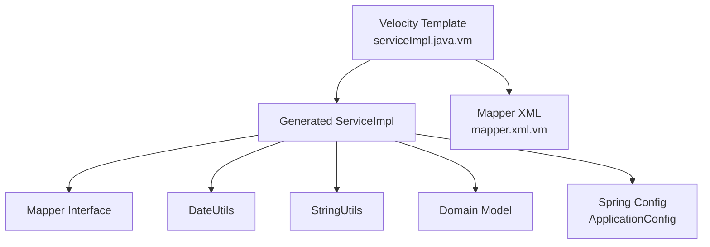
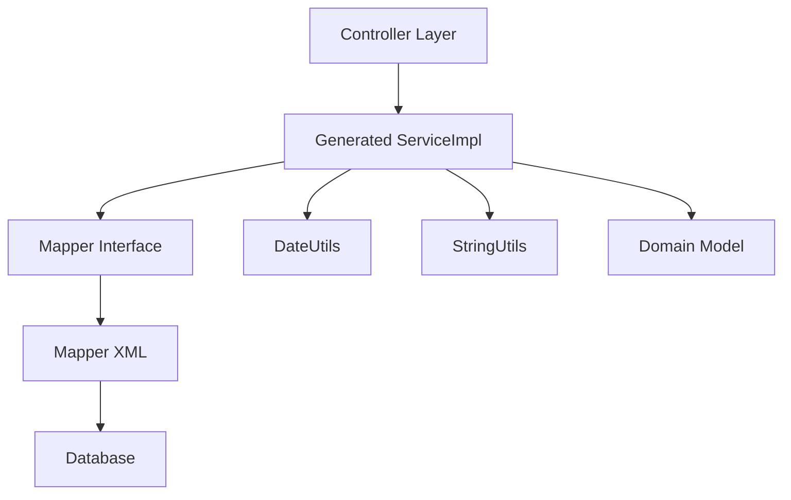
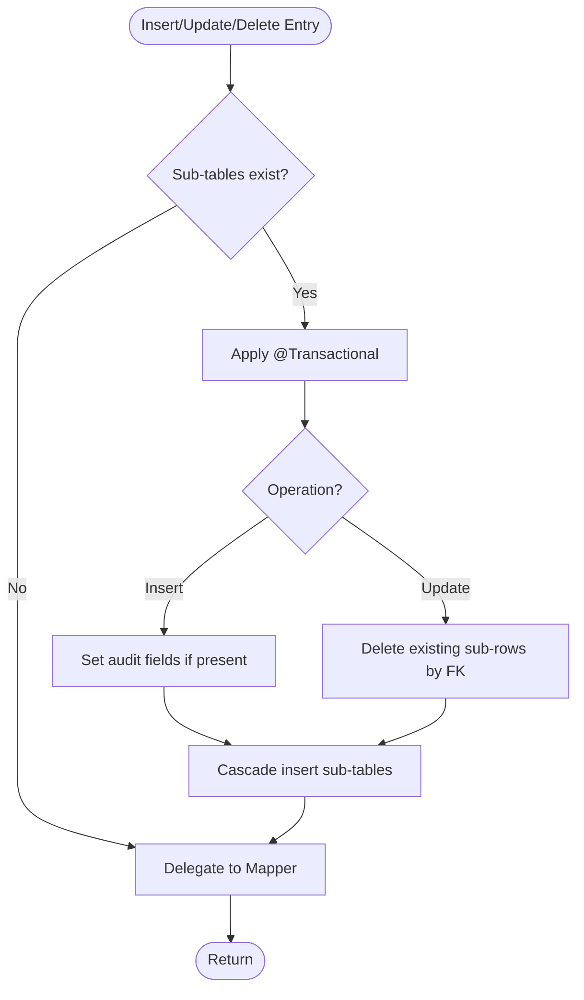
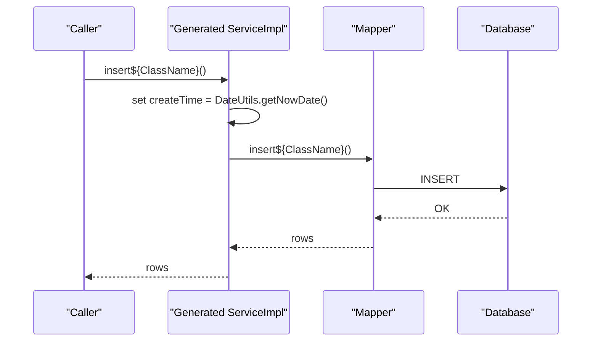
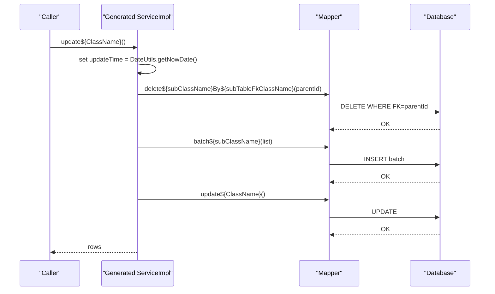
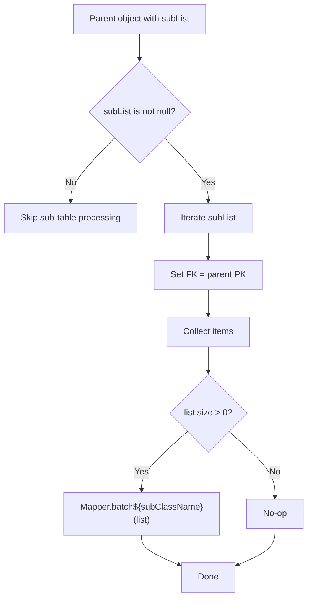
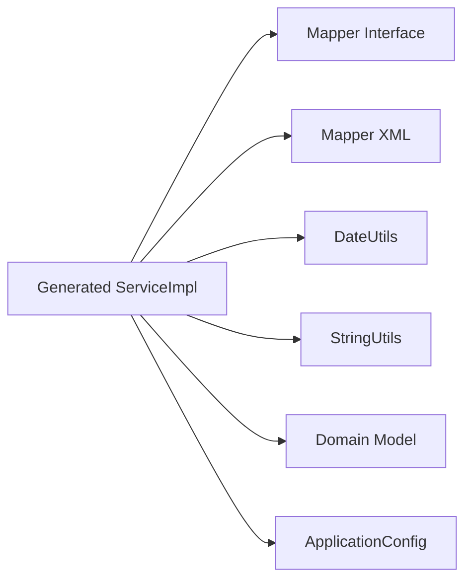

# ServiceImpl

<cite>
**Referenced Files in This Document**
- [serviceImpl.java.vm](file://src/main/resources/vm/java/serviceImpl.java.vm)
- [service.java.vm](file://src/main/resources/vm/java/service.java.vm)
- [mapper.java.vm](file://src/main/resources/vm/java/mapper.java.vm)
- [mapper.xml.vm](file://src/main/resources/vm/xml/mapper.xml.vm)
- [DateUtils.java](file://src/main/java/com/ruoyi/common/utils/DateUtils.java)
- [StringUtils.java](file://src/main/java/com/ruoyi/common/utils/StringUtils.java)
- [BaseEntity.java](file://src/main/java/com/ruoyi/framework/web/domain/BaseEntity.java)
- [ApplicationConfig.java](file://src/main/java/com/ruoyi/framework/config/ApplicationConfig.java)
- [SysUserServiceImpl.java](file://src/main/java/com/ruoyi/project/system/service/impl/SysUserServiceImpl.java)
- [SysRoleServiceImpl.java](file://src/main/java/com/ruoyi/project/system/service/impl/SysRoleServiceImpl.java)
- [SysUserMapper.java](file://src/main/java/com/ruoyi/project/system/mapper/SysUserMapper.java)
- [SysRoleMapper.java](file://src/main/java/com/ruoyi/project/system/mapper/SysRoleMapper.java)
- [GenTable.java](file://src/main/java/com/ruoyi/project/tool/gen/domain/GenTable.java)
- [sub-domain.java.vm](file://src/main/resources/vm/java/sub-domain.java.vm)
</cite>

## Table of Contents
1. [Introduction](#introduction)
2. [Project Structure](#project-structure)
3. [Core Components](#core-components)
4. [Architecture Overview](#architecture-overview)
5. [Detailed Component Analysis](#detailed-component-analysis)
6. [Dependency Analysis](#dependency-analysis)
7. [Performance Considerations](#performance-considerations)
8. [Troubleshooting Guide](#troubleshooting-guide)
9. [Conclusion](#conclusion)

## Introduction
This document explains how the ServiceImpl class is generated by the serviceImpl.java.vm template in the RuoYi-Vue backend. It covers how the generated class:
- Is annotated for Spring component scanning
- Injects its corresponding Mapper via @Autowired
- Implements CRUD methods by delegating to the Mapper layer
- Automatically sets audit fields (createTime, updateTime) when present in the table schema
- Uses @Transactional for sub-table operations to ensure data consistency across parent-child relationships
- Implements cascading operations for sub-tables including batch insertion and cleanup during updates/deletes
- Applies conditional logic to define transaction boundaries and guard against null collections

## Project Structure
The ServiceImpl generation is driven by Velocity templates located under src/main/resources/vm/java and src/main/resources/vm/xml. The template orchestrates imports, annotations, method bodies, and conditional blocks based on table metadata and sub-table presence.

**Diagram sources**
- [serviceImpl.java.vm](file://src/main/resources/vm/java/serviceImpl.java.vm#L1-L170)
- [mapper.xml.vm](file://src/main/resources/vm/xml/mapper.xml.vm#L75-L140)
- [ApplicationConfig.java](file://src/main/java/com/ruoyi/framework/config/ApplicationConfig.java#L15-L20)

**Section sources**
- [serviceImpl.java.vm](file://src/main/resources/vm/java/serviceImpl.java.vm#L1-L170)
- [mapper.xml.vm](file://src/main/resources/vm/xml/mapper.xml.vm#L75-L140)
- [ApplicationConfig.java](file://src/main/java/com/ruoyi/framework/config/ApplicationConfig.java#L15-L20)

## Core Components
- Generated ServiceImpl class:
  - Annotated with @Service for Spring component scanning
  - Autowires the corresponding Mapper
  - Implements CRUD methods delegating to Mapper
  - Conditionally adds @Transactional for sub-table operations
  - Sets audit fields using DateUtils.getNowDate() when present
  - Provides batch sub-table insertion and cleanup helpers
- Supporting utilities:
  - DateUtils.getNowDate() for audit timestamps
  - StringUtils.isNotNull() for null safety checks
- Domain model:
  - BaseEntity provides createTime/updateTime fields
  - Sub-domain classes extend BaseEntity and carry FK relationships

**Section sources**
- [serviceImpl.java.vm](file://src/main/resources/vm/java/serviceImpl.java.vm#L1-L170)
- [DateUtils.java](file://src/main/java/com/ruoyi/common/utils/DateUtils.java#L41-L44)
- [StringUtils.java](file://src/main/java/com/ruoyi/common/utils/StringUtils.java#L140-L148)
- [BaseEntity.java](file://src/main/java/com/ruoyi/framework/web/domain/BaseEntity.java#L20-L39)
- [sub-domain.java.vm](file://src/main/resources/vm/java/sub-domain.java.vm#L1-L76)

## Architecture Overview
The generated ServiceImpl sits between controllers and the persistence layer. It delegates all data access to the Mapper and coordinates cross-table operations for parent-child relationships.

**Diagram sources**
- [serviceImpl.java.vm](file://src/main/resources/vm/java/serviceImpl.java.vm#L28-L169)
- [mapper.xml.vm](file://src/main/resources/vm/xml/mapper.xml.vm#L75-L140)
- [SysUserServiceImpl.java](file://src/main/java/com/ruoyi/project/system/service/impl/SysUserServiceImpl.java#L260-L305)
- [SysRoleServiceImpl.java](file://src/main/java/com/ruoyi/project/system/service/impl/SysRoleServiceImpl.java#L233-L257)

## Detailed Component Analysis

### ServiceImpl Template Behavior
- Component scanning:
  - The @Service annotation enables Spring to detect and manage the generated ServiceImpl bean.
- Mapper injection:
  - @Autowired injects the Mapper interface into the ServiceImpl field.
- CRUD delegation:
  - All CRUD methods delegate to the Mapper’s select/insert/update/delete methods.
- Audit fields:
  - If the table schema includes createTime or updateTime, the template imports DateUtils and sets the respective field to the current time during insert or update.
- Transactional boundaries:
  - When sub-tables exist, the template conditionally adds @Transactional to insert, update, and delete methods to wrap parent and child operations atomically.
- Sub-table cascade:
  - insert${subClassName} method reads the parent’s primary key, iterates the sub-list, assigns the FK, and performs a batch insert via Mapper XML’s batch operation.
  - During update, the template deletes existing sub-rows by parent PK before re-inserting the new sub-list.
  - During delete, the template removes sub-rows by parent PK before deleting the parent.

**Diagram sources**
- [serviceImpl.java.vm](file://src/main/resources/vm/java/serviceImpl.java.vm#L64-L142)
- [mapper.xml.vm](file://src/main/resources/vm/xml/mapper.xml.vm#L129-L139)

**Section sources**
- [serviceImpl.java.vm](file://src/main/resources/vm/java/serviceImpl.java.vm#L28-L169)
- [mapper.xml.vm](file://src/main/resources/vm/xml/mapper.xml.vm#L75-L140)

### Audit Field Handling
- Conditional imports:
  - The template scans columns and imports DateUtils when createTime or updateTime is present.
- Setting timestamps:
  - On insert, the template sets createTime to DateUtils.getNowDate().
  - On update, the template sets updateTime to DateUtils.getNowDate().
- Domain support:
  - BaseEntity defines createTime and updateTime fields with JSON formatting, aligning with the generated setters.

**Diagram sources**
- [serviceImpl.java.vm](file://src/main/resources/vm/java/serviceImpl.java.vm#L64-L82)
- [DateUtils.java](file://src/main/java/com/ruoyi/common/utils/DateUtils.java#L41-L44)
- [BaseEntity.java](file://src/main/java/com/ruoyi/framework/web/domain/BaseEntity.java#L20-L39)

**Section sources**
- [serviceImpl.java.vm](file://src/main/resources/vm/java/serviceImpl.java.vm#L5-L9)
- [serviceImpl.java.vm](file://src/main/resources/vm/java/serviceImpl.java.vm#L70-L82)
- [serviceImpl.java.vm](file://src/main/resources/vm/java/serviceImpl.java.vm#L96-L106)
- [BaseEntity.java](file://src/main/java/com/ruoyi/framework/web/domain/BaseEntity.java#L20-L39)
- [DateUtils.java](file://src/main/java/com/ruoyi/common/utils/DateUtils.java#L41-L44)

### Transactional Sub-table Operations
- Conditional @Transactional:
  - The template wraps insert, update, and delete methods with @Transactional when sub-tables are configured.
- Parent-child consistency:
  - Update deletes existing sub-rows by FK, then re-inserts the new sub-list in a single transaction.
  - Delete removes sub-rows by FK before deleting the parent.
- Example patterns:
  - SysUserServiceImpl and SysRoleServiceImpl demonstrate multi-table transactions around parent-child relationships.

**Diagram sources**
- [serviceImpl.java.vm](file://src/main/resources/vm/java/serviceImpl.java.vm#L90-L106)
- [mapper.xml.vm](file://src/main/resources/vm/xml/mapper.xml.vm#L129-L139)
- [SysUserServiceImpl.java](file://src/main/java/com/ruoyi/project/system/service/impl/SysUserServiceImpl.java#L291-L305)
- [SysRoleServiceImpl.java](file://src/main/java/com/ruoyi/project/system/service/impl/SysRoleServiceImpl.java#L248-L257)

**Section sources**
- [serviceImpl.java.vm](file://src/main/resources/vm/java/serviceImpl.java.vm#L64-L106)
- [mapper.xml.vm](file://src/main/resources/vm/xml/mapper.xml.vm#L129-L139)
- [SysUserServiceImpl.java](file://src/main/java/com/ruoyi/project/system/service/impl/SysUserServiceImpl.java#L291-L305)
- [SysRoleServiceImpl.java](file://src/main/java/com/ruoyi/project/system/service/impl/SysRoleServiceImpl.java#L248-L257)

### Sub-table Batch Insertion and Cleanup
- Batch insertion:
  - insert${subClassName} reads the sub-list from the parent domain object, assigns the parent PK as the FK, and calls batch${subClassName} via Mapper XML.
- Cleanup during updates/deletes:
  - The template deletes sub-rows by FK before performing updates or deletes on the parent.
- Null safety:
  - The template uses StringUtils.isNotNull to guard against null sub-collections before processing.

**Diagram sources**
- [serviceImpl.java.vm](file://src/main/resources/vm/java/serviceImpl.java.vm#L144-L168)
- [mapper.xml.vm](file://src/main/resources/vm/xml/mapper.xml.vm#L133-L139)
- [StringUtils.java](file://src/main/java/com/ruoyi/common/utils/StringUtils.java#L140-L148)

**Section sources**
- [serviceImpl.java.vm](file://src/main/resources/vm/java/serviceImpl.java.vm#L144-L168)
- [mapper.xml.vm](file://src/main/resources/vm/xml/mapper.xml.vm#L133-L139)
- [StringUtils.java](file://src/main/java/com/ruoyi/common/utils/StringUtils.java#L140-L148)

### Clean Separation Between Business Logic and Data Access
- Business logic:
  - The generated ServiceImpl focuses on orchestration: audit field setting, transaction boundaries, and sub-table cascades.
- Data access:
  - All persistence operations are delegated to Mapper methods, keeping the ServiceImpl thin and testable.
- Error propagation:
  - Exceptions thrown by Mapper operations propagate to callers, preserving error semantics.

**Section sources**
- [serviceImpl.java.vm](file://src/main/resources/vm/java/serviceImpl.java.vm#L40-L169)
- [mapper.java.vm](file://src/main/resources/vm/java/mapper.java.vm#L49-L91)

## Dependency Analysis
- Spring component scanning:
  - ApplicationConfig enables @MapperScan and AOP exposure, ensuring generated beans are discovered and proxied.
- Generated ServiceImpl depends on:
  - Mapper interface methods defined by mapper.java.vm
  - Mapper XML operations defined by mapper.xml.vm
  - Utility classes DateUtils and StringUtils
  - Domain model classes (including sub-domain classes)

**Diagram sources**
- [serviceImpl.java.vm](file://src/main/resources/vm/java/serviceImpl.java.vm#L1-L170)
- [mapper.java.vm](file://src/main/resources/vm/java/mapper.java.vm#L49-L91)
- [mapper.xml.vm](file://src/main/resources/vm/xml/mapper.xml.vm#L75-L140)
- [ApplicationConfig.java](file://src/main/java/com/ruoyi/framework/config/ApplicationConfig.java#L15-L20)

**Section sources**
- [ApplicationConfig.java](file://src/main/java/com/ruoyi/framework/config/ApplicationConfig.java#L15-L20)
- [serviceImpl.java.vm](file://src/main/resources/vm/java/serviceImpl.java.vm#L1-L170)
- [mapper.java.vm](file://src/main/resources/vm/java/mapper.java.vm#L49-L91)
- [mapper.xml.vm](file://src/main/resources/vm/xml/mapper.xml.vm#L75-L140)

## Performance Considerations
- Batch operations:
  - Use batch${subClassName} to minimize round-trips when inserting sub-table records.
- Conditional transaction usage:
  - Only enable @Transactional when sub-tables exist to avoid unnecessary overhead.
- Audit field computation:
  - DateUtils.getNowDate() is lightweight; keep it only when needed.
- Null checks:
  - StringUtils.isNotNull prevents unnecessary iteration and batch calls.

[No sources needed since this section provides general guidance]

## Troubleshooting Guide
- Audit fields not set:
  - Verify the table schema includes createTime or updateTime and that the template imports DateUtils.
- Sub-table not cascading:
  - Confirm sub-table metadata is configured (GenTable fields like subTableName, subTableFkName) so the template emits sub-table code.
- Transaction not rolling back:
  - Ensure @Transactional is applied to methods that modify both parent and child tables.
- Null sub-list errors:
  - Ensure StringUtils.isNotNull guards are present and that the parent domain exposes a getter returning a non-null list.

**Section sources**
- [serviceImpl.java.vm](file://src/main/resources/vm/java/serviceImpl.java.vm#L1-L170)
- [GenTable.java](file://src/main/java/com/ruoyi/project/tool/gen/domain/GenTable.java#L130-L160)
- [StringUtils.java](file://src/main/java/com/ruoyi/common/utils/StringUtils.java#L140-L148)

## Conclusion
The serviceImpl.java.vm template produces a robust ServiceImpl that cleanly separates business logic from data access. It automatically handles audit fields, enforces transactional consistency for parent-child relationships, and provides efficient batch sub-table operations. By leveraging Mapper interfaces and XML-defined SQL, the generated implementation remains maintainable and aligned with the broader Spring and MyBatis architecture.