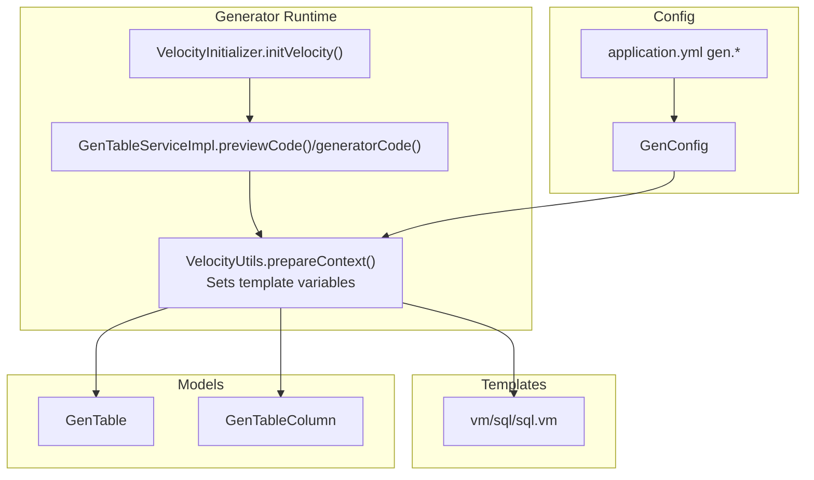
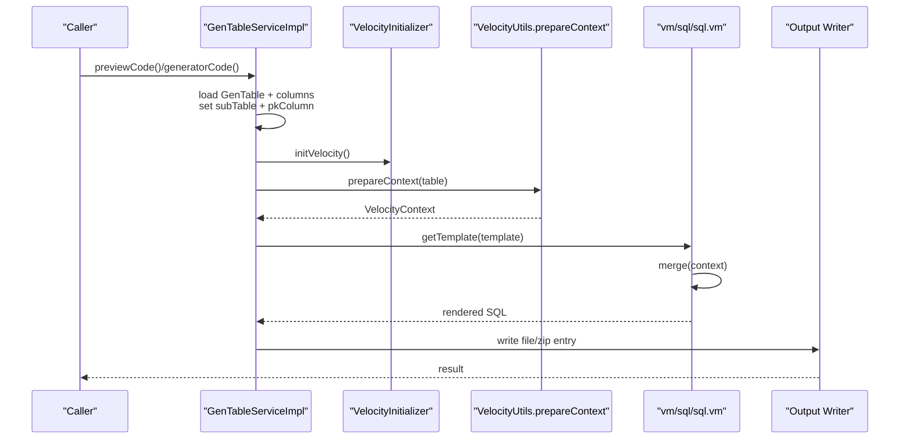
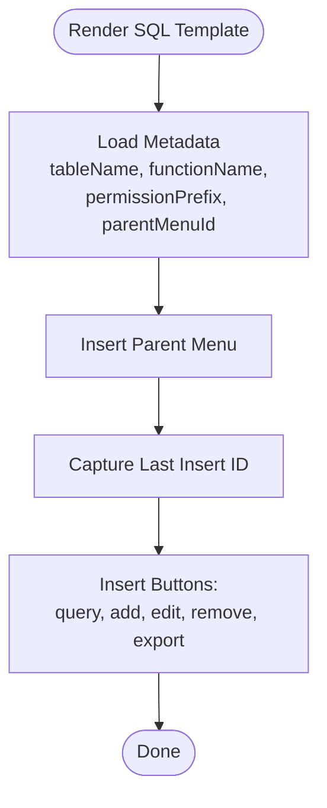
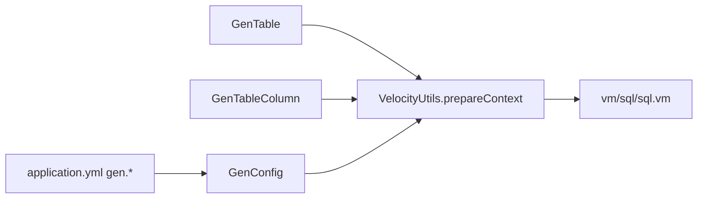

# Configuration & Scripts

<cite>
**Referenced Files in This Document**
- [sql.vm](file://src/main/resources/vm/sql/sql.vm)
- [VelocityUtils.java](file://src/main/java/com/ruoyi/project/tool/gen/util/VelocityUtils.java)
- [VelocityInitializer.java](file://src/main/java/com/ruoyi/project/tool/gen/util/VelocityInitializer.java)
- [GenTableServiceImpl.java](file://src/main/java/com/ruoyi/project/tool/gen/service/GenTableServiceImpl.java)
- [GenTable.java](file://src/main/java/com/ruoyi/project/tool/gen/domain/GenTable.java)
- [GenTableColumn.java](file://src/main/java/com/ruoyi/project/tool/gen/domain/GenTableColumn.java)
- [GenConstants.java](file://src/main/java/com/ruoyi/common/constant/GenConstants.java)
- [GenConfig.java](file://src/main/java/com/ruoyi/framework/config/GenConfig.java)
- [application.yml](file://src/main/resources/application.yml)
- [ry_20250522.sql](file://sql/ry_20250522.sql)
- [quartz.sql](file://sql/quartz.sql)
</cite>

## Table of Contents
1. [Introduction](#introduction)
2. [Project Structure](#project-structure)
3. [Core Components](#core-components)
4. [Architecture Overview](#architecture-overview)
5. [Detailed Component Analysis](#detailed-component-analysis)
6. [Dependency Analysis](#dependency-analysis)
7. [Performance Considerations](#performance-considerations)
8. [Troubleshooting Guide](#troubleshooting-guide)
9. [Conclusion](#conclusion)
10. [Appendices](#appendices)

## Introduction
This document explains how the RuoYi-Vue code generator produces SQL scripts for database schema creation and modification. It focuses on the Velocity template used to generate menu-related SQL for CRUD features, how metadata from the selected entity drives template rendering, and how the generated scripts integrate with the overall database migration and version control strategy. It also provides guidance for reviewing, customizing, applying, and maintaining these scripts across development, testing, and production environments.

## Project Structure
The code generator relies on:
- A Velocity template for SQL output
- Utilities that prepare Velocity context and resolve template lists
- A service that orchestrates template rendering and file generation
- Domain models representing tables and columns
- Configuration for code generation behavior

**Diagram sources**
- [VelocityUtils.java](file://src/main/java/com/ruoyi/project/tool/gen/util/VelocityUtils.java#L37-L74)
- [VelocityInitializer.java](file://src/main/java/com/ruoyi/project/tool/gen/util/VelocityInitializer.java#L17-L33)
- [GenTableServiceImpl.java](file://src/main/java/com/ruoyi/project/tool/gen/service/GenTableServiceImpl.java#L204-L229)
- [sql.vm](file://src/main/resources/vm/sql/sql.vm#L1-L22)
- [GenTable.java](file://src/main/java/com/ruoyi/project/tool/gen/domain/GenTable.java#L1-L120)
- [GenTableColumn.java](file://src/main/java/com/ruoyi/project/tool/gen/domain/GenTableColumn.java#L1-L120)
- [GenConfig.java](file://src/main/java/com/ruoyi/framework/config/GenConfig.java#L1-L80)
- [application.yml](file://src/main/resources/application.yml#L138-L149)

**Section sources**
- [VelocityUtils.java](file://src/main/java/com/ruoyi/project/tool/gen/util/VelocityUtils.java#L37-L74)
- [VelocityInitializer.java](file://src/main/java/com/ruoyi/project/tool/gen/util/VelocityInitializer.java#L17-L33)
- [GenTableServiceImpl.java](file://src/main/java/com/ruoyi/project/tool/gen/service/GenTableServiceImpl.java#L204-L229)
- [sql.vm](file://src/main/resources/vm/sql/sql.vm#L1-L22)
- [GenTable.java](file://src/main/java/com/ruoyi/project/tool/gen/domain/GenTable.java#L1-L120)
- [GenTableColumn.java](file://src/main/java/com/ruoyi/project/tool/gen/domain/GenTableColumn.java#L1-L120)
- [GenConfig.java](file://src/main/java/com/ruoyi/framework/config/GenConfig.java#L1-L80)
- [application.yml](file://src/main/resources/application.yml#L138-L149)

## Core Components
- SQL template: The template renders menu DDL/DML for CRUD features. It uses metadata such as table name, function name, permission prefix, and parent menu ID to produce insert statements for menus and buttons.
- Velocity context preparation: The utility sets variables like table, columns, primary key column, and computed values such as permission prefixes and parent menu IDs.
- Generator service: Initializes Velocity, prepares context, selects templates, merges them, and writes outputs (including SQL).
- Domain models: Provide metadata for table name, columns, primary key, and options used during rendering.
- Configuration: Controls author, package name, table prefix removal, and overwrite behavior.

Key template variables available to the SQL template include:
- tableName, functionName, className, businessName, moduleName, packageName, basePackage, author, datetime
- pkColumn, columns, table
- permissionPrefix, parentMenuId
- Additional tree/sub options when applicable

These variables are populated by the Velocity context builder and passed to the template.

**Section sources**
- [sql.vm](file://src/main/resources/vm/sql/sql.vm#L1-L22)
- [VelocityUtils.java](file://src/main/java/com/ruoyi/project/tool/gen/util/VelocityUtils.java#L37-L74)
- [GenTableServiceImpl.java](file://src/main/java/com/ruoyi/project/tool/gen/service/GenTableServiceImpl.java#L204-L229)
- [GenTable.java](file://src/main/java/com/ruoyi/project/tool/gen/domain/GenTable.java#L1-L120)
- [GenTableColumn.java](file://src/main/java/com/ruoyi/project/tool/gen/domain/GenTableColumn.java#L1-L120)
- [GenConfig.java](file://src/main/java/com/ruoyi/framework/config/GenConfig.java#L1-L80)
- [application.yml](file://src/main/resources/application.yml#L138-L149)

## Architecture Overview
The generator pipeline:
1. The service loads a GenTable and its columns.
2. It sets sub-table and primary key metadata.
3. Velocity is initialized.
4. A VelocityContext is prepared with table metadata and computed values.
5. Templates are selected; the SQL template is included.
6. The template is merged and rendered to a string.
7. Outputs are written to files or zipped for download.

**Diagram sources**
- [GenTableServiceImpl.java](file://src/main/java/com/ruoyi/project/tool/gen/service/GenTableServiceImpl.java#L204-L229)
- [VelocityInitializer.java](file://src/main/java/com/ruoyi/project/tool/gen/util/VelocityInitializer.java#L17-L33)
- [VelocityUtils.java](file://src/main/java/com/ruoyi/project/tool/gen/util/VelocityUtils.java#L37-L74)
- [sql.vm](file://src/main/resources/vm/sql/sql.vm#L1-L22)

## Detailed Component Analysis

### SQL Template: Menu DDL/DML Generation
The SQL template generates menu entries and button permissions for a CRUD feature. It uses:
- tableName: Used to derive display and routing values.
- functionName: Used as menu names and remarks.
- permissionPrefix: Derived from moduleName and businessName.
- parentMenuId: Computed from options or default.

The template produces inserts for:
- A parent menu entry for the feature
- Child menu entries for query/add/edit/remove/export actions
- Uses a MySQL-specific date function for timestamps

Notes:
- The template does not generate CREATE TABLE statements for the business table itself.
- It focuses on menu and permission setup for the generated CRUD screens.

**Diagram sources**
- [sql.vm](file://src/main/resources/vm/sql/sql.vm#L1-L22)
- [VelocityUtils.java](file://src/main/java/com/ruoyi/project/tool/gen/util/VelocityUtils.java#L37-L74)

**Section sources**
- [sql.vm](file://src/main/resources/vm/sql/sql.vm#L1-L22)
- [VelocityUtils.java](file://src/main/java/com/ruoyi/project/tool/gen/util/VelocityUtils.java#L37-L74)

### Velocity Context and Variables
The context builder sets:
- Table-level: tplCategory, tableName, functionName, className, businessName, moduleName, packageName, basePackage, author, datetime, table, columns, pkColumn
- Permissions: permissionPrefix derived from moduleName and businessName
- Menus: parentMenuId computed from options or default
- Trees/Subs: additional context when applicable

These variables are directly available inside the template.

**Section sources**
- [VelocityUtils.java](file://src/main/java/com/ruoyi/project/tool/gen/util/VelocityUtils.java#L37-L74)
- [GenTable.java](file://src/main/java/com/ruoyi/project/tool/gen/domain/GenTable.java#L1-L120)
- [GenTableColumn.java](file://src/main/java/com/ruoyi/project/tool/gen/domain/GenTableColumn.java#L1-L120)

### Generator Service Rendering
The service:
- Loads the GenTable and enriches it with sub-table and primary key information
- Initializes Velocity
- Prepares the VelocityContext
- Selects templates (including sql.vm)
- Merges templates and writes outputs

Outputs:
- The SQL template renders to a file named after the business name with a .sql extension
- Other templates render Java, XML, Vue, and JS files

**Section sources**
- [GenTableServiceImpl.java](file://src/main/java/com/ruoyi/project/tool/gen/service/GenTableServiceImpl.java#L204-L229)
- [GenTableServiceImpl.java](file://src/main/java/com/ruoyi/project/tool/gen/service/GenTableServiceImpl.java#L363-L401)
- [VelocityUtils.java](file://src/main/java/com/ruoyi/project/tool/gen/util/VelocityUtils.java#L162-L227)

### Domain Models and Metadata
- GenTable holds table-level metadata, including table name, comments, class name, module/business names, author, options, and lists of columns and sub-table info.
- GenTableColumn holds per-column metadata, including type, Java type, whether it is primary key, required, insert/edit/list/query flags, HTML type, dict type, and sort order.

These models supply the data used to populate the template context.

**Section sources**
- [GenTable.java](file://src/main/java/com/ruoyi/project/tool/gen/domain/GenTable.java#L1-L385)
- [GenTableColumn.java](file://src/main/java/com/ruoyi/project/tool/gen/domain/GenTableColumn.java#L1-L373)

### Configuration and Behavior
- Author, package name, auto-remove table prefix, table prefix, and overwrite behavior are configured via application.yml under the gen namespace.
- These settings influence how table names and class names are derived and how files are written.

**Section sources**
- [GenConfig.java](file://src/main/java/com/ruoyi/framework/config/GenConfig.java#L1-L80)
- [application.yml](file://src/main/resources/application.yml#L138-L149)

## Dependency Analysis
The SQL template depends on:
- Table metadata (tableName, functionName)
- Computed permission prefix (derived from moduleName and businessName)
- Parent menu ID (from options or default)
- Column metadata (used indirectly for UI hints and permissions)

**Diagram sources**
- [GenTable.java](file://src/main/java/com/ruoyi/project/tool/gen/domain/GenTable.java#L1-L120)
- [GenTableColumn.java](file://src/main/java/com/ruoyi/project/tool/gen/domain/GenTableColumn.java#L1-L120)
- [VelocityUtils.java](file://src/main/java/com/ruoyi/project/tool/gen/util/VelocityUtils.java#L37-L74)
- [GenConfig.java](file://src/main/java/com/ruoyi/framework/config/GenConfig.java#L1-L80)
- [application.yml](file://src/main/resources/application.yml#L138-L149)
- [sql.vm](file://src/main/resources/vm/sql/sql.vm#L1-L22)

**Section sources**
- [GenTable.java](file://src/main/java/com/ruoyi/project/tool/gen/domain/GenTable.java#L1-L120)
- [GenTableColumn.java](file://src/main/java/com/ruoyi/project/tool/gen/domain/GenTableColumn.java#L1-L120)
- [VelocityUtils.java](file://src/main/java/com/ruoyi/project/tool/gen/util/VelocityUtils.java#L37-L74)
- [GenConfig.java](file://src/main/java/com/ruoyi/framework/config/GenConfig.java#L1-L80)
- [application.yml](file://src/main/resources/application.yml#L138-L149)
- [sql.vm](file://src/main/resources/vm/sql/sql.vm#L1-L22)

## Performance Considerations
- Template rendering uses Velocity; keep templates minimal and avoid heavy computations inside templates.
- Batch generation writes outputs directly to files or a zip stream; ensure adequate disk space and I/O throughput.
- Avoid unnecessary re-rendering by caching context when repeatedly previewing.

[No sources needed since this section provides general guidance]

## Troubleshooting Guide
Common issues and resolutions:
- Missing or incorrect parent menu ID: Verify options contain a valid parent menu ID; otherwise a default is used.
- Incorrect permission prefix: Ensure module and business names are set; the prefix is derived from these values.
- Generated SQL not applied: Confirm the output file path and review the rendered SQL before applying manually.
- Overwrite behavior: Configure allowOverwrite to control whether generated files can overwrite existing local files.

**Section sources**
- [VelocityUtils.java](file://src/main/java/com/ruoyi/project/tool/gen/util/VelocityUtils.java#L316-L335)
- [application.yml](file://src/main/resources/application.yml#L138-L149)

## Conclusion
The RuoYi-Vue code generator’s SQL template produces menu and permission DML for CRUD features using table metadata and computed values. While it does not generate CREATE TABLE statements for business entities, it integrates seamlessly with the generator pipeline to produce consistent menu scaffolding. For database schema changes, use the provided DDL samples and migration scripts as references, and apply the generated menu scripts alongside your schema migrations.

[No sources needed since this section summarizes without analyzing specific files]

## Appendices

### How Generated Scripts Integrate with Migration and Version Control
- The repository includes baseline DDL files that define system tables and Quartz scheduler tables. These demonstrate the expected schema structure and can serve as a reference for writing your own migrations.
- The generator’s SQL template produces menu-related DML for CRUD features. It does not generate CREATE TABLE statements for business entities.
- Recommended practice:
  - Use the baseline DDL as a reference for your schema evolution.
  - Apply schema changes via database migration tools or manual scripts.
  - Review and commit generated menu DML alongside feature changes.
  - Maintain separate migration scripts per environment and apply incrementally.

**Section sources**
- [ry_20250522.sql](file://sql/ry_20250522.sql#L1-L120)
- [quartz.sql](file://sql/quartz.sql#L1-L174)
- [sql.vm](file://src/main/resources/vm/sql/sql.vm#L1-L22)

### Handling Incremental Changes and Schema Drift
- Use the baseline DDL as a source of truth for schema drift detection.
- Track schema changes in version control with clear commit messages and environment-specific scripts.
- Apply schema changes in testing first, then promote to production with rollback plans.
- Periodically compare generated menu DML against your deployed permissions to prevent drift.

[No sources needed since this section provides general guidance]