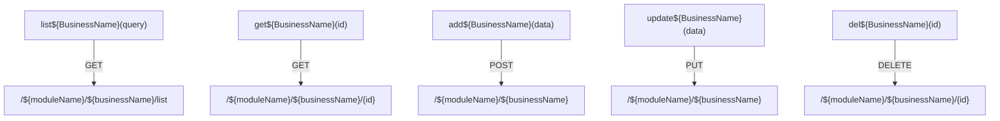
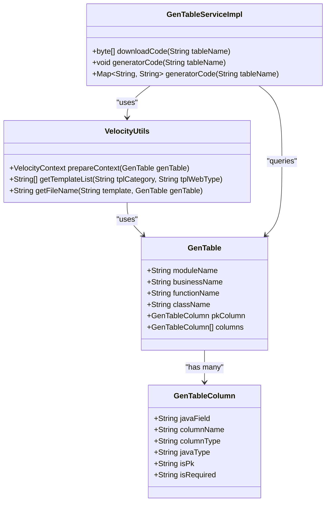
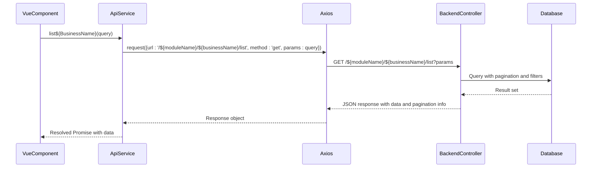
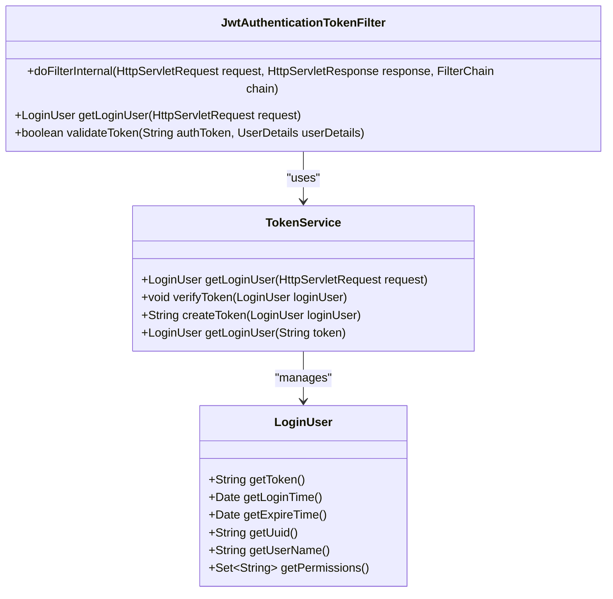

# API Client

<cite>
**Referenced Files in This Document**   
- [api.js.vm](file://src/main/resources/vm/js/api.js.vm)
- [VelocityUtils.java](file://src/main/java/com/ruoyi/project/tool/gen/util/VelocityUtils.java)
- [GenTable.java](file://src/main/java/com/ruoyi/project/tool/gen/domain/GenTable.java)
- [GenTableColumn.java](file://src/main/java/com/ruoyi/project/tool/gen/domain/GenTableColumn.java)
- [GenTableServiceImpl.java](file://src/main/java/com/ruoyi/project/tool/gen/service/GenTableServiceImpl.java)
- [JwtAuthenticationTokenFilter.java](file://src/main/java/com/ruoyi/framework/security/filter/JwtAuthenticationTokenFilter.java)
- [TokenService.java](file://src/main/java/com/ruoyi/framework/security/service/TokenService.java)
</cite>

## Table of Contents
1. [Introduction](#introduction)
2. [Template Structure and CRUD Operations](#template-structure-and-crud-operations)
3. [Velocity Variable Substitution](#velocity-variable-substitution)
4. [URL Construction and Backend Routing](#url-construction-and-backend-routing)
5. [Integration with Frontend Request Utility](#integration-with-frontend-request-utility)
6. [Pagination, Filtering, and Batch Operations](#pagination-filtering-and-batch-operations)
7. [Vue Component Integration](#vue-component-integration)
8. [Conclusion](#conclusion)

## Introduction
The RuoYi-Vue code generator creates a modular JavaScript API client using the `api.js.vm` Velocity template. This template generates Axios-based service functions that abstract HTTP interactions with backend RESTful endpoints. The generated API client provides a consistent interface for Vue components to perform CRUD operations against the server, handling authentication, error responses, and loading states through a centralized request utility. The template dynamically generates type-safe service functions using Velocity variables that are populated from database table metadata and user-defined configuration in the code generation process.

**Section sources**
- [api.js.vm](file://src/main/resources/vm/js/api.js.vm#L1-L45)

## Template Structure and CRUD Operations
The `api.js.vm` template defines a standardized set of CRUD operations for each business entity. These operations include `list${BusinessName}`, `get${BusinessName}`, `add${BusinessName}`, `update${BusinessName}`, and `del${BusinessName}` functions, each corresponding to specific HTTP methods and URL patterns. The `list${BusinessName}` function uses the GET method to retrieve paginated data with query parameters, while `get${BusinessName}` fetches a single record by its primary key. The `add${BusinessName}` function creates new records using POST, `update${BusinessName}` modifies existing records via PUT, and `del${BusinessName}` removes records with DELETE. Each function returns a Promise that resolves with the server response, enabling async/await patterns in Vue components.

**Diagram sources**
- [api.js.vm](file://src/main/resources/vm/js/api.js.vm#L3-L44)

**Section sources**
- [api.js.vm](file://src/main/resources/vm/js/api.js.vm#L3-L44)

## Velocity Variable Substitution
The template leverages Velocity variables to dynamically generate service functions tailored to specific business entities. Key variables include `${BusinessName}` (capitalized business name), `${businessName}` (lowercase business name), `${moduleName}` (module name), `${functionName}` (function description), and `${pkColumn.javaField}` (primary key field name). These variables are populated from the `GenTable` and `GenTableColumn` domain objects during the code generation process. The `VelocityUtils.prepareContext()` method prepares the Velocity context by extracting these values from the `GenTable` object and making them available to the template. This dynamic substitution enables the generation of type-safe service functions that match the specific data model and business requirements.

**Diagram sources**
- [GenTable.java](file://src/main/java/com/ruoyi/project/tool/gen/domain/GenTable.java#L1-L385)
- [GenTableColumn.java](file://src/main/java/com/ruoyi/project/tool/gen/domain/GenTableColumn.java#L1-L373)
- [VelocityUtils.java](file://src/main/java/com/ruoyi/project/tool/gen/util/VelocityUtils.java#L1-L189)
- [GenTableServiceImpl.java](file://src/main/java/com/ruoyi/project/tool/gen/service/GenTableServiceImpl.java#L1-L422)

**Section sources**
- [api.js.vm](file://src/main/resources/vm/js/api.js.vm#L3-L44)
- [VelocityUtils.java](file://src/main/java/com/ruoyi/project/tool/gen/util/VelocityUtils.java#L37-L189)
- [GenTable.java](file://src/main/java/com/ruoyi/project/tool/gen/domain/GenTable.java#L1-L385)

## URL Construction and Backend Routing
The generated API client follows a consistent URL pattern that aligns with the backend controller routing structure. URLs are constructed using the format `/${moduleName}/${businessName}` for collection operations and `/${moduleName}/${businessName}/{id}` for individual resource operations. This pattern matches the Spring MVC controller mappings in the backend, where controllers are typically organized by module and expose RESTful endpoints for business entities. The URL construction ensures that frontend requests are routed to the appropriate controller methods, maintaining a clean separation between frontend and backend concerns while enabling predictable and discoverable API endpoints.

**Diagram sources**
- [api.js.vm](file://src/main/resources/vm/js/api.js.vm#L6-L8)
- [GenTable.java](file://src/main/java/com/ruoyi/project/tool/gen/domain/GenTable.java#L51-L57)

**Section sources**
- [api.js.vm](file://src/main/resources/vm/js/api.js.vm#L6-L8)
- [GenTable.java](file://src/main/java/com/ruoyi/project/tool/gen/domain/GenTable.java#L51-L57)

## Integration with Frontend Request Utility
The generated API client integrates with a centralized request utility that handles authentication, error responses, and loading states. The `import request from '@/utils/request'` statement imports an Axios instance configured with interceptors for JWT authentication and global error handling. The request utility automatically attaches the JWT token from local storage to outgoing requests and handles token refresh when needed. It also implements consistent error handling for HTTP status codes and server-side validation errors, providing a unified experience across all API calls. Loading states are managed through the request utility, allowing Vue components to display spinners or disable buttons during API operations.

**Diagram sources**
- [api.js.vm](file://src/main/resources/vm/js/api.js.vm#L1)
- [JwtAuthenticationTokenFilter.java](file://src/main/java/com/ruoyi/framework/security/filter/JwtAuthenticationTokenFilter.java#L1-L44)
- [TokenService.java](file://src/main/java/com/ruoyi/framework/security/service/TokenService.java#L1-L44)

**Section sources**
- [api.js.vm](file://src/main/resources/vm/js/api.js.vm#L1)
- [JwtAuthenticationTokenFilter.java](file://src/main/java/com/ruoyi/framework/security/filter/JwtAuthenticationTokenFilter.java#L1-L44)
- [TokenService.java](file://src/main/java/com/ruoyi/framework/security/service/TokenService.java#L1-L44)

## Pagination, Filtering, and Batch Operations
The generated API client supports pagination, filtering, and batch deletion through standardized parameter handling. The `list${BusinessName}` function accepts a query object containing pagination parameters (pageNum, pageSize) and filter criteria, which are sent as GET parameters to the backend. The backend controller processes these parameters to return paginated results with metadata about the total count and current page. For batch operations, the template could be extended to include functions like `batchDelete${BusinessName}` that accept an array of IDs, though this specific functionality is not present in the base template. Filtering is supported through query parameters that map to database fields, enabling flexible search capabilities in Vue components.

**Section sources**
- [api.js.vm](file://src/main/resources/vm/js/api.js.vm#L4-L8)

## Vue Component Integration
The generated API client is designed for seamless integration with Vue components through ES6 imports and async/await patterns. Vue components import the generated service functions and use them in methods, lifecycle hooks, or composition API functions. The Promise-based API enables clean asynchronous code using async/await, making it easy to handle loading states and error conditions. Components can call service functions in response to user interactions, update local state with the results, and provide feedback to users. The modular structure of the generated API client promotes code reuse and maintainability across the frontend application.

**Section sources**
- [api.js.vm](file://src/main/resources/vm/js/api.js.vm#L1-L45)

## Conclusion
The RuoYi-Vue code generator's `api.js.vm` template creates a robust, modular JavaScript API client that abstracts HTTP interactions with backend RESTful endpoints. By leveraging Velocity variables and a standardized template structure, it generates type-safe service functions for CRUD operations that follow consistent URL patterns and integrate seamlessly with the frontend request utility. The generated API client handles authentication through JWT tokens, provides consistent error handling, and supports pagination and filtering. Its design enables clean integration with Vue components through ES6 imports and async/await patterns, promoting maintainable and scalable frontend code. This automated approach to API client generation significantly reduces development time and ensures consistency across the application.