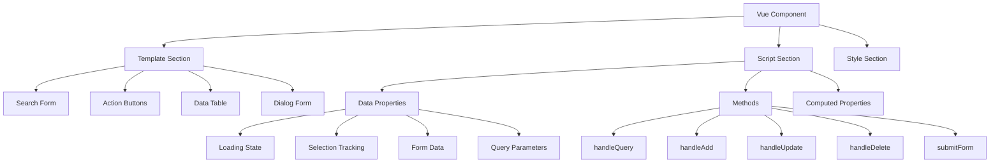
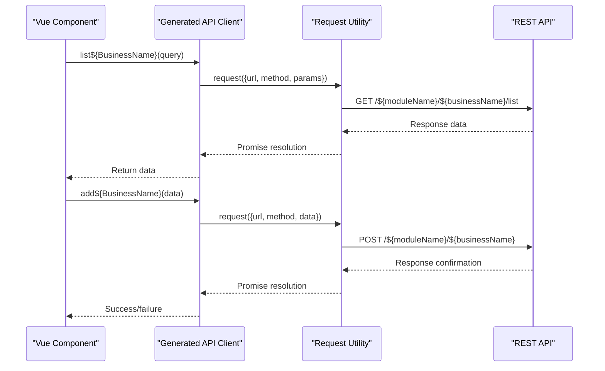
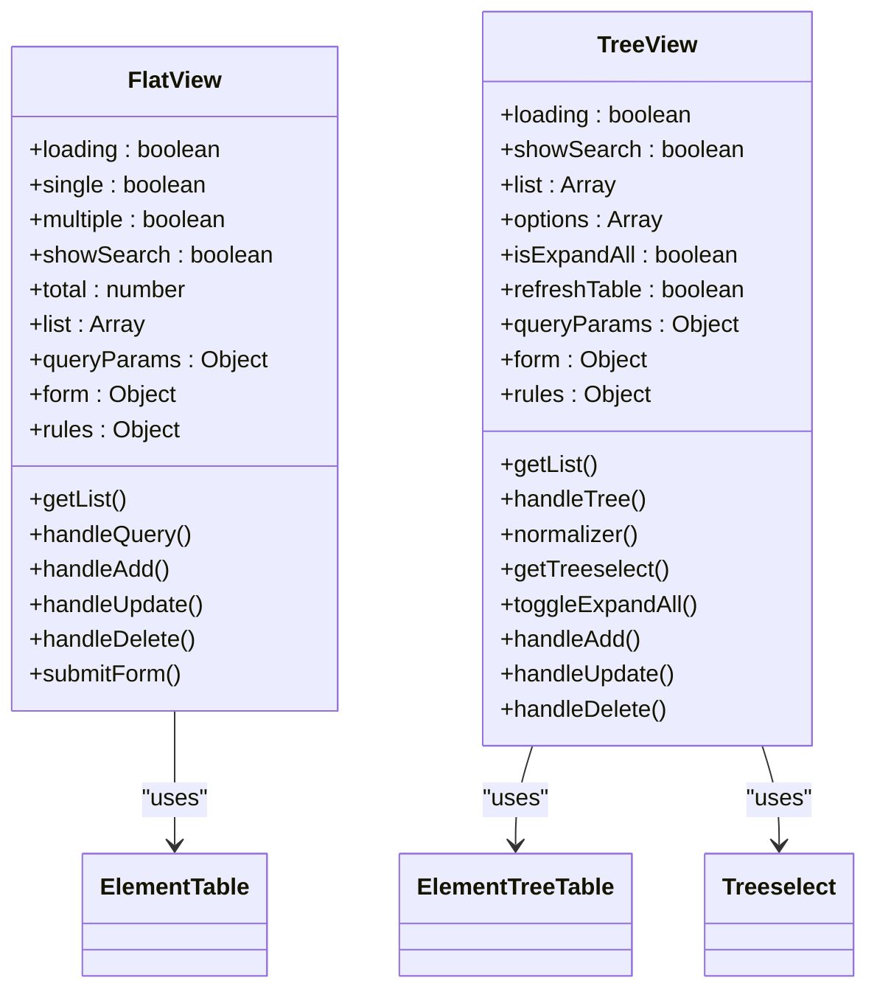

# Frontend Code

<cite>
**Referenced Files in This Document**   
- [index.vue.vm](file://src/main/resources/vm/vue/index.vue.vm)
- [index-tree.vue.vm](file://src/main/resources/vm/vue/index-tree.vue.vm)
- [api.js.vm](file://src/main/resources/vm/js/api.js.vm)
- [index.vue.vm](file://src/main/resources/vm/vue/v3/index.vue.vm)
- [index-tree.vue.vm](file://src/main/resources/vm/vue/v3/index-tree.vue.vm)
</cite>

## Table of Contents
1. [Introduction](#introduction)
2. [Vue Component Structure](#vue-component-structure)
3. [API Client Generation](#api-client-generation)
4. [Template Placeholders and Dynamic Generation](#template-placeholders-and-dynamic-generation)
5. [Flat vs. Hierarchical Views](#flat-vs-hierarchical-views)
6. [Element UI Component Integration](#element-ui-component-integration)
7. [Data Handling and User Interaction](#data-handling-and-user-interaction)
8. [Routing and Permission Integration](#routing-and-permission-integration)

## Introduction
The RuoYi-Vue code generator produces frontend Vue.js components that implement comprehensive CRUD (Create, Read, Update, Delete) functionality with rich user interface elements. The generator creates two primary types of views: flat table views using index.vue.vm and hierarchical/tree views using index-tree.vue.vm. These templates generate complete Vue components with search forms, data tables, dialog forms, and integrated API clients that connect to backend RESTful endpoints. The generated code leverages Element UI components extensively and integrates with the RuoYi-Vue framework's routing and permission system to provide a consistent, enterprise-grade user experience.

**Section sources**
- [index.vue.vm](file://src/main/resources/vm/vue/index.vue.vm)
- [index-tree.vue.vm](file://src/main/resources/vm/vue/index-tree.vue.vm)

## Vue Component Structure
The Vue component templates follow a standardized structure that includes a template section for UI layout, a script section for logic, and appropriate styling. The index.vue.vm template generates components with a search form, action buttons, a data table with pagination, and a dialog form for CRUD operations. The component structure includes data properties for loading states, selection tracking, pagination, and form management. Methods handle operations like querying data, resetting forms, handling selections, and performing CRUD actions. The v3 versions of these templates use Vue 3's Composition API with `<script setup>` syntax, providing a more concise and reactive approach to component development.

**Diagram sources**
- [index.vue.vm](file://src/main/resources/vm/vue/index.vue.vm)
- [index-tree.vue.vm](file://src/main/resources/vm/vue/index-tree.vue.vm)

**Section sources**
- [index.vue.vm](file://src/main/resources/vm/vue/index.vue.vm)
- [index-tree.vue.vm](file://src/main/resources/vm/vue/index-tree.vue.vm)

## API Client Generation
The api.js.vm template generates JavaScript API clients that abstract Axios calls to the backend RESTful endpoints. Each generated API client exports functions for the standard CRUD operations: list, get, add, update, and delete. These functions use a centralized request utility that handles authentication, error handling, and response processing. The generated API functions follow a consistent naming pattern using the business name (e.g., list${BusinessName}, get${BusinessName}) and map directly to the backend controller endpoints. This abstraction layer allows the Vue components to interact with the backend through clean, promise-based API calls without directly managing HTTP details.

**Diagram sources**
- [api.js.vm](file://src/main/resources/vm/js/api.js.vm)

**Section sources**
- [api.js.vm](file://src/main/resources/vm/js/api.js.vm)

## Template Placeholders and Dynamic Generation
The Vue templates use Velocity placeholders to generate dynamic component names, labels, and form fields. Key placeholders include $!{moduleName} for the module name in API paths, $!{businessName} for the business component name, $!{className} for the class name, and $!{fields} for field definitions. These placeholders are replaced during code generation to create context-specific components. For example, $!{functionName} is used for display labels, $!{permissionPrefix} for permission checks, and $!{columns} for iterating through table fields. The templates also use conditional logic to generate appropriate form elements based on field types (input, select, datetime, etc.) and validation rules based on required fields.

**Section sources**
- [index.vue.vm](file://src/main/resources/vm/vue/index.vue.vm)
- [index-tree.vue.vm](file://src/main/resources/vm/vue/index-tree.vue.vm)

## Flat vs. Hierarchical Views
The RuoYi-Vue generator provides two distinct view templates: index.vue.vm for flat table views and index-tree.vue.vm for hierarchical/tree views. The flat view displays data in a standard table format with pagination, while the tree view renders organizational structures using nested data. The tree view utilizes special properties: treeCode as the unique identifier for each node, treeParentCode to reference the parent node, and children to contain child nodes. The tree view component uses Element UI's tree-table functionality with row-key="${treeCode}" and tree-props to define the hierarchical structure. It also includes a toggleExpandAll method to control the expansion state of the entire tree, enhancing usability for large hierarchical datasets.

**Diagram sources**
- [index.vue.vm](file://src/main/resources/vm/vue/index.vue.vm)
- [index-tree.vue.vm](file://src/main/resources/vm/vue/index-tree.vue.vm)

**Section sources**
- [index.vue.vm](file://src/main/resources/vm/vue/index.vue.vm)
- [index-tree.vue.vm](file://src/main/resources/vm/vue/index-tree.vue.vm)

## Element UI Component Integration
The generated Vue components extensively integrate Element UI components to create a consistent and feature-rich user interface. The search form uses el-form with el-form-item containers and various input components like el-input, el-select, el-date-picker, and el-checkbox based on field types. The data display uses el-table with el-table-column components, supporting features like selection, sorting, and custom rendering through slots. Dialog forms use el-dialog with el-form for input collection. Specialized components include image-preview for image fields, dict-tag for dictionary values, and right-toolbar for search controls. The tree view additionally uses Treeselect for hierarchical selection and leverages the table's tree properties for nested data rendering.

**Section sources**
- [index.vue.vm](file://src/main/resources/vm/vue/index.vue.vm)
- [index-tree.vue.vm](file://src/main/resources/vm/vue/index-tree.vue.vm)

## Data Handling and User Interaction
The generated components implement comprehensive data handling for pagination, sorting, form validation, and user notifications. Pagination is managed through queryParams with pageNum and pageSize properties, integrated with a custom pagination component. Sorting is handled by the backend API, with the frontend passing appropriate parameters. Form validation uses Element UI's built-in validation rules defined in the rules object, with required fields generating appropriate validation messages. User notifications are implemented through a modal utility that displays success messages after CRUD operations and confirmation dialogs before deletions. The components also handle special data types like checkboxes (stored as comma-separated strings) and dates (formatted for display), ensuring proper data transformation between the UI and API layers.

**Section sources**
- [index.vue.vm](file://src/main/resources/vm/vue/index.vue.vm)
- [index-tree.vue.vm](file://src/main/resources/vm/vue/index-tree.vue.vm)

## Routing and Permission Integration
The generated components integrate with the RuoYi-Vue frontend routing and permission system through several mechanisms. Permission checks are implemented using the v-hasPermi directive on action buttons, ensuring users can only perform operations they are authorized for. The permissionPrefix variable is used to generate appropriate permission strings for each CRUD operation. The components are designed to be imported into the routing system automatically, with their names following the RuoYi-Vue convention. The API calls are automatically authenticated through the centralized request utility, which includes JWT tokens in headers. This integration ensures that the generated components adhere to the application's security model and can be seamlessly incorporated into the overall application structure.

**Section sources**
- [index.vue.vm](file://src/main/resources/vm/vue/index.vue.vm)
- [index-tree.vue.vm](file://src/main/resources/vm/vue/index-tree.vue.vm)
- [api.js.vm](file://src/main/resources/vm/js/api.js.vm)