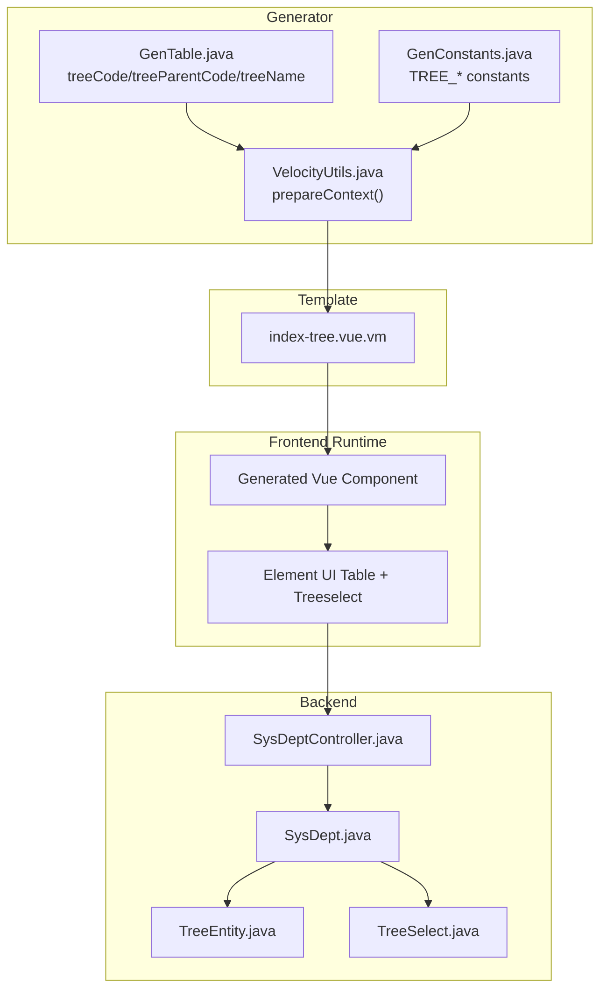
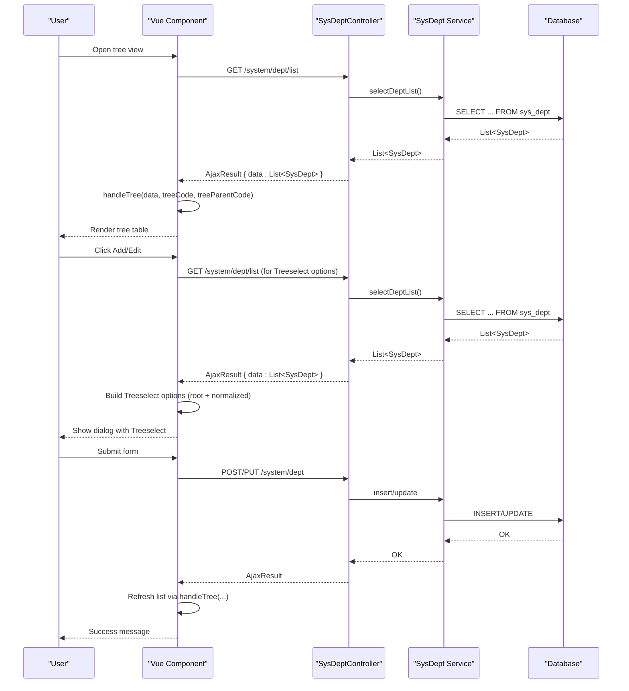
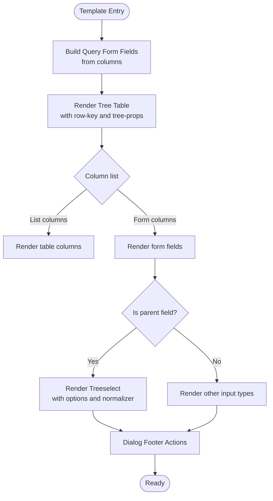
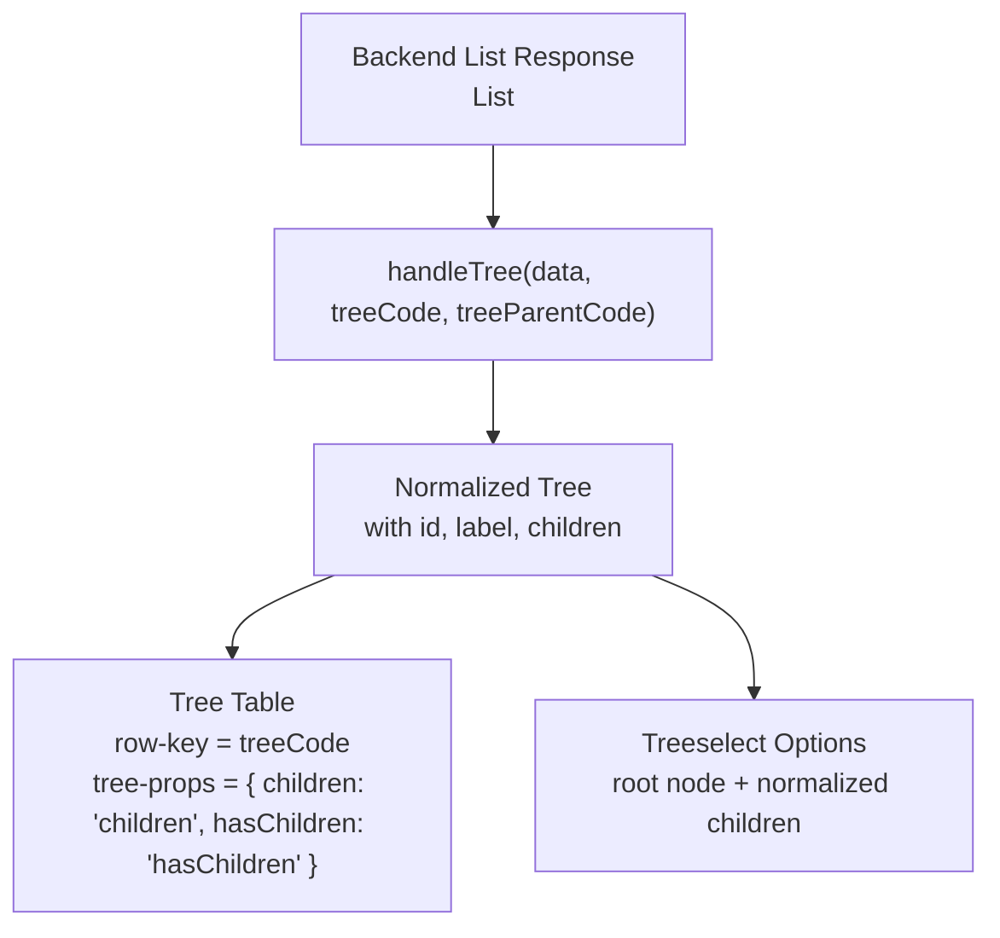
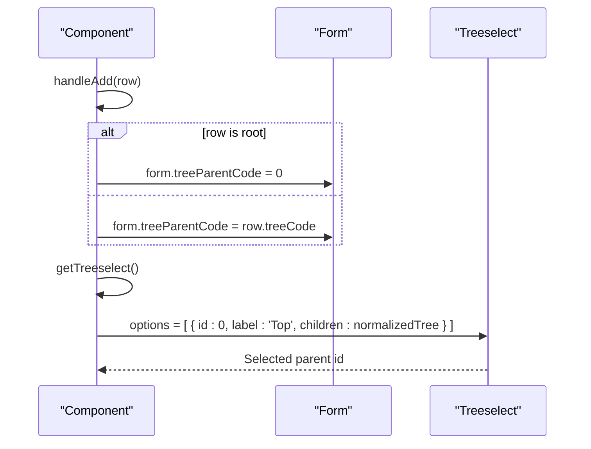
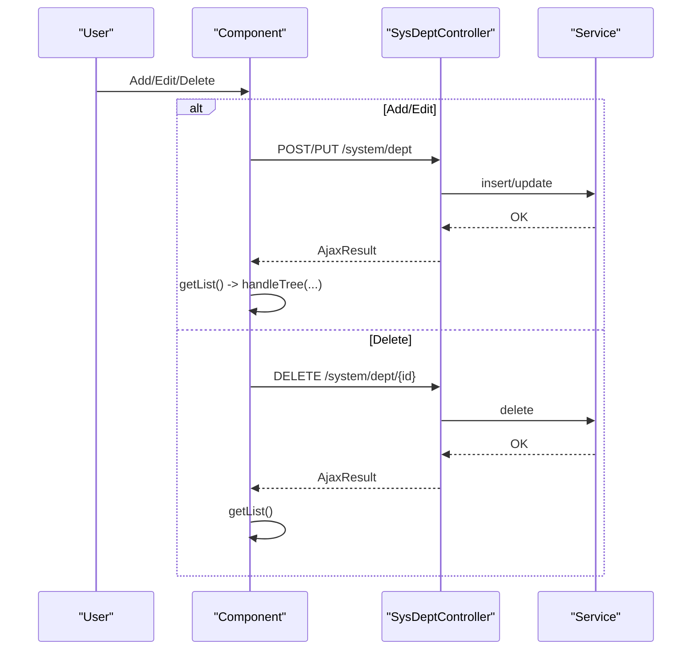
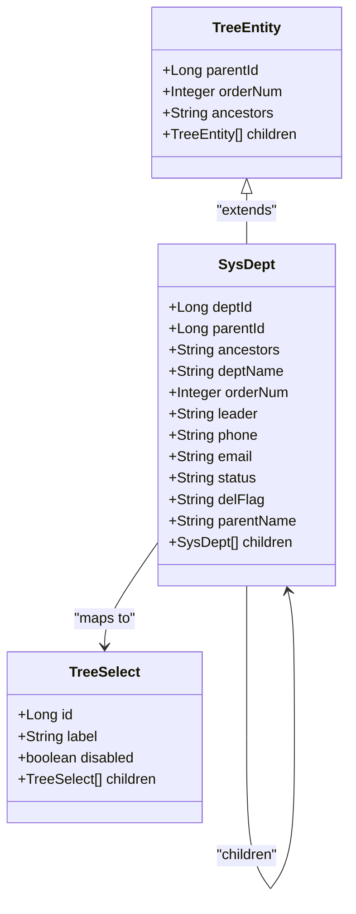
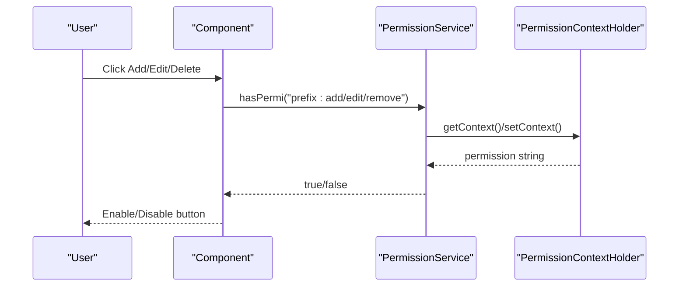
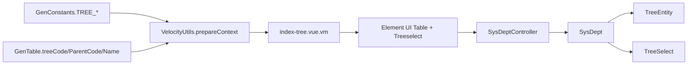

# Tree View

<cite>
**Referenced Files in This Document**
- [index-tree.vue.vm](file://src/main/resources/vm/vue/index-tree.vue.vm)
- [GenConstants.java](file://src/main/java/com/ruoyi/common/constant/GenConstants.java)
- [VelocityUtils.java](file://src/main/java/com/ruoyi/project/tool/gen/util/VelocityUtils.java)
- [GenTable.java](file://src/main/java/com/ruoyi/project/tool/gen/domain/GenTable.java)
- [TreeEntity.java](file://src/main/java/com/ruoyi/framework/web/domain/TreeEntity.java)
- [TreeSelect.java](file://src/main/java/com/ruoyi/framework/web/domain/TreeSelect.java)
- [SysDept.java](file://src/main/java/com/ruoyi/project/system/domain/SysDept.java)
- [SysDeptController.java](file://src/main/java/com/ruoyi/project/system/controller/SysDeptController.java)
- [PermissionService.java](file://src/main/java/com/ruoyi/framework/security/service/PermissionService.java)
- [SysPermissionService.java](file://src/main/java/com/ruoyi/framework/security/service/SysPermissionService.java)
- [PermissionContextHolder.java](file://src/main/java/com/ruoyi/framework/security/context/PermissionContextHolder.java)
</cite>

## Table of Contents
1. [Introduction](#introduction)
2. [Project Structure](#project-structure)
3. [Core Components](#core-components)
4. [Architecture Overview](#architecture-overview)
5. [Detailed Component Analysis](#detailed-component-analysis)
6. [Dependency Analysis](#dependency-analysis)
7. [Performance Considerations](#performance-considerations)
8. [Troubleshooting Guide](#troubleshooting-guide)
9. [Conclusion](#conclusion)

## Introduction
This document explains the index-tree.vue.vm Velocity template used to generate hierarchical/tree-based Vue components in the RuoYi-Vue frontend. It focuses on how the template extends a flat table view to support tree-structured data using Element UI’s tree-like table rendering and the Treeselect component for parent selection. It also details how Velocity variables define hierarchical relationships (treeCode, treeParentCode, treeName), enable expandable/collapsible nodes, and maintain parent-child data integrity during CRUD operations. Finally, it covers integration with backend tree-enabled entities like SysDept and how the frontend enforces data scope and permission checks using v-hasPermi within the tree context.

## Project Structure
The template resides under the Velocity VM templates for Vue, alongside other templates for CRUD and sub-table views. The generator utilities inject tree-related metadata into the Velocity context, which the template consumes to render dynamic forms, search filters, and tree-aware UI.

**Diagram sources**
- [index-tree.vue.vm](file://src/main/resources/vm/vue/index-tree.vue.vm#L1-L506)
- [VelocityUtils.java](file://src/main/java/com/ruoyi/project/tool/gen/util/VelocityUtils.java#L37-L120)
- [GenTable.java](file://src/main/java/com/ruoyi/project/tool/gen/domain/GenTable.java#L291-L319)
- [GenConstants.java](file://src/main/java/com/ruoyi/common/constant/GenConstants.java#L19-L33)
- [SysDept.java](file://src/main/java/com/ruoyi/project/system/domain/SysDept.java#L1-L204)
- [SysDeptController.java](file://src/main/java/com/ruoyi/project/system/controller/SysDeptController.java#L1-L133)
- [TreeEntity.java](file://src/main/java/com/ruoyi/framework/web/domain/TreeEntity.java#L1-L80)
- [TreeSelect.java](file://src/main/java/com/ruoyi/framework/web/domain/TreeSelect.java#L1-L94)

**Section sources**
- [index-tree.vue.vm](file://src/main/resources/vm/vue/index-tree.vue.vm#L1-L506)
- [VelocityUtils.java](file://src/main/java/com/ruoyi/project/tool/gen/util/VelocityUtils.java#L37-L120)
- [GenTable.java](file://src/main/java/com/ruoyi/project/tool/gen/domain/GenTable.java#L291-L319)
- [GenConstants.java](file://src/main/java/com/ruoyi/common/constant/GenConstants.java#L19-L33)

## Core Components
- Template-driven UI generation: The Velocity template renders a searchable, sortable, and tree-structured table using Element UI, with dynamic form fields and search filters.
- Tree-aware rendering: The table is configured as a tree with row-key and tree-props bound to the generated treeCode and treeParentCode fields.
- Parent selection: The Treeselect component is used to select a parent node, with a normalized structure that maps backend entities to the Treeselect model.
- CRUD adaptation: The component adapts CRUD operations for hierarchical data, including root node handling and dialog-based creation/editing.

Key template variables and their roles:
- treeCode: Unique identifier field for each node; used as row-key and mapped to Treeselect id.
- treeParentCode: Parent identifier field; used to bind parent selection and to build hierarchical structures.
- treeName: Label field for nodes; used as display label in the tree and Treeselect.

**Section sources**
- [index-tree.vue.vm](file://src/main/resources/vm/vue/index-tree.vue.vm#L93-L100)
- [index-tree.vue.vm](file://src/main/resources/vm/vue/index-tree.vue.vm#L181-L184)
- [index-tree.vue.vm](file://src/main/resources/vm/vue/index-tree.vue.vm#L379-L388)
- [GenConstants.java](file://src/main/java/com/ruoyi/common/constant/GenConstants.java#L19-L33)
- [VelocityUtils.java](file://src/main/java/com/ruoyi/project/tool/gen/util/VelocityUtils.java#L84-L104)

## Architecture Overview
The system integrates backend tree entities with a Vue component generated from the Velocity template. The backend exposes endpoints to list, retrieve, create, update, and delete hierarchical records. The frontend uses Element UI’s tree table and Treeselect to present and manage the hierarchy.

**Diagram sources**
- [SysDeptController.java](file://src/main/java/com/ruoyi/project/system/controller/SysDeptController.java#L38-L69)
- [SysDeptController.java](file://src/main/java/com/ruoyi/project/system/controller/SysDeptController.java#L71-L111)
- [index-tree.vue.vm](file://src/main/resources/vm/vue/index-tree.vue.vm#L373-L377)
- [index-tree.vue.vm](file://src/main/resources/vm/vue/index-tree.vue.vm#L379-L388)
- [index-tree.vue.vm](file://src/main/resources/vm/vue/index-tree.vue.vm#L390-L397)
- [index-tree.vue.vm](file://src/main/resources/vm/vue/index-tree.vue.vm#L470-L493)

## Detailed Component Analysis

### Template Rendering Pipeline
The template orchestrates:
- Search form generation from column metadata with query flags and HTML types.
- Tree table rendering with row-key and tree-props bound to treeCode and treeParentCode.
- Form fields generation for add/edit dialogs, including parent selection via Treeselect when applicable.
- Dialog actions for submit, cancel, and CRUD operations.

**Diagram sources**
- [index-tree.vue.vm](file://src/main/resources/vm/vue/index-tree.vue.vm#L1-L68)
- [index-tree.vue.vm](file://src/main/resources/vm/vue/index-tree.vue.vm#L93-L165)
- [index-tree.vue.vm](file://src/main/resources/vm/vue/index-tree.vue.vm#L167-L281)

**Section sources**
- [index-tree.vue.vm](file://src/main/resources/vm/vue/index-tree.vue.vm#L1-L68)
- [index-tree.vue.vm](file://src/main/resources/vm/vue/index-tree.vue.vm#L93-L165)
- [index-tree.vue.vm](file://src/main/resources/vm/vue/index-tree.vue.vm#L167-L281)

### Tree Relationship Variables and Normalization
- treeCode: Used as row-key for the Element UI tree table and as the id mapping in Treeselect normalization.
- treeParentCode: Used to bind parent selection in forms and to construct the tree structure.
- treeName: Used as the label for nodes in both the table and Treeselect.

Normalization ensures empty children are removed and only essential fields are passed to Treeselect.

**Diagram sources**
- [index-tree.vue.vm](file://src/main/resources/vm/vue/index-tree.vue.vm#L373-L377)
- [index-tree.vue.vm](file://src/main/resources/vm/vue/index-tree.vue.vm#L379-L388)
- [index-tree.vue.vm](file://src/main/resources/vm/vue/index-tree.vue.vm#L390-L397)

**Section sources**
- [index-tree.vue.vm](file://src/main/resources/vm/vue/index-tree.vue.vm#L93-L100)
- [index-tree.vue.vm](file://src/main/resources/vm/vue/index-tree.vue.vm#L373-L397)
- [GenConstants.java](file://src/main/java/com/ruoyi/common/constant/GenConstants.java#L19-L33)

### Conditional Rendering and Root Node Handling
- Parent selection is conditionally rendered only when the column corresponds to treeParentCode.
- Root node identification is handled by setting the parent field to a sentinel value (e.g., 0) when adding from the root level.
- The Treeselect options include a synthetic root node to represent the top-level selection.

**Diagram sources**
- [index-tree.vue.vm](file://src/main/resources/vm/vue/index-tree.vue.vm#L431-L442)
- [index-tree.vue.vm](file://src/main/resources/vm/vue/index-tree.vue.vm#L432-L442)
- [index-tree.vue.vm](file://src/main/resources/vm/vue/index-tree.vue.vm#L390-L397)

**Section sources**
- [index-tree.vue.vm](file://src/main/resources/vm/vue/index-tree.vue.vm#L181-L184)
- [index-tree.vue.vm](file://src/main/resources/vm/vue/index-tree.vue.vm#L431-L442)
- [index-tree.vue.vm](file://src/main/resources/vm/vue/index-tree.vue.vm#L390-L397)

### CRUD Adaptations for Hierarchical Data
- Add: Sets parent field based on context (root vs child), opens dialog, and submits to backend endpoint.
- Edit: Loads record, populates form, and initializes Treeselect options.
- Delete: Confirms deletion and refreshes the tree list.
- Submit: Validates form, converts checkbox arrays to joined strings, and calls add/update endpoints.

**Diagram sources**
- [index-tree.vue.vm](file://src/main/resources/vm/vue/index-tree.vue.vm#L470-L493)
- [index-tree.vue.vm](file://src/main/resources/vm/vue/index-tree.vue.vm#L494-L502)
- [SysDeptController.java](file://src/main/java/com/ruoyi/project/system/controller/SysDeptController.java#L71-L111)

**Section sources**
- [index-tree.vue.vm](file://src/main/resources/vm/vue/index-tree.vue.vm#L431-L502)
- [SysDeptController.java](file://src/main/java/com/ruoyi/project/system/controller/SysDeptController.java#L71-L111)

### Backend Integration with Tree Entities
- SysDept extends a base entity and includes parent/child relationships, order number, and ancestors for hierarchical navigation.
- TreeSelect wraps entities to provide a normalized structure for UI components, including disabling nodes based on status.
- Controllers enforce permissions and data scope checks, preventing invalid operations like self-parent assignment or deleting nodes with children or users.

**Diagram sources**
- [TreeEntity.java](file://src/main/java/com/ruoyi/framework/web/domain/TreeEntity.java#L1-L80)
- [SysDept.java](file://src/main/java/com/ruoyi/project/system/domain/SysDept.java#L1-L204)
- [TreeSelect.java](file://src/main/java/com/ruoyi/framework/web/domain/TreeSelect.java#L1-L94)

**Section sources**
- [TreeEntity.java](file://src/main/java/com/ruoyi/framework/web/domain/TreeEntity.java#L1-L80)
- [SysDept.java](file://src/main/java/com/ruoyi/project/system/domain/SysDept.java#L1-L204)
- [TreeSelect.java](file://src/main/java/com/ruoyi/framework/web/domain/TreeSelect.java#L1-L94)
- [SysDeptController.java](file://src/main/java/com/ruoyi/project/system/controller/SysDeptController.java#L38-L131)

### Permission Enforcement with v-hasPermi
- The template uses v-hasPermi directives on action buttons to restrict visibility and interaction based on user permissions.
- Permissions are evaluated by the PermissionService, which checks the logged-in user’s permission set against the required permission string.

**Diagram sources**
- [index-tree.vue.vm](file://src/main/resources/vm/vue/index-tree.vue.vm#L72-L80)
- [index-tree.vue.vm](file://src/main/resources/vm/vue/index-tree.vue.vm#L140-L165)
- [PermissionService.java](file://src/main/java/com/ruoyi/framework/security/service/PermissionService.java#L21-L85)
- [PermissionContextHolder.java](file://src/main/java/com/ruoyi/framework/security/context/PermissionContextHolder.java#L1-L27)

**Section sources**
- [index-tree.vue.vm](file://src/main/resources/vm/vue/index-tree.vue.vm#L72-L80)
- [index-tree.vue.vm](file://src/main/resources/vm/vue/index-tree.vue.vm#L140-L165)
- [PermissionService.java](file://src/main/java/com/ruoyi/framework/security/service/PermissionService.java#L21-L85)
- [PermissionContextHolder.java](file://src/main/java/com/ruoyi/framework/security/context/PermissionContextHolder.java#L1-L27)

## Dependency Analysis
The template depends on:
- Generator-provided Velocity context variables (treeCode, treeParentCode, treeName) injected via VelocityUtils.
- Backend entities (SysDept) and DTOs (TreeSelect) for data modeling and UI mapping.
- Element UI components (El-Table, El-TreeSelect/Treeselect) for rendering and interaction.
- Backend controllers for CRUD operations and permission enforcement.

**Diagram sources**
- [VelocityUtils.java](file://src/main/java/com/ruoyi/project/tool/gen/util/VelocityUtils.java#L37-L120)
- [GenConstants.java](file://src/main/java/com/ruoyi/common/constant/GenConstants.java#L19-L33)
- [GenTable.java](file://src/main/java/com/ruoyi/project/tool/gen/domain/GenTable.java#L291-L319)
- [index-tree.vue.vm](file://src/main/resources/vm/vue/index-tree.vue.vm#L1-L506)
- [SysDeptController.java](file://src/main/java/com/ruoyi/project/system/controller/SysDeptController.java#L1-L133)
- [SysDept.java](file://src/main/java/com/ruoyi/project/system/domain/SysDept.java#L1-L204)
- [TreeEntity.java](file://src/main/java/com/ruoyi/framework/web/domain/TreeEntity.java#L1-L80)
- [TreeSelect.java](file://src/main/java/com/ruoyi/framework/web/domain/TreeSelect.java#L1-L94)

**Section sources**
- [VelocityUtils.java](file://src/main/java/com/ruoyi/project/tool/gen/util/VelocityUtils.java#L37-L120)
- [GenConstants.java](file://src/main/java/com/ruoyi/common/constant/GenConstants.java#L19-L33)
- [GenTable.java](file://src/main/java/com/ruoyi/project/tool/gen/domain/GenTable.java#L291-L319)
- [index-tree.vue.vm](file://src/main/resources/vm/vue/index-tree.vue.vm#L1-L506)
- [SysDeptController.java](file://src/main/java/com/ruoyi/project/system/controller/SysDeptController.java#L1-L133)
- [SysDept.java](file://src/main/java/com/ruoyi/project/system/domain/SysDept.java#L1-L204)
- [TreeEntity.java](file://src/main/java/com/ruoyi/framework/web/domain/TreeEntity.java#L1-L80)
- [TreeSelect.java](file://src/main/java/com/ruoyi/framework/web/domain/TreeSelect.java#L1-L94)

## Performance Considerations
- Tree rendering performance scales with depth and breadth; consider lazy loading strategies if subtrees become large.
- Normalize data once per list load to minimize repeated transformations.
- Debounce search queries and avoid unnecessary re-renders by toggling refreshTable when expanding/collapsing nodes.

## Troubleshooting Guide
- Parent selection not appearing: Verify that the column’s javaField equals the configured treeParentCode in the generator options.
- Root node not selectable: Ensure the dialog sets the parent field to the appropriate sentinel value when adding from the root.
- Tree not expanding/collapsing: Confirm isExpandAll is toggled and refreshTable is re-rendered after state change.
- Permission denied: Check that the user holds the required permission prefix for add/edit/remove actions.

**Section sources**
- [index-tree.vue.vm](file://src/main/resources/vm/vue/index-tree.vue.vm#L444-L450)
- [index-tree.vue.vm](file://src/main/resources/vm/vue/index-tree.vue.vm#L431-L442)
- [index-tree.vue.vm](file://src/main/resources/vm/vue/index-tree.vue.vm#L140-L165)
- [PermissionService.java](file://src/main/java/com/ruoyi/framework/security/service/PermissionService.java#L21-L85)

## Conclusion
The index-tree.vue.vm template provides a robust foundation for building tree-based views in RuoYi-Vue. By leveraging Velocity context variables (treeCode, treeParentCode, treeName), Element UI’s tree table, and Treeselect, it enables intuitive hierarchical data management. The backend’s SysDept and TreeSelect models, combined with controller-level permission and scope checks, ensure data integrity and secure operations. The template’s dynamic generation preserves consistency across tree-enabled entities while adapting CRUD workflows to hierarchical contexts.