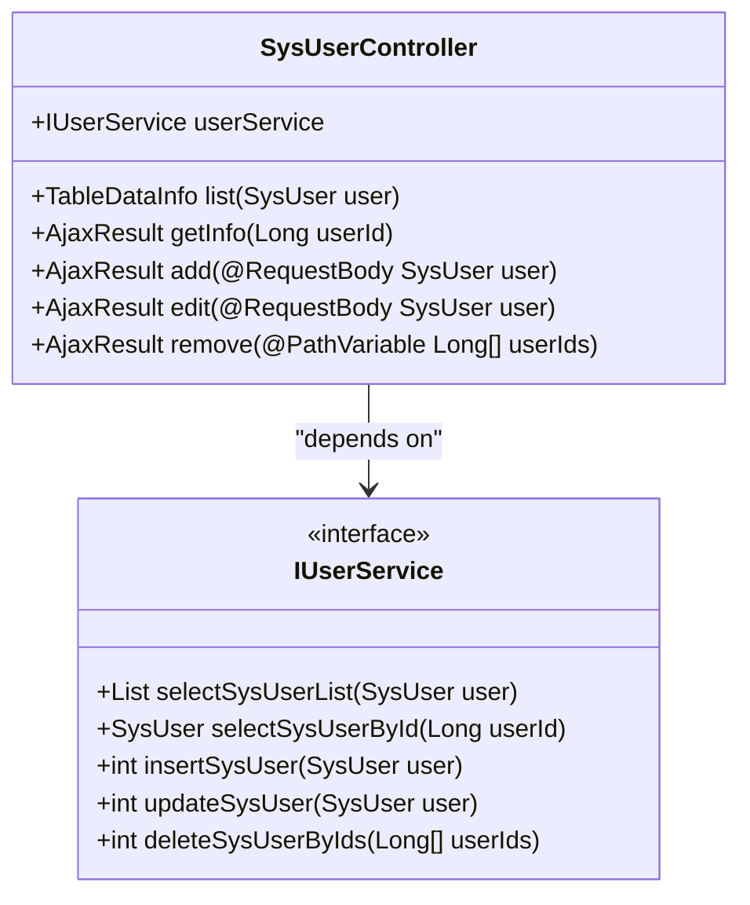
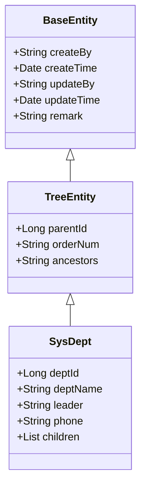
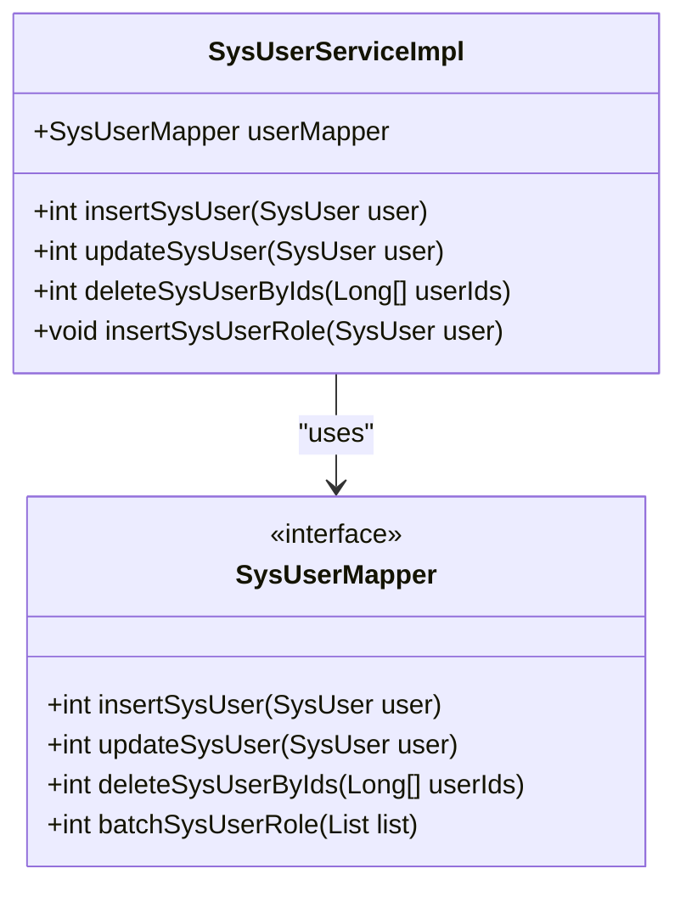
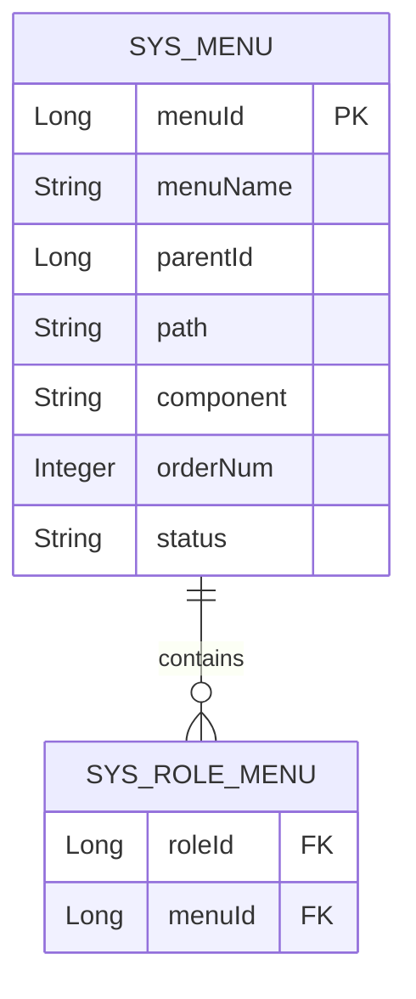
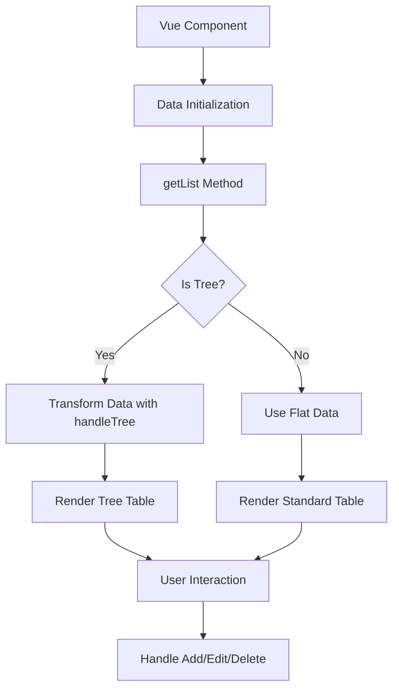
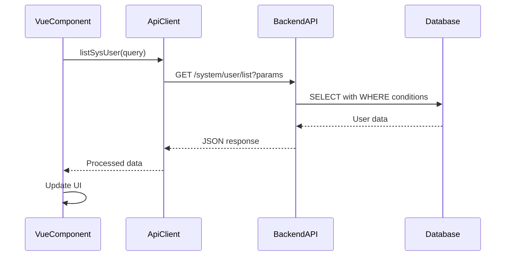
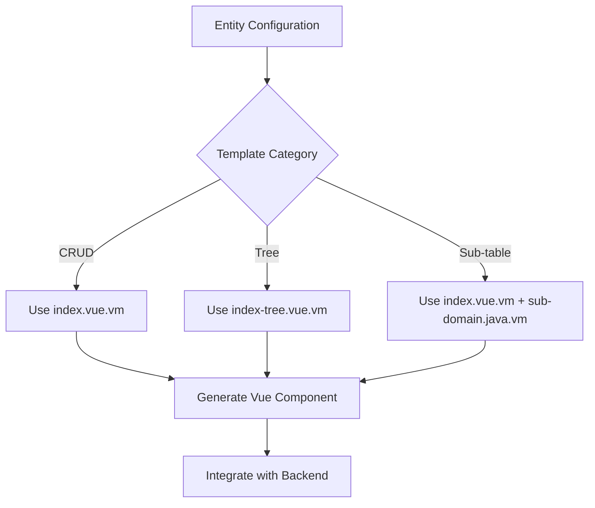
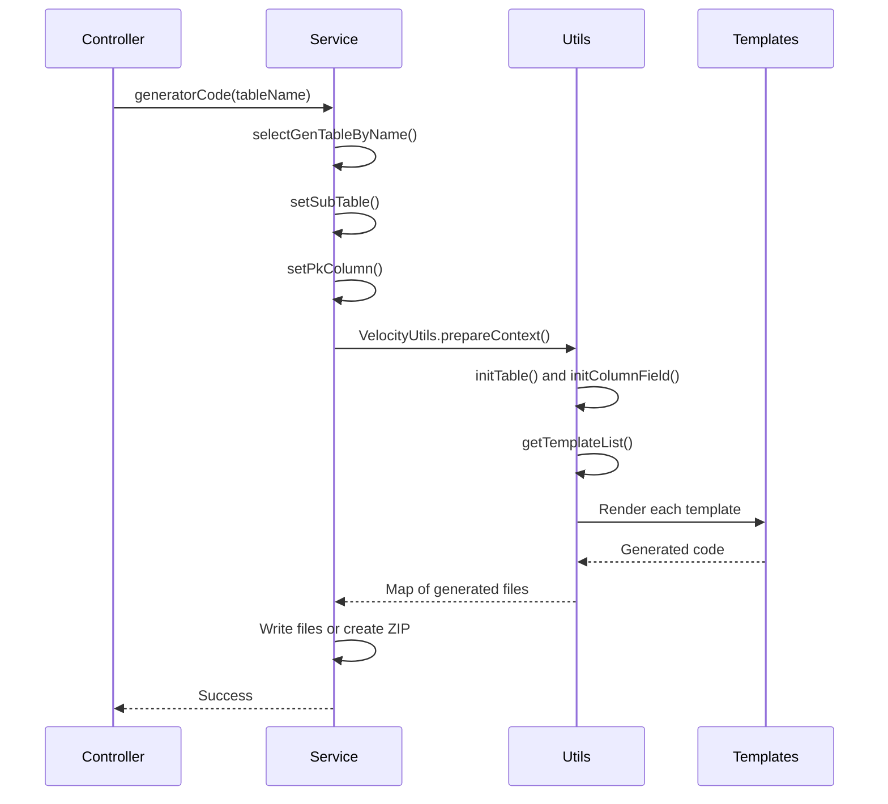

# Output

<cite>
**Referenced Files in This Document**   
- [controller.java.vm](file://src/main/resources/vm/java/controller.java.vm)
- [domain.java.vm](file://src/main/resources/vm/java/domain.java.vm)
- [mapper.java.vm](file://src/main/resources/vm/java/mapper.java.vm)
- [service.java.vm](file://src/main/resources/vm/java/service.java.vm)
- [serviceImpl.java.vm](file://src/main/resources/vm/java/serviceImpl.java.vm)
- [sub-domain.java.vm](file://src/main/resources/vm/java/sub-domain.java.vm)
- [index.vue.vm](file://src/main/resources/vm/vue/index.vue.vm)
- [index-tree.vue.vm](file://src/main/resources/vm/vue/index-tree.vue.vm)
- [api.js.vm](file://src/main/resources/vm/js/api.js.vm)
- [mapper.xml.vm](file://src/main/resources/vm/xml/mapper.xml.vm)
- [sql.vm](file://src/main/resources/vm/sql/sql.vm)
- [GenUtils.java](file://src/main/java/com/ruoyi/project/tool/gen/util/GenUtils.java)
- [VelocityUtils.java](file://src/main/java/com/ruoyi/project/tool/gen/util/VelocityUtils.java)
- [GenTableServiceImpl.java](file://src/main/java/com/ruoyi/project/tool/gen/service/GenTableServiceImpl.java)
</cite>

## Table of Contents
1. [Introduction](#introduction)
2. [Backend Java Components](#backend-java-components)
3. [MyBatis XML Mappers](#mybatis-xml-mappers)
4. [Frontend Vue.js Pages](#frontend-vuejs-pages)
5. [JavaScript API Clients](#javascript-api-clients)
6. [SQL Scripts and Configuration](#sql-scripts-and-configuration)
7. [Template Processing and Generation Workflow](#template-processing-and-generation-workflow)
8. [Conclusion](#conclusion)

## Introduction
The RuoYi-Vue code generator is a powerful tool that automates the creation of full-stack application components based on database table structures. It leverages Apache Velocity templates to generate backend Java components (controller, domain, mapper, service, serviceImpl), MyBatis XML mappers, frontend Vue.js pages, JavaScript API clients, and SQL scripts. The generator uses conditional logic and loops within Velocity templates to produce appropriate code based on entity characteristics such as tree structure or sub-table relationships. This document provides a comprehensive analysis of each generated artifact type, explaining how placeholders like $!{className}, $!{fields}, and $!{treeCode} are replaced during generation, and detailing the structure and integration of generated components.

## Backend Java Components

The RuoYi-Vue code generator produces several key Java components for each entity, including controllers, domain models, mappers, services, and service implementations. These components follow a standard layered architecture and are generated using Velocity templates that incorporate conditional logic based on the entity's characteristics.

### Controller Generation
The controller template (`controller.java.vm`) generates RESTful endpoints for CRUD operations. It uses conditional directives to handle different entity types:
- For standard CRUD entities: Implements `TableDataInfo` for paginated responses
- For tree-structured entities: Returns flat lists that are later transformed into hierarchical structures
- Includes conditional imports and method signatures based on entity configuration

The template uses placeholders such as:
- `$!{className}`: Replaced with the entity class name (e.g., "SysUser")
- `$!{businessName}`: Replaced with the business name derived from the table name
- `$!{permissionPrefix}`: Replaced with permission identifiers for security annotations

**Diagram sources**
- [controller.java.vm](file://src/main/resources/vm/java/controller.java.vm)
- [service.java.vm](file://src/main/resources/vm/java/service.java.vm)

**Section sources**
- [controller.java.vm](file://src/main/resources/vm/java/controller.java.vm)
- [GenUtils.java](file://src/main/java/com/ruoyi/project/tool/gen/util/GenUtils.java)

### Domain Model Generation
The domain template (`domain.java.vm`) generates entity classes that extend either `BaseEntity` or `TreeEntity` based on the entity type:
- Standard entities extend `BaseEntity` which includes audit fields (createBy, createTime, updateBy, updateTime)
- Tree-structured entities extend `TreeEntity` which includes hierarchical fields (parentId, orderNum, ancestors)
- Sub-table entities include a list property for the child entities

The template uses conditional logic to:
- Include appropriate imports based on field types (Date, BigDecimal)
- Apply Excel annotations for export functionality
- Generate getters and setters for all non-superclass fields
- Implement `toString()` using reflection utilities

**Diagram sources**
- [domain.java.vm](file://src/main/resources/vm/java/domain.java.vm)
- [GenUtils.java](file://src/main/java/com/ruoyi/project/tool/gen/util/GenUtils.java)

**Section sources**
- [domain.java.vm](file://src/main/resources/vm/java/domain.java.vm)
- [GenUtils.java](file://src/main/java/com/ruoyi/project/tool/gen/util/GenUtils.java)

### Service Layer Generation
The service templates (`service.java.vm` and `serviceImpl.java.vm`) generate interface and implementation classes that encapsulate business logic:
- The interface defines standard CRUD operations
- The implementation injects the corresponding mapper and delegates operations
- For entities with sub-tables, additional methods handle child entity operations
- Transactional annotations are applied to create, update, and delete operations

The service implementation template includes conditional logic to:
- Add transaction management for sub-table operations
- Automatically set audit fields (createTime, updateTime)
- Handle batch operations for sub-table entities

**Diagram sources**
- [serviceImpl.java.vm](file://src/main/resources/vm/java/serviceImpl.java.vm)
- [mapper.java.vm](file://src/main/resources/vm/java/mapper.java.vm)

**Section sources**
- [service.java.vm](file://src/main/resources/vm/java/service.java.vm)
- [serviceImpl.java.vm](file://src/main/resources/vm/java/serviceImpl.java.vm)

## MyBatis XML Mappers

The MyBatis XML mapper template (`mapper.xml.vm`) generates SQL mapping files that define database operations for each entity. These files include SELECT, INSERT, UPDATE, and DELETE statements, with conditional logic to handle different entity types.

### Standard CRUD Mappers
For standard entities, the template generates:
- Parameterized SELECT statements with dynamic WHERE clauses
- INSERT statements with conditional field inclusion
- UPDATE statements with conditional field updates
- DELETE statements for single and batch operations

The template uses Velocity loops to:
- Generate column lists for SELECT statements
- Create dynamic WHERE conditions based on query parameters
- Handle nullable fields and string empty checks
- Support various query types (EQ, NE, GT, LT, LIKE, BETWEEN)

### Sub-Table Mappers
For entities with sub-table relationships, the template generates additional elements:
- Nested result maps using `<collection>` to map parent-child relationships
- Separate result maps for child entities
- Additional SQL statements for batch operations on child entities
- Methods to delete child records when parent records are deleted

**Diagram sources**
- [mapper.xml.vm](file://src/main/resources/vm/xml/mapper.xml.vm)
- [GenTableServiceImpl.java](file://src/main/java/com/ruoyi/project/tool/gen/service/GenTableServiceImpl.java)

**Section sources**
- [mapper.xml.vm](file://src/main/resources/vm/xml/mapper.xml.vm)
- [GenTableServiceImpl.java](file://src/main/java/com/ruoyi/project/tool/gen/service/GenTableServiceImpl.java)

## Frontend Vue.js Pages

The RuoYi-Vue generator produces Vue.js components for entity management, with different templates for standard lists and tree structures.

### Standard List Page (index.vue.vm)
The standard list template generates a Vue component with:
- Search form with fields for all queryable columns
- Data table with columns for all listable fields
- Pagination controls
- Dialog for adding/editing records
- Buttons for add, edit, delete, and export operations

The template uses Velocity loops to:
- Generate form fields based on column configuration
- Create table columns with appropriate formatting
- Add form validation rules for required fields
- Handle different input types (text, select, date, checkbox)

### Tree Structure Page (index-tree.vue.vm)
The tree template generates a hierarchical component with:
- Tree-table display using Element UI's tree properties
- Expand/collapse functionality for nodes
- Special handling for tree-specific fields (parent, order)
- Treeselect component for parent selection in the edit dialog

Key differences from the standard template:
- Uses `row-key` and `tree-props` attributes on the table
- Includes a `normalizer` method to transform flat data into tree structure
- Provides a "Get Treeselect" method to populate the parent selection dropdown
- Handles hierarchical data in the `getList` method using `handleTree`

**Diagram sources**
- [index.vue.vm](file://src/main/resources/vm/vue/index.vue.vm)
- [index-tree.vue.vm](file://src/main/resources/vm/vue/index-tree.vue.vm)

**Section sources**
- [index.vue.vm](file://src/main/resources/vm/vue/index.vue.vm)
- [index-tree.vue.vm](file://src/main/resources/vm/vue/index-tree.vue.vm)

## JavaScript API Clients

The JavaScript API template (`api.js.vm`) generates a module that provides methods for interacting with the backend REST API. Each generated API client includes methods for standard CRUD operations.

### API Client Structure
The template generates:
- `list${BusinessName}(query)` - GET request to retrieve a paginated list
- `get${BusinessName}(id)` - GET request to retrieve a single record
- `add${BusinessName}(data)` - POST request to create a new record
- `update${BusinessName}(data)` - PUT request to update an existing record
- `del${BusinessName}(id)` - DELETE request to remove a record

The template uses placeholders such as:
- `$!{moduleName}`: Replaced with the module name for URL routing
- `$!{businessName}`: Replaced with the business name for URL routing
- `$!{pkColumn.javaField}`: Replaced with the primary key field name

These generated API clients are imported and used by the Vue components to perform data operations, creating a clean separation between UI presentation and data access.

**Diagram sources**
- [api.js.vm](file://src/main/resources/vm/js/api.js.vm)
- [index.vue.vm](file://src/main/resources/vm/vue/index.vue.vm)

**Section sources**
- [api.js.vm](file://src/main/resources/vm/js/api.js.vm)
- [VelocityUtils.java](file://src/main/java/com/ruoyi/project/tool/gen/util/VelocityUtils.java)

## SQL Scripts and Configuration

The generator produces SQL scripts for menu and permission configuration, ensuring that the generated entities are integrated into the application's navigation and security system.

### Menu and Permission SQL
The SQL template (`sql.vm`) generates:
- Insert statement for the main menu item
- Retrieval of the generated menu ID using `LAST_INSERT_ID()`
- Insert statements for child menu items (buttons) with specific permissions
- Five standard permissions: query, add, edit, remove, and export

The generated SQL ensures that:
- Each entity has a corresponding menu item in the system
- Appropriate permissions are created for all CRUD operations
- The menu hierarchy is maintained with proper parent-child relationships
- All security annotations in the backend controller can be properly validated

### Template Selection and File Generation
The `VelocityUtils.java` class determines which templates to process based on the entity configuration:
- `TPL_CRUD`: Uses `index.vue.vm` for standard list views
- `TPL_TREE`: Uses `index-tree.vue.vm` for hierarchical data display
- `TPL_SUB`: Uses `index.vue.vm` plus `sub-domain.java.vm` for master-detail relationships

The `getFileName()` method in `VelocityUtils` determines the output path for each generated file, ensuring proper organization within the project structure.

**Diagram sources**
- [sql.vm](file://src/main/resources/vm/sql/sql.vm)
- [VelocityUtils.java](file://src/main/java/com/ruoyi/project/tool/gen/util/VelocityUtils.java)

**Section sources**
- [sql.vm](file://src/main/resources/vm/sql/sql.vm)
- [VelocityUtils.java](file://src/main/java/com/ruoyi/project/tool/gen/util/VelocityUtils.java)

## Template Processing and Generation Workflow

The code generation process follows a well-defined workflow orchestrated by the `GenTableServiceImpl` class:

### Generation Process
1. **Initialization**: The `importGenTable` method initializes table and column information using `GenUtils`
2. **Context Preparation**: `VelocityUtils.prepareContext()` creates a VelocityContext with all necessary variables
3. **Template Selection**: `VelocityUtils.getTemplateList()` determines which templates to process based on entity type
4. **Code Generation**: Templates are rendered using Apache Velocity, with placeholders replaced by actual values
5. **File Output**: Generated code is written to appropriate files or packaged in a ZIP for download

### Key Velocity Directives
The templates extensively use Velocity directives:
- `#if/#elseif/#else`: Conditional logic for different entity types
- `#foreach`: Iteration over columns and other collections
- `#set`: Variable assignment within templates
- `#include`: Reuse of common template fragments

### Placeholder Replacement
During generation, the following key placeholders are replaced:
- `$!{className}`: Entity class name (e.g., "SysUser")
- `$!{businessName}`: Business name from table (e.g., "user")
- `$!{moduleName}`: Module name (e.g., "system")
- `$!{fields}`: Collection of field definitions
- `$!{treeCode}`: Field used as tree node identifier
- `$!{permissionPrefix}`: Permission string for security annotations

The `GenUtils` class plays a crucial role in preparing the data model for template processing, converting database metadata into the format expected by the Velocity templates.

**Diagram sources**
- [GenTableServiceImpl.java](file://src/main/java/com/ruoyi/project/tool/gen/service/GenTableServiceImpl.java)
- [VelocityUtils.java](file://src/main/java/com/ruoyi/project/tool/gen/util/VelocityUtils.java)

**Section sources**
- [GenTableServiceImpl.java](file://src/main/java/com/ruoyi/project/tool/gen/service/GenTableServiceImpl.java)
- [VelocityUtils.java](file://src/main/java/com/ruoyi/project/tool/gen/util/VelocityUtils.java)

## Conclusion
The RuoYi-Vue code generator provides a comprehensive solution for rapidly creating full-stack application components from database schemas. By leveraging Velocity templates with sophisticated conditional logic and loops, it produces consistent, high-quality code across backend Java components, MyBatis mappings, frontend Vue.js pages, and supporting artifacts. The generator adapts to different entity characteristics—such as tree structures and sub-table relationships—producing appropriately tailored code for each scenario. This automation significantly reduces development time while maintaining code quality and consistency across the application. The integration of generated components into the existing project structure, including menu and permission configuration, ensures that new entities are fully functional within the application ecosystem immediately after generation.