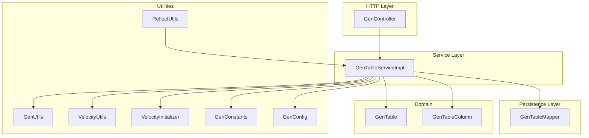
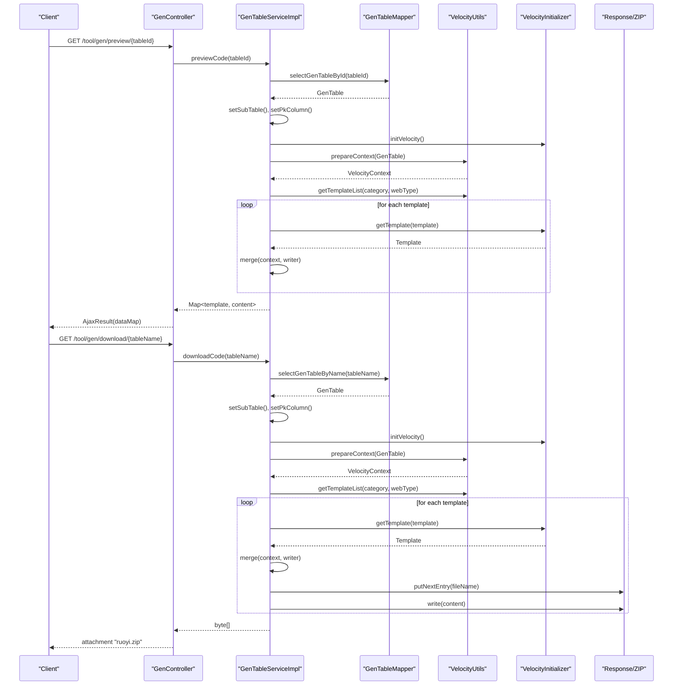
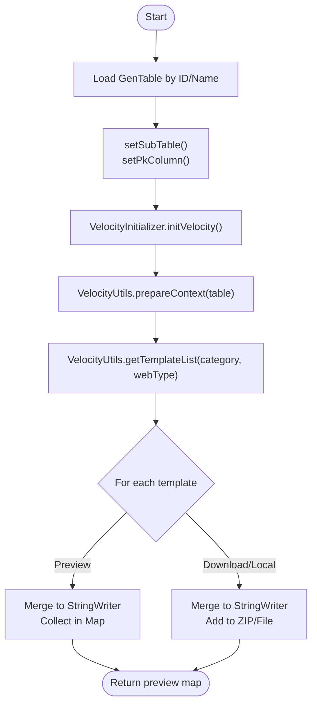
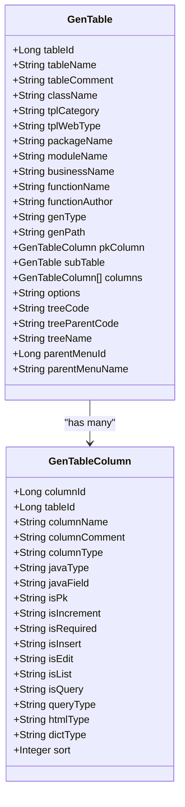
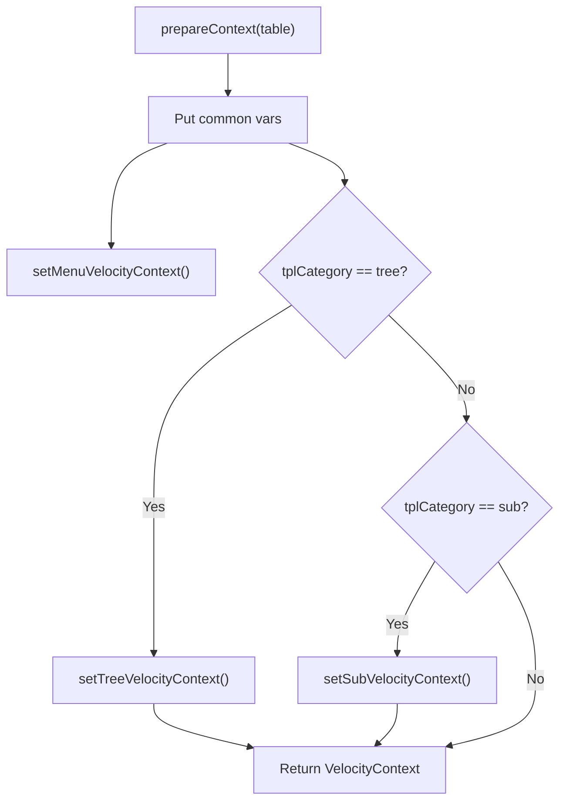
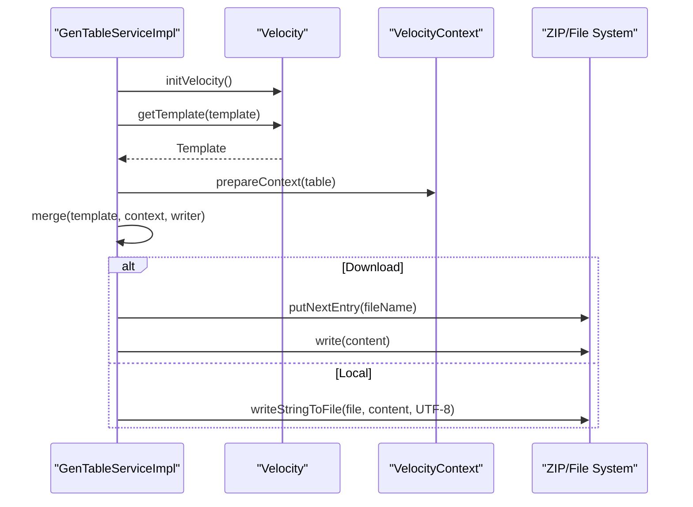
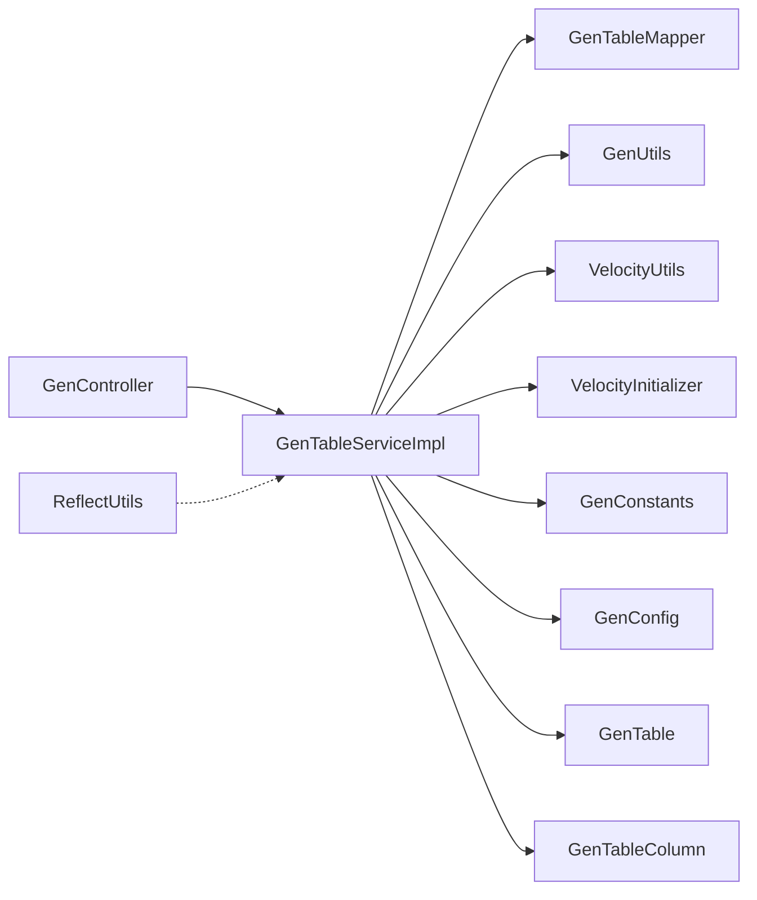

# Process

<cite>
**Referenced Files in This Document**
- [GenController.java](file://src/main/java/com/ruoyi/project/tool/gen/controller/GenController.java)
- [GenTableServiceImpl.java](file://src/main/java/com/ruoyi/project/tool/gen/service/GenTableServiceImpl.java)
- [GenTableMapper.java](file://src/main/java/com/ruoyi/project/tool/gen/mapper/GenTableMapper.java)
- [GenTable.java](file://src/main/java/com/ruoyi/project/tool/gen/domain/GenTable.java)
- [GenTableColumn.java](file://src/main/java/com/ruoyi/project/tool/gen/domain/GenTableColumn.java)
- [GenUtils.java](file://src/main/java/com/ruoyi/project/tool/gen/util/GenUtils.java)
- [VelocityUtils.java](file://src/main/java/com/ruoyi/project/tool/gen/util/VelocityUtils.java)
- [VelocityInitializer.java](file://src/main/java/com/ruoyi/project/tool/gen/util/VelocityInitializer.java)
- [ReflectUtils.java](file://src/main/java/com/ruoyi/common/utils/reflect/ReflectUtils.java)
- [GenConstants.java](file://src/main/java/com/ruoyi/common/constant/GenConstants.java)
- [GenConfig.java](file://src/main/java/com/ruoyi/framework/config/GenConfig.java)
</cite>

## Table of Contents
1. [Introduction](#introduction)
2. [Project Structure](#project-structure)
3. [Core Components](#core-components)
4. [Architecture Overview](#architecture-overview)
5. [Detailed Component Analysis](#detailed-component-analysis)
6. [Dependency Analysis](#dependency-analysis)
7. [Performance Considerations](#performance-considerations)
8. [Troubleshooting Guide](#troubleshooting-guide)
9. [Conclusion](#conclusion)

## Introduction
This document explains the end-to-end code generation process in RuoYi-Vue, from HTTP requests to generated file packaging. It focuses on:
- How GenController handles requests for listing, importing, previewing, downloading, and generating code.
- How GenTableServiceImpl retrieves database schema via GenTableMapper and enriches metadata.
- How GenUtils initializes table and column data from database schema.
- How VelocityUtils prepares VelocityContext with model data and sets generation-type-specific variables (tree and sub-table).
- How reflection and dynamic method invocation in ReflectUtils support flexible data handling.
- How template rendering and ZIP packaging orchestrate the final output.

## Project Structure
The generation feature is organized under the tool module with clear separation of concerns:
- Controller layer: HTTP endpoints for CRUD and code generation.
- Service layer: Orchestration of data retrieval, enrichment, template rendering, and packaging.
- Mapper layer: Database access for business tables and columns.
- Domain models: GenTable and GenTableColumn represent business metadata.
- Utilities: GenUtils for initialization, VelocityUtils for context and filenames, VelocityInitializer for engine setup, ReflectUtils for reflection helpers.
- Configuration: GenConfig holds generation defaults; GenConstants defines constants for templates and types.

**Diagram sources**
- [GenController.java](file://src/main/java/com/ruoyi/project/tool/gen/controller/GenController.java#L1-L263)
- [GenTableServiceImpl.java](file://src/main/java/com/ruoyi/project/tool/gen/service/GenTableServiceImpl.java#L1-L531)
- [GenTableMapper.java](file://src/main/java/com/ruoyi/project/tool/gen/mapper/GenTableMapper.java#L1-L91)
- [GenTable.java](file://src/main/java/com/ruoyi/project/tool/gen/domain/GenTable.java#L1-L385)
- [GenTableColumn.java](file://src/main/java/com/ruoyi/project/tool/gen/domain/GenTableColumn.java#L1-L373)
- [GenUtils.java](file://src/main/java/com/ruoyi/project/tool/gen/util/GenUtils.java#L1-L258)
- [VelocityUtils.java](file://src/main/java/com/ruoyi/project/tool/gen/util/VelocityUtils.java#L1-L409)
- [VelocityInitializer.java](file://src/main/java/com/ruoyi/project/tool/gen/util/VelocityInitializer.java#L1-L35)
- [ReflectUtils.java](file://src/main/java/com/ruoyi/common/utils/reflect/ReflectUtils.java#L1-L411)
- [GenConstants.java](file://src/main/java/com/ruoyi/common/constant/GenConstants.java#L1-L118)
- [GenConfig.java](file://src/main/java/com/ruoyi/framework/config/GenConfig.java#L1-L80)

**Section sources**
- [GenController.java](file://src/main/java/com/ruoyi/project/tool/gen/controller/GenController.java#L1-L263)
- [GenTableServiceImpl.java](file://src/main/java/com/ruoyi/project/tool/gen/service/GenTableServiceImpl.java#L1-L531)
- [GenTableMapper.java](file://src/main/java/com/ruoyi/project/tool/gen/mapper/GenTableMapper.java#L1-L91)
- [GenTable.java](file://src/main/java/com/ruoyi/project/tool/gen/domain/GenTable.java#L1-L385)
- [GenTableColumn.java](file://src/main/java/com/ruoyi/project/tool/gen/domain/GenTableColumn.java#L1-L373)
- [GenUtils.java](file://src/main/java/com/ruoyi/project/tool/gen/util/GenUtils.java#L1-L258)
- [VelocityUtils.java](file://src/main/java/com/ruoyi/project/tool/gen/util/VelocityUtils.java#L1-L409)
- [VelocityInitializer.java](file://src/main/java/com/ruoyi/project/tool/gen/util/VelocityInitializer.java#L1-L35)
- [ReflectUtils.java](file://src/main/java/com/ruoyi/common/utils/reflect/ReflectUtils.java#L1-L411)
- [GenConstants.java](file://src/main/java/com/ruoyi/common/constant/GenConstants.java#L1-L118)
- [GenConfig.java](file://src/main/java/com/ruoyi/framework/config/GenConfig.java#L1-L80)

## Core Components
- GenController: Exposes endpoints for listing, importing, previewing, downloading, and generating code. It delegates to IGenTableService and IGenTableColumnService.
- GenTableServiceImpl: Implements the generation workflow, including retrieving tables/columns, enriching metadata, preparing VelocityContext, rendering templates, and packaging ZIP downloads.
- GenTableMapper: Provides database access for business tables and columns.
- GenTable/GenTableColumn: Domain models representing business metadata and column metadata.
- GenUtils: Initializes table and column fields from database schema and converts names/types.
- VelocityUtils: Builds VelocityContext, selects templates by category, computes filenames, and sets generation-type-specific variables (tree and sub-table).
- VelocityInitializer: Initializes the Velocity engine with UTF-8 encoding and classpath resource loader.
- ReflectUtils: Provides reflection utilities for dynamic invocation and field access used across the system.
- GenConstants/GenConfig: Define generation categories, HTML types, Java types, and configurable defaults.

**Section sources**
- [GenController.java](file://src/main/java/com/ruoyi/project/tool/gen/controller/GenController.java#L55-L263)
- [GenTableServiceImpl.java](file://src/main/java/com/ruoyi/project/tool/gen/service/GenTableServiceImpl.java#L1-L531)
- [GenTableMapper.java](file://src/main/java/com/ruoyi/project/tool/gen/mapper/GenTableMapper.java#L1-L91)
- [GenTable.java](file://src/main/java/com/ruoyi/project/tool/gen/domain/GenTable.java#L1-L385)
- [GenTableColumn.java](file://src/main/java/com/ruoyi/project/tool/gen/domain/GenTableColumn.java#L1-L373)
- [GenUtils.java](file://src/main/java/com/ruoyi/project/tool/gen/util/GenUtils.java#L1-L258)
- [VelocityUtils.java](file://src/main/java/com/ruoyi/project/tool/gen/util/VelocityUtils.java#L1-L409)
- [VelocityInitializer.java](file://src/main/java/com/ruoyi/project/tool/gen/util/VelocityInitializer.java#L1-L35)
- [ReflectUtils.java](file://src/main/java/com/ruoyi/common/utils/reflect/ReflectUtils.java#L1-L411)
- [GenConstants.java](file://src/main/java/com/ruoyi/common/constant/GenConstants.java#L1-L118)
- [GenConfig.java](file://src/main/java/com/ruoyi/framework/config/GenConfig.java#L1-L80)

## Architecture Overview
The generation pipeline starts at the HTTP layer and ends with either previewing rendered templates or packaging a ZIP archive for download.

**Diagram sources**
- [GenController.java](file://src/main/java/com/ruoyi/project/tool/gen/controller/GenController.java#L186-L263)
- [GenTableServiceImpl.java](file://src/main/java/com/ruoyi/project/tool/gen/service/GenTableServiceImpl.java#L204-L401)
- [GenTableMapper.java](file://src/main/java/com/ruoyi/project/tool/gen/mapper/GenTableMapper.java#L1-L91)
- [VelocityUtils.java](file://src/main/java/com/ruoyi/project/tool/gen/util/VelocityUtils.java#L37-L160)
- [VelocityInitializer.java](file://src/main/java/com/ruoyi/project/tool/gen/util/VelocityInitializer.java#L17-L33)

## Detailed Component Analysis

### HTTP Request Handling (GenController)
- Lists business tables and database tables.
- Imports selected database tables into business metadata.
- Previews generated templates without writing files.
- Downloads a ZIP containing generated files.
- Generates code to a configured path (with overwrite protection).
- Synchronizes business metadata with database schema.

Key endpoints:
- GET /tool/gen/list, GET /tool/gen/db/list
- POST /tool/gen/importTable
- GET /tool/gen/preview/{tableId}
- GET /tool/gen/download/{tableName}
- GET /tool/gen/genCode/{tableName}
- GET /tool/gen/synchDb/{tableName}
- GET /tool/gen/batchGenCode

Behavior highlights:
- Uses pagination via BaseController.startPage().
- Validates permissions using @PreAuthorize.
- Uses GenConfig.isAllowOverwrite() to guard local generation.
- Streams ZIP bytes directly to HttpServletResponse.

**Section sources**
- [GenController.java](file://src/main/java/com/ruoyi/project/tool/gen/controller/GenController.java#L55-L263)
- [GenConfig.java](file://src/main/java/com/ruoyi/framework/config/GenConfig.java#L60-L80)

### Service Orchestration (GenTableServiceImpl)
Responsibilities:
- Retrieve business tables and database tables.
- Import database tables into business metadata and initialize columns.
- Preview code by rendering templates into a map.
- Generate code to ZIP or local filesystem.
- Synchronize business metadata with database schema.
- Enrich metadata for tree and sub-table generation.

Key flows:
- importGenTable: Initialize table and columns, persist both.
- previewCode: Build VelocityContext, render templates, return content map.
- downloadCode: Render templates and add entries to a ZIP stream.
- generatorCode: Render templates and write files to disk (when enabled).
- synchDb: Align business columns with database schema, preserving user-configured attributes.
- setPkColumn and setSubTable: Resolve primary keys and sub-table metadata.

**Diagram sources**
- [GenTableServiceImpl.java](file://src/main/java/com/ruoyi/project/tool/gen/service/GenTableServiceImpl.java#L204-L401)
- [VelocityUtils.java](file://src/main/java/com/ruoyi/project/tool/gen/util/VelocityUtils.java#L37-L160)
- [VelocityInitializer.java](file://src/main/java/com/ruoyi/project/tool/gen/util/VelocityInitializer.java#L17-L33)

**Section sources**
- [GenTableServiceImpl.java](file://src/main/java/com/ruoyi/project/tool/gen/service/GenTableServiceImpl.java#L1-L531)

### Database Schema Retrieval and Enrichment (GenTableMapper, GenUtils)
- GenTableMapper provides:
  - selectGenTableList/selectDbTableList/selectDbTableListByNames/selectGenTableAll/selectGenTableById/selectGenTableByName
  - insert/update/delete operations for business tables
  - createTable for DDL execution
- GenUtils initializes:
  - Table: class name, package/module/business names, function author, creation metadata.
  - Columns: javaField, javaType, htmlType, queryType, list/edit/query flags, and special handling for status/type/name/content/image/file fields.

**Diagram sources**
- [GenTable.java](file://src/main/java/com/ruoyi/project/tool/gen/domain/GenTable.java#L1-L385)
- [GenTableColumn.java](file://src/main/java/com/ruoyi/project/tool/gen/domain/GenTableColumn.java#L1-L373)

**Section sources**
- [GenTableMapper.java](file://src/main/java/com/ruoyi/project/tool/gen/mapper/GenTableMapper.java#L1-L91)
- [GenUtils.java](file://src/main/java/com/ruoyi/project/tool/gen/util/GenUtils.java#L1-L258)

### Velocity Context Initialization and Generation Types (VelocityUtils)
VelocityUtils builds the VelocityContext and sets variables based on generation type:
- Common variables: tplCategory, tableName, functionName, ClassName, className, moduleName, BusinessName, businessName, basePackage, packageName, author, datetime, pkColumn, importList, permissionPrefix, columns, table, dicts, menu-related fields.
- Tree type: Reads options JSON and sets treeCode, treeParentCode, treeName, expandColumn, and additional underscore-prefixed variables when present.
- Sub-table type: Sets subTable, subTableName, subTableFkName, subTableFkClassName, subTableFkclassName, subClassName, subclassName, subImportList.

It also:
- Selects templates by category and web type.
- Computes file names for Java, XML, Vue, and JS files.
- Builds import lists and dictionary groups.

**Diagram sources**
- [VelocityUtils.java](file://src/main/java/com/ruoyi/project/tool/gen/util/VelocityUtils.java#L37-L123)

**Section sources**
- [VelocityUtils.java](file://src/main/java/com/ruoyi/project/tool/gen/util/VelocityUtils.java#L1-L409)
- [GenConstants.java](file://src/main/java/com/ruoyi/common/constant/GenConstants.java#L1-L118)

### Reflection and Dynamic Invocation (ReflectUtils)
ReflectUtils provides:
- Getter/setter invocation with dot-path support (e.g., nested property traversal).
- Direct field access and setters bypassing visibility.
- Dynamic method invocation by name and parameter count with type conversion.
- Accessible method/field resolution across inheritance hierarchy.
- Utility to unwrap CGLIB proxies to real class.

These capabilities support flexible data handling during generation and elsewhere in the system.

**Section sources**
- [ReflectUtils.java](file://src/main/java/com/ruoyi/common/utils/reflect/ReflectUtils.java#L1-L411)

### Template Rendering and ZIP Packaging
- VelocityInitializer initializes the engine with UTF-8 and classpath loader.
- For preview: templates are merged into StringWriter and collected into a map keyed by template path.
- For download/local generation: templates are merged and written to ZIP entries or files. The service computes filenames via VelocityUtils.getFileName and writes content with UTF-8 encoding.

**Diagram sources**
- [GenTableServiceImpl.java](file://src/main/java/com/ruoyi/project/tool/gen/service/GenTableServiceImpl.java#L237-L401)
- [VelocityInitializer.java](file://src/main/java/com/ruoyi/project/tool/gen/util/VelocityInitializer.java#L17-L33)
- [VelocityUtils.java](file://src/main/java/com/ruoyi/project/tool/gen/util/VelocityUtils.java#L162-L227)

**Section sources**
- [GenTableServiceImpl.java](file://src/main/java/com/ruoyi/project/tool/gen/service/GenTableServiceImpl.java#L237-L401)
- [VelocityInitializer.java](file://src/main/java/com/ruoyi/project/tool/gen/util/VelocityInitializer.java#L17-L33)
- [VelocityUtils.java](file://src/main/java/com/ruoyi/project/tool/gen/util/VelocityUtils.java#L162-L227)

## Dependency Analysis
- GenController depends on IGenTableService and IGenTableColumnService.
- GenTableServiceImpl depends on GenTableMapper, GenTableColumnMapper, GenUtils, VelocityUtils, VelocityInitializer, GenConstants, GenConfig.
- GenTableMapper is the persistence boundary for business and column metadata.
- GenUtils and VelocityUtils are pure utilities invoked by the service.
- ReflectUtils is a general-purpose utility used across the system.

**Diagram sources**
- [GenController.java](file://src/main/java/com/ruoyi/project/tool/gen/controller/GenController.java#L1-L263)
- [GenTableServiceImpl.java](file://src/main/java/com/ruoyi/project/tool/gen/service/GenTableServiceImpl.java#L1-L120)
- [GenTableMapper.java](file://src/main/java/com/ruoyi/project/tool/gen/mapper/GenTableMapper.java#L1-L91)
- [GenUtils.java](file://src/main/java/com/ruoyi/project/tool/gen/util/GenUtils.java#L1-L258)
- [VelocityUtils.java](file://src/main/java/com/ruoyi/project/tool/gen/util/VelocityUtils.java#L1-L409)
- [VelocityInitializer.java](file://src/main/java/com/ruoyi/project/tool/gen/util/VelocityInitializer.java#L1-L35)
- [ReflectUtils.java](file://src/main/java/com/ruoyi/common/utils/reflect/ReflectUtils.java#L1-L411)
- [GenConstants.java](file://src/main/java/com/ruoyi/common/constant/GenConstants.java#L1-L118)
- [GenConfig.java](file://src/main/java/com/ruoyi/framework/config/GenConfig.java#L1-L80)

**Section sources**
- [GenController.java](file://src/main/java/com/ruoyi/project/tool/gen/controller/GenController.java#L1-L263)
- [GenTableServiceImpl.java](file://src/main/java/com/ruoyi/project/tool/gen/service/GenTableServiceImpl.java#L1-L120)

## Performance Considerations
- Template rendering occurs per template; keep template counts reasonable for large projects.
- ZIP streaming avoids loading entire archives into memory; ensure proper closing of streams.
- Batch generation endpoints reduce repeated initialization overhead by reusing Velocity engine initialization.
- Avoid excessive reflection usage in hot paths; ReflectUtils is intended for flexible scenarios, not tight loops.

## Troubleshooting Guide
- Preview returns empty content: Verify VelocityInitializer.initVelocity() is called and templates exist on the classpath.
- Missing tree/sub-table variables: Ensure options JSON contains required keys and tplCategory matches expected values.
- Overwrite protection: When generating locally, GenConfig.isAllowOverwrite() must be true; otherwise, the endpoint returns an error.
- Synchronization issues: synchDb preserves user-configured attributes (isRequired, htmlType, dictType, queryType) for existing columns; newly added columns are inserted with initialized defaults.

**Section sources**
- [GenTableServiceImpl.java](file://src/main/java/com/ruoyi/project/tool/gen/service/GenTableServiceImpl.java#L294-L342)
- [GenController.java](file://src/main/java/com/ruoyi/project/tool/gen/controller/GenController.java#L210-L223)
- [VelocityInitializer.java](file://src/main/java/com/ruoyi/project/tool/gen/util/VelocityInitializer.java#L17-L33)
- [GenConfig.java](file://src/main/java/com/ruoyi/framework/config/GenConfig.java#L60-L80)

## Conclusion
RuoYi-Vue’s code generation pipeline integrates HTTP handling, service orchestration, database retrieval, metadata enrichment, template rendering, and packaging. The design cleanly separates responsibilities and leverages Velocity for templating, while GenUtils and VelocityUtils standardize metadata initialization and context building. Reflection utilities in ReflectUtils enable flexible data handling across the system. The end-to-end flow supports preview, ZIP download, and local generation with robust validation and synchronization.