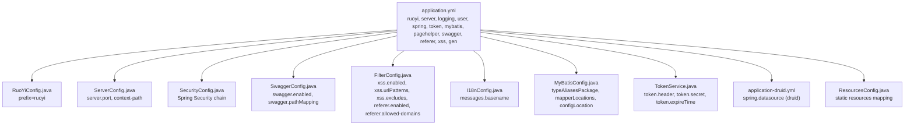
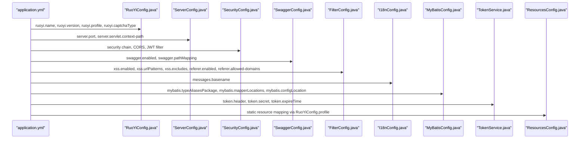
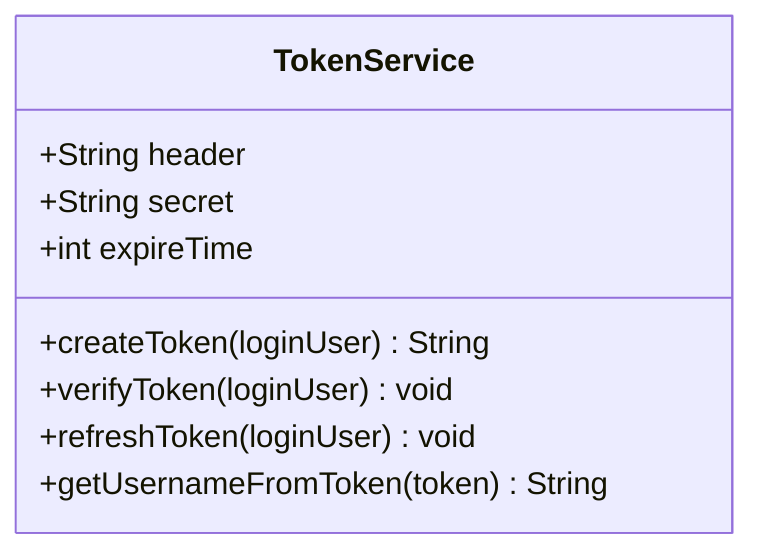
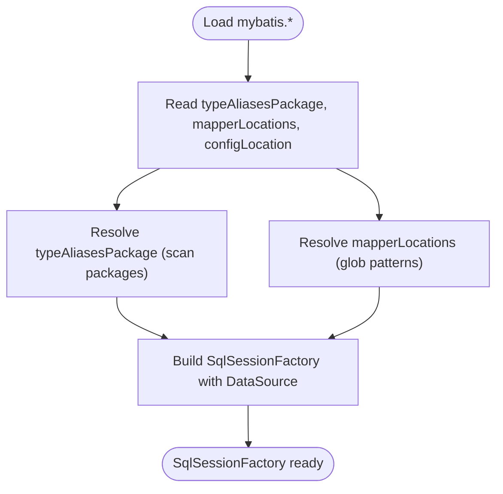
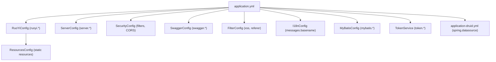

# Application Configuration (application.yml)

<cite>
**Referenced Files in This Document**
- [application.yml](file://src/main/resources/application.yml)
- [RuoYiConfig.java](file://src/main/java/com/ruoyi/framework/config/RuoYiConfig.java)
- [ServerConfig.java](file://src/main/java/com/ruoyi/framework/config/ServerConfig.java)
- [MyBatisConfig.java](file://src/main/java/com/ruoyi/framework/config/MyBatisConfig.java)
- [SecurityConfig.java](file://src/main/java/com/ruoyi/framework/config/SecurityConfig.java)
- [SwaggerConfig.java](file://src/main/java/com/ruoyi/framework/config/SwaggerConfig.java)
- [FilterConfig.java](file://src/main/java/com/ruoyi/framework/config/FilterConfig.java)
- [I18nConfig.java](file://src/main/java/com/ruoyi/framework/config/I18nConfig.java)
- [ThreadPoolConfig.java](file://src/main/java/com/ruoyi/framework/config/ThreadPoolConfig.java)
- [application-druid.yml](file://src/main/resources/application-druid.yml)
- [TokenService.java](file://src/main/java/com/ruoyi/framework/security/service/TokenService.java)
- [messages.properties](file://src/main/resources/i18n/messages.properties)
- [ResourcesConfig.java](file://src/main/java/com/ruoyi/framework/config/ResourcesConfig.java)
</cite>

## Table of Contents
1. [Introduction](#introduction)
2. [Project Structure](#project-structure)
3. [Core Components](#core-components)
4. [Architecture Overview](#architecture-overview)
5. [Detailed Component Analysis](#detailed-component-analysis)
6. [Dependency Analysis](#dependency-analysis)
7. [Performance Considerations](#performance-considerations)
8. [Troubleshooting Guide](#troubleshooting-guide)
9. [Conclusion](#conclusion)
10. [Appendices](#appendices)

## Introduction
This document explains the main application configuration defined in application.yml and how it integrates with the Java configuration classes. It covers server settings, logging, ruoyi project settings, user password security, Spring framework settings, JWT token configuration, MyBatis configuration, PageHelper, Swagger, referer/XSS filters, and code generation settings. Practical examples and production best practices are included for different deployment scenarios.

## Project Structure
The application configuration is primarily defined in application.yml and complemented by Java configuration classes that bind to specific prefixes and enable features such as security, Swagger, filters, internationalization, and MyBatis.

**Diagram sources**
- [application.yml](file://src/main/resources/application.yml#L1-L149)
- [RuoYiConfig.java](file://src/main/java/com/ruoyi/framework/config/RuoYiConfig.java#L1-L111)
- [ServerConfig.java](file://src/main/java/com/ruoyi/framework/config/ServerConfig.java#L1-L33)
- [SecurityConfig.java](file://src/main/java/com/ruoyi/framework/config/SecurityConfig.java#L1-L140)
- [SwaggerConfig.java](file://src/main/java/com/ruoyi/framework/config/SwaggerConfig.java#L1-L125)
- [FilterConfig.java](file://src/main/java/com/ruoyi/framework/config/FilterConfig.java#L1-L81)
- [I18nConfig.java](file://src/main/java/com/ruoyi/framework/config/I18nConfig.java#L1-L44)
- [MyBatisConfig.java](file://src/main/java/com/ruoyi/framework/config/MyBatisConfig.java#L1-L132)
- [TokenService.java](file://src/main/java/com/ruoyi/framework/security/service/TokenService.java#L1-L233)
- [application-druid.yml](file://src/main/resources/application-druid.yml#L1-L61)
- [ResourcesConfig.java](file://src/main/java/com/ruoyi/framework/config/ResourcesConfig.java#L1-L72)

**Section sources**
- [application.yml](file://src/main/resources/application.yml#L1-L149)

## Core Components
- Server settings: port, context-path, Tomcat thread configuration
- Logging configuration: log levels for packages
- Ruoyi project settings: name, version, file profile path, captcha type
- User password security: max retry count and lock time
- Spring framework settings: message resource basenames, active profiles, file upload limits, devtools
- JWT token configuration: header, secret, expireTime
- MyBatis configuration: typeAliasesPackage, mapperLocations, configLocation
- PageHelper: dialect and arguments
- Swagger: enabled flag and pathMapping
- Referer/XSS filters: enabled flags, allowed domains, URL patterns, exclusions
- Code generation: author, package name, table prefix, overwrite policy

**Section sources**
- [application.yml](file://src/main/resources/application.yml#L1-L149)

## Architecture Overview
The YAML configuration defines runtime behavior that is bound to Java configuration classes. The following diagram shows how application.yml settings flow into the application:

**Diagram sources**
- [application.yml](file://src/main/resources/application.yml#L1-L149)
- [RuoYiConfig.java](file://src/main/java/com/ruoyi/framework/config/RuoYiConfig.java#L1-L111)
- [ServerConfig.java](file://src/main/java/com/ruoyi/framework/config/ServerConfig.java#L1-L33)
- [SecurityConfig.java](file://src/main/java/com/ruoyi/framework/config/SecurityConfig.java#L1-L140)
- [SwaggerConfig.java](file://src/main/java/com/ruoyi/framework/config/SwaggerConfig.java#L1-L125)
- [FilterConfig.java](file://src/main/java/com/ruoyi/framework/config/FilterConfig.java#L1-L81)
- [I18nConfig.java](file://src/main/java/com/ruoyi/framework/config/I18nConfig.java#L1-L44)
- [MyBatisConfig.java](file://src/main/java/com/ruoyi/framework/config/MyBatisConfig.java#L1-L132)
- [TokenService.java](file://src/main/java/com/ruoyi/framework/security/service/TokenService.java#L1-L233)
- [ResourcesConfig.java](file://src/main/java/com/ruoyi/framework/config/ResourcesConfig.java#L1-L72)

## Detailed Component Analysis

### Server Settings (port, context-path, Tomcat threads)
- Port: server.port
- Context path: server.servlet.context-path
- Tomcat URI encoding: server.tomcat.uri-encoding
- Accept queue backlog: server.tomcat.accept-count
- Max threads: server.tomcat.threads.max
- Min spare threads: server.tomcat.threads.min-spare

These settings configure the embedded Tomcat container and HTTP endpoint behavior.

**Section sources**
- [application.yml](file://src/main/resources/application.yml#L16-L33)
- [ServerConfig.java](file://src/main/java/com/ruoyi/framework/config/ServerConfig.java#L1-L33)

### Logging Configuration
- Logging levels for packages:
  - com.ruoyi: debug
  - org.springframework: warn

This controls the verbosity of logs for application and framework packages.

**Section sources**
- [application.yml](file://src/main/resources/application.yml#L34-L39)

### Ruoyi Project Settings
- Name: ruoyi.name
- Version: ruoyi.version
- Copyright year: ruoyi.copyrightYear
- Profile path (file uploads): ruoyi.profile
- Address resolution switch: ruoyi.addressEnabled
- Captcha type: ruoyi.captchaType

Java binding is provided by RuoYiConfig with getters/setters and helper methods for upload/download paths.

**Section sources**
- [application.yml](file://src/main/resources/application.yml#L1-L15)
- [RuoYiConfig.java](file://src/main/java/com/ruoyi/framework/config/RuoYiConfig.java#L1-L111)

### User Password Security Settings
- Maximum retry count: user.password.maxRetryCount
- Lock time (minutes): user.password.lockTime

These values influence authentication retry limits and lockout duration. Messages for retries and locks are defined in messages.properties.

**Section sources**
- [application.yml](file://src/main/resources/application.yml#L40-L47)
- [messages.properties](file://src/main/resources/i18n/messages.properties#L1-L39)

### Spring Framework Configuration
- Message resource basenames: spring.messages.basename
- Active profiles: spring.profiles.active
- File upload limits:
  - spring.servlet.multipart.max-file-size
  - spring.servlet.multipart.max-request-size
- Devtools hot reload: spring.devtools.restart.enabled

These settings control internationalization, environment-specific configuration, file upload behavior, and development-time hot reloading.

**Section sources**
- [application.yml](file://src/main/resources/application.yml#L48-L68)
- [I18nConfig.java](file://src/main/java/com/ruoyi/framework/config/I18nConfig.java#L1-L44)

### Token Configuration (JWT)
- Header: token.header
- Secret: token.secret
- Expire time (minutes): token.expireTime

TokenService binds these values and signs/verifies JWT tokens using HS512. It also refreshes tokens automatically when nearing expiration and stores user sessions in Redis.

**Diagram sources**
- [TokenService.java](file://src/main/java/com/ruoyi/framework/security/service/TokenService.java#L1-L233)
- [application.yml](file://src/main/resources/application.yml#L91-L99)

**Section sources**
- [application.yml](file://src/main/resources/application.yml#L91-L99)
- [TokenService.java](file://src/main/java/com/ruoyi/framework/security/service/TokenService.java#L1-L233)

### MyBatis Configuration
- Type aliases package: mybatis.typeAliasesPackage
- Mapper locations: mybatis.mapperLocations
- Config location: mybatis.configLocation

MyBatisConfig reads these properties and dynamically resolves packages and mapper XML files.

**Diagram sources**
- [MyBatisConfig.java](file://src/main/java/com/ruoyi/framework/config/MyBatisConfig.java#L1-L132)
- [application.yml](file://src/main/resources/application.yml#L100-L108)

**Section sources**
- [application.yml](file://src/main/resources/application.yml#L100-L108)
- [MyBatisConfig.java](file://src/main/java/com/ruoyi/framework/config/MyBatisConfig.java#L1-L132)

### PageHelper (Pagination)
- Helper dialect: pagehelper.helperDialect
- Support methods arguments: pagehelper.supportMethodsArguments
- Params: pagehelper.params

These settings configure the pagination plugin for MySQL.

**Section sources**
- [application.yml](file://src/main/resources/application.yml#L109-L114)

### Swagger
- Enabled: swagger.enabled
- Path mapping: swagger.pathMapping

SwaggerConfig binds these values and sets up security schemes to pass Authorization headers.

**Section sources**
- [application.yml](file://src/main/resources/application.yml#L115-L121)
- [SwaggerConfig.java](file://src/main/java/com/ruoyi/framework/config/SwaggerConfig.java#L1-L125)

### Referer and XSS Filters
- Referer:
  - Enabled: referer.enabled
  - Allowed domains: referer.allowed-domains
- XSS:
  - Enabled: xss.enabled
  - Exclusions: xss.excludes
  - URL patterns: xss.urlPatterns

FilterConfig registers filters conditionally based on these properties.

**Section sources**
- [application.yml](file://src/main/resources/application.yml#L122-L137)
- [FilterConfig.java](file://src/main/java/com/ruoyi/framework/config/FilterConfig.java#L1-L81)

### Code Generation Settings
- Author: gen.author
- Package name: gen.packageName
- Auto remove table prefix: gen.autoRemovePre
- Table prefix: gen.tablePrefix
- Allow overwrite: gen.allowOverwrite

Java binding is provided by GenConfig.

**Section sources**
- [application.yml](file://src/main/resources/application.yml#L138-L149)
- [GenConfig.java](file://src/main/java/com/ruoyi/framework/config/GenConfig.java#L1-L80)

### Additional Spring Settings (Druid)
- Data source type: spring.datasource.type
- Driver class: spring.datasource.driverClassName
- Master/slave URLs, credentials, pool sizes, timeouts, and Druid console settings are defined in application-druid.yml.

These settings integrate with Druid for connection pooling and monitoring.

**Section sources**
- [application.yml](file://src/main/resources/application.yml#L69-L90)
- [application-druid.yml](file://src/main/resources/application-druid.yml#L1-L61)

## Dependency Analysis
The YAML configuration interacts with Java configuration classes through property binding. The following diagram highlights key dependencies:

**Diagram sources**
- [application.yml](file://src/main/resources/application.yml#L1-L149)
- [RuoYiConfig.java](file://src/main/java/com/ruoyi/framework/config/RuoYiConfig.java#L1-L111)
- [ServerConfig.java](file://src/main/java/com/ruoyi/framework/config/ServerConfig.java#L1-L33)
- [SecurityConfig.java](file://src/main/java/com/ruoyi/framework/config/SecurityConfig.java#L1-L140)
- [SwaggerConfig.java](file://src/main/java/com/ruoyi/framework/config/SwaggerConfig.java#L1-L125)
- [FilterConfig.java](file://src/main/java/com/ruoyi/framework/config/FilterConfig.java#L1-L81)
- [I18nConfig.java](file://src/main/java/com/ruoyi/framework/config/I18nConfig.java#L1-L44)
- [MyBatisConfig.java](file://src/main/java/com/ruoyi/framework/config/MyBatisConfig.java#L1-L132)
- [TokenService.java](file://src/main/java/com/ruoyi/framework/security/service/TokenService.java#L1-L233)
- [application-druid.yml](file://src/main/resources/application-druid.yml#L1-L61)
- [ResourcesConfig.java](file://src/main/java/com/ruoyi/framework/config/ResourcesConfig.java#L1-L72)

**Section sources**
- [application.yml](file://src/main/resources/application.yml#L1-L149)
- [ResourcesConfig.java](file://src/main/java/com/ruoyi/framework/config/ResourcesConfig.java#L1-L72)

## Performance Considerations
- Tomcat threads: adjust server.tomcat.threads.max and min-spare according to expected concurrency and CPU cores.
- Accept queue: increase server.tomcat.accept-count for bursty traffic.
- Upload limits: tune spring.servlet.multipart.max-file-size and max-request-size to balance memory usage and throughput.
- MyBatis: ensure typeAliasesPackage and mapperLocations are scoped to reduce scanning overhead.
- PageHelper: use helperDialect appropriate to your database and enable supportMethodsArguments only when needed.
- Devtools: disable spring.devtools.restart.enabled in production to avoid unnecessary overhead.
- Redis: configure spring.redis pool sizes and timeouts to match workload patterns.

[No sources needed since this section provides general guidance]

## Troubleshooting Guide
- Authentication failures and lockouts:
  - Verify user.password.maxRetryCount and user.password.lockTime.
  - Check messages.properties for localized error messages.
- JWT token issues:
  - Confirm token.header, token.secret, and token.expireTime match client expectations.
  - Ensure Redis connectivity and keyspace alignment.
- Swagger not accessible:
  - Check swagger.enabled and swagger.pathMapping.
- File upload errors:
  - Review spring.servlet.multipart limits and disk capacity.
- CORS/filter conflicts:
  - Validate FilterConfig registrations and order; ensure referer.allowed-domains and xss.urlPatterns are correct.

**Section sources**
- [application.yml](file://src/main/resources/application.yml#L40-L68)
- [TokenService.java](file://src/main/java/com/ruoyi/framework/security/service/TokenService.java#L1-L233)
- [SwaggerConfig.java](file://src/main/java/com/ruoyi/framework/config/SwaggerConfig.java#L1-L125)
- [FilterConfig.java](file://src/main/java/com/ruoyi/framework/config/FilterConfig.java#L1-L81)
- [messages.properties](file://src/main/resources/i18n/messages.properties#L1-L39)

## Conclusion
The application.yml centralizes runtime configuration for server, logging, security, MyBatis, pagination, Swagger, filters, and code generation. Java configuration classes bind these settings and wire them into Spring components. Proper tuning of these values ensures predictable performance, robust security, and maintainable development workflows.

[No sources needed since this section summarizes without analyzing specific files]

## Appendices

### Practical Deployment Scenarios and Best Practices
- Development environment
  - Enable spring.devtools.restart.enabled
  - Keep logging.level.org.springframework at warn or higher
  - Use smaller thread pools and modest accept-count
  - Disable referer.enabled and xss.enabled unless testing
- Staging environment
  - Reduce spring.devtools.restart.enabled
  - Set logging.level.com.ruoyi to debug for targeted troubleshooting
  - Tune Tomcat threads and accept-count based on load tests
  - Enable xss.enabled and configure xss.urlPatterns and xss.excludes
- Production environment
  - Disable spring.devtools.restart.enabled
  - Set logging.level.com.ruoyi to info or higher
  - Configure robust Tomcat thread settings and accept-count
  - Enable referer.enabled with strict allowed-domains
  - Enable xss.enabled with minimal urlPatterns and carefully curated excludes
  - Secure token.secret and rotate periodically
  - Set token.expireTime to a shorter interval for stricter sessions
  - Optimize MyBatis typeAliasesPackage and mapperLocations to reduce scanning
  - Configure Druid pool sizes and timeouts conservatively
  - Ensure static resource mapping via RuoYiConfig.profile points to a mounted volume

[No sources needed since this section provides general guidance]