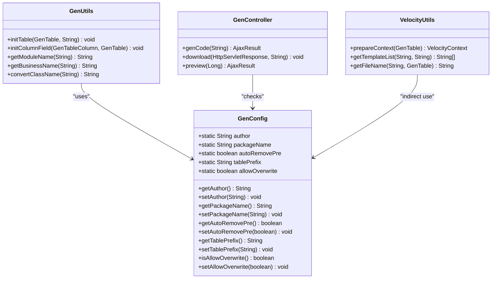
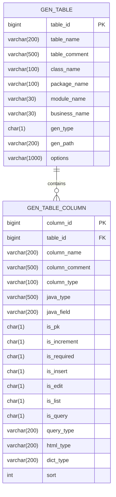
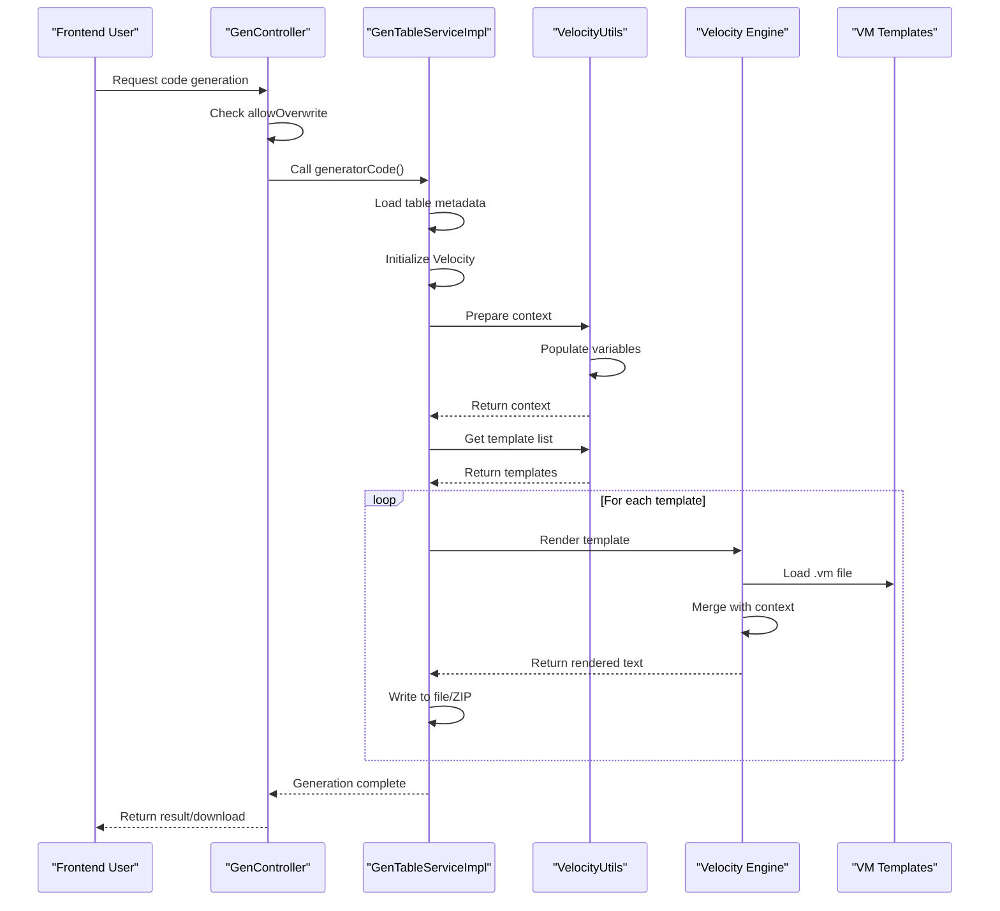

# Code Generation Configuration

<cite>
**Referenced Files in This Document**   
- [GenConfig.java](file://src/main/java/com/ruoyi/framework/config/GenConfig.java)
- [application.yml](file://src/main/resources/application.yml)
- [GenController.java](file://src/main/java/com/ruoyi/project/tool/gen/controller/GenController.java)
- [VelocityUtils.java](file://src/main/java/com/ruoyi/project/tool/gen/util/VelocityUtils.java)
- [GenTableServiceImpl.java](file://src/main/java/com/ruoyi/project/tool/gen/service/GenTableServiceImpl.java)
- [GenUtils.java](file://src/main/java/com/ruoyi/project/tool/gen/util/GenUtils.java)
- [GenTable.java](file://src/main/java/com/ruoyi/project/tool/gen/domain/GenTable.java)
- [GenConstants.java](file://src/main/java/com/ruoyi/common/constant/GenConstants.java)
- [ry_20250522.sql](file://sql/ry_20250522.sql)
</cite>

## Table of Contents
1. [Introduction](#introduction)
2. [Core Configuration Settings](#core-configuration-settings)
3. [Configuration Mapping and Injection](#configuration-mapping-and-injection)
4. [Database Schema for Code Generation](#database-schema-for-code-generation)
5. [Code Generation Process Flow](#code-generation-process-flow)
6. [Practical Configuration Examples](#practical-configuration-examples)
7. [Best Practices for Team Collaboration](#best-practices-for-team-collaboration)
8. [Conclusion](#conclusion)

## Introduction

The RuoYi-Vue code generation system provides a powerful mechanism for automatically generating backend and frontend code from database tables. This documentation details the configuration settings that control the code generation process, including global application settings, database schema fields, and their integration with the generation engine. The system uses Spring Boot's `@ConfigurationProperties` to bind configuration values from `application.yml` to the `GenConfig` component, which are then utilized throughout the code generation workflow in `GenController` and `VelocityUtils`. Understanding these configurations is essential for customizing generated code to meet project requirements and ensuring consistency across development teams.

## Core Configuration Settings

The code generation behavior in RuoYi-Vue is controlled by several key settings defined in the `application.yml` file under the `gen` prefix. These settings determine fundamental aspects of the generated code such as authorship, package structure, table name handling, and file overwrite policies.

### Author Configuration
The `author` setting specifies the developer name that will be included in the generated code files. This value appears in class-level comments and helps identify the creator of the generated components. The default value is "ruoyi", but it should be updated to reflect the actual development team or organization.

### Package Name Configuration
The `packageName` setting determines the root Java package where generated code will be placed. This is a critical configuration as it defines the target module structure for the generated classes. The default value `com.ruoyi.project.system` indicates that code will be generated under the system module, but this should be modified to match the specific module being developed (e.g., `com.ruoyi.project.monitor` for monitoring features).

### Table Prefix Handling
The code generator provides two related settings for handling table prefixes: `autoRemovePre` and `tablePrefix`. The `autoRemovePre` boolean flag controls whether table prefixes should be automatically removed when generating class names. When set to `true`, the generator will strip the prefix defined in `tablePrefix` from table names before converting them to camel-case class names. The `tablePrefix` setting specifies which prefixes to remove, with `sys_` being the default value. This allows database tables like `sys_user` to generate classes named `User` instead of `SysUser`.

### File Overwrite Policy
The `allowOverwrite` setting controls whether generated files can overwrite existing files when using custom output paths. This safety mechanism prevents accidental loss of code modifications. When set to `false` (the default), the system will block generation attempts that would overwrite existing files, requiring manual intervention. Setting this to `true` allows automatic overwriting, which can be useful during initial development but should be used cautiously in production environments.

**Section sources**
- [application.yml](file://src/main/resources/application.yml#L138-L149)
- [GenConfig.java](file://src/main/java/com/ruoyi/framework/config/GenConfig.java#L16-L28)

## Configuration Mapping and Injection

The configuration settings defined in `application.yml` are mapped to the application code through Spring Boot's type-safe configuration properties mechanism using the `@ConfigurationProperties` annotation. This creates a seamless connection between the external configuration file and the internal code generation components.

### GenConfig Component
The `GenConfig` class serves as the configuration holder for code generation settings. Annotated with `@Component` and `@ConfigurationProperties(prefix = "gen")`, this class automatically binds YAML properties with the "gen" prefix to its static fields. Each configuration option (author, packageName, autoRemovePre, tablePrefix, allowOverwrite) has corresponding getter and setter methods that facilitate access throughout the application. The use of static fields ensures that configuration values are globally accessible without requiring dependency injection in every component that needs them.

### Property Binding Mechanism
When the application starts, Spring Boot's configuration property binding mechanism reads the `gen` section of `application.yml` and invokes the setter methods of `GenConfig` to populate the configuration values. For example, the `gen.author: ruoyi` property in YAML triggers `setAuthor("ruoyi")`, which sets the static `author` field. This binding occurs automatically due to the `@ConfigurationProperties` annotation, which tells Spring to map configuration properties to the bean's properties based on name matching.

### Runtime Configuration Access
Components involved in code generation access these configuration values through static getter methods. For instance, `GenUtils` uses `GenConfig.getPackageName()` and `GenConfig.getAuthor()` when initializing table metadata, while `GenController` checks `GenConfig.isAllowOverwrite()` before permitting code generation to custom paths. This design pattern provides a centralized configuration point that ensures consistency across the code generation process.



**Diagram sources **
- [GenConfig.java](file://src/main/java/com/ruoyi/framework/config/GenConfig.java)
- [GenUtils.java](file://src/main/java/com/ruoyi/project/tool/gen/util/GenUtils.java)
- [GenController.java](file://src/main/java/com/ruoyi/project/tool/gen/controller/GenController.java)
- [VelocityUtils.java](file://src/main/java/com/ruoyi/project/tool/gen/util/VelocityUtils.java)

**Section sources**
- [GenConfig.java](file://src/main/java/com/ruoyi/framework/config/GenConfig.java#L11-L79)

## Database Schema for Code Generation

The code generation system in RuoYi-Vue stores table-specific generation preferences in the database, allowing for per-table customization that complements the global configuration settings. These preferences are stored in the `gen_table` and `gen_table_column` tables, with specific fields controlling generation behavior.

### gen_type Field
The `gen_type` field in the `gen_table` table determines how generated code is delivered. It accepts two values: '0' for generating code as a ZIP compression package, and '1' for generating code to a custom path on the server. This setting corresponds directly to the `allowOverwrite` configuration, as custom path generation ('1') requires `allowOverwrite` to be enabled. The field has a default value of '0', prioritizing the safer ZIP download approach.

### gen_path Field
The `gen_path` field specifies the custom output path for generated code when `gen_type` is set to '1'. If left empty or set to '/', the default project path is used. This field enables teams to direct generated code to specific directories, which is particularly useful for modular applications or when integrating with build systems. The actual path resolution occurs in `GenTableServiceImpl.getGenPath()`, which combines the configured path with the velocity template output structure.

### Configuration Hierarchy
The system implements a hierarchical configuration model where database-stored settings override global configuration. For example, while `allowOverwrite` in `application.yml` provides a system-wide safety switch, individual tables can have their `gen_type` set to '1' to enable custom path generation when the global setting permits it. This layered approach provides both safety and flexibility, allowing teams to control generation behavior at both system and table levels.



**Diagram sources **
- [ry_20250522.sql](file://sql/ry_20250522.sql#L649-L704)
- [GenTable.java](file://src/main/java/com/ruoyi/project/tool/gen/domain/GenTable.java)

**Section sources**
- [ry_20250522.sql](file://sql/ry_20250522.sql#L649-L704)
- [GenTable.java](file://src/main/java/com/ruoyi/project/tool/gen/domain/GenTable.java#L1-L200)

## Code Generation Process Flow

The code generation process in RuoYi-Vue follows a well-defined workflow that transforms database table information into complete frontend and backend code components. This process is orchestrated through the interaction of `GenController`, `GenTableServiceImpl`, `VelocityUtils`, and the Velocity template engine.

### Request Handling in GenController
The `GenController` class exposes REST endpoints that handle code generation requests. When a user requests code generation via `/tool/gen/genCode/{tableName}`, the controller first checks `GenConfig.isAllowOverwrite()` to verify that file overwriting is permitted. If the check passes, it delegates to `GenTableService.generatorCode(tableName)` to initiate the generation process. For ZIP downloads, the `download` endpoint packages the generated code and streams it to the client.

### Service Layer Processing
The `GenTableServiceImpl` coordinates the generation process by first retrieving table metadata from the database, including column information and generation options. It then initializes the Velocity template engine and creates a `VelocityContext` containing all necessary variables for template rendering. The service determines which templates to process based on the table's `tplCategory` (CRUD, tree, or sub-table) and `tplWebType` (Element UI or Element Plus).

### Template Rendering with Velocity
`VelocityUtils` plays a crucial role in preparing the template context and managing the rendering process. The `prepareContext` method populates the Velocity context with variables such as package names, class names, author information, and column metadata. The `getTemplateList` method selects the appropriate templates based on the generation category, while `getFileName` determines the output file path for each generated component. The actual rendering occurs by merging templates with the context and writing the output to files or ZIP entries.



**Diagram sources **
- [GenController.java](file://src/main/java/com/ruoyi/project/tool/gen/controller/GenController.java#L214-L223)
- [GenTableServiceImpl.java](file://src/main/java/com/ruoyi/project/tool/gen/service/GenTableServiceImpl.java#L253-L287)
- [VelocityUtils.java](file://src/main/java/com/ruoyi/project/tool/gen/util/VelocityUtils.java#L37-L160)

**Section sources**
- [GenController.java](file://src/main/java/com/ruoyi/project/tool/gen/controller/GenController.java#L214-L223)
- [GenTableServiceImpl.java](file://src/main/java/com/ruoyi/project/tool/gen/service/GenTableServiceImpl.java#L253-L287)
- [VelocityUtils.java](file://src/main/java/com/ruoyi/project/tool/gen/util/VelocityUtils.java#L37-L160)

## Practical Configuration Examples

The code generation system in RuoYi-Vue can be configured for various scenarios, from standard module development to custom output paths and team-specific settings. These practical examples demonstrate how to configure the system for different use cases.

### Configuring for Different Modules
To generate code for different modules, modify the `packageName` in `application.yml` to point to the desired module. For example, to generate monitoring module code:
```yaml
gen:
  packageName: com.ruoyi.project.monitor
  moduleName: monitor
```
This configuration will generate code in the monitor module with appropriate package imports and directory structure. The `moduleName` should match the module directory name for proper path resolution.

### Custom Output Paths
To enable generation to custom directories, configure both the global setting and table-specific settings:
```yaml
gen:
  allowOverwrite: true
  gen_path: /custom/output/path
```
In the database, set the table's `gen_type` to '1' and specify the desired `gen_path`. This allows generated code to be written directly to the specified directory, which is useful for automated build processes or when integrating with external tools.

### Table Prefix Strategies
For databases with consistent table prefixes, configure automatic prefix removal:
```yaml
gen:
  autoRemovePre: true
  tablePrefix: sys_,t_,tbl_
```
This configuration will remove any of the specified prefixes from table names when generating class names. For example, `sys_user`, `t_log`, and `tbl_config` would generate classes named `User`, `Log`, and `Config` respectively.

**Section sources**
- [application.yml](file://src/main/resources/application.yml#L138-L149)
- [GenTable.java](file://src/main/java/com/ruoyi/project/tool/gen/domain/GenTable.java#L659-L666)
- [GenUtils.java](file://src/main/java/com/ruoyi/project/tool/gen/util/GenUtils.java#L177-L187)

## Best Practices for Team Collaboration

Effective use of the code generation feature in team environments requires adherence to specific best practices that ensure consistency, prevent conflicts, and maintain code quality across the development lifecycle.

### Version Control Strategies
When using code generation in a team setting, it's essential to establish clear guidelines for generated code in version control. Generated code should be committed to the repository to ensure all team members have consistent codebases, but developers should avoid manually modifying generated files. Instead, changes should be made through the code generation configuration and templates, then regenerated. This approach prevents merge conflicts and ensures that all team members can reproduce the same code from the same configuration.

### Configuration Management
Maintain a standardized `application.yml` configuration across the team by including it in version control. This ensures that all developers generate code with the same author, package structure, and naming conventions. For team projects, set the `author` field to reflect the team or organization rather than individual developers. Use configuration profiles or environment-specific configuration files to manage differences between development, testing, and production environments.

### Generation Workflow
Establish a consistent workflow for code generation that all team members follow. This should include:
1. Database schema changes are made and committed first
2. Code generation is performed using approved configurations
3. Generated code is reviewed before committing
4. Manual modifications are made only to non-generated files or designated extension points
5. Regular regeneration is performed after configuration updates

This workflow ensures that the generated code remains synchronized with the database schema and that configuration changes are properly propagated.

**Section sources**
- [application.yml](file://src/main/resources/application.yml#L138-L149)
- [GenConfig.java](file://src/main/java/com/ruoyi/framework/config/GenConfig.java)
- [GenTableServiceImpl.java](file://src/main/java/com/ruoyi/project/tool/gen/service/GenTableServiceImpl.java)

## Conclusion

The code generation configuration in RuoYi-Vue provides a comprehensive system for automating the creation of frontend and backend components from database tables. By understanding the relationship between the `gen` settings in `application.yml`, the `GenConfig` component, and the database-stored generation preferences, developers can effectively customize the code generation process to meet their specific requirements. The system's design, which combines global configuration with per-table settings, offers both consistency and flexibility. When used with proper team practices and version control strategies, this code generation system can significantly accelerate development while maintaining code quality and consistency across the application.