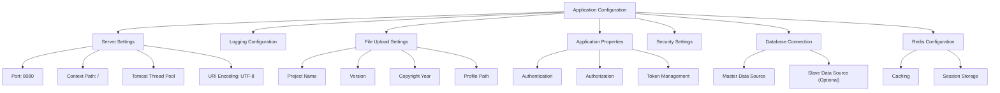
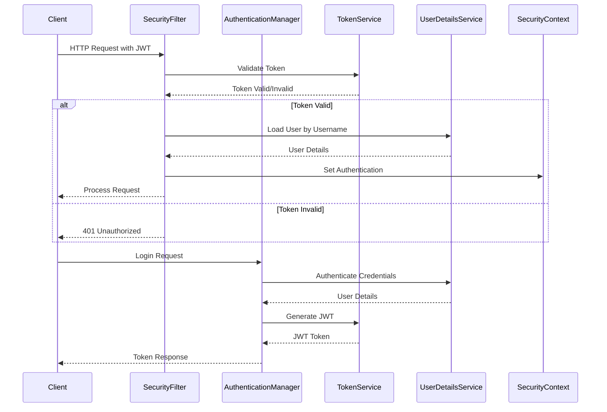
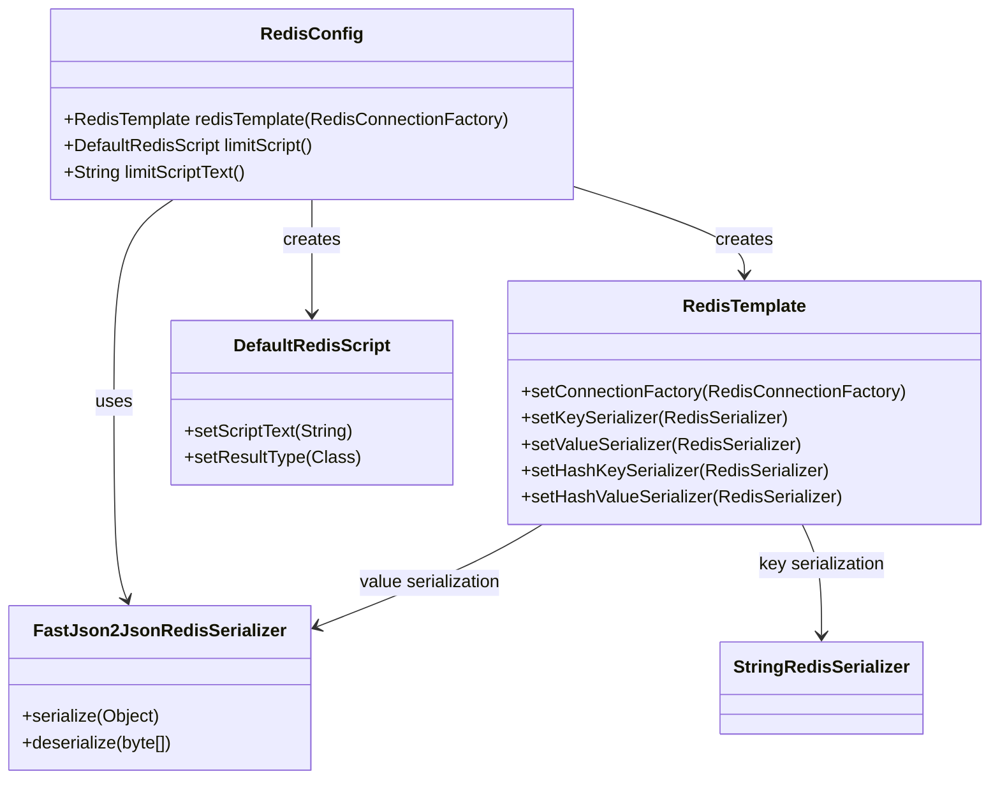
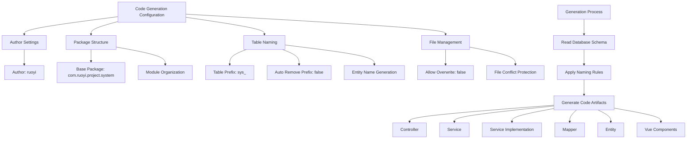
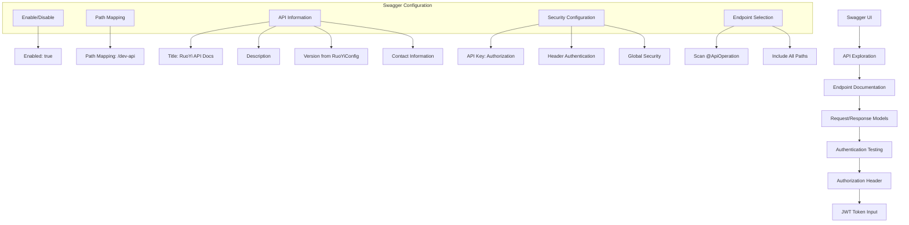
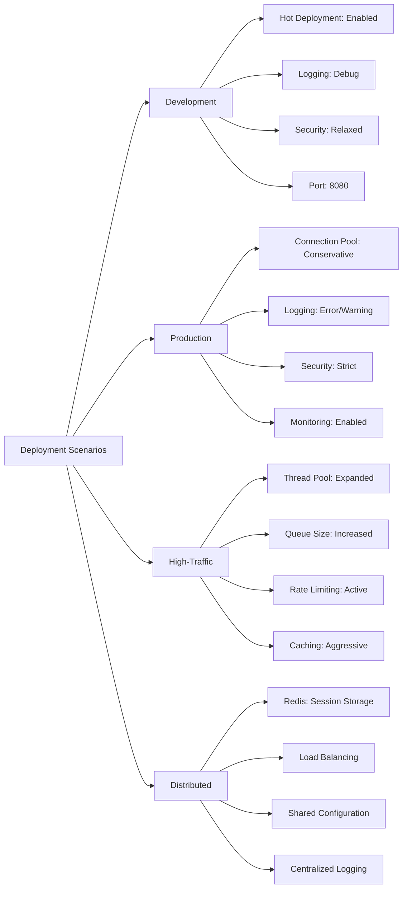
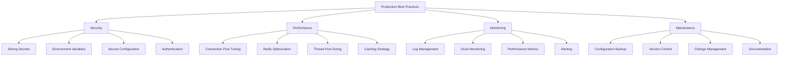

# Configuration Guide

<cite>
**Referenced Files in This Document**   
- [application.yml](file://src/main/resources/application.yml)
- [application-druid.yml](file://src/main/resources/application-druid.yml)
- [RuoYiConfig.java](file://src/main/java/com/ruoyi/framework/config/RuoYiConfig.java)
- [SecurityConfig.java](file://src/main/java/com/ruoyi/framework/config/SecurityConfig.java)
- [DruidConfig.java](file://src/main/java/com/ruoyi/framework/config/DruidConfig.java)
- [DruidProperties.java](file://src/main/java/com/ruoyi/framework/config/properties/DruidProperties.java)
- [RedisConfig.java](file://src/main/java/com/ruoyi/framework/config/RedisConfig.java)
- [GenConfig.java](file://src/main/java/com/ruoyi/framework/config/GenConfig.java)
- [SwaggerConfig.java](file://src/main/java/com/ruoyi/framework/config/SwaggerConfig.java)
- [ServerConfig.java](file://src/main/java/com/ruoyi/framework/config/ServerConfig.java)
- [logback.xml](file://src/main/resources/logback.xml)
</cite>

## Table of Contents
1. [Application Configuration](#application-configuration)
2. [Security Configuration](#security-configuration)
3. [Database Configuration](#database-configuration)
4. [Redis Configuration](#redis-configuration)
5. [Code Generation Configuration](#code-generation-configuration)
6. [Swagger Configuration](#swagger-configuration)
7. [Common Configuration Scenarios](#common-configuration-scenarios)
8. [Production Best Practices](#production-best-practices)

## Application Configuration

The main application configuration is managed through the `application.yml` file, which contains essential settings for server operation, logging, and application behavior. The configuration is organized under various top-level properties that define different aspects of the application.

The server configuration section defines the HTTP port (default: 8080), context path, and Tomcat-specific settings including URI encoding, connection acceptance queue, and thread pool configuration with a maximum of 800 threads and minimum of 100 idle threads. These settings ensure the application can handle high concurrent loads while maintaining performance.

File upload limits are configured with a maximum file size of 10MB per file and a total request size limit of 20MB, preventing excessive resource consumption from large file uploads. The application also supports hot deployment through Spring DevTools, which is enabled by default for development convenience.

Application-specific settings include the project name, version, copyright year, and file storage profile path. The profile path determines where uploaded files are stored on the server, with separate directories for avatar images, imported files, downloads, and general uploads. IP address resolution can be enabled or disabled based on deployment requirements.

**Diagram sources**
- [application.yml](file://src/main/resources/application.yml#L17-L33)
- [RuoYiConfig.java](file://src/main/java/com/ruoyi/framework/config/RuoYiConfig.java#L15-L111)

**Section sources**
- [application.yml](file://src/main/resources/application.yml#L1-L68)
- [RuoYiConfig.java](file://src/main/java/com/ruoyi/framework/config/RuoYiConfig.java#L1-L111)
- [ServerConfig.java](file://src/main/java/com/ruoyi/framework/config/ServerConfig.java#L1-L33)

## Security Configuration

The security configuration in RuoYi-Vue is implemented using Spring Security with JWT-based authentication, providing a stateless security model that is well-suited for modern web applications. The configuration is primarily managed through the `SecurityConfig` class, which defines authentication mechanisms, authorization rules, and security filters.

Authentication is handled through a custom `JwtAuthenticationTokenFilter` that validates JWT tokens on each request, extracting user information and establishing the security context. The system uses BCrypt password encoding for secure password storage, with configurable password retry limits and lockout policies to prevent brute force attacks.

Authorization is configured with method-level security using Spring Security's pre-post annotations, allowing fine-grained control over access to specific endpoints. The configuration permits anonymous access to essential endpoints such as login, registration, and captcha generation, while requiring authentication for all other requests. Additional endpoints can be marked for anonymous access using the `@Anonymous` annotation.

The token configuration in `application.yml` defines key security parameters including the authorization header name (Authorization), secret key for token signing, and token expiration time (default: 30 minutes). These settings can be adjusted based on security requirements and user experience considerations.

**Diagram sources**
- [SecurityConfig.java](file://src/main/java/com/ruoyi/framework/config/SecurityConfig.java#L1-L140)
- [application.yml](file://src/main/resources/application.yml#L91-L98)

**Section sources**
- [SecurityConfig.java](file://src/main/java/com/ruoyi/framework/config/SecurityConfig.java#L1-L140)
- [application.yml](file://src/main/resources/application.yml#L91-L98)
- [PermitAllUrlProperties.java](file://src/main/java/com/ruoyi/framework/config/properties/PermitAllUrlProperties.java#L1-L74)

## Database Configuration

The database configuration in RuoYi-Vue is managed through the `application-druid.yml` file, which provides comprehensive settings for database connectivity using Alibaba's Druid connection pool. The configuration supports multiple data sources with a master-slave architecture, allowing for read-write separation and improved database performance.

The master data source is configured with essential connection details including the JDBC URL, username, and password. The connection pool settings are optimized for production use with an initial connection count of 5, minimum idle connections of 10, and maximum active connections of 20. These settings balance resource utilization with the ability to handle concurrent database operations.

Connection validation is configured with a test query (`SELECT 1 FROM DUAL`) and validation while idle, ensuring that connections in the pool remain valid. The configuration also includes eviction settings that remove stale connections from the pool after 5 minutes of idle time, with a maximum connection lifetime of 15 minutes to prevent connection leaks.

Druid's monitoring capabilities are enabled through the StatViewServlet and WebStatFilter, providing a web-based console for monitoring database performance, SQL execution statistics, and connection pool status. The console is protected with authentication credentials and can be accessed at the `/druid/*` path.

```mermaid
graph TB
subgraph "Druid Configuration"
A["Connection Pool Settings"]
B["Master Data Source"]
C["Slave Data Source"]
D["Connection Validation"]
E["Monitoring & Statistics"]
end
A --> A1["Initial Size: 5"]
A --> A2["Min Idle: 10"]
A --> A3["Max Active: 20"]
A --> A4["Max Wait: 60s"]
B --> B1["JDBC URL"]
B --> B2["Username"]
B --> B3["Password"]
C --> C1["Enabled: false"]
C --> C2["Optional Read Replicas"]
D --> D1["Validation Query"]
D --> D2["Test While Idle"]
D --> D3["Connect Timeout"]
D --> D4["Socket Timeout"]
E --> E1["StatViewServlet"]
E --> E2["WebStatFilter"]
E --> E3["Slow SQL Monitoring"]
E --> E4["Authentication Required"]
```

**Diagram sources**
- [application-druid.yml](file://src/main/resources/application-druid.yml#L1-L61)
- [DruidConfig.java](file://src/main/java/com/ruoyi/framework/config/DruidConfig.java#L1-L127)
- [DruidProperties.java](file://src/main/java/com/ruoyi/framework/config/properties/DruidProperties.java#L1-L90)

**Section sources**
- [application-druid.yml](file://src/main/resources/application-druid.yml#L1-L61)
- [DruidConfig.java](file://src/main/java/com/ruoyi/framework/config/DruidConfig.java#L1-L127)
- [DruidProperties.java](file://src/main/java/com/ruoyi/framework/config/properties/DruidProperties.java#L1-L90)

## Redis Configuration

Redis is configured as the primary caching and session storage mechanism in RuoYi-Vue, providing high-performance data access and distributed session management. The Redis configuration is defined in the `application.yml` file under the `spring.redis` section, with connection details including host, port, database index, password, and timeout settings.

The Redis configuration includes connection pool settings with a maximum of 8 active connections and 8 idle connections, optimized for typical application workloads. The timeout is set to 10 seconds to prevent hanging operations, with appropriate connection and socket timeouts configured at the network level.

The `RedisConfig` class provides the necessary configuration for Redis template setup, using a custom `FastJson2JsonRedisSerializer` for efficient JSON serialization of cached objects. The key serializer uses `StringRedisSerializer` to ensure consistent key formatting, while the value serializer handles complex objects through JSON serialization.

A rate limiting script is also configured in Redis, implementing a token bucket algorithm for controlling API request rates. This helps prevent abuse and ensures fair resource allocation across users. The script is loaded into Redis at application startup and can be invoked to check and increment request counters.

**Diagram sources**
- [application.yml](file://src/main/resources/application.yml#L69-L89)
- [RedisConfig.java](file://src/main/java/com/ruoyi/framework/config/RedisConfig.java#L1-L70)

**Section sources**
- [application.yml](file://src/main/resources/application.yml#L69-L89)
- [RedisConfig.java](file://src/main/java/com/ruoyi/framework/config/RedisConfig.java#L1-L70)

## Code Generation Configuration

The code generation feature in RuoYi-Vue is configured through the `gen` section in `application.yml`, providing customizable settings for the automatic generation of CRUD code for database tables. This configuration enables rapid development by generating consistent, high-quality code that follows the application's architectural patterns.

The configuration includes essential parameters such as the author name (default: ruoyi), the base package name for generated code (default: com.ruoyi.project.system), and table prefix handling. The table prefix setting (default: sys_) allows the generator to automatically strip common prefixes from table names when creating entity class names.

A key feature is the ability to automatically remove table prefixes from generated class names, which can be enabled or disabled based on project conventions. When enabled, a table named `sys_user` would generate a `User` entity class rather than `SysUser`. This promotes cleaner, more intuitive class names while maintaining the organizational benefits of database table prefixes.

The configuration also includes a safety setting to prevent file overwriting, which is disabled by default to protect existing customizations. This ensures that generated code will not accidentally overwrite manually modified files, requiring explicit permission to overwrite when regeneration is needed.

**Diagram sources**
- [application.yml](file://src/main/resources/application.yml#L139-L149)
- [GenConfig.java](file://src/main/java/com/ruoyi/framework/config/GenConfig.java#L1-L80)

**Section sources**
- [application.yml](file://src/main/resources/application.yml#L139-L149)
- [GenConfig.java](file://src/main/java/com/ruoyi/framework/config/GenConfig.java#L1-L80)

## Swagger Configuration

Swagger is integrated into RuoYi-Vue for comprehensive API documentation and testing capabilities. The configuration is managed through the `swagger` section in `application.yml` and the `SwaggerConfig` class, providing a user-friendly interface for exploring and interacting with the application's RESTful APIs.

The basic configuration includes an enabled flag to control whether Swagger documentation is available, and a path mapping that determines the base URL for API access (default: /dev-api). This allows the API to be served under a specific path, separating it from the main application routes and enabling reverse proxy configurations.

The `SwaggerConfig` class sets up the Docket bean that defines the API documentation details, including title, description, version, and contact information. The API information is dynamically populated using values from the `RuoYiConfig` class, ensuring consistency between the application metadata and API documentation.

Security is integrated with Swagger through the configuration of API keys, allowing users to authenticate with the API directly from the Swagger UI. The Authorization header is configured as the authentication mechanism, matching the JWT-based authentication used by the application. This enables users to test authenticated endpoints by providing their JWT token in the Swagger interface.

**Diagram sources**
- [application.yml](file://src/main/resources/application.yml#L116-L121)
- [SwaggerConfig.java](file://src/main/java/com/ruoyi/framework/config/SwaggerConfig.java#L1-L125)

**Section sources**
- [application.yml](file://src/main/resources/application.yml#L116-L121)
- [SwaggerConfig.java](file://src/main/java/com/ruoyi/framework/config/SwaggerConfig.java#L1-L125)

## Common Configuration Scenarios

Several common configuration scenarios are supported by RuoYi-Vue to accommodate different deployment environments and requirements. These scenarios demonstrate how various configuration options can be combined to achieve specific operational goals.

For development environments, the configuration typically includes hot deployment enabled, detailed logging at the debug level, and relaxed security settings to facilitate rapid development and testing. The server port may be set to a non-standard value to avoid conflicts with other development services.

Production deployments require more stringent configuration with optimized connection pooling, enhanced security settings, and comprehensive logging. The database connection pool is configured with conservative settings to prevent resource exhaustion, while Redis is configured with appropriate timeouts and connection limits to ensure stability under load.

High-traffic scenarios may require adjustments to the Tomcat thread pool configuration, increasing the maximum thread count and connection queue size to handle concurrent requests. The file upload limits may also be adjusted based on the expected usage patterns, with appropriate monitoring in place to detect potential abuse.

Distributed deployments leverage Redis for session storage and caching, with configuration settings that ensure session consistency across multiple application instances. The rate limiting configuration helps prevent API abuse in public-facing deployments, while the code generation settings are typically locked down to prevent accidental overwrites of production code.

**Section sources**
- [application.yml](file://src/main/resources/application.yml#L1-L149)
- [application-druid.yml](file://src/main/resources/application-druid.yml#L1-L61)
- [logback.xml](file://src/main/resources/logback.xml#L1-L93)

## Production Best Practices

When deploying RuoYi-Vue to production environments, several best practices should be followed to ensure security, performance, and maintainability. These practices build upon the configuration options provided by the framework to create a robust and reliable production system.

Security should be prioritized by using strong, randomly generated secrets for JWT tokens and database passwords. The default credentials in the configuration files should be replaced with environment-specific values, preferably loaded from secure configuration management systems or environment variables rather than stored in plain text.

Performance optimization involves tuning the database connection pool settings based on actual usage patterns and database capacity. The Redis configuration should be monitored and adjusted to prevent memory exhaustion, with appropriate eviction policies in place. The Tomcat thread pool should be sized according to the expected concurrent user load and available server resources.

Monitoring and logging are critical for production systems. The logback configuration should be reviewed to ensure appropriate log levels and retention policies. The Druid monitoring console provides valuable insights into database performance and should be secured with strong authentication. Regular log analysis can help identify performance bottlenecks and security issues.

Regular backups of configuration files should be maintained, and configuration changes should be managed through version control. This ensures that the production configuration can be reproduced and rolled back if necessary. Environment-specific configuration differences should be clearly documented and managed systematically.

**Section sources**
- [application.yml](file://src/main/resources/application.yml#L1-L149)
- [application-druid.yml](file://src/main/resources/application-druid.yml#L1-L61)
- [logback.xml](file://src/main/resources/logback.xml#L1-L93)