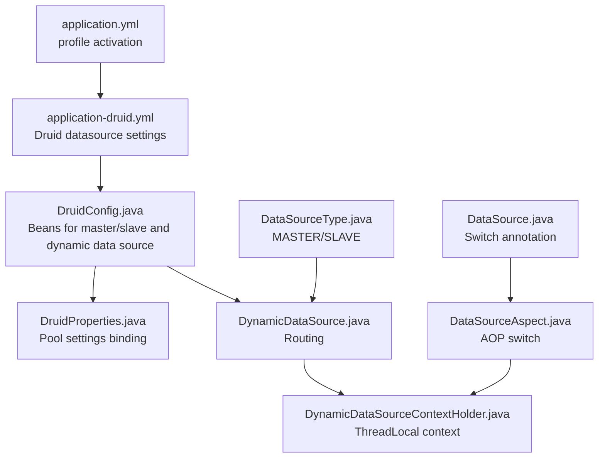
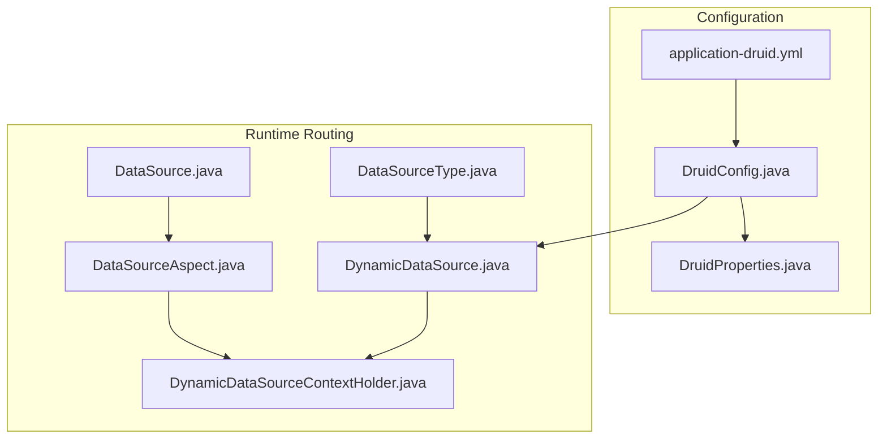
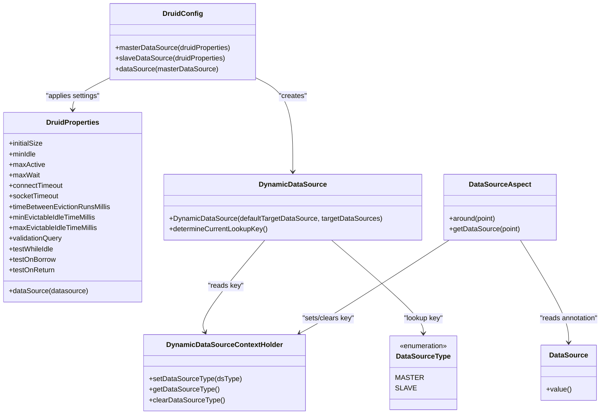
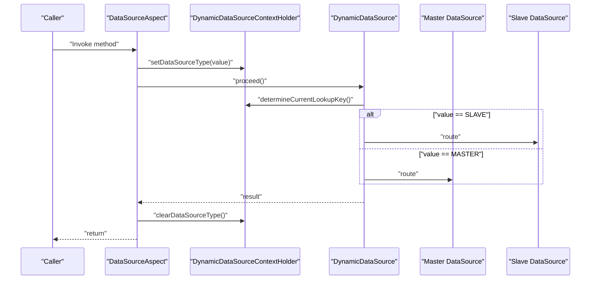
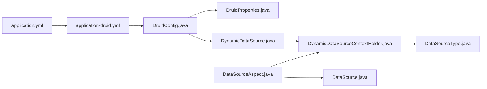

# Database Configuration

<cite>
**Referenced Files in This Document**
- [application-druid.yml](file://src/main/resources/application-druid.yml)
- [application.yml](file://src/main/resources/application.yml)
- [DruidConfig.java](file://src/main/java/com/ruoyi/framework/config/DruidConfig.java)
- [DruidProperties.java](file://src/main/java/com/ruoyi/framework/config/properties/DruidProperties.java)
- [DynamicDataSource.java](file://src/main/java/com/ruoyi/framework/datasource/DynamicDataSource.java)
- [DynamicDataSourceContextHolder.java](file://src/main/java/com/ruoyi/framework/datasource/DynamicDataSourceContextHolder.java)
- [DataSourceAspect.java](file://src/main/java/com/ruoyi/framework/aspectj/DataSourceAspect.java)
- [DataSource.java](file://src/main/java/com/ruoyi/framework/aspectj/lang/annotation/DataSource.java)
- [DataSourceType.java](file://src/main/java/com/ruoyi/framework/aspectj/lang/enums/DataSourceType.java)
</cite>

## Table of Contents
1. [Introduction](#introduction)
2. [Project Structure](#project-structure)
3. [Core Components](#core-components)
4. [Architecture Overview](#architecture-overview)
5. [Detailed Component Analysis](#detailed-component-analysis)
6. [Dependency Analysis](#dependency-analysis)
7. [Performance Considerations](#performance-considerations)
8. [Troubleshooting Guide](#troubleshooting-guide)
9. [Conclusion](#conclusion)

## Introduction
This section documents database configuration using the Druid connection pool in the project. It covers data source configuration in application-druid.yml, connection pool settings, validation and eviction policies, monitoring via statViewServlet and webStatFilter, SQL monitoring and slow query logging, and the WallFilter for SQL injection prevention. It also explains how to configure read-write separation with master and slave data sources and provides best practices for production environments.

## Project Structure
The database configuration is primarily defined in a dedicated YAML profile and complemented by Java configuration and dynamic data source routing.

**Diagram sources**
- [application.yml](file://src/main/resources/application.yml#L48-L56)
- [application-druid.yml](file://src/main/resources/application-druid.yml#L1-L61)
- [DruidConfig.java](file://src/main/java/com/ruoyi/framework/config/DruidConfig.java#L35-L60)
- [DruidProperties.java](file://src/main/java/com/ruoyi/framework/config/properties/DruidProperties.java#L54-L88)
- [DynamicDataSource.java](file://src/main/java/com/ruoyi/framework/datasource/DynamicDataSource.java#L12-L26)
- [DynamicDataSourceContextHolder.java](file://src/main/java/com/ruoyi/framework/datasource/DynamicDataSourceContextHolder.java#L19-L45)
- [DataSourceAspect.java](file://src/main/java/com/ruoyi/framework/aspectj/DataSourceAspect.java#L30-L72)
- [DataSource.java](file://src/main/java/com/ruoyi/framework/aspectj/lang/annotation/DataSource.java#L18-L28)
- [DataSourceType.java](file://src/main/java/com/ruoyi/framework/aspectj/lang/enums/DataSourceType.java#L8-L19)

**Section sources**
- [application.yml](file://src/main/resources/application.yml#L48-L56)
- [application-druid.yml](file://src/main/resources/application-druid.yml#L1-L61)
- [DruidConfig.java](file://src/main/java/com/ruoyi/framework/config/DruidConfig.java#L35-L60)
- [DruidProperties.java](file://src/main/java/com/ruoyi/framework/config/properties/DruidProperties.java#L54-L88)
- [DynamicDataSource.java](file://src/main/java/com/ruoyi/framework/datasource/DynamicDataSource.java#L12-L26)
- [DynamicDataSourceContextHolder.java](file://src/main/java/com/ruoyi/framework/datasource/DynamicDataSourceContextHolder.java#L19-L45)
- [DataSourceAspect.java](file://src/main/java/com/ruoyi/framework/aspectj/DataSourceAspect.java#L30-L72)
- [DataSource.java](file://src/main/java/com/ruoyi/framework/aspectj/lang/annotation/DataSource.java#L18-L28)
- [DataSourceType.java](file://src/main/java/com/ruoyi/framework/aspectj/lang/enums/DataSourceType.java#L8-L19)

## Core Components
- Data source configuration in application-druid.yml defines the master data source, optional slave data source, and Druid-specific pool and monitoring settings.
- DruidConfig.java creates master and slave data source beans and wires them into a dynamic data source.
- DruidProperties.java binds YAML pool settings to DruidDataSource instances.
- DynamicDataSource.java and DynamicDataSourceContextHolder.java implement runtime data source routing.
- DataSourceAspect.java and DataSource.java enable switching data sources via annotations.

**Section sources**
- [application-druid.yml](file://src/main/resources/application-druid.yml#L1-L61)
- [DruidConfig.java](file://src/main/java/com/ruoyi/framework/config/DruidConfig.java#L35-L60)
- [DruidProperties.java](file://src/main/java/com/ruoyi/framework/config/properties/DruidProperties.java#L54-L88)
- [DynamicDataSource.java](file://src/main/java/com/ruoyi/framework/datasource/DynamicDataSource.java#L12-L26)
- [DynamicDataSourceContextHolder.java](file://src/main/java/com/ruoyi/framework/datasource/DynamicDataSourceContextHolder.java#L19-L45)
- [DataSourceAspect.java](file://src/main/java/com/ruoyi/framework/aspectj/DataSourceAspect.java#L30-L72)
- [DataSource.java](file://src/main/java/com/ruoyi/framework/aspectj/lang/annotation/DataSource.java#L18-L28)
- [DataSourceType.java](file://src/main/java/com/ruoyi/framework/aspectj/lang/enums/DataSourceType.java#L8-L19)

## Architecture Overview
The system uses a profile-driven configuration to activate Druid settings. Master and optional slave data sources are built from YAML and injected into a dynamic data source. AOP intercepts method calls annotated with a custom data source switch annotation to route to the appropriate data source.

**Diagram sources**
- [application-druid.yml](file://src/main/resources/application-druid.yml#L1-L61)
- [DruidConfig.java](file://src/main/java/com/ruoyi/framework/config/DruidConfig.java#L35-L60)
- [DruidProperties.java](file://src/main/java/com/ruoyi/framework/config/properties/DruidProperties.java#L54-L88)
- [DynamicDataSource.java](file://src/main/java/com/ruoyi/framework/datasource/DynamicDataSource.java#L12-L26)
- [DynamicDataSourceContextHolder.java](file://src/main/java/com/ruoyi/framework/datasource/DynamicDataSourceContextHolder.java#L19-L45)
- [DataSourceAspect.java](file://src/main/java/com/ruoyi/framework/aspectj/DataSourceAspect.java#L30-L72)
- [DataSource.java](file://src/main/java/com/ruoyi/framework/aspectj/lang/annotation/DataSource.java#L18-L28)
- [DataSourceType.java](file://src/main/java/com/ruoyi/framework/aspectj/lang/enums/DataSourceType.java#L8-L19)

## Detailed Component Analysis

### Data Source Configuration in application-druid.yml
- Data source type and driver class name are defined under the data source section.
- Master data source credentials and URL are configured.
- Slave data source is optional and disabled by default; enabling it activates the slave data source bean.
- Pool settings include initialSize, minIdle, maxActive, maxWait, connectTimeout, and socketTimeout.
- Eviction and validation settings include timeBetweenEvictionRunsMillis, minEvictableIdleTimeMillis, maxEvictableIdleTimeMillis, and validationQuery with testWhileIdle, testOnBorrow, and testOnReturn toggles.
- Monitoring settings include statViewServlet and webStatFilter with access control and console login credentials.
- SQL monitoring and slow query logging are configured via the stat filter with log-slow-sql, slow-sql-millis, and merge-sql.
- WallFilter configuration enables multi-statement-allow for SQL injection protection.

**Section sources**
- [application-druid.yml](file://src/main/resources/application-druid.yml#L1-L61)

### Druid Connection Pool Settings Binding
- DruidProperties.java reads YAML pool settings and applies them to DruidDataSource instances.
- Settings bound include initialSize, minIdle, maxActive, maxWait, connectTimeout, socketTimeout, timeBetweenEvictionRunsMillis, minEvictableIdleTimeMillis, maxEvictableIdleTimeMillis, validationQuery, and testWhileIdle/testOnBorrow/testOnReturn.

**Section sources**
- [DruidProperties.java](file://src/main/java/com/ruoyi/framework/config/properties/DruidProperties.java#L15-L88)

### Dynamic Data Source Routing
- DruidConfig.java builds master and slave data sources and registers them in a DynamicDataSource.
- DynamicDataSource determines the current data source via DynamicDataSourceContextHolder.getDataSourceType().
- DataSourceAspect.java sets the data source type before method execution and clears it afterward.
- DataSource.java is a custom annotation used to mark methods or classes to switch data sources.
- DataSourceType.java enumerates MASTER and SLAVE.

**Diagram sources**
- [DruidConfig.java](file://src/main/java/com/ruoyi/framework/config/DruidConfig.java#L35-L60)
- [DruidProperties.java](file://src/main/java/com/ruoyi/framework/config/properties/DruidProperties.java#L54-L88)
- [DynamicDataSource.java](file://src/main/java/com/ruoyi/framework/datasource/DynamicDataSource.java#L12-L26)
- [DynamicDataSourceContextHolder.java](file://src/main/java/com/ruoyi/framework/datasource/DynamicDataSourceContextHolder.java#L19-L45)
- [DataSourceAspect.java](file://src/main/java/com/ruoyi/framework/aspectj/DataSourceAspect.java#L30-L72)
- [DataSource.java](file://src/main/java/com/ruoyi/framework/aspectj/lang/annotation/DataSource.java#L18-L28)
- [DataSourceType.java](file://src/main/java/com/ruoyi/framework/aspectj/lang/enums/DataSourceType.java#L8-L19)

**Section sources**
- [DruidConfig.java](file://src/main/java/com/ruoyi/framework/config/DruidConfig.java#L35-L60)
- [DynamicDataSource.java](file://src/main/java/com/ruoyi/framework/datasource/DynamicDataSource.java#L12-L26)
- [DynamicDataSourceContextHolder.java](file://src/main/java/com/ruoyi/framework/datasource/DynamicDataSourceContextHolder.java#L19-L45)
- [DataSourceAspect.java](file://src/main/java/com/ruoyi/framework/aspectj/DataSourceAspect.java#L30-L72)
- [DataSource.java](file://src/main/java/com/ruoyi/framework/aspectj/lang/annotation/DataSource.java#L18-L28)
- [DataSourceType.java](file://src/main/java/com/ruoyi/framework/aspectj/lang/enums/DataSourceType.java#L8-L19)

### Read-Write Separation Configuration
- Master data source is always enabled and registered in the dynamic data source.
- Slave data source is optional and controlled by spring.datasource.druid.slave.enabled. When enabled, the slave data source bean is created and added to the dynamic data source’s targetDataSources.
- Switching between master and slave is performed via the @DataSource annotation on methods or classes, with DataSourceType.MASTER and DataSourceType.SLAVE values.

**Diagram sources**
- [DataSourceAspect.java](file://src/main/java/com/ruoyi/framework/aspectj/DataSourceAspect.java#L30-L72)
- [DynamicDataSource.java](file://src/main/java/com/ruoyi/framework/datasource/DynamicDataSource.java#L21-L26)
- [DynamicDataSourceContextHolder.java](file://src/main/java/com/ruoyi/framework/datasource/DynamicDataSourceContextHolder.java#L24-L45)
- [DataSource.java](file://src/main/java/com/ruoyi/framework/aspectj/lang/annotation/DataSource.java#L18-L28)
- [DataSourceType.java](file://src/main/java/com/ruoyi/framework/aspectj/lang/enums/DataSourceType.java#L8-L19)

**Section sources**
- [application-druid.yml](file://src/main/resources/application-druid.yml#L12-L19)
- [DruidConfig.java](file://src/main/java/com/ruoyi/framework/config/DruidConfig.java#L43-L60)
- [DataSourceAspect.java](file://src/main/java/com/ruoyi/framework/aspectj/DataSourceAspect.java#L30-L72)
- [DataSource.java](file://src/main/java/com/ruoyi/framework/aspectj/lang/annotation/DataSource.java#L18-L28)
- [DataSourceType.java](file://src/main/java/com/ruoyi/framework/aspectj/lang/enums/DataSourceType.java#L8-L19)

### Druid Monitoring Features
- statViewServlet: Provides a web console for monitoring Druid metrics. Access control is managed by allow (whitelist), url-pattern, and login credentials.
- webStatFilter: Enables web statistics collection and is controlled by enabled flag.
- The configuration removes ad banners from the monitoring page via a filter registration.

**Section sources**
- [application-druid.yml](file://src/main/resources/application-druid.yml#L42-L58)
- [DruidConfig.java](file://src/main/java/com/ruoyi/framework/config/DruidConfig.java#L84-L125)

### SQL Monitoring and Slow Query Logging
- The stat filter is enabled and configured to log slow SQL statements when their execution time exceeds a threshold, merging repeated SQL statements for clarity.
- These settings are defined under spring.datasource.druid.filter.stat.

**Section sources**
- [application-druid.yml](file://src/main/resources/application-druid.yml#L52-L58)
- [DruidProperties.java](file://src/main/java/com/ruoyi/framework/config/properties/DruidProperties.java#L54-L88)

### WallFilter Configuration for SQL Injection Prevention
- The wall filter is configured with multi-statement-allow enabled, allowing multiple statements in a single execution.
- This setting should be reviewed carefully in production environments to balance functionality and security.

**Section sources**
- [application-druid.yml](file://src/main/resources/application-druid.yml#L59-L61)

## Dependency Analysis
- application.yml activates the druid profile, which loads application-druid.yml.
- DruidConfig depends on DruidProperties to apply pool settings and on Spring’s conditional annotations to enable slave data source only when enabled.
- DynamicDataSource relies on DynamicDataSourceContextHolder for thread-local routing and on DataSourceType for lookup keys.
- DataSourceAspect depends on DataSource annotation metadata and DynamicDataSourceContextHolder to set and clear the data source type during method execution.

**Diagram sources**
- [application.yml](file://src/main/resources/application.yml#L48-L56)
- [application-druid.yml](file://src/main/resources/application-druid.yml#L1-L61)
- [DruidConfig.java](file://src/main/java/com/ruoyi/framework/config/DruidConfig.java#L35-L60)
- [DruidProperties.java](file://src/main/java/com/ruoyi/framework/config/properties/DruidProperties.java#L54-L88)
- [DynamicDataSource.java](file://src/main/java/com/ruoyi/framework/datasource/DynamicDataSource.java#L12-L26)
- [DynamicDataSourceContextHolder.java](file://src/main/java/com/ruoyi/framework/datasource/DynamicDataSourceContextHolder.java#L19-L45)
- [DataSourceAspect.java](file://src/main/java/com/ruoyi/framework/aspectj/DataSourceAspect.java#L30-L72)
- [DataSource.java](file://src/main/java/com/ruoyi/framework/aspectj/lang/annotation/DataSource.java#L18-L28)
- [DataSourceType.java](file://src/main/java/com/ruoyi/framework/aspectj/lang/enums/DataSourceType.java#L8-L19)

**Section sources**
- [application.yml](file://src/main/resources/application.yml#L48-L56)
- [application-druid.yml](file://src/main/resources/application-druid.yml#L1-L61)
- [DruidConfig.java](file://src/main/java/com/ruoyi/framework/config/DruidConfig.java#L35-L60)
- [DruidProperties.java](file://src/main/java/com/ruoyi/framework/config/properties/DruidProperties.java#L54-L88)
- [DynamicDataSource.java](file://src/main/java/com/ruoyi/framework/datasource/DynamicDataSource.java#L12-L26)
- [DynamicDataSourceContextHolder.java](file://src/main/java/com/ruoyi/framework/datasource/DynamicDataSourceContextHolder.java#L19-L45)
- [DataSourceAspect.java](file://src/main/java/com/ruoyi/framework/aspectj/DataSourceAspect.java#L30-L72)
- [DataSource.java](file://src/main/java/com/ruoyi/framework/aspectj/lang/annotation/DataSource.java#L18-L28)
- [DataSourceType.java](file://src/main/java/com/ruoyi/framework/aspectj/lang/enums/DataSourceType.java#L8-L19)

## Performance Considerations
- Pool sizing: initialSize, minIdle, and maxActive should align with expected concurrency and workload patterns. Adjust based on observed connection usage and garbage collection overhead.
- Wait times: maxWait controls queueing behavior; tune to prevent long waits under load while avoiding excessive timeouts.
- Validation and eviction: testWhileIdle improves reliability without heavy borrow/return checks. Tune timeBetweenEvictionRunsMillis and idle thresholds to balance resource cleanup and connection freshness.
- Network timeouts: connectTimeout and socketTimeout help manage network latency and query execution limits.
- Monitoring overhead: enabling slow SQL logging and web statistics adds overhead; use conservative thresholds and disable in low-resource environments.
- Read-write separation: ensure slave data source lag is acceptable for your use case; consider read replicas and asynchronous replication strategies.

[No sources needed since this section provides general guidance]

## Troubleshooting Guide
- Connection failures or timeouts: Verify driver class name, URLs, usernames, and passwords in the data source configuration. Check maxWait, connectTimeout, and socketTimeout.
- Excessive connections: Review maxActive and minIdle; ensure proper connection release and consider reducing pool size.
- Frequent eviction or stale connections: Adjust timeBetweenEvictionRunsMillis and idle thresholds; confirm validationQuery effectiveness.
- Monitoring console access denied: Confirm allow whitelist, url-pattern, and login credentials for statViewServlet.
- Slow query alerts: Validate slow-sql-millis threshold and merge-sql setting; review logs for frequently slow queries.
- SQL injection concerns: Evaluate wall filter configuration and multi-statement-allow; restrict multi-statement usage where possible.
- Read-only queries routed incorrectly: Ensure @DataSource annotations are present on methods or classes and that values match expected DataSourceType.

**Section sources**
- [application-druid.yml](file://src/main/resources/application-druid.yml#L1-L61)
- [DruidProperties.java](file://src/main/java/com/ruoyi/framework/config/properties/DruidProperties.java#L54-L88)
- [DruidConfig.java](file://src/main/java/com/ruoyi/framework/config/DruidConfig.java#L84-L125)
- [DataSourceAspect.java](file://src/main/java/com/ruoyi/framework/aspectj/DataSourceAspect.java#L30-L72)
- [DataSource.java](file://src/main/java/com/ruoyi/framework/aspectj/lang/annotation/DataSource.java#L18-L28)
- [DataSourceType.java](file://src/main/java/com/ruoyi/framework/aspectj/lang/enums/DataSourceType.java#L8-L19)

## Conclusion
The project integrates Druid as the primary connection pool with comprehensive monitoring and robust read-write separation capabilities. Configuration is centralized in application-druid.yml and bound via Java configuration and properties. AOP-driven data source switching enables flexible routing between master and slave databases. Production deployments should carefully tune pool sizes, timeouts, and validation policies while leveraging monitoring and slow query logging to maintain performance and reliability.

[No sources needed since this section summarizes without analyzing specific files]