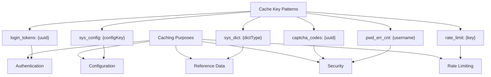
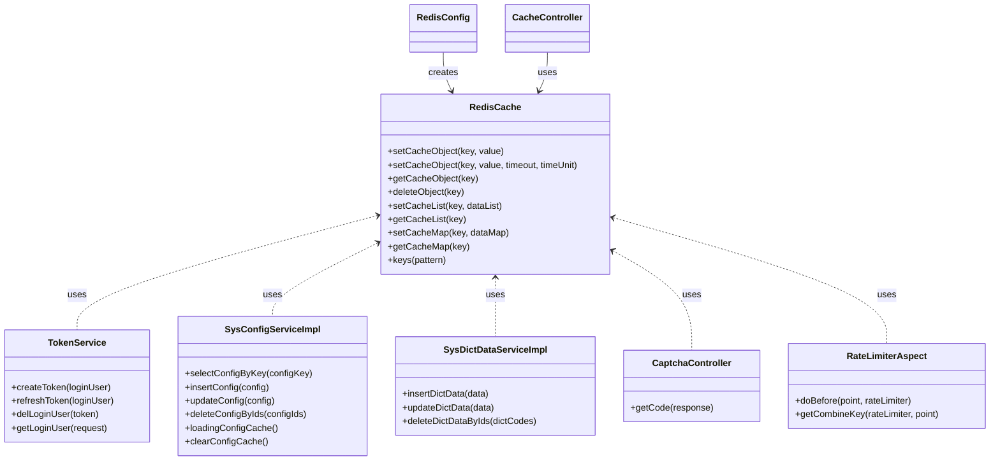

# Redis Configuration

<cite>
**Referenced Files in This Document**   
- [application.yml](file://src/main/resources/application.yml)
- [RedisConfig.java](file://src/main/java/com/ruoyi/framework/config/RedisConfig.java)
- [CacheConstants.java](file://src/main/java/com/ruoyi/common/constant/CacheConstants.java)
- [CacheController.java](file://src/main/java/com/ruoyi/project/monitor/controller/CacheController.java)
- [FastJson2JsonRedisSerializer.java](file://src/main/java/com/ruoyi/framework/config/FastJson2JsonRedisSerializer.java)
- [RedisCache.java](file://src/main/java/com/ruoyi/framework/redis/RedisCache.java)
- [TokenService.java](file://src/main/java/com/ruoyi/framework/security/service/TokenService.java)
- [SysConfigServiceImpl.java](file://src/main/java/com/ruoyi/project/system/service/impl/SysConfigServiceImpl.java)
- [SysDictDataServiceImpl.java](file://src/main/java/com/ruoyi/project/system/service/impl/SysDictDataServiceImpl.java)
- [CaptchaController.java](file://src/main/java/com/ruoyi/project/common/CaptchaController.java)
- [RateLimiterAspect.java](file://src/main/java/com/ruoyi/framework/aspectj/RateLimiterAspect.java)
- [RateLimiter.java](file://src/main/java/com/ruoyi/framework/aspectj/lang/annotation/RateLimiter.java)
</cite>

## Table of Contents
1. [Redis Connection Configuration](#redis-connection-configuration)
2. [Connection Pool Settings](#connection-pool-settings)
3. [RedisTemplate Configuration](#redistemplate-configuration)
4. [Spring Cache Integration](#spring-cache-integration)
5. [Caching Purposes and Key Patterns](#caching-purposes-and-key-patterns)
6. [System Component Interactions with Redis](#system-component-interactions-with-redis)
7. [Configuration Best Practices](#configuration-best-practices)

## Redis Connection Configuration

The Redis connection settings in RuoYi-Vue are configured in the `application.yml` file under the `spring.redis` section. The configuration includes essential parameters for establishing a connection to the Redis server.

The host is set to `192.168.40.41`, specifying the IP address of the Redis server. The port is configured as `6378`, which differs from the default Redis port of 6379, indicating a custom port configuration. The database index is set to `0`, which refers to the default Redis database. This allows for logical separation of data when multiple applications share the same Redis instance.

Authentication is enabled with a password `8icymZp_WvFkzMt`, ensuring secure access to the Redis server. The connection timeout is set to `10s`, defining the maximum time to wait for a connection to be established before timing out. This prevents indefinite blocking during network issues or server unavailability.

These connection parameters provide the foundation for all Redis operations within the application, enabling reliable communication between the RuoYi-Vue backend and the Redis server for various caching and rate-limiting functionalities.

**Section sources**
- [application.yml](file://src/main/resources/application.yml#L68-L79)

## Connection Pool Settings

The Redis connection pool configuration in RuoYi-Vue uses Lettuce as the Redis client and is defined under the `spring.redis.lettuce.pool` section in the `application.yml` file. The connection pool settings are crucial for managing database connections efficiently and ensuring optimal performance under varying loads.

The minimum idle connections (`min-idle`) is set to `0`, meaning the pool will not maintain any minimum number of idle connections when demand is low. This helps conserve resources during periods of low activity. The maximum idle connections (`max-idle`) is configured as `8`, limiting the number of idle connections that can remain in the pool. This prevents excessive resource consumption while still allowing for quick response to sudden increases in demand.

The maximum active connections (`max-active`) is also set to `8`, defining the upper limit of connections that can be allocated by the pool at any given time. This setting helps prevent the Redis server from being overwhelmed by too many concurrent connections. The maximum wait time (`max-wait`) is set to `-1ms`, indicating that there is no limit on how long a thread can wait for a connection from the pool. This ensures that requests will not be rejected due to connection acquisition timeouts, though it could potentially lead to thread blocking under extreme load conditions.

These pool settings represent a balanced configuration that prioritizes resource efficiency while maintaining adequate concurrency for typical application workloads.

**Section sources**
- [application.yml](file://src/main/resources/application.yml#L80-L89)

## RedisTemplate Configuration

The RedisTemplate configuration in RuoYi-Vue is defined in the `RedisConfig.java` class, which provides customized serialization settings for Redis operations. The configuration ensures proper data formatting when storing and retrieving values from Redis.

The `RedisTemplate<Object, Object>` bean is configured with specific serializers for keys and values. For key serialization, `StringRedisSerializer` is used, which converts keys to and from UTF-8 encoded strings. This ensures that all Redis keys are stored as human-readable strings, making them easier to inspect and manage directly in Redis.

For value serialization, `FastJson2JsonRedisSerializer` is employed, which serializes Java objects to JSON format using Alibaba's Fastjson2 library. This serializer converts complex Java objects into JSON strings before storing them in Redis and deserializes them back to objects when retrieved. The use of JSON serialization provides several advantages, including human-readable storage, language-agnostic data format, and efficient deserialization.

The configuration also applies the same serialization strategy to hash structures, using `StringRedisSerializer` for hash keys and `FastJson2JsonRedisSerializer` for hash values. This consistent approach ensures uniform data representation across different Redis data structures.

The `@Configuration` annotation marks the class as a source of bean definitions, while `@Bean` annotation creates the RedisTemplate instance that will be managed by Spring's application context.

**Section sources**
- [RedisConfig.java](file://src/main/java/com/ruoyi/framework/config/RedisConfig.java#L21-L37)
- [FastJson2JsonRedisSerializer.java](file://src/main/java/com/ruoyi/framework/config/FastJson2JsonRedisSerializer.java#L17-L52)

## Spring Cache Integration

Spring cache abstraction is enabled in RuoYi-Vue through the `@EnableCaching` annotation and `CachingConfigurerSupport` inheritance in the `RedisConfig` class. This integration provides a declarative approach to caching that simplifies the implementation of caching logic across the application.

The `@EnableCaching` annotation activates Spring's annotation-driven cache management capabilities, allowing the use of caching annotations like `@Cacheable`, `@CachePut`, and `@CacheEvict` throughout the application. By extending `CachingConfigurerSupport`, the configuration class can customize various aspects of the caching infrastructure, including the cache manager, key generator, cache resolver, and error handling.

This integration enables method-level caching where results of method invocations can be automatically cached based on their parameters. When a method annotated with caching annotations is called, Spring intercepts the call and checks if a cached result exists for the given parameters. If a cached result is found, it is returned directly without executing the method body, significantly improving performance for expensive operations.

The combination of `@EnableCaching` and `CachingConfigurerSupport` provides a powerful foundation for implementing caching strategies across the application while maintaining clean separation between business logic and caching concerns.

**Section sources**
- [RedisConfig.java](file://src/main/java/com/ruoyi/framework/config/RedisConfig.java#L17-L19)

## Caching Purposes and Key Patterns

RuoYi-Vue utilizes Redis for multiple caching purposes, each with specific key patterns defined in the `CacheConstants.java` file. These constants provide a centralized location for all cache key prefixes, ensuring consistency across the application.

Login tokens are cached using the `LOGIN_TOKEN_KEY` prefix (`login_tokens:`), which stores user session information including authentication details and permissions. This enables stateless authentication where user sessions can be validated without querying the database on each request.

System configuration data is cached with the `SYS_CONFIG_KEY` prefix (`sys_config:`), storing application settings and parameters. This reduces database queries for frequently accessed configuration values and allows for dynamic configuration updates without application restarts.

Data dictionaries are cached using the `SYS_DICT_KEY` prefix (`sys_dict:`), storing lookup values and enumeration data. This improves performance for dropdowns and data validation by eliminating repeated database queries for static reference data.

Captcha codes are stored with the `CAPTCHA_CODE_KEY` prefix (`captcha_codes:`), temporarily holding verification codes for user authentication processes. These entries typically have short expiration times to enhance security.

Rate limiting information is tracked using the `RATE_LIMIT_KEY` prefix (`rate_limit:`), which helps prevent abuse by limiting the number of requests a client can make within a specified time period. This protects the application from denial-of-service attacks and ensures fair resource usage.

Password error counts are recorded with the `PWD_ERR_CNT_KEY` prefix (`pwd_err_cnt:`), tracking failed login attempts for security purposes. This enables account lockout mechanisms after a specified number of failed attempts.

Each cache key follows a consistent pattern of `purpose:` followed by a unique identifier, making it easy to identify and manage different types of cached data.

**Diagram sources**
- [CacheConstants.java](file://src/main/java/com/ruoyi/common/constant/CacheConstants.java#L13-L43)

**Section sources**
- [CacheConstants.java](file://src/main/java/com/ruoyi/common/constant/CacheConstants.java#L13-L43)

## System Component Interactions with Redis

Various system components in RuoYi-Vue interact with Redis through the `RedisCache` utility class, which provides a simplified interface for common Redis operations. This abstraction layer ensures consistent interaction patterns across different parts of the application.

The authentication system uses Redis to store login tokens through the `TokenService` class. When a user logs in, a token is generated and stored in Redis with the `login_tokens:` prefix. The `refreshToken` method updates the token's expiration time, implementing a sliding session timeout. This allows for efficient session management without frequent database queries.

System configuration data is cached by the `SysConfigServiceImpl` class, which loads all configuration parameters into Redis during application startup via the `@PostConstruct` annotated `init` method. When configuration values are requested, the service first checks Redis before falling back to database retrieval, significantly improving read performance for frequently accessed settings.

Data dictionaries are managed by the `SysDictDataServiceImpl` class in conjunction with `DictUtils`. When dictionary data is created, updated, or deleted, the corresponding cache is automatically refreshed. This ensures that the cached data remains consistent with the database while providing fast access to reference data used throughout the application.

The captcha system in `CaptchaController` stores generated verification codes in Redis with a time-to-live (TTL) of five minutes. Each captcha is associated with a unique UUID and stored with the `captcha_codes:` prefix, allowing for secure validation during login attempts.

Rate limiting is implemented through the `RateLimiterAspect` and `RateLimiter` annotation, which use Redis to track request counts. The aspect executes a Lua script (`limitScript`) that atomically increments a counter and sets an expiration time, preventing race conditions in high-concurrency scenarios.

The `CacheController` provides administrative functionality for monitoring and managing the Redis cache, allowing system administrators to view cache statistics, inspect specific cache entries, and clear caches as needed.

**Diagram sources**
- [RedisCache.java](file://src/main/java/com/ruoyi/framework/redis/RedisCache.java#L23-L268)
- [TokenService.java](file://src/main/java/com/ruoyi/framework/security/service/TokenService.java#L32-L232)
- [SysConfigServiceImpl.java](file://src/main/java/com/ruoyi/project/system/service/impl/SysConfigServiceImpl.java#L24-L229)
- [SysDictDataServiceImpl.java](file://src/main/java/com/ruoyi/project/system/service/impl/SysDictDataServiceImpl.java#L17-L111)
- [CaptchaController.java](file://src/main/java/com/ruoyi/project/common/CaptchaController.java#L29-L98)
- [RateLimiterAspect.java](file://src/main/java/com/ruoyi/framework/aspectj/RateLimiterAspect.java#L29-L89)

**Section sources**
- [RedisCache.java](file://src/main/java/com/ruoyi/framework/redis/RedisCache.java#L23-L268)
- [TokenService.java](file://src/main/java/com/ruoyi/framework/security/service/TokenService.java#L32-L232)
- [SysConfigServiceImpl.java](file://src/main/java/com/ruoyi/project/system/service/impl/SysConfigServiceImpl.java#L24-L229)
- [SysDictDataServiceImpl.java](file://src/main/java/com/ruoyi/project/system/service/impl/SysDictDataServiceImpl.java#L17-L111)
- [CaptchaController.java](file://src/main/java/com/ruoyi/project/common/CaptchaController.java#L29-L98)
- [RateLimiterAspect.java](file://src/main/java/com/ruoyi/framework/aspectj/RateLimiterAspect.java#L29-L89)

## Configuration Best Practices

For high availability and performance tuning in production environments, several best practices should be considered when configuring Redis in RuoYi-Vue.

For high availability, consider implementing Redis Sentinel or Redis Cluster to provide automatic failover and data redundancy. This ensures that the application remains operational even if a Redis node fails. Additionally, configure multiple Redis instances with replication to prevent single points of failure.

Performance tuning recommendations include adjusting the connection pool settings based on actual application load patterns. The current configuration of 8 maximum active connections may need to be increased for high-traffic applications. Monitor connection pool utilization and adjust `max-active`, `max-idle`, and `min-idle` values accordingly.

Implement proper key expiration policies for all cached data to prevent unbounded memory growth. While some data like system configurations may have long TTLs, temporary data like captchas should have short expiration times. Consider using Redis' built-in eviction policies such as `allkeys-lru` or `volatile-lru` to automatically remove less frequently used items when memory pressure occurs.

For security, ensure that the Redis server is not exposed to public networks and is protected by firewalls. Use strong passwords and consider implementing TLS encryption for Redis connections in production environments. Regularly rotate the Redis password and update the configuration accordingly.

Monitoring and alerting should be implemented to track Redis memory usage, connection counts, and command latency. Set up alerts for high memory usage, slow commands, and connection pool exhaustion to proactively address potential issues.

Consider using Redis persistence options like RDB snapshots or AOF (Append Only File) to protect against data loss in case of server restarts, especially for critical cached data that would be expensive to regenerate.

Finally, implement proper cache warming strategies during application startup to preload frequently accessed data, reducing the initial load on backend systems after deployment.