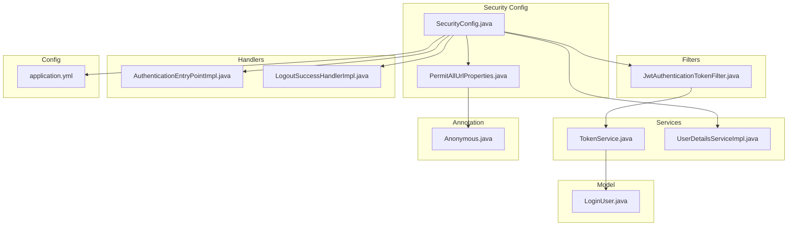
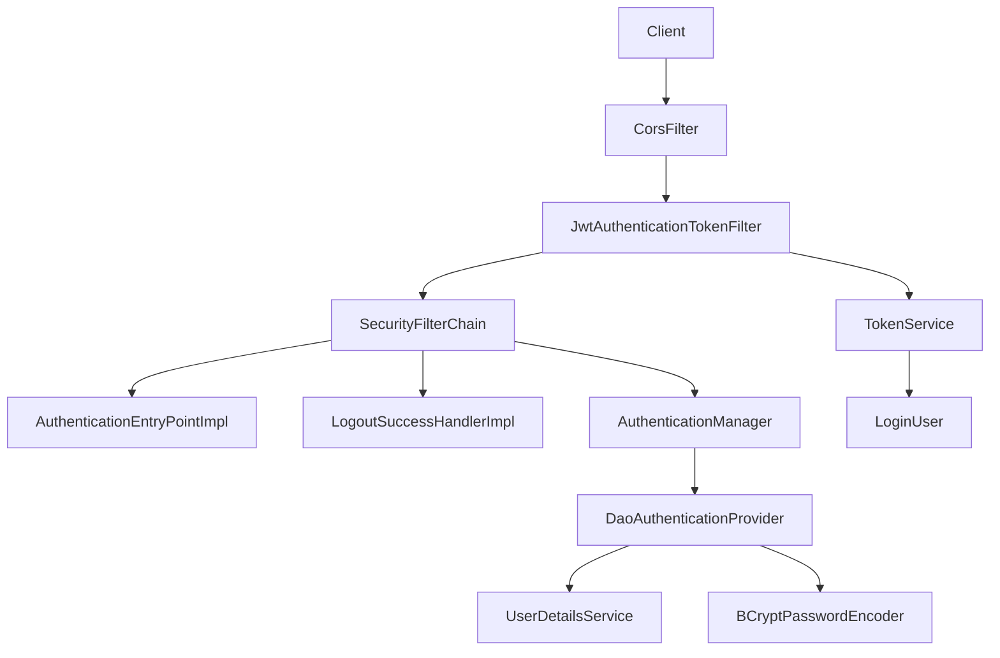
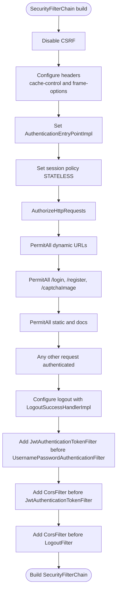
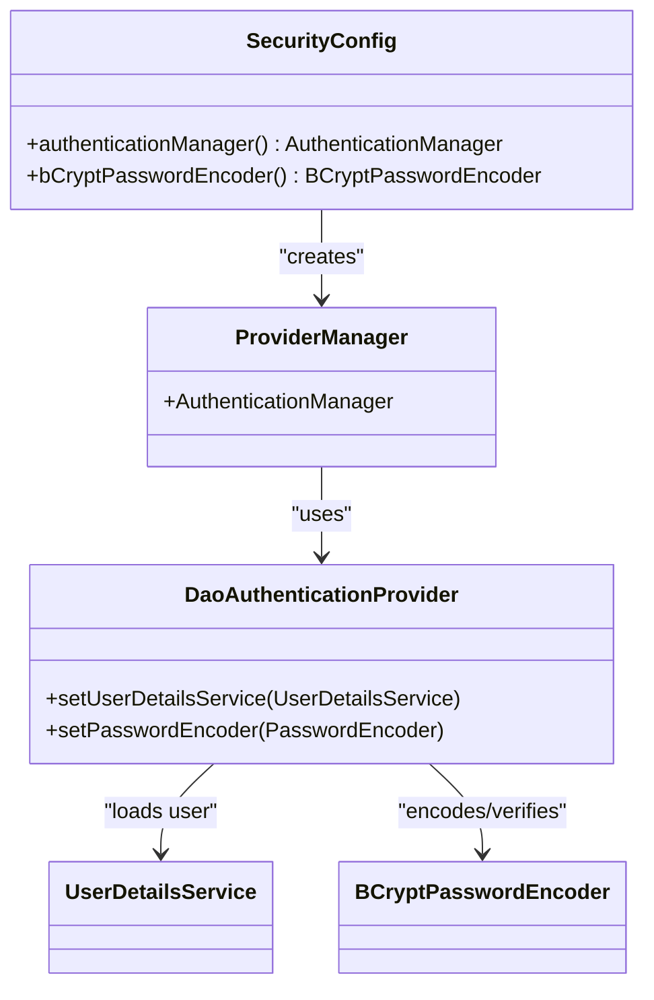
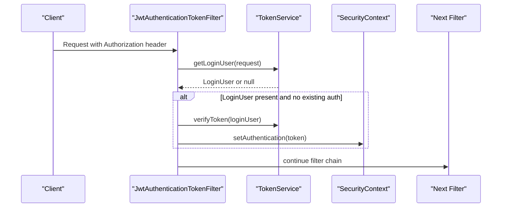
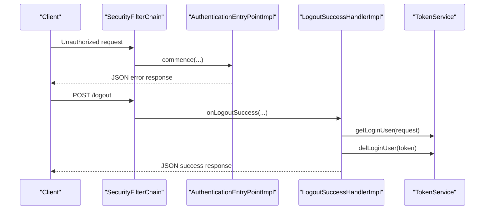
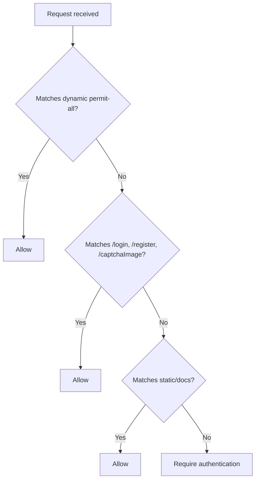
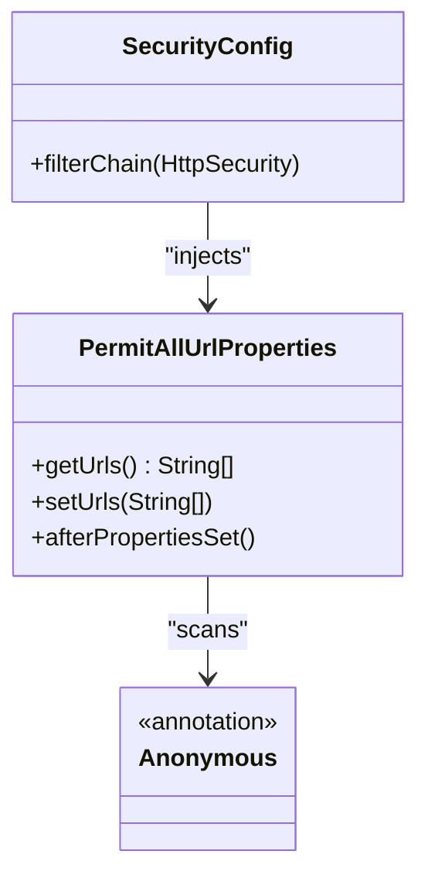
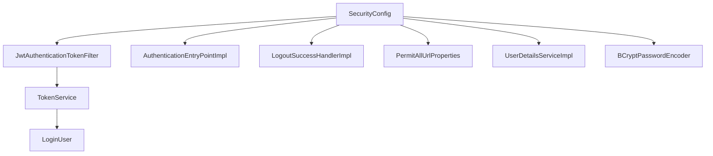

# Security Configuration

<cite>
**Referenced Files in This Document**
- [SecurityConfig.java](file://src/main/java/com/ruoyi/framework/config/SecurityConfig.java)
- [JwtAuthenticationTokenFilter.java](file://src/main/java/com/ruoyi/framework/security/filter/JwtAuthenticationTokenFilter.java)
- [AuthenticationEntryPointImpl.java](file://src/main/java/com/ruoyi/framework/security/handle/AuthenticationEntryPointImpl.java)
- [LogoutSuccessHandlerImpl.java](file://src/main/java/com/ruoyi/framework/security/handle/LogoutSuccessHandlerImpl.java)
- [PermitAllUrlProperties.java](file://src/main/java/com/ruoyi/framework/config/properties/PermitAllUrlProperties.java)
- [UserDetailsServiceImpl.java](file://src/main/java/com/ruoyi/framework/security/service/UserDetailsServiceImpl.java)
- [TokenService.java](file://src/main/java/com/ruoyi/framework/security/service/TokenService.java)
- [Anonymous.java](file://src/main/java/com/ruoyi/framework/aspectj/lang/annotation/Anonymous.java)
- [LoginUser.java](file://src/main/java/com/ruoyi/framework/security/LoginUser.java)
- [application.yml](file://src/main/resources/application.yml)
</cite>

## Table of Contents
1. [Introduction](#introduction)
2. [Project Structure](#project-structure)
3. [Core Components](#core-components)
4. [Architecture Overview](#architecture-overview)
5. [Detailed Component Analysis](#detailed-component-analysis)
6. [Dependency Analysis](#dependency-analysis)
7. [Performance Considerations](#performance-considerations)
8. [Troubleshooting Guide](#troubleshooting-guide)
9. [Conclusion](#conclusion)

## Introduction
This section documents the security configuration of RuoYi-Vue, focusing on the Spring Security setup. It explains how method-level security is enabled, how authentication is configured using DaoAuthenticationProvider and UserDetailsService, how JWT authentication integrates into the filter chain, and how authorization rules are enforced. It also covers the authentication entry point, logout handler, session management policy, CORS integration, password hashing with BCrypt, and the dynamic permit-all URL mechanism driven by annotations.

## Project Structure
Security-related components are organized under framework packages:
- Configuration: SecurityConfig, PermitAllUrlProperties
- Filters: JwtAuthenticationTokenFilter
- Handlers: AuthenticationEntryPointImpl, LogoutSuccessHandlerImpl
- Services: TokenService, UserDetailsServiceImpl
- Supporting model: LoginUser
- Annotation: Anonymous

**Diagram sources**
- [SecurityConfig.java](file://src/main/java/com/ruoyi/framework/config/SecurityConfig.java#L1-L139)
- [JwtAuthenticationTokenFilter.java](file://src/main/java/com/ruoyi/framework/security/filter/JwtAuthenticationTokenFilter.java#L1-L45)
- [AuthenticationEntryPointImpl.java](file://src/main/java/com/ruoyi/framework/security/handle/AuthenticationEntryPointImpl.java#L1-L35)
- [LogoutSuccessHandlerImpl.java](file://src/main/java/com/ruoyi/framework/security/handle/LogoutSuccessHandlerImpl.java#L1-L53)
- [PermitAllUrlProperties.java](file://src/main/java/com/ruoyi/framework/config/properties/PermitAllUrlProperties.java#L1-L74)
- [UserDetailsServiceImpl.java](file://src/main/java/com/ruoyi/framework/security/service/UserDetailsServiceImpl.java#L1-L66)
- [TokenService.java](file://src/main/java/com/ruoyi/framework/security/service/TokenService.java#L1-L233)
- [LoginUser.java](file://src/main/java/com/ruoyi/framework/security/LoginUser.java#L1-L267)
- [Anonymous.java](file://src/main/java/com/ruoyi/framework/aspectj/lang/annotation/Anonymous.java#L1-L20)
- [application.yml](file://src/main/resources/application.yml#L91-L100)

**Section sources**
- [SecurityConfig.java](file://src/main/java/com/ruoyi/framework/config/SecurityConfig.java#L1-L139)

## Core Components
- Method-level security: Enabled via @EnableMethodSecurity with prePostEnabled and securedEnabled.
- AuthenticationManager: Configured using DaoAuthenticationProvider with UserDetailsService and BCryptPasswordEncoder.
- JWT filter: JwtAuthenticationTokenFilter extracts and validates tokens, sets Authentication in SecurityContext.
- Entry point and logout handler: AuthenticationEntryPointImpl and LogoutSuccessHandlerImpl provide standardized responses for authentication failures and successful logout.
- Session management: Stateless policy to support token-based authentication.
- Authorization rules: Permit-all for login/register/captcha and static resources; all other requests require authentication.
- CORS integration: CorsFilter registered and placed before JWT and Logout filters.
- Password hashing: BCryptPasswordEncoder bean configured for strong hashing.
- Permit-all URLs: Dynamic permit-all list built from @Anonymous annotations plus explicit endpoints.

**Section sources**
- [SecurityConfig.java](file://src/main/java/com/ruoyi/framework/config/SecurityConfig.java#L29-L30)
- [SecurityConfig.java](file://src/main/java/com/ruoyi/framework/config/SecurityConfig.java#L72-L79)
- [SecurityConfig.java](file://src/main/java/com/ruoyi/framework/config/SecurityConfig.java#L96-L129)
- [JwtAuthenticationTokenFilter.java](file://src/main/java/com/ruoyi/framework/security/filter/JwtAuthenticationTokenFilter.java#L1-L45)
- [AuthenticationEntryPointImpl.java](file://src/main/java/com/ruoyi/framework/security/handle/AuthenticationEntryPointImpl.java#L1-L35)
- [LogoutSuccessHandlerImpl.java](file://src/main/java/com/ruoyi/framework/security/handle/LogoutSuccessHandlerImpl.java#L1-L53)
- [PermitAllUrlProperties.java](file://src/main/java/com/ruoyi/framework/config/properties/PermitAllUrlProperties.java#L1-L74)
- [application.yml](file://src/main/resources/application.yml#L91-L100)

## Architecture Overview
The security architecture enforces token-based authentication with a clear filter chain order and centralized authorization rules.

**Diagram sources**
- [SecurityConfig.java](file://src/main/java/com/ruoyi/framework/config/SecurityConfig.java#L96-L129)
- [JwtAuthenticationTokenFilter.java](file://src/main/java/com/ruoyi/framework/security/filter/JwtAuthenticationTokenFilter.java#L1-L45)
- [AuthenticationEntryPointImpl.java](file://src/main/java/com/ruoyi/framework/security/handle/AuthenticationEntryPointImpl.java#L1-L35)
- [LogoutSuccessHandlerImpl.java](file://src/main/java/com/ruoyi/framework/security/handle/LogoutSuccessHandlerImpl.java#L1-L53)
- [SecurityConfig.java](file://src/main/java/com/ruoyi/framework/config/SecurityConfig.java#L72-L79)
- [UserDetailsServiceImpl.java](file://src/main/java/com/ruoyi/framework/security/service/UserDetailsServiceImpl.java#L1-L66)
- [TokenService.java](file://src/main/java/com/ruoyi/framework/security/service/TokenService.java#L1-L233)
- [LoginUser.java](file://src/main/java/com/ruoyi/framework/security/LoginUser.java#L1-L267)

## Detailed Component Analysis

### SecurityConfig: Spring Security Setup
- Enables method-level security with @EnableMethodSecurity.
- Configures AuthenticationManager using DaoAuthenticationProvider with UserDetailsService and BCryptPasswordEncoder.
- Defines SecurityFilterChain with:
  - CSRF disabled (stateless token-based).
  - Headers customization (cache control and frame options).
  - Exception handling via AuthenticationEntryPointImpl.
  - Session management set to STATELESS.
  - Authorization rules:
    - Permit-all for dynamic URLs from PermitAllUrlProperties.
    - Explicit permit-all for /login, /register, /captchaImage.
    - Permit-all for static resources and documentation endpoints.
    - All other requests require authentication.
  - Logout configured with LogoutSuccessHandlerImpl.
  - Adds JwtAuthenticationTokenFilter before UsernamePasswordAuthenticationFilter.
  - Adds CorsFilter before JwtAuthenticationTokenFilter and LogoutFilter.
- Provides BCryptPasswordEncoder bean.

**Diagram sources**
- [SecurityConfig.java](file://src/main/java/com/ruoyi/framework/config/SecurityConfig.java#L96-L129)

**Section sources**
- [SecurityConfig.java](file://src/main/java/com/ruoyi/framework/config/SecurityConfig.java#L29-L30)
- [SecurityConfig.java](file://src/main/java/com/ruoyi/framework/config/SecurityConfig.java#L72-L79)
- [SecurityConfig.java](file://src/main/java/com/ruoyi/framework/config/SecurityConfig.java#L96-L129)
- [SecurityConfig.java](file://src/main/java/com/ruoyi/framework/config/SecurityConfig.java#L131-L139)

### AuthenticationManager and DaoAuthenticationProvider
- AuthenticationManager is created with ProviderManager and configured with DaoAuthenticationProvider.
- DaoAuthenticationProvider uses:
  - UserDetailsService for loading user details.
  - BCryptPasswordEncoder for password encoding and verification.

**Diagram sources**
- [SecurityConfig.java](file://src/main/java/com/ruoyi/framework/config/SecurityConfig.java#L72-L79)
- [UserDetailsServiceImpl.java](file://src/main/java/com/ruoyi/framework/security/service/UserDetailsServiceImpl.java#L1-L66)
- [SecurityConfig.java](file://src/main/java/com/ruoyi/framework/config/SecurityConfig.java#L131-L139)

**Section sources**
- [SecurityConfig.java](file://src/main/java/com/ruoyi/framework/config/SecurityConfig.java#L72-L79)
- [UserDetailsServiceImpl.java](file://src/main/java/com/ruoyi/framework/security/service/UserDetailsServiceImpl.java#L1-L66)
- [SecurityConfig.java](file://src/main/java/com/ruoyi/framework/config/SecurityConfig.java#L131-L139)

### JWT Authentication Flow with JwtAuthenticationTokenFilter
- JwtAuthenticationTokenFilter:
  - Extracts token from request using TokenService.
  - Verifies token validity via TokenService.
  - Creates UsernamePasswordAuthenticationToken with LoginUser principal and authorities.
  - Sets Authentication in SecurityContext if absent.
  - Continues filter chain.

**Diagram sources**
- [JwtAuthenticationTokenFilter.java](file://src/main/java/com/ruoyi/framework/security/filter/JwtAuthenticationTokenFilter.java#L1-L45)
- [TokenService.java](file://src/main/java/com/ruoyi/framework/security/service/TokenService.java#L1-L233)
- [LoginUser.java](file://src/main/java/com/ruoyi/framework/security/LoginUser.java#L1-L267)

**Section sources**
- [JwtAuthenticationTokenFilter.java](file://src/main/java/com/ruoyi/framework/security/filter/JwtAuthenticationTokenFilter.java#L1-L45)
- [TokenService.java](file://src/main/java/com/ruoyi/framework/security/service/TokenService.java#L1-L233)
- [LoginUser.java](file://src/main/java/com/ruoyi/framework/security/LoginUser.java#L1-L267)

### Authentication Entry Point and Logout Handler
- AuthenticationEntryPointImpl:
  - Handles authentication failure by writing a JSON error response with UNAUTHORIZED status.
- LogoutSuccessHandlerImpl:
  - On logout, retrieves LoginUser from TokenService, deletes cached token, records logout event asynchronously, and returns success JSON.

**Diagram sources**
- [AuthenticationEntryPointImpl.java](file://src/main/java/com/ruoyi/framework/security/handle/AuthenticationEntryPointImpl.java#L1-L35)
- [LogoutSuccessHandlerImpl.java](file://src/main/java/com/ruoyi/framework/security/handle/LogoutSuccessHandlerImpl.java#L1-L53)
- [TokenService.java](file://src/main/java/com/ruoyi/framework/security/service/TokenService.java#L1-L233)

**Section sources**
- [AuthenticationEntryPointImpl.java](file://src/main/java/com/ruoyi/framework/security/handle/AuthenticationEntryPointImpl.java#L1-L35)
- [LogoutSuccessHandlerImpl.java](file://src/main/java/com/ruoyi/framework/security/handle/LogoutSuccessHandlerImpl.java#L1-L53)
- [TokenService.java](file://src/main/java/com/ruoyi/framework/security/service/TokenService.java#L1-L233)

### Session Management Policy
- SessionCreationPolicy is set to STATELESS to enforce token-based authentication without server-side sessions.

**Section sources**
- [SecurityConfig.java](file://src/main/java/com/ruoyi/framework/config/SecurityConfig.java#L108-L109)

### Authorization Rules in SecurityFilterChain
- Dynamic permit-all URLs from PermitAllUrlProperties.
- Explicit permit-all for:
  - /login
  - /register
  - /captchaImage
- Permit-all for static resources and documentation endpoints.
- All other requests require authentication.

**Diagram sources**
- [SecurityConfig.java](file://src/main/java/com/ruoyi/framework/config/SecurityConfig.java#L111-L119)
- [PermitAllUrlProperties.java](file://src/main/java/com/ruoyi/framework/config/properties/PermitAllUrlProperties.java#L1-L74)

**Section sources**
- [SecurityConfig.java](file://src/main/java/com/ruoyi/framework/config/SecurityConfig.java#L111-L119)
- [PermitAllUrlProperties.java](file://src/main/java/com/ruoyi/framework/config/properties/PermitAllUrlProperties.java#L1-L74)

### CORS Filter Integration
- CorsFilter is injected and added to the filter chain:
  - Before JwtAuthenticationTokenFilter
  - Before LogoutFilter
- This ensures cross-origin requests are handled prior to authentication and logout processing.

**Section sources**
- [SecurityConfig.java](file://src/main/java/com/ruoyi/framework/config/SecurityConfig.java#L123-L128)

### BCryptPasswordEncoder Configuration
- A BCryptPasswordEncoder bean is provided for secure password hashing and verification.
- Used by DaoAuthenticationProvider in AuthenticationManager.

**Section sources**
- [SecurityConfig.java](file://src/main/java/com/ruoyi/framework/config/SecurityConfig.java#L131-L139)
- [SecurityConfig.java](file://src/main/java/com/ruoyi/framework/config/SecurityConfig.java#L72-L79)

### PermitAllUrlProperties and @Anonymous Annotation
- PermitAllUrlProperties scans @Anonymous at method and type levels and builds a list of ant-style patterns with path variables replaced by wildcards.
- These URLs are dynamically added to the SecurityFilterChain’s permit-all rules.

**Diagram sources**
- [PermitAllUrlProperties.java](file://src/main/java/com/ruoyi/framework/config/properties/PermitAllUrlProperties.java#L1-L74)
- [Anonymous.java](file://src/main/java/com/ruoyi/framework/aspectj/lang/annotation/Anonymous.java#L1-L20)
- [SecurityConfig.java](file://src/main/java/com/ruoyi/framework/config/SecurityConfig.java#L111-L113)

**Section sources**
- [PermitAllUrlProperties.java](file://src/main/java/com/ruoyi/framework/config/properties/PermitAllUrlProperties.java#L1-L74)
- [Anonymous.java](file://src/main/java/com/ruoyi/framework/aspectj/lang/annotation/Anonymous.java#L1-L20)
- [SecurityConfig.java](file://src/main/java/com/ruoyi/framework/config/SecurityConfig.java#L111-L113)

### Extending Security Configuration for Custom Authentication Requirements
To add custom authentication requirements:
- Add new permit-all endpoints by updating the SecurityFilterChain authorizeHttpRequests section.
- Introduce additional filters by adding them before or after existing filters in the chain.
- Extend UserDetailsService to integrate custom user loading logic.
- Customize TokenService for token creation/verification policies.
- Use @Anonymous on controllers or methods to expose endpoints without authentication.

Example extension points:
- Adding new permit-all endpoints in SecurityFilterChain.
- Placing additional filters before JwtAuthenticationTokenFilter.
- Implementing custom UserDetailsService logic in UserDetailsServiceImpl.

**Section sources**
- [SecurityConfig.java](file://src/main/java/com/ruoyi/framework/config/SecurityConfig.java#L96-L129)
- [UserDetailsServiceImpl.java](file://src/main/java/com/ruoyi/framework/security/service/UserDetailsServiceImpl.java#L1-L66)
- [TokenService.java](file://src/main/java/com/ruoyi/framework/security/service/TokenService.java#L1-L233)

## Dependency Analysis
SecurityConfig orchestrates the security stack and depends on:
- JwtAuthenticationTokenFilter for token extraction and validation.
- AuthenticationEntryPointImpl and LogoutSuccessHandlerImpl for standardized responses.
- PermitAllUrlProperties for dynamic permit-all URLs.
- UserDetailsService and BCryptPasswordEncoder for authentication.
- TokenService for token retrieval and verification.

**Diagram sources**
- [SecurityConfig.java](file://src/main/java/com/ruoyi/framework/config/SecurityConfig.java#L1-L139)
- [JwtAuthenticationTokenFilter.java](file://src/main/java/com/ruoyi/framework/security/filter/JwtAuthenticationTokenFilter.java#L1-L45)
- [AuthenticationEntryPointImpl.java](file://src/main/java/com/ruoyi/framework/security/handle/AuthenticationEntryPointImpl.java#L1-L35)
- [LogoutSuccessHandlerImpl.java](file://src/main/java/com/ruoyi/framework/security/handle/LogoutSuccessHandlerImpl.java#L1-L53)
- [PermitAllUrlProperties.java](file://src/main/java/com/ruoyi/framework/config/properties/PermitAllUrlProperties.java#L1-L74)
- [UserDetailsServiceImpl.java](file://src/main/java/com/ruoyi/framework/security/service/UserDetailsServiceImpl.java#L1-L66)
- [TokenService.java](file://src/main/java/com/ruoyi/framework/security/service/TokenService.java#L1-L233)
- [LoginUser.java](file://src/main/java/com/ruoyi/framework/security/LoginUser.java#L1-L267)

**Section sources**
- [SecurityConfig.java](file://src/main/java/com/ruoyi/framework/config/SecurityConfig.java#L1-L139)

## Performance Considerations
- Stateless session management reduces server memory overhead.
- Token verification occurs per request; caching user details in Redis minimizes database lookups.
- Avoid excessive static resource exposure; keep permit-all lists minimal.
- Ensure CORS configuration aligns with frontend origin to prevent preflight overhead.

## Troubleshooting Guide
Common issues and resolutions:
- Authentication failures:
  - Verify Authorization header format and token presence.
  - Confirm token secret and header name match application.yml configuration.
- Logout not clearing token:
  - Ensure TokenService.delLoginUser is invoked and Redis cache is reachable.
- CORS errors:
  - Confirm CorsFilter is placed before JWT and Logout filters.
  - Validate allowed origins and headers at the application level.
- Excessive permit-all endpoints:
  - Review PermitAllUrlProperties and @Anonymous usage to avoid unintended exposure.

**Section sources**
- [SecurityConfig.java](file://src/main/java/com/ruoyi/framework/config/SecurityConfig.java#L96-L129)
- [TokenService.java](file://src/main/java/com/ruoyi/framework/security/service/TokenService.java#L1-L233)
- [application.yml](file://src/main/resources/application.yml#L91-L100)

## Conclusion
RuoYi-Vue’s security configuration establishes a robust, stateless, token-based authentication system. It leverages method-level security, a custom UserDetailsService, and a dedicated JWT filter to validate tokens and populate SecurityContext. Authorization rules are centralized and extensible, with dynamic permit-all support via annotations. CORS is integrated early in the chain, and authentication/logout handlers provide consistent responses. The configuration is production-ready with strong password hashing and stateless session management.