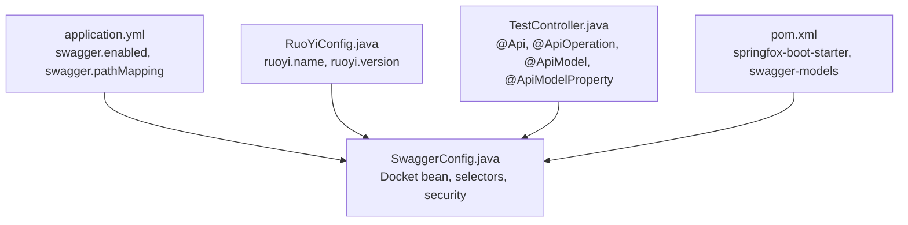
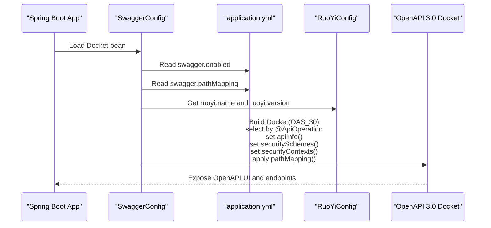
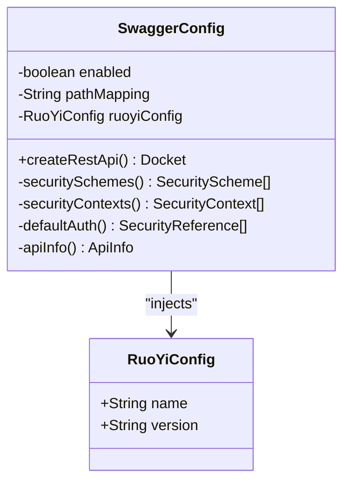
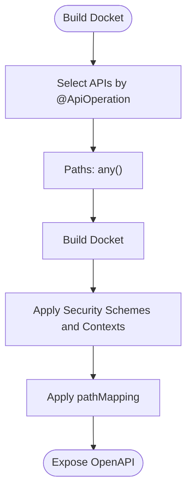
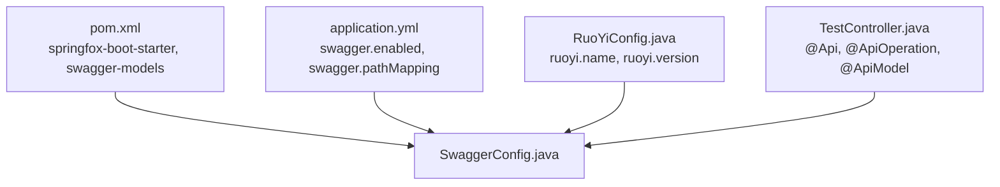

# Swagger Configuration

<cite>
**Referenced Files in This Document**
- [SwaggerConfig.java](file://src/main/java/com/ruoyi/framework/config/SwaggerConfig.java)
- [application.yml](file://src/main/resources/application.yml)
- [RuoYiConfig.java](file://src/main/java/com/ruoyi/framework/config/RuoYiConfig.java)
- [TestController.java](file://src/main/java/com/ruoyi/project/tool/swagger/TestController.java)
- [pom.xml](file://pom.xml)
</cite>

## Table of Contents
1. [Introduction](#introduction)
2. [Project Structure](#project-structure)
3. [Core Components](#core-components)
4. [Architecture Overview](#architecture-overview)
5. [Detailed Component Analysis](#detailed-component-analysis)
6. [Dependency Analysis](#dependency-analysis)
7. [Performance Considerations](#performance-considerations)
8. [Troubleshooting Guide](#troubleshooting-guide)
9. [Conclusion](#conclusion)
10. [Appendices](#appendices)

## Introduction
This document explains the Swagger/OpenAPI 3.0 configuration in RuoYi-Vue. It covers how Swagger is enabled/disabled and mapped via application.yml, how the Docket bean is created in SwaggerConfig, how API metadata is populated from RuoYiConfig, how endpoints are selected using annotations, and how security is configured for Authorization headers. It also provides guidance on extending documentation with custom models and operation descriptions, and best practices for securing Swagger in production.

## Project Structure
Swagger-related configuration is centralized in a dedicated configuration class and application properties. Controllers that expose endpoints for documentation use Swagger annotations.

**Diagram sources**
- [application.yml](file://src/main/resources/application.yml#L115-L121)
- [SwaggerConfig.java](file://src/main/java/com/ruoyi/framework/config/SwaggerConfig.java#L36-L42)
- [RuoYiConfig.java](file://src/main/java/com/ruoyi/framework/config/RuoYiConfig.java#L11-L20)
- [TestController.java](file://src/main/java/com/ruoyi/project/tool/swagger/TestController.java#L18-L33)
- [pom.xml](file://pom.xml#L170-L188)

**Section sources**
- [application.yml](file://src/main/resources/application.yml#L115-L121)
- [SwaggerConfig.java](file://src/main/java/com/ruoyi/framework/config/SwaggerConfig.java#L36-L42)
- [RuoYiConfig.java](file://src/main/java/com/ruoyi/framework/config/RuoYiConfig.java#L11-L20)
- [TestController.java](file://src/main/java/com/ruoyi/project/tool/swagger/TestController.java#L18-L33)
- [pom.xml](file://pom.xml#L170-L188)

## Core Components
- SwaggerConfig: Creates the OpenAPI 3.0 Docket bean, selects endpoints by annotation, configures API info, security schemes, and path mapping.
- application.yml: Controls whether Swagger is enabled and sets the pathMapping prefix.
- RuoYiConfig: Supplies dynamic metadata (name and version) for the API info.
- TestController: Demonstrates Swagger annotations for documenting endpoints and models.

**Section sources**
- [SwaggerConfig.java](file://src/main/java/com/ruoyi/framework/config/SwaggerConfig.java#L47-L68)
- [application.yml](file://src/main/resources/application.yml#L115-L121)
- [RuoYiConfig.java](file://src/main/java/com/ruoyi/framework/config/RuoYiConfig.java#L11-L20)
- [TestController.java](file://src/main/java/com/ruoyi/project/tool/swagger/TestController.java#L18-L33)

## Architecture Overview
The Swagger configuration integrates with Spring Boot’s auto-configuration via a Docket bean. The configuration reads application.yml for toggling and path mapping, injects RuoYiConfig for metadata, and applies security schemes and contexts.

**Diagram sources**
- [SwaggerConfig.java](file://src/main/java/com/ruoyi/framework/config/SwaggerConfig.java#L36-L68)
- [application.yml](file://src/main/resources/application.yml#L115-L121)
- [RuoYiConfig.java](file://src/main/java/com/ruoyi/framework/config/RuoYiConfig.java#L11-L20)

## Detailed Component Analysis

### Swagger Settings in application.yml
- enabled: Controls whether Swagger is active. When false, the Docket is disabled.
- pathMapping: Sets a global URL prefix for all documented endpoints.

These properties are injected into SwaggerConfig and applied to the Docket.

**Section sources**
- [application.yml](file://src/main/resources/application.yml#L115-L121)
- [SwaggerConfig.java](file://src/main/java/com/ruoyi/framework/config/SwaggerConfig.java#L36-L42)

### SwaggerConfig Implementation
- Docket creation: Uses OpenAPI 3.0 (OAS_30) and enables/disables based on the enabled property.
- Endpoint selection: Scans only methods annotated with @ApiOperation, ensuring only documented endpoints appear in the UI.
- API info: Populates title, description, contact, and version from RuoYiConfig.
- Security scheme: Adds an ApiKey scheme named "Authorization" expecting the token in the Authorization header.
- Security context: Applies the Authorization scheme to all paths matching "/.*".
- Default authorization scope: Defines a global scope with a description indicating broad access.
- Path mapping: Applies the configured pathMapping prefix to all documented endpoints.

**Diagram sources**
- [SwaggerConfig.java](file://src/main/java/com/ruoyi/framework/config/SwaggerConfig.java#L36-L124)
- [RuoYiConfig.java](file://src/main/java/com/ruoyi/framework/config/RuoYiConfig.java#L11-L20)

**Section sources**
- [SwaggerConfig.java](file://src/main/java/com/ruoyi/framework/config/SwaggerConfig.java#L47-L68)
- [SwaggerConfig.java](file://src/main/java/com/ruoyi/framework/config/SwaggerConfig.java#L73-L78)
- [SwaggerConfig.java](file://src/main/java/com/ruoyi/framework/config/SwaggerConfig.java#L83-L92)
- [SwaggerConfig.java](file://src/main/java/com/ruoyi/framework/config/SwaggerConfig.java#L97-L105)
- [SwaggerConfig.java](file://src/main/java/com/ruoyi/framework/config/SwaggerConfig.java#L110-L123)

### API Info Configuration
- Title and description are set programmatically.
- Contact is derived from RuoYiConfig.name.
- Version is derived from RuoYiConfig.version.

This ensures the API documentation reflects the project’s metadata consistently.

**Section sources**
- [SwaggerConfig.java](file://src/main/java/com/ruoyi/framework/config/SwaggerConfig.java#L110-L123)
- [RuoYiConfig.java](file://src/main/java/com/ruoyi/framework/config/RuoYiConfig.java#L11-L20)

### API Selection Strategy
Endpoints are included only if they are annotated with @ApiOperation. This selective scanning ensures that only intentionally documented endpoints appear in the Swagger UI.

**Diagram sources**
- [SwaggerConfig.java](file://src/main/java/com/ruoyi/framework/config/SwaggerConfig.java#L56-L67)

**Section sources**
- [SwaggerConfig.java](file://src/main/java/com/ruoyi/framework/config/SwaggerConfig.java#L56-L63)

### Security Scheme and Context
- Security scheme: ApiKey named "Authorization" passed in the Authorization header.
- Security context: Applies the Authorization scheme to all paths matching "/.*".
- Default authorization scope: "global" with a description indicating broad access.

This setup prompts clients to provide an Authorization header when testing endpoints in the Swagger UI.

**Section sources**
- [SwaggerConfig.java](file://src/main/java/com/ruoyi/framework/config/SwaggerConfig.java#L73-L78)
- [SwaggerConfig.java](file://src/main/java/com/ruoyi/framework/config/SwaggerConfig.java#L83-L92)
- [SwaggerConfig.java](file://src/main/java/com/ruoyi/framework/config/SwaggerConfig.java#L97-L105)

### Applying pathMapping to Docket
The configured pathMapping is applied to the Docket so that all documented endpoints are prefixed accordingly. This allows grouping endpoints under a specific base path in the UI.

**Section sources**
- [SwaggerConfig.java](file://src/main/java/com/ruoyi/framework/config/SwaggerConfig.java#L67-L67)
- [application.yml](file://src/main/resources/application.yml#L115-L121)

### Extending Swagger Documentation with Custom Models and Operation Descriptions
Controllers demonstrate how to enrich documentation:
- @Api on the controller to group endpoints.
- @ApiOperation on methods to describe operations.
- @ApiImplicitParam/@ApiImplicitParams to document parameters.
- @ApiModel/@ApiModelProperty on models to describe request/response bodies.

These annotations are scanned by the Docket selector to populate the OpenAPI UI.

**Section sources**
- [TestController.java](file://src/main/java/com/ruoyi/project/tool/swagger/TestController.java#L18-L33)
- [TestController.java](file://src/main/java/com/ruoyi/project/tool/swagger/TestController.java#L40-L47)
- [TestController.java](file://src/main/java/com/ruoyi/project/tool/swagger/TestController.java#L48-L52)
- [TestController.java](file://src/main/java/com/ruoyi/project/tool/swagger/TestController.java#L63-L71)
- [TestController.java](file://src/main/java/com/ruoyi/project/tool/swagger/TestController.java#L81-L97)
- [TestController.java](file://src/main/java/com/ruoyi/project/tool/swagger/TestController.java#L98-L101)
- [TestController.java](file://src/main/java/com/ruoyi/project/tool/swagger/TestController.java#L115-L127)

## Dependency Analysis
Swagger is integrated via Springfox Boot Starter and a compatible swagger-models artifact. The configuration depends on:
- application.yml for runtime toggles and path mapping
- RuoYiConfig for dynamic metadata
- Swagger annotations in controllers for endpoint documentation

**Diagram sources**
- [pom.xml](file://pom.xml#L170-L188)
- [application.yml](file://src/main/resources/application.yml#L115-L121)
- [RuoYiConfig.java](file://src/main/java/com/ruoyi/framework/config/RuoYiConfig.java#L11-L20)
- [TestController.java](file://src/main/java/com/ruoyi/project/tool/swagger/TestController.java#L18-L33)
- [SwaggerConfig.java](file://src/main/java/com/ruoyi/framework/config/SwaggerConfig.java#L47-L68)

**Section sources**
- [pom.xml](file://pom.xml#L170-L188)
- [application.yml](file://src/main/resources/application.yml#L115-L121)
- [RuoYiConfig.java](file://src/main/java/com/ruoyi/framework/config/RuoYiConfig.java#L11-L20)
- [TestController.java](file://src/main/java/com/ruoyi/project/tool/swagger/TestController.java#L18-L33)
- [SwaggerConfig.java](file://src/main/java/com/ruoyi/framework/config/SwaggerConfig.java#L47-L68)

## Performance Considerations
- Keep swagger.enabled false in production to avoid exposing documentation and reduce overhead.
- Use selective endpoint scanning (@ApiOperation) to minimize documentation surface and parsing cost.
- Avoid excessive pathMappings that could complicate routing and increase maintenance overhead.

[No sources needed since this section provides general guidance]

## Troubleshooting Guide
- Swagger UI not appearing:
  - Verify swagger.enabled is true in application.yml.
  - Confirm the Docket is enabled in SwaggerConfig.
- Endpoints missing from Swagger UI:
  - Ensure methods are annotated with @ApiOperation.
  - Confirm the Docket selector is set to scan by @ApiOperation.
- Authorization header not recognized:
  - Confirm the Authorization header is set in the Swagger UI.
  - Verify the security scheme and context are applied to all paths.
- Version/name mismatch in documentation:
  - Ensure ruoyi.name and ruoyi.version are correctly set in application.yml and consumed by RuoYiConfig.

**Section sources**
- [application.yml](file://src/main/resources/application.yml#L115-L121)
- [SwaggerConfig.java](file://src/main/java/com/ruoyi/framework/config/SwaggerConfig.java#L56-L67)
- [SwaggerConfig.java](file://src/main/java/com/ruoyi/framework/config/SwaggerConfig.java#L73-L78)
- [SwaggerConfig.java](file://src/main/java/com/ruoyi/framework/config/SwaggerConfig.java#L83-L92)
- [RuoYiConfig.java](file://src/main/java/com/ruoyi/framework/config/RuoYiConfig.java#L11-L20)

## Conclusion
RuoYi-Vue’s Swagger configuration centers on a Docket bean that selectively exposes endpoints annotated with @ApiOperation, dynamically populates API metadata from RuoYiConfig, and secures endpoints via an Authorization header scheme. The pathMapping setting provides a convenient base path for grouped endpoints. For production, keep swagger.enabled disabled and restrict access to internal networks or CI/CD environments.

[No sources needed since this section summarizes without analyzing specific files]

## Appendices

### Best Practices for Securing Swagger in Production
- Disable Swagger in production by setting swagger.enabled to false.
- Restrict access to internal networks or VPN.
- Use role-based access controls or IP whitelisting for the Swagger UI route.
- Rotate secrets and tokens regularly; avoid embedding sensitive credentials in documentation.
- Remove or hide sensitive endpoints from documentation by not annotating them with @ApiOperation.

[No sources needed since this section provides general guidance]