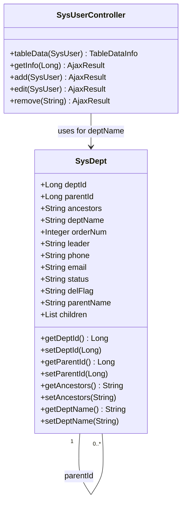
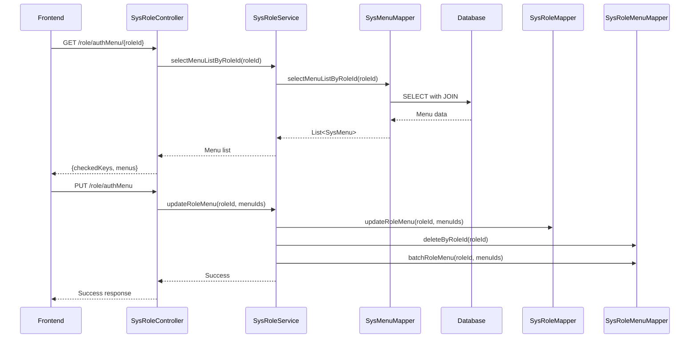
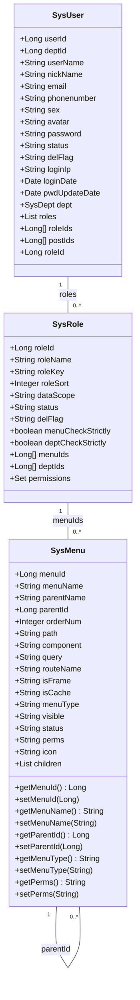
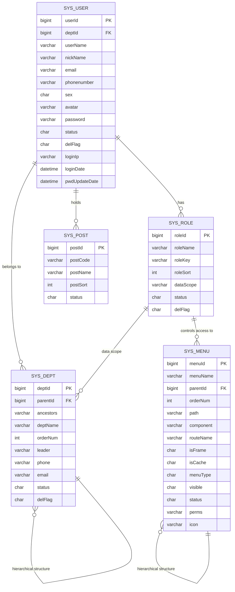

# Core Modules

<cite>
**Referenced Files in This Document**   
- [SysUserController.java](file://src/main/java/com/ruoyi/project/system/controller/SysUserController.java)
- [SysRoleController.java](file://src/main/java/com/ruoyi/project/system/controller/SysRoleController.java)
- [SysDeptController.java](file://src/main/java/com/ruoyi/project/system/controller/SysDeptController.java)
- [SysMenuController.java](file://src/main/java/com/ruoyi/project/system/controller/SysMenuController.java)
- [SysPostController.java](file://src/main/java/com/ruoyi/project/system/controller/SysPostController.java)
- [SysUser.java](file://src/main/java/com/ruoyi/project/system/domain/SysUser.java)
- [SysRole.java](file://src/main/java/com/ruoyi/project/system/domain/SysRole.java)
- [SysDept.java](file://src/main/java/com/ruoyi/project/system/domain/SysDept.java)
- [SysMenu.java](file://src/main/java/com/ruoyi/project/system/domain/SysMenu.java)
- [SysPost.java](file://src/main/java/com/ruoyi/project/system/domain/SysPost.java)
- [SysUserMapper.java](file://src/main/java/com/ruoyi/project/system/mapper/SysUserMapper.java)
- [SysRoleMapper.java](file://src/main/java/com/ruoyi/project/system/mapper/SysRoleMapper.java)
- [SysDeptMapper.java](file://src/main/java/com/ruoyi/project/system/mapper/SysDeptMapper.java)
- [SysMenuMapper.java](file://src/main/java/com/ruoyi/project/system/mapper/SysMenuMapper.java)
- [SysPostMapper.java](file://src/main/java/com/ruoyi/project/system/mapper/SysPostMapper.java)
- [SysUserServiceImpl.java](file://src/main/java/com/ruoyi/project/system/service/impl/SysUserServiceImpl.java)
- [SysRoleServiceImpl.java](file://src/main/java/com/ruoyi/project/system/service/impl/SysRoleServiceImpl.java)
- [SysDeptServiceImpl.java](file://src/main/java/com/ruoyi/project/system/service/impl/SysDeptServiceImpl.java)
- [SysMenuServiceImpl.java](file://src/main/java/com/ruoyi/project/system/service/impl/SysMenuServiceImpl.java)
- [SysPostServiceImpl.java](file://src/main/java/com/ruoyi/project/system/service/impl/SysPostServiceImpl.java)
</cite>

## Table of Contents
1. [User Management](#user-management)
2. [Department Management](#department-management)
3. [Role Management](#role-management)
4. [Menu Management](#menu-management)
5. [Post Management](#post-management)
6. [Module Integration and Data Relationships](#module-integration-and-data-relationships)
7. [Common Usage Patterns](#common-usage-patterns)

## User Management

The User Management module serves as the central component for managing system users in RuoYi-Vue. It provides comprehensive CRUD operations through the `SysUserController` which exposes RESTful endpoints for user creation, modification, deletion, and querying. The controller extends `BaseController`, inheriting pagination and response handling capabilities.

The `SysUser` entity contains essential user attributes including username, nickname, email, phone number, and status, with validation annotations ensuring data integrity. Key relationships are established through associated entities: users are linked to departments via `deptId`, to roles through the `SysUserRole` junction table, and to posts via `SysUserPost`. The implementation includes special logic for admin users, where a user with `userId = 1` is automatically considered an administrator with elevated privileges.

RESTful endpoints in `SysUserController` follow standard conventions with `GET /list` for retrieval with pagination, `POST /` for creation, `PUT /` for updates, and `DELETE /{userIds}` for deletion. The controller also provides specialized endpoints for user profile management and password modification.

**Section sources**
- [SysUserController.java](file://src/main/java/com/ruoyi/project/system/controller/SysUserController.java#L1-L500)
- [SysUser.java](file://src/main/java/com/ruoyi/project/system/domain/SysUser.java#L1-L341)
- [SysUserMapper.java](file://src/main/java/com/ruoyi/project/system/mapper/SysUserMapper.java#L1-L100)
- [SysUserServiceImpl.java](file://src/main/java/com/ruoyi/project/system/service/impl/SysUserServiceImpl.java#L1-L400)

## Department Management

The Department Management module implements a hierarchical organizational structure through the `SysDept` entity, which supports tree-like relationships using `parentId` and `ancestors` fields. The `ancestors` field stores a comma-separated list of parent department IDs, enabling efficient querying of department hierarchies without recursive database calls.

The `SysDeptController` provides standard CRUD operations with additional functionality for managing department trees. A key feature is the department tree visualization endpoint that structures departments in a nested format suitable for UI tree components. The controller enforces business rules such as preventing circular references in the department hierarchy and validating department names for uniqueness within the same parent.

Departments serve as organizational containers for users and play a crucial role in data scope permissions. The module integrates with role management through data scope configurations, where roles can be assigned data access limited to specific departments. Validation ensures department names are not empty and phone numbers and emails conform to expected formats.

**Diagram sources**
- [SysDept.java](file://src/main/java/com/ruoyi/project/system/domain/SysDept.java#L1-L204)
- [SysDeptController.java](file://src/main/java/com/ruoyi/project/system/controller/SysDeptController.java#L1-L300)

**Section sources**
- [SysDeptController.java](file://src/main/java/com/ruoyi/project/system/controller/SysDeptController.java#L1-L300)
- [SysDept.java](file://src/main/java/com/ruoyi/project/system/domain/SysDept.java#L1-L204)
- [SysDeptMapper.java](file://src/main/java/com/ruoyi/project/system/mapper/SysDeptMapper.java#L1-L80)
- [SysDeptServiceImpl.java](file://src/main/java/com/ruoyi/project/system/service/impl/SysDeptServiceImpl.java#L1-L350)

## Role Management

The Role Management module provides role-based access control (RBAC) through the `SysRole` entity and `SysRoleController`. Roles represent collections of permissions that can be assigned to users, simplifying permission management at scale. Each role has a unique `roleKey` used in security checks and a `dataScope` attribute that determines the extent of data access granted to users with that role.

The `SysRoleController` exposes endpoints for managing roles and their associations with menus and departments. A key feature is the ability to configure menu permissions for roles through the `authRole` and `authDataScope` endpoints. The controller supports batch operations for assigning roles to multiple users simultaneously.

The `SysRole` entity includes strict validation for role names and keys, ensuring they meet length requirements and are not empty. The implementation distinguishes between different data scope types: all data, custom data, department-specific data, department and sub-department data, and personal data only. This allows fine-grained control over what data users can access based on their roles.

**Diagram sources**
- [SysRoleController.java](file://src/main/java/com/ruoyi/project/system/controller/SysRoleController.java#L1-L400)
- [SysRole.java](file://src/main/java/com/ruoyi/project/system/domain/SysRole.java#L1-L242)

**Section sources**
- [SysRoleController.java](file://src/main/java/com/ruoyi/project/system/controller/SysRoleController.java#L1-L400)
- [SysRole.java](file://src/main/java/com/ruoyi/project/system/domain/SysRole.java#L1-L242)
- [SysRoleMapper.java](file://src/main/java/com/ruoyi/project/system/mapper/SysRoleMapper.java#L1-L120)
- [SysRoleServiceImpl.java](file://src/main/java/com/ruoyi/project/system/service/impl/SysRoleServiceImpl.java#L1-L450)

## Menu Management

The Menu Management module controls the application's navigation structure and permission system through the `SysMenu` entity. Menus represent both visible navigation items and underlying permissions, with the `perms` field defining the permission string used for authorization checks. The hierarchical structure supports three types: directories (M), menus (C), and buttons (F), enabling a comprehensive permission model.

The `SysMenuController` provides full CRUD operations with specialized endpoints for retrieving menu trees used in the application's sidebar navigation. Menus are organized hierarchically using `parentId`, and the service layer constructs nested menu structures optimized for frontend rendering. Each menu can have properties such as routing configuration (`path`, `component`), visibility, caching behavior, and icon.

A key integration point is with role management, where administrators can assign menu permissions to roles. The implementation includes logic to generate appropriate router configurations for Vue.js, including route names and component paths. Validation ensures menu names are provided and types are specified, maintaining data integrity.

**Diagram sources**
- [SysMenu.java](file://src/main/java/com/ruoyi/project/system/domain/SysMenu.java#L1-L275)
- [SysMenuController.java](file://src/main/java/com/ruoyi/project/system/controller/SysMenuController.java#L1-L350)

**Section sources**
- [SysMenuController.java](file://src/main/java/com/ruoyi/project/system/controller/SysMenuController.java#L1-L350)
- [SysMenu.java](file://src/main/java/com/ruoyi/project/system/domain/SysMenu.java#L1-L275)
- [SysMenuMapper.java](file://src/main/java/com/ruoyi/project/system/mapper/SysMenuMapper.java#L1-L100)
- [SysMenuServiceImpl.java](file://src/main/java/com/ruoyi/project/system/service/impl/SysMenuServiceImpl.java#L1-L400)

## Post Management

The Post Management module handles job position management through the `SysPost` entity and `SysPostController`. Posts represent organizational roles or positions that users can hold within departments. Unlike roles which are primarily for permissions, posts represent actual job functions within the organization.

The `SysPost` entity includes basic post information such as post code, name, and status. The controller provides standard CRUD operations with validation ensuring post codes and names are not empty and meet length requirements. Posts are linked to users through the `SysUserPost` junction table, allowing users to be assigned to one or more posts.

The implementation is relatively straightforward compared to other modules, focusing on maintaining a catalog of valid positions within the organization. Posts can be enabled or disabled using the status field, and sorting is supported for consistent display order. The module integrates with user management, allowing administrators to assign posts to users during user creation or editing.

**Section sources**
- [SysPostController.java](file://src/main/java/com/ruoyi/project/system/controller/SysPostController.java#L1-L200)
- [SysPost.java](file://src/main/java/com/ruoyi/project/system/domain/SysPost.java#L1-L125)
- [SysPostMapper.java](file://src/main/java/com/ruoyi/project/system/mapper/SysPostMapper.java#L1-L60)
- [SysPostServiceImpl.java](file://src/main/java/com/ruoyi/project/system/service/impl/SysPostServiceImpl.java#L1-L200)

## Module Integration and Data Relationships

The core modules in RuoYi-Vue are tightly integrated through a well-defined data model that supports enterprise-level user management and permission control. The central entity is `SysUser`, which connects to other modules through foreign key relationships and junction tables.

Users are assigned to departments via the `deptId` field in `SysUser`, establishing their organizational placement. The hierarchical department structure allows users to inherit permissions and policies from parent departments. Users are granted permissions through role assignments using the `SysUserRole` junction table, which enables a user to have multiple roles.

Roles are connected to menus through the `SysRoleMenu` table, defining what menu items and functionality users with those roles can access. Similarly, roles are linked to departments through `SysRoleDept` for data scope permissions, controlling which departmental data users can view based on their roles.

Posts are associated with users through the `SysUserPost` table, allowing users to hold multiple positions. This multi-assignment capability supports complex organizational structures where users may have multiple responsibilities.

The integration between modules enables sophisticated permission scenarios:
- A user's accessible menus are determined by their assigned roles
- Data visibility is controlled by role data scope settings combined with department hierarchy
- Permission checks use the `perms` field from menus, evaluated against a user's effective permissions
- User profile information aggregates data from user, department, role, and post entities

**Diagram sources**
- [SysUser.java](file://src/main/java/com/ruoyi/project/system/domain/SysUser.java#L1-L341)
- [SysDept.java](file://src/main/java/com/ruoyi/project/system/domain/SysDept.java#L1-L204)
- [SysRole.java](file://src/main/java/com/ruoyi/project/system/domain/SysRole.java#L1-L242)
- [SysMenu.java](file://src/main/java/com/ruoyi/project/system/domain/SysMenu.java#L1-L275)
- [SysPost.java](file://src/main/java/com/ruoyi/project/system/domain/SysPost.java#L1-L125)

## Common Usage Patterns

The RuoYi-Vue core modules support several common usage patterns for system administration:

**Creating Users**: The process begins with the `SysUserController.add()` method, which validates user data and checks for uniqueness of username, email, and phone number. The user is assigned to a department and optionally assigned roles and posts. Passwords are encrypted before storage.

**Assigning Roles**: Role assignment occurs through the `SysUserController.edit()` method or the dedicated role authorization endpoints. When roles are assigned, the system updates the `SysUserRole` junction table and refreshes the user's permissions cache.

**Configuring Menu Permissions**: Administrators configure menu permissions through the role authorization interface, which calls `SysRoleController.updateRoleMenu()`. This updates the `SysRoleMenu` table and rebuilds the permission cache for affected roles.

**Managing Hierarchical Data**: Both departments and menus support tree structures. The system uses the `ancestors` field to store parent hierarchies, enabling efficient queries for all descendants or ancestors without recursive database operations.

**Permission Evaluation**: During authentication, the system collects all permissions from a user's roles, including menu permissions and custom permissions. These are stored in the security context and used for `@PreAuthorize` annotations and frontend menu filtering.

These patterns demonstrate the cohesive design of the RuoYi-Vue framework, where consistent patterns across modules simplify development and maintenance while providing robust enterprise functionality.

**Section sources**
- [SysUserController.java](file://src/main/java/com/ruoyi/project/system/controller/SysUserController.java#L150-L300)
- [SysRoleController.java](file://src/main/java/com/ruoyi/project/system/controller/SysRoleController.java#L200-L400)
- [SysMenuController.java](file://src/main/java/com/ruoyi/project/system/controller/SysMenuController.java#L100-L250)
- [SysDeptServiceImpl.java](file://src/main/java/com/ruoyi/project/system/service/impl/SysDeptServiceImpl.java#L200-L300)