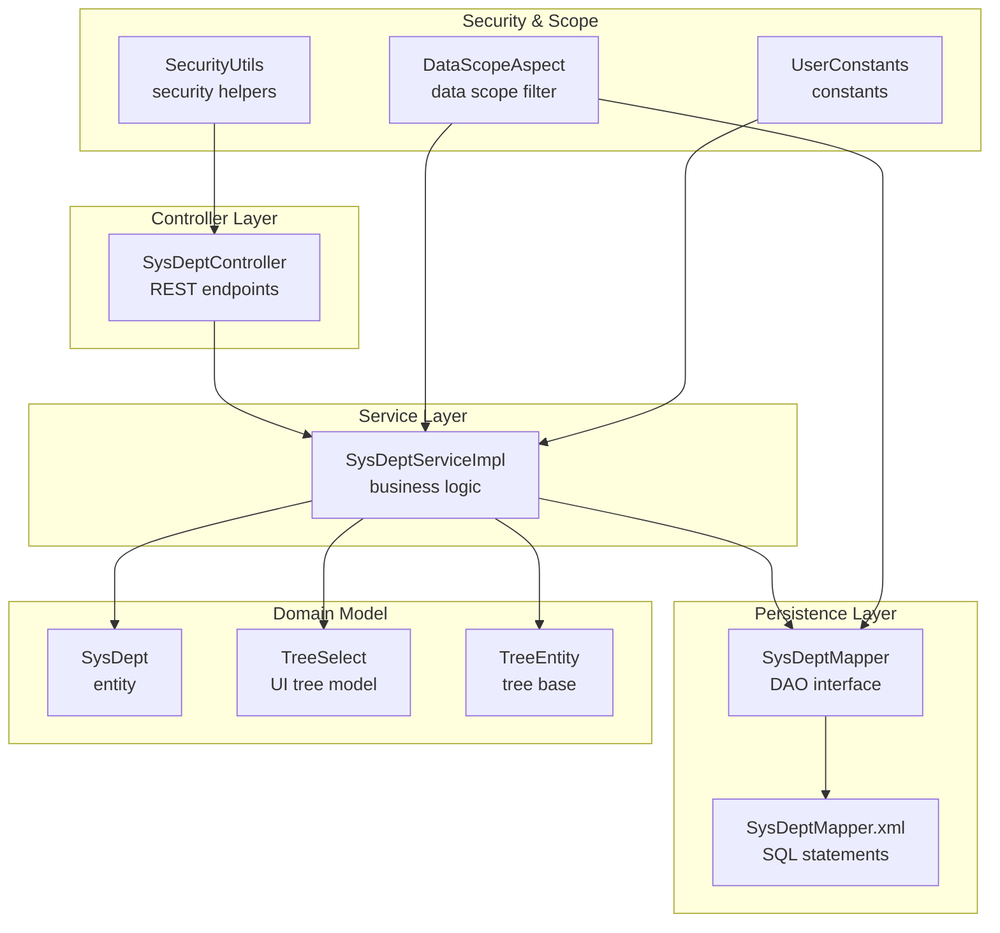
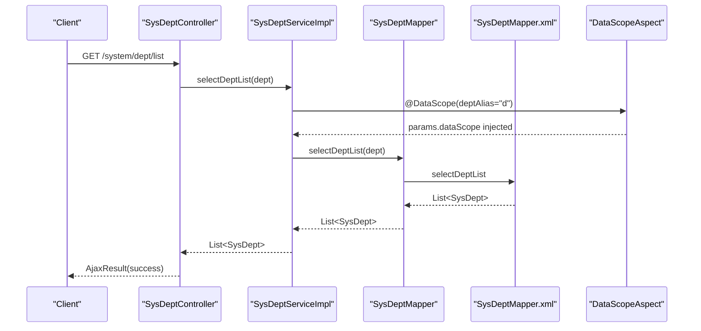
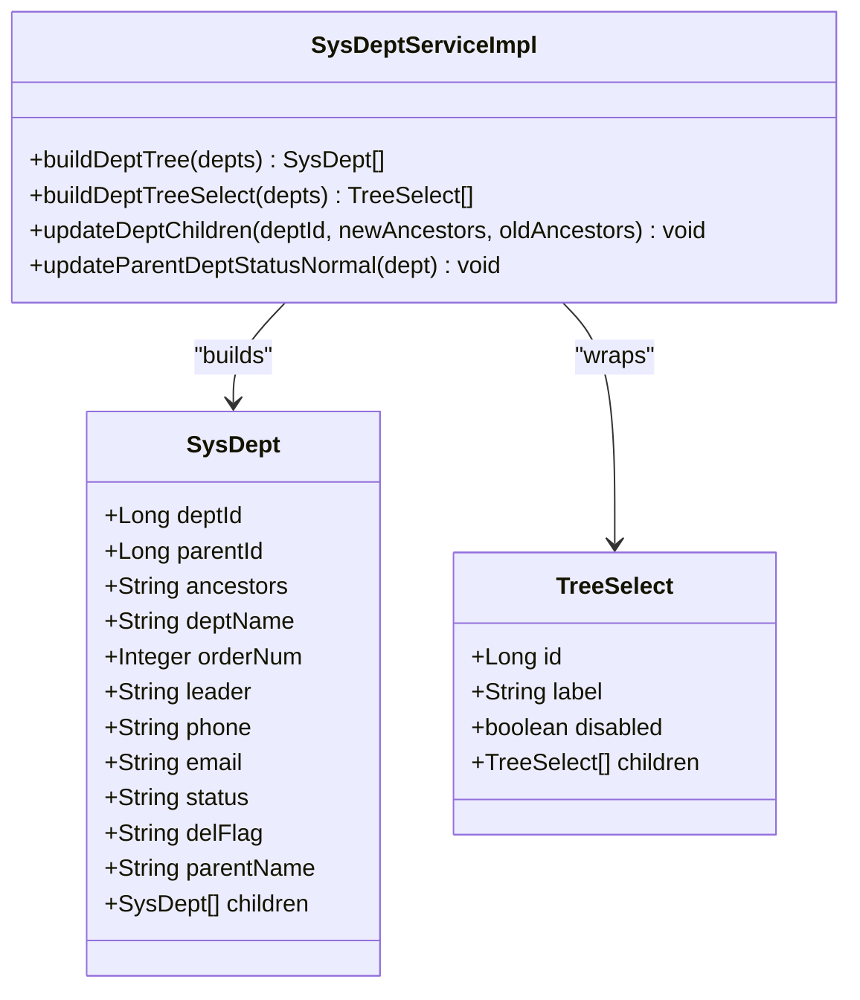
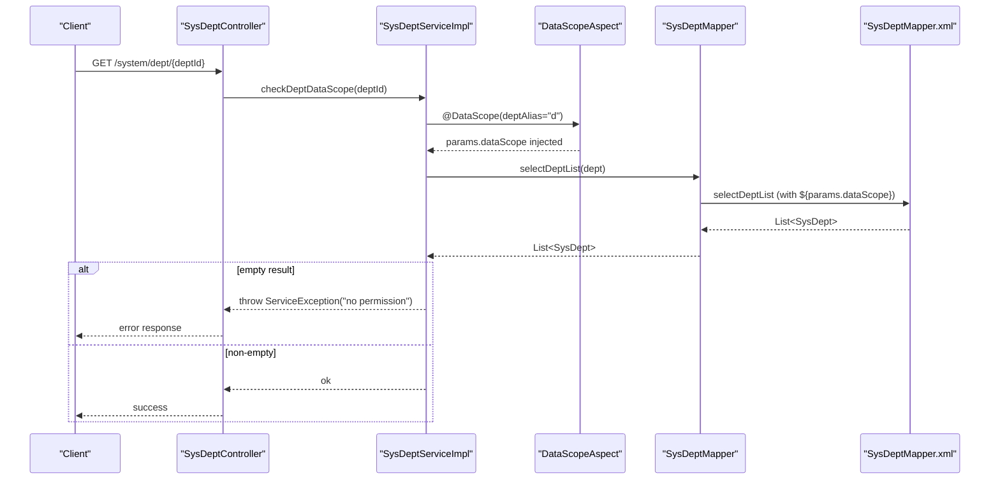
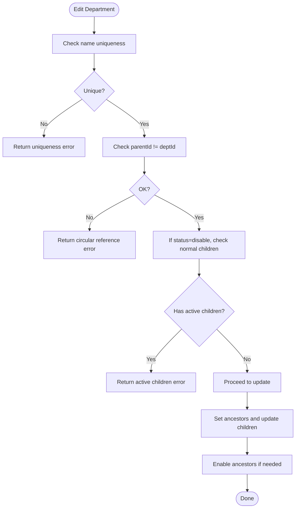
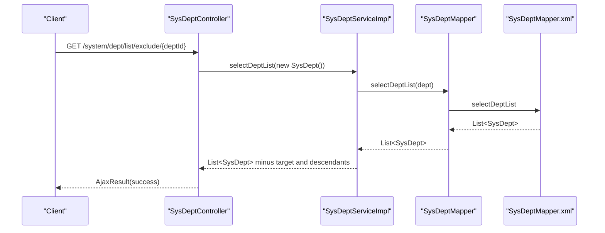
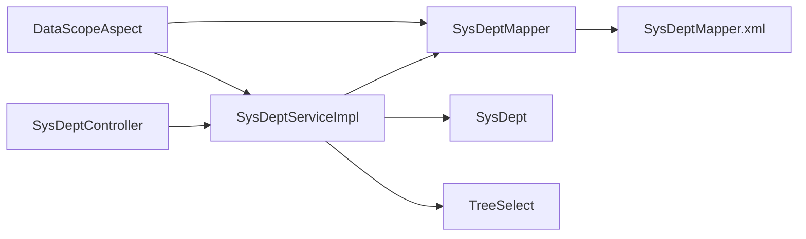

# Department Management

<cite>
**Referenced Files in This Document**
- [SysDeptController.java](file://src/main/java/com/ruoyi/project/system/controller/SysDeptController.java)
- [SysDeptServiceImpl.java](file://src/main/java/com/ruoyi/project/system/service/impl/SysDeptServiceImpl.java)
- [SysDept.java](file://src/main/java/com/ruoyi/project/system/domain/SysDept.java)
- [SysDeptMapper.java](file://src/main/java/com/ruoyi/project/system/mapper/SysDeptMapper.java)
- [SysDeptMapper.xml](file://src/main/resources/mybatis/system/SysDeptMapper.xml)
- [DataScopeAspect.java](file://src/main/java/com/ruoyi/framework/aspectj/DataScopeAspect.java)
- [TreeSelect.java](file://src/main/java/com/ruoyi/framework/web/domain/TreeSelect.java)
- [TreeEntity.java](file://src/main/java/com/ruoyi/framework/web/domain/TreeEntity.java)
- [UserConstants.java](file://src/main/java/com/ruoyi/common/constant/UserConstants.java)
- [SecurityUtils.java](file://src/main/java/com/ruoyi/common/utils/SecurityUtils.java)
</cite>

## Table of Contents
1. [Introduction](#introduction)
2. [Project Structure](#project-structure)
3. [Core Components](#core-components)
4. [Architecture Overview](#architecture-overview)
5. [Detailed Component Analysis](#detailed-component-analysis)
6. [Dependency Analysis](#dependency-analysis)
7. [Performance Considerations](#performance-considerations)
8. [Troubleshooting Guide](#troubleshooting-guide)
9. [Conclusion](#conclusion)

## Introduction
This document explains the Department Management module in the RuoYi-Vue project. It focuses on the hierarchical department structure represented as a tree with parent-child relationships and ancestor tracking, the RESTful endpoints for CRUD operations, business rules for safe updates and deletions, and integration with data scope permissions and user/role modules. It also covers the excludeChild endpoint used by UI tree components and provides guidance for common use cases such as restructuring organizational hierarchy and troubleshooting deletion constraints.

## Project Structure
The Department Management module spans the controller, service, persistence, and domain layers, plus data scope filtering and UI tree models.

**Diagram sources**
- [SysDeptController.java](file://src/main/java/com/ruoyi/project/system/controller/SysDeptController.java#L1-L133)
- [SysDeptServiceImpl.java](file://src/main/java/com/ruoyi/project/system/service/impl/SysDeptServiceImpl.java#L1-L339)
- [SysDeptMapper.java](file://src/main/java/com/ruoyi/project/system/mapper/SysDeptMapper.java#L1-L119)
- [SysDeptMapper.xml](file://src/main/resources/mybatis/system/SysDeptMapper.xml#L1-L159)
- [SysDept.java](file://src/main/java/com/ruoyi/project/system/domain/SysDept.java#L1-L204)
- [TreeSelect.java](file://src/main/java/com/ruoyi/framework/web/domain/TreeSelect.java#L1-L94)
- [TreeEntity.java](file://src/main/java/com/ruoyi/framework/web/domain/TreeEntity.java#L1-L79)
- [DataScopeAspect.java](file://src/main/java/com/ruoyi/framework/aspectj/DataScopeAspect.java#L1-L185)
- [UserConstants.java](file://src/main/java/com/ruoyi/common/constant/UserConstants.java#L1-L82)
- [SecurityUtils.java](file://src/main/java/com/ruoyi/common/utils/SecurityUtils.java#L1-L177)

**Section sources**
- [SysDeptController.java](file://src/main/java/com/ruoyi/project/system/controller/SysDeptController.java#L1-L133)
- [SysDeptServiceImpl.java](file://src/main/java/com/ruoyi/project/system/service/impl/SysDeptServiceImpl.java#L1-L339)
- [SysDeptMapper.java](file://src/main/java/com/ruoyi/project/system/mapper/SysDeptMapper.java#L1-L119)
- [SysDeptMapper.xml](file://src/main/resources/mybatis/system/SysDeptMapper.xml#L1-L159)
- [SysDept.java](file://src/main/java/com/ruoyi/project/system/domain/SysDept.java#L1-L204)
- [TreeSelect.java](file://src/main/java/com/ruoyi/framework/web/domain/TreeSelect.java#L1-L94)
- [TreeEntity.java](file://src/main/java/com/ruoyi/framework/web/domain/TreeEntity.java#L1-L79)
- [DataScopeAspect.java](file://src/main/java/com/ruoyi/framework/aspectj/DataScopeAspect.java#L1-L185)
- [UserConstants.java](file://src/main/java/com/ruoyi/common/constant/UserConstants.java#L1-L82)
- [SecurityUtils.java](file://src/main/java/com/ruoyi/common/utils/SecurityUtils.java#L1-L177)

## Core Components
- Controller: Exposes REST endpoints for list, get by id, add, edit, and delete. Enforces permissions and applies business rules.
- Service: Implements tree building, ancestor propagation, uniqueness checks, data scope enforcement, and safety constraints for updates/deletes.
- Mapper/DAO: Provides SQL queries for list, tree selection, existence checks, and updates.
- Domain: SysDept entity holds deptId, parentId, ancestors, and UI tree children.
- UI Tree Model: TreeSelect wraps SysDept for rendering tree UIs with disabled nodes when departments are inactive.
- Data Scope: DataScopeAspect injects SQL filters based on roles and user’s department scope.

**Section sources**
- [SysDeptController.java](file://src/main/java/com/ruoyi/project/system/controller/SysDeptController.java#L1-L133)
- [SysDeptServiceImpl.java](file://src/main/java/com/ruoyi/project/system/service/impl/SysDeptServiceImpl.java#L1-L339)
- [SysDeptMapper.java](file://src/main/java/com/ruoyi/project/system/mapper/SysDeptMapper.java#L1-L119)
- [SysDeptMapper.xml](file://src/main/resources/mybatis/system/SysDeptMapper.xml#L1-L159)
- [SysDept.java](file://src/main/java/com/ruoyi/project/system/domain/SysDept.java#L1-L204)
- [TreeSelect.java](file://src/main/java/com/ruoyi/framework/web/domain/TreeSelect.java#L1-L94)
- [DataScopeAspect.java](file://src/main/java/com/ruoyi/framework/aspectj/DataScopeAspect.java#L1-L185)

## Architecture Overview
The module follows a layered architecture with explicit separation of concerns:
- REST endpoints in the controller enforce permissions and delegate to the service.
- The service orchestrates domain logic, including tree construction and ancestor propagation.
- The mapper maps to SQL via MyBatis, applying data scope filters injected by the aspect.
- UI tree components consume the service-provided tree structures.

**Diagram sources**
- [SysDeptController.java](file://src/main/java/com/ruoyi/project/system/controller/SysDeptController.java#L1-L133)
- [SysDeptServiceImpl.java](file://src/main/java/com/ruoyi/project/system/service/impl/SysDeptServiceImpl.java#L1-L339)
- [SysDeptMapper.java](file://src/main/java/com/ruoyi/project/system/mapper/SysDeptMapper.java#L1-L119)
- [SysDeptMapper.xml](file://src/main/resources/mybatis/system/SysDeptMapper.xml#L1-L159)
- [DataScopeAspect.java](file://src/main/java/com/ruoyi/framework/aspectj/DataScopeAspect.java#L1-L185)

## Detailed Component Analysis

### REST Endpoints
- GET /system/dept/list
  - Lists departments with data scope filtering applied automatically via @DataScope.
  - Returns a flat list of departments.
- GET /system/dept/list/exclude/{deptId}
  - Returns the full department list but excludes the specified deptId and all its descendants.
  - Used by UI tree components to prevent selecting a parent as its own child.
- GET /system/dept/{deptId}
  - Retrieves a single department after verifying data scope access.
- POST /system/dept
  - Creates a new department. Validates uniqueness by name and parentId, and enforces that the parent is enabled.
- PUT /system/dept
  - Updates a department. Enforces uniqueness, prevents setting parentId equal to deptId, and prevents disabling a department that still has active children.
- DELETE /system/dept/{deptId}
  - Deletes a department only if it has no children and no users assigned.

Business rules enforced:
- Uniqueness: checkDeptNameUnique ensures no duplicate department names under the same parent.
- Parent-child safety: insertDept and updateDept propagate ancestors; updateDeptChildren replaces ancestor prefixes for descendants; updateParentDeptStatusNormal ensures ancestors are enabled when a department is enabled.
- Circular reference prevention: edit endpoint rejects parentId equal to deptId.
- Deletion constraints: remove checks for child existence and user assignments; also verifies data scope access.

**Section sources**
- [SysDeptController.java](file://src/main/java/com/ruoyi/project/system/controller/SysDeptController.java#L1-L133)
- [SysDeptServiceImpl.java](file://src/main/java/com/ruoyi/project/system/service/impl/SysDeptServiceImpl.java#L1-L339)
- [SysDeptMapper.java](file://src/main/java/com/ruoyi/project/system/mapper/SysDeptMapper.java#L1-L119)
- [SysDeptMapper.xml](file://src/main/resources/mybatis/system/SysDeptMapper.xml#L1-L159)
- [UserConstants.java](file://src/main/java/com/ruoyi/common/constant/UserConstants.java#L1-L82)

### Hierarchical Structure and Tree Representation
- Parent-child relationships:
  - deptId identifies a department.
  - parentId references the parent department.
- Ancestor tracking:
  - ancestors stores a comma-separated list of ancestor IDs including the parent chain.
  - Used for enabling/disabling ancestors when a department status changes and for filtering in data scope.
- Tree construction:
  - buildDeptTree constructs a root-level tree by identifying nodes whose parentId is not present in the list.
  - recursionFn populates children recursively.
  - buildDeptTreeSelect converts the tree to TreeSelect for UI rendering.

**Diagram sources**
- [SysDept.java](file://src/main/java/com/ruoyi/project/system/domain/SysDept.java#L1-L204)
- [TreeSelect.java](file://src/main/java/com/ruoyi/framework/web/domain/TreeSelect.java#L1-L94)
- [SysDeptServiceImpl.java](file://src/main/java/com/ruoyi/project/system/service/impl/SysDeptServiceImpl.java#L1-L339)

**Section sources**
- [SysDeptServiceImpl.java](file://src/main/java/com/ruoyi/project/system/service/impl/SysDeptServiceImpl.java#L1-L339)
- [SysDept.java](file://src/main/java/com/ruoyi/project/system/domain/SysDept.java#L1-L204)
- [TreeSelect.java](file://src/main/java/com/ruoyi/framework/web/domain/TreeSelect.java#L1-L94)

### Data Scope Enforcement via checkDeptDataScope
- Purpose: Ensure that non-admin users can only access departments within their permitted scope.
- Mechanism:
  - checkDeptDataScope retrieves the department record via selectDeptList with the current user’s data scope filters.
  - If the resulting list is empty, a service exception is thrown indicating lack of permission.
- Integration:
  - Called in GET /system/dept/{deptId} and in PUT /system/dept to restrict access to authorized departments.

**Diagram sources**
- [SysDeptController.java](file://src/main/java/com/ruoyi/project/system/controller/SysDeptController.java#L1-L133)
- [SysDeptServiceImpl.java](file://src/main/java/com/ruoyi/project/system/service/impl/SysDeptServiceImpl.java#L1-L339)
- [DataScopeAspect.java](file://src/main/java/com/ruoyi/framework/aspectj/DataScopeAspect.java#L1-L185)
- [SysDeptMapper.java](file://src/main/java/com/ruoyi/project/system/mapper/SysDeptMapper.java#L1-L119)
- [SysDeptMapper.xml](file://src/main/resources/mybatis/system/SysDeptMapper.xml#L1-L159)

**Section sources**
- [SysDeptServiceImpl.java](file://src/main/java/com/ruoyi/project/system/service/impl/SysDeptServiceImpl.java#L1-L339)
- [DataScopeAspect.java](file://src/main/java/com/ruoyi/framework/aspectj/DataScopeAspect.java#L1-L185)
- [SysDeptMapper.xml](file://src/main/resources/mybatis/system/SysDeptMapper.xml#L1-L159)

### Validation and Safety Constraints
- Department name uniqueness:
  - checkDeptNameUnique validates that no department with the same name and parentId exists (excluding the current record during edits).
- Prevent circular references:
  - edit endpoint rejects parentId equal to deptId.
- Prevent disabling departments with active children:
  - edit endpoint checks for normal (active) children and blocks disabling if any exist.
- Parent status propagation:
  - updateDept sets ancestors and calls updateParentDeptStatusNormal to enable ancestors when a department is enabled.
- Child lineage updates:
  - updateDeptChildren replaces ancestor prefixes for descendants when a department’s parent changes.

**Diagram sources**
- [SysDeptController.java](file://src/main/java/com/ruoyi/project/system/controller/SysDeptController.java#L1-L133)
- [SysDeptServiceImpl.java](file://src/main/java/com/ruoyi/project/system/service/impl/SysDeptServiceImpl.java#L1-L339)
- [SysDeptMapper.java](file://src/main/java/com/ruoyi/project/system/mapper/SysDeptMapper.java#L1-L119)

**Section sources**
- [SysDeptController.java](file://src/main/java/com/ruoyi/project/system/controller/SysDeptController.java#L1-L133)
- [SysDeptServiceImpl.java](file://src/main/java/com/ruoyi/project/system/service/impl/SysDeptServiceImpl.java#L1-L339)
- [SysDeptMapper.java](file://src/main/java/com/ruoyi/project/system/mapper/SysDeptMapper.java#L1-L119)

### excludeChild Endpoint for UI Tree Components
- Purpose: Provide a department list excluding a given deptId and all its descendants.
- Behavior:
  - Builds a full department list.
  - Removes the target deptId and any department whose ancestors contain the deptId.
- Use case: Prevent selecting a parent as its own child in UI tree pickers.

**Diagram sources**
- [SysDeptController.java](file://src/main/java/com/ruoyi/project/system/controller/SysDeptController.java#L1-L133)
- [SysDeptServiceImpl.java](file://src/main/java/com/ruoyi/project/system/service/impl/SysDeptServiceImpl.java#L1-L339)
- [SysDeptMapper.java](file://src/main/java/com/ruoyi/project/system/mapper/SysDeptMapper.java#L1-L119)
- [SysDeptMapper.xml](file://src/main/resources/mybatis/system/SysDeptMapper.xml#L1-L159)

**Section sources**
- [SysDeptController.java](file://src/main/java/com/ruoyi/project/system/controller/SysDeptController.java#L1-L133)
- [SysDeptServiceImpl.java](file://src/main/java/com/ruoyi/project/system/service/impl/SysDeptServiceImpl.java#L1-L339)
- [SysDeptMapper.xml](file://src/main/resources/mybatis/system/SysDeptMapper.xml#L1-L159)

### Integration with User and Role Modules
- Data scope permissions:
  - DataScopeAspect builds SQL filters based on user roles and data scope types (all, custom, department, department-and-children, self).
  - The filter uses the deptAlias parameter to attach conditions to the query.
- UI tree rendering:
  - TreeSelect maps SysDept to a UI-friendly structure, marking disabled nodes when status indicates disable.

**Section sources**
- [DataScopeAspect.java](file://src/main/java/com/ruoyi/framework/aspectj/DataScopeAspect.java#L1-L185)
- [TreeSelect.java](file://src/main/java/com/ruoyi/framework/web/domain/TreeSelect.java#L1-L94)
- [SysDeptMapper.xml](file://src/main/resources/mybatis/system/SysDeptMapper.xml#L1-L159)

## Dependency Analysis
- Controller depends on ISysDeptService for business operations.
- Service depends on SysDeptMapper for persistence and on DataScopeAspect for data scope filtering.
- Mapper relies on MyBatis XML for SQL execution and on dataScope SQL injection via params.dataScope.
- Domain model (SysDept) encapsulates tree structure with children and ancestor tracking.
- UI model (TreeSelect) wraps SysDept for tree rendering.

**Diagram sources**
- [SysDeptController.java](file://src/main/java/com/ruoyi/project/system/controller/SysDeptController.java#L1-L133)
- [SysDeptServiceImpl.java](file://src/main/java/com/ruoyi/project/system/service/impl/SysDeptServiceImpl.java#L1-L339)
- [SysDeptMapper.java](file://src/main/java/com/ruoyi/project/system/mapper/SysDeptMapper.java#L1-L119)
- [SysDeptMapper.xml](file://src/main/resources/mybatis/system/SysDeptMapper.xml#L1-L159)
- [SysDept.java](file://src/main/java/com/ruoyi/project/system/domain/SysDept.java#L1-L204)
- [TreeSelect.java](file://src/main/java/com/ruoyi/framework/web/domain/TreeSelect.java#L1-L94)
- [DataScopeAspect.java](file://src/main/java/com/ruoyi/framework/aspectj/DataScopeAspect.java#L1-L185)

**Section sources**
- [SysDeptController.java](file://src/main/java/com/ruoyi/project/system/controller/SysDeptController.java#L1-L133)
- [SysDeptServiceImpl.java](file://src/main/java/com/ruoyi/project/system/service/impl/SysDeptServiceImpl.java#L1-L339)
- [SysDeptMapper.java](file://src/main/java/com/ruoyi/project/system/mapper/SysDeptMapper.java#L1-L119)
- [SysDeptMapper.xml](file://src/main/resources/mybatis/system/SysDeptMapper.xml#L1-L159)
- [SysDept.java](file://src/main/java/com/ruoyi/project/system/domain/SysDept.java#L1-L204)
- [TreeSelect.java](file://src/main/java/com/ruoyi/framework/web/domain/TreeSelect.java#L1-L94)
- [DataScopeAspect.java](file://src/main/java/com/ruoyi/framework/aspectj/DataScopeAspect.java#L1-L185)

## Performance Considerations
- Tree building:
  - buildDeptTree iterates through the list and identifies roots by checking whether parentId appears anywhere else; complexity is O(n^2) in worst-case scenarios due to nested loops. Consider indexing parentId and ancestors for large datasets.
- Ancestor updates:
  - updateDeptChildren performs a find_in_set query and batch updates; ensure ancestors are indexed and consider batching updates to reduce round trips.
- Data scope filtering:
  - The injected dataScope SQL may increase query cost; ensure appropriate indexes on dept_id and ancestors for filtered queries.

[No sources needed since this section provides general guidance]

## Troubleshooting Guide
Common issues and resolutions:
- Cannot delete a department:
  - Ensure no child departments exist; the system returns a warning when children are present.
  - Ensure no users are assigned to the department; the system returns a warning when users exist.
  - Verify data scope access; checkDeptDataScope must return a non-empty list for the current user.
- Cannot update department:
  - If disabling, confirm no active children remain; otherwise, the system blocks the change.
  - Ensure the new parentId is not equal to deptId (circular reference).
  - Confirm the department name is unique under the new parent.
- UI tree shows unexpected nodes:
  - Use excludeChild endpoint to remove the selected node and its descendants from the picker.
- Permission denied:
  - Non-admin users must belong to a role with appropriate data scope; verify role dataScope and permissions.

**Section sources**
- [SysDeptController.java](file://src/main/java/com/ruoyi/project/system/controller/SysDeptController.java#L1-L133)
- [SysDeptServiceImpl.java](file://src/main/java/com/ruoyi/project/system/service/impl/SysDeptServiceImpl.java#L1-L339)
- [SysDeptMapper.xml](file://src/main/resources/mybatis/system/SysDeptMapper.xml#L1-L159)
- [DataScopeAspect.java](file://src/main/java/com/ruoyi/framework/aspectj/DataScopeAspect.java#L1-L185)

## Conclusion
The Department Management module implements a robust hierarchical structure with ancestor tracking, comprehensive safety constraints, and strong integration with data scope permissions. The REST endpoints expose essential CRUD operations with clear business rules, while the excludeChild endpoint supports intuitive UI interactions. By leveraging MyBatis and AOP-based data scope filtering, the module ensures secure and efficient access control across organizational hierarchies.