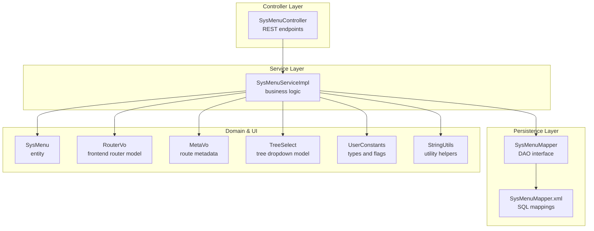
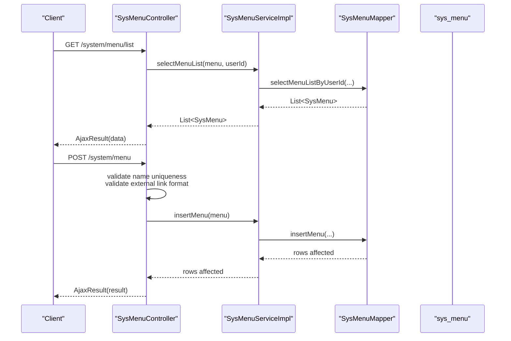
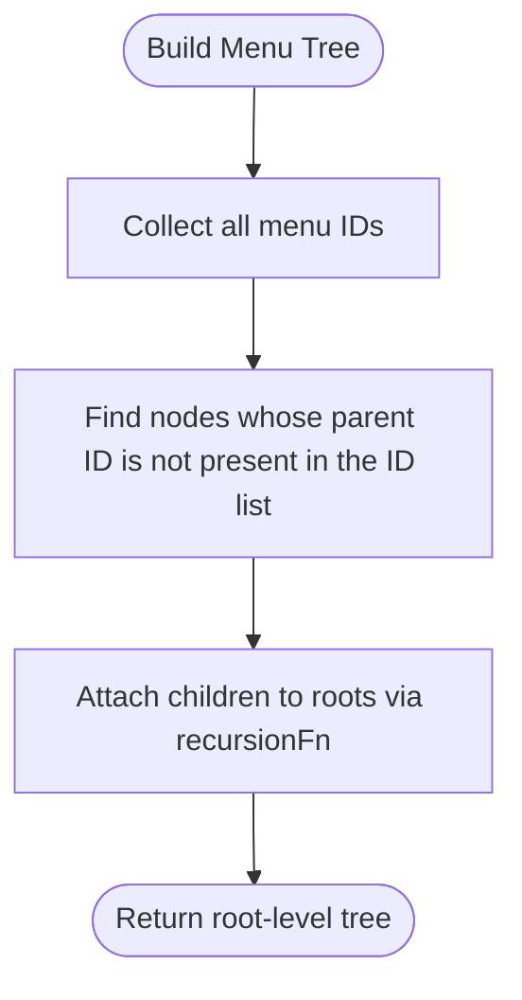
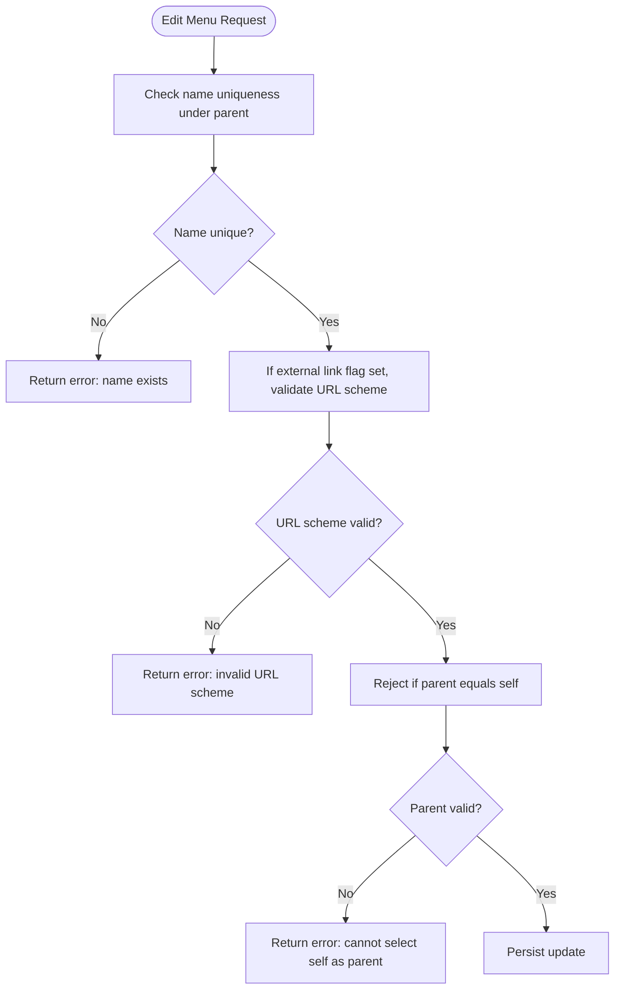
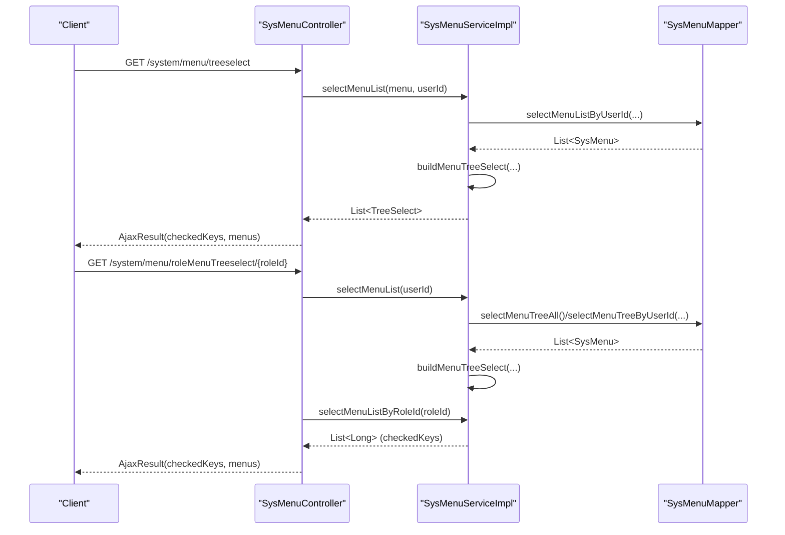
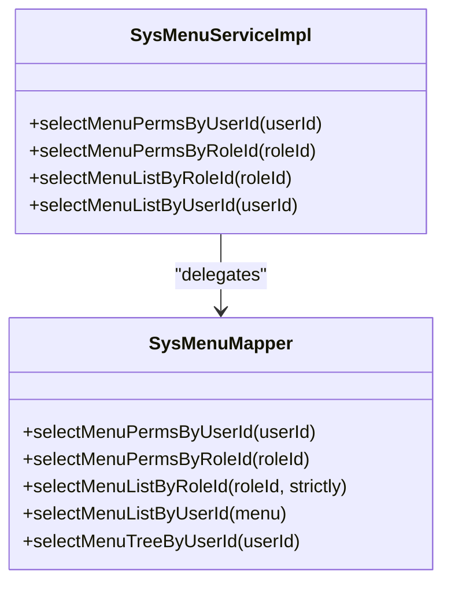
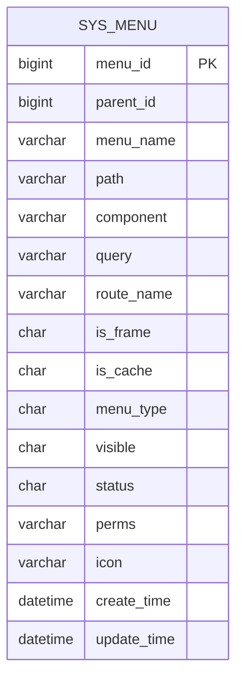
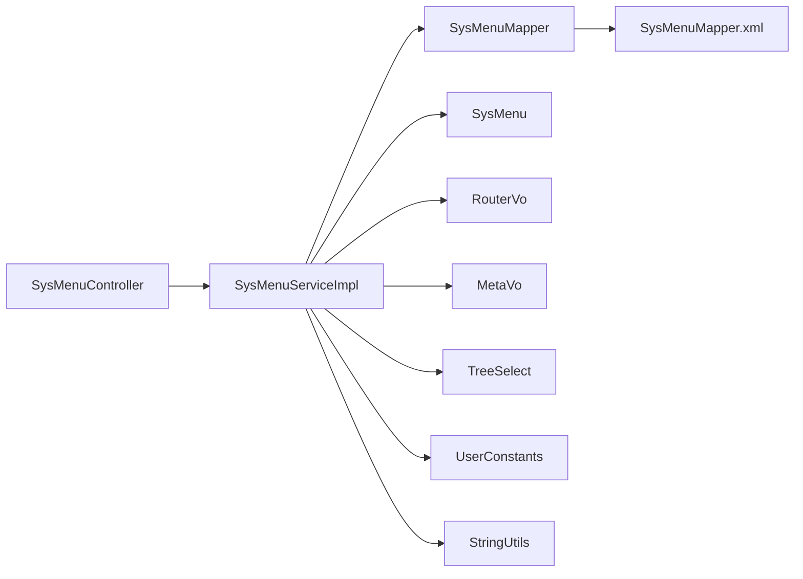

# Menu Management

<cite>
**Referenced Files in This Document**
- [SysMenuController.java](file://src/main/java/com/ruoyi/project/system/controller/SysMenuController.java)
- [SysMenuServiceImpl.java](file://src/main/java/com/ruoyi/project/system/service/impl/SysMenuServiceImpl.java)
- [SysMenu.java](file://src/main/java/com/ruoyi/project/system/domain/SysMenu.java)
- [SysMenuMapper.java](file://src/main/java/com/ruoyi/project/system/mapper/SysMenuMapper.java)
- [SysMenuMapper.xml](file://src/main/resources/mybatis/system/SysMenuMapper.xml)
- [TreeSelect.java](file://src/main/java/com/ruoyi/framework/web/domain/TreeSelect.java)
- [RouterVo.java](file://src/main/java/com/ruoyi/project/system/domain/vo/RouterVo.java)
- [MetaVo.java](file://src/main/java/com/ruoyi/project/system/domain/vo/MetaVo.java)
- [UserConstants.java](file://src/main/java/com/ruoyi/common/constant/UserConstants.java)
- [StringUtils.java](file://src/main/java/com/ruoyi/common/utils/StringUtils.java)
- [ry_20250522.sql](file://sql/ry_20250522.sql)
</cite>

## Table of Contents
1. [Introduction](#introduction)
2. [Project Structure](#project-structure)
3. [Core Components](#core-components)
4. [Architecture Overview](#architecture-overview)
5. [Detailed Component Analysis](#detailed-component-analysis)
6. [Dependency Analysis](#dependency-analysis)
7. [Performance Considerations](#performance-considerations)
8. [Troubleshooting Guide](#troubleshooting-guide)
9. [Conclusion](#conclusion)
10. [Appendices](#appendices)

## Introduction
This document explains the Menu Management module in the RuoYi-Vue system. It covers the hierarchical menu structure with dynamic loading, parent-child relationships, and tree traversal. It documents the RESTful endpoints for menu CRUD operations, business rules around deletion, validation for uniqueness and external links, and the treeselect and roleMenuTreeselect endpoints used by UI components. It also describes integration with the Role module for permission assignment and how menu visibility is controlled by user permissions in selectMenuList. Finally, it provides guidance on menu ordering, icon configuration, and troubleshooting menu display issues, including creating different menu types (directory, menu, button) and their security implications.

## Project Structure
The Menu Management module spans the controller, service, persistence, and domain layers, plus UI-related VO classes and constants.

**Diagram sources**
- [SysMenuController.java](file://src/main/java/com/ruoyi/project/system/controller/SysMenuController.java#L1-L142)
- [SysMenuServiceImpl.java](file://src/main/java/com/ruoyi/project/system/service/impl/SysMenuServiceImpl.java#L1-L544)
- [SysMenuMapper.java](file://src/main/java/com/ruoyi/project/system/mapper/SysMenuMapper.java#L1-L126)
- [SysMenuMapper.xml](file://src/main/resources/mybatis/system/SysMenuMapper.xml#L1-L206)
- [SysMenu.java](file://src/main/java/com/ruoyi/project/system/domain/SysMenu.java#L1-L275)
- [RouterVo.java](file://src/main/java/com/ruoyi/project/system/domain/vo/RouterVo.java#L1-L149)
- [MetaVo.java](file://src/main/java/com/ruoyi/project/system/domain/vo/MetaVo.java#L1-L107)
- [TreeSelect.java](file://src/main/java/com/ruoyi/framework/web/domain/TreeSelect.java#L1-L94)
- [UserConstants.java](file://src/main/java/com/ruoyi/common/constant/UserConstants.java#L1-L82)
- [StringUtils.java](file://src/main/java/com/ruoyi/common/utils/StringUtils.java#L360-L371)

**Section sources**
- [SysMenuController.java](file://src/main/java/com/ruoyi/project/system/controller/SysMenuController.java#L1-L142)
- [SysMenuServiceImpl.java](file://src/main/java/com/ruoyi/project/system/service/impl/SysMenuServiceImpl.java#L1-L544)
- [SysMenuMapper.java](file://src/main/java/com/ruoyi/project/system/mapper/SysMenuMapper.java#L1-L126)
- [SysMenuMapper.xml](file://src/main/resources/mybatis/system/SysMenuMapper.xml#L1-L206)
- [SysMenu.java](file://src/main/java/com/ruoyi/project/system/domain/SysMenu.java#L1-L275)
- [RouterVo.java](file://src/main/java/com/ruoyi/project/system/domain/vo/RouterVo.java#L1-L149)
- [MetaVo.java](file://src/main/java/com/ruoyi/project/system/domain/vo/MetaVo.java#L1-L107)
- [TreeSelect.java](file://src/main/java/com/ruoyi/framework/web/domain/TreeSelect.java#L1-L94)
- [UserConstants.java](file://src/main/java/com/ruoyi/common/constant/UserConstants.java#L1-L82)
- [StringUtils.java](file://src/main/java/com/ruoyi/common/utils/StringUtils.java#L360-L371)

## Core Components
- Controller: Exposes REST endpoints for menu management and delegates to the service layer.
- Service: Implements business logic for hierarchical menu retrieval, tree building, permission filtering, and validation rules.
- Mapper/DAO: Provides SQL queries for menu lists, trees, permissions, and CRUD operations.
- Domain: Defines the SysMenu entity with parent-child relationships and UI metadata fields.
- UI Models: RouterVo and MetaVo represent frontend routing and metadata; TreeSelect supports tree-select UI components.
- Constants and Utilities: UserConstants defines menu types and flags; StringUtils provides URL checks.

**Section sources**
- [SysMenuController.java](file://src/main/java/com/ruoyi/project/system/controller/SysMenuController.java#L1-L142)
- [SysMenuServiceImpl.java](file://src/main/java/com/ruoyi/project/system/service/impl/SysMenuServiceImpl.java#L1-L544)
- [SysMenuMapper.java](file://src/main/java/com/ruoyi/project/system/mapper/SysMenuMapper.java#L1-L126)
- [SysMenuMapper.xml](file://src/main/resources/mybatis/system/SysMenuMapper.xml#L1-L206)
- [SysMenu.java](file://src/main/java/com/ruoyi/project/system/domain/SysMenu.java#L1-L275)
- [RouterVo.java](file://src/main/java/com/ruoyi/project/system/domain/vo/RouterVo.java#L1-L149)
- [MetaVo.java](file://src/main/java/com/ruoyi/project/system/domain/vo/MetaVo.java#L1-L107)
- [TreeSelect.java](file://src/main/java/com/ruoyi/framework/web/domain/TreeSelect.java#L1-L94)
- [UserConstants.java](file://src/main/java/com/ruoyi/common/constant/UserConstants.java#L1-L82)
- [StringUtils.java](file://src/main/java/com/ruoyi/common/utils/StringUtils.java#L360-L371)

## Architecture Overview
The module follows a layered architecture:
- REST endpoints in the controller validate requests and enforce permissions.
- The service layer orchestrates data retrieval, builds trees, filters by permissions, and applies business rules.
- The mapper layer executes SQL queries against the sys_menu table and related role-menu joins.
- Domain and UI models encapsulate data and frontend rendering concerns.

**Diagram sources**
- [SysMenuController.java](file://src/main/java/com/ruoyi/project/system/controller/SysMenuController.java#L36-L119)
- [SysMenuServiceImpl.java](file://src/main/java/com/ruoyi/project/system/service/impl/SysMenuServiceImpl.java#L53-L121)
- [SysMenuMapper.xml](file://src/main/resources/mybatis/system/SysMenuMapper.xml#L58-L75)
- [SysMenuMapper.xml](file://src/main/resources/mybatis/system/SysMenuMapper.xml#L160-L199)

## Detailed Component Analysis

### REST Endpoints
- GET /system/menu/list
  - Purpose: Retrieve menu list filtered by query criteria and user permissions.
  - Permissions: Requires system:menu:list.
  - Behavior: Calls service to get menu list for the current user; admin sees all, others see only assigned menus.
- GET /system/menu/{menuId}
  - Purpose: Get a single menu by ID.
  - Permissions: Requires system:menu:query.
- GET /system/menu/treeselect
  - Purpose: Build a tree-select structure for UI selection.
  - Behavior: Loads menus and builds a tree using service.buildMenuTreeSelect.
- GET /system/menu/roleMenuTreeselect/{roleId}
  - Purpose: Load menus and pre-check role assignments for UI.
  - Behavior: Returns checkedKeys (assigned menu IDs) and menus tree.
- POST /system/menu
  - Purpose: Create a new menu.
  - Permissions: Requires system:menu:add.
  - Validation: Name uniqueness within parent; external link format when isFrame indicates external link.
- PUT /system/menu
  - Purpose: Update an existing menu.
  - Permissions: Requires system:menu:edit.
  - Validation: Name uniqueness within parent; external link format; prevent self-parent selection.
- DELETE /system/menu/{menuId}
  - Purpose: Delete a menu.
  - Permissions: Requires system:menu:remove.
  - Business rules: Cannot delete if children exist; cannot delete if assigned to roles.

**Section sources**
- [SysMenuController.java](file://src/main/java/com/ruoyi/project/system/controller/SysMenuController.java#L36-L141)
- [SysMenuServiceImpl.java](file://src/main/java/com/ruoyi/project/system/service/impl/SysMenuServiceImpl.java#L270-L330)
- [SysMenuMapper.xml](file://src/main/resources/mybatis/system/SysMenuMapper.xml#L127-L134)

### Hierarchical Menu Structure and Tree Traversal
- Parent-Child Relationships
  - SysMenu holds parentId and a children list to form a tree.
  - Tree traversal is performed by building a list of top-level nodes and recursively attaching children.
- Tree Building
  - buildMenuTree constructs a root-level tree from flat lists.
  - buildMenuTreeSelect converts the built tree into TreeSelect nodes for UI.
- Child Retrieval and Filtering
  - getChildPerms filters visible menus for a given user by traversing the tree starting from root.
- Routing Construction
  - buildMenus converts SysMenu nodes into RouterVo structures for frontend routing, applying visibility, cache, and component resolution rules.

**Diagram sources**
- [SysMenuServiceImpl.java](file://src/main/java/com/ruoyi/project/system/service/impl/SysMenuServiceImpl.java#L223-L242)
- [SysMenuServiceImpl.java](file://src/main/java/com/ruoyi/project/system/service/impl/SysMenuServiceImpl.java#L487-L505)

**Section sources**
- [SysMenu.java](file://src/main/java/com/ruoyi/project/system/domain/SysMenu.java#L69-L71)
- [SysMenuServiceImpl.java](file://src/main/java/com/ruoyi/project/system/service/impl/SysMenuServiceImpl.java#L223-L242)
- [SysMenuServiceImpl.java](file://src/main/java/com/ruoyi/project/system/service/impl/SysMenuServiceImpl.java#L487-L505)
- [TreeSelect.java](file://src/main/java/com/ruoyi/framework/web/domain/TreeSelect.java#L47-L52)

### Validation Rules and Business Constraints
- Unique Menu Name Within Parent
  - checkMenuNameUnique enforces uniqueness of menu name under the same parent.
- External Link Validation
  - ishttp checks whether a path starts with http(s)://; controller enforces this for external link menus.
- Prevent Self-Parent Selection
  - Controller rejects updates where parentId equals menuId.
- Deletion Constraints
  - hasChildByMenuId prevents deletion if children exist.
  - checkMenuExistRole prevents deletion if roles are assigned to the menu.

**Diagram sources**
- [SysMenuController.java](file://src/main/java/com/ruoyi/project/system/controller/SysMenuController.java#L100-L122)
- [SysMenuServiceImpl.java](file://src/main/java/com/ruoyi/project/system/service/impl/SysMenuServiceImpl.java#L331-L347)
- [StringUtils.java](file://src/main/java/com/ruoyi/common/utils/StringUtils.java#L360-L371)

**Section sources**
- [SysMenuController.java](file://src/main/java/com/ruoyi/project/system/controller/SysMenuController.java#L80-L122)
- [SysMenuServiceImpl.java](file://src/main/java/com/ruoyi/project/system/service/impl/SysMenuServiceImpl.java#L331-L347)
- [SysMenuServiceImpl.java](file://src/main/java/com/ruoyi/project/system/service/impl/SysMenuServiceImpl.java#L270-L293)
- [SysMenuMapper.xml](file://src/main/resources/mybatis/system/SysMenuMapper.xml#L127-L134)

### UI Integration: treeselect and roleMenuTreeselect
- treeselect
  - Endpoint: GET /system/menu/treeselect
  - Behavior: Builds a tree-select structure from the menu list for UI selection controls.
- roleMenuTreeselect
  - Endpoint: GET /system/menu/roleMenuTreeselect/{roleId}
  - Behavior: Returns menus tree and checkedKeys (assigned menu IDs) for a role, enabling UI to pre-check selections.

**Diagram sources**
- [SysMenuController.java](file://src/main/java/com/ruoyi/project/system/controller/SysMenuController.java#L57-L78)
- [SysMenuServiceImpl.java](file://src/main/java/com/ruoyi/project/system/service/impl/SysMenuServiceImpl.java#L130-L156)
- [SysMenuServiceImpl.java](file://src/main/java/com/ruoyi/project/system/service/impl/SysMenuServiceImpl.java#L244-L255)
- [SysMenuMapper.xml](file://src/main/resources/mybatis/system/SysMenuMapper.xml#L52-L86)
- [SysMenuMapper.xml](file://src/main/resources/mybatis/system/SysMenuMapper.xml#L88-L97)

**Section sources**
- [SysMenuController.java](file://src/main/java/com/ruoyi/project/system/controller/SysMenuController.java#L57-L78)
- [SysMenuServiceImpl.java](file://src/main/java/com/ruoyi/project/system/service/impl/SysMenuServiceImpl.java#L130-L156)
- [SysMenuServiceImpl.java](file://src/main/java/com/ruoyi/project/system/service/impl/SysMenuServiceImpl.java#L244-L255)

### Integration with Role Module and Permission Assignment
- Permission Retrieval
  - selectMenuPermsByUserId and selectMenuPermsByRoleId aggregate comma-separated permission strings from assigned menus.
- Role Menu Assignment
  - selectMenuListByRoleId returns assigned menu IDs for a role, honoring strictness settings.
- Menu Visibility in Select Lists
  - selectMenuListByUserId and selectMenuTreeByUserId join sys_role_menu and sys_user_role to restrict menus to those assigned to the user’s roles.

**Diagram sources**
- [SysMenuServiceImpl.java](file://src/main/java/com/ruoyi/project/system/service/impl/SysMenuServiceImpl.java#L88-L122)
- [SysMenuServiceImpl.java](file://src/main/java/com/ruoyi/project/system/service/impl/SysMenuServiceImpl.java#L145-L156)
- [SysMenuServiceImpl.java](file://src/main/java/com/ruoyi/project/system/service/impl/SysMenuServiceImpl.java#L53-L80)
- [SysMenuMapper.xml](file://src/main/resources/mybatis/system/SysMenuMapper.xml#L106-L120)
- [SysMenuMapper.xml](file://src/main/resources/mybatis/system/SysMenuMapper.xml#L88-L97)
- [SysMenuMapper.xml](file://src/main/resources/mybatis/system/SysMenuMapper.xml#L58-L86)

**Section sources**
- [SysMenuServiceImpl.java](file://src/main/java/com/ruoyi/project/system/service/impl/SysMenuServiceImpl.java#L88-L122)
- [SysMenuServiceImpl.java](file://src/main/java/com/ruoyi/project/system/service/impl/SysMenuServiceImpl.java#L145-L156)
- [SysMenuServiceImpl.java](file://src/main/java/com/ruoyi/project/system/service/impl/SysMenuServiceImpl.java#L53-L80)
- [SysMenuMapper.xml](file://src/main/resources/mybatis/system/SysMenuMapper.xml#L58-L86)
- [SysMenuMapper.xml](file://src/main/resources/mybatis/system/SysMenuMapper.xml#L88-L97)
- [SysMenuMapper.xml](file://src/main/resources/mybatis/system/SysMenuMapper.xml#L106-L120)

### Menu Types, Ordering, Icons, and Display
- Menu Types
  - Directory (M): Folder-like container.
  - Menu (C): Navigable page route.
  - Button (F): Permission-only action.
- Ordering
  - Menus are ordered by parent_id and order_num in SQL queries.
- Icons
  - Icon field stores the icon identifier; MetaVo sets link only for http(s) URLs.
- Display Visibility
  - visible field controls whether a menu is shown in the sidebar; RouterVo.hidden reflects this.

**Section sources**
- [UserConstants.java](file://src/main/java/com/ruoyi/common/constant/UserConstants.java#L48-L56)
- [SysMenuMapper.xml](file://src/main/resources/mybatis/system/SysMenuMapper.xml#L36-L49)
- [SysMenuMapper.xml](file://src/main/resources/mybatis/system/SysMenuMapper.xml#L52-L56)
- [SysMenuMapper.xml](file://src/main/resources/mybatis/system/SysMenuMapper.xml#L58-L75)
- [MetaVo.java](file://src/main/java/com/ruoyi/project/system/domain/vo/MetaVo.java#L55-L65)
- [RouterVo.java](file://src/main/java/com/ruoyi/project/system/domain/vo/RouterVo.java#L24-L31)
- [SysMenuServiceImpl.java](file://src/main/java/com/ruoyi/project/system/service/impl/SysMenuServiceImpl.java#L165-L171)

### Data Model and Persistence
- Entity Fields
  - menu_id, parent_id, menu_name, path, component, query, route_name, is_frame, is_cache, menu_type, visible, status, perms, icon, timestamps.
- SQL Queries
  - selectMenuList, selectMenuTreeAll, selectMenuListByUserId, selectMenuTreeByUserId, selectMenuListByRoleId, selectMenuPermsByUserId/Roles, insert/update/delete, hasChildByMenuId, checkMenuNameUnique.

**Diagram sources**
- [ry_20250522.sql](file://sql/ry_20250522.sql#L147-L156)
- [SysMenuMapper.xml](file://src/main/resources/mybatis/system/SysMenuMapper.xml#L31-L34)

**Section sources**
- [SysMenu.java](file://src/main/java/com/ruoyi/project/system/domain/SysMenu.java#L21-L71)
- [SysMenuMapper.xml](file://src/main/resources/mybatis/system/SysMenuMapper.xml#L31-L34)
- [SysMenuMapper.xml](file://src/main/resources/mybatis/system/SysMenuMapper.xml#L36-L49)
- [SysMenuMapper.xml](file://src/main/resources/mybatis/system/SysMenuMapper.xml#L52-L56)
- [SysMenuMapper.xml](file://src/main/resources/mybatis/system/SysMenuMapper.xml#L58-L75)
- [SysMenuMapper.xml](file://src/main/resources/mybatis/system/SysMenuMapper.xml#L77-L86)
- [SysMenuMapper.xml](file://src/main/resources/mybatis/system/SysMenuMapper.xml#L88-L97)
- [SysMenuMapper.xml](file://src/main/resources/mybatis/system/SysMenuMapper.xml#L106-L120)
- [SysMenuMapper.xml](file://src/main/resources/mybatis/system/SysMenuMapper.xml#L127-L134)
- [SysMenuMapper.xml](file://src/main/resources/mybatis/system/SysMenuMapper.xml#L131-L134)
- [SysMenuMapper.xml](file://src/main/resources/mybatis/system/SysMenuMapper.xml#L160-L199)

## Dependency Analysis
- Controller depends on Service for business logic.
- Service depends on Mapper for data access and on constants/utilities for validation and routing decisions.
- Mapper XML maps DAO methods to SQL with joins to role and user tables for permission-aware queries.

**Diagram sources**
- [SysMenuController.java](file://src/main/java/com/ruoyi/project/system/controller/SysMenuController.java#L1-L142)
- [SysMenuServiceImpl.java](file://src/main/java/com/ruoyi/project/system/service/impl/SysMenuServiceImpl.java#L1-L544)
- [SysMenuMapper.java](file://src/main/java/com/ruoyi/project/system/mapper/SysMenuMapper.java#L1-L126)
- [SysMenuMapper.xml](file://src/main/resources/mybatis/system/SysMenuMapper.xml#L1-L206)
- [SysMenu.java](file://src/main/java/com/ruoyi/project/system/domain/SysMenu.java#L1-L275)
- [RouterVo.java](file://src/main/java/com/ruoyi/project/system/domain/vo/RouterVo.java#L1-L149)
- [MetaVo.java](file://src/main/java/com/ruoyi/project/system/domain/vo/MetaVo.java#L1-L107)
- [TreeSelect.java](file://src/main/java/com/ruoyi/framework/web/domain/TreeSelect.java#L1-L94)
- [UserConstants.java](file://src/main/java/com/ruoyi/common/constant/UserConstants.java#L1-L82)
- [StringUtils.java](file://src/main/java/com/ruoyi/common/utils/StringUtils.java#L360-L371)

**Section sources**
- [SysMenuController.java](file://src/main/java/com/ruoyi/project/system/controller/SysMenuController.java#L1-L142)
- [SysMenuServiceImpl.java](file://src/main/java/com/ruoyi/project/system/service/impl/SysMenuServiceImpl.java#L1-L544)
- [SysMenuMapper.java](file://src/main/java/com/ruoyi/project/system/mapper/SysMenuMapper.java#L1-L126)
- [SysMenuMapper.xml](file://src/main/resources/mybatis/system/SysMenuMapper.xml#L1-L206)

## Performance Considerations
- Tree Building Complexity
  - Building the menu tree iterates through the list and attaches children; complexity is O(n^2) in worst-case scenarios due to nested loops and child lookups. Consider optimizing with a map keyed by parentId for large datasets.
- SQL Ordering
  - Queries order by parent_id and order_num, ensuring predictable UI rendering and efficient pagination/filtering.
- Permission Joins
  - Permission-aware queries join sys_role_menu and sys_user_role; indexing on role_id and user_id improves performance for large user bases.

[No sources needed since this section provides general guidance]

## Troubleshooting Guide
Common issues and resolutions:
- Menu Deletion Blocked
  - Symptom: Attempting to delete a menu fails.
  - Causes: Has children or assigned to roles.
  - Resolution: Remove child menus or unassign roles before deletion.
- External Link Validation Failure
  - Symptom: Creating/updating an external link menu fails.
  - Cause: Path does not start with http(s):// when isFrame indicates external link.
  - Resolution: Ensure path begins with http(s)://.
- Duplicate Menu Name Under Same Parent
  - Symptom: Name uniqueness validation fails.
  - Cause: Another menu with the same name exists under the same parent.
  - Resolution: Change name or adjust parent.
- Self-Parent Selection
  - Symptom: Update rejected when setting parent to itself.
  - Resolution: Choose a valid parent.
- Menu Not Visible in UI
  - Symptom: Menu appears in list but not in navigation.
  - Causes: visible set to hidden, or permissions not assigned to user/role.
  - Resolution: Set visible appropriately and ensure role-menu assignments exist.

**Section sources**
- [SysMenuController.java](file://src/main/java/com/ruoyi/project/system/controller/SysMenuController.java#L124-L141)
- [SysMenuServiceImpl.java](file://src/main/java/com/ruoyi/project/system/service/impl/SysMenuServiceImpl.java#L270-L330)
- [SysMenuServiceImpl.java](file://src/main/java/com/ruoyi/project/system/service/impl/SysMenuServiceImpl.java#L331-L347)
- [SysMenuServiceImpl.java](file://src/main/java/com/ruoyi/project/system/service/impl/SysMenuServiceImpl.java#L165-L171)
- [SysMenuMapper.xml](file://src/main/resources/mybatis/system/SysMenuMapper.xml#L58-L75)
- [SysMenuMapper.xml](file://src/main/resources/mybatis/system/SysMenuMapper.xml#L77-L86)

## Conclusion
The Menu Management module provides a robust, permission-aware hierarchical menu system with dynamic loading and UI integration. It enforces strong business rules for safety and consistency, integrates tightly with the Role module for permission assignment, and offers flexible UI components for selection and routing. Following the validation and troubleshooting guidance ensures reliable operation across environments.

[No sources needed since this section summarizes without analyzing specific files]

## Appendices

### REST Endpoint Reference
- GET /system/menu/list
  - Filters: menuName, visible, status.
  - Sorting: parent_id, order_num.
- GET /system/menu/{menuId}
- GET /system/menu/treeselect
- GET /system/menu/roleMenuTreeselect/{roleId}
- POST /system/menu
  - Validation: unique name under parent; external link URL scheme.
- PUT /system/menu
  - Validation: unique name under parent; external link URL scheme; prevent self-parent.
- DELETE /system/menu/{menuId}
  - Validation: no children; not assigned to roles.

**Section sources**
- [SysMenuController.java](file://src/main/java/com/ruoyi/project/system/controller/SysMenuController.java#L36-L141)
- [SysMenuMapper.xml](file://src/main/resources/mybatis/system/SysMenuMapper.xml#L36-L49)
- [SysMenuMapper.xml](file://src/main/resources/mybatis/system/SysMenuMapper.xml#L52-L56)
- [SysMenuMapper.xml](file://src/main/resources/mybatis/system/SysMenuMapper.xml#L58-L75)
- [SysMenuMapper.xml](file://src/main/resources/mybatis/system/SysMenuMapper.xml#L77-L86)
- [SysMenuMapper.xml](file://src/main/resources/mybatis/system/SysMenuMapper.xml#L88-L97)
- [SysMenuMapper.xml](file://src/main/resources/mybatis/system/SysMenuMapper.xml#L106-L120)
- [SysMenuMapper.xml](file://src/main/resources/mybatis/system/SysMenuMapper.xml#L127-L134)
- [SysMenuMapper.xml](file://src/main/resources/mybatis/system/SysMenuMapper.xml#L131-L134)
- [SysMenuMapper.xml](file://src/main/resources/mybatis/system/SysMenuMapper.xml#L160-L199)