# Post Management

<cite>
**Referenced Files in This Document**   
- [SysPostController.java](file://src/main/java/com/ruoyi/project/system/controller/SysPostController.java)
- [SysPost.java](file://src/main/java/com/ruoyi/project/system/domain/SysPost.java)
- [ISysPostService.java](file://src/main/java/com/ruoyi/project/system/service/ISysPostService.java)
- [SysPostServiceImpl.java](file://src/main/java/com/ruoyi/project/system/service/impl/SysPostServiceImpl.java)
- [SysPostMapper.java](file://src/main/java/com/ruoyi/project/system/mapper/SysPostMapper.java)
- [SysPostMapper.xml](file://src/main/resources/mybatis/system/SysPostMapper.xml)
- [SysUserPost.java](file://src/main/java/com/ruoyi/project/system/domain/SysUserPost.java)
- [SysUserPostMapper.java](file://src/main/java/com/ruoyi/project/system/mapper/SysUserPostMapper.java)
- [SysUserPostMapper.xml](file://src/main/resources/mybatis/system/SysUserPostMapper.xml)
- [SysUserController.java](file://src/main/java/com/ruoyi/project/system/controller/SysUserController.java)
- [SysUserServiceImpl.java](file://src/main/java/com/ruoyi/project/system/service/impl/SysUserServiceImpl.java)
- [UserConstants.java](file://src/main/java/com/ruoyi/common/constant/UserConstants.java)
- [ry_20250522.sql](file://sql/ry_20250522.sql)
</cite>

## Table of Contents
1. [Introduction](#introduction)
2. [Core Data Structure](#core-data-structure)
3. [RESTful Endpoints](#restful-endpoints)
4. [Business Rules and Validation](#business-rules-and-validation)
5. [User-Post Relationship](#user-post-relationship)
6. [Integration with User Module](#integration-with-user-module)
7. [Common Use Cases](#common-use-cases)
8. [Best Practices](#best-practices)

## Introduction

The Post Management module in the RuoYi-Vue system provides a comprehensive solution for managing organizational roles as reference data entities. This module enables administrators to define, maintain, and manage job positions within an organization, ensuring standardization of job titles and roles across departments. The implementation follows a RESTful architecture with comprehensive CRUD operations, validation rules, and integration with the user management system. Posts serve as reference data that can be assigned to users, forming an essential part of user profile information and organizational structure.

**Section sources**
- [SysPostController.java](file://src/main/java/com/ruoyi/project/system/controller/SysPostController.java#L25-L33)
- [SysPost.java](file://src/main/java/com/ruoyi/project/system/domain/SysPost.java#L12-L16)

## Core Data Structure

The `SysPost` entity represents a job position within the organization and contains essential attributes for post management:

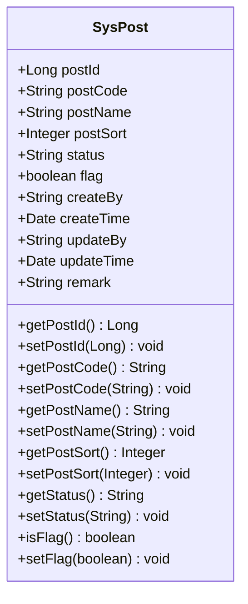

**Diagram sources**
- [SysPost.java](file://src/main/java/com/ruoyi/project/system/domain/SysPost.java#L17-L125)

The `SysUserPost` entity represents the many-to-many relationship between users and posts, allowing users to be assigned to multiple positions:

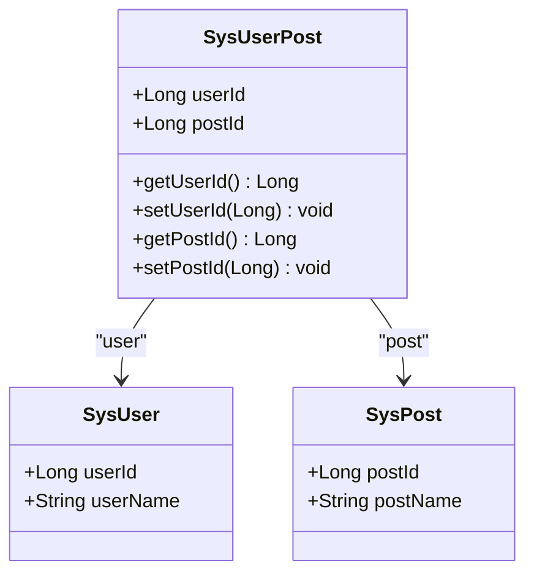

**Diagram sources**
- [SysUserPost.java](file://src/main/java/com/ruoyi/project/system/domain/SysUserPost.java#L11-L47)
- [ry_20250522.sql](file://sql/ry_20250522.sql#L397-L413)

## RESTful Endpoints

The Post Management module exposes a comprehensive set of RESTful endpoints for managing job positions:

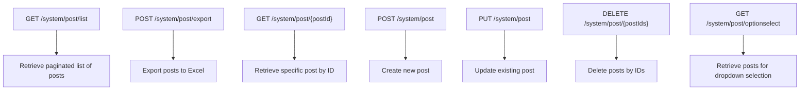

**Diagram sources**
- [SysPostController.java](file://src/main/java/com/ruoyi/project/system/controller/SysPostController.java#L30-L129)

### Endpoint Details

| HTTP Method | Endpoint | Purpose | Permission Required |
|-------------|----------|---------|-------------------|
| GET | /system/post/list | Retrieve paginated list of posts with optional filtering | system:post:list |
| POST | /system/post/export | Export posts to Excel file | system:post:export |
| GET | /system/post/{postId} | Retrieve specific post by ID | system:post:query |
| POST | /system/post | Create a new post | system:post:add |
| PUT | /system/post | Update an existing post | system:post:edit |
| DELETE | /system/post/{postIds} | Delete posts by IDs | system:post:remove |
| GET | /system/post/optionselect | Retrieve posts for dropdown selection | None (public) |

**Section sources**
- [SysPostController.java](file://src/main/java/com/ruoyi/project/system/controller/SysPostController.java#L37-L129)

## Business Rules and Validation

The Post Management module implements strict business rules to ensure data integrity and consistency:

### Post Name and Code Uniqueness

The system enforces uniqueness constraints on both post names and post codes to prevent duplication:

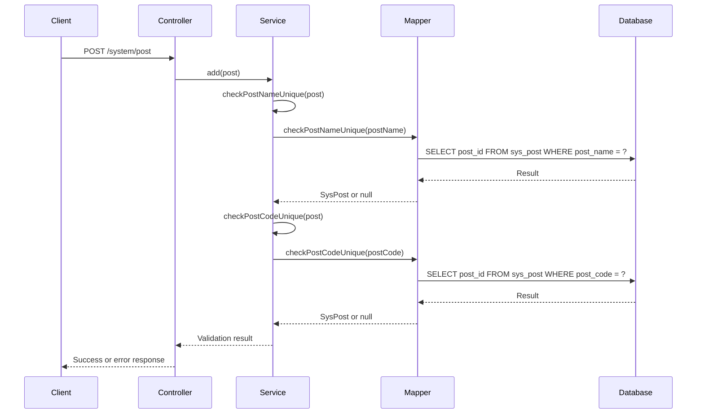

**Diagram sources**
- [SysPostController.java](file://src/main/java/com/ruoyi/project/system/controller/SysPostController.java#L77-L84)
- [SysPostServiceImpl.java](file://src/main/java/com/ruoyi/project/system/service/impl/SysPostServiceImpl.java#L81-L109)
- [SysPostMapper.xml](file://src/main/resources/mybatis/system/SysPostMapper.xml#L65-L73)

### Input Validation

The system implements comprehensive input validation through annotations on the `SysPost` entity:

- **Post Code**: Must not be blank and limited to 64 characters
- **Post Name**: Must not be blank and limited to 50 characters
- **Post Sort**: Must not be null
- **Status**: Valid values are "0" (normal) or "1" (disabled)

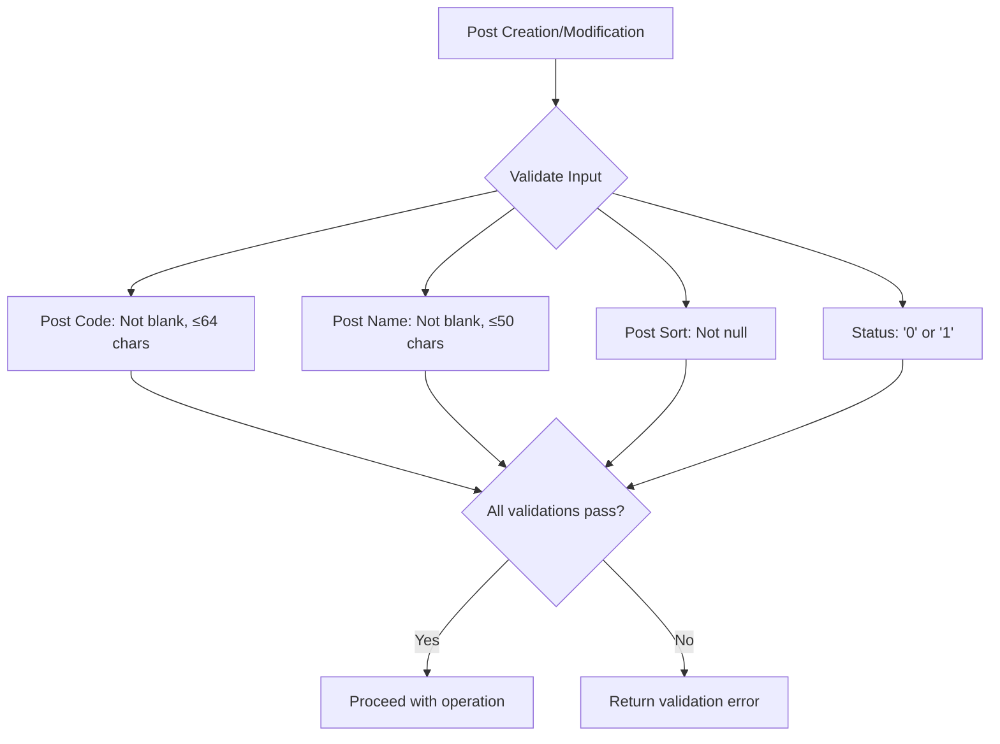

**Diagram sources**
- [SysPost.java](file://src/main/java/com/ruoyi/project/system/domain/SysPost.java#L54-L76)
- [SysPostController.java](file://src/main/java/com/ruoyi/project/system/controller/SysPostController.java#L75-L76)

### Deletion Constraints

The system prevents deletion of posts that are currently assigned to users:

```mermaid
sequenceDiagram
participant Client
participant Controller
participant Service
participant Mapper
participant Database
Client->>Controller : DELETE /system/post/{postIds}
Controller->>Service : deletePostByIds(postIds)
loop For each postId
Service->>Service : selectPostById(postId)
Service->>Service : countUserPostById(postId)
Service->>Mapper : countUserPostById(postId)
Mapper->>Database : SELECT COUNT(1) FROM sys_user_post WHERE post_id = ?
Database-->>Mapper : Count
Mapper-->>Service : Count
alt Count > 0
Service-->>Controller : Throw ServiceException
Controller-->>Client : Error response
break
end
end
Service->>Mapper : deletePostByIds(postIds)
Mapper->>Database : DELETE FROM sys_post WHERE post_id IN (?)
Database-->>Mapper : Result
Mapper-->>Service : Result
Service-->>Controller : Success
Controller-->>Client : Success response
```

**Diagram sources**
- [SysPostServiceImpl.java](file://src/main/java/com/ruoyi/project/system/service/impl/SysPostServiceImpl.java#L141-L153)
- [SysUserPostMapper.java](file://src/main/java/com/ruoyi/project/system/mapper/SysUserPostMapper.java#L27-L28)
- [SysUserPostMapper.xml](file://src/main/resources/mybatis/system/SysUserPostMapper.xml#L16-L18)

## User-Post Relationship

The system implements a many-to-many relationship between users and posts through the `SysUserPost` junction table:

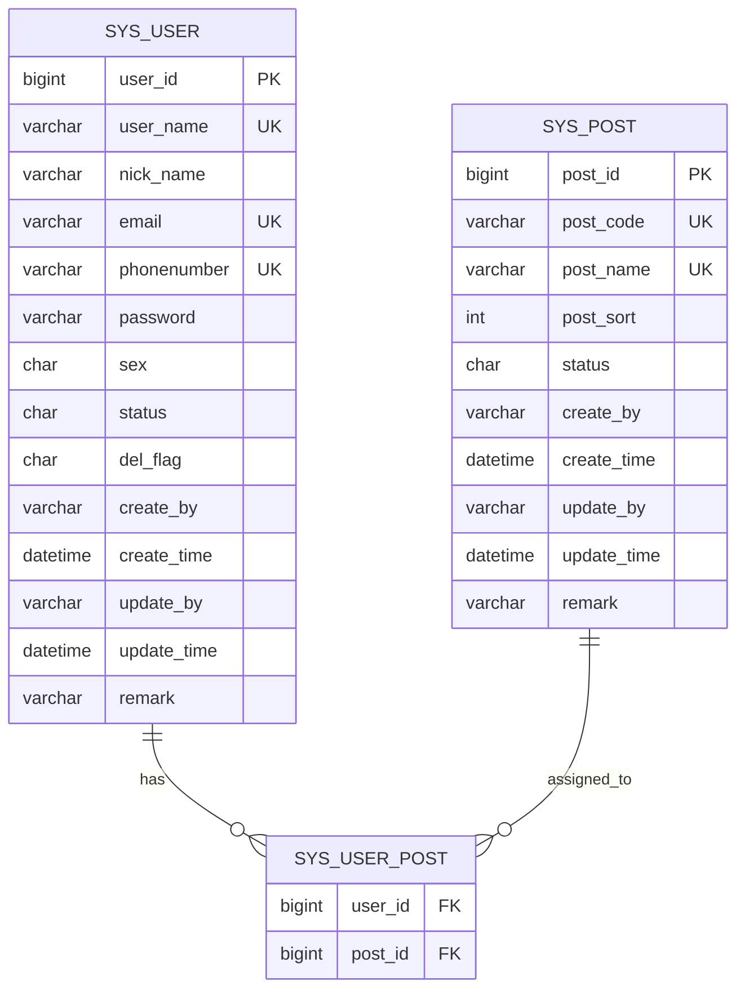

**Diagram sources**
- [ry_20250522.sql](file://sql/ry_20250522.sql#L397-L413)
- [SysUserPost.java](file://src/main/java/com/ruoyi/project/system/domain/SysUserPost.java#L11-L47)

### Relationship Management

The system provides comprehensive operations for managing user-post assignments:

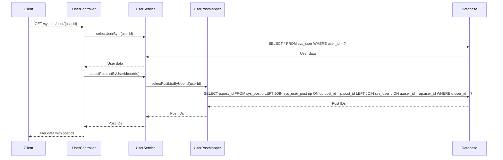

**Diagram sources**
- [SysUserController.java](file://src/main/java/com/ruoyi/project/system/controller/SysUserController.java#L110-L111)
- [SysUserServiceImpl.java](file://src/main/java/com/ruoyi/project/system/service/impl/SysUserServiceImpl.java#L417-L425)
- [SysUserPostMapper.xml](file://src/main/resources/mybatis/system/SysUserPostMapper.xml#L49-L55)

## Integration with User Module

The Post Management module is tightly integrated with the User module to provide comprehensive user profile information:

### User Profile Information

When retrieving user information, the system includes associated posts in the response:

```json
{
  "code": 200,
  "msg": "success",
  "data": {
    "userId": 1,
    "userName": "admin",
    "nickName": "Administrator",
    "email": "admin@ruoyi.com",
    "phonenumber": "15888888888",
    "sex": "1",
    "avatar": "",
    "status": "0",
    "delFlag": "0",
    "loginIp": "127.0.0.1",
    "loginDate": "2023-05-22T10:30:00",
    "createBy": "admin",
    "createTime": "2021-01-01T00:00:00",
    "updateBy": "admin",
    "updateTime": "2023-05-22T10:30:00",
    "remark": "Administrator"
  },
  "postIds": [1],
  "roleIds": [1]
}
```

**Section sources**
- [SysUserController.java](file://src/main/java/com/ruoyi/project/system/controller/SysUserController.java#L110-L111)

### User-Post Assignment

When creating or updating a user, the system handles post assignments:

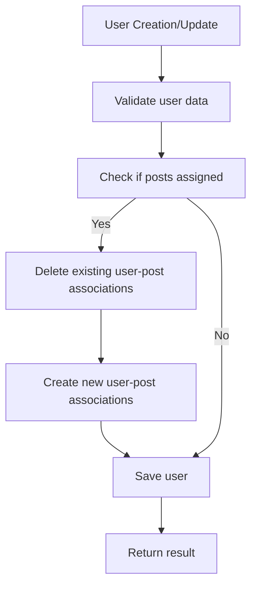

**Section sources**
- [SysUserServiceImpl.java](file://src/main/java/com/ruoyi/project/system/service/impl/SysUserServiceImpl.java#L417-L425)
- [SysUserPostMapper.java](file://src/main/java/com/ruoyi/project/system/mapper/SysUserPostMapper.java#L43-L44)

### User Profile Display

The system provides methods to retrieve user post information for display purposes:

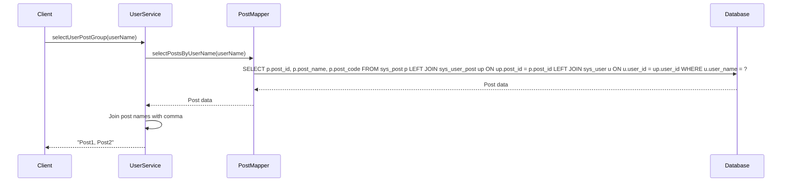

**Diagram sources**
- [SysUserServiceImpl.java](file://src/main/java/com/ruoyi/project/system/service/impl/SysUserServiceImpl.java#L155-L164)
- [SysPostMapper.xml](file://src/main/resources/mybatis/system/SysPostMapper.xml#L57-L63)

## Common Use Cases

### Standardizing Job Titles Across Departments

The Post Management module enables organizations to standardize job titles across different departments:

1. **Centralized Definition**: Create standardized post definitions in the system
2. **Consistent Assignment**: Assign standardized posts to users across departments
3. **Reporting**: Generate reports using standardized job titles for organizational analysis
4. **Export**: Export post data for integration with other systems

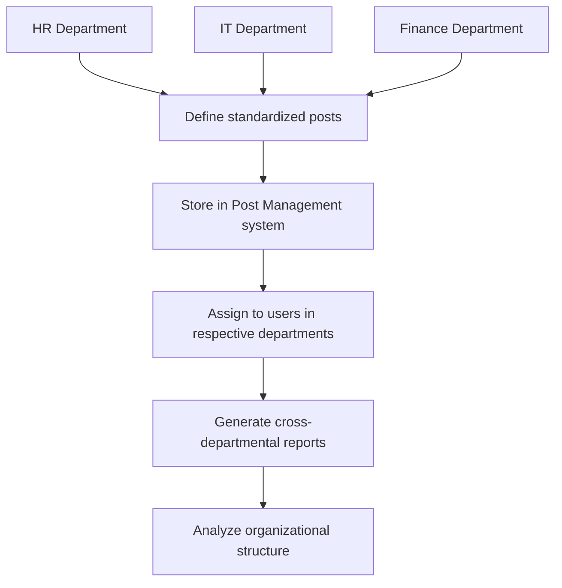

**Section sources**
- [SysPostController.java](file://src/main/java/com/ruoyi/project/system/controller/SysPostController.java#L49-L57)

### Bulk Operations and Export

The system supports bulk operations and data export for post management:

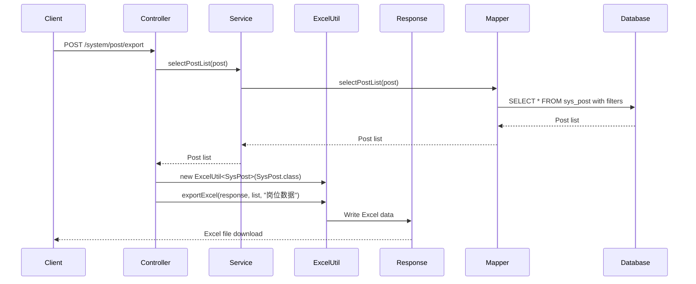

**Diagram sources**
- [SysPostController.java](file://src/main/java/com/ruoyi/project/system/controller/SysPostController.java#L49-L57)
- [SysPostMapper.xml](file://src/main/resources/mybatis/system/SysPostMapper.xml#L25-L38)

## Best Practices

### Post Categorization

To maintain data consistency and improve usability, follow these best practices for post categorization:

1. **Use Consistent Naming Conventions**: Establish and follow naming conventions for post codes and names
2. **Limit Post Proliferation**: Avoid creating redundant posts with similar responsibilities
3. **Regular Review**: Periodically review and consolidate posts to maintain data quality
4. **Hierarchical Organization**: Use post sort order to establish a logical hierarchy of positions

### Data Consistency

To ensure data consistency in the Post Management module:

1. **Enforce Validation Rules**: Always validate post names and codes for uniqueness
2. **Handle Dependencies**: Prevent deletion of posts assigned to users
3. **Maintain Audit Trail**: Track creation and modification of posts with timestamps and user information
4. **Implement Soft Deletes**: Consider implementing soft deletes instead of hard deletes to preserve historical data

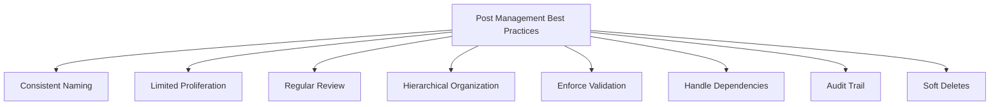

**Section sources**
- [SysPostServiceImpl.java](file://src/main/java/com/ruoyi/project/system/service/impl/SysPostServiceImpl.java#L141-L153)
- [SysPost.java](file://src/main/java/com/ruoyi/project/system/domain/SysPost.java#L54-L76)