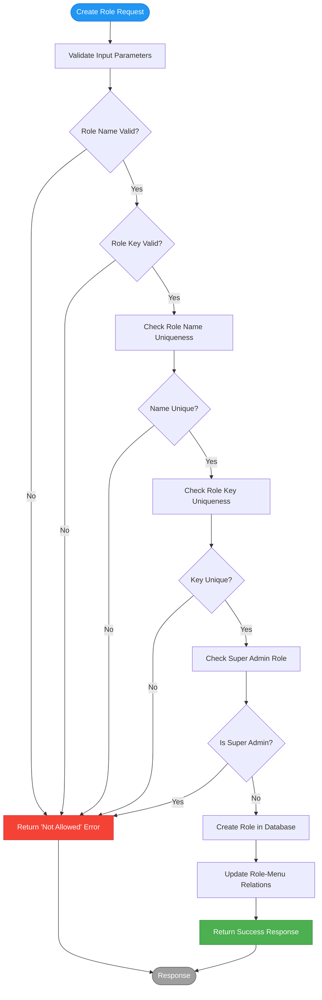
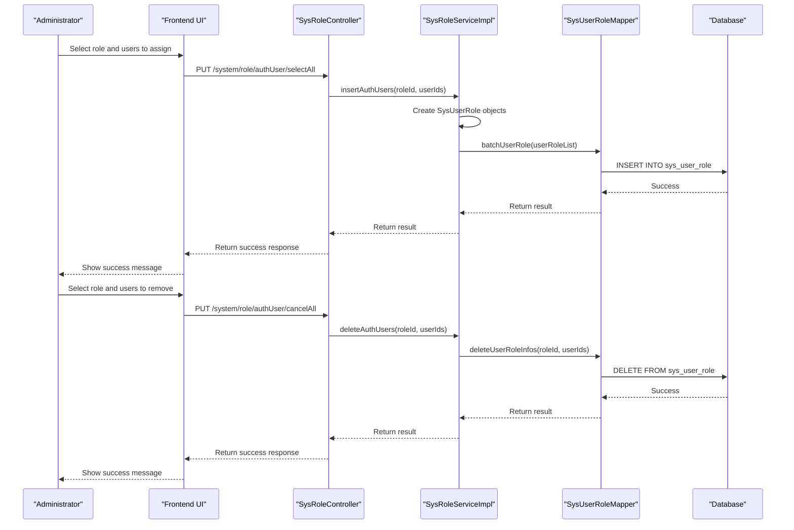
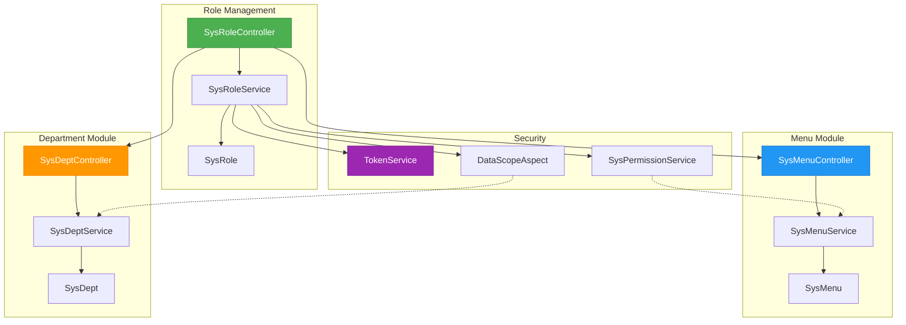
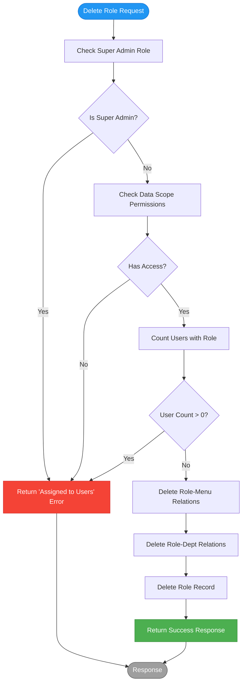
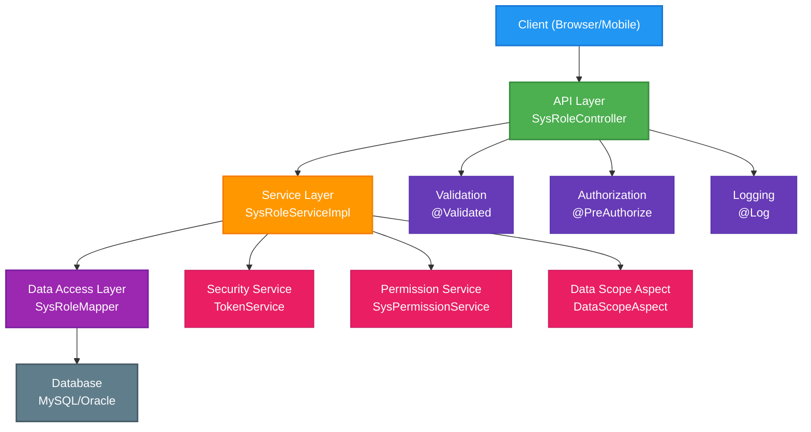

# Role Management

<cite>
**Referenced Files in This Document**   
- [SysRoleController.java](file://src/main/java/com/ruoyi/project/system/controller/SysRoleController.java)
- [SysRoleService.java](file://src/main/java/com/ruoyi/project/system/service/ISysRoleService.java)
- [SysRoleServiceImpl.java](file://src/main/java/com/ruoyi/project/system/service/impl/SysRoleServiceImpl.java)
- [SysRole.java](file://src/main/java/com/ruoyi/project/system/domain/SysRole.java)
- [SysUserRole.java](file://src/main/java/com/ruoyi/project/system/domain/SysUserRole.java)
- [SysRoleDept.java](file://src/main/java/com/ruoyi/project/system/domain/SysRoleDept.java)
- [SysRoleMenu.java](file://src/main/java/com/ruoyi/project/system/domain/SysRoleMenu.java)
- [SysRoleMapper.java](file://src/main/java/com/ruoyi/project/system/mapper/SysRoleMapper.java)
- [SysUserRoleMapper.java](file://src/main/java/com/ruoyi/project/system/mapper/SysUserRoleMapper.java)
- [SysRoleDeptMapper.java](file://src/main/java/com/ruoyi/project/system/mapper/SysRoleDeptMapper.java)
- [SysMenuController.java](file://src/main/java/com/ruoyi/project/system/controller/SysMenuController.java)
- [SysDeptController.java](file://src/main/java/com/ruoyi/project/system/controller/SysDeptController.java)
- [TokenService.java](file://src/main/java/com/ruoyi/framework/security/service/TokenService.java)
- [SysPermissionService.java](file://src/main/java/com/ruoyi/framework/security/service/SysPermissionService.java)
- [DataScopeAspect.java](file://src/main/java/com/ruoyi/framework/aspectj/DataScopeAspect.java)
- [ry_20250522.sql](file://sql/ry_20250522.sql)
</cite>

## Table of Contents
1. [Introduction](#introduction)
2. [Core Components](#core-components)
3. [RESTful Endpoints](#restful-endpoints)
4. [Role Creation and Validation](#role-creation-and-validation)
5. [Permission Assignment and Data Scope](#permission-assignment-and-data-scope)
6. [User-Role Assignment Management](#user-role-assignment-management)
7. [Integration with Menu and Department Modules](#integration-with-menu-and-department-modules)
8. [Role Deletion Constraints](#role-deletion-constraints)
9. [Role Status Changes and Access Impact](#role-status-changes-and-access-impact)
10. [Best Practices for Role Design](#best-practices-for-role-design)
11. [Architecture Overview](#architecture-overview)

## Introduction
The Role Management module in the RuoYi-Vue system implements a comprehensive role-based access control (RBAC) system that enables administrators to manage user permissions through role assignment. This module provides a complete solution for role creation, permission assignment, data scope configuration, and user-role management. The implementation follows a layered architecture with clear separation between controllers, services, and data access components, ensuring maintainability and extensibility. The system enforces business rules such as role name and key uniqueness, handles data scope limitations, and integrates with authentication mechanisms to ensure secure access control.

**Section sources**
- [SysRoleController.java](file://src/main/java/com/ruoyi/project/system/controller/SysRoleController.java#L1-L42)
- [SysRole.java](file://src/main/java/com/ruoyi/project/system/domain/SysRole.java#L1-L18)

## Core Components
The Role Management module consists of several core components that work together to provide a complete RBAC solution. The `SysRoleController` serves as the entry point for all role-related operations, handling RESTful requests and coordinating with service components. The `ISysRoleService` interface defines the contract for role management operations, while the `SysRoleServiceImpl` class provides the concrete implementation with transaction management and business logic. The `SysRole` domain entity represents the role data structure with properties for role name, key, data scope, status, and associated permissions. Supporting entities like `SysUserRole`, `SysRoleDept`, and `SysRoleMenu` manage the relationships between roles and users, departments, and menus respectively. The system also includes mapper interfaces that define data access operations for persistence.

**Section sources**
- [SysRoleController.java](file://src/main/java/com/ruoyi/project/system/controller/SysRoleController.java#L43-L57)
- [SysRoleService.java](file://src/main/java/com/ruoyi/project/system/service/ISysRoleService.java#L13-L174)
- [SysRoleServiceImpl.java](file://src/main/java/com/ruoyi/project/system/service/impl/SysRoleServiceImpl.java#L33-L35)
- [SysRole.java](file://src/main/java/com/ruoyi/project/system/domain/SysRole.java#L18-L242)

## RESTful Endpoints
The Role Management module exposes a comprehensive set of RESTful endpoints for role operations. The GET /list endpoint retrieves a paginated list of roles based on filtering criteria, requiring the 'system:role:list' permission. The POST / endpoint creates a new role, with validation for name and key uniqueness, and requires the 'system:role:add' permission. The PUT / endpoint updates an existing role, including validation and permission checks, requiring the 'system:role:edit' permission. The DELETE /{roleIds} endpoint allows batch deletion of roles by ID, requiring the 'system:role:remove' permission. Additional endpoints include GET /{roleId} for retrieving role details, PUT /dataScope for configuring data scope, PUT /changeStatus for modifying role status, and various endpoints for user-role assignment operations.

```mermaid
flowchart TD
Client["Client Application"] --> |GET /list| ListEndpoint["GET /system/role/list"]
Client --> |POST /| AddEndpoint["POST /system/role"]
Client --> |PUT /| EditEndpoint["PUT /system/role"]
Client --> |PUT /dataScope| DataScopeEndpoint["PUT /system/role/dataScope"]
Client --> |PUT /changeStatus| StatusEndpoint["PUT /system/role/changeStatus"]
Client --> |DELETE /{roleIds}| DeleteEndpoint["DELETE /system/role/{roleIds}"]
Client --> |GET /{roleId}| InfoEndpoint["GET /system/role/{roleId}"]
ListEndpoint --> Controller["SysRoleController.list()"]
AddEndpoint --> Controller["SysRoleController.add()"]
EditEndpoint --> Controller["SysRoleController.edit()"]
DataScopeEndpoint --> Controller["SysRoleController.dataScope()"]
StatusEndpoint --> Controller["SysRoleController.changeStatus()"]
DeleteEndpoint --> Controller["SysRoleController.remove()"]
InfoEndpoint --> Controller["SysRoleController.getInfo()"]
Controller --> Service["SysRoleServiceImpl"]
Service --> Mapper["SysRoleMapper"]
Mapper --> Database[(Database)]
style ListEndpoint fill:#4CAF50,stroke:#388E3C,color:white
style AddEndpoint fill:#2196F3,stroke:#1976D2,color:white
style EditEndpoint fill:#FF9800,stroke:#F57C00,color:white
style DeleteEndpoint fill:#F44336,stroke:#D32F2F,color:white
```

**Diagram sources **
- [SysRoleController.java](file://src/main/java/com/ruoyi/project/system/controller/SysRoleController.java#L58-L180)
- [SysRoleService.java](file://src/main/java/com/ruoyi/project/system/service/ISysRoleService.java#L21-L146)

## Role Creation and Validation
The role creation process in the RuoYi-Vue system enforces strict validation rules to maintain data integrity. When creating a new role through the POST / endpoint, the system validates that both the role name and role key are unique across all roles. The validation is performed by the `checkRoleNameUnique` and `checkRoleKeyUnique` methods in the `SysRoleService`. These methods query the database to ensure no existing role has the same name or key, excluding the current role in update operations. The role name is annotated with @NotBlank and @Size constraints to ensure it is not empty and does not exceed 30 characters, while the role key has similar constraints with a maximum length of 100 characters. The system also prevents modification of the super administrator role (role ID = 1) through the `checkRoleAllowed` method, which throws a ServiceException if an attempt is made to modify this privileged role.



**Diagram sources **
- [SysRoleController.java](file://src/main/java/com/ruoyi/project/system/controller/SysRoleController.java#L94-L107)
- [SysRoleServiceImpl.java](file://src/main/java/com/ruoyi/project/system/service/impl/SysRoleServiceImpl.java#L148-L176)
- [SysRole.java](file://src/main/java/com/ruoyi/project/system/domain/SysRole.java#L97-L119)

## Permission Assignment and Data Scope
The Role Management module implements a sophisticated permission assignment system that integrates with both menu and data scope configurations. Permissions are assigned through the role-menu relationship, where each role can be associated with multiple menus, granting access to specific application features. The data scope configuration determines the extent of data access a role has, with five predefined options: all data permissions (1), custom data permissions (2), department data permissions (3), department and below data permissions (4), and personal data permissions (5). The `authDataScope` method in `SysRoleService` handles data scope updates by modifying the role-department associations in the `sys_role_dept` table. This method operates within a transaction, first updating the role information, then deleting existing role-department associations, and finally inserting new associations based on the selected departments.

```mermaid
classDiagram
class SysRole {
+Long roleId
+String roleName
+String roleKey
+String dataScope
+String status
+Long[] menuIds
+Long[] deptIds
+Set~String~ permissions
+boolean isAdmin()
+static boolean isAdmin(Long roleId)
}
class SysRoleMenu {
+Long roleId
+Long menuId
}
class SysRoleDept {
+Long roleId
+Long deptId
}
class SysUserRole {
+Long userId
+Long roleId
}
SysRole "1" -- "0..*" SysRoleMenu : contains
SysRole "1" -- "0..*" SysRoleDept : contains
SysRole "1" -- "0..*" SysUserRole : assigned to
SysRoleMenu --> SysMenu : references
SysRoleDept --> SysDept : references
note right of SysRole
dataScope values :
1 = All data permissions
2 = Custom data permissions
3 = Department data permissions
4 = Department and below data permissions
5 = Personal data permissions
end note
note right of SysRoleMenu
Represents the relationship between
roles and menus for permission control
end note
note right of SysRoleDept
Represents the relationship between
roles and departments for data scope
end note
```

**Diagram sources **
- [SysRole.java](file://src/main/java/com/ruoyi/project/system/domain/SysRole.java#L22-L65)
- [SysRoleMenu.java](file://src/main/java/com/ruoyi/project/system/domain/SysRoleMenu.java#L13-L17)
- [SysRoleDept.java](file://src/main/java/com/ruoyi/project/system/domain/SysRoleDept.java#L13-L17)
- [SysUserRole.java](file://src/main/java/com/ruoyi/project/system/domain/SysUserRole.java#L13-L17)

## User-Role Assignment Management
The system provides comprehensive endpoints for managing user-role assignments, allowing administrators to grant or revoke roles from users. The selectAuthUser endpoint retrieves users who can be assigned to a role, while insertAuthRole adds users to a role. The cancelAuthUser endpoint removes a specific user from a role, and cancelAuthUserAll removes multiple users from a role. These operations are implemented through the `deleteAuthUser` and `deleteAuthUsers` methods in `SysRoleService`, which modify the `sys_user_role` table that maintains the many-to-many relationship between users and roles. The system also provides endpoints to list both allocated and unallocated users for a role, enabling administrators to view the current assignment state and make informed decisions about role assignments.



**Diagram sources **
- [SysRoleController.java](file://src/main/java/com/ruoyi/project/system/controller/SysRoleController.java#L238-L248)
- [SysRoleServiceImpl.java](file://src/main/java/com/ruoyi/project/system/service/impl/SysRoleServiceImpl.java#L413-L426)
- [SysUserRoleMapper.java](file://src/main/java/com/ruoyi/project/system/mapper/SysUserRoleMapper.java#L44-L62)

## Integration with Menu and Department Modules
The Role Management module is tightly integrated with both the Menu and Department modules to provide comprehensive access control. The menu integration allows roles to be assigned specific menu permissions, controlling which application features users can access. This is achieved through the `sys_role_menu` table that establishes a many-to-many relationship between roles and menus. The department integration enables data scope configuration, determining which organizational data a role can access. This is implemented through the `sys_role_dept` table that links roles to departments for data permission purposes. The `DataScopeAspect` class implements AOP functionality that automatically applies data scope filters to queries based on the user's role, ensuring that users only access data they are authorized to see. The system also provides dedicated endpoints like /deptTree/{roleId} and /roleMenuTreeselect/{roleId} to retrieve department and menu trees pre-selected with the role's current assignments.



**Diagram sources **
- [SysRoleController.java](file://src/main/java/com/ruoyi/project/system/controller/SysRoleController.java#L53-L56)
- [SysMenuController.java](file://src/main/java/com/ruoyi/project/system/controller/SysMenuController.java#L33-L34)
- [SysDeptController.java](file://src/main/java/com/ruoyi/project/system/controller/SysDeptController.java#L34-L35)
- [DataScopeAspect.java](file://src/main/java/com/ruoyi/framework/aspectj/DataScopeAspect.java#L1-L85)

## Role Deletion Constraints
The system implements strict constraints to prevent accidental deletion of roles that are currently in use. When attempting to delete a role through the DELETE /{roleIds} endpoint, the system first checks if the role is allowed to be modified using the `checkRoleAllowed` method, which prevents deletion of the super administrator role. It then verifies the user's data scope permissions using `checkRoleDataScope`. Most importantly, the system checks if the role is currently assigned to any users by calling `countUserRoleByRoleId`. If the count is greater than zero, the deletion is rejected with a ServiceException indicating that the role is already assigned and cannot be deleted. This constraint ensures data integrity and prevents access disruption for users who depend on the role. The deletion process is transactional, ensuring that all related role-menu and role-department associations are removed atomically if the deletion is permitted.



**Diagram sources **
- [SysRoleController.java](file://src/main/java/com/ruoyi/project/system/controller/SysRoleController.java#L177-L180)
- [SysRoleServiceImpl.java](file://src/main/java/com/ruoyi/project/system/service/impl/SysRoleServiceImpl.java#L364-L379)
- [ISysRoleService.java](file://src/main/java/com/ruoyi/project/system/service/ISysRoleService.java#L140-L146)

## Role Status Changes and Access Impact
The system provides functionality to change the status of roles between active (0) and disabled (1) states through the PUT /changeStatus endpoint. When a role's status is changed, the modification is immediately reflected in the database, but the impact on user access depends on the authentication mechanism's cache expiration policy. The status change itself does not trigger immediate permission cache updates, meaning users with the modified role may continue to have access until their authentication token expires or is refreshed. Administrators should communicate status changes to affected users and consider forcing re-authentication when immediate access revocation is required. The system does not automatically remove users from disabled roles, preserving the assignment relationships so they can be easily reactivated. This approach balances security with usability, allowing for temporary role deactivation without losing role assignment history.

**Section sources**
- [SysRoleController.java](file://src/main/java/com/ruoyi/project/system/controller/SysRoleController.java#L162-L169)
- [SysRoleServiceImpl.java](file://src/main/java/com/ruoyi/project/system/service/impl/SysRoleServiceImpl.java#L265-L269)
- [SysRole.java](file://src/main/java/com/ruoyi/project/system/domain/SysRole.java#L48-L50)

## Best Practices for Role Design
When designing roles in the RuoYi-Vue system, several best practices should be followed to ensure effective access control and maintainability. Roles should be designed around job functions rather than individual users, following the principle of least privilege. Role names should be descriptive and consistent, following a standardized naming convention across the organization. Role keys should be unique, concise, and follow a consistent pattern that reflects the role's purpose. Data scope should be carefully considered, with custom data scope (option 2) used when precise control over department access is needed. Regular audits of role assignments and permissions should be conducted to ensure compliance with security policies. The super administrator role should be used sparingly and only for essential administrative tasks. When creating new roles, consider cloning existing similar roles rather than starting from scratch to maintain consistency.

**Section sources**
- [SysRole.java](file://src/main/java/com/ruoyi/project/system/domain/SysRole.java#L38-L40)
- [UserConstants.java](file://src/main/java/com/ruoyi/common/constant/UserConstants.java)
- [SysRoleServiceImpl.java](file://src/main/java/com/ruoyi/project/system/service/impl/SysRoleServiceImpl.java#L184-L189)

## Architecture Overview
The Role Management module follows a clean, layered architecture that separates concerns and promotes maintainability. At the presentation layer, the `SysRoleController` handles HTTP requests and responses, implementing RESTful principles. The business logic layer is represented by the `ISysRoleService` interface and its implementation `SysRoleServiceImpl`, which contains the core business rules and coordinates operations across multiple components. The data access layer consists of mapper interfaces that define database operations, implemented by MyBatis to interact with the underlying database. Domain entities represent the business objects and their relationships. The system integrates with security components like `TokenService` and `SysPermissionService` to ensure proper authentication and authorization. This architecture enables clear separation of concerns, making the system easier to understand, test, and extend.



**Diagram sources **
- [SysRoleController.java](file://src/main/java/com/ruoyi/project/system/controller/SysRoleController.java#L39-L41)
- [SysRoleServiceImpl.java](file://src/main/java/com/ruoyi/project/system/service/impl/SysRoleServiceImpl.java#L33-L35)
- [SysRoleMapper.java](file://src/main/java/com/ruoyi/project/system/mapper/SysRoleMapper.java#L11-L12)
- [TokenService.java](file://src/main/java/com/ruoyi/framework/security/service/TokenService.java#L31-L32)
- [SysPermissionService.java](file://src/main/java/com/ruoyi/framework/security/service/SysPermissionService.java#L22-L23)