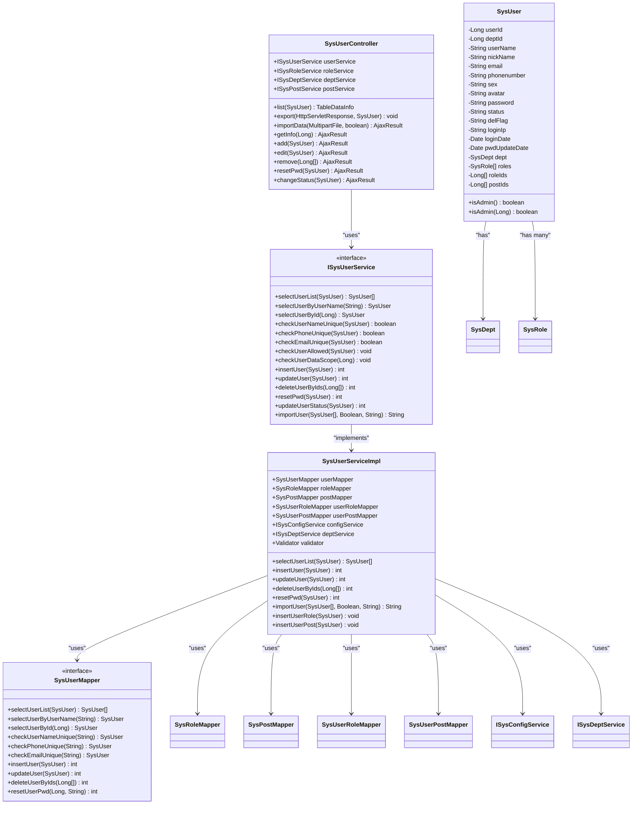
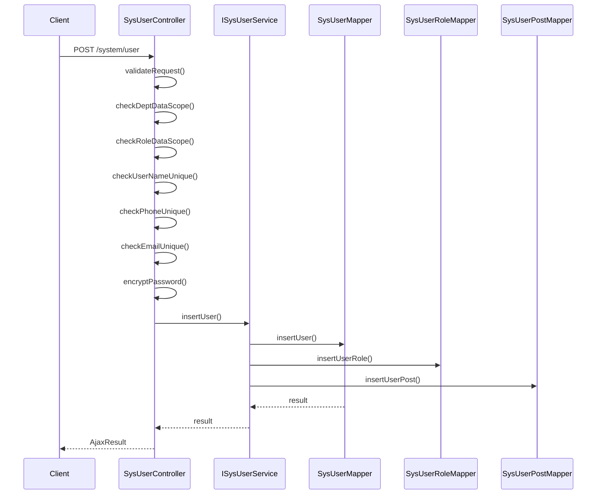
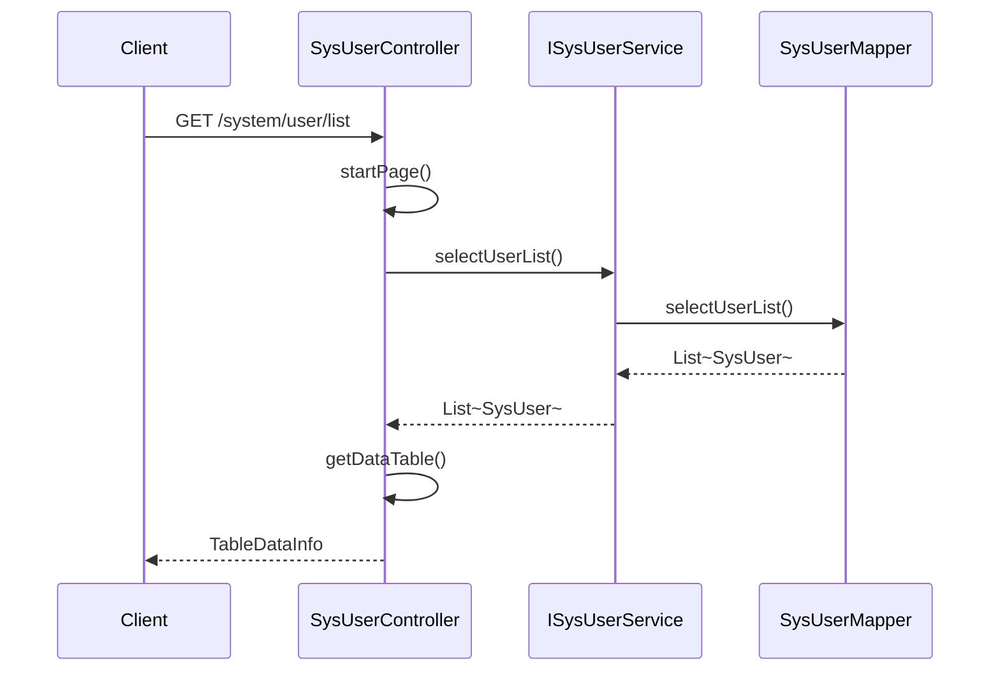
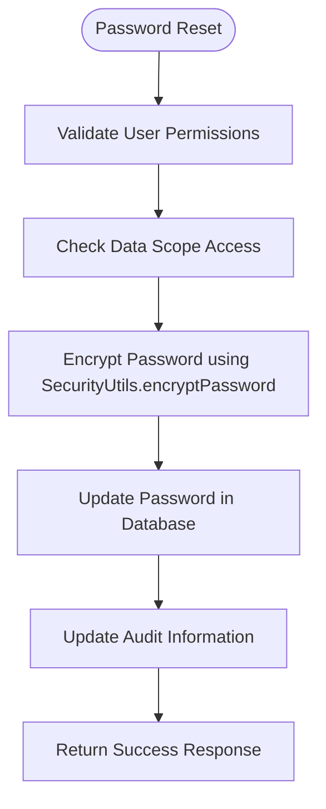
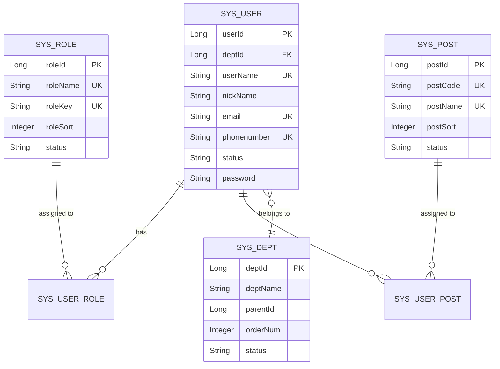

# User Management

<cite>
**Referenced Files in This Document**   
- [SysUserController.java](file://src/main/java/com/ruoyi/project/system/controller/SysUserController.java)
- [ISysUserService.java](file://src/main/java/com/ruoyi/project/system/service/ISysUserService.java)
- [SysUserServiceImpl.java](file://src/main/java/com/ruoyi/project/system/service/impl/SysUserServiceImpl.java)
- [SysUserMapper.java](file://src/main/java/com/ruoyi/project/system/mapper/SysUserMapper.java)
- [SysUser.java](file://src/main/java/com/ruoyi/project/system/domain/SysUser.java)
- [SysRoleMapper.java](file://src/main/java/com/ruoyi/project/system/mapper/SysRoleMapper.java)
- [SysPostMapper.java](file://src/main/java/com/ruoyi/project/system/mapper/SysPostMapper.java)
- [SysUserRoleMapper.java](file://src/main/java/com/ruoyi/project/system/mapper/SysUserRoleMapper.java)
- [SysUserPostMapper.java](file://src/main/java/com/ruoyi/project/system/mapper/SysUserPostMapper.java)
</cite>

## Table of Contents
1. [Introduction](#introduction)
2. [Core Components and Architecture](#core-components-and-architecture)
3. [User CRUD Operations](#user-crud-operations)
4. [Profile Management](#profile-management)
5. [Password Reset and Security](#password-reset-and-security)
6. [Status Modification](#status-modification)
7. [Role and Post Assignment](#role-and-post-assignment)
8. [Data Scope and Permissions](#data-scope-and-permissions)
9. [Validation and Error Handling](#validation-and-error-handling)
10. [Batch Operations](#batch-operations)
11. [Performance Considerations](#performance-considerations)

## Introduction
The User Management module in the RuoYi-Vue system provides comprehensive functionality for managing user accounts within an enterprise application. This document details the implementation of user CRUD operations, profile management, password reset, status modification, and integration with role and department modules. The system follows a layered architecture with clear separation between controller, service, and data access layers, ensuring maintainability and scalability.

**Section sources**
- [SysUserController.java](file://src/main/java/com/ruoyi/project/system/controller/SysUserController.java#L1-L257)
- [SysUser.java](file://src/main/java/com/ruoyi/project/system/domain/SysUser.java#L1-L341)

## Core Components and Architecture

**Diagram sources**
- [SysUserController.java](file://src/main/java/com/ruoyi/project/system/controller/SysUserController.java#L1-L257)
- [ISysUserService.java](file://src/main/java/com/ruoyi/project/system/service/ISysUserService.java#L1-L218)
- [SysUserServiceImpl.java](file://src/main/java/com/ruoyi/project/system/service/impl/SysUserServiceImpl.java#L1-L566)
- [SysUserMapper.java](file://src/main/java/com/ruoyi/project/system/mapper/SysUserMapper.java#L1-L148)
- [SysUser.java](file://src/main/java/com/ruoyi/project/system/domain/SysUser.java#L1-L341)

**Section sources**
- [SysUserController.java](file://src/main/java/com/ruoyi/project/system/controller/SysUserController.java#L1-L257)
- [ISysUserService.java](file://src/main/java/com/ruoyi/project/system/service/ISysUserService.java#L1-L218)
- [SysUserServiceImpl.java](file://src/main/java/com/ruoyi/project/system/service/impl/SysUserServiceImpl.java#L1-L566)
- [SysUserMapper.java](file://src/main/java/com/ruoyi/project/system/mapper/SysUserMapper.java#L1-L148)

## User CRUD Operations

The User Management module implements standard CRUD operations through RESTful endpoints in the SysUserController class. The controller acts as an intermediary between the client and the service layer, handling HTTP requests and responses.

### Create Operation
The POST / endpoint creates a new user. The process involves:
1. Data validation through @Validated annotation
2. Department and role data scope verification
3. Uniqueness checks for username, phone, and email
4. Password encryption using SecurityUtils.encryptPassword
5. User creation with audit information

**Diagram sources**
- [SysUserController.java](file://src/main/java/com/ruoyi/project/system/controller/SysUserController.java#L122-L144)
- [SysUserServiceImpl.java](file://src/main/java/com/ruoyi/project/system/service/impl/SysUserServiceImpl.java#L260-L271)
- [SysUserMapper.java](file://src/main/java/com/ruoyi/project/system/mapper/SysUserMapper.java#L61-L62)

**Section sources**
- [SysUserController.java](file://src/main/java/com/ruoyi/project/system/controller/SysUserController.java#L122-L144)
- [SysUserServiceImpl.java](file://src/main/java/com/ruoyi/project/system/service/impl/SysUserServiceImpl.java#L260-L271)

### Read Operation
The GET /list endpoint retrieves users with pagination support. The operation includes data scope filtering through the @DataScope annotation, ensuring users can only access data they have permission to view.

**Diagram sources**
- [SysUserController.java](file://src/main/java/com/ruoyi/project/system/controller/SysUserController.java#L59-L66)
- [SysUserServiceImpl.java](file://src/main/java/com/ruoyi/project/system/service/impl/SysUserServiceImpl.java#L75-L80)
- [SysUserMapper.java](file://src/main/java/com/ruoyi/project/system/mapper/SysUserMapper.java#L21-L22)

**Section sources**
- [SysUserController.java](file://src/main/java/com/ruoyi/project/system/controller/SysUserController.java#L59-L66)
- [SysUserServiceImpl.java](file://src/main/java/com/ruoyi/project/system/service/impl/SysUserServiceImpl.java#L75-L80)

### Update Operation
The PUT / endpoint modifies existing user information. The system ensures data integrity by:
1. Verifying user permissions through checkUserAllowed
2. Checking data scope access
3. Validating uniqueness constraints
4. Maintaining audit trail with updateBy field

**Section sources**
- [SysUserController.java](file://src/main/java/com/ruoyi/project/system/controller/SysUserController.java#L149-L172)
- [SysUserServiceImpl.java](file://src/main/java/com/ruoyi/project/system/service/impl/SysUserServiceImpl.java#L291-L305)

### Delete Operation
The DELETE /{userIds} endpoint removes users in bulk. The implementation prevents deletion of the current user and verifies permissions before deletion.

**Section sources**
- [SysUserController.java](file://src/main/java/com/ruoyi/project/system/controller/SysUserController.java#L177-L187)
- [SysUserServiceImpl.java](file://src/main/java/com/ruoyi/project/system/service/impl/SysUserServiceImpl.java#L475-L489)

## Profile Management

The system provides comprehensive profile management capabilities through various endpoints. User profiles include personal information such as nickname, email, phone number, gender, and avatar.

### Profile Update
Users can update their basic profile information through the standard edit operation. The system validates input data using annotations like @Email, @Size, and @Xss to ensure data quality and security.

### Avatar Management
The updateUserAvatar method allows changing user avatars. The implementation stores avatar paths in the database and provides methods to update this information.

**Section sources**
- [SysUser.java](file://src/main/java/com/ruoyi/project/system/domain/SysUser.java#L1-L341)
- [SysUserServiceImpl.java](file://src/main/java/com/ruoyi/project/system/service/impl/SysUserServiceImpl.java#L352-L356)

## Password Reset and Security

Password management is a critical aspect of user security in the system. The implementation follows security best practices to protect user credentials.

### Password Encryption
All passwords are encrypted using the SecurityUtils.encryptPassword method before storage. This ensures that plaintext passwords are never stored in the database.

**Diagram sources**
- [SysUserController.java](file://src/main/java/com/ruoyi/project/system/controller/SysUserController.java#L192-L202)
- [SysUserServiceImpl.java](file://src/main/java/com/ruoyi/project/system/service/impl/SysUserServiceImpl.java#L377-L381)
- [SysUserMapper.java](file://src/main/java/com/ruoyi/project/system/mapper/SysUserMapper.java#L106-L107)

**Section sources**
- [SysUserController.java](file://src/main/java/com/ruoyi/project/system/controller/SysUserController.java#L192-L202)
- [SysUserServiceImpl.java](file://src/main/java/com/ruoyi/project/system/service/impl/SysUserServiceImpl.java#L377-L381)

## Status Modification

The system allows administrators to modify user status (active/inactive) through the changeStatus endpoint. This feature enables account deactivation without permanent deletion.

**Section sources**
- [SysUserController.java](file://src/main/java/com/ruoyi/project/system/controller/SysUserController.java#L207-L216)
- [SysUserServiceImpl.java](file://src/main/java/com/ruoyi/project/system/service/impl/SysUserServiceImpl.java#L327-L331)

## Role and Post Assignment

The User Management module integrates with role and department modules to provide comprehensive access control.

### Role Assignment
Users can be assigned to multiple roles through the roleIds property. The system maintains this relationship in the sys_user_role junction table.

### Post Assignment
Similarly, users can be assigned to multiple posts (positions) through the postIds property, with relationships stored in the sys_user_post table.

**Diagram sources**
- [SysUser.java](file://src/main/java/com/ruoyi/project/system/domain/SysUser.java#L84-L91)
- [SysUserRole.java](file://src/main/java/com/ruoyi/project/system/domain/SysUserRole.java)
- [SysUserPost.java](file://src/main/java/com/ruoyi/project/system/domain/SysUserPost.java)

**Section sources**
- [SysUserServiceImpl.java](file://src/main/java/com/ruoyi/project/system/service/impl/SysUserServiceImpl.java#L267-L269)
- [SysUserServiceImpl.java](file://src/main/java/com/ruoyi/project/system/service/impl/SysUserServiceImpl.java#L301-L303)

## Data Scope and Permissions

The system implements robust data scope controls to ensure users can only access data they are authorized to view. The @DataScope annotation automatically filters queries based on user permissions.

**Section sources**
- [SysUserServiceImpl.java](file://src/main/java/com/ruoyi/project/system/service/impl/SysUserServiceImpl.java#L76-L80)
- [SysUserServiceImpl.java](file://src/main/java/com/ruoyi/project/system/service/impl/SysUserServiceImpl.java#L240-L252)

## Validation and Error Handling

The system implements comprehensive validation to maintain data integrity and prevent common issues:

### Duplicate Prevention
The system prevents duplicates through:
- Username uniqueness check
- Phone number uniqueness check
- Email uniqueness check

### Input Validation
Field-level validation is implemented using annotations:
- @NotBlank for required fields
- @Email for email format
- @Size for length constraints
- @Xss for XSS protection

**Section sources**
- [SysUserController.java](file://src/main/java/com/ruoyi/project/system/controller/SysUserController.java#L129-L139)
- [SysUserServiceImpl.java](file://src/main/java/com/ruoyi/project/system/service/impl/SysUserServiceImpl.java#L172-L218)
- [SysUser.java](file://src/main/java/com/ruoyi/project/system/domain/SysUser.java#L136-L150)

## Batch Operations

The system supports batch operations for efficient user management:

### Import
The importData endpoint allows bulk user creation from Excel files. The implementation supports:
- Validation of imported data
- Option to update existing users
- Detailed success/failure reporting

### Export
The export endpoint generates Excel files containing user data for reporting and backup purposes.

**Section sources**
- [SysUserController.java](file://src/main/java/com/ruoyi/project/system/controller/SysUserController.java#L78-L88)
- [SysUserServiceImpl.java](file://src/main/java/com/ruoyi/project/system/service/impl/SysUserServiceImpl.java#L499-L563)

## Performance Considerations

The User Management module incorporates several performance optimizations:

### Pagination
All list operations support pagination to prevent memory issues with large datasets.

### Data Scope Filtering
The @DataScope annotation ensures queries are filtered at the database level, reducing data transfer and processing overhead.

### Transaction Management
Critical operations are wrapped in @Transactional annotations to ensure data consistency while optimizing database interactions.

**Section sources**
- [SysUserController.java](file://src/main/java/com/ruoyi/project/system/controller/SysUserController.java#L63-L65)
- [SysUserServiceImpl.java](file://src/main/java/com/ruoyi/project/system/service/impl/SysUserServiceImpl.java#L76-L80)
- [SysUserServiceImpl.java](file://src/main/java/com/ruoyi/project/system/service/impl/SysUserServiceImpl.java#L261-L262)