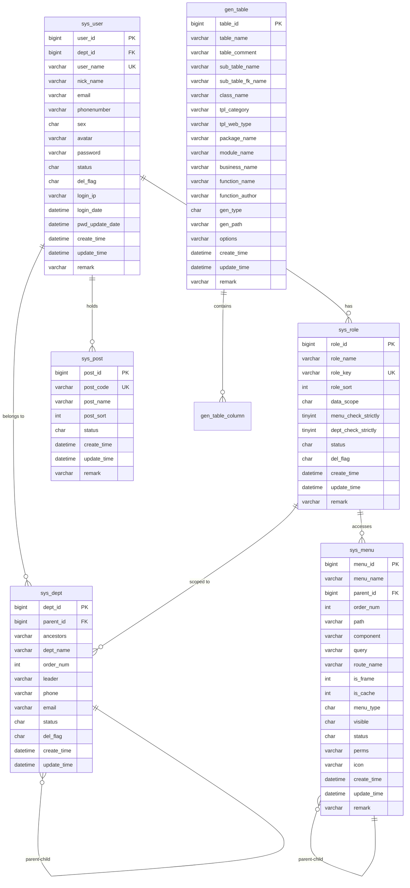
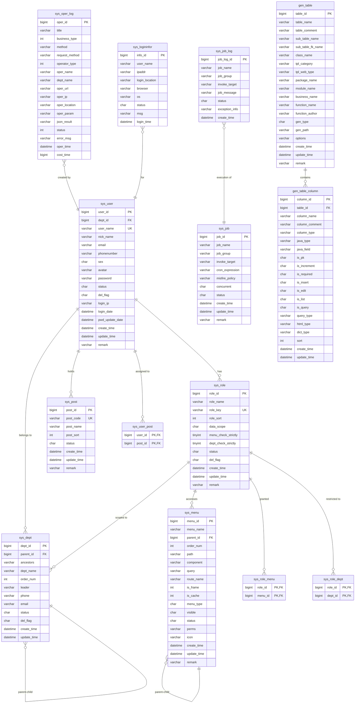
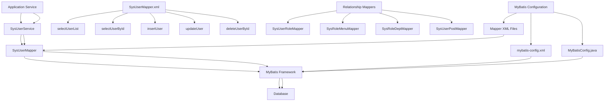

# Database Schema

<cite>
**Referenced Files in This Document**   
- [ry_20250522.sql](file://sql/ry_20250522.sql)
- [SysUser.java](file://src/main/java/com/ruoyi/project/system/domain/SysUser.java)
- [SysRole.java](file://src/main/java/com/ruoyi/project/system/domain/SysRole.java)
- [SysMenu.java](file://src/main/java/com/ruoyi/project/system/domain/SysMenu.java)
- [SysDept.java](file://src/main/java/com/ruoyi/project/system/domain/SysDept.java)
- [GenTable.java](file://src/main/java/com/ruoyi/project/tool/gen/domain/GenTable.java)
- [SysUserMapper.xml](file://src/main/resources/mybatis/system/SysUserMapper.xml)
- [SysRoleMapper.xml](file://src/main/resources/mybatis/system/SysRoleMapper.xml)
- [SysMenuMapper.xml](file://src/main/resources/mybatis/system/SysMenuMapper.xml)
- [SysDeptMapper.xml](file://src/main/resources/mybatis/system/SysDeptMapper.xml)
- [SysRoleDeptMapper.xml](file://src/main/resources/mybatis/system/SysRoleDeptMapper.xml)
- [SysUserRoleMapper.xml](file://src/main/resources/mybatis/system/SysUserRoleMapper.xml)
- [SysUserPostMapper.xml](file://src/main/resources/mybatis/system/SysUserPostMapper.xml)
- [SysOperLogMapper.xml](file://src/main/resources/mybatis/monitor/SysOperLogMapper.xml)
- [SysLogininforMapper.xml](file://src/main/resources/mybatis/monitor/SysLogininforMapper.xml)
- [SysJobLogMapper.xml](file://src/main/resources/mybatis/monitor/SysJobLogMapper.xml)
</cite>

## Table of Contents
1. [Introduction](#introduction)
2. [Core Entity Relationships](#core-entity-relationships)
3. [Core Table Definitions](#core-table-definitions)
4. [Data Validation and Business Rules](#data-validation-and-business-rules)
5. [Database Schema Diagram](#database-schema-diagram)
6. [MyBatis Mapper Integration](#mybatis-mapper-integration)
7. [Query Performance and Indexing](#query-performance-and-indexing)
8. [Data Lifecycle and Retention](#data-lifecycle-and-retention)
9. [Conclusion](#conclusion)

## Introduction

The RuoYi-Vue system implements a comprehensive database schema for managing user access, roles, permissions, departments, and system operations. This documentation provides a detailed analysis of the database schema, focusing on the core tables: sys_user, sys_role, sys_menu, sys_dept, and gen_table. The schema follows a relational model with well-defined relationships between entities, supporting a role-based access control (RBAC) system. The database design includes support for hierarchical data structures (such as department trees and menu trees), audit logging, and code generation capabilities. This document details the field definitions, data types, constraints, relationships, and business rules implemented in the database layer.

**Section sources**
- [ry_20250522.sql](file://sql/ry_20250522.sql#L1-L704)

## Core Entity Relationships

The RuoYi-Vue database schema implements a comprehensive role-based access control system with multiple interconnected entities. The core relationships between the main tables form a hierarchical structure that enables fine-grained permission management and organizational structure representation.

The central entity is the **sys_user** table, which represents system users and is linked to departments through the dept_id foreign key. Users are assigned roles through the many-to-many relationship table **sys_user_role**, which connects users to roles. Each role in the **sys_role** table can have multiple associated menus (permissions) through the **sys_role_menu** table, establishing what functionality a user can access based on their assigned roles.

The **sys_menu** table represents the application's navigation structure and functionality, organized hierarchically with parent-child relationships through the parent_id field. This allows for the creation of menu trees with directories (M), menus (C), and buttons (F). The **sys_dept** table represents the organizational structure with a similar hierarchical design, using parent_id and ancestors fields to maintain the department tree structure.

Additional relationships include the assignment of users to specific posts (jobs) through **sys_user_post**, and the definition of data scope for roles through **sys_role_dept**, which determines which departments a role can access. The code generation feature is supported by **gen_table** and **gen_table_column**, which store metadata about database tables for generating CRUD interfaces.

**Diagram sources**
- [ry_20250522.sql](file://sql/ry_20250522.sql#L41-L674)

**Section sources**
- [ry_20250522.sql](file://sql/ry_20250522.sql#L41-L674)

## Core Table Definitions

### sys_user Table

The sys_user table stores user account information and authentication details.

| Field | Data Type | Nullable | Default | Constraints | Description |
|-------|-----------|----------|---------|-------------|-------------|
| user_id | bigint(20) | NO | | PRIMARY KEY, AUTO_INCREMENT | User ID |
| dept_id | bigint(20) | YES | NULL | FOREIGN KEY (sys_dept.dept_id) | Department ID |
| user_name | varchar(30) | NO | | UNIQUE | User account |
| nick_name | varchar(30) | NO | | | User nickname |
| user_type | varchar(2) | YES | '00' | | User type (00 system user) |
| email | varchar(50) | YES | '' | | User email |
| phonenumber | varchar(11) | YES | '' | | Phone number |
| sex | char(1) | YES | '0' | | User gender (0 male, 1 female, 2 unknown) |
| avatar | varchar(100) | YES | '' | | Avatar URL |
| password | varchar(100) | YES | '' | | Password (hashed) |
| status | char(1) | YES | '0' | | Account status (0 normal, 1 disabled) |
| del_flag | char(1) | YES | '0' | | Delete flag (0 exists, 2 deleted) |
| login_ip | varchar(128) | YES | '' | | Last login IP |
| login_date | datetime | YES | | | Last login time |
| pwd_update_date | datetime | YES | | | Password last update time |
| create_by | varchar(64) | YES | '' | | Creator |
| create_time | datetime | YES | | | Creation time |
| update_by | varchar(64) | YES | '' | | Updater |
| update_time | datetime | YES | | | Update time |
| remark | varchar(500) | YES | NULL | | Remarks |

**Primary Key**: user_id
**Unique Constraints**: user_name
**Foreign Keys**: dept_id references sys_dept(dept_id)
**Indexes**: None explicitly defined (user_name is unique)

**Section sources**
- [ry_20250522.sql](file://sql/ry_20250522.sql#L41-L64)
- [SysUser.java](file://src/main/java/com/ruoyi/project/system/domain/SysUser.java#L21-L340)

### sys_role Table

The sys_role table defines user roles and their associated permissions and data scope.

| Field | Data Type | Nullable | Default | Constraints | Description |
|-------|-----------|----------|---------|-------------|-------------|
| role_id | bigint(20) | NO | | PRIMARY KEY, AUTO_INCREMENT | Role ID |
| role_name | varchar(30) | NO | | | Role name |
| role_key | varchar(100) | NO | | UNIQUE | Role permission string |
| role_sort | int(4) | NO | | | Display order |
| data_scope | char(1) | YES | '1' | | Data scope (1: all data, 2: custom, 3: department, 4: department and below) |
| menu_check_strictly | tinyint(1) | YES | 1 | | Menu tree selection strictly |
| dept_check_strictly | tinyint(1) | YES | 1 | | Department tree selection strictly |
| status | char(1) | NO | | | Role status (0 normal, 1 disabled) |
| del_flag | char(1) | YES | '0' | | Delete flag (0 exists, 2 deleted) |
| create_by | varchar(64) | YES | '' | | Creator |
| create_time | datetime | YES | | | Creation time |
| update_by | varchar(64) | YES | '' | | Updater |
| update_time | datetime | YES | | | Update time |
| remark | varchar(500) | YES | NULL | | Remarks |

**Primary Key**: role_id
**Unique Constraints**: role_key
**Indexes**: None explicitly defined

**Section sources**
- [ry_20250522.sql](file://sql/ry_20250522.sql#L104-L121)
- [SysRole.java](file://src/main/java/com/ruoyi/project/system/domain/SysRole.java#L18-L241)

### sys_menu Table

The sys_menu table defines the application's navigation structure and permission system.

| Field | Data Type | Nullable | Default | Constraints | Description |
|-------|-----------|----------|---------|-------------|-------------|
| menu_id | bigint(20) | NO | | PRIMARY KEY, AUTO_INCREMENT | Menu ID |
| menu_name | varchar(50) | NO | | | Menu name |
| parent_id | bigint(20) | YES | 0 | FOREIGN KEY (menu_id) | Parent menu ID |
| order_num | int(4) | YES | 0 | | Display order |
| path | varchar(200) | YES | '' | | Route address |
| component | varchar(255) | YES | NULL | | Component path |
| query | varchar(255) | YES | NULL | | Route parameters |
| route_name | varchar(50) | YES | '' | | Route name |
| is_frame | int(1) | YES | 1 | | Is external link (0 yes, 1 no) |
| is_cache | int(1) | YES | 0 | | Is cache (0 cache, 1 no cache) |
| menu_type | char(1) | YES | '' | | Menu type (M directory, C menu, F button) |
| visible | char(1) | YES | 0 | | Menu visibility (0 display, 1 hide) |
| status | char(1) | YES | 0 | | Menu status (0 normal, 1 disabled) |
| perms | varchar(100) | YES | NULL | | Permission identifier |
| icon | varchar(100) | YES | '#' | | Menu icon |
| create_by | varchar(64) | YES | '' | | Creator |
| create_time | datetime | YES | | | Creation time |
| update_by | varchar(64) | YES | '' | | Updater |
| update_time | datetime | YES | | | Update time |
| remark | varchar(500) | YES | '' | | Remarks |

**Primary Key**: menu_id
**Foreign Keys**: parent_id references sys_menu(menu_id)
**Indexes**: None explicitly defined

**Section sources**
- [ry_20250522.sql](file://sql/ry_20250522.sql#L133-L156)
- [SysMenu.java](file://src/main/java/com/ruoyi/project/system/domain/SysMenu.java#L17-L274)

### sys_dept Table

The sys_dept table represents the organizational structure with hierarchical departments.

| Field | Data Type | Nullable | Default | Constraints | Description |
|-------|-----------|----------|---------|-------------|-------------|
| dept_id | bigint(20) | NO | | PRIMARY KEY, AUTO_INCREMENT | Department ID |
| parent_id | bigint(20) | YES | 0 | FOREIGN KEY (dept_id) | Parent department ID |
| ancestors | varchar(50) | YES | '' | | Ancestor list |
| dept_name | varchar(30) | YES | '' | | Department name |
| order_num | int(4) | YES | 0 | | Display order |
| leader | varchar(20) | YES | NULL | | Leader |
| phone | varchar(11) | YES | NULL | | Phone |
| email | varchar(50) | YES | NULL | | Email |
| status | char(1) | YES | '0' | | Department status (0 normal, 1 disabled) |
| del_flag | char(1) | YES | '0' | | Delete flag (0 exists, 2 deleted) |
| create_by | varchar(64) | YES | '' | | Creator |
| create_time | datetime | YES | | | Creation time |
| update_by | varchar(64) | YES | '' | | Updater |
| update_time | datetime | YES | | | Update time |

**Primary Key**: dept_id
**Foreign Keys**: parent_id references sys_dept(dept_id)
**Indexes**: None explicitly defined

**Section sources**
- [ry_20250522.sql](file://sql/ry_20250522.sql#L4-L21)
- [SysDept.java](file://src/main/java/com/ruoyi/project/system/domain/SysDept.java#L18-L203)

### gen_table Table

The gen_table table stores metadata for code generation functionality.

| Field | Data Type | Nullable | Default | Constraints | Description |
|-------|-----------|----------|---------|-------------|-------------|
| table_id | bigint(20) | NO | | PRIMARY KEY, AUTO_INCREMENT | Table ID |
| table_name | varchar(200) | YES | '' | | Table name |
| table_comment | varchar(500) | YES | '' | | Table description |
| sub_table_name | varchar(64) | YES | NULL | | Sub-table name |
| sub_table_fk_name | varchar(64) | YES | NULL | | Sub-table foreign key name |
| class_name | varchar(100) | YES | '' | | Entity class name |
| tpl_category | varchar(200) | YES | 'crud' | | Template category (crud, tree) |
| tpl_web_type | varchar(30) | YES | '' | | Frontend template type |
| package_name | varchar(100) | YES | | | Package path |
| module_name | varchar(30) | YES | | | Module name |
| business_name | varchar(30) | YES | | | Business name |
| function_name | varchar(50) | YES | | | Function name |
| function_author | varchar(50) | YES | | | Function author |
| gen_type | char(1) | YES | '0' | | Code generation type (0 zip, 1 custom path) |
| gen_path | varchar(200) | YES | '/' | | Generation path |
| options | varchar(1000) | YES | | | Other generation options |
| create_by | varchar(64) | YES | '' | | Creator |
| create_time | datetime | YES | | | Creation time |
| update_by | varchar(64) | YES | '' | | Updater |
| update_time | datetime | YES | | | Update time |
| remark | varchar(500) | YES | NULL | | Remarks |

**Primary Key**: table_id
**Foreign Keys**: None
**Indexes**: None explicitly defined

**Section sources**
- [ry_20250522.sql](file://sql/ry_20250522.sql#L649-L673)
- [GenTable.java](file://src/main/java/com/ruoyi/project/tool/gen/domain/GenTable.java#L16-L384)

## Data Validation and Business Rules

The RuoYi-Vue database schema implements several data validation rules and business constraints at both the database and application levels.

### Field Validation Rules

**sys_user Table**:
- user_name: Required, unique, maximum 30 characters
- nick_name: Maximum 30 characters
- email: Valid email format, maximum 50 characters
- phonenumber: Maximum 11 characters
- sex: Enumerated values (0, 1, 2)
- status: Enumerated values (0, 1)
- del_flag: Enumerated values (0, 2)

**sys_role Table**:
- role_name: Required, maximum 30 characters
- role_key: Required, unique, maximum 100 characters
- role_sort: Required
- data_scope: Enumerated values (1-5)
- status: Required, enumerated values (0, 1)

**sys_menu Table**:
- menu_name: Required, maximum 50 characters
- order_num: Required
- path: Maximum 200 characters
- component: Maximum 255 characters
- menu_type: Required, enumerated values (M, C, F)
- perms: Maximum 100 characters

**sys_dept Table**:
- dept_name: Required, maximum 30 characters
- order_num: Required
- phone: Maximum 11 characters
- email: Valid email format, maximum 50 characters
- status: Enumerated values (0, 1)

### Business Rules

1. **Soft Delete Pattern**: All core tables implement a soft delete mechanism using the del_flag column (0 = exists, 2 = deleted) rather than physically removing records.

2. **Hierarchical Data Management**: Both departments and menus support hierarchical structures through parent_id and ancestors fields, enabling tree-like organizational and navigation structures.

3. **Role-Based Access Control**: The system implements a comprehensive RBAC model where:
   - Users are assigned to roles via sys_user_role
   - Roles are granted access to menus via sys_role_menu
   - Roles have defined data scopes that determine which department data they can access

4. **Data Scope Rules**: Roles can have different data scope levels:
   - 1: All data permissions
   - 2: Custom data permissions
   - 3: Department data permissions
   - 4: Department and below data permissions
   - 5: Only personal data permissions

5. **Code Generation Constraints**: The gen_table and gen_table_column tables store metadata for code generation with validation rules ensuring required fields like table_name, class_name, and package_name are provided.

6. **Password Security**: User passwords are stored as hashed values (indicated by the $2a$ prefix in sample data, suggesting bcrypt hashing).

7. **Audit Trail**: All core tables include create_by, create_time, update_by, and update_time fields to maintain an audit trail of record modifications.

**Section sources**
- [ry_20250522.sql](file://sql/ry_20250522.sql#L1-L704)
- [SysUser.java](file://src/main/java/com/ruoyi/project/system/domain/SysUser.java#L136-L202)
- [SysRole.java](file://src/main/java/com/ruoyi/project/system/domain/SysRole.java#L97-L110)
- [SysMenu.java](file://src/main/java/com/ruoyi/project/system/domain/SysMenu.java#L82-L195)
- [SysDept.java](file://src/main/java/com/ruoyi/project/system/domain/SysDept.java#L88-L134)

## Database Schema Diagram

**Diagram sources**
- [ry_20250522.sql](file://sql/ry_20250522.sql#L1-L704)

## MyBatis Mapper Integration

The RuoYi-Vue application uses MyBatis for database access, with XML-based mapper configurations that define the SQL operations for each entity.

### Mapper Configuration Structure

The MyBatis configuration is organized with mapper XML files located in src/main/resources/mybatis/system/ directory, each corresponding to a specific entity. The main configuration file mybatis-config.xml sets global parameters such as cacheEnabled, useGeneratedKeys, and logImpl.

The MyBatisConfig.java class configures the SqlSessionFactory bean, setting up the type aliases package and mapper locations from application properties. This enables the framework to automatically discover and register mapper interfaces.

### Core Mapper Operations

**User Management (SysUserMapper.xml)**:
- Implements complex queries with joins to retrieve user data with associated department and role information
- Uses resultMap inheritance to map nested objects (department and roles)
- Supports batch operations for user-role assignments
- Includes specialized queries for user allocation management

**Role Management (SysRoleMapper.xml)**:
- Provides queries for retrieving roles with data scope filtering
- Supports role permission checks and uniqueness validation
- Implements soft delete functionality through update operations

**Menu Management (SysMenuMapper.xml)**:
- Supports hierarchical menu retrieval with tree structures
- Implements permission-based filtering for menu visibility
- Provides methods for checking menu name uniqueness within parent contexts

**Department Management (SysDeptMapper.xml)**:
- Handles hierarchical department queries with ancestor path filtering
- Supports department tree operations
- Implements data scope filtering for department access

### Relationship Management Mappers

The system uses dedicated mappers for managing many-to-many relationships:

**SysUserRoleMapper.xml**: Manages the user-role relationship with operations for:
- Batch insertion of user-role assignments
- Deletion of role assignments by user or role
- Counting role assignments

**SysRoleMenuMapper.xml**: Manages the role-menu relationship with similar batch operations and deletion methods.

**SysRoleDeptMapper.xml**: Manages the role-department relationship for data scope definition.

**SysUserPostMapper.xml**: Manages the user-post relationship for job assignments.

The mapper configurations use MyBatis features such as:
- Dynamic SQL with <if> and <foreach> elements for conditional queries
- ResultMap definitions for object-relational mapping
- SQL fragments (<sql>) for reusable query components
- Parameterized queries to prevent SQL injection

**Diagram sources**
- [SysUserMapper.xml](file://src/main/resources/mybatis/system/SysUserMapper.xml#L1-L227)
- [SysRoleMapper.xml](file://src/main/resources/mybatis/system/SysRoleMapper.xml#L1-L152)
- [SysMenuMapper.xml](file://src/main/resources/mybatis/system/SysMenuMapper.xml#L1-L206)
- [SysDeptMapper.xml](file://src/main/resources/mybatis/system/SysDeptMapper.xml#L1-L29)
- [MyBatisConfig.java](file://src/main/java/com/ruoyi/framework/config/MyBatisConfig.java#L1-L125)

**Section sources**
- [SysUserMapper.xml](file://src/main/resources/mybatis/system/SysUserMapper.xml#L1-L227)
- [SysRoleMapper.xml](file://src/main/resources/mybatis/system/SysRoleMapper.xml#L1-L152)
- [SysMenuMapper.xml](file://src/main/resources/mybatis/system/SysMenuMapper.xml#L1-L206)
- [SysDeptMapper.xml](file://src/main/resources/mybatis/system/SysDeptMapper.xml#L1-L29)
- [mybatis-config.xml](file://src/main/resources/mybatis/mybatis-config.xml#L1-L20)
- [MyBatisConfig.java](file://src/main/java/com/ruoyi/framework/config/MyBatisConfig.java#L1-L125)

## Query Performance and Indexing

The RuoYi-Vue database schema includes several indexing strategies to optimize query performance for common operations.

### Current Indexing Strategy

The schema defines indexes on the following log tables:

**sys_oper_log**:
- idx_sys_oper_log_bt: Index on business_type for filtering operations by type
- idx_sys_oper_log_s: Index on status for filtering by operation status
- idx_sys_oper_log_ot: Index on oper_time for time-based queries

**sys_logininfor**:
- idx_sys_logininfor_s: Index on status for filtering login attempts by status
- idx_sys_logininfor_lt: Index on login_time for time-based queries

**sys_job_log**:
- No explicit indexes defined (relies on primary key)

### Performance Considerations

While the current indexing strategy focuses on the log tables, there are opportunities for additional indexes on core tables to improve performance:

**Recommended Indexes**:
1. **sys_user**: Index on user_name (already unique constraint) and email for authentication queries
2. **sys_user**: Index on login_date for user activity analysis
3. **sys_role**: Index on role_key for permission checking
4. **sys_menu**: Index on parent_id for hierarchical menu retrieval
5. **sys_dept**: Index on parent_id for department tree operations
6. **sys_user_role**: Index on role_id for role-based user queries
7. **sys_role_menu**: Index on menu_id for menu-based role queries

### Query Optimization

The MyBatis mapper configurations implement several performance optimization techniques:

1. **Selective Field Retrieval**: Queries retrieve only necessary fields rather than using SELECT *
2. **Join Optimization**: Complex queries use LEFT JOINs to retrieve related data in a single query, reducing database round trips
3. **Pagination Support**: The framework includes pagination capabilities to limit result set sizes
4. **Dynamic Filtering**: Queries use conditional WHERE clauses to filter results based on provided parameters
5. **Batch Operations**: Support for batch inserts and updates to reduce transaction overhead

### Query Patterns

Common query patterns in the application include:

1. **User Authentication**: Queries by user_name with password verification
2. **Permission Checking**: Retrieval of user roles and associated menu permissions
3. **Hierarchical Data Retrieval**: Tree-based queries for departments and menus using parent_id and ancestors
4. **List Filtering**: Paged queries with multiple filter criteria (name, status, date ranges)
5. **Existence Checks**: Unique constraint validation queries for user_name, email, phone, etc.

The data scope filtering feature (${params.dataScope}) in several queries allows for dynamic data access restrictions based on user roles and department affiliations.

**Section sources**
- [ry_20250522.sql](file://sql/ry_20250522.sql#L419-L442)
- [ry_20250522.sql](file://sql/ry_20250522.sql#L561-L575)
- [SysUserMapper.xml](file://src/main/resources/mybatis/system/SysUserMapper.xml#L60-L87)
- [SysRoleMapper.xml](file://src/main/resources/mybatis/system/SysRoleMapper.xml#L33-L57)

## Data Lifecycle and Retention

The RuoYi-Vue system implements a comprehensive data lifecycle management strategy for log tables, with specific retention policies and cleanup mechanisms.

### Log Table Retention Policies

**sys_oper_log (Operation Log)**:
- Stores records of all system operations (create, update, delete, etc.)
- Includes detailed information such as operation type, request parameters, response results, execution time, and error messages
- No explicit retention period defined in the schema
- Records are never physically deleted (no delete operations in SysOperLogMapper.xml)
- Designed for audit trail and troubleshooting purposes
- High-volume table that may require periodic archiving or cleanup

**sys_logininfor (Login Information)**:
- Records all user login attempts, both successful and failed
- Captures IP address, browser, operating system, and login location
- No explicit retention period defined
- Records are never physically deleted
- Important for security monitoring and anomaly detection
- May grow rapidly in active systems

**sys_job_log (Job Log)**:
- Stores execution logs for scheduled tasks and background jobs
- Includes job status, execution messages, and exception information
- No explicit retention period defined
- Records are never physically deleted
- Useful for monitoring job execution and troubleshooting failures

### Data Lifecycle Management

The system implements the following data lifecycle patterns:

1. **Creation**: All log records are created with a timestamp (create_time) and cannot be modified after creation.

2. **Retention**: Log records are retained indefinitely by default, as there are no automated cleanup processes defined in the schema or mapper configurations.

3. **Archiving**: No explicit archiving mechanism is implemented in the current schema.

4. **Purging**: No automatic purging of old records is configured.

### Recommendations for Production Use

For production environments, the following data lifecycle management practices are recommended:

1. **Implement Log Rotation**: Configure定期清理 or archiving of log records older than a specified period (e.g., 6 months or 1 year).

2. **Add Indexes for Time-based Queries**: Ensure indexes on timestamp columns to efficiently query and delete old records.

3. **Configure Archiving Strategy**: Implement a process to archive old log data to cold storage or data warehouse.

4. **Monitor Table Growth**: Regularly monitor the size of log tables and plan for database capacity accordingly.

5. **Implement Soft Delete for Logs**: If record deletion is required, implement a soft delete pattern similar to other tables rather than physical deletion.

6. **Use Partitioning**: For very large datasets, consider table partitioning by time period to improve query performance and management.

The current design prioritizes complete auditability over storage efficiency, which is appropriate for many enterprise applications but may require additional management in high-volume environments.

**Section sources**
- [ry_20250522.sql](file://sql/ry_20250522.sql#L419-L618)
- [SysOperLogMapper.xml](file://src/main/resources/mybatis/monitor/SysOperLogMapper.xml)
- [SysLogininforMapper.xml](file://src/main/resources/mybatis/monitor/SysLogininforMapper.xml)
- [SysJobLogMapper.xml](file://src/main/resources/mybatis/monitor/SysJobLogMapper.xml)

## Conclusion

The RuoYi-Vue database schema provides a robust foundation for a comprehensive enterprise management system with a well-designed role-based access control model. The schema effectively implements core entities for users, roles, menus, and departments with appropriate relationships and constraints.

Key strengths of the database design include:
- A flexible RBAC system with granular permission control
- Hierarchical data structures for departments and menus
- Comprehensive audit logging capabilities
- Soft delete pattern for data integrity
- Code generation support with metadata storage

The integration with MyBatis provides efficient data access with well-structured mapper configurations that support complex queries and batch operations. The use of resultMap inheritance and dynamic SQL enables flexible data retrieval patterns.

For production deployment, considerations should include:
- Implementing log retention policies for the operation, login, and job log tables
- Adding performance indexes on frequently queried fields
- Monitoring database growth, particularly for log tables
- Considering partitioning strategies for large datasets

The schema demonstrates a mature design approach with attention to security, auditability, and maintainability, making it suitable for enterprise applications requiring robust user management and access control.