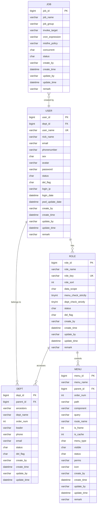
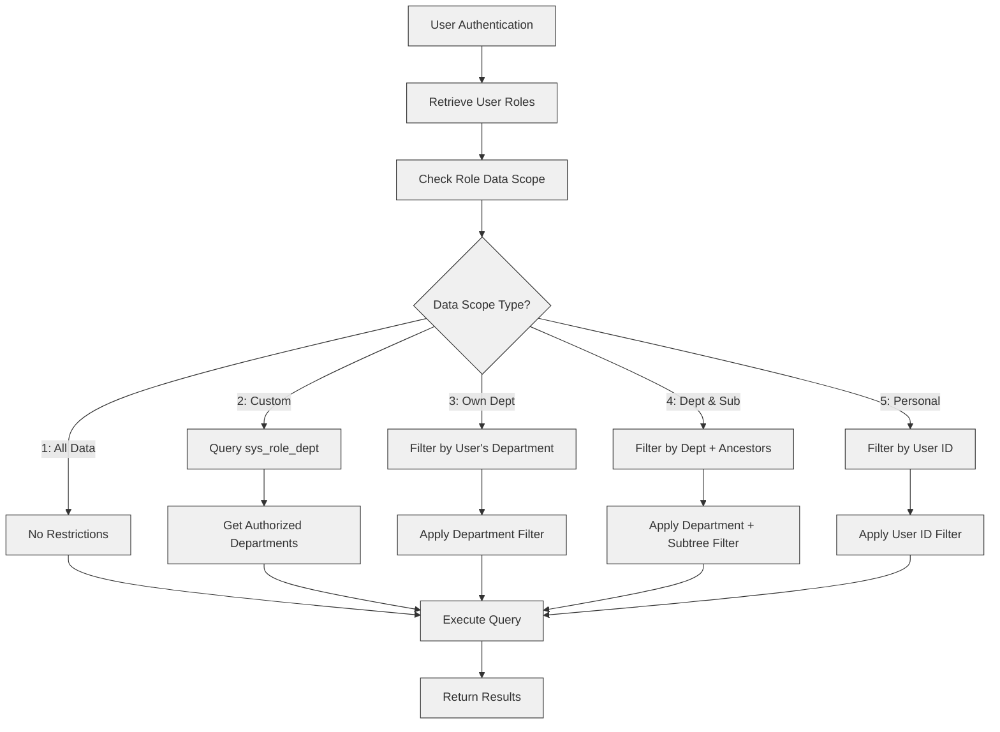
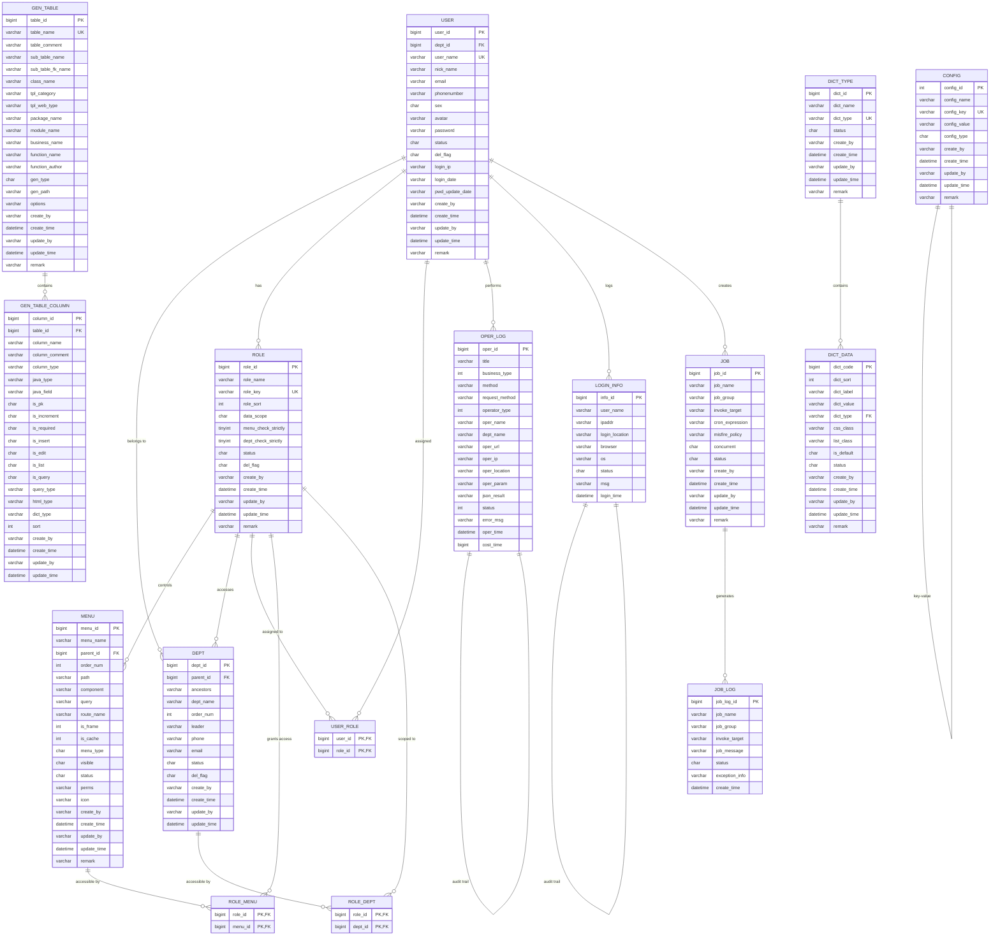

# Entity Relationship Diagram

<cite>
**Referenced Files in This Document**   
- [ry_20250522.sql](file://sql/ry_20250522.sql)
- [quartz.sql](file://sql/quartz.sql)
- [SysUser.java](file://src/main/java/com/ruoyi/project/system/domain/SysUser.java)
- [SysRole.java](file://src/main/java/com/ruoyi/project/system/domain/SysRole.java)
- [SysMenu.java](file://src/main/java/com/ruoyi/project/system/domain/SysMenu.java)
- [SysDept.java](file://src/main/java/com/ruoyi/project/system/domain/SysDept.java)
- [SysRoleDept.java](file://src/main/java/com/ruoyi/project/system/domain/SysRoleDept.java)
- [SysRoleMenu.java](file://src/main/java/com/ruoyi/project/system/domain/SysRoleMenu.java)
- [SysUserRole.java](file://src/main/java/com/ruoyi/project/system/domain/SysUserRole.java)
- [GenTable.java](file://src/main/java/com/ruoyi/project/tool/gen/domain/GenTable.java)
- [GenTableColumn.java](file://src/main/java/com/ruoyi/project/tool/gen/domain/GenTableColumn.java)
- [SysJob.java](file://src/main/java/com/ruoyi/project/monitor/domain/SysJob.java)
- [SysJobLog.java](file://src/main/java/com/ruoyi/project/monitor/domain/SysJobLog.java)
- [SysUserMapper.xml](file://src/main/resources/mybatis/system/SysUserMapper.xml)
- [SysRoleMapper.xml](file://src/main/resources/mybatis/system/SysRoleMapper.xml)
- [SysMenuMapper.xml](file://src/main/resources/mybatis/system/SysMenuMapper.xml)
</cite>

## Table of Contents
1. [Introduction](#introduction)
2. [Core Entity Relationships](#core-entity-relationships)
3. [Hierarchical Structures](#hierarchical-structures)
4. [Many-to-Many Relationships](#many-to-many-relationships)
5. [Data Scope Permissions](#data-scope-permissions)
6. [Code Generation Tables](#code-generation-tables)
7. [Quartz Job Integration](#quartz-job-integration)
8. [Entity Relationship Diagram](#entity-relationship-diagram)
9. [Conclusion](#conclusion)

## Introduction
This document provides comprehensive documentation of the entity relationship model in the RuoYi-Vue system. The data model is designed to support a robust role-based access control (RBAC) system with hierarchical organization structures, flexible permission management, and integrated code generation capabilities. The core entities include users, roles, menus, departments, and job scheduling components, interconnected through junction tables to establish many-to-many relationships. The model also incorporates tree patterns for hierarchical data representation and integrates with the Quartz scheduling framework for task management.

**Section sources**
- [ry_20250522.sql](file://sql/ry_20250522.sql#L1-L704)

## Core Entity Relationships
The RuoYi-Vue system implements a comprehensive RBAC model with five primary entities: sys_user, sys_role, sys_menu, sys_dept, and sys_job. These entities are interconnected through junction tables to establish flexible many-to-many relationships. The sys_user entity represents system users with authentication and profile information, while sys_role defines permission sets that can be assigned to users. The sys_menu entity structures the application's navigation and UI components, with permissions tied to specific menu items. The sys_dept entity organizes users into hierarchical organizational units, enabling department-based data access control. These relationships are managed through junction tables that maintain referential integrity and support cascading operations.



**Diagram sources**
- [ry_20250522.sql](file://sql/ry_20250522.sql#L38-L64)
- [ry_20250522.sql](file://sql/ry_20250522.sql#L104-L121)
- [ry_20250522.sql](file://sql/ry_20250522.sql#L133-L156)
- [ry_20250522.sql](file://sql/ry_20250522.sql#L4-L21)
- [ry_20250522.sql](file://sql/ry_20250522.sql#L581-L597)

**Section sources**
- [SysUser.java](file://src/main/java/com/ruoyi/project/system/domain/SysUser.java#L21-L341)
- [SysRole.java](file://src/main/java/com/ruoyi/project/system/domain/SysRole.java#L18-L242)
- [SysMenu.java](file://src/main/java/com/ruoyi/project/system/domain/SysMenu.java#L17-L275)
- [SysDept.java](file://src/main/java/com/ruoyi/project/system/domain/SysDept.java#L18-L204)
- [SysJob.java](file://src/main/java/com/ruoyi/project/monitor/domain/SysJob.java#L21-L171)

## Hierarchical Structures
The RuoYi-Vue system implements tree patterns for both department and menu hierarchies, enabling organizational and navigation structures with multiple levels of nesting. The sys_dept table uses a parent-child relationship with the parent_id field referencing another dept_id within the same table, creating a recursive structure. Additionally, the ancestors field stores a comma-separated list of all parent department IDs, optimizing queries for determining hierarchical relationships and enabling efficient subtree operations. This design supports operations like finding all sub-departments of a given department or determining the complete path from a department to the root.

Similarly, the sys_menu table implements a hierarchical structure for the application's navigation system. The parent_id field references another menu_id within the same table, allowing menus to be organized in a tree structure with directories containing sub-menus and buttons. The order_num field determines the display sequence of menu items at each level, ensuring consistent presentation. This hierarchical approach enables the creation of complex navigation structures with multiple levels of organization, from top-level categories down to specific functionality buttons.

```mermaid
erDiagram
DEPT {
bigint dept_id PK
bigint parent_id FK
varchar ancestors
varchar dept_name
int order_num
}
MENU {
bigint menu_id PK
bigint parent_id FK
varchar menu_name
int order_num
char menu_type
}
DEPT ||--o{ DEPT : "parent-child"
MENU ||--o{ MENU : "parent-child"
classDiagram
class SysDept {
+Long deptId
+Long parentId
+String ancestors
+String deptName
+Integer orderNum
+List<SysDept> children
}
class SysMenu {
+Long menuId
+Long parentId
+String menuName
+Integer orderNum
+String menuType
+List<SysMenu> children
}
SysDept "1" *-- "0..*" SysDept : "parent"
SysMenu "1" *-- "0..*" SysMenu : "parent"
```

**Diagram sources**
- [ry_20250522.sql](file://sql/ry_20250522.sql#L4-L21)
- [ry_20250522.sql](file://sql/ry_20250522.sql#L133-L156)
- [SysDept.java](file://src/main/java/com/ruoyi/project/system/domain/SysDept.java#L18-L204)
- [SysMenu.java](file://src/main/java/com/ruoyi/project/system/domain/SysMenu.java#L17-L275)

**Section sources**
- [SysDept.java](file://src/main/java/com/ruoyi/project/system/domain/SysDept.java#L18-L204)
- [SysMenu.java](file://src/main/java/com/ruoyi/project/system/domain/SysMenu.java#L17-L275)

## Many-to-Many Relationships
The RuoYi-Vue system employs junction tables to manage many-to-many relationships between core entities, ensuring data integrity and flexibility in permission assignment. The sys_user_role table connects users to roles, allowing a single user to have multiple roles and a single role to be assigned to multiple users. This junction table uses a composite primary key consisting of user_id and role_id, with foreign key constraints referencing the respective primary keys in sys_user and sys_role tables. This design enables fine-grained permission management where users can inherit permissions from multiple roles.

The sys_role_menu table establishes the relationship between roles and menu permissions, defining what menu items a role can access. Similar to sys_user_role, it uses a composite primary key of role_id and menu_id with foreign key constraints. This table is critical for the application's security model, as it determines which menu items appear in the navigation for users with specific roles. The sys_role_dept table implements data scope permissions by associating roles with specific departments, controlling which departmental data a role can access based on the data_scope configuration in the sys_role table.

```mermaid
erDiagram
USER {
bigint user_id PK
}
ROLE {
bigint role_id PK
}
MENU {
bigint menu_id PK
}
DEPT {
bigint dept_id PK
}
USER_ROLE {
bigint user_id PK, FK
bigint role_id PK, FK
}
ROLE_MENU {
bigint role_id PK, FK
bigint menu_id PK, FK
}
ROLE_DEPT {
bigint role_id PK, FK
bigint dept_id PK, FK
}
USER ||--o{ USER_ROLE : "assigned"
ROLE ||--o{ USER_ROLE : "assigned to"
ROLE ||--o{ ROLE_MENU : "grants access"
MENU ||--o{ ROLE_MENU : "accessible by"
ROLE ||--o{ ROLE_DEPT : "scoped to"
DEPT ||--o{ ROLE_DEPT : "accessible by"
classDiagram
class SysUser {
+Long userId
+List<SysRole> roles
}
class SysRole {
+Long roleId
+List<SysUser> users
+List<SysMenu> menus
+List<SysDept> depts
}
class SysMenu {
+Long menuId
+List<SysRole> roles
}
class SysDept {
+Long deptId
+List<SysRole> roles
}
class SysUserRole {
+Long userId
+Long roleId
}
class SysRoleMenu {
+Long roleId
+Long menuId
}
class SysRoleDept {
+Long roleId
+Long deptId
}
SysUser "1" *-- "0..*" SysUserRole : "has"
SysRole "1" *-- "0..*" SysUserRole : "assigned to"
SysRole "1" *-- "0..*" SysRoleMenu : "controls"
SysMenu "1" *-- "0..*" SysRoleMenu : "controlled by"
SysRole "1" *-- "0..*" SysRoleDept : "scoped to"
SysDept "1" *-- "0..*" SysRoleDept : "scoped by"
```

**Diagram sources**
- [ry_20250522.sql](file://sql/ry_20250522.sql#L267-L272)
- [ry_20250522.sql](file://sql/ry_20250522.sql#L284-L289)
- [ry_20250522.sql](file://sql/ry_20250522.sql#L383-L388)
- [SysUserRole.java](file://src/main/java/com/ruoyi/project/system/domain/SysUserRole.java#L11-L47)
- [SysRoleMenu.java](file://src/main/java/com/ruoyi/project/system/domain/SysRoleMenu.java#L11-L47)
- [SysRoleDept.java](file://src/main/java/com/ruoyi/project/system/domain/SysRoleDept.java#L11-L47)

**Section sources**
- [SysUserRole.java](file://src/main/java/com/ruoyi/project/system/domain/SysUserRole.java#L11-L47)
- [SysRoleMenu.java](file://src/main/java/com/ruoyi/project/system/domain/SysRoleMenu.java#L11-L47)
- [SysRoleDept.java](file://src/main/java/com/ruoyi/project/system/domain/SysRoleDept.java#L11-L47)

## Data Scope Permissions
Data scope permissions in RuoYi-Vue are enforced through the integration of the sys_role_dept junction table with the data_scope field in the sys_role table. The data_scope field defines the level of data access a role has, with values ranging from "1" (all data permissions) to "5" (only personal data permissions). When data_scope is set to "2" (custom data permissions), the sys_role_dept table specifies exactly which departments' data the role can access. This design enables granular control over data visibility, ensuring users can only view and modify data within their authorized scope.

The system implements this through a data scope aspect that automatically appends appropriate WHERE clauses to SQL queries based on the current user's role and data scope settings. For roles with department-level data scope, the system uses the ancestors field in the sys_dept table to determine hierarchical relationships, allowing roles to access data from their assigned department and all sub-departments if configured. This approach prevents unauthorized access to sensitive data while maintaining performance through optimized queries that leverage the ancestors path for efficient subtree operations.



**Diagram sources**
- [ry_20250522.sql](file://sql/ry_20250522.sql#L110-L113)
- [ry_20250522.sql](file://sql/ry_20250522.sql#L383-L388)
- [SysRole.java](file://src/main/java/com/ruoyi/project/system/domain/SysRole.java#L38-L46)
- [SysRoleDept.java](file://src/main/java/com/ruoyi/project/system/domain/SysRoleDept.java#L11-L47)

**Section sources**
- [SysRole.java](file://src/main/java/com/ruoyi/project/system/domain/SysRole.java#L38-L46)
- [SysRoleDept.java](file://src/main/java/com/ruoyi/project/system/domain/SysRoleDept.java#L11-L47)

## Code Generation Tables
The code generation feature in RuoYi-Vue is supported by two core tables: gen_table and gen_table_column. The gen_table entity stores metadata about database tables for which code should be generated, including the table name, business name, package structure, and template configuration. This table serves as the master configuration for the code generation process, defining how the generated code should be structured and where it should be placed in the project hierarchy. The gen_table_column table contains detailed information about each column in the source database table, including data type mappings, field names, and generation options.

These tables work together to enable automated code generation for CRUD operations, forms, and API endpoints. The gen_table captures high-level configuration such as the template category (crud, tree, or sub), while gen_table_column stores granular details about each field, including whether it should be included in forms, lists, queries, and inserts. This metadata-driven approach allows the system to generate consistent, high-quality code while providing flexibility through configuration options that can be adjusted without modifying the generation engine itself.

```mermaid
erDiagram
GEN_TABLE {
bigint table_id PK
varchar table_name UK
varchar table_comment
varchar sub_table_name
varchar sub_table_fk_name
varchar class_name
varchar tpl_category
varchar tpl_web_type
varchar package_name
varchar module_name
varchar business_name
varchar function_name
varchar function_author
char gen_type
varchar gen_path
varchar options
varchar create_by
datetime create_time
varchar update_by
datetime update_time
varchar remark
}
GEN_TABLE_COLUMN {
bigint column_id PK
bigint table_id FK
varchar column_name
varchar column_comment
varchar column_type
varchar java_type
varchar java_field
char is_pk
char is_increment
char is_required
char is_insert
char is_edit
char is_list
char is_query
varchar query_type
varchar html_type
varchar dict_type
int sort
varchar create_by
datetime create_time
varchar update_by
datetime update_time
}
GEN_TABLE ||--o{ GEN_TABLE_COLUMN : "contains"
classDiagram
class GenTable {
+Long tableId
+String tableName
+String tableComment
+String subTableName
+String subTableFkName
+String className
+String tplCategory
+String tplWebType
+String packageName
+String moduleName
+String businessName
+String functionName
+String functionAuthor
+String genType
+String genPath
+String options
+GenTableColumn pkColumn
+GenTable subTable
+List<GenTableColumn> columns
}
class GenTableColumn {
+Long columnId
+Long tableId
+String columnName
+String columnComment
+String columnType
+String javaType
+String javaField
+String isPk
+String isIncrement
+String isRequired
+String isInsert
+String isEdit
+String isList
+String isQuery
+String queryType
+String htmlType
+String dictType
+Integer sort
}
GenTable "1" *-- "1..*" GenTableColumn : "has"
```

**Diagram sources**
- [ry_20250522.sql](file://sql/ry_20250522.sql#L649-L673)
- [ry_20250522.sql](file://sql/ry_20250522.sql#L679-L704)
- [GenTable.java](file://src/main/java/com/ruoyi/project/tool/gen/domain/GenTable.java#L16-L385)
- [GenTableColumn.java](file://src/main/java/com/ruoyi/project/tool/gen/domain/GenTableColumn.java#L12-L373)

**Section sources**
- [GenTable.java](file://src/main/java/com/ruoyi/project/tool/gen/domain/GenTable.java#L16-L385)
- [GenTableColumn.java](file://src/main/java/com/ruoyi/project/tool/gen/domain/GenTableColumn.java#L12-L373)

## Quartz Job Integration
The RuoYi-Vue system integrates with the Quartz scheduling framework through a bridge between the application's sys_job table and Quartz's internal tables. The sys_job table serves as the application-level representation of scheduled tasks, storing human-readable information such as job name, description, cron expression, and execution status. This table is connected to the Quartz framework's QRTZ_JOB_DETAILS and QRTZ_TRIGGERS tables, which store the actual scheduling metadata and job configuration in a format understood by the Quartz scheduler.

The integration is completed by the sys_job_log table, which records the execution history of scheduled jobs, including start time, end time, status, and any exception information. This application-level logging complements Quartz's internal logging while providing a user-friendly interface for monitoring job execution. The system uses the invoke_target field in sys_job to specify the Java method that should be executed, which is then mapped to Quartz job classes that handle the actual execution. This design separates the application's job configuration from the underlying scheduling mechanics, providing a clean abstraction layer.

```mermaid
erDiagram
SYS_JOB {
bigint job_id PK
varchar job_name
varchar job_group
varchar invoke_target
varchar cron_expression
varchar misfire_policy
char concurrent
char status
varchar create_by
datetime create_time
varchar update_by
datetime update_time
varchar remark
}
QRTZ_JOB_DETAILS {
varchar sched_name PK
varchar job_name PK
varchar job_group PK
varchar description
varchar job_class_name
varchar is_durable
varchar is_nonconcurrent
varchar is_update_data
varchar requests_recovery
blob job_data
}
QRTZ_TRIGGERS {
varchar sched_name PK
varchar trigger_name PK
varchar trigger_group PK
varchar job_name FK
varchar job_group FK
bigint next_fire_time
bigint prev_fire_time
varchar trigger_state
varchar trigger_type
bigint start_time
bigint end_time
varchar calendar_name
smallint misfire_instr
blob job_data
}
SYS_JOB_LOG {
bigint job_log_id PK
varchar job_name
varchar job_group
varchar invoke_target
varchar job_message
char status
varchar exception_info
datetime create_time
}
SYS_JOB ||--|| QRTZ_JOB_DETAILS : "maps to"
QRTZ_JOB_DETAILS ||--o{ QRTZ_TRIGGERS : "has"
SYS_JOB ||--o{ SYS_JOB_LOG : "generates"
classDiagram
class SysJob {
+Long jobId
+String jobName
+String jobGroup
+String invokeTarget
+String cronExpression
+String misfirePolicy
+String concurrent
+String status
}
class SysJobLog {
+Long jobLogId
+String jobName
+String jobGroup
+String invokeTarget
+String jobMessage
+String status
+String exceptionInfo
+Date startTime
+Date stopTime
}
class QRTZ_JOB_DETAILS {
+String schedName
+String jobName
+String jobGroup
+String jobClassName
+String isNonconcurrent
+String requestsRecovery
}
class QRTZ_TRIGGERS {
+String schedName
+String triggerName
+String triggerGroup
+String jobName
+String jobGroup
+String triggerState
+String triggerType
+Long startTime
+Long endTime
}
SysJob "1" -- "1" QRTZ_JOB_DETAILS : "mapped"
QRTZ_JOB_DETAILS "1" *-- "0..*" QRTZ_TRIGGERS : "has"
SysJob "1" *-- "0..*" SysJobLog : "generates"
```

**Diagram sources**
- [ry_20250522.sql](file://sql/ry_20250522.sql#L581-L597)
- [quartz.sql](file://sql/quartz.sql#L16-L28)
- [quartz.sql](file://sql/quartz.sql#L33-L52)
- [ry_20250522.sql](file://sql/ry_20250522.sql#L607-L618)
- [SysJob.java](file://src/main/java/com/ruoyi/project/monitor/domain/SysJob.java#L21-L171)
- [SysJobLog.java](file://src/main/java/com/ruoyi/project/monitor/domain/SysJobLog.java#L14-L156)

**Section sources**
- [SysJob.java](file://src/main/java/com/ruoyi/project/monitor/domain/SysJob.java#L21-L171)
- [SysJobLog.java](file://src/main/java/com/ruoyi/project/monitor/domain/SysJobLog.java#L14-L156)

## Entity Relationship Diagram
The complete entity relationship diagram for RuoYi-Vue illustrates the comprehensive data model that supports the application's functionality. The diagram shows the core entities and their relationships, including the hierarchical structures for departments and menus, the many-to-many relationships managed through junction tables, and the integration between the application's job scheduling and the Quartz framework. The model demonstrates a well-designed RBAC system with data scope permissions, code generation capabilities, and comprehensive auditing through operation and login logs.

The primary entities are organized around the user-role-menu-department core, with users belonging to departments and being assigned roles that grant access to specific menus and departmental data. The junction tables (sys_user_role, sys_role_menu, sys_role_dept) enable flexible permission management, while the hierarchical structures (sys_dept, sys_menu) support organizational and navigation trees. The code generation tables (gen_table, gen_table_column) provide metadata for automated code generation, and the job scheduling tables (sys_job, sys_job_log) integrate with Quartz for task automation. Additional tables for configuration, logging, and dictionary data complete the comprehensive data model.



**Diagram sources**
- [ry_20250522.sql](file://sql/ry_20250522.sql#L1-L704)
- [quartz.sql](file://sql/quartz.sql#L1-L174)

**Section sources**
- [ry_20250522.sql](file://sql/ry_20250522.sql#L1-L704)
- [quartz.sql](file://sql/quartz.sql#L1-L174)

## Conclusion
The RuoYi-Vue entity relationship model demonstrates a well-architected data design that supports a comprehensive enterprise application with role-based access control, hierarchical organization, and extensible functionality. The model effectively separates concerns through normalized tables while maintaining performance through strategic denormalization (such as the ancestors field in sys_dept). The use of junction tables for many-to-many relationships provides flexibility in permission management, while the hierarchical structures for departments and menus support complex organizational and navigation requirements.

The integration of code generation metadata and Quartz job scheduling extends the core RBAC model to support development productivity and automated task execution. Data scope permissions are elegantly implemented through the combination of the data_scope field and the sys_role_dept junction table, enabling granular control over data access. The comprehensive auditing through operation and login logs ensures accountability and security monitoring. Overall, the data model represents a robust foundation for an enterprise application, balancing flexibility, security, and performance through thoughtful design choices.