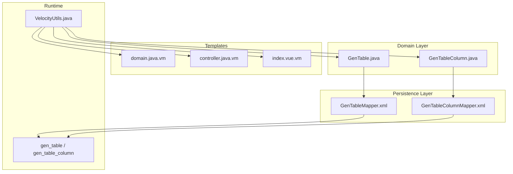
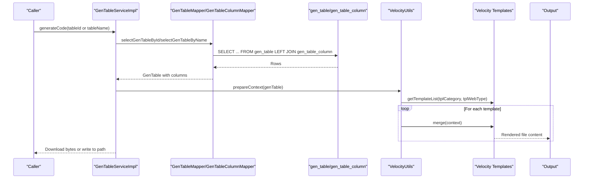
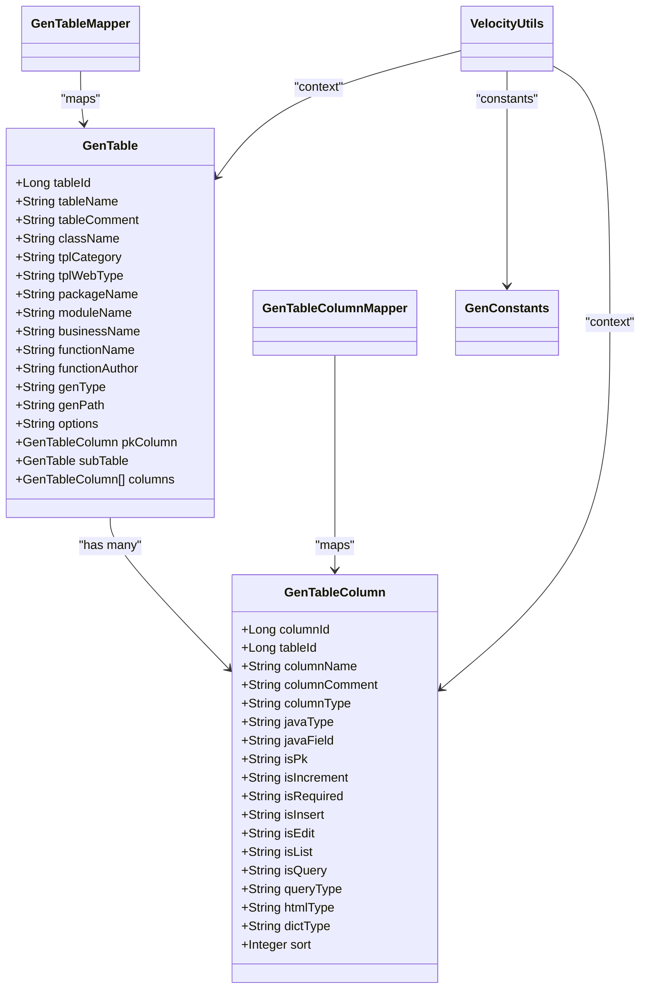

# Code Generation Fields

<cite>
**Referenced Files in This Document**
- [GenTable.java](file://src/main/java/com/ruoyi/project/tool/gen/domain/GenTable.java)
- [GenTableColumn.java](file://src/main/java/com/ruoyi/project/tool/gen/domain/GenTableColumn.java)
- [GenConstants.java](file://src/main/java/com/ruoyi/common/constant/GenConstants.java)
- [GenConfig.java](file://src/main/java/com/ruoyi/framework/config/GenConfig.java)
- [GenTableMapper.xml](file://src/main/resources/mybatis/tool/GenTableMapper.xml)
- [GenTableColumnMapper.xml](file://src/main/resources/mybatis/tool/GenTableColumnMapper.xml)
- [VelocityUtils.java](file://src/main/java/com/ruoyi/project/tool/gen/util/VelocityUtils.java)
- [domain.java.vm](file://src/main/resources/vm/java/domain.java.vm)
- [controller.java.vm](file://src/main/resources/vm/java/controller.java.vm)
- [index.vue.vm](file://src/main/resources/vm/vue/index.vue.vm)
- [ry_20250522.sql](file://sql/ry_20250522.sql)
</cite>

## Table of Contents
1. [Introduction](#introduction)
2. [Project Structure](#project-structure)
3. [Core Components](#core-components)
4. [Architecture Overview](#architecture-overview)
5. [Detailed Component Analysis](#detailed-component-analysis)
6. [Dependency Analysis](#dependency-analysis)
7. [Performance Considerations](#performance-considerations)
8. [Troubleshooting Guide](#troubleshooting-guide)
9. [Conclusion](#conclusion)

## Introduction
This document provides comprehensive field-level documentation for the code generation metadata entities in RuoYi-Vue. It covers the database tables gen_table and gen_table_column, their Java domain model counterparts, and how they integrate with the Velocity template engine to scaffold backend and frontend code. It explains table-level generation configuration (package_name, module_name, business_name, template selection), column-level metadata (java_type, java_field, CRUD flags, query_type, html_type, dict_type), sorting, validation rules, UI rendering hints, and the options field structure for advanced generation settings.

## Project Structure
RuoYi-Vue’s code generation feature centers around:
- Domain models: GenTable and GenTableColumn
- MyBatis mappers: GenTableMapper and GenTableColumnMapper
- Velocity utilities: VelocityUtils for preparing VelocityContext and selecting templates
- Templates: Java domain, controller, XML mapper, Vue pages, JS API, SQL scripts
- Database schema: gen_table and gen_table_column tables

**Diagram sources**
- [GenTable.java](file://src/main/java/com/ruoyi/project/tool/gen/domain/GenTable.java#L1-L385)
- [GenTableColumn.java](file://src/main/java/com/ruoyi/project/tool/gen/domain/GenTableColumn.java#L1-L373)
- [GenTableMapper.xml](file://src/main/resources/mybatis/tool/GenTableMapper.xml#L1-L210)
- [GenTableColumnMapper.xml](file://src/main/resources/mybatis/tool/GenTableColumnMapper.xml#L1-L127)
- [VelocityUtils.java](file://src/main/java/com/ruoyi/project/tool/gen/util/VelocityUtils.java#L1-L409)
- [domain.java.vm](file://src/main/resources/vm/java/domain.java.vm#L1-L106)
- [controller.java.vm](file://src/main/resources/vm/java/controller.java.vm#L1-L116)
- [index.vue.vm](file://src/main/resources/vm/vue/index.vue.vm#L1-L603)

**Section sources**
- [GenTable.java](file://src/main/java/com/ruoyi/project/tool/gen/domain/GenTable.java#L1-L385)
- [GenTableColumn.java](file://src/main/java/com/ruoyi/project/tool/gen/domain/GenTableColumn.java#L1-L373)
- [GenTableMapper.xml](file://src/main/resources/mybatis/tool/GenTableMapper.xml#L1-L210)
- [GenTableColumnMapper.xml](file://src/main/resources/mybatis/tool/GenTableColumnMapper.xml#L1-L127)
- [VelocityUtils.java](file://src/main/java/com/ruoyi/project/tool/gen/util/VelocityUtils.java#L1-L409)
- [domain.java.vm](file://src/main/resources/vm/java/domain.java.vm#L1-L106)
- [controller.java.vm](file://src/main/resources/vm/java/controller.java.vm#L1-L116)
- [index.vue.vm](file://src/main/resources/vm/vue/index.vue.vm#L1-L603)
- [ry_20250522.sql](file://sql/ry_20250522.sql#L646-L704)

## Core Components
- GenTable: Represents a business table with metadata for generation, including template category, package/module/business names, author, generation type/path, options, and tree/sub-table fields.
- GenTableColumn: Represents a column with metadata for Java type/field, CRUD flags, query type, HTML type, dictionary integration, and sort order.
- GenConstants: Defines constants for template categories, HTML types, Java types, query types, and base/super entity fields.
- GenConfig: Global generation configuration (author, package name, auto-remove table prefix, allow overwrite).
- MyBatis mappers: Map database rows to GenTable and GenTableColumn objects and support CRUD operations.
- VelocityUtils: Prepares VelocityContext, selects templates, computes imports, permissions, and tree/sub options.
- Velocity templates: Generate Java domain/controller, XML mapper, Vue pages, JS API, and SQL scripts.

**Section sources**
- [GenTable.java](file://src/main/java/com/ruoyi/project/tool/gen/domain/GenTable.java#L1-L385)
- [GenTableColumn.java](file://src/main/java/com/ruoyi/project/tool/gen/domain/GenTableColumn.java#L1-L373)
- [GenConstants.java](file://src/main/java/com/ruoyi/common/constant/GenConstants.java#L1-L118)
- [GenConfig.java](file://src/main/java/com/ruoyi/framework/config/GenConfig.java#L1-L80)
- [GenTableMapper.xml](file://src/main/resources/mybatis/tool/GenTableMapper.xml#L1-L210)
- [GenTableColumnMapper.xml](file://src/main/resources/mybatis/tool/GenTableColumnMapper.xml#L1-L127)
- [VelocityUtils.java](file://src/main/java/com/ruoyi/project/tool/gen/util/VelocityUtils.java#L1-L409)

## Architecture Overview
The generation pipeline:
- Load metadata from gen_table and gen_table_column via MyBatis mappers.
- Build VelocityContext with table-level and column-level metadata.
- Select templates based on tpl_category and tpl_web_type.
- Render Java domain/controller, XML mapper, Vue pages, JS API, and SQL scripts.
- Output either as downloadable zip or written to custom paths.

**Diagram sources**
- [GenTableMapper.xml](file://src/main/resources/mybatis/tool/GenTableMapper.xml#L114-L136)
- [GenTableColumnMapper.xml](file://src/main/resources/mybatis/tool/GenTableColumnMapper.xml#L36-L46)
- [VelocityUtils.java](file://src/main/java/com/ruoyi/project/tool/gen/util/VelocityUtils.java#L130-L160)
- [domain.java.vm](file://src/main/resources/vm/java/domain.java.vm#L1-L106)
- [controller.java.vm](file://src/main/resources/vm/java/controller.java.vm#L1-L116)
- [index.vue.vm](file://src/main/resources/vm/vue/index.vue.vm#L1-L603)

## Detailed Component Analysis

### Database Schema: gen_table and gen_table_column
- gen_table: Stores table-level generation metadata and options.
- gen_table_column: Stores column-level generation metadata linked to a table.

Key columns and constraints (from schema):
- gen_table
  - table_id (PK)
  - table_name, table_comment
  - sub_table_name, sub_table_fk_name
  - class_name, tpl_category, tpl_web_type
  - package_name, module_name, business_name, function_name, function_author
  - gen_type, gen_path
  - options (JSON)
  - create_by, create_time, update_by, update_time, remark
- gen_table_column
  - column_id (PK)
  - table_id (FK)
  - column_name, column_comment, column_type
  - java_type, java_field
  - is_pk, is_increment, is_required
  - is_insert, is_edit, is_list, is_query
  - query_type, html_type, dict_type
  - sort
  - create_by, create_time, update_by, update_time

These columns map to Java fields in GenTable and GenTableColumn as documented below.

**Section sources**
- [ry_20250522.sql](file://sql/ry_20250522.sql#L646-L704)

### GenTable.java: Table-level metadata and behavior
- Identifiers and descriptors
  - tableId: numeric identifier
  - tableName, tableComment: table name and description
  - className: generated entity class name
  - functionName, functionAuthor: functional metadata
- Template and UI selection
  - tplCategory: template category (crud, tree, sub)
  - tplWebType: web framework variant (e.g., element-plus)
- Package and module naming
  - packageName, moduleName, businessName
- Generation options
  - genType: output type (zip or custom path)
  - genPath: target path
  - options: JSON string containing advanced settings (e.g., tree fields, parent menu)
- Relationships
  - pkColumn: primary key column
  - subTable: associated sub-table metadata
  - columns: list of GenTableColumn
- Utility helpers
  - isSub/isTree/isCrud: checks template category
  - isSuperColumn: determines whether a field belongs to base/super entity

Type conversion highlights:
- tplCategory values are compared against constants (crud/tree/sub).
- options is a JSON string; VelocityUtils parses it to extract tree and menu fields.

**Section sources**
- [GenTable.java](file://src/main/java/com/ruoyi/project/tool/gen/domain/GenTable.java#L1-L385)
- [GenConstants.java](file://src/main/java/com/ruoyi/common/constant/GenConstants.java#L1-L118)
- [VelocityUtils.java](file://src/main/java/com/ruoyi/project/tool/gen/util/VelocityUtils.java#L76-L123)

### GenTableColumn.java: Column-level metadata and behavior
- Identifiers and descriptors
  - columnId, tableId
  - columnName, columnComment, columnType
- Java mapping
  - javaType, javaField
- CRUD flags
  - isPk, isIncrement, isRequired
  - isInsert, isEdit, isList, isQuery
- Query and UI
  - queryType: EQ, NE, GT, LT, LIKE, BETWEEN
  - htmlType: input, textarea, select, radio, checkbox, datetime, imageUpload, fileUpload, editor
  - dictType: dictionary type for UI rendering
- Sorting and usability
  - sort: ordering for UI lists and forms
  - isSuperColumn(): excludes base/super entity fields from generation
  - isUsableColumn(): allows certain super fields back into UI when needed

Type conversion highlights:
- isPk/isIncrement/isRequired/isInsert/isEdit/isList/isQuery are stored as "1"/"0" strings and converted to booleans.
- htmlType and queryType are validated against constants.

**Section sources**
- [GenTableColumn.java](file://src/main/java/com/ruoyi/project/tool/gen/domain/GenTableColumn.java#L1-L373)
- [GenConstants.java](file://src/main/java/com/ruoyi/common/constant/GenConstants.java#L1-L118)

### MyBatis Mapping: gen_table and gen_table_column
- GenTableMapper
  - ResultMap maps table fields to GenTable properties.
  - Joins gen_table with gen_table_column to load columns.
  - Selectors for list, by name, by id, and all tables.
- GenTableColumnMapper
  - ResultMap maps column fields to GenTableColumn properties.
  - Selectors for columns by table id and for DB columns by table name.

These mappers ensure that Java domain objects are populated with database-backed metadata.

**Section sources**
- [GenTableMapper.xml](file://src/main/resources/mybatis/tool/GenTableMapper.xml#L1-L210)
- [GenTableColumnMapper.xml](file://src/main/resources/mybatis/tool/GenTableColumnMapper.xml#L1-L127)

### Velocity Utilities and Template Selection
- prepareContext(genTable): builds VelocityContext with table-level and column-level data, imports, permissions, and tree/sub options.
- getTemplateList(tplCategory, tplWebType): selects templates based on template category and web framework variant.
- getFileName(template, genTable): computes output file paths for Java, XML, Vue, JS, and SQL.
- getImportList(genTable): adds imports for Date and BigDecimal when needed.
- getDicts(genTable): collects distinct dictType values for Vue component dictionaries.
- Menu and tree options extraction from options JSON.

**Section sources**
- [VelocityUtils.java](file://src/main/java/com/ruoyi/project/tool/gen/util/VelocityUtils.java#L1-L409)
- [GenConstants.java](file://src/main/java/com/ruoyi/common/constant/GenConstants.java#L1-L118)

### Template Rendering: How metadata drives code scaffolding
- domain.java.vm
  - Uses imports, entity base class (BaseEntity/TreeEntity), column comments, and @Excel annotations.
  - Generates getters/setters and toString.
- controller.java.vm
  - Uses permission prefix, primary key type/field, and endpoint paths derived from module/business names.
  - Generates list/export/get/add/edit/remove actions.
- index.vue.vm
  - Builds query form, list table, and dialog form based on column flags and HTML types.
  - Integrates dictionary types for select/radio/checkbox.
  - Adds validation rules based on isRequired.
  - Handles tree/sub-table rendering when applicable.

**Section sources**
- [domain.java.vm](file://src/main/resources/vm/java/domain.java.vm#L1-L106)
- [controller.java.vm](file://src/main/resources/vm/java/controller.java.vm#L1-L116)
- [index.vue.vm](file://src/main/resources/vm/vue/index.vue.vm#L1-L603)

## Dependency Analysis
- Domain to Mapper: GenTable and GenTableColumn are mapped to gen_table and gen_table_column via MyBatis ResultMaps.
- Mapper to Database: SQL queries select and join metadata from gen_table and gen_table_column.
- VelocityUtils to Templates: VelocityUtils prepares context and selects templates based on GenConstants and GenTable fields.
- Templates to Output: Templates render Java, XML, Vue, JS, and SQL files.

**Diagram sources**
- [GenTable.java](file://src/main/java/com/ruoyi/project/tool/gen/domain/GenTable.java#L1-L385)
- [GenTableColumn.java](file://src/main/java/com/ruoyi/project/tool/gen/domain/GenTableColumn.java#L1-L373)
- [GenTableMapper.xml](file://src/main/resources/mybatis/tool/GenTableMapper.xml#L1-L210)
- [GenTableColumnMapper.xml](file://src/main/resources/mybatis/tool/GenTableColumnMapper.xml#L1-L127)
- [VelocityUtils.java](file://src/main/java/com/ruoyi/project/tool/gen/util/VelocityUtils.java#L1-L409)
- [GenConstants.java](file://src/main/java/com/ruoyi/common/constant/GenConstants.java#L1-L118)

**Section sources**
- [GenTable.java](file://src/main/java/com/ruoyi/project/tool/gen/domain/GenTable.java#L1-L385)
- [GenTableColumn.java](file://src/main/java/com/ruoyi/project/tool/gen/domain/GenTableColumn.java#L1-L373)
- [GenTableMapper.xml](file://src/main/resources/mybatis/tool/GenTableMapper.xml#L1-L210)
- [GenTableColumnMapper.xml](file://src/main/resources/mybatis/tool/GenTableColumnMapper.xml#L1-L127)
- [VelocityUtils.java](file://src/main/java/com/ruoyi/project/tool/gen/util/VelocityUtils.java#L1-L409)
- [GenConstants.java](file://src/main/java/com/ruoyi/common/constant/GenConstants.java#L1-L118)

## Performance Considerations
- Minimize unnecessary columns: Use isList/isQuery flags to reduce UI payload and backend processing.
- Efficient template selection: tpl_category and tpl_web_type drive template sets; keep options minimal to avoid heavy rendering.
- Sorting: Use sort to optimize UI list rendering and reduce client-side reordering.
- Dictionary integration: Limit dictType usage to required fields to reduce Vue component overhead.

[No sources needed since this section provides general guidance]

## Troubleshooting Guide
Common issues and resolutions:
- Missing primary key: Ensure isPk is set for the primary key column; otherwise, controller endpoints may fail.
- Incorrect Java type mapping: Verify javaType matches database types; VelocityUtils adds imports for Date/BigDecimal when needed.
- Dictionary not rendering: Ensure dictType is set and htmlType is select/radio/checkbox; VelocityUtils collects dictType for Vue.
- Tree/sub-table not rendering: Confirm options JSON contains tree fields (treeCode, treeParentCode, treeName) or sub-table fields (subTableName, subTableFkName).
- Validation errors: Ensure isRequired is set appropriately; Vue template generates validation rules based on isRequired.

**Section sources**
- [GenTableColumn.java](file://src/main/java/com/ruoyi/project/tool/gen/domain/GenTableColumn.java#L1-L373)
- [VelocityUtils.java](file://src/main/java/com/ruoyi/project/tool/gen/util/VelocityUtils.java#L241-L307)
- [index.vue.vm](file://src/main/resources/vm/vue/index.vue.vm#L1-L603)

## Conclusion
RuoYi-Vue’s code generation system maps database metadata from gen_table and gen_table_column into robust Java and Vue scaffolding via Velocity templates. Table-level fields define package/module/business names, template selection, and advanced options, while column-level fields control Java type mapping, CRUD visibility, query behavior, UI rendering, and dictionary integration. The MyBatis mappers and Velocity utilities coordinate to produce consistent, configurable code artifacts tailored to the chosen template category and web framework variant.