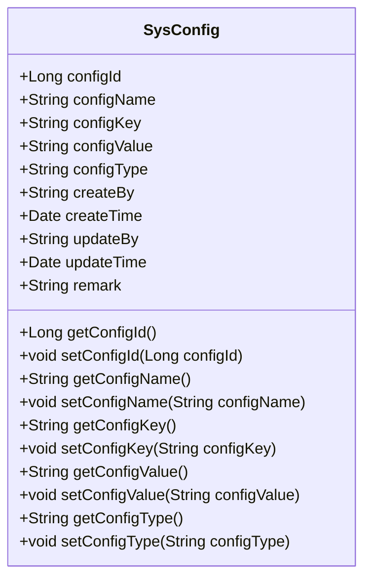
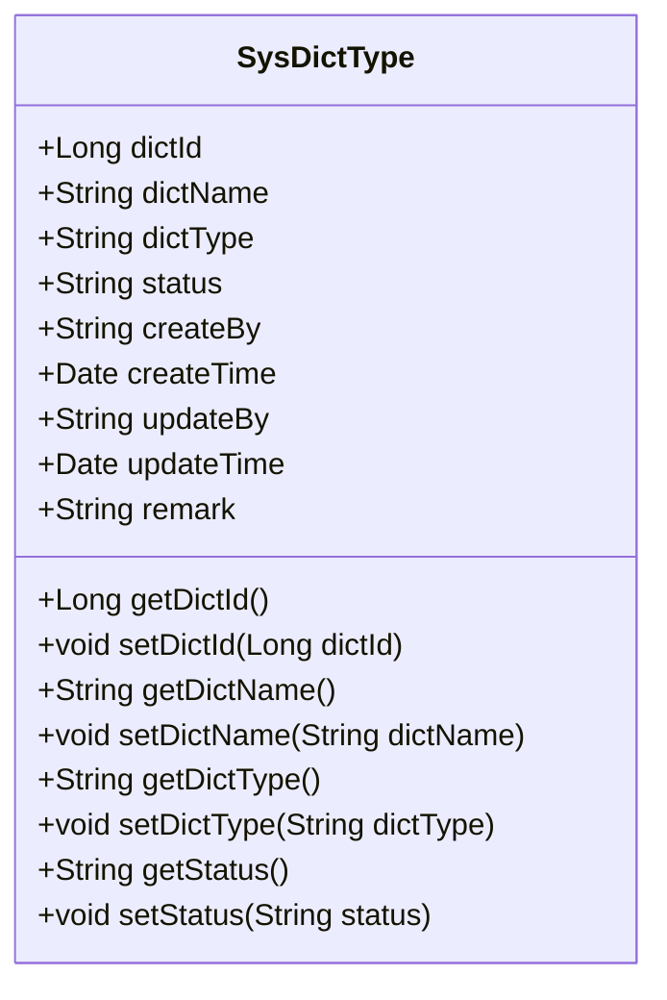
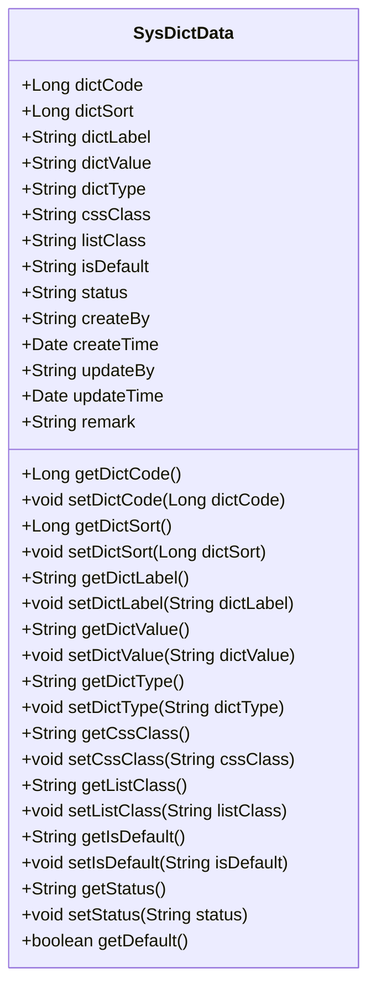
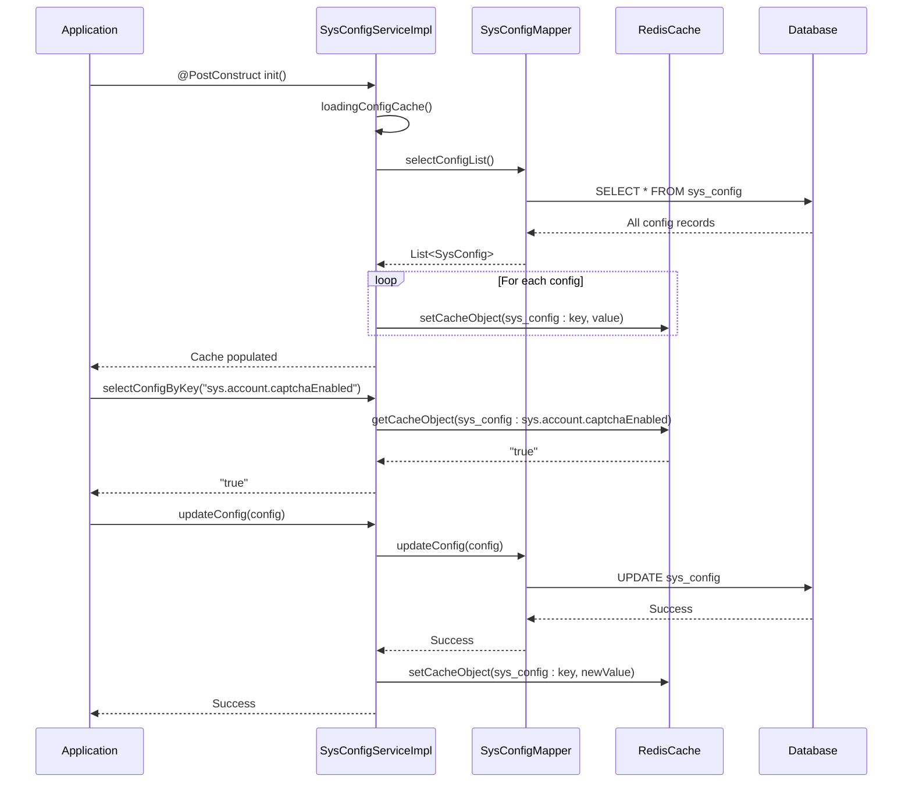
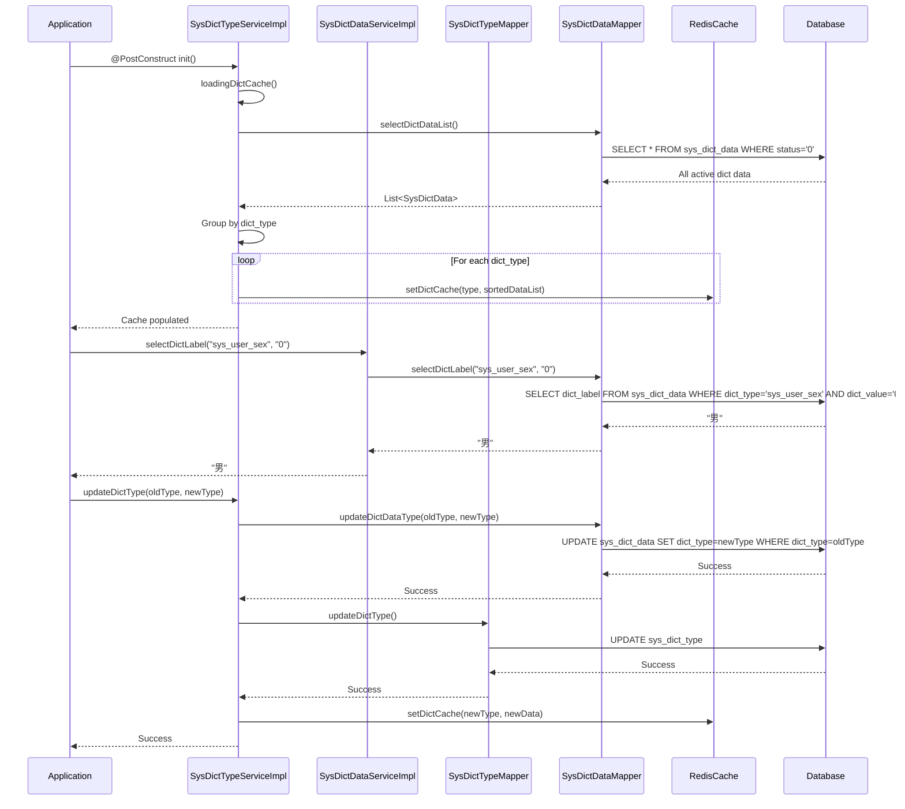
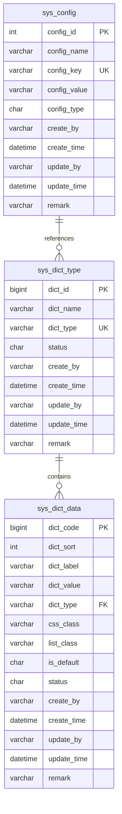

# Configuration & Dictionary Fields

<cite>
**Referenced Files in This Document**   
- [SysConfig.java](file://src/main/java/com/ruoyi/project/system/domain/SysConfig.java)
- [SysDictType.java](file://src/main/java/com/ruoyi/project/system/domain/SysDictType.java)
- [SysDictData.java](file://src/main/java/com/ruoyi/project/system/domain/SysDictData.java)
- [SysConfigMapper.xml](file://src/main/resources/mybatis/system/SysConfigMapper.xml)
- [SysDictTypeMapper.xml](file://src/main/resources/mybatis/system/SysDictTypeMapper.xml)
- [SysDictDataMapper.xml](file://src/main/resources/mybatis/system/SysDictDataMapper.xml)
- [SysConfigServiceImpl.java](file://src/main/java/com/ruoyi/project/system/service/impl/SysConfigServiceImpl.java)
- [SysDictTypeServiceImpl.java](file://src/main/java/com/ruoyi/project/system/service/impl/SysDictTypeServiceImpl.java)
- [SysDictDataServiceImpl.java](file://src/main/java/com/ruoyi/project/system/service/impl/SysDictDataServiceImpl.java)
- [CacheConstants.java](file://src/main/java/com/ruoyi/common/constant/CacheConstants.java)
- [DictUtils.java](file://src/main/java/com/ruoyi/common/utils/DictUtils.java)
- [UserConstants.java](file://src/main/java/com/ruoyi/common/constant/UserConstants.java)
- [ry_20250522.sql](file://sql/ry_20250522.sql)
</cite>

## Table of Contents
1. [Introduction](#introduction)
2. [Configuration Table (sys_config)](#configuration-table-sys_config)
3. [Dictionary Type Table (sys_dict_type)](#dictionary-type-table-sys_dict_type)
4. [Dictionary Data Table (sys_dict_data)](#dictionary-data-table-sys_dict_data)
5. [Java Entity Mapping](#java-entity-mapping)
6. [System Integration and Business Rules](#system-integration-and-business-rules)
7. [Indexing and Performance](#indexing-and-performance)

## Introduction
This document provides comprehensive field-level documentation for the configuration and dictionary entities in the RuoYi-Vue system. It details every column in the `sys_config`, `sys_dict_type`, and `sys_dict_data` database tables, including data types, constraints, and business meanings. The documentation maps database columns to their corresponding Java entity fields, explains type conversions, and covers business rules for system configuration loading and dictionary value validation. The document also explains UI rendering properties, status management, and caching mechanisms used in the system.

**Section sources**
- [SysConfig.java](file://src/main/java/com/ruoyi/project/system/domain/SysConfig.java#L1-L112)
- [SysDictType.java](file://src/main/java/com/ruoyi/project/system/domain/SysDictType.java#L1-L97)
- [SysDictData.java](file://src/main/java/com/ruoyi/project/system/domain/SysDictData.java#L1-L177)
- [ry_20250522.sql](file://sql/ry_20250522.sql#L533-L546)

## Configuration Table (sys_config)
The `sys_config` table stores system-wide configuration parameters that control various aspects of the application's behavior. These parameters are typically loaded into cache at startup for fast access and can be modified through the administration interface.

### Field Details
The following table details each field in the `sys_config` table:

| Field Name | Data Type | Constraints | Java Field | Business Meaning |
|------------|-----------|-------------|------------|------------------|
| config_id | int(5) | NOT NULL, AUTO_INCREMENT, PRIMARY KEY | configId (Long) | Unique identifier for the configuration parameter. Auto-incremented primary key. |
| config_name | varchar(100) | DEFAULT '' | configName (String) | Descriptive name of the configuration parameter for display in the UI. |
| config_key | varchar(100) | DEFAULT '' | configKey (String) | Unique key used to programmatically access the configuration value. Must be unique across the system. |
| config_value | varchar(500) | DEFAULT '' | configValue (String) | Actual value of the configuration parameter. Can store strings, numbers, or boolean values as strings. |
| config_type | char(1) | DEFAULT 'N' | configType (String) | Indicates whether the parameter is system built-in (Y) or user-defined (N). Built-in parameters cannot be deleted. |
| create_by | varchar(64) | DEFAULT '' | createBy (String) | User who created the configuration parameter. |
| create_time | datetime | | createTime (Date) | Timestamp when the configuration parameter was created. |
| update_by | varchar(64) | DEFAULT '' | updateBy (String) | User who last updated the configuration parameter. |
| update_time | datetime | | updateTime (Date) | Timestamp when the configuration parameter was last updated. |
| remark | varchar(500) | DEFAULT NULL | remark (String) | Additional notes or comments about the configuration parameter. |

### Business Rules and Validation
- The `config_key` field must be unique across the system. The system enforces this constraint through the `checkConfigKeyUnique` method in `SysConfigServiceImpl`.
- The `config_name`, `config_key`, and `config_value` fields are required and cannot be null or empty.
- The `config_type` field uses 'Y' for system built-in parameters and 'N' for user-defined parameters. Built-in parameters (config_type = 'Y') cannot be deleted.
- Configuration values are cached in Redis with the key pattern `sys_config:{configKey}` for fast retrieval.
- When a configuration parameter is updated, the cache is automatically updated to reflect the new value.
- The system loads all configuration parameters into cache during startup via the `@PostConstruct` annotated `init()` method in `SysConfigServiceImpl`.

**Section sources**
- [SysConfig.java](file://src/main/java/com/ruoyi/project/system/domain/SysConfig.java#L1-L112)
- [SysConfigMapper.xml](file://src/main/resources/mybatis/system/SysConfigMapper.xml#L1-L117)
- [SysConfigServiceImpl.java](file://src/main/java/com/ruoyi/project/system/service/impl/SysConfigServiceImpl.java#L1-L230)
- [ry_20250522.sql](file://sql/ry_20250522.sql#L533-L546)

## Dictionary Type Table (sys_dict_type)
The `sys_dict_type` table defines dictionary types, which serve as categories or groups for dictionary data entries. Each dictionary type has a unique type code and can contain multiple dictionary data entries.

### Field Details
The following table details each field in the `sys_dict_type` table:

| Field Name | Data Type | Constraints | Java Field | Business Meaning |
|------------|-----------|-------------|------------|------------------|
| dict_id | bigint(20) | NOT NULL, AUTO_INCREMENT, PRIMARY KEY | dictId (Long) | Unique identifier for the dictionary type. Auto-incremented primary key. |
| dict_name | varchar(100) | DEFAULT '' | dictName (String) | Display name of the dictionary type for use in the UI. |
| dict_type | varchar(100) | DEFAULT '', UNIQUE | dictType (String) | Unique code for the dictionary type used programmatically to retrieve dictionary data. Must follow the pattern ^[a-z][a-z0-9_]*$. |
| status | char(1) | DEFAULT '0' | status (String) | Status of the dictionary type: '0' for normal (active), '1' for disabled. Disabled types are not loaded into cache. |
| create_by | varchar(64) | DEFAULT '' | createBy (String) | User who created the dictionary type. |
| create_time | datetime | | createTime (Date) | Timestamp when the dictionary type was created. |
| update_by | varchar(64) | DEFAULT '' | updateBy (String) | User who last updated the dictionary type. |
| update_time | datetime | | updateTime (Date) | Timestamp when the dictionary type was last updated. |
| remark | varchar(500) | DEFAULT NULL | remark (String) | Additional notes or comments about the dictionary type. |

### Business Rules and Validation
- The `dict_type` field must be unique across the system and serves as the primary identifier for retrieving dictionary data.
- The `dict_type` must follow a specific pattern: it must start with a lowercase letter and can only contain lowercase letters, digits, and underscores.
- The `dict_name` and `dict_type` fields are required and cannot be null or empty.
- Dictionary types with status '1' (disabled) are not loaded into the application cache and cannot be used in the system.
- When a dictionary type is updated and the `dict_type` value changes, all associated dictionary data entries are automatically updated to reflect the new type through the `updateDictDataType` method.
- A dictionary type cannot be deleted if it has associated dictionary data entries. This is enforced by checking the count of related entries before deletion.
- Dictionary types and their associated data are cached in Redis with the key pattern `sys_dict:{dictType}` for fast retrieval.

**Section sources**
- [SysDictType.java](file://src/main/java/com/ruoyi/project/system/domain/SysDictType.java#L1-L97)
- [SysDictTypeMapper.xml](file://src/main/resources/mybatis/system/SysDictTypeMapper.xml#L1-L105)
- [SysDictTypeServiceImpl.java](file://src/main/java/com/ruoyi/project/system/service/impl/SysDictTypeServiceImpl.java#L1-L224)
- [ry_20250522.sql](file://sql/ry_20250522.sql#L448-L462)

## Dictionary Data Table (sys_dict_data)
The `sys_dict_data` table contains the actual dictionary entries that belong to specific dictionary types. Each entry consists of a label (display value) and a value (stored value), along with various UI rendering properties.

### Field Details
The following table details each field in the `sys_dict_data` table:

| Field Name | Data Type | Constraints | Java Field | Business Meaning |
|------------|-----------|-------------|------------|------------------|
| dict_code | bigint(20) | NOT NULL, AUTO_INCREMENT, PRIMARY KEY | dictCode (Long) | Unique identifier for the dictionary data entry. Auto-incremented primary key. |
| dict_sort | int(4) | DEFAULT 0 | dictSort (Long) | Sort order for displaying dictionary entries. Lower values appear first. |
| dict_label | varchar(100) | DEFAULT '' | dictLabel (String) | Display label for the dictionary entry shown in the UI. |
| dict_value | varchar(100) | DEFAULT '' | dictValue (String) | Actual value stored in the database when this dictionary entry is selected. |
| dict_type | varchar(100) | DEFAULT '' | dictType (String) | Reference to the dictionary type this entry belongs to. Links to sys_dict_type.dict_type. |
| css_class | varchar(100) | DEFAULT NULL | cssClass (String) | CSS class for custom styling of the dictionary entry in various UI components. |
| list_class | varchar(100) | DEFAULT NULL | listClass (String) | CSS class specifically for styling the entry when displayed in tables or lists. Common values include 'primary', 'success', 'warning', 'danger', 'info'. |
| is_default | char(1) | DEFAULT 'N' | isDefault (String) | Indicates if this entry is the default selection: 'Y' for yes, 'N' for no. Only one entry per dictionary type should be marked as default. |
| status | char(1) | DEFAULT '0' | status (String) | Status of the dictionary entry: '0' for normal (active), '1' for disabled. Disabled entries are not shown in selection components. |
| create_by | varchar(64) | DEFAULT '' | createBy (String) | User who created the dictionary data entry. |
| create_time | datetime | | createTime (Date) | Timestamp when the dictionary data entry was created. |
| update_by | varchar(64) | DEFAULT '' | updateBy (String) | User who last updated the dictionary data entry. |
| update_time | datetime | | updateTime (Date) | Timestamp when the dictionary data entry was last updated. |
| remark | varchar(500) | DEFAULT NULL | remark (String) | Additional notes or comments about the dictionary data entry. |

### Business Rules and Validation
- Dictionary data entries are always associated with a dictionary type through the `dict_type` field.
- Entries are sorted by `dict_sort` in ascending order when retrieved for display.
- Only entries with status '0' (normal) are loaded into the application cache and made available in UI components.
- The `is_default` flag indicates which entry should be pre-selected when a form is initialized. While the database does not enforce a single default per type, best practice is to have only one default entry per dictionary type.
- The `list_class` field is used to apply visual styling to table cells, typically using Bootstrap color classes like 'primary' (blue), 'success' (green), 'warning' (yellow), 'danger' (red), or 'info' (gray).
- The `css_class` field allows for additional custom styling of the dictionary entry in various contexts.
- When dictionary data is retrieved programmatically, it is first checked against the application cache. If not found, it is queried from the database and then cached.
- When dictionary data is modified, the entire set of entries for that dictionary type is reloaded into cache to ensure consistency.

**Section sources**
- [SysDictData.java](file://src/main/java/com/ruoyi/project/system/domain/SysDictData.java#L1-L177)
- [SysDictDataMapper.xml](file://src/main/resources/mybatis/system/SysDictDataMapper.xml#L1-L124)
- [SysDictDataServiceImpl.java](file://src/main/java/com/ruoyi/project/system/service/impl/SysDictDataServiceImpl.java#L1-L112)
- [ry_20250522.sql](file://sql/ry_20250522.sql#L479-L497)

## Java Entity Mapping
This section details how database columns are mapped to Java entity fields in the RuoYi-Vue system, including type conversions and annotations used for validation and serialization.

### SysConfig Entity Mapping
The `SysConfig` entity maps to the `sys_config` table with the following field mappings:

**Diagram sources**
- [SysConfig.java](file://src/main/java/com/ruoyi/project/system/domain/SysConfig.java#L1-L112)
- [SysConfigMapper.xml](file://src/main/resources/mybatis/system/SysConfigMapper.xml#L7-L17)

The mapping follows standard camelCase conversion from snake_case database column names:
- `config_id` → `configId` (Long)
- `config_name` → `configName` (String)
- `config_key` → `configKey` (String)
- `config_value` → `configValue` (String)
- `config_type` → `configType` (String)

The entity uses validation annotations to enforce business rules:
- `@NotBlank` ensures required fields are not empty
- `@Size` limits field lengths to match database constraints
- `@Excel` annotations provide metadata for Excel import/export functionality

### SysDictType Entity Mapping
The `SysDictType` entity maps to the `sys_dict_type` table with the following field mappings:

**Diagram sources**
- [SysDictType.java](file://src/main/java/com/ruoyi/project/system/domain/SysDictType.java#L1-L97)
- [SysDictTypeMapper.xml](file://src/main/resources/mybatis/system/SysDictTypeMapper.xml#L7-L16)

The mapping follows the same camelCase convention:
- `dict_id` → `dictId` (Long)
- `dict_name` → `dictName` (String)
- `dict_type` → `dictType` (String)
- `status` → `status` (String)

The `dictType` field has additional validation with `@Pattern` to ensure it follows the required format of starting with a lowercase letter and containing only lowercase letters, digits, and underscores.

### SysDictData Entity Mapping
The `SysDictData` entity maps to the `sys_dict_data` table with the following field mappings:

**Diagram sources**
- [SysDictData.java](file://src/main/java/com/ruoyi/project/system/domain/SysDictData.java#L1-L177)
- [SysDictDataMapper.xml](file://src/main/resources/mybatis/system/SysDictDataMapper.xml#L7-L21)

Key mapping details:
- `dict_code` → `dictCode` (Long)
- `dict_sort` → `dictSort` (Long)
- `dict_label` → `dictLabel` (String)
- `dict_value` → `dictValue` (String)
- `dict_type` → `dictType` (String)
- `css_class` → `cssClass` (String)
- `list_class` → `listClass` (String)
- `is_default` → `isDefault` (String)

The entity includes a convenience method `getDefault()` that returns a boolean indicating whether the entry is the default, converting from the 'Y'/'N' string representation to a boolean value using the `UserConstants.YES` constant.

**Section sources**
- [SysConfig.java](file://src/main/java/com/ruoyi/project/system/domain/SysConfig.java#L1-L112)
- [SysDictType.java](file://src/main/java/com/ruoyi/project/system/domain/SysDictType.java#L1-L97)
- [SysDictData.java](file://src/main/java/com/ruoyi/project/system/domain/SysDictData.java#L1-L177)

## System Integration and Business Rules
This section documents the integration points and business rules governing the configuration and dictionary systems in RuoYi-Vue.

### Configuration System Integration
The configuration system is tightly integrated with the application's startup process and caching mechanism:

**Diagram sources**
- [SysConfigServiceImpl.java](file://src/main/java/com/ruoyi/project/system/service/impl/SysConfigServiceImpl.java#L35-L179)
- [CacheConstants.java](file://src/main/java/com/ruoyi/common/constant/CacheConstants.java#L23)
- [SysConfigMapper.xml](file://src/main/resources/mybatis/system/SysConfigMapper.xml#L36-L42)

Key integration points:
- Configuration parameters are loaded into Redis cache during application startup via the `@PostConstruct` method in `SysConfigServiceImpl`
- The cache key follows the pattern `sys_config:{configKey}` as defined in `CacheConstants.SYS_CONFIG_KEY`
- When retrieving a configuration value via `selectConfigByKey()`, the system first checks the cache before querying the database
- When a configuration is updated, the cache is automatically updated with the new value
- Built-in configuration parameters (config_type = 'Y') cannot be deleted, as enforced in the `deleteConfigByIds()` method
- The system provides a `selectCaptchaEnabled()` convenience method that specifically retrieves the captcha enabled flag and converts it to a boolean

### Dictionary System Integration
The dictionary system follows a similar caching pattern but with additional complexity due to the relationship between dictionary types and data:

**Diagram sources**
- [SysDictTypeServiceImpl.java](file://src/main/java/com/ruoyi/project/system/service/impl/SysDictTypeServiceImpl.java#L38-L147)
- [SysDictDataServiceImpl.java](file://src/main/java/com/ruoyi/project/system/service/impl/SysDictDataServiceImpl.java#L42-L45)
- [DictUtils.java](file://src/main/java/com/ruoyi/common/utils/DictUtils.java#L31-L50)
- [CacheConstants.java](file://src/main/java/com/ruoyi/common/constant/CacheConstants.java#L28)

Key integration points:
- Dictionary data is loaded into Redis cache during application startup, grouped by `dict_type`
- The cache key follows the pattern `sys_dict:{dictType}` as defined in `CacheConstants.SYS_DICT_KEY`
- When retrieving dictionary data, the system first checks the cache before querying the database
- Dictionary entries are sorted by `dict_sort` when loaded into cache
- When a dictionary type is renamed, all associated dictionary data entries are automatically updated to reflect the new type
- The `DictUtils` class provides utility methods for working with dictionary data, including converting between values and labels
- Dictionary data can be retrieved as comma-separated strings of values or labels using `getDictValues()` and `getDictLabels()` methods

### Business Rules Summary
The following business rules govern the behavior of configuration and dictionary entities:

1. **Configuration Rules**:
   - Configuration keys must be unique across the system
   - Built-in configuration parameters (config_type = 'Y') cannot be deleted
   - Configuration values are cached for performance
   - Configuration updates automatically invalidate and update the cache
   - Required fields (name, key, value) cannot be empty

2. **Dictionary Type Rules**:
   - Dictionary type codes must be unique and follow the pattern ^[a-z][a-z0-9_]*$
   - A dictionary type cannot be deleted if it has associated data entries
   - Dictionary types with status '1' are not loaded into cache
   - Renaming a dictionary type automatically updates all associated data entries

3. **Dictionary Data Rules**:
   - Dictionary data entries are sorted by dict_sort when displayed
   - Only entries with status '0' are loaded into cache and shown in UI components
   - The is_default flag ('Y'/'N') indicates the default selection
   - The list_class field controls visual styling in tables (primary, success, warning, danger, info)
   - Multiple values can be stored as comma-separated strings and automatically converted to labels

**Section sources**
- [SysConfigServiceImpl.java](file://src/main/java/com/ruoyi/project/system/service/impl/SysConfigServiceImpl.java#L1-L230)
- [SysDictTypeServiceImpl.java](file://src/main/java/com/ruoyi/project/system/service/impl/SysDictTypeServiceImpl.java#L1-L224)
- [SysDictDataServiceImpl.java](file://src/main/java/com/ruoyi/project/system/service/impl/SysDictDataServiceImpl.java#L1-L112)
- [DictUtils.java](file://src/main/java/com/ruoyi/common/utils/DictUtils.java#L1-L218)

## Indexing and Performance
This section documents the indexing strategies and performance considerations for the configuration and dictionary tables.

### Database Indexes
Based on the SQL schema and application usage patterns, the following indexes are defined or implied:

**Diagram sources**
- [ry_20250522.sql](file://sql/ry_20250522.sql#L461)
- [ry_20250522.sql](file://sql/ry_20250522.sql#L546)

Key indexing details:
- The `sys_config` table has a primary key on `config_id` and an implied unique constraint on `config_key` for fast lookups
- The `sys_dict_type` table has a primary key on `dict_id` and a unique constraint on `dict_type` to ensure type codes are unique
- The `sys_dict_data` table has a primary key on `dict_code` and a foreign key relationship to `sys_dict_type.dict_type`
- While explicit indexes are not defined in the SQL script, the application queries suggest the need for indexes on:
  - `sys_config.config_key` for fast configuration lookups
  - `sys_dict_data.dict_type` for retrieving all entries of a specific type
  - `sys_dict_data.status` for filtering active entries

### Performance Considerations
The system employs several strategies to optimize performance:

1. **Caching Strategy**:
   - Both configuration and dictionary data are aggressively cached in Redis
   - Configuration cache key: `sys_config:{configKey}`
   - Dictionary cache key: `sys_dict:{dictType}`
   - Cache is populated at application startup
   - Cache is automatically updated on create, update, and delete operations
   - Cache is cleared and repopulated when configuration is reset

2. **Query Optimization**:
   - Configuration lookups by key use direct database queries with LIMIT 1
   - Dictionary data is retrieved in bulk and grouped by type to minimize database queries
   - The system uses MyBatis result maps to control exactly which fields are retrieved
   - Parameterized queries prevent SQL injection

3. **Memory Usage**:
   - Configuration values are relatively small (500 characters max)
   - Dictionary data is limited to 100 entries per type in practice
   - The entire configuration and dictionary dataset is typically small enough to fit comfortably in memory
   - Cache TTL (Time To Live) is not explicitly set, meaning entries persist until manually cleared

4. **Best Practices**:
   - Use `selectConfigByKey()` instead of retrieving the entire configuration object when only the value is needed
   - Use `selectDictDataByType()` to retrieve all entries of a type rather than individual lookups
   - The `DictUtils` class provides optimized methods for common operations like converting between values and labels
   - Built-in configurations are marked to prevent accidental deletion

**Section sources**
- [SysConfigServiceImpl.java](file://src/main/java/com/ruoyi/project/system/service/impl/SysConfigServiceImpl.java#L35-L189)
- [SysDictTypeServiceImpl.java](file://src/main/java/com/ruoyi/project/system/service/impl/SysDictTypeServiceImpl.java#L38-L147)
- [DictUtils.java](file://src/main/java/com/ruoyi/common/utils/DictUtils.java#L31-L217)
- [ry_20250522.sql](file://sql/ry_20250522.sql#L448-L546)