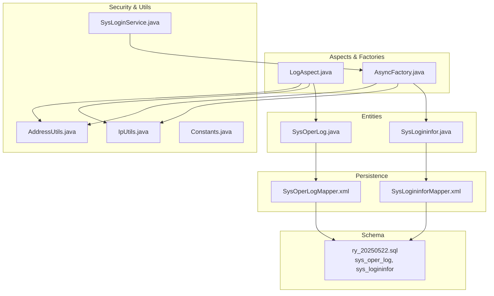
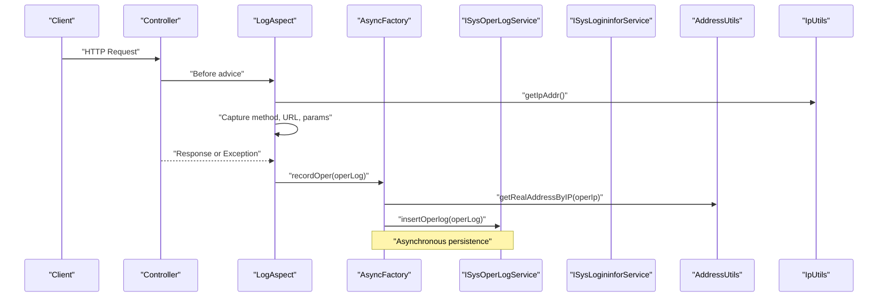
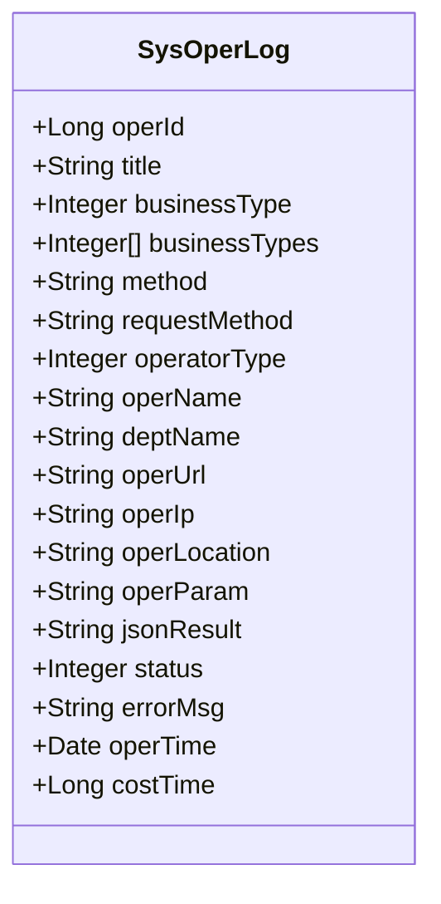
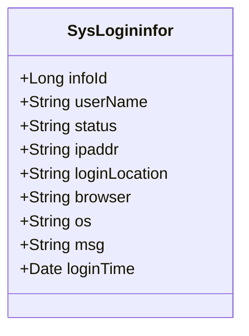
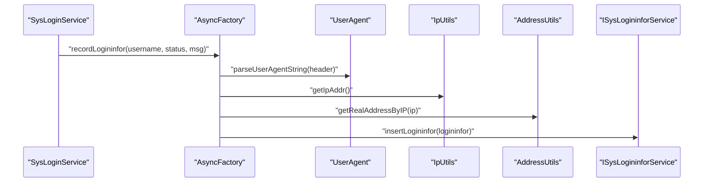
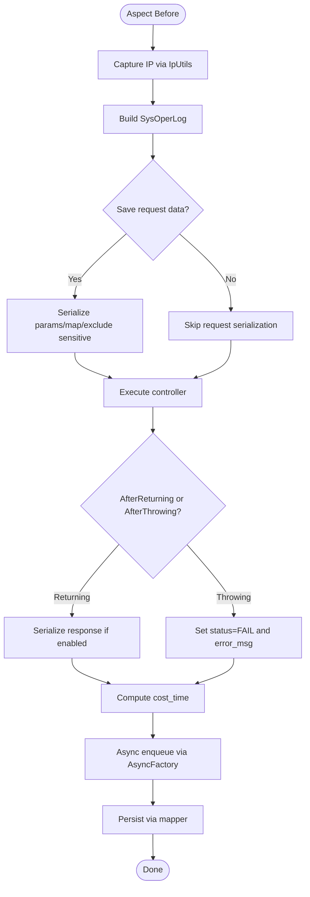
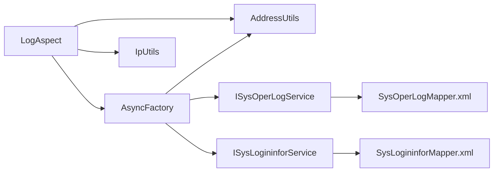

# Logging Fields

<cite>
**Referenced Files in This Document**
- [SysOperLog.java](file://src/main/java/com/ruoyi/project/monitor/domain/SysOperLog.java)
- [SysLogininfor.java](file://src/main/java/com/ruoyi/project/monitor/domain/SysLogininfor.java)
- [SysOperLogMapper.xml](file://src/main/resources/mybatis/monitor/SysOperLogMapper.xml)
- [SysLogininforMapper.xml](file://src/main/resources/mybatis/monitor/SysLogininforMapper.xml)
- [LogAspect.java](file://src/main/java/com/ruoyi/framework/aspectj/LogAspect.java)
- [AsyncFactory.java](file://src/main/java/com/ruoyi/framework/manager/factory/AsyncFactory.java)
- [SysLoginService.java](file://src/main/java/com/ruoyi/framework/security/service/SysLoginService.java)
- [AddressUtils.java](file://src/main/java/com/ruoyi/common/utils/ip/AddressUtils.java)
- [IpUtils.java](file://src/main/java/com/ruoyi/common/utils/ip/IpUtils.java)
- [Constants.java](file://src/main/java/com/ruoyi/common/constant/Constants.java)
- [BusinessType.java](file://src/main/java/com/ruoyi/framework/aspectj/lang/enums/BusinessType.java)
- [BusinessStatus.java](file://src/main/java/com/ruoyi/framework/aspectj/lang/enums/BusinessStatus.java)
- [OperatorType.java](file://src/main/java/com/ruoyi/framework/aspectj/lang/enums/OperatorType.java)
- [ry_20250522.sql](file://sql/ry_20250522.sql)
</cite>

## Table of Contents
1. [Introduction](#introduction)
2. [Project Structure](#project-structure)
3. [Core Components](#core-components)
4. [Architecture Overview](#architecture-overview)
5. [Detailed Component Analysis](#detailed-component-analysis)
6. [Dependency Analysis](#dependency-analysis)
7. [Performance Considerations](#performance-considerations)
8. [Troubleshooting Guide](#troubleshooting-guide)
9. [Conclusion](#conclusion)
10. [Appendices](#appendices)

## Introduction
This document provides comprehensive field-level documentation for logging entities in RuoYi-Vue, focusing on:
- sys_oper_log (operation logs) and sys_logininfor (login logs) tables
- Mapping from database columns to Java entity fields
- Data types, constraints, and business meanings
- Operation log fields: business_type, method signatures, request parameters, execution results, and performance metrics (cost_time)
- Login information fields: IP tracking, geolocation, browser/device detection, and authentication outcomes
- Indexing strategies for critical query fields
- Retention policies, archival considerations, and performance optimization for high-volume logging
- Relationship between operation logs and security audit requirements

## Project Structure
The logging subsystem spans Java domain entities, MyBatis mappers, AOP logging, asynchronous factories, and IP/geolocation utilities. The SQL script defines the schema and indexes.

**Diagram sources**
- [SysOperLog.java](file://src/main/java/com/ruoyi/project/monitor/domain/SysOperLog.java#L1-L270)
- [SysLogininfor.java](file://src/main/java/com/ruoyi/project/monitor/domain/SysLogininfor.java#L1-L144)
- [SysOperLogMapper.xml](file://src/main/resources/mybatis/monitor/SysOperLogMapper.xml#L1-L87)
- [SysLogininforMapper.xml](file://src/main/resources/mybatis/monitor/SysLogininforMapper.xml#L1-L57)
- [LogAspect.java](file://src/main/java/com/ruoyi/framework/aspectj/LogAspect.java#L1-L265)
- [AsyncFactory.java](file://src/main/java/com/ruoyi/framework/manager/factory/AsyncFactory.java#L1-L103)
- [SysLoginService.java](file://src/main/java/com/ruoyi/framework/security/service/SysLoginService.java#L1-L177)
- [IpUtils.java](file://src/main/java/com/ruoyi/common/utils/ip/IpUtils.java#L1-L382)
- [AddressUtils.java](file://src/main/java/com/ruoyi/common/utils/ip/AddressUtils.java#L1-L57)
- [Constants.java](file://src/main/java/com/ruoyi/common/constant/Constants.java#L1-L174)
- [ry_20250522.sql](file://sql/ry_20250522.sql#L416-L575)

**Section sources**
- [SysOperLog.java](file://src/main/java/com/ruoyi/project/monitor/domain/SysOperLog.java#L1-L270)
- [SysLogininfor.java](file://src/main/java/com/ruoyi/project/monitor/domain/SysLogininfor.java#L1-L144)
- [SysOperLogMapper.xml](file://src/main/resources/mybatis/monitor/SysOperLogMapper.xml#L1-L87)
- [SysLogininforMapper.xml](file://src/main/resources/mybatis/monitor/SysLogininforMapper.xml#L1-L57)
- [LogAspect.java](file://src/main/java/com/ruoyi/framework/aspectj/LogAspect.java#L1-L265)
- [AsyncFactory.java](file://src/main/java/com/ruoyi/framework/manager/factory/AsyncFactory.java#L1-L103)
- [SysLoginService.java](file://src/main/java/com/ruoyi/framework/security/service/SysLoginService.java#L1-L177)
- [IpUtils.java](file://src/main/java/com/ruoyi/common/utils/ip/IpUtils.java#L1-L382)
- [AddressUtils.java](file://src/main/java/com/ruoyi/common/utils/ip/AddressUtils.java#L1-L57)
- [Constants.java](file://src/main/java/com/ruoyi/common/constant/Constants.java#L1-L174)
- [ry_20250522.sql](file://sql/ry_20250522.sql#L416-L575)

## Core Components
- SysOperLog: Java entity representing operation logs with fields for title, business_type, method signature, request_method, operator_type, oper_name, dept_name, oper_url, oper_ip, oper_location, oper_param, json_result, status, error_msg, oper_time, and cost_time.
- SysLogininfor: Java entity representing login attempts with fields for info_id, user_name, status, ipaddr, login_location, browser, os, msg, and login_time.
- LogAspect: AOP aspect that captures request metadata, constructs SysOperLog entries, computes cost_time, and enqueues asynchronous persistence.
- AsyncFactory: Asynchronous factory that enriches login and operation logs (e.g., geolocation) and persists them.
- SysLoginService: Orchestrates login flow and records login events asynchronously with status and messages.
- AddressUtils and IpUtils: Utilities for IP retrieval and geolocation resolution.
- MyBatis mappers: Persist and query logs with indexed fields for efficient filtering.

**Section sources**
- [SysOperLog.java](file://src/main/java/com/ruoyi/project/monitor/domain/SysOperLog.java#L1-L270)
- [SysLogininfor.java](file://src/main/java/com/ruoyi/project/monitor/domain/SysLogininfor.java#L1-L144)
- [LogAspect.java](file://src/main/java/com/ruoyi/framework/aspectj/LogAspect.java#L1-L265)
- [AsyncFactory.java](file://src/main/java/com/ruoyi/framework/manager/factory/AsyncFactory.java#L1-L103)
- [SysLoginService.java](file://src/main/java/com/ruoyi/framework/security/service/SysLoginService.java#L1-L177)
- [AddressUtils.java](file://src/main/java/com/ruoyi/common/utils/ip/AddressUtils.java#L1-L57)
- [IpUtils.java](file://src/main/java/com/ruoyi/common/utils/ip/IpUtils.java#L1-L382)
- [SysOperLogMapper.xml](file://src/main/resources/mybatis/monitor/SysOperLogMapper.xml#L1-L87)
- [SysLogininforMapper.xml](file://src/main/resources/mybatis/monitor/SysLogininforMapper.xml#L1-L57)

## Architecture Overview
The logging pipeline captures operation and login events, enriches them with IP and geolocation, and persists them asynchronously.

**Diagram sources**
- [LogAspect.java](file://src/main/java/com/ruoyi/framework/aspectj/LogAspect.java#L1-L265)
- [AsyncFactory.java](file://src/main/java/com/ruoyi/framework/manager/factory/AsyncFactory.java#L1-L103)
- [AddressUtils.java](file://src/main/java/com/ruoyi/common/utils/ip/AddressUtils.java#L1-L57)
- [IpUtils.java](file://src/main/java/com/ruoyi/common/utils/ip/IpUtils.java#L1-L382)
- [SysOperLogMapper.xml](file://src/main/resources/mybatis/monitor/SysOperLogMapper.xml#L1-L87)

## Detailed Component Analysis

### Operation Logs: sys_oper_log
- Purpose: Track user actions performed via controllers, including method invocation, parameters, response, status, and performance.
- Key fields and business meanings:
  - oper_id: Unique identifier (auto-increment)
  - title: Module title (e.g., menu or feature name)
  - business_type: Enum-like integer mapped from BusinessType (OTHER=0, INSERT=1, UPDATE=2, DELETE=3, GRANT=4, EXPORT=5, IMPORT=6, FORCE=7, GENCODE=8, CLEAN=9)
  - method: Fully qualified method signature (class.methodName())
  - request_method: HTTP method (GET, POST, PUT, DELETE)
  - operator_type: Operator category (OTHER=0, MANAGE=1, MOBILE=2)
  - oper_name: Username of actor
  - dept_name: Department name
  - oper_url: Request URL
  - oper_ip: Client IP
  - oper_location: Geolocation derived from IP
  - oper_param: Serialized request parameters (JSON or form)
  - json_result: Serialized response payload
  - status: Execution outcome (SUCCESS=0, FAIL=1)
  - error_msg: Error message on failure
  - oper_time: Timestamp of action
  - cost_time: Milliseconds elapsed between before and after advice
- Java entity mapping:
  - oper_id → operId
  - business_type → businessType
  - business_types → businessTypes (array)
  - method → method
  - request_method → requestMethod
  - operator_type → operatorType
  - oper_name → operName
  - dept_name → deptName
  - oper_url → operUrl
  - oper_ip → operIp
  - oper_location → operLocation
  - oper_param → operParam
  - json_result → jsonResult
  - status → status
  - error_msg → errorMsg
  - oper_time → operTime
  - cost_time → costTime
- Type conversions:
  - business_type and operator_type are integers stored in DB; enums BusinessType and OperatorType are mapped to ordinal values.
  - status is integer in DB; enum BusinessStatus is mapped to ordinal values.
  - cost_time is stored as bigint; computed as milliseconds in LogAspect.
  - oper_time is datetime; persisted as sysdate() via MyBatis insert.
- Indexing:
  - business_type, status, oper_time are indexed to support filtering and time-range queries.
- Query filters:
  - MyBatis mapper supports filtering by oper_ip, title, business_type, business_types, status, oper_name, and beginTime/endTime ranges.

**Diagram sources**
- [SysOperLog.java](file://src/main/java/com/ruoyi/project/monitor/domain/SysOperLog.java#L1-L270)

**Section sources**
- [SysOperLog.java](file://src/main/java/com/ruoyi/project/monitor/domain/SysOperLog.java#L1-L270)
- [BusinessType.java](file://src/main/java/com/ruoyi/framework/aspectj/lang/enums/BusinessType.java#L1-L59)
- [OperatorType.java](file://src/main/java/com/ruoyi/framework/aspectj/lang/enums/OperatorType.java#L1-L24)
- [BusinessStatus.java](file://src/main/java/com/ruoyi/framework/aspectj/lang/enums/BusinessStatus.java#L1-L20)
- [LogAspect.java](file://src/main/java/com/ruoyi/framework/aspectj/LogAspect.java#L1-L265)
- [SysOperLogMapper.xml](file://src/main/resources/mybatis/monitor/SysOperLogMapper.xml#L1-L87)
- [ry_20250522.sql](file://sql/ry_20250522.sql#L416-L462)

### Login Information: sys_logininfor
- Purpose: Record login attempts with authentication outcomes, client details, and timestamps.
- Key fields and business meanings:
  - info_id: Unique identifier (auto-increment)
  - user_name: Username
  - status: Login outcome (SUCCESS=0, FAIL=1)
  - ipaddr: Client IP
  - login_location: Geolocation derived from IP
  - browser: Browser name
  - os: Operating system name
  - msg: Message (e.g., success, failure reason)
  - login_time: Timestamp of login attempt
- Java entity mapping:
  - info_id → infoId
  - user_name → userName
  - status → status
  - ipaddr → ipaddr
  - login_location → loginLocation
  - browser → browser
  - os → os
  - msg → msg
  - login_time → loginTime
- Type conversions:
  - status is char in DB; Constants.LOGIN_SUCCESS/LOGIN_FAIL mapped to "0"/"1".
  - login_time is datetime; persisted as sysdate() via MyBatis insert.
- Indexing:
  - status and login_time are indexed to support filtering and time-range queries.
- Query filters:
  - MyBatis mapper supports filtering by ipaddr, status, user_name, and beginTime/endTime ranges.

**Diagram sources**
- [SysLogininfor.java](file://src/main/java/com/ruoyi/project/monitor/domain/SysLogininfor.java#L1-L144)

**Section sources**
- [SysLogininfor.java](file://src/main/java/com/ruoyi/project/monitor/domain/SysLogininfor.java#L1-L144)
- [Constants.java](file://src/main/java/com/ruoyi/common/constant/Constants.java#L1-L174)
- [AsyncFactory.java](file://src/main/java/com/ruoyi/framework/manager/factory/AsyncFactory.java#L1-L103)
- [SysLoginService.java](file://src/main/java/com/ruoyi/framework/security/service/SysLoginService.java#L1-L177)
- [SysLogininforMapper.xml](file://src/main/resources/mybatis/monitor/SysLogininforMapper.xml#L1-L57)
- [ry_20250522.sql](file://sql/ry_20250522.sql#L558-L575)

### Field-Level Mapping and Constraints
- sys_oper_log (DB columns to Java):
  - oper_id → operId (bigint, PK)
  - title → title (varchar)
  - business_type → businessType (int)
  - method → method (varchar)
  - request_method → requestMethod (varchar)
  - operator_type → operatorType (int)
  - oper_name → operName (varchar)
  - dept_name → deptName (varchar)
  - oper_url → operUrl (varchar)
  - oper_ip → operIp (varchar)
  - oper_location → operLocation (varchar)
  - oper_param → operParam (varchar)
  - json_result → jsonResult (varchar)
  - status → status (int)
  - error_msg → errorMsg (varchar)
  - oper_time → operTime (datetime)
  - cost_time → costTime (bigint)
- sys_logininfor (DB columns to Java):
  - info_id → infoId (bigint, PK)
  - user_name → userName (varchar)
  - ipaddr → ipaddr (varchar)
  - login_location → loginLocation (varchar)
  - browser → browser (varchar)
  - os → os (varchar)
  - status → status (char)
  - msg → msg (varchar)
  - login_time → loginTime (datetime)

Constraints and defaults observed in schema:
- sys_oper_log: defaults for business_type, status, cost_time; indexes on business_type, status, oper_time
- sys_logininfor: default status='0'; indexes on status, login_time

**Section sources**
- [ry_20250522.sql](file://sql/ry_20250522.sql#L416-L462)
- [ry_20250522.sql](file://sql/ry_20250522.sql#L558-L575)

### Data Enrichment and Persistence Flow
- Operation logs:
  - LogAspect captures IP, URL, method signature, request method, and request/response payloads when configured.
  - AsyncFactory enriches oper_location via AddressUtils and persists via ISysOperLogService.
- Login logs:
  - SysLoginService triggers AsyncFactory.recordLogininfor with username, status, and message.
  - AsyncFactory parses User-Agent for browser/os, resolves IP geolocation, and persists via ISysLogininforService.

**Diagram sources**
- [SysLoginService.java](file://src/main/java/com/ruoyi/framework/security/service/SysLoginService.java#L1-L177)
- [AsyncFactory.java](file://src/main/java/com/ruoyi/framework/manager/factory/AsyncFactory.java#L1-L103)
- [AddressUtils.java](file://src/main/java/com/ruoyi/common/utils/ip/AddressUtils.java#L1-L57)
- [IpUtils.java](file://src/main/java/com/ruoyi/common/utils/ip/IpUtils.java#L1-L382)
- [SysLogininforMapper.xml](file://src/main/resources/mybatis/monitor/SysLogininforMapper.xml#L1-L57)

**Section sources**
- [LogAspect.java](file://src/main/java/com/ruoyi/framework/aspectj/LogAspect.java#L1-L265)
- [AsyncFactory.java](file://src/main/java/com/ruoyi/framework/manager/factory/AsyncFactory.java#L1-L103)
- [SysLoginService.java](file://src/main/java/com/ruoyi/framework/security/service/SysLoginService.java#L1-L177)

### Algorithmic Flow: Parameter and Response Capture
- Request parameters:
  - If request method is PUT/POST/DELETE and request body is empty, LogAspect serializes method arguments.
  - Otherwise, it serializes request parameters from servlet map, excluding sensitive properties.
- Response capture:
  - When enabled, LogAspect serializes the controller’s JSON result up to a configured length.
- Cost time calculation:
  - LogAspect sets a thread-local start time before controller execution and computes elapsed milliseconds after completion.

**Diagram sources**
- [LogAspect.java](file://src/main/java/com/ruoyi/framework/aspectj/LogAspect.java#L1-L265)
- [SysOperLogMapper.xml](file://src/main/resources/mybatis/monitor/SysOperLogMapper.xml#L1-L87)

**Section sources**
- [LogAspect.java](file://src/main/java/com/ruoyi/framework/aspectj/LogAspect.java#L1-L265)

## Dependency Analysis
- Coupling:
  - LogAspect depends on SecurityUtils, ServletUtils, IpUtils, AddressUtils, and AsyncFactory.
  - AsyncFactory depends on UserAgent parsing, IpUtils, AddressUtils, and service beans for persistence.
  - Entities depend on MyBatis mappers for CRUD operations.
- Cohesion:
  - Operation and login logging are cohesive within their respective aspects and factories.
- External dependencies:
  - Address resolution via HTTP endpoint guarded by configuration flag.
  - User-Agent parsing via third-party library.

**Diagram sources**
- [LogAspect.java](file://src/main/java/com/ruoyi/framework/aspectj/LogAspect.java#L1-L265)
- [AsyncFactory.java](file://src/main/java/com/ruoyi/framework/manager/factory/AsyncFactory.java#L1-L103)
- [SysOperLogMapper.xml](file://src/main/resources/mybatis/monitor/SysOperLogMapper.xml#L1-L87)
- [SysLogininforMapper.xml](file://src/main/resources/mybatis/monitor/SysLogininforMapper.xml#L1-L57)

**Section sources**
- [LogAspect.java](file://src/main/java/com/ruoyi/framework/aspectj/LogAspect.java#L1-L265)
- [AsyncFactory.java](file://src/main/java/com/ruoyi/framework/manager/factory/AsyncFactory.java#L1-L103)

## Performance Considerations
- Indexing:
  - sys_oper_log: business_type, status, oper_time
  - sys_logininfor: status, login_time
- Parameter/response limits:
  - LogAspect truncates serialized parameters and responses to prevent oversized payloads.
- Asynchronous persistence:
  - Both operation and login logs are persisted asynchronously to reduce request latency.
- Geolocation:
  - Address resolution is conditional on configuration to avoid network overhead.
- Recommendations:
  - Archive older logs to separate partitions or tables.
  - Use partitioning by date on oper_time/login_time for large datasets.
  - Consider compression for large json_result and oper_param fields.
  - Monitor slow queries on business_type/status/time filters and adjust indexes accordingly.

[No sources needed since this section provides general guidance]

## Troubleshooting Guide
- Missing geolocation:
  - Ensure address resolution is enabled and network connectivity to IP geolocation endpoint is available.
- Excessive parameter size:
  - Verify parameter serialization limits and exclude sensitive fields appropriately.
- Login failures not recorded:
  - Confirm AsyncFactory is invoked and services are wired correctly.
- Incorrect IPs:
  - Validate reverse proxy headers and IpUtils multilevel extraction logic.

**Section sources**
- [AddressUtils.java](file://src/main/java/com/ruoyi/common/utils/ip/AddressUtils.java#L1-L57)
- [IpUtils.java](file://src/main/java/com/ruoyi/common/utils/ip/IpUtils.java#L1-L382)
- [LogAspect.java](file://src/main/java/com/ruoyi/framework/aspectj/LogAspect.java#L1-L265)
- [AsyncFactory.java](file://src/main/java/com/ruoyi/framework/manager/factory/AsyncFactory.java#L1-L103)

## Conclusion
RuoYi-Vue’s logging subsystem provides robust operation and login tracking with clear field mappings, enriched metadata (IP, geolocation, browser, OS), and asynchronous persistence. Proper indexing and configuration enable efficient querying and scalability. Operation logs align closely with security audit requirements by capturing method invocations, parameters, outcomes, and performance metrics.

[No sources needed since this section summarizes without analyzing specific files]

## Appendices

### Appendix A: Field Reference Tables
- Operation Log Fields (sys_oper_log)
  - oper_id: bigint, PK
  - title: varchar
  - business_type: int (0-9)
  - method: varchar
  - request_method: varchar
  - operator_type: int (0-2)
  - oper_name: varchar
  - dept_name: varchar
  - oper_url: varchar
  - oper_ip: varchar
  - oper_location: varchar
  - oper_param: varchar
  - json_result: varchar
  - status: int (0-1)
  - error_msg: varchar
  - oper_time: datetime
  - cost_time: bigint

- Login Log Fields (sys_logininfor)
  - info_id: bigint, PK
  - user_name: varchar
  - ipaddr: varchar
  - login_location: varchar
  - browser: varchar
  - os: varchar
  - status: char (0-1)
  - msg: varchar
  - login_time: datetime

**Section sources**
- [ry_20250522.sql](file://sql/ry_20250522.sql#L416-L462)
- [ry_20250522.sql](file://sql/ry_20250522.sql#L558-L575)

### Appendix B: Audit Alignment
- Operation logs capture:
  - Who performed the action (oper_name, dept_name)
  - What was executed (method, request_method, oper_url)
  - With what parameters (oper_param)
  - With what result (json_result, status, error_msg)
  - When and how long it took (oper_time, cost_time)
- Login logs capture:
  - Who attempted login (user_name)
  - Outcome (status)
  - From where (ipaddr, login_location)
  - With what device/browser (browser, os)
  - When (login_time)
- These fields collectively satisfy typical security audit requirements for authorization, integrity, and non-repudiation.

[No sources needed since this section provides general guidance]