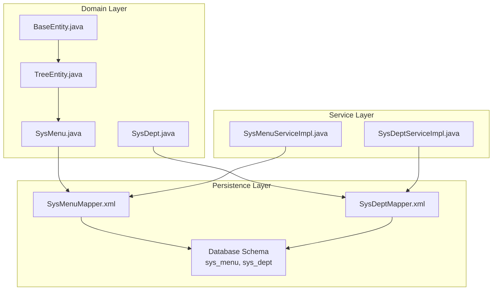
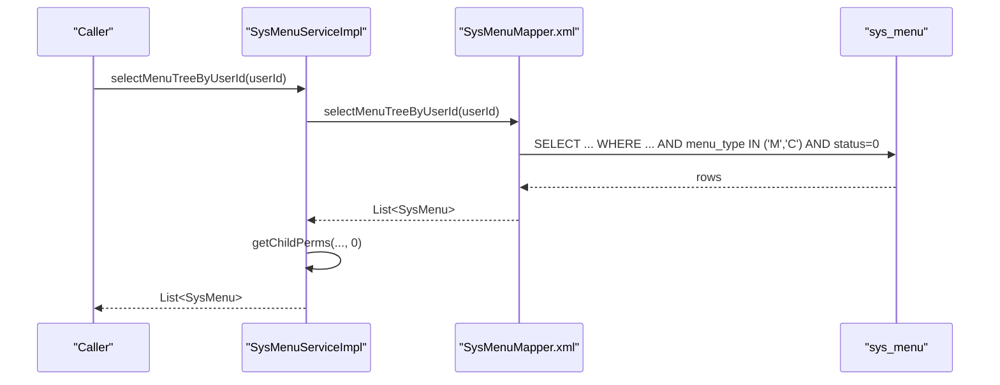
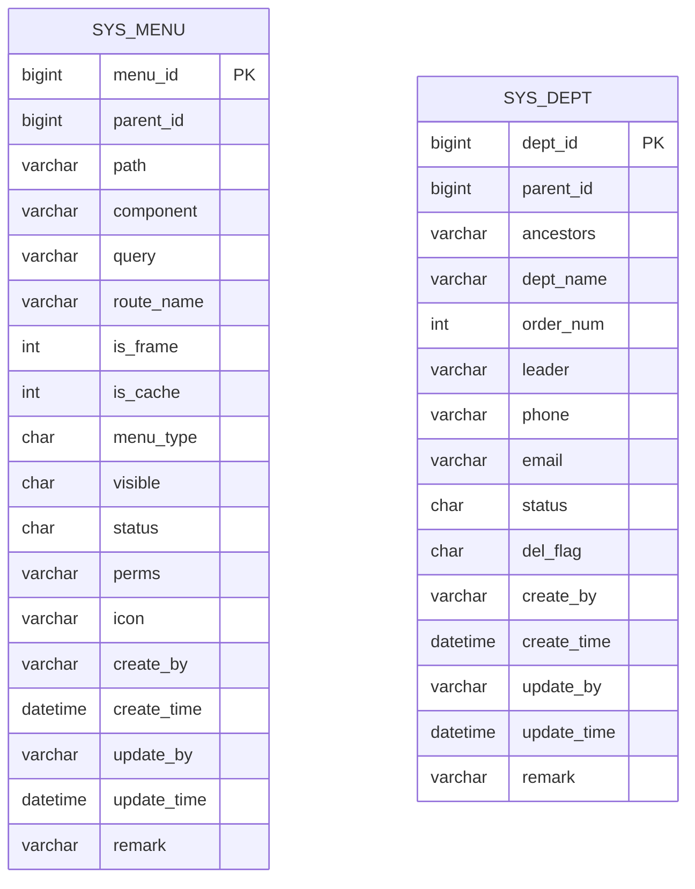
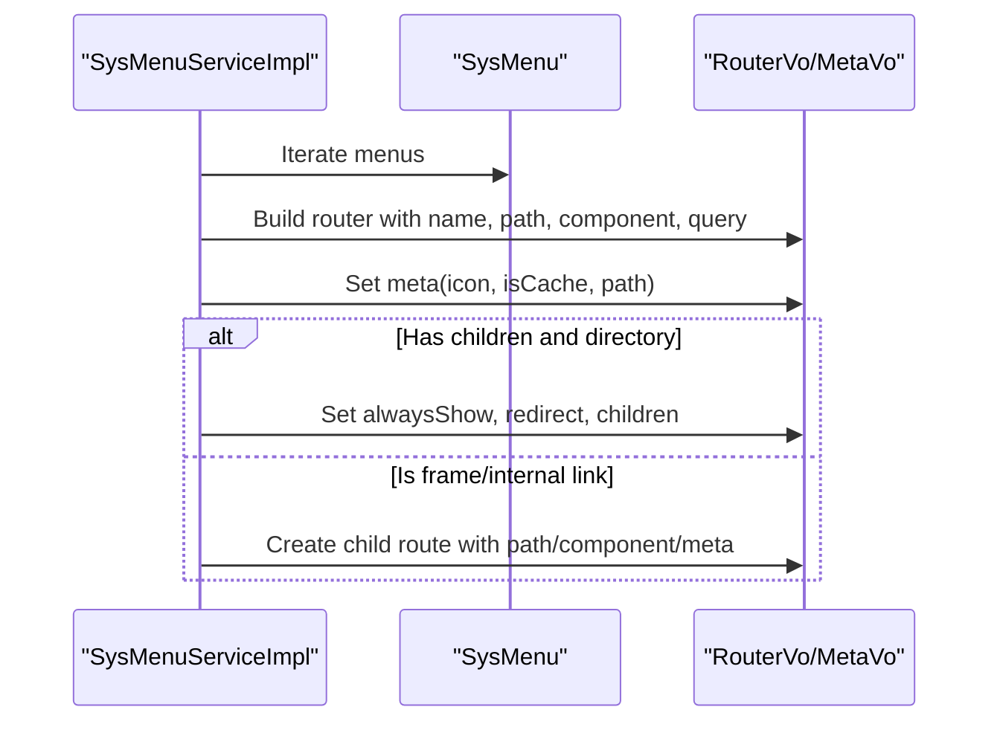
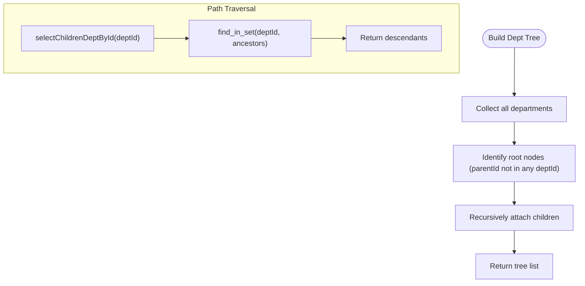
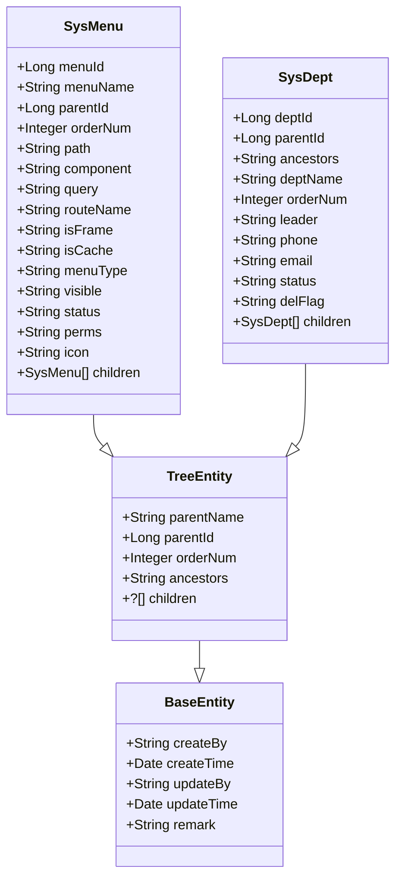

# Menu & Department Fields

<cite>
**Referenced Files in This Document**
- [SysMenu.java](file://src/main/java/com/ruoyi/project/system/domain/SysMenu.java)
- [SysDept.java](file://src/main/java/com/ruoyi/project/system/domain/SysDept.java)
- [TreeEntity.java](file://src/main/java/com/ruoyi/framework/web/domain/TreeEntity.java)
- [BaseEntity.java](file://src/main/java/com/ruoyi/framework/web/domain/BaseEntity.java)
- [SysMenuMapper.xml](file://src/main/resources/mybatis/system/SysMenuMapper.xml)
- [SysDeptMapper.xml](file://src/main/resources/mybatis/system/SysDeptMapper.xml)
- [ry_20250522.sql](file://sql/ry_20250522.sql)
- [SysMenuServiceImpl.java](file://src/main/java/com/ruoyi/project/system/service/impl/SysMenuServiceImpl.java)
- [SysDeptServiceImpl.java](file://src/main/java/com/ruoyi/project/system/service/impl/SysDeptServiceImpl.java)
</cite>

## Table of Contents
1. [Introduction](#introduction)
2. [Project Structure](#project-structure)
3. [Core Components](#core-components)
4. [Architecture Overview](#architecture-overview)
5. [Detailed Component Analysis](#detailed-component-analysis)
6. [Dependency Analysis](#dependency-analysis)
7. [Performance Considerations](#performance-considerations)
8. [Troubleshooting Guide](#troubleshooting-guide)
9. [Conclusion](#conclusion)

## Introduction
This document provides comprehensive field-level documentation for hierarchical entities in RuoYi-Vue, focusing on sys_menu and sys_dept tables. It maps database columns to Java entity fields, explains type conversions, and documents hierarchical navigation fields such as parent_id and ancestors. It covers menu-specific fields (component paths, route configuration, permissions, and UI rendering properties) and department-specific fields (contact information, leadership, and organizational hierarchy). It also documents the TreeEntity base class fields enabling tree operations, indexing strategies for ancestors, performance considerations for recursive queries, and business rules for menu type and department status.

## Project Structure
The relevant components are organized around domain entities, MyBatis mappers, and service implementations:
- Domain entities define Java fields mapped to database columns.
- MyBatis XML mappers define SQL queries and result mappings.
- Services orchestrate business logic and tree building.

**Diagram sources**
- [SysMenu.java](file://src/main/java/com/ruoyi/project/system/domain/SysMenu.java#L1-L275)
- [SysDept.java](file://src/main/java/com/ruoyi/project/system/domain/SysDept.java#L1-L204)
- [TreeEntity.java](file://src/main/java/com/ruoyi/framework/web/domain/TreeEntity.java#L1-L80)
- [BaseEntity.java](file://src/main/java/com/ruoyi/framework/web/domain/BaseEntity.java#L1-L119)
- [SysMenuMapper.xml](file://src/main/resources/mybatis/system/SysMenuMapper.xml#L1-L206)
- [SysDeptMapper.xml](file://src/main/resources/mybatis/system/SysDeptMapper.xml#L1-L159)
- [SysMenuServiceImpl.java](file://src/main/java/com/ruoyi/project/system/service/impl/SysMenuServiceImpl.java#L1-L200)
- [SysDeptServiceImpl.java](file://src/main/java/com/ruoyi/project/system/service/impl/SysDeptServiceImpl.java#L1-L200)

**Section sources**
- [SysMenu.java](file://src/main/java/com/ruoyi/project/system/domain/SysMenu.java#L1-L275)
- [SysDept.java](file://src/main/java/com/ruoyi/project/system/domain/SysDept.java#L1-L204)
- [TreeEntity.java](file://src/main/java/com/ruoyi/framework/web/domain/TreeEntity.java#L1-L80)
- [BaseEntity.java](file://src/main/java/com/ruoyi/framework/web/domain/BaseEntity.java#L1-L119)
- [SysMenuMapper.xml](file://src/main/resources/mybatis/system/SysMenuMapper.xml#L1-L206)
- [SysDeptMapper.xml](file://src/main/resources/mybatis/system/SysDeptMapper.xml#L1-L159)
- [SysMenuServiceImpl.java](file://src/main/java/com/ruoyi/project/system/service/impl/SysMenuServiceImpl.java#L1-L200)
- [SysDeptServiceImpl.java](file://src/main/java/com/ruoyi/project/system/service/impl/SysDeptServiceImpl.java#L1-L200)

## Core Components
- SysMenu: Represents menu entries with hierarchical navigation, routing, caching, visibility, permissions, and UI metadata.
- SysDept: Represents departments with hierarchical navigation, contact info, leadership, and status.
- TreeEntity: Provides shared hierarchical fields (parentId, parentName, ancestors, orderNum) and children lists for tree operations.
- BaseEntity: Provides common audit fields (createBy, createTime, updateBy, updateTime, remark) used by both entities.

Key mappings:
- Database column to Java field naming convention: snake_case in DB maps to camelCase in Java (e.g., menu_id → menuId).
- Type conversions: numeric IDs are Long; character flags are String; ordering is Integer; dates are Date with JSON formatting.

**Section sources**
- [SysMenu.java](file://src/main/java/com/ruoyi/project/system/domain/SysMenu.java#L1-L275)
- [SysDept.java](file://src/main/java/com/ruoyi/project/system/domain/SysDept.java#L1-L204)
- [TreeEntity.java](file://src/main/java/com/ruoyi/framework/web/domain/TreeEntity.java#L1-L80)
- [BaseEntity.java](file://src/main/java/com/ruoyi/framework/web/domain/BaseEntity.java#L1-L119)

## Architecture Overview
The entities are persisted via MyBatis mappers and consumed by services to build hierarchical trees and route configurations.

**Diagram sources**
- [SysMenuServiceImpl.java](file://src/main/java/com/ruoyi/project/system/service/impl/SysMenuServiceImpl.java#L130-L143)
- [SysMenuMapper.xml](file://src/main/resources/mybatis/system/SysMenuMapper.xml#L77-L86)

**Section sources**
- [SysMenuServiceImpl.java](file://src/main/java/com/ruoyi/project/system/service/impl/SysMenuServiceImpl.java#L130-L143)
- [SysMenuMapper.xml](file://src/main/resources/mybatis/system/SysMenuMapper.xml#L77-L86)

## Detailed Component Analysis

### SysMenu Field Reference
Hierarchical navigation fields:
- parentId: Long; parent menu identifier; enables tree structure.
- parentName: String; cached parent name for convenience.
- ancestors: String; comma-separated ancestor IDs for path traversal (not present in SysMenu; inherited via TreeEntity).
- orderNum: Integer; display order within siblings.

Menu-specific fields:
- menuId: Long; unique identifier.
- menuName: String; display label.
- path: String; URL path for routing.
- component: String; Vue component path for page rendering.
- query: String; route query parameters.
- routeName: String; route name (fallback derived from path).
- isFrame: String; external link flag (0 yes, 1 no).
- isCache: String; cache flag (0 cache, 1 no cache).
- menuType: String; type discriminator (M directory, C menu, F button).
- visible: String; visibility flag (0 show, 1 hide).
- status: String; activation flag (0 normal, 1 disabled).
- perms: String; permission identifiers (comma-separated).
- icon: String; UI icon identifier.
- children: List<SysMenu>; nested child nodes.

Base fields (via TreeEntity/BaseEntity):
- parentName, parentId, orderNum, ancestors (TreeEntity)
- createBy, createTime, updateBy, updateTime, remark (BaseEntity)

Type conversions and constraints:
- Numeric IDs: Long; validated against zero/non-zero insertion rules in insert/update.
- Flags: String; values constrained by business rules (e.g., menuType accepts M/C/F).
- Ordering: Integer; validated for null/not-null constraints.
- Dates: Date; serialized with JSON date format.

Business rules:
- menuType: Must be one of M/C/F; enforced by validation and mapper filters.
- visible/status: Control UI visibility and activation state.
- perms: Comma-separated permission tokens; extracted and normalized by service.

Mapping details:
- DB columns to Java fields are defined in the result map and used by queries.

**Section sources**
- [SysMenu.java](file://src/main/java/com/ruoyi/project/system/domain/SysMenu.java#L1-L275)
- [TreeEntity.java](file://src/main/java/com/ruoyi/framework/web/domain/TreeEntity.java#L1-L80)
- [BaseEntity.java](file://src/main/java/com/ruoyi/framework/web/domain/BaseEntity.java#L1-L119)
- [SysMenuMapper.xml](file://src/main/resources/mybatis/system/SysMenuMapper.xml#L7-L29)
- [SysMenuMapper.xml](file://src/main/resources/mybatis/system/SysMenuMapper.xml#L31-L56)
- [SysMenuMapper.xml](file://src/main/resources/mybatis/system/SysMenuMapper.xml#L57-L86)
- [SysMenuMapper.xml](file://src/main/resources/mybatis/system/SysMenuMapper.xml#L122-L158)
- [SysMenuMapper.xml](file://src/main/resources/mybatis/system/SysMenuMapper.xml#L160-L201)
- [ry_20250522.sql](file://sql/ry_20250522.sql#L133-L156)
- [SysMenuServiceImpl.java](file://src/main/java/com/ruoyi/project/system/service/impl/SysMenuServiceImpl.java#L164-L200)

### SysDept Field Reference
Hierarchical navigation fields:
- deptId: Long; unique department identifier.
- parentId: Long; parent department identifier.
- ancestors: String; comma-separated ancestor IDs for path traversal.
- orderNum: Integer; display order within siblings.
- parentName: String; cached parent department name.

Department-specific fields:
- deptName: String; department name.
- leader: String; responsible person.
- phone: String; contact phone.
- email: String; contact email.
- status: String; operational status (0 normal, 1 disabled).
- delFlag: String; soft-delete marker (0 exists, 2 deleted).
- children: List<SysDept>; nested child departments.

Base fields (via TreeEntity/BaseEntity):
- parentName, parentId, orderNum, ancestors (TreeEntity)
- createBy, createTime, updateBy, updateTime, remark (BaseEntity)

Type conversions and constraints:
- Numeric IDs: Long; validated against zero/non-zero insertion rules.
- Flags: String; values constrained by business rules (e.g., status/delFlag).
- Contact info: Strings with length validations.

Business rules:
- ancestors: Maintained via update operations; used for subtree queries.
- delFlag: Soft deletion; queries filter by delFlag = '0'.
- status: Operational state; used in subtree checks.

Mapping details:
- DB columns to Java fields are defined in the result map and used by queries.

**Section sources**
- [SysDept.java](file://src/main/java/com/ruoyi/project/system/domain/SysDept.java#L1-L204)
- [TreeEntity.java](file://src/main/java/com/ruoyi/framework/web/domain/TreeEntity.java#L1-L80)
- [BaseEntity.java](file://src/main/java/com/ruoyi/framework/web/domain/BaseEntity.java#L1-L119)
- [SysDeptMapper.xml](file://src/main/resources/mybatis/system/SysDeptMapper.xml#L7-L23)
- [SysDeptMapper.xml](file://src/main/resources/mybatis/system/SysDeptMapper.xml#L25-L48)
- [SysDeptMapper.xml](file://src/main/resources/mybatis/system/SysDeptMapper.xml#L77-L84)
- [SysDeptMapper.xml](file://src/main/resources/mybatis/system/SysDeptMapper.xml#L118-L133)
- [SysDeptMapper.xml](file://src/main/resources/mybatis/system/SysDeptMapper.xml#L135-L146)
- [ry_20250522.sql](file://sql/ry_20250522.sql#L1-L22)

### TreeEntity Base Class Fields
TreeEntity provides reusable hierarchical fields and children collections for tree operations:
- parentName: String; parent name.
- parentId: Long; parent identifier.
- orderNum: Integer; sibling ordering.
- ancestors: String; ancestor IDs path.
- children: List<?>; child nodes.

These fields are inherited by SysMenu and SysDept, enabling consistent tree-building logic in services.

**Section sources**
- [TreeEntity.java](file://src/main/java/com/ruoyi/framework/web/domain/TreeEntity.java#L1-L80)
- [SysMenu.java](file://src/main/java/com/ruoyi/project/system/domain/SysMenu.java#L1-L275)
- [SysDept.java](file://src/main/java/com/ruoyi/project/system/domain/SysDept.java#L1-L204)

### Database Schema and Mappings
The schema defines primary keys and constraints for both tables. The MyBatis mappers define result maps and queries that populate the entities.

**Diagram sources**
- [ry_20250522.sql](file://sql/ry_20250522.sql#L133-L156)
- [ry_20250522.sql](file://sql/ry_20250522.sql#L1-L22)

**Section sources**
- [ry_20250522.sql](file://sql/ry_20250522.sql#L1-L22)
- [ry_20250522.sql](file://sql/ry_20250522.sql#L133-L156)
- [SysMenuMapper.xml](file://src/main/resources/mybatis/system/SysMenuMapper.xml#L7-L29)
- [SysDeptMapper.xml](file://src/main/resources/mybatis/system/SysDeptMapper.xml#L7-L23)

### Menu Route and UI Rendering Properties
Services transform SysMenu entities into RouterVo/MetaVo for frontend consumption:
- Router name and path derived from routeName/path.
- Component path and query parameters mapped from component/query.
- Visibility and caching flags mapped from visible/isCache.
- Children handling for nested routes.

**Diagram sources**
- [SysMenuServiceImpl.java](file://src/main/java/com/ruoyi/project/system/service/impl/SysMenuServiceImpl.java#L164-L200)
- [SysMenu.java](file://src/main/java/com/ruoyi/project/system/domain/SysMenu.java#L1-L275)

**Section sources**
- [SysMenuServiceImpl.java](file://src/main/java/com/ruoyi/project/system/service/impl/SysMenuServiceImpl.java#L164-L200)
- [SysMenu.java](file://src/main/java/com/ruoyi/project/system/domain/SysMenu.java#L1-L275)

### Department Tree Building and Path Traversal
Services build department trees and traverse ancestors:
- Tree construction identifies roots and recursively builds subtrees.
- Ancestor path is maintained and updated during inserts/updates.
- Subtree queries use find_in_set on ancestors to retrieve descendants.

**Diagram sources**
- [SysDeptServiceImpl.java](file://src/main/java/com/ruoyi/project/system/service/impl/SysDeptServiceImpl.java#L70-L89)
- [SysDeptMapper.xml](file://src/main/resources/mybatis/system/SysDeptMapper.xml#L77-L84)

**Section sources**
- [SysDeptServiceImpl.java](file://src/main/java/com/ruoyi/project/system/service/impl/SysDeptServiceImpl.java#L70-L89)
- [SysDeptMapper.xml](file://src/main/resources/mybatis/system/SysDeptMapper.xml#L77-L84)

## Dependency Analysis
- SysMenu and SysDept inherit from TreeEntity, which inherits from BaseEntity, ensuring consistent hierarchical and audit fields.
- MyBatis mappers define result maps and queries that populate entities.
- Services depend on mappers to fetch and transform data into tree structures and route configurations.

**Diagram sources**
- [BaseEntity.java](file://src/main/java/com/ruoyi/framework/web/domain/BaseEntity.java#L1-L119)
- [TreeEntity.java](file://src/main/java/com/ruoyi/framework/web/domain/TreeEntity.java#L1-L80)
- [SysMenu.java](file://src/main/java/com/ruoyi/project/system/domain/SysMenu.java#L1-L275)
- [SysDept.java](file://src/main/java/com/ruoyi/project/system/domain/SysDept.java#L1-L204)

**Section sources**
- [BaseEntity.java](file://src/main/java/com/ruoyi/framework/web/domain/BaseEntity.java#L1-L119)
- [TreeEntity.java](file://src/main/java/com/ruoyi/framework/web/domain/TreeEntity.java#L1-L80)
- [SysMenu.java](file://src/main/java/com/ruoyi/project/system/domain/SysMenu.java#L1-L275)
- [SysDept.java](file://src/main/java/com/ruoyi/project/system/domain/SysDept.java#L1-L204)

## Performance Considerations
- ancestors indexing: The ancestors column is used for subtree queries via find_in_set. While MySQL does not support functional indexes on expressions like find_in_set, consider:
  - Adding a composite index on (parent_id, order_num) to optimize tree scans and ordering.
  - Normalizing hierarchy storage (e.g., adjacency list with computed paths) if extremely deep trees are common.
- Recursive queries:
  - For sys_dept, subtree retrieval uses find_in_set on ancestors. This can be expensive on large datasets; consider denormalized path columns or materialized paths if performance becomes an issue.
  - For sys_menu, filtering by menu_type and status reduces result sets for route building.
- Caching:
  - isCache flag controls whether routes are cached; use sparingly for frequently changing routes.
- Soft deletes:
  - delFlag filtering prevents scanning deleted records; keep consistent across queries.

[No sources needed since this section provides general guidance]

## Troubleshooting Guide
Common issues and resolutions:
- Duplicate menu names under the same parent:
  - Validation occurs via checkMenuNameUnique; ensure parentId is set correctly.
- Duplicate department names under the same parent:
  - Validation occurs via checkDeptNameUnique; ensure parentId and delFlag conditions are met.
- Incorrect ancestors after updates:
  - Use updateDeptChildren to refresh ancestor paths for affected nodes.
- Missing children in tree:
  - Verify parentId references exist and orderNum is set; ensure queries filter by appropriate status flags.
- Route visibility issues:
  - Confirm visible/status flags and menuType filters align with intended UI behavior.

**Section sources**
- [SysMenuMapper.xml](file://src/main/resources/mybatis/system/SysMenuMapper.xml#L131-L135)
- [SysDeptMapper.xml](file://src/main/resources/mybatis/system/SysDeptMapper.xml#L85-L89)
- [SysDeptMapper.xml](file://src/main/resources/mybatis/system/SysDeptMapper.xml#L135-L146)

## Conclusion
RuoYi-Vue’s hierarchical entities leverage a consistent design with TreeEntity and BaseEntity to unify tree operations and auditing. sys_menu and sys_dept expose robust fields for navigation, UI rendering, permissions, and organizational hierarchy. The MyBatis mappings and service logic provide efficient tree building and route generation. For optimal performance, consider targeted indexing and careful use of ancestors-based queries, especially in large hierarchies.