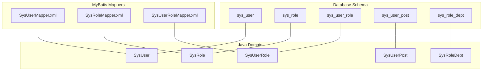
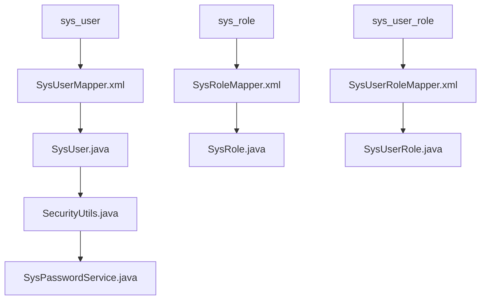
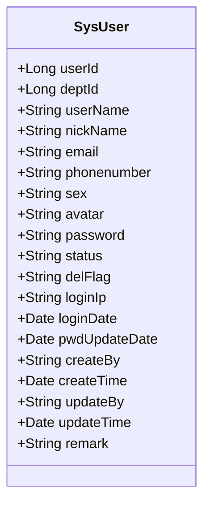
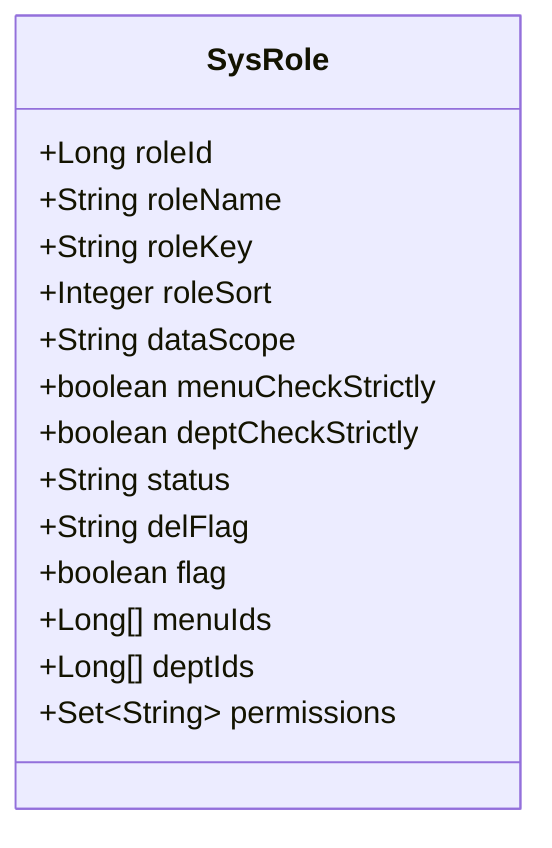
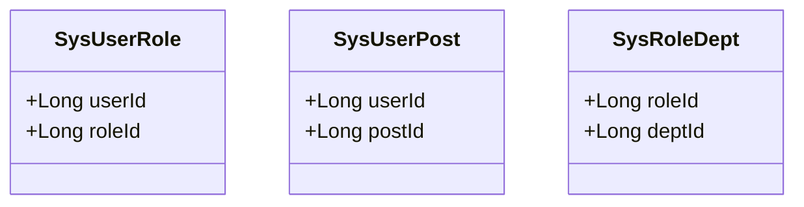
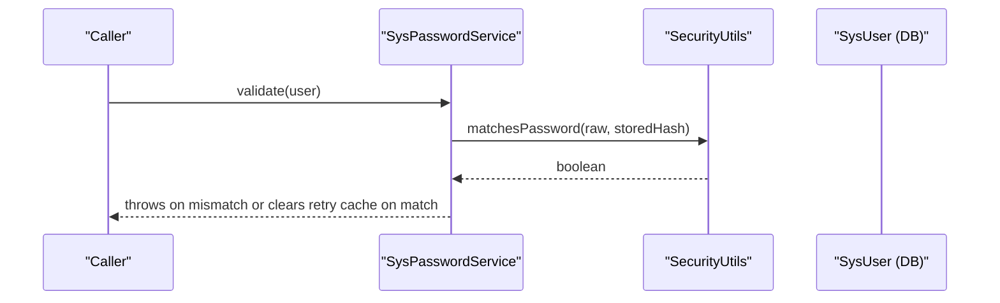
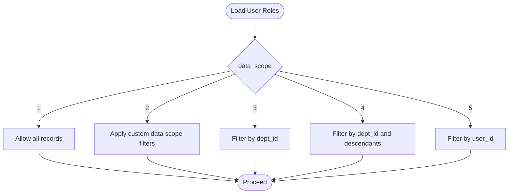
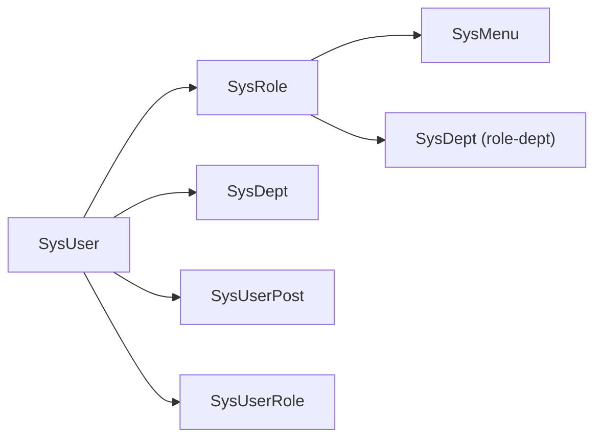

# User & Role Fields

<cite>
**Referenced Files in This Document**
- [ry_20250522.sql](file://sql/ry_20250522.sql)
- [SysUser.java](file://src/main/java/com/ruoyi/project/system/domain/SysUser.java)
- [SysRole.java](file://src/main/java/com/ruoyi/project/system/domain/SysRole.java)
- [SysUserRole.java](file://src/main/java/com/ruoyi/project/system/domain/SysUserRole.java)
- [SysUserPost.java](file://src/main/java/com/ruoyi/project/system/domain/SysUserPost.java)
- [SysRoleDept.java](file://src/main/java/com/ruoyi/project/system/domain/SysRoleDept.java)
- [SysUserMapper.xml](file://src/main/resources/mybatis/system/SysUserMapper.xml)
- [SysRoleMapper.xml](file://src/main/resources/mybatis/system/SysRoleMapper.xml)
- [SysUserRoleMapper.xml](file://src/main/resources/mybatis/system/SysUserRoleMapper.xml)
- [SysPasswordService.java](file://src/main/java/com/ruoyi/framework/security/service/SysPasswordService.java)
- [SecurityUtils.java](file://src/main/java/com/ruoyi/common/utils/SecurityUtils.java)
- [UserStatus.java](file://src/main/java/com/ruoyi/common/enums/UserStatus.java)
</cite>

## Table of Contents
1. [Introduction](#introduction)
2. [Project Structure](#project-structure)
3. [Core Components](#core-components)
4. [Architecture Overview](#architecture-overview)
5. [Detailed Component Analysis](#detailed-component-analysis)
6. [Dependency Analysis](#dependency-analysis)
7. [Performance Considerations](#performance-considerations)
8. [Troubleshooting Guide](#troubleshooting-guide)
9. [Conclusion](#conclusion)

## Introduction
This document provides comprehensive field-level documentation for user and role management entities in RuoYi-Vue. It covers:
- Every column in sys_user, sys_role, and related junction tables (sys_user_role, sys_user_post, sys_role_dept)
- Data types, constraints, and business meaning
- Mapping from database columns to Java entity fields (e.g., user_id → userId)
- Type conversion considerations and MyBatis result mapping
- Critical security fields: password (bcrypt hashed), status flags, and del_flag for soft deletes
- Role-based access control fields: role_key, data_scope, and permission flags
- Junction table fields for user-role, user-post, and role-dept relationships
- Indexing strategies for frequently queried fields
- Business rules around user status transitions and role permission inheritance

## Project Structure
The relevant database schema and Java domain/mapper files are organized as follows:
- Database schema: sys_user, sys_role, sys_user_role, sys_user_post, sys_role_dept
- Java domain classes: SysUser, SysRole, SysUserRole, SysUserPost, SysRoleDept
- MyBatis mappers: SysUserMapper.xml, SysRoleMapper.xml, SysUserRoleMapper.xml
- Security utilities: SysPasswordService.java, SecurityUtils.java
- Status enumeration: UserStatus.java

**Diagram sources**
- [ry_20250522.sql](file://sql/ry_20250522.sql#L41-L121)
- [SysUser.java](file://src/main/java/com/ruoyi/project/system/domain/SysUser.java#L1-L341)
- [SysRole.java](file://src/main/java/com/ruoyi/project/system/domain/SysRole.java#L1-L242)
- [SysUserRole.java](file://src/main/java/com/ruoyi/project/system/domain/SysUserRole.java#L1-L47)
- [SysUserPost.java](file://src/main/java/com/ruoyi/project/system/domain/SysUserPost.java#L1-L47)
- [SysRoleDept.java](file://src/main/java/com/ruoyi/project/system/domain/SysRoleDept.java#L1-L47)
- [SysUserMapper.xml](file://src/main/resources/mybatis/system/SysUserMapper.xml#L1-L227)
- [SysRoleMapper.xml](file://src/main/resources/mybatis/system/SysRoleMapper.xml#L1-L152)
- [SysUserRoleMapper.xml](file://src/main/resources/mybatis/system/SysUserRoleMapper.xml#L1-L44)

**Section sources**
- [ry_20250522.sql](file://sql/ry_20250522.sql#L41-L121)
- [SysUser.java](file://src/main/java/com/ruoyi/project/system/domain/SysUser.java#L1-L341)
- [SysRole.java](file://src/main/java/com/ruoyi/project/system/domain/SysRole.java#L1-L242)
- [SysUserRole.java](file://src/main/java/com/ruoyi/project/system/domain/SysUserRole.java#L1-L47)
- [SysUserPost.java](file://src/main/java/com/ruoyi/project/system/domain/SysUserPost.java#L1-L47)
- [SysRoleDept.java](file://src/main/java/com/ruoyi/project/system/domain/SysRoleDept.java#L1-L47)
- [SysUserMapper.xml](file://src/main/resources/mybatis/system/SysUserMapper.xml#L1-L227)
- [SysRoleMapper.xml](file://src/main/resources/mybatis/system/SysRoleMapper.xml#L1-L152)
- [SysUserRoleMapper.xml](file://src/main/resources/mybatis/system/SysUserRoleMapper.xml#L1-L44)

## Core Components
This section maps database columns to Java entity fields and explains data types, constraints, and business meaning.

- sys_user
  - user_id → userId (Long, PK)
  - dept_id → deptId (Long, FK to sys_dept.dept_id)
  - user_name → userName (String, unique)
  - nick_name → nickName (String)
  - email → email (String)
  - phonenumber → phonenumber (String)
  - sex → sex (String, '0'/'1'/'2')
  - avatar → avatar (String)
  - password → password (String, bcrypt hashed)
  - status → status (String, '0' normal, '1' disabled)
  - del_flag → delFlag (String, '0' active, '2' deleted)
  - login_ip → loginIp (String)
  - login_date → loginDate (Date)
  - pwd_update_date → pwdUpdateDate (Date)
  - create_by → createBy (String)
  - create_time → createTime (Date)
  - update_by → updateBy (String)
  - update_time → updateTime (Date)
  - remark → remark (String)

- sys_role
  - role_id → roleId (Long, PK)
  - role_name → roleName (String)
  - role_key → roleKey (String, unique)
  - role_sort → roleSort (Integer)
  - data_scope → dataScope (String, '1'-'5' for data scope)
  - menu_check_strictly → menuCheckStrictly (Boolean)
  - dept_check_strictly → deptCheckStrictly (Boolean)
  - status → status (String, '0' normal, '1' disabled)
  - del_flag → delFlag (String, '0' active, '2' deleted)
  - create_by → createBy (String)
  - create_time → createTime (Date)
  - update_by → updateBy (String)
  - update_time → updateTime (Date)
  - remark → remark (String)

- sys_user_role (junction)
  - user_id → userId (Long, PK part 1)
  - role_id → roleId (Long, PK part 2)

- sys_user_post (junction)
  - user_id → userId (Long, PK part 1)
  - post_id → postId (Long, PK part 2)

- sys_role_dept (junction)
  - role_id → roleId (Long, PK part 1)
  - dept_id → deptId (Long, PK part 2)

Type conversion highlights:
- Enum-like status fields are stored as single-character strings in the database and mapped to String fields in Java.
- Boolean flags are stored as tinyint/Boolean in Java and mapped to boolean fields.
- Password is stored as bcrypt-hashed string and verified using BCrypt in runtime.

**Section sources**
- [ry_20250522.sql](file://sql/ry_20250522.sql#L41-L121)
- [SysUser.java](file://src/main/java/com/ruoyi/project/system/domain/SysUser.java#L1-L341)
- [SysRole.java](file://src/main/java/com/ruoyi/project/system/domain/SysRole.java#L1-L242)
- [SysUserRole.java](file://src/main/java/com/ruoyi/project/system/domain/SysUserRole.java#L1-L47)
- [SysUserPost.java](file://src/main/java/com/ruoyi/project/system/domain/SysUserPost.java#L1-L47)
- [SysRoleDept.java](file://src/main/java/com/ruoyi/project/system/domain/SysRoleDept.java#L1-L47)

## Architecture Overview
The user and role management architecture connects database tables to Java domain objects via MyBatis mappers. Security utilities enforce password hashing and validation.

**Diagram sources**
- [SysUserMapper.xml](file://src/main/resources/mybatis/system/SysUserMapper.xml#L1-L227)
- [SysRoleMapper.xml](file://src/main/resources/mybatis/system/SysRoleMapper.xml#L1-L152)
- [SysUserRoleMapper.xml](file://src/main/resources/mybatis/system/SysUserRoleMapper.xml#L1-L44)
- [SysUser.java](file://src/main/java/com/ruoyi/project/system/domain/SysUser.java#L1-L341)
- [SysRole.java](file://src/main/java/com/ruoyi/project/system/domain/SysRole.java#L1-L242)
- [SysUserRole.java](file://src/main/java/com/ruoyi/project/system/domain/SysUserRole.java#L1-L47)
- [SecurityUtils.java](file://src/main/java/com/ruoyi/common/utils/SecurityUtils.java#L91-L114)
- [SysPasswordService.java](file://src/main/java/com/ruoyi/framework/security/service/SysPasswordService.java#L44-L86)

## Detailed Component Analysis

### sys_user Field Mapping and Business Meaning
- Primary key and identity: user_id → userId (Long)
- Foreign key: dept_id → deptId (Long)
- Identity and contact: user_name (unique), nick_name, email, phonenumber
- Demographics: sex ('0' male, '1' female, '2' unknown)
- Security: password (bcrypt hashed), status ('0' normal, '1' disabled), del_flag ('0' active, '2' deleted)
- Audit trail: create_by, create_time, update_by, update_time, remark
- Login tracking: login_ip, login_date, pwd_update_date

Type conversions and constraints:
- String fields in Java map to VARCHAR in SQL; unique constraints enforced by checks in mappers.
- Status and del_flag are single-character codes mapped to String fields.
- Password is stored as bcrypt hash and compared using SecurityUtils.matchesPassword.

Soft delete behavior:
- Deletion updates del_flag to '2' rather than physical deletion.

**Diagram sources**
- [SysUser.java](file://src/main/java/com/ruoyi/project/system/domain/SysUser.java#L1-L341)
- [SysUserMapper.xml](file://src/main/resources/mybatis/system/SysUserMapper.xml#L7-L29)

**Section sources**
- [ry_20250522.sql](file://sql/ry_20250522.sql#L41-L64)
- [SysUser.java](file://src/main/java/com/ruoyi/project/system/domain/SysUser.java#L1-L341)
- [SysUserMapper.xml](file://src/main/resources/mybatis/system/SysUserMapper.xml#L1-L227)

### sys_role Field Mapping and Business Meaning
- Primary key: role_id → roleId (Long)
- Identity: role_name (unique), role_key (unique, permission key)
- Ordering: role_sort (Integer)
- Data scope: data_scope ('1' all, '2' custom, '3' dept, '4' dept+sub, '5' self)
- Navigation strictness: menu_check_strictly, dept_check_strictly (Boolean)
- Lifecycle: status ('0' normal, '1' disabled), del_flag ('0' active, '2' deleted)
- Audit trail: create_by, create_time, update_by, update_time, remark

Role permission inheritance:
- Permissions are aggregated from associated sys_role_menu entries and exposed via LoginUser.getPermissions() during authentication.

**Diagram sources**
- [SysRole.java](file://src/main/java/com/ruoyi/project/system/domain/SysRole.java#L1-L242)
- [SysRoleMapper.xml](file://src/main/resources/mybatis/system/SysRoleMapper.xml#L7-L22)

**Section sources**
- [ry_20250522.sql](file://sql/ry_20250522.sql#L104-L121)
- [SysRole.java](file://src/main/java/com/ruoyi/project/system/domain/SysRole.java#L1-L242)
- [SysRoleMapper.xml](file://src/main/resources/mybatis/system/SysRoleMapper.xml#L1-L152)

### Junction Tables: sys_user_role, sys_user_post, sys_role_dept
- sys_user_role: composite PK (user_id, role_id) linking users to roles
- sys_user_post: composite PK (user_id, post_id) linking users to posts
- sys_role_dept: composite PK (role_id, dept_id) linking roles to departments

**Diagram sources**
- [SysUserRole.java](file://src/main/java/com/ruoyi/project/system/domain/SysUserRole.java#L1-L47)
- [SysUserPost.java](file://src/main/java/com/ruoyi/project/system/domain/SysUserPost.java#L1-L47)
- [SysRoleDept.java](file://src/main/java/com/ruoyi/project/system/domain/SysRoleDept.java#L1-L47)
- [SysUserRoleMapper.xml](file://src/main/resources/mybatis/system/SysUserRoleMapper.xml#L1-L44)

**Section sources**
- [ry_20250522.sql](file://sql/ry_20250522.sql#L264-L414)
- [SysUserRole.java](file://src/main/java/com/ruoyi/project/system/domain/SysUserRole.java#L1-L47)
- [SysUserPost.java](file://src/main/java/com/ruoyi/project/system/domain/SysUserPost.java#L1-L47)
- [SysRoleDept.java](file://src/main/java/com/ruoyi/project/system/domain/SysRoleDept.java#L1-L47)
- [SysUserRoleMapper.xml](file://src/main/resources/mybatis/system/SysUserRoleMapper.xml#L1-L44)

### Security: Password Hashing and Validation
- Storage: password stored as bcrypt hash in sys_user.password
- Verification: SysPasswordService.validate compares raw password against stored hash using SecurityUtils.matchesPassword
- Encryption: SecurityUtils.encryptPassword generates bcrypt hashes for new passwords

**Diagram sources**
- [SysPasswordService.java](file://src/main/java/com/ruoyi/framework/security/service/SysPasswordService.java#L44-L86)
- [SecurityUtils.java](file://src/main/java/com/ruoyi/common/utils/SecurityUtils.java#L91-L114)
- [SysUserMapper.xml](file://src/main/resources/mybatis/system/SysUserMapper.xml#L124-L144)

**Section sources**
- [SysPasswordService.java](file://src/main/java/com/ruoyi/framework/security/service/SysPasswordService.java#L1-L87)
- [SecurityUtils.java](file://src/main/java/com/ruoyi/common/utils/SecurityUtils.java#L1-L177)
- [SysUserMapper.xml](file://src/main/resources/mybatis/system/SysUserMapper.xml#L124-L144)

### Data Scope and Permission Inheritance
- data_scope controls visibility boundaries for records:
  - '1': all data
  - '2': custom data
  - '3': department only
  - '4': department and subordinates
  - '5': personal data only
- Permissions are inherited from role-menu associations and exposed to the authenticated user context.

**Diagram sources**
- [SysRole.java](file://src/main/java/com/ruoyi/project/system/domain/SysRole.java#L38-L40)
- [SysUserMapper.xml](file://src/main/resources/mybatis/system/SysUserMapper.xml#L80-L87)

**Section sources**
- [SysRole.java](file://src/main/java/com/ruoyi/project/system/domain/SysRole.java#L1-L242)
- [SysUserMapper.xml](file://src/main/resources/mybatis/system/SysUserMapper.xml#L80-L87)

## Dependency Analysis
- SysUser depends on SysDept (one-to-one via deptId) and SysRole (many-to-many via sys_user_role)
- SysRole depends on SysMenu (via sys_role_menu) and SysDept (via sys_role_dept)
- SysUserPost and SysUserRole are pure junction tables with composite PKs

**Diagram sources**
- [SysUser.java](file://src/main/java/com/ruoyi/project/system/domain/SysUser.java#L77-L83)
- [SysRole.java](file://src/main/java/com/ruoyi/project/system/domain/SysRole.java#L61-L66)
- [SysUserRole.java](file://src/main/java/com/ruoyi/project/system/domain/SysUserRole.java#L1-L47)
- [SysUserPost.java](file://src/main/java/com/ruoyi/project/system/domain/SysUserPost.java#L1-L47)
- [SysRoleDept.java](file://src/main/java/com/ruoyi/project/system/domain/SysRoleDept.java#L1-L47)

**Section sources**
- [SysUser.java](file://src/main/java/com/ruoyi/project/system/domain/SysUser.java#L77-L83)
- [SysRole.java](file://src/main/java/com/ruoyi/project/system/domain/SysRole.java#L61-L66)
- [SysUserRole.java](file://src/main/java/com/ruoyi/project/system/domain/SysUserRole.java#L1-L47)
- [SysUserPost.java](file://src/main/java/com/ruoyi/project/system/domain/SysUserPost.java#L1-L47)
- [SysRoleDept.java](file://src/main/java/com/ruoyi/project/system/domain/SysRoleDept.java#L1-L47)

## Performance Considerations
- Frequently queried fields and indexes:
  - sys_user.user_name: used in unique checks and list filters
  - sys_user.email: used in unique checks and list filters
  - sys_user.phonenumber: used in unique checks and list filters
  - sys_user.status: used in list filters
  - sys_user.create_time: used in date-range filters
  - sys_user.login_date: used for last login tracking
  - sys_role.role_key: used in unique checks and permission lookups
  - sys_role.status: used in list filters
  - sys_logininfor.status and login_time: used for audit logs

- Indexing strategy recommendations:
  - Add indexes on sys_user.user_name, email, phonenumber for uniqueness and search performance
  - Add indexes on sys_user.status and sys_user.create_time for filtering
  - Add indexes on sys_role.role_key and sys_role.status for filtering
  - Consider indexes on sys_user_role(user_id), sys_user_role(role_id), sys_user_post(user_id), sys_user_post(post_id), sys_role_dept(role_id), sys_role_dept(dept_id) for join performance

[No sources needed since this section provides general guidance]

## Troubleshooting Guide
Common issues and resolutions:
- Duplicate user_name/email/phonenumber:
  - Use unique checks in mappers (checkUserNameUnique, checkEmailUnique, checkPhoneUnique) to detect duplicates before insert/update.
- Password mismatch during login:
  - SysPasswordService increments retry counts and locks accounts after exceeding maxRetryCount; clears cache on successful match.
- Status transitions:
  - User status transitions are controlled by update operations; ensure status values conform to '0'/'1'.
- Soft delete:
  - Deletion sets del_flag to '2'; queries should filter by del_flag = '0' to exclude deleted records.

**Section sources**
- [SysUserMapper.xml](file://src/main/resources/mybatis/system/SysUserMapper.xml#L134-L144)
- [SysRoleMapper.xml](file://src/main/resources/mybatis/system/SysRoleMapper.xml#L86-L94)
- [SysPasswordService.java](file://src/main/java/com/ruoyi/framework/security/service/SysPasswordService.java#L44-L86)
- [UserStatus.java](file://src/main/java/com/ruoyi/common/enums/UserStatus.java#L1-L31)

## Conclusion
This document mapped database columns to Java entities, clarified data types and constraints, explained security mechanisms (bcrypt hashing), and documented role-based access control fields and data scope semantics. It also outlined junction table relationships and provided practical guidance on indexing and troubleshooting.