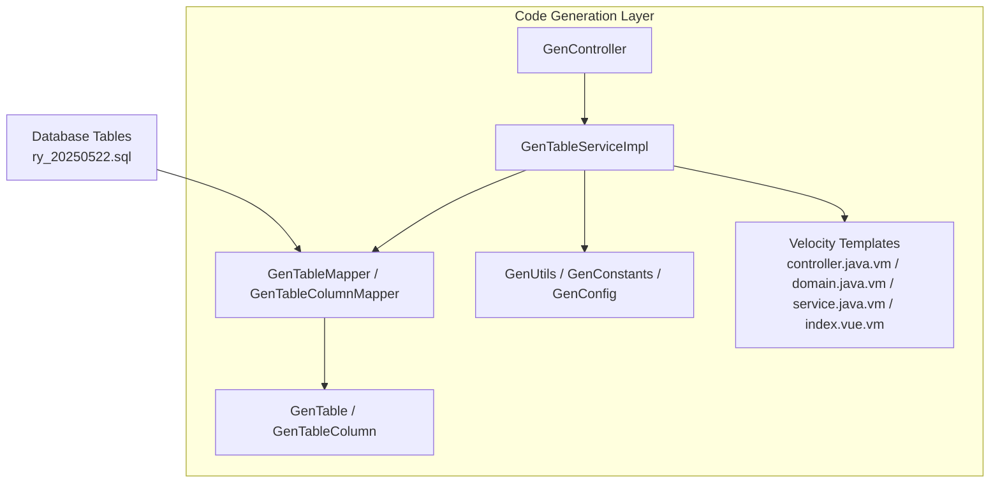
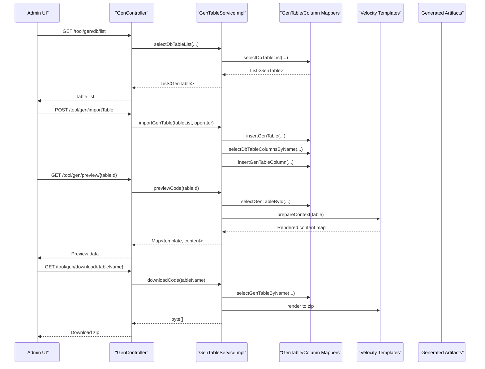
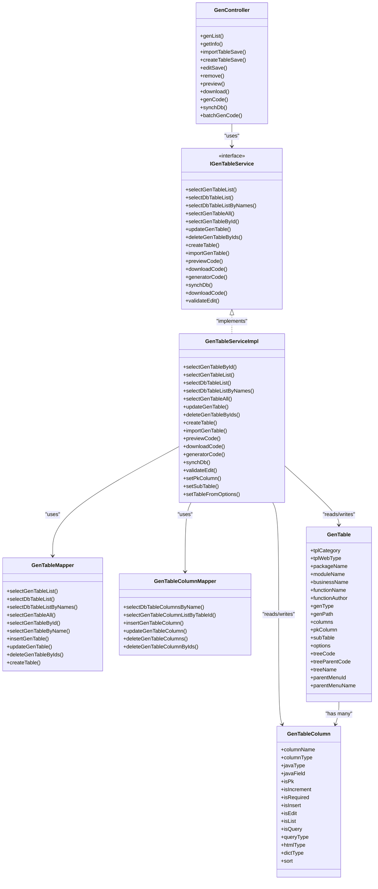

# Code Generation Tables

<cite>
**Referenced Files in This Document**
- [GenTable.java](file://src/main/java/com/ruoyi/project/tool/gen/domain/GenTable.java)
- [GenTableColumn.java](file://src/main/java/com/ruoyi/project/tool/gen/domain/GenTableColumn.java)
- [IGenTableService.java](file://src/main/java/com/ruoyi/project/tool/gen/service/IGenTableService.java)
- [GenTableServiceImpl.java](file://src/main/java/com/ruoyi/project/tool/gen/service/GenTableServiceImpl.java)
- [GenTableMapper.java](file://src/main/java/com/ruoyi/project/tool/gen/mapper/GenTableMapper.java)
- [GenTableColumnMapper.java](file://src/main/java/com/ruoyi/project/tool/gen/mapper/GenTableColumnMapper.java)
- [GenController.java](file://src/main/java/com/ruoyi/project/tool/gen/controller/GenController.java)
- [GenUtils.java](file://src/main/java/com/ruoyi/project/tool/gen/util/GenUtils.java)
- [GenConstants.java](file://src/main/java/com/ruoyi/common/constant/GenConstants.java)
- [GenConfig.java](file://src/main/java/com/ruoyi/framework/config/GenConfig.java)
- [controller.java.vm](file://src/main/resources/vm/java/controller.java.vm)
- [domain.java.vm](file://src/main/resources/vm/java/domain.java.vm)
- [service.java.vm](file://src/main/resources/vm/java/service.java.vm)
- [index.vue.vm](file://src/main/resources/vm/vue/index.vue.vm)
- [ry_20250522.sql](file://sql/ry_20250522.sql)
</cite>

## Table of Contents
1. [Introduction](#introduction)
2. [Project Structure](#project-structure)
3. [Core Components](#core-components)
4. [Architecture Overview](#architecture-overview)
5. [Detailed Component Analysis](#detailed-component-analysis)
6. [Dependency Analysis](#dependency-analysis)
7. [Performance Considerations](#performance-considerations)
8. [Troubleshooting Guide](#troubleshooting-guide)
9. [Conclusion](#conclusion)
10. [Appendices](#appendices)

## Introduction
This document explains the code generation tables and their role in the automated CRUD code generation system of RuoYi-Vue. It focuses on:
- The purpose and structure of the gen_table and gen_table_column tables
- How these tables store metadata and UI hints for code generation
- How the service layer and controllers interact with these tables
- How Velocity templates transform table metadata into backend Java and frontend Vue.js code
- Practical examples of how changing table/column configurations affects generated output

## Project Structure
The code generation feature is organized around a domain model, a service layer, a controller, and Velocity templates. The gen_table and gen_table_column tables serve as the metadata sources for generating Java domain classes, controllers, services, mappers, Vue pages, and SQL scripts.

**Diagram sources**
- [GenController.java](file://src/main/java/com/ruoyi/project/tool/gen/controller/GenController.java#L1-L263)
- [GenTableServiceImpl.java](file://src/main/java/com/ruoyi/project/tool/gen/service/GenTableServiceImpl.java#L1-L531)
- [GenTableMapper.java](file://src/main/java/com/ruoyi/project/tool/gen/mapper/GenTableMapper.java#L1-L91)
- [GenTableColumnMapper.java](file://src/main/java/com/ruoyi/project/tool/gen/mapper/GenTableColumnMapper.java#L1-L60)
- [GenTable.java](file://src/main/java/com/ruoyi/project/tool/gen/domain/GenTable.java#L1-L385)
- [GenTableColumn.java](file://src/main/java/com/ruoyi/project/tool/gen/domain/GenTableColumn.java#L1-L373)
- [GenUtils.java](file://src/main/java/com/ruoyi/project/tool/gen/util/GenUtils.java#L1-L258)
- [GenConstants.java](file://src/main/java/com/ruoyi/common/constant/GenConstants.java#L1-L118)
- [GenConfig.java](file://src/main/java/com/ruoyi/framework/config/GenConfig.java#L1-L80)
- [controller.java.vm](file://src/main/resources/vm/java/controller.java.vm#L1-L116)
- [domain.java.vm](file://src/main/resources/vm/java/domain.java.vm#L1-L106)
- [service.java.vm](file://src/main/resources/vm/java/service.java.vm#L1-L62)
- [index.vue.vm](file://src/main/resources/vm/vue/index.vue.vm#L1-L603)
- [ry_20250522.sql](file://sql/ry_20250522.sql#L1-L200)

**Section sources**
- [GenController.java](file://src/main/java/com/ruoyi/project/tool/gen/controller/GenController.java#L1-L263)
- [GenTableServiceImpl.java](file://src/main/java/com/ruoyi/project/tool/gen/service/GenTableServiceImpl.java#L1-L531)
- [GenTable.java](file://src/main/java/com/ruoyi/project/tool/gen/domain/GenTable.java#L1-L385)
- [GenTableColumn.java](file://src/main/java/com/ruoyi/project/tool/gen/domain/GenTableColumn.java#L1-L373)
- [GenUtils.java](file://src/main/java/com/ruoyi/project/tool/gen/util/GenUtils.java#L1-L258)
- [GenConstants.java](file://src/main/java/com/ruoyi/common/constant/GenConstants.java#L1-L118)
- [GenConfig.java](file://src/main/java/com/ruoyi/framework/config/GenConfig.java#L1-L80)
- [controller.java.vm](file://src/main/resources/vm/java/controller.java.vm#L1-L116)
- [domain.java.vm](file://src/main/resources/vm/java/domain.java.vm#L1-L106)
- [service.java.vm](file://src/main/resources/vm/java/service.java.vm#L1-L62)
- [index.vue.vm](file://src/main/resources/vm/vue/index.vue.vm#L1-L603)
- [ry_20250522.sql](file://sql/ry_20250522.sql#L1-L200)

## Core Components
- gen_table (business table metadata): Stores configuration for a table to be generated, including package/module/business names, author, template category (crud/tree/sub), web UI type, generation path, and tree/sub-table linkage fields.
- gen_table_column (business column metadata): Stores per-column configuration such as Java type, field name, UI widget type, query type, required flag, and display flags for insert/edit/list/query.

These tables are mapped to GenTable and GenTableColumn domain classes and persisted via GenTableMapper and GenTableColumnMapper. The service layer orchestrates import, preview, download, and generation workflows using Velocity templates.

**Section sources**
- [GenTable.java](file://src/main/java/com/ruoyi/project/tool/gen/domain/GenTable.java#L1-L385)
- [GenTableColumn.java](file://src/main/java/com/ruoyi/project/tool/gen/domain/GenTableColumn.java#L1-L373)
- [GenTableMapper.java](file://src/main/java/com/ruoyi/project/tool/gen/mapper/GenTableMapper.java#L1-L91)
- [GenTableColumnMapper.java](file://src/main/java/com/ruoyi/project/tool/gen/mapper/GenTableColumnMapper.java#L1-L60)

## Architecture Overview
The code generation pipeline:
- Controllers expose endpoints to list/import/sync tables, preview, download, and generate code.
- Services load table/column metadata, initialize defaults, set primary keys, and resolve sub-tables.
- Utilities derive Java types, UI widgets, and naming conventions from database column definitions.
- Velocity templates render Java controllers/services/domain/serviceImpl/mapper, Vue pages, and SQL scripts.

**Diagram sources**
- [GenController.java](file://src/main/java/com/ruoyi/project/tool/gen/controller/GenController.java#L1-L263)
- [GenTableServiceImpl.java](file://src/main/java/com/ruoyi/project/tool/gen/service/GenTableServiceImpl.java#L1-L531)
- [GenTableMapper.java](file://src/main/java/com/ruoyi/project/tool/gen/mapper/GenTableMapper.java#L1-L91)
- [GenTableColumnMapper.java](file://src/main/java/com/ruoyi/project/tool/gen/mapper/GenTableColumnMapper.java#L1-L60)
- [controller.java.vm](file://src/main/resources/vm/java/controller.java.vm#L1-L116)
- [domain.java.vm](file://src/main/resources/vm/java/domain.java.vm#L1-L106)
- [service.java.vm](file://src/main/resources/vm/java/service.java.vm#L1-L62)
- [index.vue.vm](file://src/main/resources/vm/vue/index.vue.vm#L1-L603)

## Detailed Component Analysis

### gen_table: Business Table Metadata
Purpose:
- Defines how a database table is generated into backend Java and frontend Vue code.
- Holds package/module/business names, author, template category, web UI type, generation path, and tree/sub-table configuration.

Key fields and roles:
- Identification: tableId, tableName, tableComment
- Naming: className, packageName, moduleName, businessName, functionName, functionAuthor
- Template configuration: tplCategory (crud/tree/sub), tplWebType (frontend framework variant)
- Generation options: genType (zip/custom), genPath (custom output path)
- Tree/sub-table linkage: treeCode, treeParentCode, treeName, subTableName, subTableFkName
- Options: options JSON storing tree and parent menu fields parsed by setTableFromOptions
- Associations: pkColumn (primary key), subTable (child table), columns (list of GenTableColumn)

Behavior highlights:
- Template detection helpers: isCrud/isTree/isSub determine template family and base entity inheritance.
- Super column filtering: isSuperColumn decides whether to include base fields in generated domain classes.
- Validation: validateEdit enforces required fields for tree/sub templates.

**Section sources**
- [GenTable.java](file://src/main/java/com/ruoyi/project/tool/gen/domain/GenTable.java#L1-L385)
- [GenTableServiceImpl.java](file://src/main/java/com/ruoyi/project/tool/gen/service/GenTableServiceImpl.java#L1-L531)
- [GenConstants.java](file://src/main/java/com/ruoyi/common/constant/GenConstants.java#L1-L118)

### gen_table_column: Column-Level Configuration
Purpose:
- Stores per-column metadata used to generate Java types, UI widgets, and query/rendering logic.

Key fields and roles:
- Identification: columnId, tableId
- Schema: columnName, columnType, columnComment
- Java mapping: javaType, javaField (camelCase derived)
- Flags: isPk, isIncrement, isRequired, isInsert, isEdit, isList, isQuery
- Query: queryType (EQ/LIKE/BETWEEN/etc.), htmlType (input/select/radio/checkbox/datetime/editor/etc.)
- Dictionary: dictType for select/radio/checkbox options
- Ordering: sort

Behavior highlights:
- Predicates: isPk/isIncrement/isRequired/isInsert/isEdit/isList/isQuery with convenience methods.
- Usable column policy: isUsableColumn allows certain base fields to be included in forms even if they are super columns.
- Converter: readConverterExp parses comment-based value-label pairs for Excel export/read conversion.

**Section sources**
- [GenTableColumn.java](file://src/main/java/com/ruoyi/project/tool/gen/domain/GenTableColumn.java#L1-L373)
- [GenConstants.java](file://src/main/java/com/ruoyi/common/constant/GenConstants.java#L1-L118)

### Service Layer: GenTableServiceImpl
Responsibilities:
- Import database tables into gen_table and columns into gen_table_column with defaults initialized by GenUtils.
- Preview code by rendering Velocity templates with a prepared context.
- Generate code to zip or write to custom paths.
- Sync database schema changes back to gen_table and gen_table_column while preserving user-configured flags/options.
- Resolve primary keys and sub-tables for template rendering.

Key methods and flows:
- importGenTable: initializes table and columns, persists them, and sets defaults.
- previewCode/generatorCode: prepares Velocity context, selects templates by tplCategory/tplWebType, renders to zip or file.
- synchDb: compares DB columns with persisted columns, updates flags/options where appropriate, inserts/deletes missing columns.
- setPkColumn/setSubTable: ensures primary key and sub-table references are set for templates.

**Section sources**
- [GenTableServiceImpl.java](file://src/main/java/com/ruoyi/project/tool/gen/service/GenTableServiceImpl.java#L1-L531)
- [GenUtils.java](file://src/main/java/com/ruoyi/project/tool/gen/util/GenUtils.java#L1-L258)

### Controller: GenController
Endpoints:
- List tables, import tables by name, create tables from DDL, preview code, download zip, generate to custom path, sync DB, batch generation, and CRUD operations on gen_table entries.

Integration:
- Delegates to IGenTableService for all generation and persistence operations.
- Uses GenConfig to enforce overwrite policy for local generation.

**Section sources**
- [GenController.java](file://src/main/java/com/ruoyi/project/tool/gen/controller/GenController.java#L1-L263)
- [GenConfig.java](file://src/main/java/com/ruoyi/framework/config/GenConfig.java#L1-L80)

### Velocity Templates and Generated Artifacts
Template families:
- Java: controller.java.vm, domain.java.vm, service.java.vm, serviceImpl.java.vm, mapper.java.vm, sub-domain.java.vm, xml/mapper.xml.vm
- Vue: index.vue.vm, index-tree.vue.vm, v3/index.vue.vm, v3/index-tree.vue.vm
- SQL: sql.vm
- JS: api.js.vm

How templates consume metadata:
- Java templates use table fields (packageName, moduleName, businessName, className, functionName, functionAuthor, columns, pkColumn, subTable, options) and constants (GenConstants) to generate classes and APIs.
- Vue templates iterate over columns to build query forms, lists, and edit dialogs, applying htmlType and dictType to render appropriate UI controls.

**Section sources**
- [controller.java.vm](file://src/main/resources/vm/java/controller.java.vm#L1-L116)
- [domain.java.vm](file://src/main/resources/vm/java/domain.java.vm#L1-L106)
- [service.java.vm](file://src/main/resources/vm/java/service.java.vm#L1-L62)
- [index.vue.vm](file://src/main/resources/vm/vue/index.vue.vm#L1-L603)
- [GenConstants.java](file://src/main/java/com/ruoyi/common/constant/GenConstants.java#L1-L118)

### Relationship Between Table Configuration and Templates
- Template selection: getTemplateList(table.getTplCategory(), table.getTplWebType()) chooses Java/Vue/SQL templates based on tplCategory and tplWebType.
- Rendering context: VelocityUtils.prepareContext(table) exposes table and columns to templates.
- Conditional rendering: templates use table flags like table.crud/table.tree/table.sub to branch logic (e.g., list vs tree, sub-table editing).

**Section sources**
- [GenTableServiceImpl.java](file://src/main/java/com/ruoyi/project/tool/gen/service/GenTableServiceImpl.java#L1-L531)
- [controller.java.vm](file://src/main/resources/vm/java/controller.java.vm#L1-L116)
- [index.vue.vm](file://src/main/resources/vm/vue/index.vue.vm#L1-L603)

### Example: How Changes in Tables Affect Generated Code
- Changing GenTable.tplCategory from crud to tree:
  - Domain inherits TreeEntity in domain.java.vm
  - Controller list endpoint returns list directly instead of TableDataInfo
  - Vue page uses tree-specific layout and permissions
- Setting GenTableColumn.htmlType to select and providing dictType:
  - Vue renders select/radio/checkbox with dictionary options
  - Java domain uses @Excel with converter for export/import
- Enabling isQuery and setting queryType to LIKE:
  - Vue query form renders input with LIKE semantics
  - Backend service applies LIKE query conditions
- Adding GenTableColumn with isInsert/isEdit disabled:
  - Vue form hides the field in add/update dialog
  - Java controller/service skips the field in insert/update operations

**Section sources**
- [GenTable.java](file://src/main/java/com/ruoyi/project/tool/gen/domain/GenTable.java#L1-L385)
- [GenTableColumn.java](file://src/main/java/com/ruoyi/project/tool/gen/domain/GenTableColumn.java#L1-L373)
- [domain.java.vm](file://src/main/resources/vm/java/domain.java.vm#L1-L106)
- [index.vue.vm](file://src/main/resources/vm/vue/index.vue.vm#L1-L603)
- [GenConstants.java](file://src/main/java/com/ruoyi/common/constant/GenConstants.java#L1-L118)

## Dependency Analysis
High-level dependencies:
- GenController depends on IGenTableService and IGenTableColumnService.
- GenTableServiceImpl depends on GenTableMapper, GenTableColumnMapper, GenUtils, GenConstants, and Velocity.
- GenTable/GenTableColumn depend on GenConstants for UI and type constants.
- Templates depend on Velocity context populated by GenTable and GenTableColumn.

**Diagram sources**
- [GenController.java](file://src/main/java/com/ruoyi/project/tool/gen/controller/GenController.java#L1-L263)
- [IGenTableService.java](file://src/main/java/com/ruoyi/project/tool/gen/service/IGenTableService.java#L1-L131)
- [GenTableServiceImpl.java](file://src/main/java/com/ruoyi/project/tool/gen/service/GenTableServiceImpl.java#L1-L531)
- [GenTableMapper.java](file://src/main/java/com/ruoyi/project/tool/gen/mapper/GenTableMapper.java#L1-L91)
- [GenTableColumnMapper.java](file://src/main/java/com/ruoyi/project/tool/gen/mapper/GenTableColumnMapper.java#L1-L60)
- [GenTable.java](file://src/main/java/com/ruoyi/project/tool/gen/domain/GenTable.java#L1-L385)
- [GenTableColumn.java](file://src/main/java/com/ruoyi/project/tool/gen/domain/GenTableColumn.java#L1-L373)

**Section sources**
- [GenController.java](file://src/main/java/com/ruoyi/project/tool/gen/controller/GenController.java#L1-L263)
- [IGenTableService.java](file://src/main/java/com/ruoyi/project/tool/gen/service/IGenTableService.java#L1-L131)
- [GenTableServiceImpl.java](file://src/main/java/com/ruoyi/project/tool/gen/service/GenTableServiceImpl.java#L1-L531)
- [GenTable.java](file://src/main/java/com/ruoyi/project/tool/gen/domain/GenTable.java#L1-L385)
- [GenTableColumn.java](file://src/main/java/com/ruoyi/project/tool/gen/domain/GenTableColumn.java#L1-L373)

## Performance Considerations
- Batch operations: Use batchGenCode to generate multiple tables efficiently.
- Template rendering: Avoid excessive template switching; keep tplCategory/tplWebType consistent for groups of tables.
- Column count: Large tables with many columns increase template rendering time; consider disabling unnecessary flags (isList/isQuery) to reduce UI complexity.
- Database round-trips: Import and sync operations fetch columns per table; batch imports minimize repeated reads.

[No sources needed since this section provides general guidance]

## Troubleshooting Guide
Common issues and resolutions:
- Missing required tree fields: validateEdit throws exceptions if treeCode/treeParentCode/treeName are empty for tree templates.
- Overwrite protection: GenController checks GenConfig.isAllowOverwrite() before allowing local generation.
- Sync conflicts: synchDb preserves user-configured isRequired/htmlType for columns that remain in DB; ensure flags are set appropriately after sync.
- Template rendering failures: Verify Velocity context is prepared and template paths match tplCategory/tplWebType.

**Section sources**
- [GenTableServiceImpl.java](file://src/main/java/com/ruoyi/project/tool/gen/service/GenTableServiceImpl.java#L1-L531)
- [GenController.java](file://src/main/java/com/ruoyi/project/tool/gen/controller/GenController.java#L1-L263)
- [GenConfig.java](file://src/main/java/com/ruoyi/framework/config/GenConfig.java#L1-L80)

## Conclusion
The gen_table and gen_table_column tables are the backbone of RuoYi-Vue’s code generation system. They capture metadata and UI preferences, which the service layer enriches and the Velocity templates transform into production-ready Java and Vue artifacts. By adjusting these tables, teams can tailor generated CRUD behavior, UI rendering, and navigation with minimal manual effort.

[No sources needed since this section summarizes without analyzing specific files]

## Appendices

### Appendix A: Database Schema Reference
The schema includes several example tables used by the system (department, user, post, role, menu). These illustrate typical relational structures that can be imported and generated.

**Section sources**
- [ry_20250522.sql](file://sql/ry_20250522.sql#L1-L200)