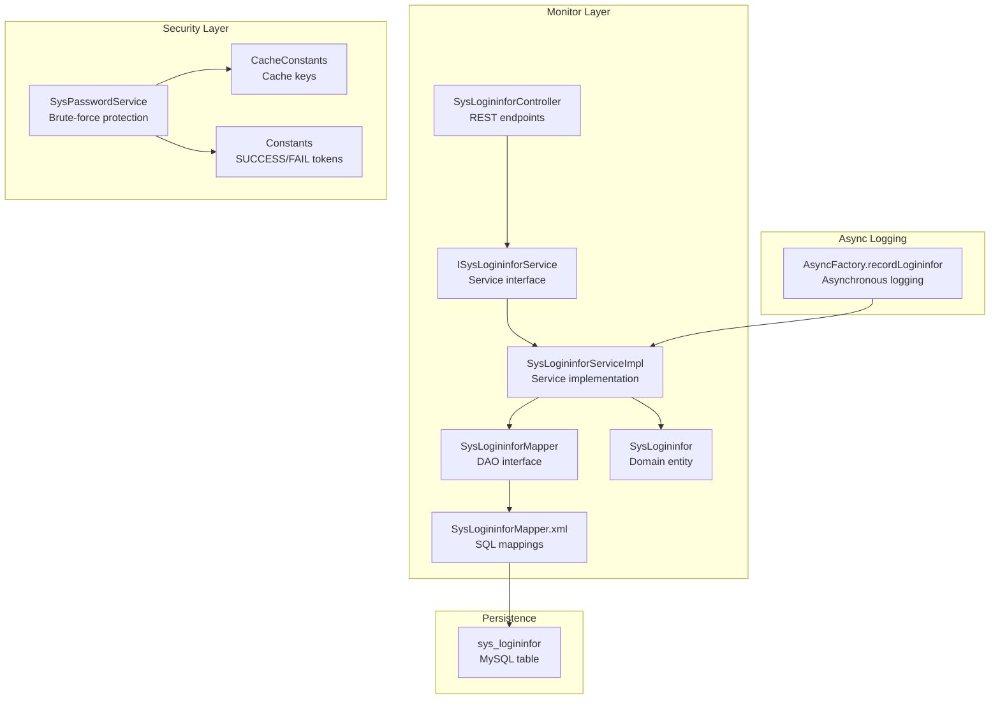
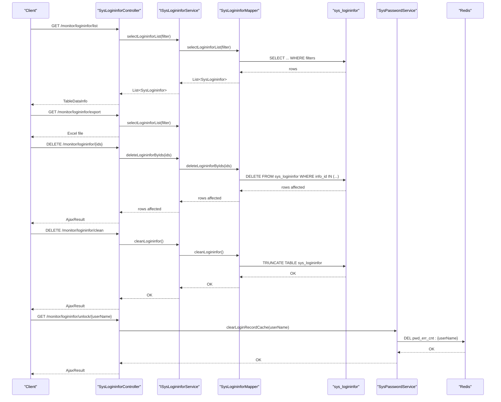
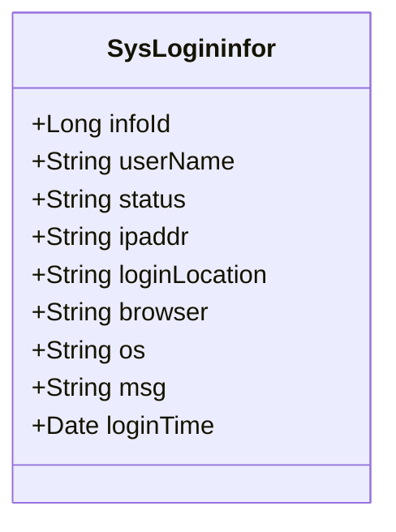
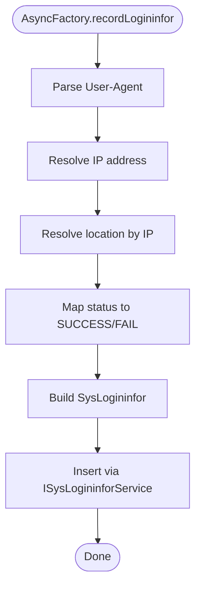
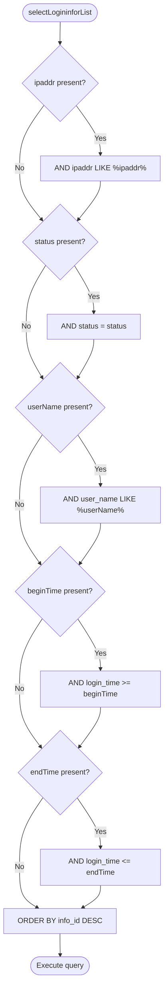
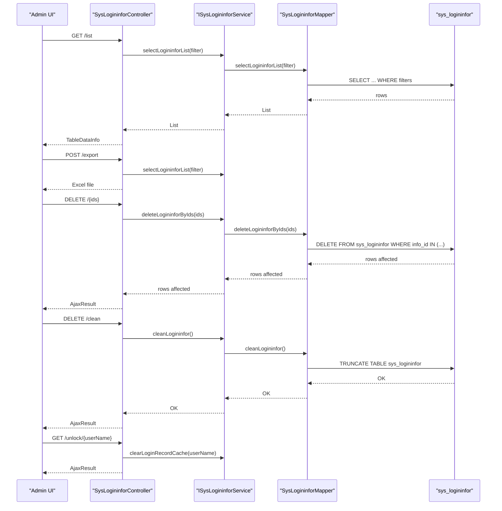
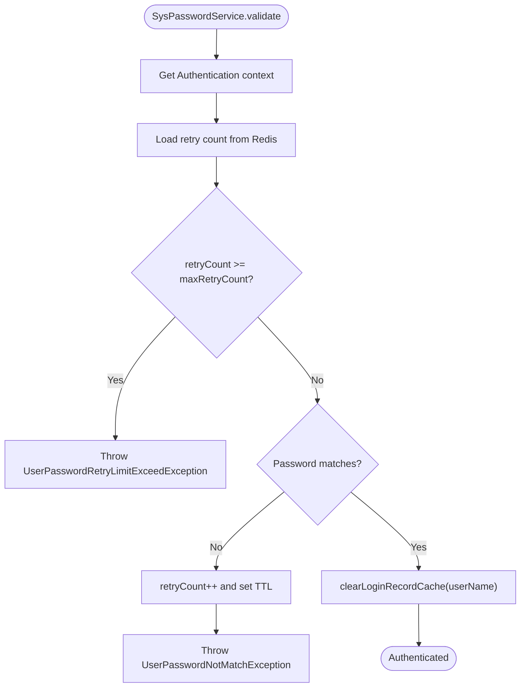
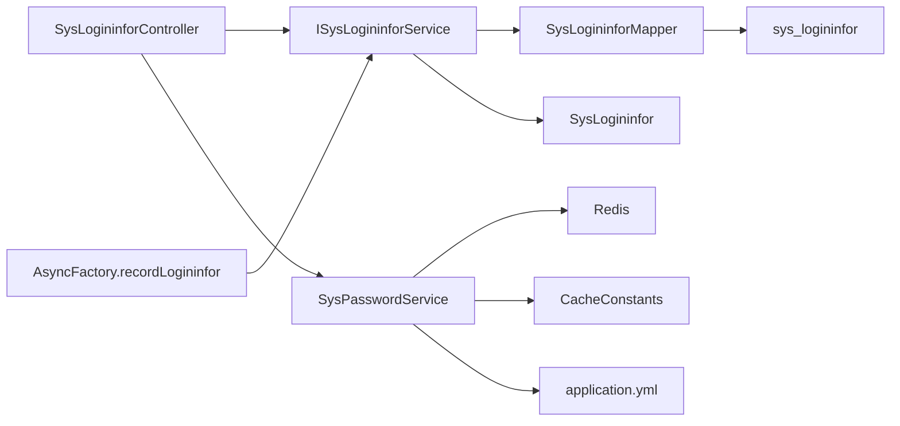

# Login & Security Monitoring

<cite>
**Referenced Files in This Document**
- [SysLogininfor.java](file://src/main/java/com/ruoyi/project/monitor/domain/SysLogininfor.java)
- [SysLogininforMapper.java](file://src/main/java/com/ruoyi/project/monitor/mapper/SysLogininforMapper.java)
- [SysLogininforMapper.xml](file://src/main/resources/mybatis/monitor/SysLogininforMapper.xml)
- [ISysLogininforService.java](file://src/main/java/com/ruoyi/project/monitor/service/ISysLogininforService.java)
- [SysLogininforServiceImpl.java](file://src/main/java/com/ruoyi/project/monitor/service/impl/SysLogininforServiceImpl.java)
- [SysLogininforController.java](file://src/main/java/com/ruoyi/project/monitor/controller/SysLogininforController.java)
- [AsyncFactory.java](file://src/main/java/com/ruoyi/framework/manager/factory/AsyncFactory.java)
- [Constants.java](file://src/main/java/com/ruoyi/common/constant/Constants.java)
- [SysPasswordService.java](file://src/main/java/com/ruoyi/framework/security/service/SysPasswordService.java)
- [CacheConstants.java](file://src/main/java/com/ruoyi/common/constant/CacheConstants.java)
- [application.yml](file://src/main/resources/application.yml)
- [ry_20250522.sql](file://sql/ry_20250522.sql)
</cite>

## Table of Contents
1. [Introduction](#introduction)
2. [Project Structure](#project-structure)
3. [Core Components](#core-components)
4. [Architecture Overview](#architecture-overview)
5. [Detailed Component Analysis](#detailed-component-analysis)
6. [Dependency Analysis](#dependency-analysis)
7. [Performance Considerations](#performance-considerations)
8. [Troubleshooting Guide](#troubleshooting-guide)
9. [Conclusion](#conclusion)
10. [Appendices](#appendices)

## Introduction
This document explains the sys_logininfor table and its associated components in the RuoYi-Vue system. It focuses on how login logs track user access patterns, including successful and failed login attempts, and how this data supports security monitoring, brute-force attack detection, and account lockout mechanisms. It also covers the integration with SysPasswordService for clearing login attempt caches via the /unlock endpoint, and details the query, export, deletion, and cleanup operations exposed by the controller. Filtering examples using the provided XML mapper queries are included, along with guidance on how login logs contribute to overall system security posture and compliance reporting.

## Project Structure
The login monitoring feature spans model, persistence, service, and controller layers, plus asynchronous logging and security integration:

- Domain model: SysLogininfor
- Persistence: SysLogininforMapper interface and SysLogininforMapper.xml
- Service: ISysLogininforService and SysLogininforServiceImpl
- Controller: SysLogininforController
- Asynchronous logging: AsyncFactory.recordLogininfor
- Security integration: SysPasswordService for brute-force protection and cache clearing
- Configuration: application.yml for password retry limits and lock duration
- Database schema: sys_logininfor table creation script

**Diagram sources**
- [SysLogininforController.java](file://src/main/java/com/ruoyi/project/monitor/controller/SysLogininforController.java#L1-L83)
- [ISysLogininforService.java](file://src/main/java/com/ruoyi/project/monitor/service/ISysLogininforService.java#L1-L41)
- [SysLogininforServiceImpl.java](file://src/main/java/com/ruoyi/project/monitor/service/impl/SysLogininforServiceImpl.java#L1-L66)
- [SysLogininforMapper.java](file://src/main/java/com/ruoyi/project/monitor/mapper/SysLogininforMapper.java#L1-L43)
- [SysLogininforMapper.xml](file://src/main/resources/mybatis/monitor/SysLogininforMapper.xml#L1-L57)
- [SysLogininfor.java](file://src/main/java/com/ruoyi/project/monitor/domain/SysLogininfor.java#L1-L144)
- [AsyncFactory.java](file://src/main/java/com/ruoyi/framework/manager/factory/AsyncFactory.java#L20-L81)
- [SysPasswordService.java](file://src/main/java/com/ruoyi/framework/security/service/SysPasswordService.java#L1-L86)
- [CacheConstants.java](file://src/main/java/com/ruoyi/common/constant/CacheConstants.java#L1-L45)
- [Constants.java](file://src/main/java/com/ruoyi/common/constant/Constants.java#L43-L72)
- [ry_20250522.sql](file://sql/ry_20250522.sql#L558-L575)

**Section sources**
- [SysLogininforController.java](file://src/main/java/com/ruoyi/project/monitor/controller/SysLogininforController.java#L1-L83)
- [SysLogininforMapper.xml](file://src/main/resources/mybatis/monitor/SysLogininforMapper.xml#L1-L57)
- [ry_20250522.sql](file://sql/ry_20250522.sql#L558-L575)

## Core Components
- SysLogininfor: The domain entity representing a single login event with fields for user identity, client info, status, message, and timestamp.
- SysLogininforMapper: DAO interface for inserting, querying, deleting, and truncating login records.
- SysLogininforMapper.xml: SQL mappings including dynamic WHERE clauses for filtering by IP, status, user name, and time range.
- ISysLogininforService and SysLogininforServiceImpl: Service layer abstraction and implementation for CRUD operations.
- SysLogininforController: REST endpoints for listing, exporting, deleting, cleaning, and unlocking login attempt caches.
- AsyncFactory.recordLogininfor: Asynchronous logging that captures IP, location, browser, OS, and sets status based on Constants.
- SysPasswordService: Brute-force protection using Redis cache counters and lockout thresholds; integrates with login logs.
- application.yml: Configures password retry limits and lock duration used by SysPasswordService.
- sys_logininfor table: MySQL schema with indexes on status and login_time.

**Section sources**
- [SysLogininfor.java](file://src/main/java/com/ruoyi/project/monitor/domain/SysLogininfor.java#L1-L144)
- [SysLogininforMapper.java](file://src/main/java/com/ruoyi/project/monitor/mapper/SysLogininforMapper.java#L1-L43)
- [SysLogininforMapper.xml](file://src/main/resources/mybatis/monitor/SysLogininforMapper.xml#L1-L57)
- [ISysLogininforService.java](file://src/main/java/com/ruoyi/project/monitor/service/ISysLogininforService.java#L1-L41)
- [SysLogininforServiceImpl.java](file://src/main/java/com/ruoyi/project/monitor/service/impl/SysLogininforServiceImpl.java#L1-L66)
- [SysLogininforController.java](file://src/main/java/com/ruoyi/project/monitor/controller/SysLogininforController.java#L1-L83)
- [AsyncFactory.java](file://src/main/java/com/ruoyi/framework/manager/factory/AsyncFactory.java#L20-L81)
- [SysPasswordService.java](file://src/main/java/com/ruoyi/framework/security/service/SysPasswordService.java#L1-L86)
- [application.yml](file://src/main/resources/application.yml#L41-L47)
- [ry_20250522.sql](file://sql/ry_20250522.sql#L558-L575)

## Architecture Overview
The login monitoring pipeline captures login events asynchronously, persists them, and exposes management operations through a REST controller. Security enforcement occurs during authentication via SysPasswordService, which uses Redis to track failed attempts and enforce lockouts. The /unlock endpoint clears the attempt cache for a given user.

**Diagram sources**
- [SysLogininforController.java](file://src/main/java/com/ruoyi/project/monitor/controller/SysLogininforController.java#L38-L82)
- [ISysLogininforService.java](file://src/main/java/com/ruoyi/project/monitor/service/ISysLogininforService.java#L1-L41)
- [SysLogininforMapper.java](file://src/main/java/com/ruoyi/project/monitor/mapper/SysLogininforMapper.java#L1-L43)
- [SysLogininforMapper.xml](file://src/main/resources/mybatis/monitor/SysLogininforMapper.xml#L24-L56)
- [SysPasswordService.java](file://src/main/java/com/ruoyi/framework/security/service/SysPasswordService.java#L78-L86)
- [CacheConstants.java](file://src/main/java/com/ruoyi/common/constant/CacheConstants.java#L40-L44)

## Detailed Component Analysis

### SysLogininfor Entity
- Purpose: Represents a single login event with fields for user identity, client info, status, message, and timestamp.
- Key fields:
  - user_name: Identifier for the user account
  - ipaddr: Login IP address
  - login_location: Geocoded login location
  - browser: Client browser name
  - os: Client operating system
  - status: Login status (success/failure)
  - msg: Human-readable message
  - login_time: Timestamp of the login event
- Annotations: Excel export mapping and date formatting for display.

**Diagram sources**
- [SysLogininfor.java](file://src/main/java/com/ruoyi/project/monitor/domain/SysLogininfor.java#L1-L144)

**Section sources**
- [SysLogininfor.java](file://src/main/java/com/ruoyi/project/monitor/domain/SysLogininfor.java#L1-L144)

### Asynchronous Login Logging (AsyncFactory.recordLogininfor)
- Captures client IP, location, browser, and OS from the request.
- Determines status based on Constants.LOGIN_SUCCESS, LOGOUT, REGISTER vs LOGIN_FAIL.
- Inserts a SysLogininfor record via the service layer.

**Diagram sources**
- [AsyncFactory.java](file://src/main/java/com/ruoyi/framework/manager/factory/AsyncFactory.java#L20-L81)
- [Constants.java](file://src/main/java/com/ruoyi/common/constant/Constants.java#L43-L72)

**Section sources**
- [AsyncFactory.java](file://src/main/java/com/ruoyi/framework/manager/factory/AsyncFactory.java#L20-L81)
- [Constants.java](file://src/main/java/com/ruoyi/common/constant/Constants.java#L43-L72)

### Persistence Layer (Mapper and XML)
- Insert: Persists a login event with current timestamp.
- Select: Dynamic WHERE clause supports:
  - ipaddr LIKE %value%
  - status = value
  - user_name LIKE %value%
  - login_time >= beginTime
  - login_time <= endTime
- Delete: Batch delete by info_id array.
- Clean: Truncates the table to reset logs.

**Diagram sources**
- [SysLogininforMapper.xml](file://src/main/resources/mybatis/monitor/SysLogininforMapper.xml#L24-L44)

**Section sources**
- [SysLogininforMapper.java](file://src/main/java/com/ruoyi/project/monitor/mapper/SysLogininforMapper.java#L1-L43)
- [SysLogininforMapper.xml](file://src/main/resources/mybatis/monitor/SysLogininforMapper.xml#L1-L57)

### Service Layer
- Delegates to the mapper for insert, select, batch delete, and clean operations.
- Provides a clean separation between business logic and persistence.

**Section sources**
- [ISysLogininforService.java](file://src/main/java/com/ruoyi/project/monitor/service/ISysLogininforService.java#L1-L41)
- [SysLogininforServiceImpl.java](file://src/main/java/com/ruoyi/project/monitor/service/impl/SysLogininforServiceImpl.java#L1-L66)

### Controller Operations
- List: Paginated retrieval of login logs filtered by the criteria in the mapper.
- Export: Exports filtered logs to Excel.
- Remove: Deletes selected login logs by IDs.
- Clean: Truncates the login log table.
- Unlock: Clears the login attempt cache for a user via SysPasswordService.

**Diagram sources**
- [SysLogininforController.java](file://src/main/java/com/ruoyi/project/monitor/controller/SysLogininforController.java#L38-L82)
- [ISysLogininforService.java](file://src/main/java/com/ruoyi/project/monitor/service/ISysLogininforService.java#L1-L41)
- [SysLogininforMapper.xml](file://src/main/resources/mybatis/monitor/SysLogininforMapper.xml#L24-L56)
- [SysPasswordService.java](file://src/main/java/com/ruoyi/framework/security/service/SysPasswordService.java#L78-L86)

**Section sources**
- [SysLogininforController.java](file://src/main/java/com/ruoyi/project/monitor/controller/SysLogininforController.java#L38-L82)

### Security Integration: Brute Force Protection and Account Lockout
- SysPasswordService enforces retry limits and lockout duration using Redis:
  - Tracks failed attempts per user under a cache key derived from CacheConstants.PWD_ERR_CNT_KEY.
  - Throws UserPasswordRetryLimitExceedException when attempts exceed configured maxRetryCount.
  - Clears the attempt cache upon successful authentication.
- The /unlock endpoint calls SysPasswordService.clearLoginRecordCache(userName) to remove the cached failure count for a user.

**Diagram sources**
- [SysPasswordService.java](file://src/main/java/com/ruoyi/framework/security/service/SysPasswordService.java#L44-L86)
- [CacheConstants.java](file://src/main/java/com/ruoyi/common/constant/CacheConstants.java#L40-L44)
- [application.yml](file://src/main/resources/application.yml#L41-L47)

**Section sources**
- [SysPasswordService.java](file://src/main/java/com/ruoyi/framework/security/service/SysPasswordService.java#L1-L86)
- [CacheConstants.java](file://src/main/java/com/ruoyi/common/constant/CacheConstants.java#L1-L45)
- [application.yml](file://src/main/resources/application.yml#L41-L47)

### Database Schema and Indexes
- Table: sys_logininfor with fields for user_name, ipaddr, login_location, browser, os, status, msg, login_time.
- Indexes: status and login_time to optimize filtering and sorting.

**Section sources**
- [ry_20250522.sql](file://sql/ry_20250522.sql#L558-L575)

## Dependency Analysis
- Controller depends on ISysLogininforService and SysPasswordService.
- Service depends on SysLogininforMapper.
- Mapper depends on the sys_logininfor table.
- AsyncFactory depends on Constants and Servlet utilities to build SysLogininfor entries.
- SysPasswordService depends on RedisCache, CacheConstants, and application.yml configuration.

**Diagram sources**
- [SysLogininforController.java](file://src/main/java/com/ruoyi/project/monitor/controller/SysLogininforController.java#L1-L83)
- [ISysLogininforService.java](file://src/main/java/com/ruoyi/project/monitor/service/ISysLogininforService.java#L1-L41)
- [SysLogininforMapper.java](file://src/main/java/com/ruoyi/project/monitor/mapper/SysLogininforMapper.java#L1-L43)
- [AsyncFactory.java](file://src/main/java/com/ruoyi/framework/manager/factory/AsyncFactory.java#L20-L81)
- [SysPasswordService.java](file://src/main/java/com/ruoyi/framework/security/service/SysPasswordService.java#L1-L86)
- [CacheConstants.java](file://src/main/java/com/ruoyi/common/constant/CacheConstants.java#L1-L45)
- [application.yml](file://src/main/resources/application.yml#L41-L47)
- [SysLogininfor.java](file://src/main/java/com/ruoyi/project/monitor/domain/SysLogininfor.java#L1-L144)

**Section sources**
- [SysLogininforController.java](file://src/main/java/com/ruoyi/project/monitor/controller/SysLogininforController.java#L1-L83)
- [SysLogininforMapper.xml](file://src/main/resources/mybatis/monitor/SysLogininforMapper.xml#L1-L57)
- [AsyncFactory.java](file://src/main/java/com/ruoyi/framework/manager/factory/AsyncFactory.java#L20-L81)
- [SysPasswordService.java](file://src/main/java/com/ruoyi/framework/security/service/SysPasswordService.java#L1-L86)

## Performance Considerations
- Indexes: The presence of indexes on status and login_time improves query performance for filtering and sorting.
- Asynchronous logging: Offloads I/O to a background task, reducing latency for login requests.
- Batch operations: DELETE and CLEAN operations reduce round-trips and can be used to manage log volume efficiently.
- Export: Excel export is performed server-side; consider pagination and filtering to avoid large exports.

[No sources needed since this section provides general guidance]

## Troubleshooting Guide
- Logs not appearing:
  - Verify AsyncFactory.recordLogininfor is invoked during login/logout/register flows.
  - Confirm Constants.LOGIN_SUCCESS/LOGIN_FAIL mappings align with your authentication events.
- Export returns empty:
  - Ensure filters (ipaddr, status, user_name, beginTime, endTime) are set appropriately.
- Unlock endpoint has no effect:
  - Confirm Redis connectivity and that CacheConstants.PWD_ERR_CNT_KEY is used consistently.
  - Check application.yml for correct maxRetryCount and lockTime values.
- High CPU usage on queries:
  - Use appropriate filters and avoid broad LIKE patterns on large datasets.
  - Consider partitioning or retention policies for sys_logininfor.

**Section sources**
- [AsyncFactory.java](file://src/main/java/com/ruoyi/framework/manager/factory/AsyncFactory.java#L20-L81)
- [SysLogininforMapper.xml](file://src/main/resources/mybatis/monitor/SysLogininforMapper.xml#L24-L44)
- [SysPasswordService.java](file://src/main/java/com/ruoyi/framework/security/service/SysPasswordService.java#L1-L86)
- [application.yml](file://src/main/resources/application.yml#L41-L47)

## Conclusion
The sys_logininfor table and its components provide a robust foundation for login monitoring and security enforcement. Asynchronous logging ensures minimal impact on login performance, while the mapper’s dynamic filters enable efficient querying. SysPasswordService enforces brute-force protections using Redis-backed counters, and the controller offers practical operations for managing logs and unlocking accounts. Together, these capabilities support security monitoring, incident response, and compliance reporting.

[No sources needed since this section summarizes without analyzing specific files]

## Appendices

### Field Reference and Usage
- user_name: Used for filtering by user identity.
- ipaddr: Used for filtering by IP address.
- login_location: Captured geolocation for audit trails.
- browser/os: Helps identify suspicious clients or anomalies.
- status: Distinguishes success vs failure attempts.
- msg: Human-readable messages for context.
- login_time: Enables time-range filtering and chronological analysis.

**Section sources**
- [SysLogininfor.java](file://src/main/java/com/ruoyi/project/monitor/domain/SysLogininfor.java#L1-L144)
- [SysLogininforMapper.xml](file://src/main/resources/mybatis/monitor/SysLogininforMapper.xml#L24-L44)

### Example Filters Using XML Mapper Queries
- Filter by IP: Set ipaddr in the request; the mapper applies a LIKE condition.
- Filter by status: Set status to "0" for success or "1" for failure.
- Filter by user name: Set user_name to a substring match.
- Filter by time range: Provide beginTime and endTime parameters to constrain login_time.

**Section sources**
- [SysLogininforMapper.xml](file://src/main/resources/mybatis/monitor/SysLogininforMapper.xml#L24-L44)

### Compliance and Reporting
- Maintain retention policies aligned with organizational standards.
- Use export operations to produce periodic reports for auditors.
- Combine login logs with operation logs for comprehensive audit trails.

[No sources needed since this section provides general guidance]