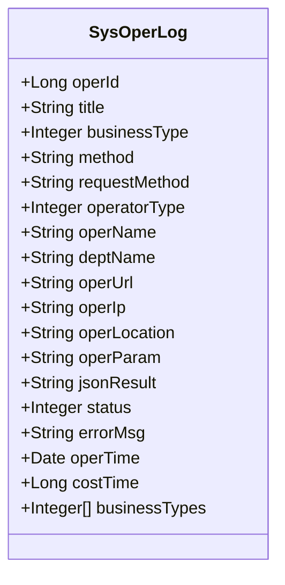
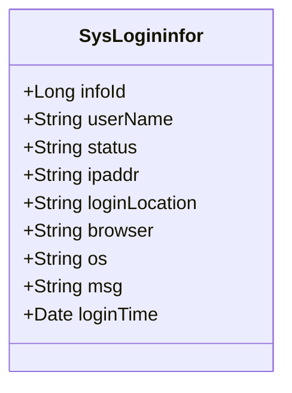
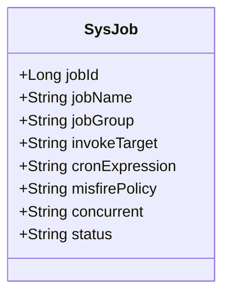
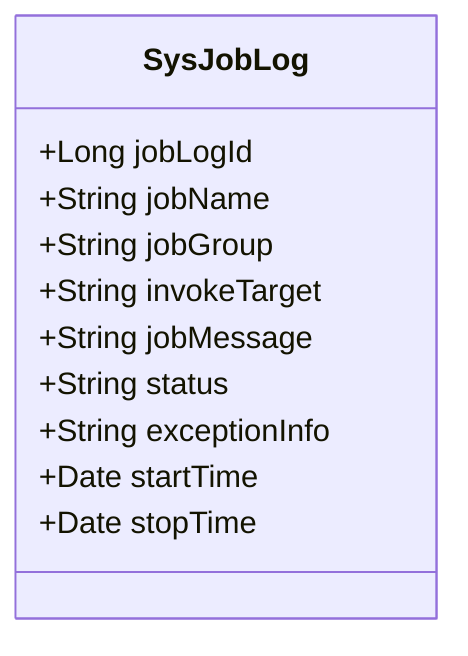
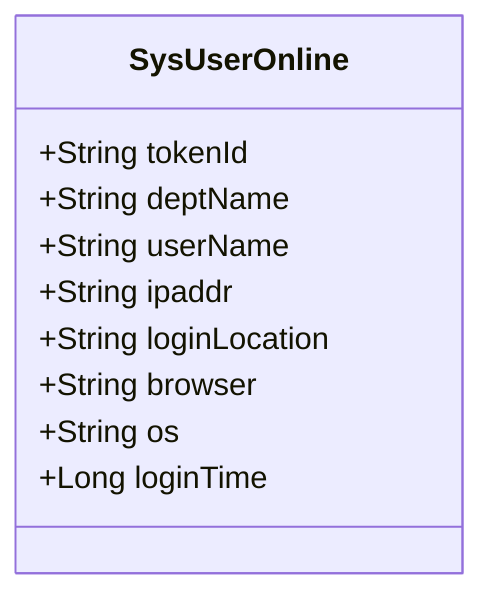
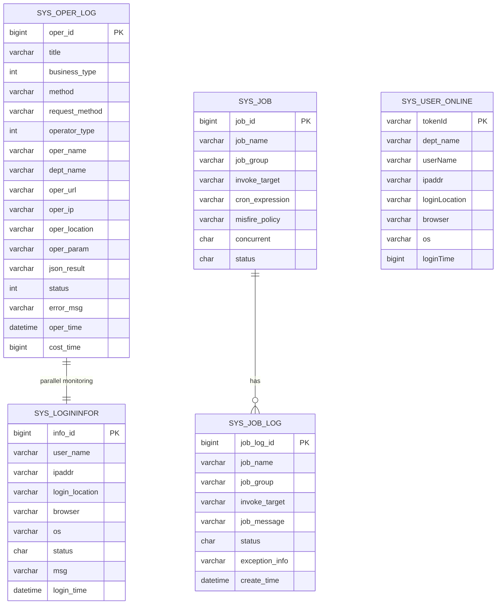

# Monitoring Tables

<cite>
**Referenced Files in This Document**   
- [SysOperLog.java](file://src/main/java/com/ruoyi/project/monitor/domain/SysOperLog.java)
- [SysLogininfor.java](file://src/main/java/com/ruoyi/project/monitor/domain/SysLogininfor.java)
- [SysJob.java](file://src/main/java/com/ruoyi/project/monitor/domain/SysJob.java)
- [SysJobLog.java](file://src/main/java/com/ruoyi/project/monitor/domain/SysJobLog.java)
- [SysUserOnline.java](file://src/main/java/com/ruoyi/project/monitor/domain/SysUserOnline.java)
- [SysOperLogMapper.xml](file://src/main/resources/mybatis/monitor/SysOperLogMapper.xml)
- [SysLogininforMapper.xml](file://src/main/resources/mybatis/monitor/SysLogininforMapper.xml)
- [SysJobMapper.xml](file://src/main/resources/mybatis/monitor/SysJobMapper.xml)
- [SysJobLogMapper.xml](file://src/main/resources/mybatis/monitor/SysJobLogMapper.xml)
- [ry_20250522.sql](file://sql/ry_20250522.sql)
</cite>

## Table of Contents
1. [Introduction](#introduction)
2. [Operation Log Table (sys_oper_log)](#operation-log-table-sys_oper_log)
3. [Login Information Table (sys_logininfor)](#login-information-table-sys_logininfor)
4. [Scheduled Job Table (sys_job)](#scheduled-job-table-sys_job)
5. [Job Execution Log Table (sys_job_log)](#job-execution-log-table-sys_job_log)
6. [Online User Table (sys_user_online)](#online-user-table-sys_user_online)
7. [Relationships and System Integration](#relationships-and-system-integration)
8. [Security and Auditing Capabilities](#security-and-auditing-capabilities)
9. [Performance and Troubleshooting](#performance-and-troubleshooting)
10. [Conclusion](#conclusion)

## Introduction
The RuoYi-Vue system implements a comprehensive monitoring and auditing framework through several key database tables. These tables capture critical system activities, user behaviors, and scheduled task executions, providing essential data for security auditing, performance analysis, and system troubleshooting. This document details the structure, purpose, and integration of the monitoring tables: sys_oper_log, sys_logininfor, sys_job, sys_job_log, and sys_user_online. Each table serves a specific monitoring function within the system, from tracking user operations and login attempts to managing scheduled tasks and monitoring active user sessions. The tables are interconnected through various relationships and are accessed through MyBatis mapper files that define the SQL operations for data persistence and retrieval.

**Section sources**
- [ry_20250522.sql](file://sql/ry_20250522.sql#L416-L442)
- [ry_20250522.sql](file://sql/ry_20250522.sql#L558-L575)
- [ry_20250522.sql](file://sql/ry_20250522.sql#L579-L597)
- [ry_20250522.sql](file://sql/ry_20250522.sql#L604-L618)
- [ry_20250522.sql](file://sql/ry_20250522.sql#L620-L621)

## Operation Log Table (sys_oper_log)
The sys_oper_log table serves as the primary audit trail for all business operations within the RuoYi-Vue system. It captures detailed information about user actions across various modules, providing comprehensive monitoring capabilities for security and compliance purposes. The table records essential details such as the operation module (title), business type (businessType) which categorizes the operation as add, modify, delete, or other actions, and the specific method name (method) that was executed. Each log entry includes the request parameters (operParam) and return parameters (jsonResult), enabling detailed reconstruction of the operation context.

The table also captures performance metrics through the cost_time field, which records the execution duration in milliseconds, allowing for performance analysis and bottleneck identification. Additional metadata includes the operator's name (operName), department (deptName), IP address (operIp), and geographical location (operLocation) derived from the IP. The operation status (status) indicates whether the operation completed successfully or resulted in an error, with detailed error messages stored in the error_msg field when applicable.

**Diagram sources**
- [SysOperLog.java](file://src/main/java/com/ruoyi/project/monitor/domain/SysOperLog.java#L14-L269)

**Section sources**
- [SysOperLog.java](file://src/main/java/com/ruoyi/project/monitor/domain/SysOperLog.java#L14-L269)
- [ry_20250522.sql](file://sql/ry_20250522.sql#L416-L442)
- [SysOperLogMapper.xml](file://src/main/resources/mybatis/monitor/SysOperLogMapper.xml)

## Login Information Table (sys_logininfor)
The sys_logininfor table tracks all user access attempts to the RuoYi-Vue system, serving as a critical component for security monitoring and anomaly detection. It records both successful and failed login attempts, enabling administrators to identify potential security threats such as brute force attacks or unauthorized access attempts. Each record captures the user account (user_name), source IP address (ipaddr), geographical location (login_location), browser type (browser), and operating system (os), providing comprehensive context for each login event.

The table's status field indicates the login outcome (0 for success, 1 for failure), while the msg field contains descriptive messages explaining the result, such as authentication failure reasons. This information is crucial for security auditing, allowing administrators to monitor login patterns, detect suspicious activities, and respond to potential security incidents. The login_time field enables temporal analysis of access patterns, helping to identify unusual login times or locations that may indicate compromised accounts.

**Diagram sources**
- [SysLogininfor.java](file://src/main/java/com/ruoyi/project/monitor/domain/SysLogininfor.java#L14-L143)

**Section sources**
- [SysLogininfor.java](file://src/main/java/com/ruoyi/project/monitor/domain/SysLogininfor.java#L14-L143)
- [ry_20250522.sql](file://sql/ry_20250522.sql#L558-L575)
- [SysLogininforMapper.xml](file://src/main/resources/mybatis/monitor/SysLogininforMapper.xml)

## Scheduled Job Table (sys_job)
The sys_job table manages the configuration and scheduling of background tasks within the RuoYi-Vue system. It serves as the central repository for all scheduled jobs, defining their execution parameters and operational characteristics. Each job is identified by a unique combination of job_id, job_name, and job_group, allowing for organized management of tasks within different functional groups.

The table stores the cron_expression that defines the job's execution schedule using cron syntax, enabling flexible and precise timing control. The invoke_target field contains the method reference that will be executed when the job runs, typically in the format "beanName.methodName(parameters)". This allows for the execution of any Spring-managed bean method as a scheduled task. The concurrent field controls whether multiple instances of the same job can run simultaneously (0 allows, 1 prohibits), preventing potential resource conflicts.

Additional configuration includes the misfire_policy which determines how the system handles missed executions due to system downtime or other interruptions (1=immediate execution, 2=single execution, 3=abandon execution). The job's status field indicates whether it is active (0) or paused (1), providing a simple mechanism for temporarily disabling jobs without deleting their configuration.

**Diagram sources**
- [SysJob.java](file://src/main/java/com/ruoyi/project/monitor/domain/SysJob.java#L21-L170)

**Section sources**
- [SysJob.java](file://src/main/java/com/ruoyi/project/monitor/domain/SysJob.java#L21-L170)
- [ry_20250522.sql](file://sql/ry_20250522.sql#L579-L597)
- [SysJobMapper.xml](file://src/main/resources/mybatis/monitor/SysJobMapper.xml)

## Job Execution Log Table (sys_job_log)
The sys_job_log table provides detailed execution records for scheduled jobs defined in the sys_job table. It serves as an audit trail for background task processing, capturing the outcome and performance of each job execution. Unlike the configuration-focused sys_job table, sys_job_log records actual runtime information, creating a historical record of job executions.

Each log entry includes the job's name (job_name), group (job_group), and invoke_target to identify which job was executed. The job_message field contains descriptive information about the execution, while the status field indicates success (0) or failure (1). In case of failures, the exception_info field stores the complete exception stack trace, enabling detailed troubleshooting of job execution issues.

The table also includes timestamps for execution, allowing for performance analysis of job duration and frequency. This information is critical for monitoring the health of scheduled tasks, identifying jobs that are failing or taking longer than expected, and ensuring that critical background processes are functioning correctly. The relationship between sys_job and sys_job_log is one-to-many, with each job configuration potentially having multiple execution logs.

**Diagram sources**
- [SysJobLog.java](file://src/main/java/com/ruoyi/project/monitor/domain/SysJobLog.java#L14-L155)

**Section sources**
- [SysJobLog.java](file://src/main/java/com/ruoyi/project/monitor/domain/SysJobLog.java#L14-L155)
- [ry_20250522.sql](file://sql/ry_20250522.sql#L604-L618)
- [SysJobLogMapper.xml](file://src/main/resources/mybatis/monitor/SysJobLogMapper.xml)

## Online User Table (sys_user_online)
The sys_user_online table tracks currently active user sessions in the RuoYi-Vue system. Unlike the other monitoring tables which are persisted in the database, this table typically exists in memory (Redis) to provide real-time information about user activity. It serves as the foundation for the system's online user monitoring feature, allowing administrators to view and manage active sessions.

Each record represents an active user session, identified by a unique token (tokenId) that corresponds to the user's authentication token. The table includes user information such as user name (userName) and department (deptName), along with connection details including IP address (ipaddr), geographical location (loginLocation), browser type (browser), and operating system (os). The loginTime field records when the session was established, enabling the calculation of session duration.

This table supports critical security functions such as session management, allowing administrators to forcibly terminate suspicious or inactive sessions. It also provides insights into user engagement patterns and system usage during peak hours. The information in this table is dynamically updated as users log in and out of the system, providing a real-time view of system activity.

**Diagram sources**
- [SysUserOnline.java](file://src/main/java/com/ruoyi/project/monitor/domain/SysUserOnline.java#L8-L113)

**Section sources**
- [SysUserOnline.java](file://src/main/java/com/ruoyi/project/monitor/domain/SysUserOnline.java#L8-L113)

## Relationships and System Integration
The monitoring tables in RuoYi-Vue are interconnected through various relationships that enable comprehensive system monitoring and auditing. The sys_oper_log and sys_logininfor tables share common fields such as user identification, IP address, and location, allowing for correlated analysis of user operations and access patterns. Both tables use similar status codes and message structures, facilitating unified reporting and alerting mechanisms.

The sys_job and sys_job_log tables have a direct parent-child relationship, where each record in sys_job (job configuration) can have multiple corresponding records in sys_job_log (execution history). This relationship enables tracking of job execution over time, performance trend analysis, and troubleshooting of recurring job failures. The job_name and job_group fields serve as the linking keys between these tables.

All monitoring tables integrate with the system's aspect-oriented programming (AOP) framework, which automatically captures operation and login events through annotations such as @Log. The SysOperLogAspect and related components intercept method calls and create log entries without requiring explicit logging code in business methods. This ensures consistent and comprehensive logging across the application.

**Diagram sources**
- [SysOperLog.java](file://src/main/java/com/ruoyi/project/monitor/domain/SysOperLog.java)
- [SysLogininfor.java](file://src/main/java/com/ruoyi/project/monitor/domain/SysLogininfor.java)
- [SysJob.java](file://src/main/java/com/ruoyi/project/monitor/domain/SysJob.java)
- [SysJobLog.java](file://src/main/java/com/ruoyi/project/monitor/domain/SysJobLog.java)
- [SysUserOnline.java](file://src/main/java/com/ruoyi/project/monitor/domain/SysUserOnline.java)

**Section sources**
- [SysOperLog.java](file://src/main/java/com/ruoyi/project/monitor/domain/SysOperLog.java)
- [SysLogininfor.java](file://src/main/java/com/ruoyi/project/monitor/domain/SysLogininfor.java)
- [SysJob.java](file://src/main/java/com/ruoyi/project/monitor/domain/SysJob.java)
- [SysJobLog.java](file://src/main/java/com/ruoyi/project/monitor/domain/SysJobLog.java)
- [SysUserOnline.java](file://src/main/java/com/ruoyi/project/monitor/domain/SysUserOnline.java)

## Security and Auditing Capabilities
The monitoring tables collectively provide robust security and auditing capabilities for the RuoYi-Vue system. The sys_oper_log table enables detailed audit trails of all business operations, supporting compliance with regulatory requirements by recording who performed what action, when, and from where. The inclusion of request parameters and return values allows for complete reconstruction of user activities, which is essential for forensic analysis in case of security incidents.

The sys_logininfor table plays a crucial role in intrusion detection by tracking all login attempts, both successful and failed. This enables the identification of brute force attacks, unauthorized access attempts, and potential account compromises through analysis of failed login patterns. The system can implement account lockout policies based on the data in this table, automatically blocking IP addresses or accounts after a specified number of failed attempts.

The integration of these tables with the system's security framework allows for comprehensive user behavior analysis. By correlating data from operation logs, login records, and online sessions, administrators can detect anomalous behavior such as users accessing the system from unusual locations or at unusual times, or performing operations outside their normal patterns. This proactive monitoring capability enhances the system's overall security posture and enables rapid response to potential threats.

**Section sources**
- [SysOperLog.java](file://src/main/java/com/ruoyi/project/monitor/domain/SysOperLog.java)
- [SysLogininfor.java](file://src/main/java/com/ruoyi/project/monitor/domain/SysLogininfor.java)
- [SysUserOnline.java](file://src/main/java/com/ruoyi/project/monitor/domain/SysUserOnline.java)

## Performance and Troubleshooting
The monitoring tables provide valuable data for performance analysis and system troubleshooting. The sys_oper_log table's cost_time field enables detailed performance monitoring of business operations, allowing administrators to identify slow-performing methods and optimize system performance. By analyzing operation duration trends over time, teams can proactively address performance degradation before it impacts users.

The sys_job_log table is essential for monitoring the health of background processes. By tracking job execution times and success rates, administrators can identify jobs that are failing or taking longer than expected, which may indicate underlying system issues or resource constraints. The exception_info field provides detailed error information for troubleshooting job failures, reducing mean time to resolution.

The combination of operation logs and login information enables comprehensive troubleshooting of user-reported issues. When users report problems, support teams can correlate the reported time with operation logs and login records to reconstruct the exact sequence of events, identify error conditions, and determine the root cause of issues. This integrated approach to monitoring significantly improves the efficiency of incident response and resolution.

**Section sources**
- [SysOperLog.java](file://src/main/java/com/ruoyi/project/monitor/domain/SysOperLog.java)
- [SysJobLog.java](file://src/main/java/com/ruoyi/project/monitor/domain/SysJobLog.java)
- [SysLogininfor.java](file://src/main/java/com/ruoyi/project/monitor/domain/SysLogininfor.java)

## Conclusion
The monitoring tables in RuoYi-Vue form a comprehensive system for tracking, auditing, and analyzing application activities. The sys_oper_log, sys_logininfor, sys_job, sys_job_log, and sys_user_online tables work together to provide complete visibility into system operations, user behavior, and background task execution. These tables support critical functions including security auditing, compliance reporting, performance monitoring, and troubleshooting.

The design of these tables follows best practices for monitoring systems, with appropriate indexing for query performance, comprehensive data capture for audit purposes, and clear relationships between configuration and execution data. The integration with the application's AOP framework ensures consistent and automatic logging without burdening developers with explicit logging code.

Together, these monitoring capabilities enable administrators to maintain system security, ensure operational reliability, and quickly respond to issues, making them essential components of the RuoYi-Vue system's overall architecture.