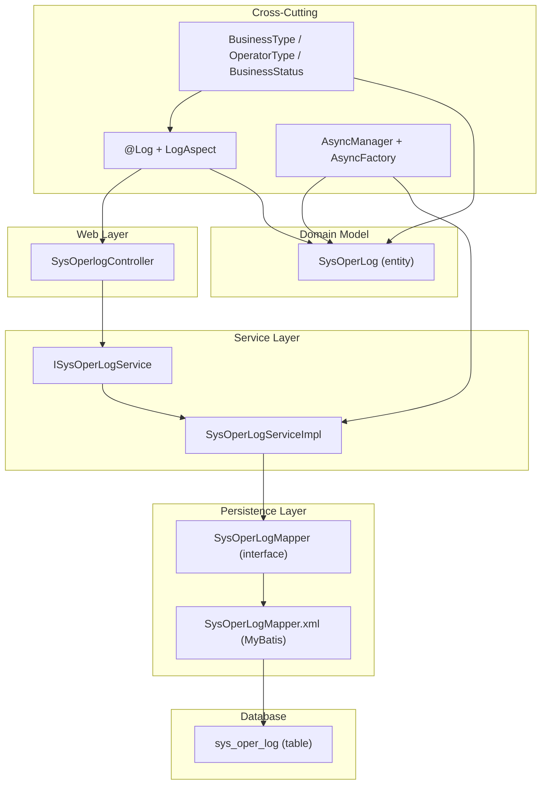
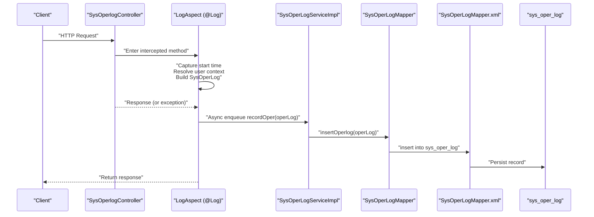
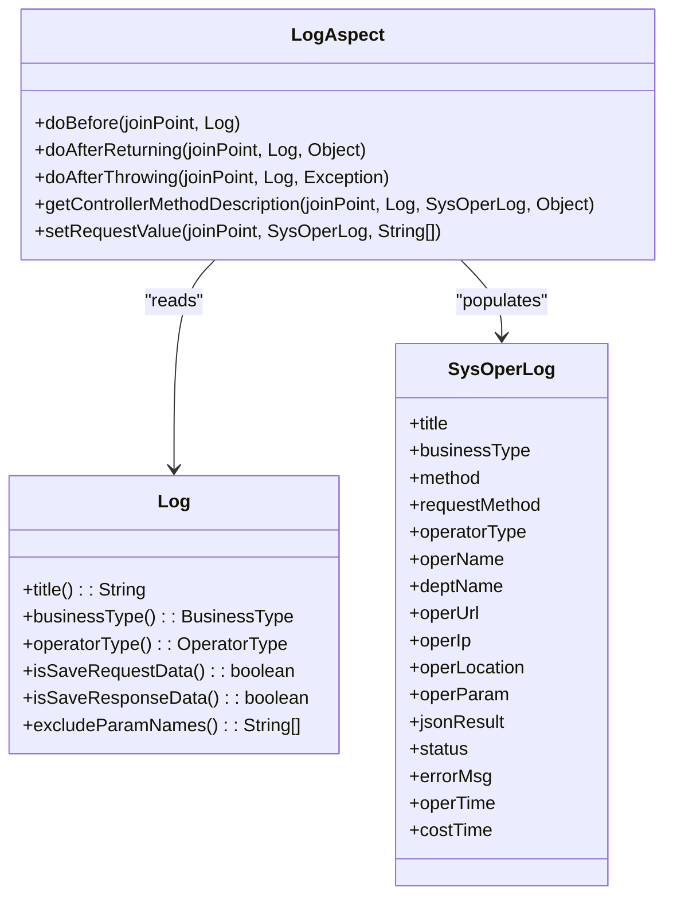
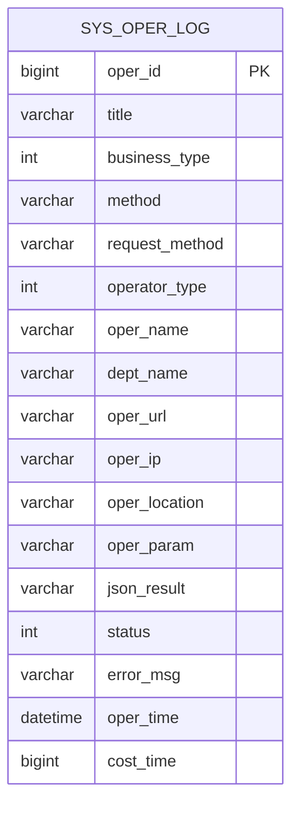
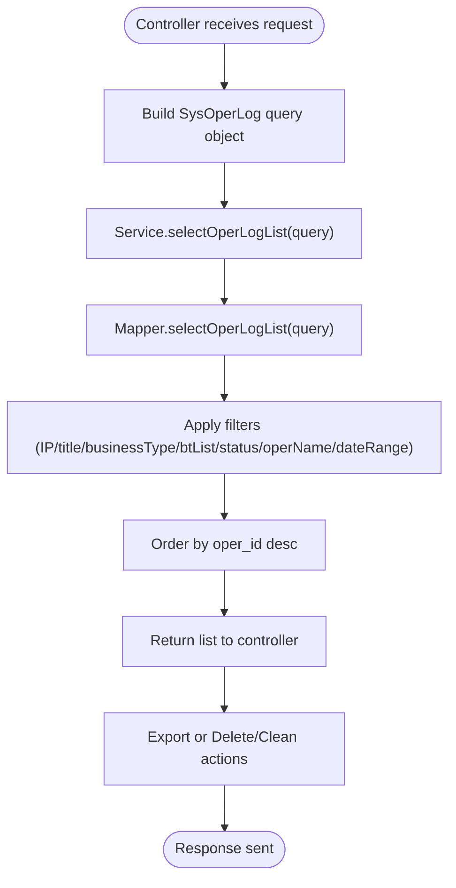
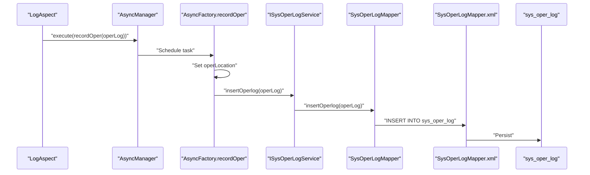
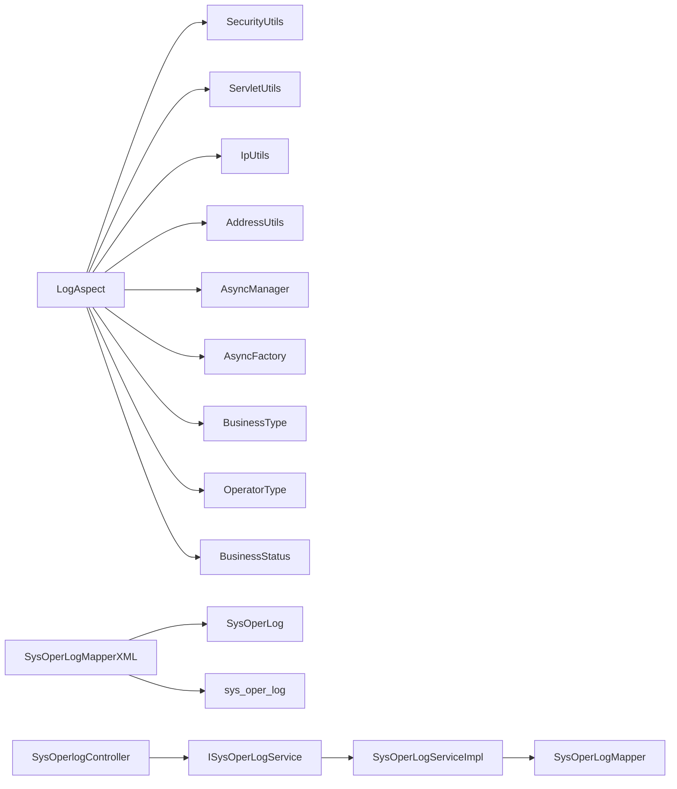

# Operation & Audit Logging

<cite>
**Referenced Files in This Document**
- [Log.java](file://src/main/java/com/ruoyi/framework/aspectj/lang/annotation/Log.java)
- [LogAspect.java](file://src/main/java/com/ruoyi/framework/aspectj/LogAspect.java)
- [SysOperLog.java](file://src/main/java/com/ruoyi/project/monitor/domain/SysOperLog.java)
- [SysOperLogMapper.java](file://src/main/java/com/ruoyi/project/monitor/mapper/SysOperLogMapper.java)
- [SysOperLogMapper.xml](file://src/main/resources/mybatis/monitor/SysOperLogMapper.xml)
- [SysOperlogController.java](file://src/main/java/com/ruoyi/project/monitor/controller/SysOperlogController.java)
- [ISysOperLogService.java](file://src/main/java/com/ruoyi/project/monitor/service/ISysOperLogService.java)
- [SysOperLogServiceImpl.java](file://src/main/java/com/ruoyi/project/monitor/service/impl/SysOperLogServiceImpl.java)
- [BusinessType.java](file://src/main/java/com/ruoyi/framework/aspectj/lang/enums/BusinessType.java)
- [OperatorType.java](file://src/main/java/com/ruoyi/framework/aspectj/lang/enums/OperatorType.java)
- [BusinessStatus.java](file://src/main/java/com/ruoyi/framework/aspectj/lang/enums/BusinessStatus.java)
- [AsyncManager.java](file://src/main/java/com/ruoyi/framework/manager/AsyncManager.java)
- [AsyncFactory.java](file://src/main/java/com/ruoyi/framework/manager/factory/AsyncFactory.java)
- [ry_20250522.sql](file://sql/ry_20250522.sql)
</cite>

## Table of Contents
1. [Introduction](#introduction)
2. [Project Structure](#project-structure)
3. [Core Components](#core-components)
4. [Architecture Overview](#architecture-overview)
5. [Detailed Component Analysis](#detailed-component-analysis)
6. [Dependency Analysis](#dependency-analysis)
7. [Performance Considerations](#performance-considerations)
8. [Troubleshooting Guide](#troubleshooting-guide)
9. [Conclusion](#conclusion)
10. [Appendices](#appendices)

## Introduction
This document explains the operation logging subsystem in the RuoYi-Vue system, focusing on the sys_oper_log table and its integrated components. It covers how operation logs capture business activities (module title, business type, method name, request method, operator type, user context, IP, location, request parameters, response results, status, error messages, and execution time), how the @Log annotation and LogAspect AOP interceptor collaborate with the SysOperLog entity, and how the data flows from controller invocation to persistence via MyBatis mapper. It also describes how logs support auditing, debugging, and compliance, and outlines available operations such as querying, exporting, deleting, and cleaning logs.

## Project Structure
The operation logging feature spans several layers:
- Annotation and AOP: @Log and LogAspect define cross-cutting logging behavior around controller methods.
- Domain model: SysOperLog represents the sys_oper_log table schema.
- Persistence: Mapper interface and XML define CRUD and query operations.
- Service: ISysOperLogService and SysOperLogServiceImpl orchestrate persistence.
- Controller: SysOperlogController exposes REST endpoints for listing, exporting, deleting, and cleaning logs.
- Enums: BusinessType, OperatorType, and BusinessStatus define categorical values used in logs.
- Database: sys_oper_log table schema and indexes are defined in the SQL script.

**Diagram sources**
- [SysOperlogController.java](file://src/main/java/com/ruoyi/project/monitor/controller/SysOperlogController.java#L1-L70)
- [ISysOperLogService.java](file://src/main/java/com/ruoyi/project/monitor/service/ISysOperLogService.java#L1-L49)
- [SysOperLogServiceImpl.java](file://src/main/java/com/ruoyi/project/monitor/service/impl/SysOperLogServiceImpl.java#L1-L77)
- [SysOperLogMapper.java](file://src/main/java/com/ruoyi/project/monitor/mapper/SysOperLogMapper.java#L1-L49)
- [SysOperLogMapper.xml](file://src/main/resources/mybatis/monitor/SysOperLogMapper.xml#L1-L87)
- [SysOperLog.java](file://src/main/java/com/ruoyi/project/monitor/domain/SysOperLog.java#L1-L270)
- [Log.java](file://src/main/java/com/ruoyi/framework/aspectj/lang/annotation/Log.java#L1-L52)
- [LogAspect.java](file://src/main/java/com/ruoyi/framework/aspectj/LogAspect.java#L1-L265)
- [BusinessType.java](file://src/main/java/com/ruoyi/framework/aspectj/lang/enums/BusinessType.java#L1-L60)
- [OperatorType.java](file://src/main/java/com/ruoyi/framework/aspectj/lang/enums/OperatorType.java#L1-L25)
- [BusinessStatus.java](file://src/main/java/com/ruoyi/framework/aspectj/lang/enums/BusinessStatus.java#L1-L21)
- [AsyncManager.java](file://src/main/java/com/ruoyi/framework/manager/AsyncManager.java#L1-L56)
- [AsyncFactory.java](file://src/main/java/com/ruoyi/framework/manager/factory/AsyncFactory.java#L1-L103)
- [ry_20250522.sql](file://sql/ry_20250522.sql#L416-L442)

**Section sources**
- [Log.java](file://src/main/java/com/ruoyi/framework/aspectj/lang/annotation/Log.java#L1-L52)
- [LogAspect.java](file://src/main/java/com/ruoyi/framework/aspectj/LogAspect.java#L1-L265)
- [SysOperLog.java](file://src/main/java/com/ruoyi/project/monitor/domain/SysOperLog.java#L1-L270)
- [SysOperLogMapper.java](file://src/main/java/com/ruoyi/project/monitor/mapper/SysOperLogMapper.java#L1-L49)
- [SysOperLogMapper.xml](file://src/main/resources/mybatis/monitor/SysOperLogMapper.xml#L1-L87)
- [SysOperlogController.java](file://src/main/java/com/ruoyi/project/monitor/controller/SysOperlogController.java#L1-L70)
- [ISysOperLogService.java](file://src/main/java/com/ruoyi/project/monitor/service/ISysOperLogService.java#L1-L49)
- [SysOperLogServiceImpl.java](file://src/main/java/com/ruoyi/project/monitor/service/impl/SysOperLogServiceImpl.java#L1-L77)
- [BusinessType.java](file://src/main/java/com/ruoyi/framework/aspectj/lang/enums/BusinessType.java#L1-L60)
- [OperatorType.java](file://src/main/java/com/ruoyi/framework/aspectj/lang/enums/OperatorType.java#L1-L25)
- [BusinessStatus.java](file://src/main/java/com/ruoyi/framework/aspectj/lang/enums/BusinessStatus.java#L1-L21)
- [AsyncManager.java](file://src/main/java/com/ruoyi/framework/manager/AsyncManager.java#L1-L56)
- [AsyncFactory.java](file://src/main/java/com/ruoyi/framework/manager/factory/AsyncFactory.java#L1-L103)
- [ry_20250522.sql](file://sql/ry_20250522.sql#L416-L442)

## Core Components
- @Log annotation: Declares logging metadata for controller methods, including module title, business type, operator type, and toggles for saving request/response data and excluding parameter names.
- LogAspect AOP: Intercepts controller invocations, extracts user context, captures request/response, computes execution time, and enqueues asynchronous persistence of SysOperLog records.
- SysOperLog entity: Mirrors sys_oper_log table fields and provides getters/setters for audit fields.
- Mapper and XML: Define insert, select list with filters, select by ID, delete by IDs, and truncate/clean operations.
- Service and Controller: Provide REST endpoints for listing, exporting, deleting, and cleaning logs, delegating to the mapper via service.

Key fields captured in logs:
- title, business_type, method, request_method, operator_type, oper_name, dept_name, oper_url, oper_ip, oper_location, oper_param, json_result, status, error_msg, oper_time, cost_time.

**Section sources**
- [Log.java](file://src/main/java/com/ruoyi/framework/aspectj/lang/annotation/Log.java#L1-L52)
- [LogAspect.java](file://src/main/java/com/ruoyi/framework/aspectj/LogAspect.java#L1-L265)
- [SysOperLog.java](file://src/main/java/com/ruoyi/project/monitor/domain/SysOperLog.java#L1-L270)
- [SysOperLogMapper.xml](file://src/main/resources/mybatis/monitor/SysOperLogMapper.xml#L1-L87)
- [SysOperlogController.java](file://src/main/java/com/ruoyi/project/monitor/controller/SysOperlogController.java#L1-L70)

## Architecture Overview
The logging pipeline integrates annotation-driven AOP with asynchronous persistence:

**Diagram sources**
- [SysOperlogController.java](file://src/main/java/com/ruoyi/project/monitor/controller/SysOperlogController.java#L1-L70)
- [LogAspect.java](file://src/main/java/com/ruoyi/framework/aspectj/LogAspect.java#L1-L265)
- [AsyncFactory.java](file://src/main/java/com/ruoyi/framework/manager/factory/AsyncFactory.java#L1-L103)
- [SysOperLogMapper.xml](file://src/main/resources/mybatis/monitor/SysOperLogMapper.xml#L1-L87)
- [ry_20250522.sql](file://sql/ry_20250522.sql#L416-L442)

## Detailed Component Analysis

### @Log Annotation and LogAspect Integration
- @Log defines:
  - title: Module title for the logged action.
  - businessType: Enum BusinessType indicating operation category.
  - operatorType: Enum OperatorType indicating who performed the action.
  - isSaveRequestData: Whether to capture request parameters.
  - isSaveResponseData: Whether to capture response payload.
  - excludeParamNames: Parameter names to exclude from request capture.
- LogAspect intercepts methods annotated with @Log:
  - Records start time in a thread-local to compute cost time.
  - Resolves current user context (username and department) and IP.
  - Builds SysOperLog with method signature, request URL, method, request method, status, error message (if thrown), request parameters, response JSON, and cost time.
  - Enqueues asynchronous persistence via AsyncManager and AsyncFactory.

**Diagram sources**
- [Log.java](file://src/main/java/com/ruoyi/framework/aspectj/lang/annotation/Log.java#L1-L52)
- [LogAspect.java](file://src/main/java/com/ruoyi/framework/aspectj/LogAspect.java#L1-L265)
- [SysOperLog.java](file://src/main/java/com/ruoyi/project/monitor/domain/SysOperLog.java#L1-L270)

**Section sources**
- [Log.java](file://src/main/java/com/ruoyi/framework/aspectj/lang/annotation/Log.java#L1-L52)
- [LogAspect.java](file://src/main/java/com/ruoyi/framework/aspectj/LogAspect.java#L1-L265)
- [BusinessType.java](file://src/main/java/com/ruoyi/framework/aspectj/lang/enums/BusinessType.java#L1-L60)
- [OperatorType.java](file://src/main/java/com/ruoyi/framework/aspectj/lang/enums/OperatorType.java#L1-L25)
- [BusinessStatus.java](file://src/main/java/com/ruoyi/framework/aspectj/lang/enums/BusinessStatus.java#L1-L21)

### SysOperLog Entity and Table Schema
- Entity fields align with sys_oper_log columns:
  - oper_id, title, business_type, method, request_method, operator_type, oper_name, dept_name, oper_url, oper_ip, oper_location, oper_param, json_result, status, error_msg, oper_time, cost_time.
- Indexes on business_type, status, and oper_time support efficient filtering and sorting.

**Diagram sources**
- [ry_20250522.sql](file://sql/ry_20250522.sql#L416-L442)

**Section sources**
- [SysOperLog.java](file://src/main/java/com/ruoyi/project/monitor/domain/SysOperLog.java#L1-L270)
- [ry_20250522.sql](file://sql/ry_20250522.sql#L416-L442)

### Data Flow: Controller to Persistence
- Controller endpoints:
  - GET /monitor/operlog/list: Paginated list using TableDataInfo.
  - POST /monitor/operlog/export: Export filtered logs to Excel.
  - DELETE /monitor/operlog/{operIds}: Delete selected logs.
  - DELETE /monitor/operlog/clean: Clean/truncate all logs.
- Service delegates to Mapper; Mapper XML persists via insert and supports filtering via selectOperLogList with conditions on IP, title, businessType, businessTypes, status, operName, and date range via params.beginTime/params.endTime.

**Diagram sources**
- [SysOperlogController.java](file://src/main/java/com/ruoyi/project/monitor/controller/SysOperlogController.java#L1-L70)
- [ISysOperLogService.java](file://src/main/java/com/ruoyi/project/monitor/service/ISysOperLogService.java#L1-L49)
- [SysOperLogServiceImpl.java](file://src/main/java/com/ruoyi/project/monitor/service/impl/SysOperLogServiceImpl.java#L1-L77)
- [SysOperLogMapper.xml](file://src/main/resources/mybatis/monitor/SysOperLogMapper.xml#L1-L87)

**Section sources**
- [SysOperlogController.java](file://src/main/java/com/ruoyi/project/monitor/controller/SysOperlogController.java#L1-L70)
- [SysOperLogMapper.xml](file://src/main/resources/mybatis/monitor/SysOperLogMapper.xml#L1-L87)

### Asynchronous Persistence
- LogAspect enqueues a TimerTask via AsyncManager.execute to persist logs asynchronously.
- AsyncFactory.recordOper sets operLocation using IP geolocation and delegates to ISysOperLogService.insertOperlog.

**Diagram sources**
- [LogAspect.java](file://src/main/java/com/ruoyi/framework/aspectj/LogAspect.java#L1-L265)
- [AsyncManager.java](file://src/main/java/com/ruoyi/framework/manager/AsyncManager.java#L1-L56)
- [AsyncFactory.java](file://src/main/java/com/ruoyi/framework/manager/factory/AsyncFactory.java#L1-L103)
- [SysOperLogMapper.xml](file://src/main/resources/mybatis/monitor/SysOperLogMapper.xml#L1-L87)
- [ry_20250522.sql](file://sql/ry_20250522.sql#L416-L442)

**Section sources**
- [AsyncManager.java](file://src/main/java/com/ruoyi/framework/manager/AsyncManager.java#L1-L56)
- [AsyncFactory.java](file://src/main/java/com/ruoyi/framework/manager/factory/AsyncFactory.java#L1-L103)
- [LogAspect.java](file://src/main/java/com/ruoyi/framework/aspectj/LogAspect.java#L1-L265)

### Field Reference and Use Cases
- title: Module title from @Log.title().
- business_type: Ordinal of BusinessType (e.g., OTHER, INSERT, UPDATE, DELETE, GRANT, EXPORT, IMPORT, FORCE, GENCODE, CLEAN).
- method: Fully qualified method signature captured from joinpoint target and signature.
- request_method: HTTP method from the request.
- operator_type: Ordinal of OperatorType (OTHER, MANAGE, MOBILE).
- oper_name: Current username from SecurityUtils.getLoginUser().
- dept_name: Department name from the current user’s department.
- oper_url: Request URI (limited length).
- oper_ip: Client IP address.
- oper_location: Resolved location via AddressUtils (asynchronous).
- oper_param: Serialized request parameters; sensitive fields excluded; multipart/form-data bodies captured from request body when applicable.
- json_result: Serialized response payload (limited length).
- status: 0 for SUCCESS, 1 for FAIL (BusinessStatus).
- error_msg: Exception message captured when exceptions occur.
- oper_time: sysdate() at insert time.
- cost_time: Milliseconds elapsed since before advice.

These fields enable:
- Auditing: Track who did what, when, and where.
- Debugging: Inspect request/response payloads and errors.
- Compliance: Retain immutable records with timestamps and locations.

**Section sources**
- [LogAspect.java](file://src/main/java/com/ruoyi/framework/aspectj/LogAspect.java#L1-L265)
- [SysOperLog.java](file://src/main/java/com/ruoyi/project/monitor/domain/SysOperLog.java#L1-L270)
- [BusinessType.java](file://src/main/java/com/ruoyi/framework/aspectj/lang/enums/BusinessType.java#L1-L60)
- [OperatorType.java](file://src/main/java/com/ruoyi/framework/aspectj/lang/enums/OperatorType.java#L1-L25)
- [BusinessStatus.java](file://src/main/java/com/ruoyi/framework/aspectj/lang/enums/BusinessStatus.java#L1-L21)

### Querying Logs by Filters
The MyBatis query supports:
- Filtering by IP, title, businessType, businessTypes (IN), status, operName.
- Date range via params.beginTime and params.endTime.
- Sorting by oper_id descending.

Example usage patterns:
- Query logs by date range: pass params.beginTime and params.endTime.
- Filter by user: pass operName.
- Filter by business type: pass businessType or businessTypes array.

**Section sources**
- [SysOperLogMapper.xml](file://src/main/resources/mybatis/monitor/SysOperLogMapper.xml#L1-L87)

### Export, Deletion, and Cleanup Operations
- Export: POST /monitor/operlog/export returns an Excel file containing filtered logs.
- Delete: DELETE /monitor/operlog/{operIds} removes selected logs by ID.
- Clean: DELETE /monitor/operlog/clean truncates the sys_oper_log table.

These operations are secured via @PreAuthorize permissions and delegate to the service layer.

**Section sources**
- [SysOperlogController.java](file://src/main/java/com/ruoyi/project/monitor/controller/SysOperlogController.java#L1-L70)
- [SysOperLogMapper.xml](file://src/main/resources/mybatis/monitor/SysOperLogMapper.xml#L1-L87)

## Dependency Analysis
- LogAspect depends on:
  - SecurityUtils for user context.
  - ServletUtils for request and parameter extraction.
  - IpUtils and AddressUtils for IP and location resolution.
  - AsyncManager and AsyncFactory for asynchronous persistence.
  - Enums BusinessType, OperatorType, BusinessStatus for categorical values.
- SysOperLogMapper.xml maps fields to sys_oper_log and applies dynamic WHERE clauses for filtering.
- SysOperlogController depends on ISysOperLogService for business operations and uses @Log for export/remove/clean actions.

**Diagram sources**
- [LogAspect.java](file://src/main/java/com/ruoyi/framework/aspectj/LogAspect.java#L1-L265)
- [SysOperLogMapper.xml](file://src/main/resources/mybatis/monitor/SysOperLogMapper.xml#L1-L87)
- [SysOperlogController.java](file://src/main/java/com/ruoyi/project/monitor/controller/SysOperlogController.java#L1-L70)
- [ISysOperLogService.java](file://src/main/java/com/ruoyi/project/monitor/service/ISysOperLogService.java#L1-L49)
- [SysOperLogServiceImpl.java](file://src/main/java/com/ruoyi/project/monitor/service/impl/SysOperLogServiceImpl.java#L1-L77)

**Section sources**
- [LogAspect.java](file://src/main/java/com/ruoyi/framework/aspectj/LogAspect.java#L1-L265)
- [SysOperLogMapper.xml](file://src/main/resources/mybatis/monitor/SysOperLogMapper.xml#L1-L87)
- [SysOperlogController.java](file://src/main/java/com/ruoyi/project/monitor/controller/SysOperlogController.java#L1-L70)

## Performance Considerations
- Asynchronous persistence: Uses scheduled executor to delay insertion slightly, reducing request latency and offloading DB writes.
- Parameter limits: Request and response payloads are truncated to prevent oversized logs and reduce storage overhead.
- Sensitive data exclusion: Password-related fields are excluded from request capture.
- Indexes: business_type, status, oper_time indexes improve query performance for common filters.
- Cost time calculation: ThreadLocal ensures minimal overhead for timing.

[No sources needed since this section provides general guidance]

## Troubleshooting Guide
Common issues and resolutions:
- Missing user context: Ensure SecurityUtils.getLoginUser() returns a valid LoginUser; otherwise oper_name and dept_name may be empty.
- Large request/response payloads: Logs are truncated; adjust client payloads or review truncation thresholds if necessary.
- IP/location not populated: oper_location is set asynchronously; ensure AsyncFactory and AddressUtils are configured and network access allows geolocation lookups.
- Export failures: Verify ExcelUtil usage and permissions; ensure filtered list is not excessively large.
- Clean vs delete: clean truncates the table; delete removes selected records by ID.

**Section sources**
- [LogAspect.java](file://src/main/java/com/ruoyi/framework/aspectj/LogAspect.java#L1-L265)
- [AsyncFactory.java](file://src/main/java/com/ruoyi/framework/manager/factory/AsyncFactory.java#L1-L103)
- [SysOperLogMapper.xml](file://src/main/resources/mybatis/monitor/SysOperLogMapper.xml#L1-L87)

## Conclusion
The RuoYi-Vue operation logging subsystem provides comprehensive auditability by capturing rich contextual information around controller actions. The @Log annotation and LogAspect AOP interceptor automatically gather method, user, IP, location, request/response payloads, and execution time, while asynchronous persistence ensures low-latency request handling. The MyBatis mapper and XML queries enable flexible filtering and reporting, and the controller exposes standard operations for exporting, deleting, and cleaning logs. Together, these components support auditing, debugging, and compliance requirements.

[No sources needed since this section summarizes without analyzing specific files]

## Appendices

### Appendix A: Example Queries and Filters
- By date range: params.beginTime and params.endTime.
- By user: operName.
- By business type: businessType or businessTypes array.
- By status: status.
- By IP: operIp.
- By title: title.

**Section sources**
- [SysOperLogMapper.xml](file://src/main/resources/mybatis/monitor/SysOperLogMapper.xml#L1-L87)