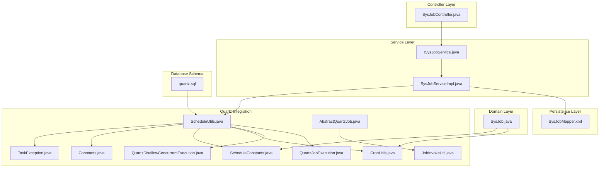
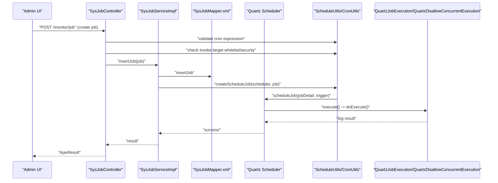
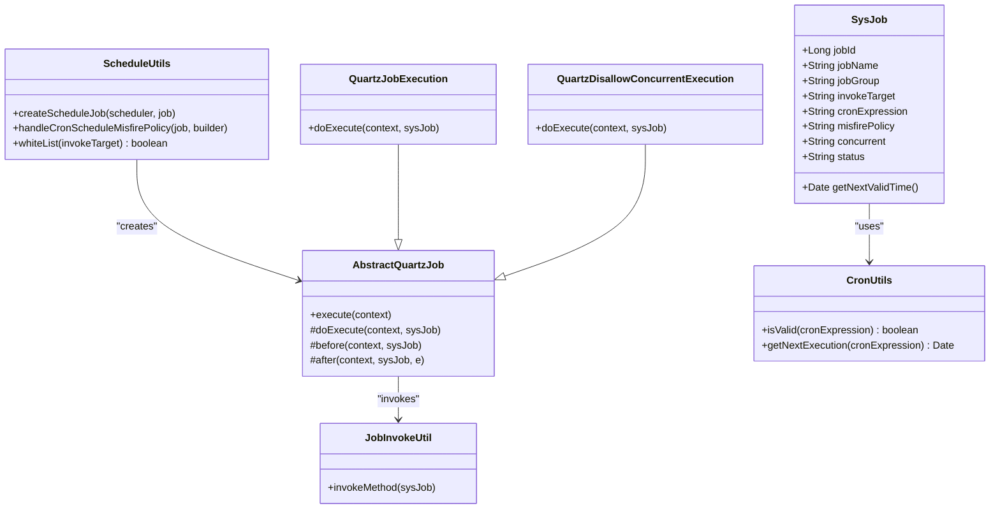
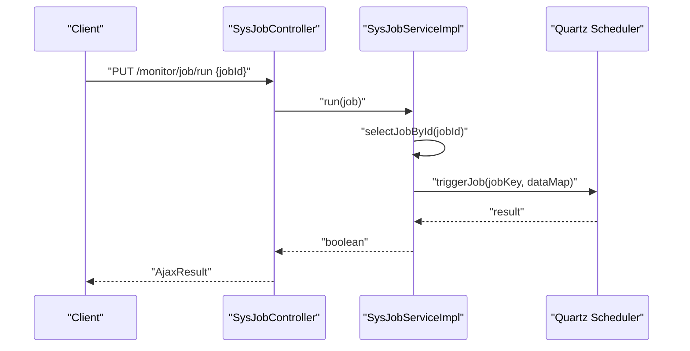
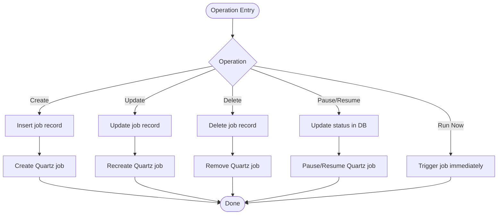
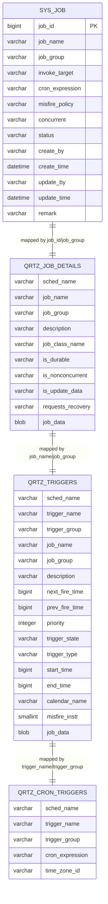
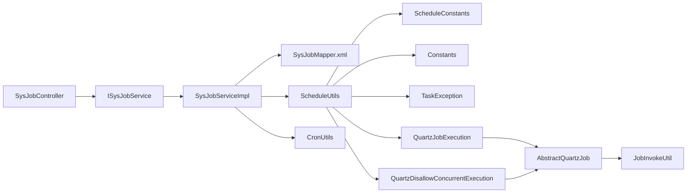

# Scheduled Task Management

<cite>
**Referenced Files in This Document**
- [SysJob.java](file://src/main/java/com/ruoyi/project/monitor/domain/SysJob.java)
- [SysJobController.java](file://src/main/java/com/ruoyi/project/monitor/controller/SysJobController.java)
- [ISysJobService.java](file://src/main/java/com/ruoyi/project/monitor/service/ISysJobService.java)
- [SysJobServiceImpl.java](file://src/main/java/com/ruoyi/project/monitor/service/impl/SysJobServiceImpl.java)
- [SysJobMapper.xml](file://src/main/resources/mybatis/system/SysJobMapper.xml)
- [ScheduleUtils.java](file://src/main/java/com/ruoyi/common/utils/job/ScheduleUtils.java)
- [CronUtils.java](file://src/main/java/com/ruoyi/common/utils/job/CronUtils.java)
- [QuartzJobExecution.java](file://src/main/java/com/ruoyi/common/utils/job/QuartzJobExecution.java)
- [QuartzDisallowConcurrentExecution.java](file://src/main/java/com/ruoyi/common/utils/job/QuartzDisallowConcurrentExecution.java)
- [AbstractQuartzJob.java](file://src/main/java/com/ruoyi/common/utils/job/AbstractQuartzJob.java)
- [JobInvokeUtil.java](file://src/main/java/com/ruoyi/common/utils/job/JobInvokeUtil.java)
- [ScheduleConstants.java](file://src/main/java/com/ruoyi/common/constant/ScheduleConstants.java)
- [Constants.java](file://src/main/java/com/ruoyi/common/constant/Constants.java)
- [TaskException.java](file://src/main/java/com/ruoyi/common/exception/job/TaskException.java)
- [quartz.sql](file://sql/quartz.sql)
</cite>

## Table of Contents
1. [Introduction](#introduction)
2. [Project Structure](#project-structure)
3. [Core Components](#core-components)
4. [Architecture Overview](#architecture-overview)
5. [Detailed Component Analysis](#detailed-component-analysis)
6. [Dependency Analysis](#dependency-analysis)
7. [Performance Considerations](#performance-considerations)
8. [Troubleshooting Guide](#troubleshooting-guide)
9. [Conclusion](#conclusion)
10. [Appendices](#appendices)

## Introduction
This document explains the scheduled task management subsystem centered around the sys_job table in the RuoYi-Vue system. It covers how cron expressions, job groups, invocation targets, and execution policies are configured and enforced, how jobs are created, modified, paused/resumed, deleted, and immediately executed, and how the system integrates with the Quartz scheduler. It also documents validation rules, security restrictions, and the controller endpoints used to manage jobs.

## Project Structure
The scheduled task feature spans domain, persistence, service, controller, and Quartz integration layers, plus Quartz schema definitions.

**Diagram sources**
- [SysJob.java](file://src/main/java/com/ruoyi/project/monitor/domain/SysJob.java#L1-L171)
- [SysJobController.java](file://src/main/java/com/ruoyi/project/monitor/controller/SysJobController.java#L1-L186)
- [ISysJobService.java](file://src/main/java/com/ruoyi/project/monitor/service/ISysJobService.java#L1-L102)
- [SysJobServiceImpl.java](file://src/main/java/com/ruoyi/project/monitor/service/impl/SysJobServiceImpl.java#L1-L261)
- [SysJobMapper.xml](file://src/main/resources/mybatis/system/SysJobMapper.xml#L1-L111)
- [ScheduleUtils.java](file://src/main/java/com/ruoyi/common/utils/job/ScheduleUtils.java#L1-L142)
- [CronUtils.java](file://src/main/java/com/ruoyi/common/utils/job/CronUtils.java#L1-L64)
- [QuartzJobExecution.java](file://src/main/java/com/ruoyi/common/utils/job/QuartzJobExecution.java#L1-L20)
- [QuartzDisallowConcurrentExecution.java](file://src/main/java/com/ruoyi/common/utils/job/QuartzDisallowConcurrentExecution.java#L1-L22)
- [AbstractQuartzJob.java](file://src/main/java/com/ruoyi/common/utils/job/AbstractQuartzJob.java#L1-L107)
- [JobInvokeUtil.java](file://src/main/java/com/ruoyi/common/utils/job/JobInvokeUtil.java#L1-L183)
- [ScheduleConstants.java](file://src/main/java/com/ruoyi/common/constant/ScheduleConstants.java#L1-L51)
- [Constants.java](file://src/main/java/com/ruoyi/common/constant/Constants.java#L1-L174)
- [TaskException.java](file://src/main/java/com/ruoyi/common/exception/job/TaskException.java#L1-L34)
- [quartz.sql](file://sql/quartz.sql#L1-L174)

**Section sources**
- [SysJob.java](file://src/main/java/com/ruoyi/project/monitor/domain/SysJob.java#L1-L171)
- [SysJobController.java](file://src/main/java/com/ruoyi/project/monitor/controller/SysJobController.java#L1-L186)
- [SysJobServiceImpl.java](file://src/main/java/com/ruoyi/project/monitor/service/impl/SysJobServiceImpl.java#L1-L261)
- [SysJobMapper.xml](file://src/main/resources/mybatis/system/SysJobMapper.xml#L1-L111)
- [ScheduleUtils.java](file://src/main/java/com/ruoyi/common/utils/job/ScheduleUtils.java#L1-L142)
- [quartz.sql](file://sql/quartz.sql#L1-L174)

## Core Components
- Domain model: SysJob encapsulates job metadata and provides computed next execution time via cron expression.
- Persistence: MyBatis mapper defines CRUD operations and filtering by job name, group, status, and invoke target.
- Service: Orchestrates Quartz lifecycle operations (create, pause, resume, delete, run) and updates scheduler when cron or group changes.
- Controller: Exposes REST endpoints for listing, exporting, querying, adding, editing, changing status, immediate execution, and deleting jobs.
- Quartz integration: Utilities build triggers, apply misfire policies, enforce concurrency, and invoke targets safely.

**Section sources**
- [SysJob.java](file://src/main/java/com/ruoyi/project/monitor/domain/SysJob.java#L1-L171)
- [SysJobMapper.xml](file://src/main/resources/mybatis/system/SysJobMapper.xml#L1-L111)
- [ISysJobService.java](file://src/main/java/com/ruoyi/project/monitor/service/ISysJobService.java#L1-L102)
- [SysJobServiceImpl.java](file://src/main/java/com/ruoyi/project/monitor/service/impl/SysJobServiceImpl.java#L1-L261)
- [SysJobController.java](file://src/main/java/com/ruoyi/project/monitor/controller/SysJobController.java#L1-L186)
- [ScheduleUtils.java](file://src/main/java/com/ruoyi/common/utils/job/ScheduleUtils.java#L1-L142)

## Architecture Overview
The system initializes all persisted jobs at startup, binds them to Quartz triggers, and enforces concurrency and misfire policies. Controllers validate cron expressions and invocation targets before persisting or updating jobs, and delegate scheduler operations to the service layer.

**Diagram sources**
- [SysJobController.java](file://src/main/java/com/ruoyi/project/monitor/controller/SysJobController.java#L80-L111)
- [SysJobServiceImpl.java](file://src/main/java/com/ruoyi/project/monitor/service/impl/SysJobServiceImpl.java#L200-L211)
- [ScheduleUtils.java](file://src/main/java/com/ruoyi/common/utils/job/ScheduleUtils.java#L60-L98)
- [QuartzJobExecution.java](file://src/main/java/com/ruoyi/common/utils/job/QuartzJobExecution.java#L1-L20)
- [QuartzDisallowConcurrentExecution.java](file://src/main/java/com/ruoyi/common/utils/job/QuartzDisallowConcurrentExecution.java#L1-L22)
- [CronUtils.java](file://src/main/java/com/ruoyi/common/utils/job/CronUtils.java#L21-L24)

## Detailed Component Analysis

### SysJob Domain Model
- Purpose: Holds job metadata persisted in sys_job and exposes computed next execution time.
- Key fields:
  - job_id: Unique identifier.
  - job_name: Human-readable name with validation.
  - job_group: Grouping for logical organization.
  - invoke_target: Target specification for method invocation.
  - cron_expression: Cron expression validated by CronUtils.
  - misfire_policy: Controls behavior when a scheduled fire time is missed.
  - concurrent: Allows or disallows concurrent execution.
  - status: Normal or Pause.
- Validation:
  - Non-empty constraints on job_name, invoke_target, and cron_expression.
  - Size limits enforced.
  - Next valid time computed via CronUtils when cron_expression is present.

**Section sources**
- [SysJob.java](file://src/main/java/com/ruoyi/project/monitor/domain/SysJob.java#L25-L170)
- [CronUtils.java](file://src/main/java/com/ruoyi/common/utils/job/CronUtils.java#L21-L24)

### Quartz Scheduler Integration
- Job classes:
  - QuartzJobExecution: Allows concurrent execution.
  - QuartzDisallowConcurrentExecution: Disallows concurrent execution.
  - AbstractQuartzJob: Implements lifecycle hooks (before/after), logs execution duration and exceptions, persists job logs.
- ScheduleUtils:
  - Builds JobDetail and CronTrigger.
  - Applies misfire policies based on misfire_policy.
  - Enforces concurrency via job class selection.
  - Validates cron expression and schedules only if not expired.
  - Supports white-listed invocation targets and blocks unsafe patterns.
- Constants:
  - ScheduleConstants: Misfire policy constants and status enum.
  - Constants: Whitelist and error patterns for invoke_target.

**Diagram sources**
- [SysJob.java](file://src/main/java/com/ruoyi/project/monitor/domain/SysJob.java#L1-L171)
- [ScheduleUtils.java](file://src/main/java/com/ruoyi/common/utils/job/ScheduleUtils.java#L1-L142)
- [AbstractQuartzJob.java](file://src/main/java/com/ruoyi/common/utils/job/AbstractQuartzJob.java#L1-L107)
- [QuartzJobExecution.java](file://src/main/java/com/ruoyi/common/utils/job/QuartzJobExecution.java#L1-L20)
- [QuartzDisallowConcurrentExecution.java](file://src/main/java/com/ruoyi/common/utils/job/QuartzDisallowConcurrentExecution.java#L1-L22)
- [CronUtils.java](file://src/main/java/com/ruoyi/common/utils/job/CronUtils.java#L1-L64)
- [JobInvokeUtil.java](file://src/main/java/com/ruoyi/common/utils/job/JobInvokeUtil.java#L1-L183)

**Section sources**
- [ScheduleUtils.java](file://src/main/java/com/ruoyi/common/utils/job/ScheduleUtils.java#L60-L121)
- [AbstractQuartzJob.java](file://src/main/java/com/ruoyi/common/utils/job/AbstractQuartzJob.java#L32-L107)
- [QuartzJobExecution.java](file://src/main/java/com/ruoyi/common/utils/job/QuartzJobExecution.java#L1-L20)
- [QuartzDisallowConcurrentExecution.java](file://src/main/java/com/ruoyi/common/utils/job/QuartzDisallowConcurrentExecution.java#L1-L22)
- [JobInvokeUtil.java](file://src/main/java/com/ruoyi/common/utils/job/JobInvokeUtil.java#L23-L63)
- [ScheduleConstants.java](file://src/main/java/com/ruoyi/common/constant/ScheduleConstants.java#L1-L51)
- [Constants.java](file://src/main/java/com/ruoyi/common/constant/Constants.java#L143-L174)

### Controller Endpoints and Policies
- Endpoints:
  - GET /monitor/job/list: List jobs with pagination.
  - POST /monitor/job/export: Export jobs to Excel.
  - GET /monitor/job/{jobId}: Get job by ID.
  - POST /monitor/job: Add a new job (validation applies).
  - PUT /monitor/job: Edit an existing job (validation applies).
  - PUT /monitor/job/changeStatus: Change job status (pause/resume).
  - PUT /monitor/job/run: Immediately run a job now.
  - DELETE /monitor/job/{jobIds}: Delete jobs by IDs.
- Validation and security:
  - Cron expression validity checked before save/update.
  - Invoke target blocked for RMI/LDAP/LDAPS/HTTP/HTTPS and error patterns.
  - Invoke target must pass white-list checks.
  - Immediate run checks existence and triggers job with data map.

**Diagram sources**
- [SysJobController.java](file://src/main/java/com/ruoyi/project/monitor/controller/SysJobController.java#L162-L172)
- [SysJobServiceImpl.java](file://src/main/java/com/ruoyi/project/monitor/service/impl/SysJobServiceImpl.java#L176-L193)

**Section sources**
- [SysJobController.java](file://src/main/java/com/ruoyi/project/monitor/controller/SysJobController.java#L43-L186)
- [SysJobServiceImpl.java](file://src/main/java/com/ruoyi/project/monitor/service/impl/SysJobServiceImpl.java#L170-L193)

### Job Lifecycle Operations
- Creation:
  - Insert job record with status set to pause.
  - Create Quartz job and trigger via ScheduleUtils.
- Modification:
  - Update job record.
  - Recreate Quartz job to apply new cron/group/concurrency/misfire policy.
- Deletion:
  - Remove job record and delete Quartz job.
- Status change:
  - Update status in DB and pause/resume Quartz job accordingly.
- Immediate execution:
  - Build JobDataMap with job properties and trigger job.

**Diagram sources**
- [SysJobServiceImpl.java](file://src/main/java/com/ruoyi/project/monitor/service/impl/SysJobServiceImpl.java#L72-L168)
- [SysJobServiceImpl.java](file://src/main/java/com/ruoyi/project/monitor/service/impl/SysJobServiceImpl.java#L170-L248)

**Section sources**
- [SysJobServiceImpl.java](file://src/main/java/com/ruoyi/project/monitor/service/impl/SysJobServiceImpl.java#L72-L248)

### Cron Expression Validation and Misfire Policies
- Validation:
  - CronUtils.isValid validates cron expression using Quartz CronExpression.
  - SysJob.getNextValidTime computes next execution time when cron is present.
- Misfire policies:
  - ScheduleConstants defines four policies mapped to Quartz instructions.
  - ScheduleUtils.handleCronScheduleMisfirePolicy applies the selected policy.
  - Unknown policy values raise TaskException with CONFIG_ERROR.

**Section sources**
- [CronUtils.java](file://src/main/java/com/ruoyi/common/utils/job/CronUtils.java#L21-L24)
- [SysJob.java](file://src/main/java/com/ruoyi/project/monitor/domain/SysJob.java#L113-L121)
- [ScheduleConstants.java](file://src/main/java/com/ruoyi/common/constant/ScheduleConstants.java#L15-L26)
- [ScheduleUtils.java](file://src/main/java/com/ruoyi/common/utils/job/ScheduleUtils.java#L100-L121)
- [TaskException.java](file://src/main/java/com/ruoyi/common/exception/job/TaskException.java#L1-L34)

### Invocation Target Parsing and Safety
- JobInvokeUtil parses invoke_target into bean/method/parameters.
- Supports:
  - Spring bean lookup by name.
  - Direct class instantiation by FQN.
  - Parameter parsing for String, boolean, long, double, and int.
- Security:
  - Constants defines whitelisted packages and forbidden patterns.
  - ScheduleUtils.whiteList enforces whitelist and blocks error patterns.

**Section sources**
- [JobInvokeUtil.java](file://src/main/java/com/ruoyi/common/utils/job/JobInvokeUtil.java#L23-L183)
- [ScheduleUtils.java](file://src/main/java/com/ruoyi/common/utils/job/ScheduleUtils.java#L122-L141)
- [Constants.java](file://src/main/java/com/ruoyi/common/constant/Constants.java#L143-L174)

### Database Schema and Quartz Tables
- sys_job stores job metadata.
- Quartz tables (QRTZ_*) store job details, triggers, cron triggers, fired triggers, and scheduler state.

**Diagram sources**
- [SysJobMapper.xml](file://src/main/resources/mybatis/system/SysJobMapper.xml#L1-L111)
- [quartz.sql](file://sql/quartz.sql#L1-L174)

**Section sources**
- [SysJobMapper.xml](file://src/main/resources/mybatis/system/SysJobMapper.xml#L1-L111)
- [quartz.sql](file://sql/quartz.sql#L1-L174)

## Dependency Analysis
- Controller depends on ISysJobService for orchestration and on CronUtils and ScheduleUtils for validation and scheduler operations.
- Service depends on Scheduler, SysJobMapper, ScheduleUtils, CronUtils, and ScheduleConstants.
- Quartz integration depends on AbstractQuartzJob subclasses and JobInvokeUtil.
- Security and validation depend on Constants and ScheduleConstants.

**Diagram sources**
- [SysJobController.java](file://src/main/java/com/ruoyi/project/monitor/controller/SysJobController.java#L1-L186)
- [ISysJobService.java](file://src/main/java/com/ruoyi/project/monitor/service/ISysJobService.java#L1-L102)
- [SysJobServiceImpl.java](file://src/main/java/com/ruoyi/project/monitor/service/impl/SysJobServiceImpl.java#L1-L261)
- [SysJobMapper.xml](file://src/main/resources/mybatis/system/SysJobMapper.xml#L1-L111)
- [ScheduleUtils.java](file://src/main/java/com/ruoyi/common/utils/job/ScheduleUtils.java#L1-L142)
- [CronUtils.java](file://src/main/java/com/ruoyi/common/utils/job/CronUtils.java#L1-L64)
- [AbstractQuartzJob.java](file://src/main/java/com/ruoyi/common/utils/job/AbstractQuartzJob.java#L1-L107)
- [QuartzJobExecution.java](file://src/main/java/com/ruoyi/common/utils/job/QuartzJobExecution.java#L1-L20)
- [QuartzDisallowConcurrentExecution.java](file://src/main/java/com/ruoyi/common/utils/job/QuartzDisallowConcurrentExecution.java#L1-L22)
- [ScheduleConstants.java](file://src/main/java/com/ruoyi/common/constant/ScheduleConstants.java#L1-L51)
- [Constants.java](file://src/main/java/com/ruoyi/common/constant/Constants.java#L143-L174)
- [TaskException.java](file://src/main/java/com/ruoyi/common/exception/job/TaskException.java#L1-L34)

**Section sources**
- [SysJobController.java](file://src/main/java/com/ruoyi/project/monitor/controller/SysJobController.java#L1-L186)
- [SysJobServiceImpl.java](file://src/main/java/com/ruoyi/project/monitor/service/impl/SysJobServiceImpl.java#L1-L261)

## Performance Considerations
- Concurrency control: Use concurrent = 1 to prevent overlapping executions for CPU-bound or state-changing tasks.
- Misfire handling: Choose appropriate misfire policy to balance missed executions and system load.
- Next execution computation: SysJob.getNextValidTime uses CronUtils to precompute next run time; avoid frequent recomputation by caching or reusing results.
- Batch operations: Prefer batch deletion via deleteJobByIds to minimize round trips.
- Logging overhead: Execution logs are persisted; ensure logging level and retention align with operational needs.

[No sources needed since this section provides general guidance]

## Troubleshooting Guide
- Cron expression invalid:
  - Symptom: Add/Edit returns error indicating invalid cron.
  - Action: Validate expression using CronUtils.isValid; fix expression.
- Invocation target blocked:
  - Symptom: Add/Edit fails due to RMI/LDAP/HTTP or error patterns.
  - Action: Adjust invoke_target to a whitelisted package or bean name; remove unsafe patterns.
- Task misfire policy error:
  - Symptom: TaskException CONFIG_ERROR thrown.
  - Action: Ensure misfire_policy is one of the supported values.
- Job not found or expired:
  - Symptom: Immediate run returns failure.
  - Action: Verify job exists and cron is still valid; recreate if expired.
- Scheduler exceptions:
  - Symptom: SchedulerException during pause/resume/delete/run.
  - Action: Check Quartz tables and scheduler state; restart scheduler if needed.

**Section sources**
- [SysJobController.java](file://src/main/java/com/ruoyi/project/monitor/controller/SysJobController.java#L80-L111)
- [SysJobController.java](file://src/main/java/com/ruoyi/project/monitor/controller/SysJobController.java#L113-L147)
- [ScheduleUtils.java](file://src/main/java/com/ruoyi/common/utils/job/ScheduleUtils.java#L100-L121)
- [TaskException.java](file://src/main/java/com/ruoyi/common/exception/job/TaskException.java#L1-L34)

## Conclusion
RuoYi-Vue’s scheduled task management provides a robust, secure, and flexible mechanism for configuring and operating cron-based jobs. The sys_job table captures essential metadata, while Quartz integration ensures reliable scheduling, concurrency control, and misfire handling. Strong validation and security measures protect against unsafe invocation targets, and comprehensive controller endpoints support full lifecycle management.

[No sources needed since this section summarizes without analyzing specific files]

## Appendices

### Field Reference for sys_job
- job_id: Unique identifier.
- job_name: Name of the job.
- job_group: Logical grouping of jobs.
- invoke_target: Target specification for method invocation (bean.method(args...) or FQN.Class.method(args...)).
- cron_expression: Cron expression for scheduling.
- misfire_policy: How to handle missed schedules (default, ignore, fire-and-proceed, do-nothing).
- concurrent: Allow or disallow concurrent execution.
- status: Normal or Pause.
- Additional audit fields: create_by, create_time, update_by, update_time, remark.

**Section sources**
- [SysJob.java](file://src/main/java/com/ruoyi/project/monitor/domain/SysJob.java#L25-L170)
- [SysJobMapper.xml](file://src/main/resources/mybatis/system/SysJobMapper.xml#L1-L111)

### Example Configurations and Use Cases
- Daily report generation:
  - cron_expression: "0 0 9 * * ?"
  - invoke_target: "com.ruoyi.project.report.DailyReportService.generateReport()"
  - concurrent: "0" (allow)
  - misfire_policy: "0" (default)
- Hourly cleanup:
  - cron_expression: "0 0 * * * ?"
  - invoke_target: "com.ruoyi.project.cleanup.CleanupService.cleanOldLogs()"
  - concurrent: "1" (disallow)
  - misfire_policy: "2" (fire-and-proceed)
- One-time maintenance:
  - cron_expression: "0 0 12 1 1 ? 2025"
  - invoke_target: "com.ruoyi.project.maintenance.MaintenanceService.performMaintenance()"
  - concurrent: "1" (disallow)
  - misfire_policy: "3" (do-nothing)

[No sources needed since this section provides general examples]