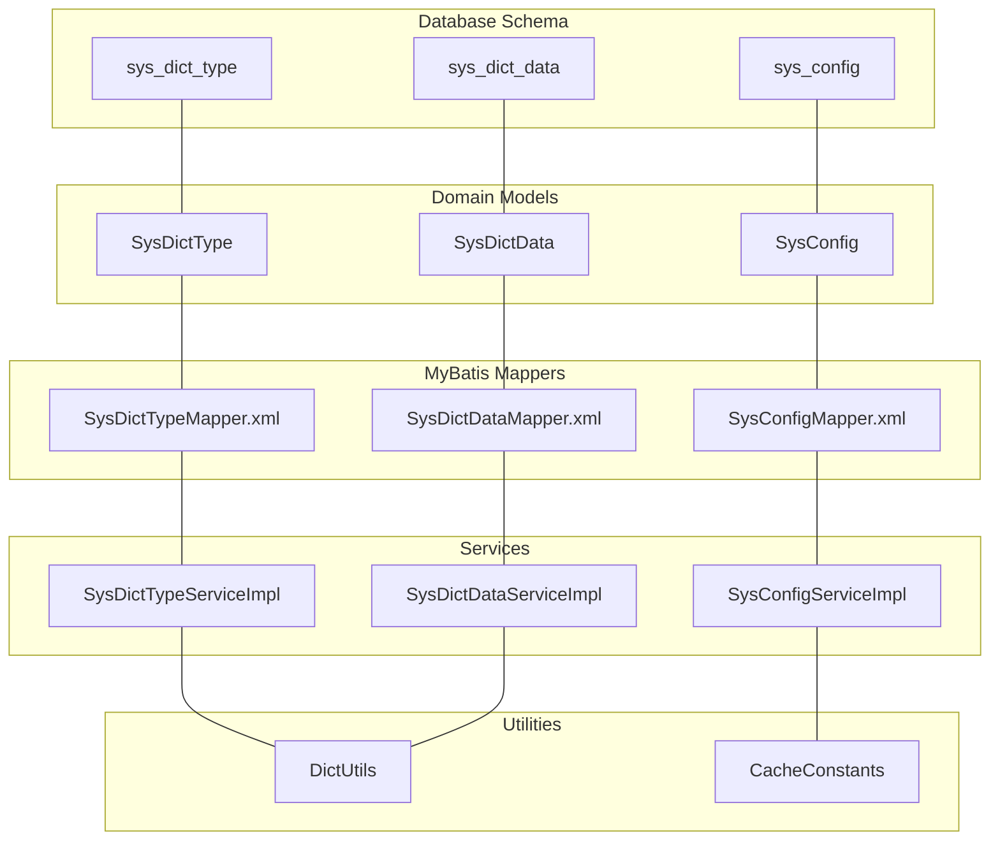
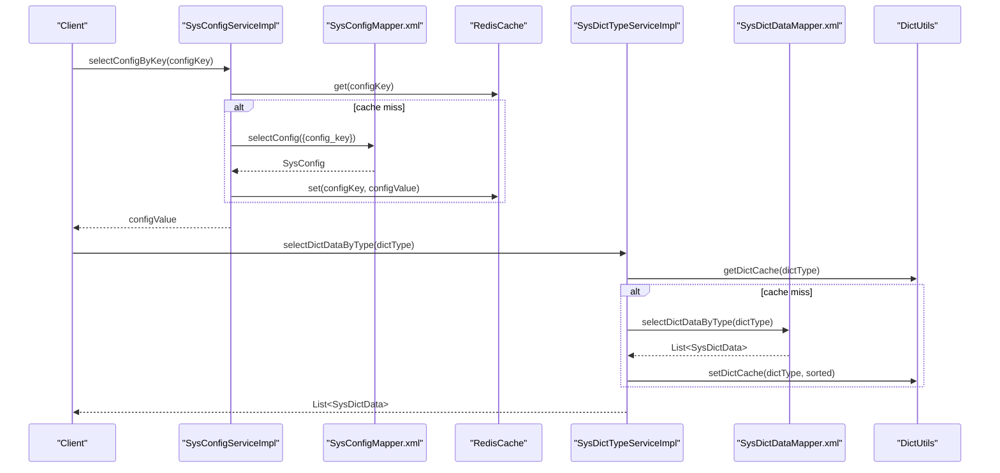
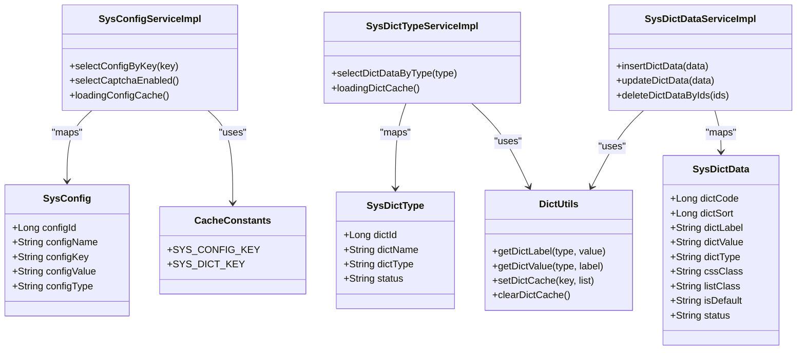

# Configuration & Dictionary Management

<cite>
**Referenced Files in This Document**
- [ry_20250522.sql](file://sql/ry_20250522.sql)
- [SysConfig.java](file://src/main/java/com/ruoyi/project/system/domain/SysConfig.java)
- [SysDictType.java](file://src/main/java/com/ruoyi/project/system/domain/SysDictType.java)
- [SysDictData.java](file://src/main/java/com/ruoyi/project/system/domain/SysDictData.java)
- [SysConfigMapper.xml](file://src/main/resources/mybatis/system/SysConfigMapper.xml)
- [SysDictDataMapper.xml](file://src/main/resources/mybatis/system/SysDictDataMapper.xml)
- [SysDictTypeMapper.xml](file://src/main/resources/mybatis/system/SysDictTypeMapper.xml)
- [SysConfigServiceImpl.java](file://src/main/java/com/ruoyi/project/system/service/impl/SysConfigServiceImpl.java)
- [SysDictTypeServiceImpl.java](file://src/main/java/com/ruoyi/project/system/service/impl/SysDictTypeServiceImpl.java)
- [SysDictDataServiceImpl.java](file://src/main/java/com/ruoyi/project/system/service/impl/SysDictDataServiceImpl.java)
- [DictUtils.java](file://src/main/java/com/ruoyi/common/utils/DictUtils.java)
- [CacheConstants.java](file://src/main/java/com/ruoyi/common/constant/CacheConstants.java)
- [UserConstants.java](file://src/main/java/com/ruoyi/common/constant/UserConstants.java)
- [application.yml](file://src/main/resources/application.yml)
</cite>

## Table of Contents
1. [Introduction](#introduction)
2. [Project Structure](#project-structure)
3. [Core Components](#core-components)
4. [Architecture Overview](#architecture-overview)
5. [Detailed Component Analysis](#detailed-component-analysis)
6. [Dependency Analysis](#dependency-analysis)
7. [Performance Considerations](#performance-considerations)
8. [Troubleshooting Guide](#troubleshooting-guide)
9. [Conclusion](#conclusion)

## Introduction
This document explains the configuration and dictionary management subsystem in the RuoYi-Vue system. It focuses on:
- The sys_config table for system parameters that control core behaviors (e.g., captchaEnabled, registerUser) and UI settings (e.g., skinName, sideTheme).
- The sys_dict_type and sys_dict_data tables that implement a flexible dictionary system with type-label-value relationships, default selection, and display styling (css_class, list_class).
- Initialization data for predefined dictionaries (e.g., user genders, system statuses) and configuration values (e.g., default passwords).
- How these tables enable dynamic configuration without code changes and provide reference data for forms and displays.
- Example MyBatis mapper queries used to load configuration values and dictionary options.
- Integration with RuoYiConfig and DictUtils components.

## Project Structure
The configuration and dictionary management spans database schema, domain models, MyBatis mappers, service implementations, and utility helpers. The database initialization script defines the tables and seeds initial data.

**Diagram sources**
- [ry_20250522.sql](file://sql/ry_20250522.sql#L531-L556)
- [SysConfig.java](file://src/main/java/com/ruoyi/project/system/domain/SysConfig.java#L1-L112)
- [SysDictType.java](file://src/main/java/com/ruoyi/project/system/domain/SysDictType.java#L1-L97)
- [SysDictData.java](file://src/main/java/com/ruoyi/project/system/domain/SysDictData.java#L1-L177)
- [SysConfigMapper.xml](file://src/main/resources/mybatis/system/SysConfigMapper.xml#L1-L117)
- [SysDictTypeMapper.xml](file://src/main/resources/mybatis/system/SysDictTypeMapper.xml#L1-L105)
- [SysDictDataMapper.xml](file://src/main/resources/mybatis/system/SysDictDataMapper.xml#L1-L124)
- [SysConfigServiceImpl.java](file://src/main/java/com/ruoyi/project/system/service/impl/SysConfigServiceImpl.java#L1-L230)
- [SysDictTypeServiceImpl.java](file://src/main/java/com/ruoyi/project/system/service/impl/SysDictTypeServiceImpl.java#L1-L224)
- [SysDictDataServiceImpl.java](file://src/main/java/com/ruoyi/project/system/service/impl/SysDictDataServiceImpl.java#L1-L112)
- [DictUtils.java](file://src/main/java/com/ruoyi/common/utils/DictUtils.java#L1-L218)
- [CacheConstants.java](file://src/main/java/com/ruoyi/common/constant/CacheConstants.java#L1-L45)

**Section sources**
- [ry_20250522.sql](file://sql/ry_20250522.sql#L531-L556)
- [SysConfig.java](file://src/main/java/com/ruoyi/project/system/domain/SysConfig.java#L1-L112)
- [SysDictType.java](file://src/main/java/com/ruoyi/project/system/domain/SysDictType.java#L1-L97)
- [SysDictData.java](file://src/main/java/com/ruoyi/project/system/domain/SysDictData.java#L1-L177)

## Core Components
- sys_config: Stores system parameters keyed by config_key with values stored in config_value. Includes flags like config_type to mark built-in parameters and remarks for documentation.
- sys_dict_type: Defines dictionary categories (types) with a unique dict_type identifier and human-readable dict_name.
- sys_dict_data: Holds the actual options for each type, including dict_label (display text), dict_value (internal value), sorting order (dict_sort), default flag (is_default), styling attributes (css_class, list_class), and status.

These components are mapped to domain classes and exposed via MyBatis mappers and Spring services. A caching layer (Redis) is used to accelerate reads for both configuration and dictionary data.

**Section sources**
- [ry_20250522.sql](file://sql/ry_20250522.sql#L531-L556)
- [ry_20250522.sql](file://sql/ry_20250522.sql#L446-L474)
- [ry_20250522.sql](file://sql/ry_20250522.sql#L476-L528)
- [SysConfig.java](file://src/main/java/com/ruoyi/project/system/domain/SysConfig.java#L1-L112)
- [SysDictType.java](file://src/main/java/com/ruoyi/project/system/domain/SysDictType.java#L1-L97)
- [SysDictData.java](file://src/main/java/com/ruoyi/project/system/domain/SysDictData.java#L1-L177)

## Architecture Overview
The runtime flow integrates configuration and dictionary data with caching and services:

**Diagram sources**
- [SysConfigServiceImpl.java](file://src/main/java/com/ruoyi/project/system/service/impl/SysConfigServiceImpl.java#L61-L94)
- [SysConfigMapper.xml](file://src/main/resources/mybatis/system/SysConfigMapper.xml#L36-L71)
- [SysDictTypeServiceImpl.java](file://src/main/java/com/ruoyi/project/system/service/impl/SysDictTypeServiceImpl.java#L73-L88)
- [SysDictDataMapper.xml](file://src/main/resources/mybatis/system/SysDictDataMapper.xml#L44-L47)
- [DictUtils.java](file://src/main/java/com/ruoyi/common/utils/DictUtils.java#L36-L50)

## Detailed Component Analysis

### sys_config: System Parameters
- Purpose: Centralized storage for system-wide settings such as UI themes, captcha availability, registration toggle, and operational policies.
- Key fields:
  - config_key: Unique parameter identifier (e.g., sys.account.captchaEnabled, sys.index.skinName).
  - config_value: Parameter value (e.g., true/false, theme names).
  - config_type: Built-in vs. custom (Y/N).
  - Remarks: Human-readable descriptions for administrators.
- Behavior:
  - On startup, services load all parameters into Redis under a dedicated cache key prefix.
  - Services expose typed getters (e.g., selectCaptchaEnabled) that convert stored values to booleans.
  - Built-in parameters cannot be deleted by the service layer.

Initialization examples (from seed data):
- sys.account.captchaEnabled: true/false
- sys.account.registerUser: true/false
- sys.index.skinName: skin-blue/skin-green/skin-purple/skin-red/skin-yellow
- sys.index.sideTheme: theme-dark/theme-light
- sys.user.initPassword: default password value
- sys.login.blackIPList: semicolon-separated IP patterns
- sys.account.initPasswordModify: 0/1 behavior flag
- sys.account.passwordValidateDays: numeric policy

Integration points:
- RuoYiConfig (application.yml) holds project metadata and file upload paths; it is separate from sys_config but part of the broader configuration ecosystem.
- SysConfigServiceImpl caches values and exposes convenience methods for common toggles.

**Section sources**
- [ry_20250522.sql](file://sql/ry_20250522.sql#L548-L556)
- [SysConfig.java](file://src/main/java/com/ruoyi/project/system/domain/SysConfig.java#L1-L112)
- [SysConfigMapper.xml](file://src/main/resources/mybatis/system/SysConfigMapper.xml#L1-L117)
- [SysConfigServiceImpl.java](file://src/main/java/com/ruoyi/project/system/service/impl/SysConfigServiceImpl.java#L33-L94)
- [application.yml](file://src/main/resources/application.yml#L1-L20)

### sys_dict_type and sys_dict_data: Flexible Dictionary System
- Purpose: Provide reusable, typed reference lists for UI controls and business logic.
- sys_dict_type:
  - dict_type: Unique type identifier (e.g., sys_user_sex, sys_normal_disable).
  - dict_name: Human-friendly category name.
- sys_dict_data:
  - dict_label: Display label (e.g., Male, Female, Unknown).
  - dict_value: Internal value (e.g., 0, 1, 2).
  - dict_type: Links option to its type.
  - dict_sort: Ordering within a type.
  - is_default: Marks a default selection.
  - css_class, list_class: Styling for display contexts.
  - status: Enable/disable visibility.

Initialization examples (seed data):
- sys_user_sex: labels “Male/Female/Unknown” with values “0/1/2”, default “0”.
- sys_normal_disable: labels “Normal/Disabled” with values “0/1”, default “0”.
- sys_show_hide: labels “Show/Hide” with values “0/1”, default “0”.
- sys_job_status: labels “Normal/Paused” with values “0/1”, default “0”.
- sys_job_group: labels “Default/System” with values “DEFAULT/SYSTEM”, default “DEFAULT”.
- sys_yes_no: labels “Yes/No” with values “Y/N”, default “Y”.
- sys_notice_type/status: labels for notifications and statuses.
- sys_oper_type: labels for operation types (e.g., Add/Edit/Delete/Authorize/Export/Import/Force Logout/Generate/Empty).
- sys_common_status: labels “Success/Failure”.

Integration points:
- SysDictTypeServiceImpl loads all active dictionary data into Redis keyed by dict_type and sorts by dict_sort.
- DictUtils provides label/value conversions and bulk retrieval helpers.
- Services invalidate or refresh cache upon insert/update/delete operations.

**Section sources**
- [ry_20250522.sql](file://sql/ry_20250522.sql#L446-L474)
- [ry_20250522.sql](file://sql/ry_20250522.sql#L476-L528)
- [SysDictType.java](file://src/main/java/com/ruoyi/project/system/domain/SysDictType.java#L1-L97)
- [SysDictData.java](file://src/main/java/com/ruoyi/project/system/domain/SysDictData.java#L1-L177)
- [SysDictTypeMapper.xml](file://src/main/resources/mybatis/system/SysDictTypeMapper.xml#L1-L105)
- [SysDictDataMapper.xml](file://src/main/resources/mybatis/system/SysDictDataMapper.xml#L1-L124)
- [SysDictTypeServiceImpl.java](file://src/main/java/com/ruoyi/project/system/service/impl/SysDictTypeServiceImpl.java#L137-L166)
- [SysDictDataServiceImpl.java](file://src/main/java/com/ruoyi/project/system/service/impl/SysDictDataServiceImpl.java#L60-L112)
- [DictUtils.java](file://src/main/java/com/ruoyi/common/utils/DictUtils.java#L52-L144)

### MyBatis Mapper Queries for Loading Data
- sys_config:
  - Select by config_key: Used by SysConfigServiceImpl to fetch a single parameter by key.
  - Select list with filters: Supports admin screens to search and paginate parameters.
  - Insert/update/delete: CRUD operations for parameters.
- sys_dict_data:
  - Select list by type with filters: Admin screen filtering by label/status.
  - Select by type (active only): Used by SysDictTypeServiceImpl to populate cache.
  - Select label by type/value: Utility conversion for display.
  - Insert/update/delete: CRUD operations for dictionary entries.
- sys_dict_type:
  - Select list with filters: Admin screen filtering by name/type/status.
  - Select all: Used to build dropdowns or type lists.
  - Insert/update/delete: CRUD operations for dictionary types.

These queries are the foundation for dynamic configuration and dictionary-driven UIs.

**Section sources**
- [SysConfigMapper.xml](file://src/main/resources/mybatis/system/SysConfigMapper.xml#L1-L117)
- [SysDictDataMapper.xml](file://src/main/resources/mybatis/system/SysDictDataMapper.xml#L1-L124)
- [SysDictTypeMapper.xml](file://src/main/resources/mybatis/system/SysDictTypeMapper.xml#L1-L105)

### Integration with RuoYiConfig and DictUtils
- RuoYiConfig:
  - Reads application.yml properties (ruoyi.*) for project metadata and file upload paths.
  - Not directly tied to sys_config; serves as a complementary configuration mechanism for application-level settings.
- DictUtils:
  - Provides cache-aware conversion between labels and values for a given dict_type.
  - Manages Redis cache keys for dictionary data and supports clearing/reloading caches.

**Section sources**
- [application.yml](file://src/main/resources/application.yml#L1-L20)
- [DictUtils.java](file://src/main/java/com/ruoyi/common/utils/DictUtils.java#L1-L218)
- [CacheConstants.java](file://src/main/java/com/ruoyi/common/constant/CacheConstants.java#L1-L45)

## Dependency Analysis
- Domain models depend on base entity and annotations for export/conversion.
- Services depend on mappers and Redis cache utilities.
- DictUtils depends on RedisCache and cache key constants.
- Built-in parameters are protected by service checks to prevent deletion.

**Diagram sources**
- [SysConfig.java](file://src/main/java/com/ruoyi/project/system/domain/SysConfig.java#L1-L112)
- [SysDictType.java](file://src/main/java/com/ruoyi/project/system/domain/SysDictType.java#L1-L97)
- [SysDictData.java](file://src/main/java/com/ruoyi/project/system/domain/SysDictData.java#L1-L177)
- [SysConfigServiceImpl.java](file://src/main/java/com/ruoyi/project/system/service/impl/SysConfigServiceImpl.java#L1-L230)
- [SysDictTypeServiceImpl.java](file://src/main/java/com/ruoyi/project/system/service/impl/SysDictTypeServiceImpl.java#L1-L224)
- [SysDictDataServiceImpl.java](file://src/main/java/com/ruoyi/project/system/service/impl/SysDictDataServiceImpl.java#L1-L112)
- [DictUtils.java](file://src/main/java/com/ruoyi/common/utils/DictUtils.java#L1-L218)
- [CacheConstants.java](file://src/main/java/com/ruoyi/common/constant/CacheConstants.java#L1-L45)

**Section sources**
- [SysConfigServiceImpl.java](file://src/main/java/com/ruoyi/project/system/service/impl/SysConfigServiceImpl.java#L1-L230)
- [SysDictTypeServiceImpl.java](file://src/main/java/com/ruoyi/project/system/service/impl/SysDictTypeServiceImpl.java#L1-L224)
- [SysDictDataServiceImpl.java](file://src/main/java/com/ruoyi/project/system/service/impl/SysDictDataServiceImpl.java#L1-L112)
- [DictUtils.java](file://src/main/java/com/ruoyi/common/utils/DictUtils.java#L1-L218)
- [CacheConstants.java](file://src/main/java/com/ruoyi/common/constant/CacheConstants.java#L1-L45)

## Performance Considerations
- Caching:
  - sys_config values are cached in Redis with a dedicated key prefix to minimize repeated database reads.
  - sys_dict_data is cached per dict_type and sorted by dict_sort to optimize UI rendering.
- Bulk operations:
  - Resetting caches clears or reloads all cached entries to ensure consistency after administrative changes.
- Conversions:
  - DictUtils converts between labels and values using cached lists, avoiding repeated DB scans.

[No sources needed since this section provides general guidance]

## Troubleshooting Guide
- Configuration not taking effect:
  - Verify the config_key exists and is not marked as built-in (Y) if deletion is attempted.
  - Trigger cache reset to reload values from the database.
- Dictionary options missing or outdated:
  - Confirm the dict_type exists and status is active.
  - Clear dictionary cache to force reload from sys_dict_data.
- Unexpected default selections:
  - Ensure only one entry per dict_type has is_default set to Y.
- Validation errors:
  - Ensure dict_type follows naming rules enforced by the domain model (lowercase, digits, underscore, starts with letter).
  - Ensure labels/values meet length constraints.

**Section sources**
- [SysConfigServiceImpl.java](file://src/main/java/com/ruoyi/project/system/service/impl/SysConfigServiceImpl.java#L148-L166)
- [SysDictTypeServiceImpl.java](file://src/main/java/com/ruoyi/project/system/service/impl/SysDictTypeServiceImpl.java#L134-L166)
- [SysDictDataServiceImpl.java](file://src/main/java/com/ruoyi/project/system/service/impl/SysDictDataServiceImpl.java#L60-L112)
- [SysDictType.java](file://src/main/java/com/ruoyi/project/system/domain/SysDictType.java#L59-L62)
- [UserConstants.java](file://src/main/java/com/ruoyi/common/constant/UserConstants.java#L36-L41)

## Conclusion
RuoYi’s configuration and dictionary management provides a robust, dynamic foundation for system behavior and UI presentation:
- sys_config centralizes system parameters with caching and typed accessors.
- sys_dict_type/sys_dict_data deliver reusable, styled reference lists with default selection and ordering.
- MyBatis mappers and services encapsulate persistence and caching logic.
- DictUtils and cache constants streamline label/value conversions and cache management.
Together, these components enable administrators to adjust behavior and appearance without code changes, while maintaining performance and consistency.