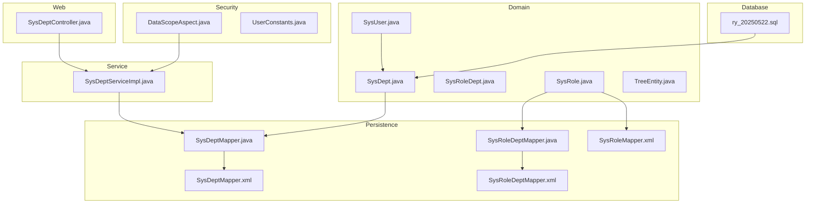
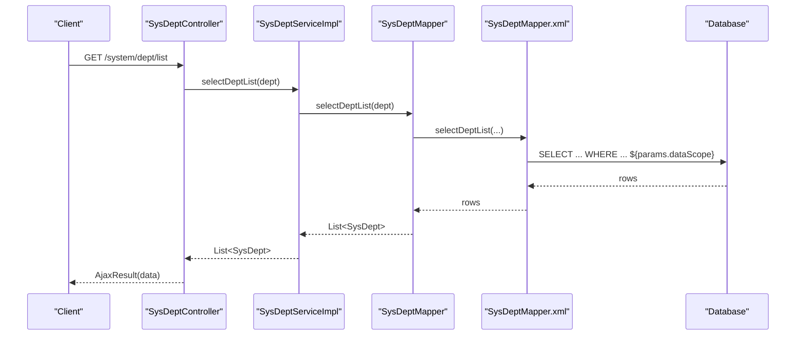
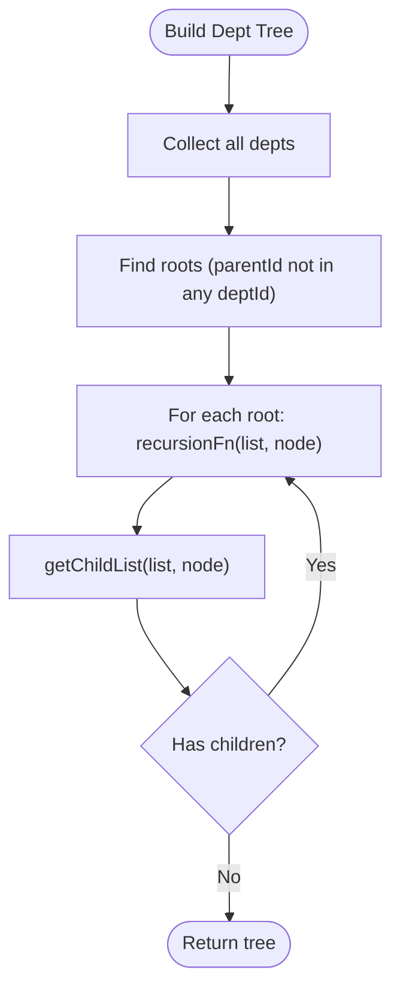
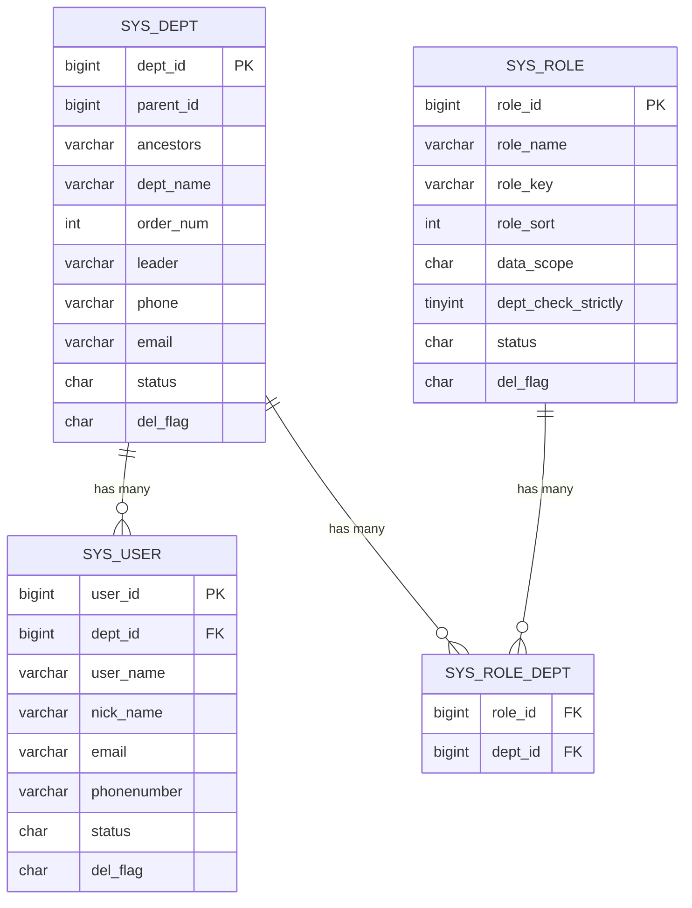
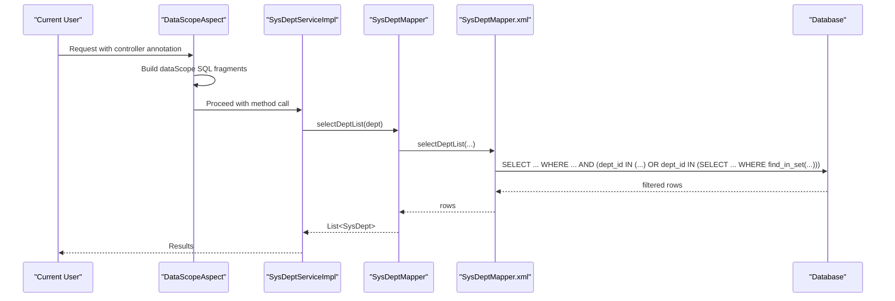
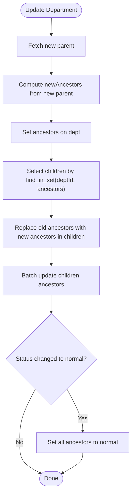
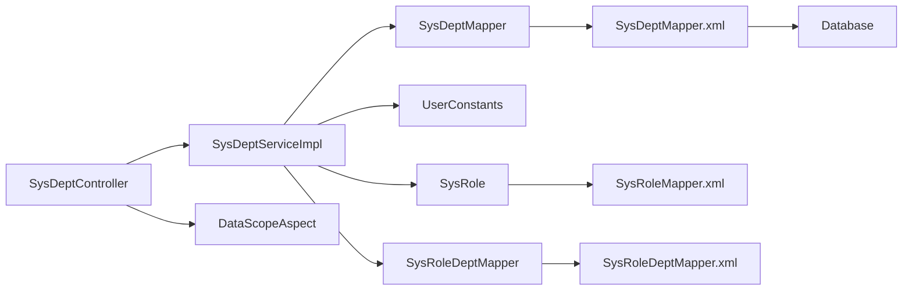

# Department & Organization Structure

<cite>
**Referenced Files in This Document**
- [SysDept.java](file://src/main/java/com/ruoyi/project/system/domain/SysDept.java)
- [SysDeptMapper.java](file://src/main/java/com/ruoyi/project/system/mapper/SysDeptMapper.java)
- [SysDeptMapper.xml](file://src/main/resources/mybatis/system/SysDeptMapper.xml)
- [SysDeptServiceImpl.java](file://src/main/java/com/ruoyi/project/system/service/impl/SysDeptServiceImpl.java)
- [SysDeptController.java](file://src/main/java/com/ruoyi/project/system/controller/SysDeptController.java)
- [SysRoleDept.java](file://src/main/java/com/ruoyi/project/system/domain/SysRoleDept.java)
- [SysRoleDeptMapper.java](file://src/main/java/com/ruoyi/project/system/mapper/SysRoleDeptMapper.java)
- [SysRoleDeptMapper.xml](file://src/main/resources/mybatis/system/SysRoleDeptMapper.xml)
- [SysRole.java](file://src/main/java/com/ruoyi/project/system/domain/SysRole.java)
- [SysRoleMapper.xml](file://src/main/resources/mybatis/system/SysRoleMapper.xml)
- [SysUser.java](file://src/main/java/com/ruoyi/project/system/domain/SysUser.java)
- [DataScopeAspect.java](file://src/main/java/com/ruoyi/framework/aspectj/DataScopeAspect.java)
- [UserConstants.java](file://src/main/java/com/ruoyi/common/constant/UserConstants.java)
- [TreeEntity.java](file://src/main/java/com/ruoyi/framework/web/domain/TreeEntity.java)
- [ry_20250522.sql](file://sql/ry_20250522.sql)
</cite>

## Table of Contents
1. [Introduction](#introduction)
2. [Project Structure](#project-structure)
3. [Core Components](#core-components)
4. [Architecture Overview](#architecture-overview)
5. [Detailed Component Analysis](#detailed-component-analysis)
6. [Dependency Analysis](#dependency-analysis)
7. [Performance Considerations](#performance-considerations)
8. [Troubleshooting Guide](#troubleshooting-guide)
9. [Conclusion](#conclusion)
10. [Appendices](#appendices)

## Introduction
This document explains the department management tables and hierarchical organization model in the RuoYi-Vue system. It focuses on the sys_dept table structure, the hierarchical organization achieved via parent_id and ancestors, department metadata (name, phone, email), and status management. It also explains how the ancestors field enables efficient tree traversal and data scope permissions, documents the initialization hierarchy (root company and subsidiaries), and describes how departments relate to users and roles for role-based access control.

## Project Structure
The department management feature spans domain models, persistence (MyBatis), service/business logic, and web controllers. The database schema initializes a corporate hierarchy with a root company and subsidiaries.

**Diagram sources**
- [SysDept.java](file://src/main/java/com/ruoyi/project/system/domain/SysDept.java#L1-L204)
- [SysDeptMapper.java](file://src/main/java/com/ruoyi/project/system/mapper/SysDeptMapper.java#L1-L119)
- [SysDeptMapper.xml](file://src/main/resources/mybatis/system/SysDeptMapper.xml#L1-L159)
- [SysDeptServiceImpl.java](file://src/main/java/com/ruoyi/project/system/service/impl/SysDeptServiceImpl.java#L1-L339)
- [SysDeptController.java](file://src/main/java/com/ruoyi/project/system/controller/SysDeptController.java#L1-L133)
- [SysRoleDept.java](file://src/main/java/com/ruoyi/project/system/domain/SysRoleDept.java#L1-L47)
- [SysRoleDeptMapper.java](file://src/main/java/com/ruoyi/project/system/mapper/SysRoleDeptMapper.java#L1-L44)
- [SysRoleDeptMapper.xml](file://src/main/resources/mybatis/system/SysRoleDeptMapper.xml#L1-L34)
- [SysRole.java](file://src/main/java/com/ruoyi/project/system/domain/SysRole.java#L1-L200)
- [SysRoleMapper.xml](file://src/main/resources/mybatis/system/SysRoleMapper.xml#L1-L152)
- [SysUser.java](file://src/main/java/com/ruoyi/project/system/domain/SysUser.java#L1-L200)
- [DataScopeAspect.java](file://src/main/java/com/ruoyi/framework/aspectj/DataScopeAspect.java#L1-L185)
- [UserConstants.java](file://src/main/java/com/ruoyi/common/constant/UserConstants.java#L1-L82)
- [TreeEntity.java](file://src/main/java/com/ruoyi/framework/web/domain/TreeEntity.java#L1-L79)
- [ry_20250522.sql](file://sql/ry_20250522.sql#L1-L200)

**Section sources**
- [SysDept.java](file://src/main/java/com/ruoyi/project/system/domain/SysDept.java#L1-L204)
- [SysDeptMapper.java](file://src/main/java/com/ruoyi/project/system/mapper/SysDeptMapper.java#L1-L119)
- [SysDeptMapper.xml](file://src/main/resources/mybatis/system/SysDeptMapper.xml#L1-L159)
- [SysDeptServiceImpl.java](file://src/main/java/com/ruoyi/project/system/service/impl/SysDeptServiceImpl.java#L1-L339)
- [SysDeptController.java](file://src/main/java/com/ruoyi/project/system/controller/SysDeptController.java#L1-L133)
- [SysRoleDept.java](file://src/main/java/com/ruoyi/project/system/domain/SysRoleDept.java#L1-L47)
- [SysRoleDeptMapper.java](file://src/main/java/com/ruoyi/project/system/mapper/SysRoleDeptMapper.java#L1-L44)
- [SysRoleDeptMapper.xml](file://src/main/resources/mybatis/system/SysRoleDeptMapper.xml#L1-L34)
- [SysRole.java](file://src/main/java/com/ruoyi/project/system/domain/SysRole.java#L1-L200)
- [SysRoleMapper.xml](file://src/main/resources/mybatis/system/SysRoleMapper.xml#L1-L152)
- [SysUser.java](file://src/main/java/com/ruoyi/project/system/domain/SysUser.java#L1-L200)
- [DataScopeAspect.java](file://src/main/java/com/ruoyi/framework/aspectj/DataScopeAspect.java#L1-L185)
- [UserConstants.java](file://src/main/java/com/ruoyi/common/constant/UserConstants.java#L1-L82)
- [TreeEntity.java](file://src/main/java/com/ruoyi/framework/web/domain/TreeEntity.java#L1-L79)
- [ry_20250522.sql](file://sql/ry_20250522.sql#L1-L200)

## Core Components
- sys_dept table: stores department records with hierarchical linkage via parent_id and ancestors, plus metadata and status.
- Domain model SysDept: POJO with fields for deptId, parentId, ancestors, deptName, orderNum, leader, phone, email, status, delFlag, and parentName/children for tree building.
- Mapper and XML: MyBatis queries for list filtering, tree retrieval, child enumeration, uniqueness checks, and ancestor updates.
- Service layer: builds department trees, enforces data scope, validates constraints, and manages ancestor propagation during moves.
- Controller: exposes REST endpoints for CRUD and tree operations, enforcing permissions and data scope checks.
- Roles and departments: sys_role_dept bridges roles to departments; DataScopeAspect applies data scope filters based on role.dataScope and user.deptId.

**Section sources**
- [SysDept.java](file://src/main/java/com/ruoyi/project/system/domain/SysDept.java#L1-L204)
- [SysDeptMapper.java](file://src/main/java/com/ruoyi/project/system/mapper/SysDeptMapper.java#L1-L119)
- [SysDeptMapper.xml](file://src/main/resources/mybatis/system/SysDeptMapper.xml#L1-L159)
- [SysDeptServiceImpl.java](file://src/main/java/com/ruoyi/project/system/service/impl/SysDeptServiceImpl.java#L1-L339)
- [SysDeptController.java](file://src/main/java/com/ruoyi/project/system/controller/SysDeptController.java#L1-L133)
- [SysRoleDept.java](file://src/main/java/com/ruoyi/project/system/domain/SysRoleDept.java#L1-L47)
- [SysRoleDeptMapper.java](file://src/main/java/com/ruoyi/project/system/mapper/SysRoleDeptMapper.java#L1-L44)
- [SysRoleDeptMapper.xml](file://src/main/resources/mybatis/system/SysRoleDeptMapper.xml#L1-L34)
- [SysRole.java](file://src/main/java/com/ruoyi/project/system/domain/SysRole.java#L1-L200)
- [SysRoleMapper.xml](file://src/main/resources/mybatis/system/SysRoleMapper.xml#L1-L152)
- [SysUser.java](file://src/main/java/com/ruoyi/project/system/domain/SysUser.java#L1-L200)
- [DataScopeAspect.java](file://src/main/java/com/ruoyi/framework/aspectj/DataScopeAspect.java#L1-L185)
- [UserConstants.java](file://src/main/java/com/ruoyi/common/constant/UserConstants.java#L1-L82)
- [TreeEntity.java](file://src/main/java/com/ruoyi/framework/web/domain/TreeEntity.java#L1-L79)
- [ry_20250522.sql](file://sql/ry_20250522.sql#L1-L200)

## Architecture Overview
The department module follows a layered architecture:
- Web layer: REST endpoints in SysDeptController.
- Service layer: business logic in SysDeptServiceImpl, including tree building, ancestor propagation, and data scope enforcement.
- Persistence layer: MyBatis mappers and XML SQL statements for CRUD and tree queries.
- Security layer: DataScopeAspect injects data scope filters into queries based on role.dataScope and user context.

**Diagram sources**
- [SysDeptController.java](file://src/main/java/com/ruoyi/project/system/controller/SysDeptController.java#L1-L133)
- [SysDeptServiceImpl.java](file://src/main/java/com/ruoyi/project/system/service/impl/SysDeptServiceImpl.java#L1-L120)
- [SysDeptMapper.java](file://src/main/java/com/ruoyi/project/system/mapper/SysDeptMapper.java#L1-L119)
- [SysDeptMapper.xml](file://src/main/resources/mybatis/system/SysDeptMapper.xml#L1-L159)

## Detailed Component Analysis

### sys_dept table and SysDept domain model
- Fields:
  - dept_id (PK): unique identifier.
  - parent_id: parent department id for hierarchical linkage.
  - ancestors: comma-separated ancestor ids including self, enabling fast subtree queries.
  - dept_name, order_num, leader, phone, email, status, del_flag, timestamps.
- Hierarchical semantics:
  - parent_id links to another row in the same table.
  - ancestors holds the full lineage path (e.g., "0,100" for a child of root dept 100).
- Status management:
  - status indicates normal or disabled state.
  - del_flag marks logical deletion.

**Section sources**
- [SysDept.java](file://src/main/java/com/ruoyi/project/system/domain/SysDept.java#L1-L204)
- [ry_20250522.sql](file://sql/ry_20250522.sql#L1-L40)

### Ancestors field and tree traversal
- Efficient subtree queries:
  - find_in_set usage in XML allows selecting all descendants of a given dept_id.
  - Normal-child count query filters by status and ancestors.
- Tree building:
  - Service constructs a hierarchical tree from flat lists using parent-child relationships and recursion.
  - TreeSelect conversion supports UI tree widgets.

**Diagram sources**
- [SysDeptServiceImpl.java](file://src/main/java/com/ruoyi/project/system/service/impl/SysDeptServiceImpl.java#L296-L338)
- [SysDeptMapper.xml](file://src/main/resources/mybatis/system/SysDeptMapper.xml#L77-L84)

**Section sources**
- [SysDeptMapper.xml](file://src/main/resources/mybatis/system/SysDeptMapper.xml#L77-L84)
- [SysDeptServiceImpl.java](file://src/main/java/com/ruoyi/project/system/service/impl/SysDeptServiceImpl.java#L296-L338)
- [TreeEntity.java](file://src/main/java/com/ruoyi/framework/web/domain/TreeEntity.java#L1-L79)

### Initialization hierarchy (root and subsidiaries)
- Root company inserted with dept_id 100 and ancestors "0".
- Subsidiaries under root:
  - dept_id 101 (Shenzhen HQ) with ancestors "0,100"
  - dept_id 102 (Changsha Branch) with ancestors "0,100"
- Child departments inherit ancestors accordingly (e.g., "0,100,101").

**Section sources**
- [ry_20250522.sql](file://sql/ry_20250522.sql#L24-L36)

### Department relationships with users and roles
- Users:
  - sys_user.dept_id links to sys_dept.dept_id.
  - User domain includes a SysDept association for reporting and display.
- Roles and departments:
  - sys_role_dept bridges sys_role and sys_dept.
  - Role domain includes dataScope and deptCheckStrictly flags controlling data visibility and UI behavior.

**Diagram sources**
- [ry_20250522.sql](file://sql/ry_20250522.sql#L1-L200)
- [SysUser.java](file://src/main/java/com/ruoyi/project/system/domain/SysUser.java#L1-L200)
- [SysRole.java](file://src/main/java/com/ruoyi/project/system/domain/SysRole.java#L1-L200)
- [SysRoleDept.java](file://src/main/java/com/ruoyi/project/system/domain/SysRoleDept.java#L1-L47)

**Section sources**
- [SysUser.java](file://src/main/java/com/ruoyi/project/system/domain/SysUser.java#L1-L200)
- [SysRole.java](file://src/main/java/com/ruoyi/project/system/domain/SysRole.java#L1-L200)
- [SysRoleDept.java](file://src/main/java/com/ruoyi/project/system/domain/SysRoleDept.java#L1-L47)
- [SysRoleDeptMapper.xml](file://src/main/resources/mybatis/system/SysRoleDeptMapper.xml#L1-L34)
- [SysRoleMapper.xml](file://src/main/resources/mybatis/system/SysRoleMapper.xml#L1-L152)

### Data scope permissions and ancestors
- DataScopeAspect injects dataScope conditions into queries based on role.dataScope and user context:
  - All data: no restriction.
  - Custom: restricts to departments assigned to the user’s roles via sys_role_dept.
  - Department only: restricts to user.deptId.
  - Department and below: restricts to user.deptId or any descendant identified by find_in_set(user.deptId, ancestors).
- The ancestors field enables efficient subtree filtering without recursive CTEs.

**Diagram sources**
- [DataScopeAspect.java](file://src/main/java/com/ruoyi/framework/aspectj/DataScopeAspect.java#L1-L185)
- [SysDeptServiceImpl.java](file://src/main/java/com/ruoyi/project/system/service/impl/SysDeptServiceImpl.java#L44-L49)
- [SysDeptMapper.xml](file://src/main/resources/mybatis/system/SysDeptMapper.xml#L30-L48)

**Section sources**
- [DataScopeAspect.java](file://src/main/java/com/ruoyi/framework/aspectj/DataScopeAspect.java#L1-L185)
- [SysDeptMapper.xml](file://src/main/resources/mybatis/system/SysDeptMapper.xml#L30-L48)
- [SysRole.java](file://src/main/java/com/ruoyi/project/system/domain/SysRole.java#L1-L200)

### Controller interactions and data scope checks
- Endpoints:
  - GET /system/dept/list: lists departments with data scope filtering.
  - GET /system/dept/list/exclude/{deptId}: excludes a node and its descendants from the list.
  - GET /system/dept/{deptId}: retrieves a department after verifying data scope.
  - POST /system/dept, PUT /system/dept, DELETE /system/dept/{deptId}: enforce constraints and data scope checks.
- Data scope enforcement:
  - Controller invokes checkDeptDataScope to ensure the requesting user has access to the target department.

**Section sources**
- [SysDeptController.java](file://src/main/java/com/ruoyi/project/system/controller/SysDeptController.java#L1-L133)
- [SysDeptServiceImpl.java](file://src/main/java/com/ruoyi/project/system/service/impl/SysDeptServiceImpl.java#L185-L203)

### Ancestor propagation during updates
- When a department’s parent changes:
  - New ancestors computed from new parent’s ancestors and new parent id.
  - All descendants’ ancestors are updated using replaceFirst to maintain correct lineage.
  - If the department becomes enabled, all ancestors are set to normal status.

**Diagram sources**
- [SysDeptServiceImpl.java](file://src/main/java/com/ruoyi/project/system/service/impl/SysDeptServiceImpl.java#L231-L282)
- [SysDeptMapper.xml](file://src/main/resources/mybatis/system/SysDeptMapper.xml#L135-L146)

**Section sources**
- [SysDeptServiceImpl.java](file://src/main/java/com/ruoyi/project/system/service/impl/SysDeptServiceImpl.java#L231-L282)
- [SysDeptMapper.xml](file://src/main/resources/mybatis/system/SysDeptMapper.xml#L135-L146)

### Hierarchical queries and MyBatis mappers
- selectDeptList: filters by deptId, parentId, deptName, status, and injects dataScope.
- selectDeptListByRoleId: returns departments linked to a role, with optional strictness to exclude parents.
- selectChildrenDeptById: retrieves descendants using find_in_set.
- selectNormalChildrenDeptById: counts normal-status descendants.
- updateDeptChildren: batch updates descendants’ ancestors.
- Other helpers: existence checks, uniqueness, and soft-delete.

**Section sources**
- [SysDeptMapper.java](file://src/main/java/com/ruoyi/project/system/mapper/SysDeptMapper.java#L1-L119)
- [SysDeptMapper.xml](file://src/main/resources/mybatis/system/SysDeptMapper.xml#L30-L159)

## Dependency Analysis
- Controllers depend on services.
- Services depend on mappers and constants.
- Mappers depend on XML SQL and database schema.
- DataScopeAspect depends on roles, users, and permissions.
- Domain models are POJOs with minimal coupling.

**Diagram sources**
- [SysDeptController.java](file://src/main/java/com/ruoyi/project/system/controller/SysDeptController.java#L1-L133)
- [SysDeptServiceImpl.java](file://src/main/java/com/ruoyi/project/system/service/impl/SysDeptServiceImpl.java#L1-L339)
- [SysDeptMapper.java](file://src/main/java/com/ruoyi/project/system/mapper/SysDeptMapper.java#L1-L119)
- [SysDeptMapper.xml](file://src/main/resources/mybatis/system/SysDeptMapper.xml#L1-L159)
- [UserConstants.java](file://src/main/java/com/ruoyi/common/constant/UserConstants.java#L1-L82)
- [SysRole.java](file://src/main/java/com/ruoyi/project/system/domain/SysRole.java#L1-L200)
- [SysRoleDeptMapper.java](file://src/main/java/com/ruoyi/project/system/mapper/SysRoleDeptMapper.java#L1-L44)
- [SysRoleDeptMapper.xml](file://src/main/resources/mybatis/system/SysRoleDeptMapper.xml#L1-L34)
- [SysRoleMapper.xml](file://src/main/resources/mybatis/system/SysRoleMapper.xml#L1-L152)
- [DataScopeAspect.java](file://src/main/java/com/ruoyi/framework/aspectj/DataScopeAspect.java#L1-L185)

**Section sources**
- [SysDeptController.java](file://src/main/java/com/ruoyi/project/system/controller/SysDeptController.java#L1-L133)
- [SysDeptServiceImpl.java](file://src/main/java/com/ruoyi/project/system/service/impl/SysDeptServiceImpl.java#L1-L339)
- [SysDeptMapper.java](file://src/main/java/com/ruoyi/project/system/mapper/SysDeptMapper.java#L1-L119)
- [SysDeptMapper.xml](file://src/main/resources/mybatis/system/SysDeptMapper.xml#L1-L159)
- [UserConstants.java](file://src/main/java/com/ruoyi/common/constant/UserConstants.java#L1-L82)
- [SysRole.java](file://src/main/java/com/ruoyi/project/system/domain/SysRole.java#L1-L200)
- [SysRoleDeptMapper.java](file://src/main/java/com/ruoyi/project/system/mapper/SysRoleDeptMapper.java#L1-L44)
- [SysRoleDeptMapper.xml](file://src/main/resources/mybatis/system/SysRoleDeptMapper.xml#L1-L34)
- [SysRoleMapper.xml](file://src/main/resources/mybatis/system/SysRoleMapper.xml#L1-L152)
- [DataScopeAspect.java](file://src/main/java/com/ruoyi/framework/aspectj/DataScopeAspect.java#L1-L185)

## Performance Considerations
- Ancestors indexing:
  - The ancestors field is used in LIKE-like patterns and find_in_set operations. Consider adding an index on ancestors or optimizing queries if performance becomes a concern.
- Batch updates:
  - updateDeptChildren uses a CASE/WHEN in a single UPDATE, reducing round-trips.
- Tree building:
  - Building trees from flat lists is O(n^2) worst-case; consider caching or precomputed structures for very large hierarchies.
- Data scope filtering:
  - DataScopeAspect appends conditions to params.dataScope; ensure queries leverage indexes on dept_id and ancestors.

[No sources needed since this section provides general guidance]

## Troubleshooting Guide
- Permission denied when accessing a department:
  - Ensure the user has a role with appropriate dataScope or belongs to the department or its subtree.
  - Verify ancestors correctness after moving departments.
- Cannot delete a department:
  - Confirm no child departments exist and no users belong to it.
  - Ensure the department is not referenced by roles via sys_role_dept.
- Duplicate department name:
  - Name uniqueness is enforced per parent; verify deptName and parentId combination.

**Section sources**
- [SysDeptController.java](file://src/main/java/com/ruoyi/project/system/controller/SysDeptController.java#L113-L133)
- [SysDeptServiceImpl.java](file://src/main/java/com/ruoyi/project/system/service/impl/SysDeptServiceImpl.java#L154-L203)
- [SysDeptMapper.xml](file://src/main/resources/mybatis/system/SysDeptMapper.xml#L68-L75)

## Conclusion
The RuoYi-Vue department module implements a robust hierarchical organization using parent_id and ancestors. The ancestors field enables efficient subtree queries and integrates tightly with data scope permissions. The service layer ensures data integrity during moves and maintains ancestor chains. The controller enforces access controls and provides UI-friendly tree structures. Together, these components support scalable role-based access control across organizational hierarchies.

## Appendices

### Appendix A: Initialization data example
- Root company: dept_id 100, ancestors "0"
- Subsidiaries: dept_id 101 (Shenzhen HQ) and 102 (Changsha Branch), ancestors "0,100"
- Child departments inherit ancestors accordingly (e.g., "0,100,101")

**Section sources**
- [ry_20250522.sql](file://sql/ry_20250522.sql#L24-L36)