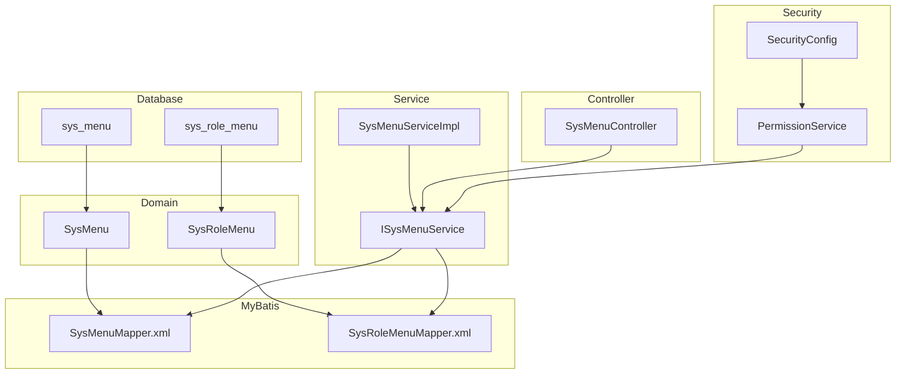
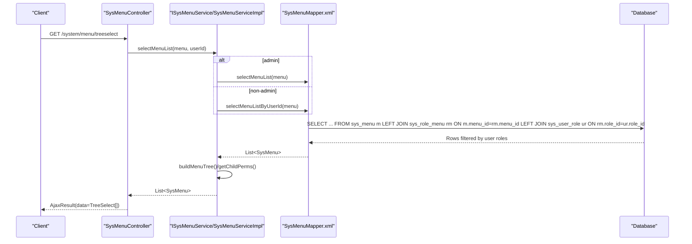
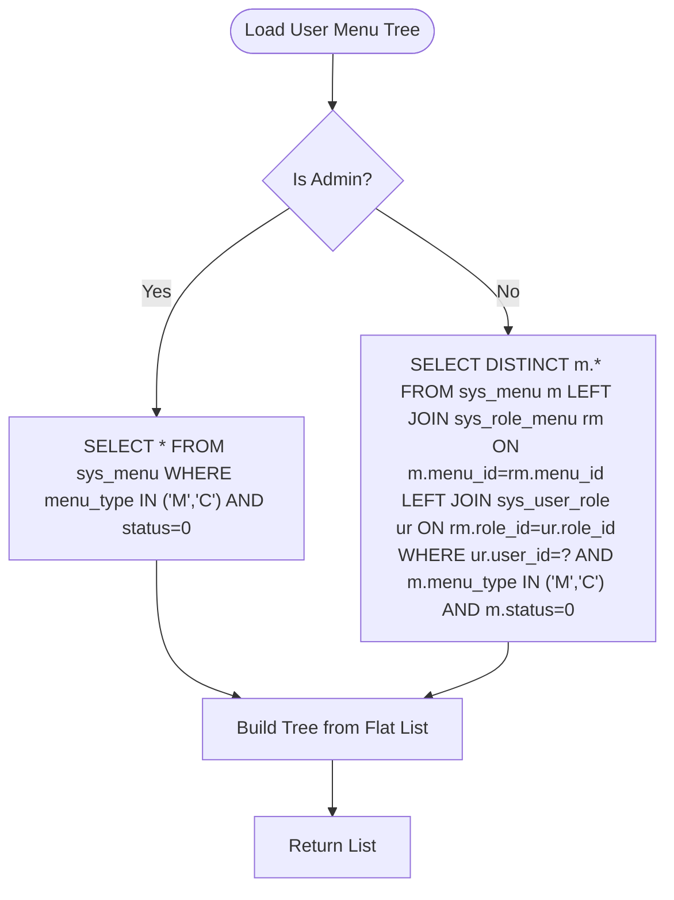
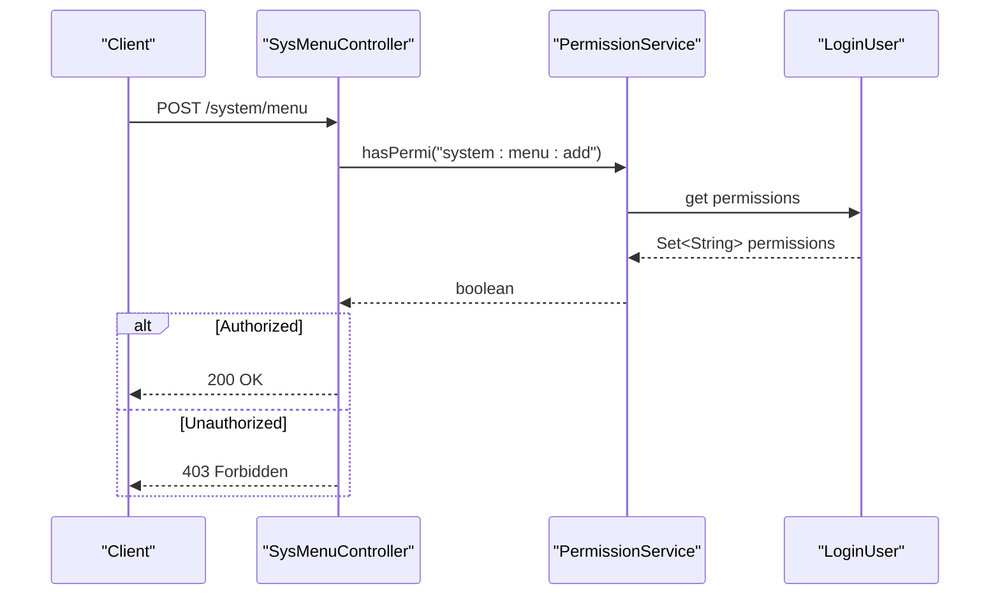
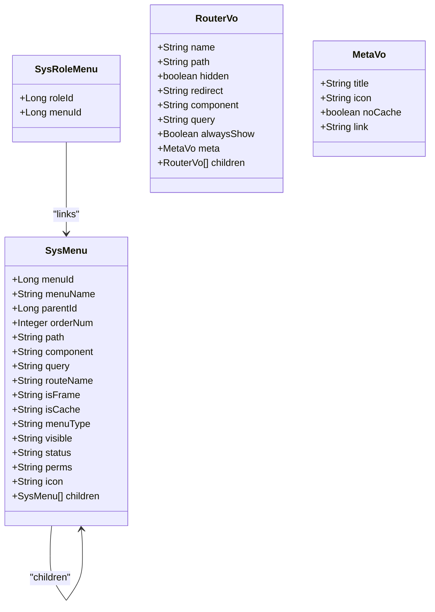
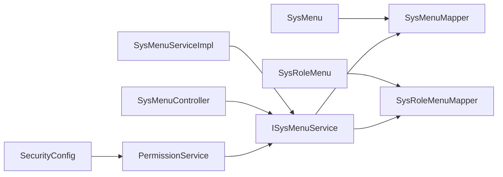

# Menu & Permission Management

<cite>
**Referenced Files in This Document**
- [ry_20250522.sql](file://sql/ry_20250522.sql)
- [SysMenu.java](file://src/main/java/com/ruoyi/project/system/domain/SysMenu.java)
- [SysRoleMenu.java](file://src/main/java/com/ruoyi/project/system/domain/SysRoleMenu.java)
- [SysMenuMapper.xml](file://src/main/resources/mybatis/system/SysMenuMapper.xml)
- [SysRoleMenuMapper.xml](file://src/main/resources/mybatis/system/SysRoleMenuMapper.xml)
- [ISysMenuService.java](file://src/main/java/com/ruoyi/project/system/service/ISysMenuService.java)
- [SysMenuServiceImpl.java](file://src/main/java/com/ruoyi/project/system/service/impl/SysMenuServiceImpl.java)
- [SysMenuController.java](file://src/main/java/com/ruoyi/project/system/controller/SysMenuController.java)
- [RouterVo.java](file://src/main/java/com/ruoyi/project/system/domain/vo/RouterVo.java)
- [MetaVo.java](file://src/main/java/com/ruoyi/project/system/domain/vo/MetaVo.java)
- [UserConstants.java](file://src/main/java/com/ruoyi/common/constant/UserConstants.java)
- [PermissionService.java](file://src/main/java/com/ruoyi/framework/security/service/PermissionService.java)
- [SecurityConfig.java](file://src/main/java/com/ruoyi/framework/config/SecurityConfig.java)
</cite>

## Table of Contents
1. [Introduction](#introduction)
2. [Project Structure](#project-structure)
3. [Core Components](#core-components)
4. [Architecture Overview](#architecture-overview)
5. [Detailed Component Analysis](#detailed-component-analysis)
6. [Dependency Analysis](#dependency-analysis)
7. [Performance Considerations](#performance-considerations)
8. [Troubleshooting Guide](#troubleshooting-guide)
9. [Conclusion](#conclusion)
10. [Appendices](#appendices)

## Introduction
This document explains the menu and permission management tables in the RuoYi-Vue system. It focuses on:
- The sys_menu table structure and hierarchical organization
- Routing configuration and UI properties
- Permission control via perms and menu_type
- The three-level menu hierarchy (directory, menu, button)
- The sys_role_menu junction table establishing many-to-many relationships
- Initialization data showing the complete menu tree and role-menu assignments
- Dynamic menu loading based on user permissions
- Integration of perms with Spring Security annotations

## Project Structure
The menu and permission management spans domain models, MyBatis mappers, services, controllers, and security integration.

**Diagram sources**
- [ry_20250522.sql](file://sql/ry_20250522.sql#L130-L170)
- [SysMenu.java](file://src/main/java/com/ruoyi/project/system/domain/SysMenu.java#L1-L275)
- [SysRoleMenu.java](file://src/main/java/com/ruoyi/project/system/domain/SysRoleMenu.java#L1-L47)
- [SysMenuMapper.xml](file://src/main/resources/mybatis/system/SysMenuMapper.xml#L1-L206)
- [SysRoleMenuMapper.xml](file://src/main/resources/mybatis/system/SysRoleMenuMapper.xml#L1-L34)
- [ISysMenuService.java](file://src/main/java/com/ruoyi/project/system/service/ISysMenuService.java#L1-L145)
- [SysMenuServiceImpl.java](file://src/main/java/com/ruoyi/project/system/service/impl/SysMenuServiceImpl.java#L1-L544)
- [SysMenuController.java](file://src/main/java/com/ruoyi/project/system/controller/SysMenuController.java#L1-L142)
- [PermissionService.java](file://src/main/java/com/ruoyi/framework/security/service/PermissionService.java#L1-L159)
- [SecurityConfig.java](file://src/main/java/com/ruoyi/framework/config/SecurityConfig.java#L21-L76)

**Section sources**
- [ry_20250522.sql](file://sql/ry_20250522.sql#L130-L170)
- [SysMenu.java](file://src/main/java/com/ruoyi/project/system/domain/SysMenu.java#L1-L275)
- [SysRoleMenu.java](file://src/main/java/com/ruoyi/project/system/domain/SysRoleMenu.java#L1-L47)
- [SysMenuMapper.xml](file://src/main/resources/mybatis/system/SysMenuMapper.xml#L1-L206)
- [SysRoleMenuMapper.xml](file://src/main/resources/mybatis/system/SysRoleMenuMapper.xml#L1-L34)
- [ISysMenuService.java](file://src/main/java/com/ruoyi/project/system/service/ISysMenuService.java#L1-L145)
- [SysMenuServiceImpl.java](file://src/main/java/com/ruoyi/project/system/service/impl/SysMenuServiceImpl.java#L1-L544)
- [SysMenuController.java](file://src/main/java/com/ruoyi/project/system/controller/SysMenuController.java#L1-L142)
- [PermissionService.java](file://src/main/java/com/ruoyi/framework/security/service/PermissionService.java#L1-L159)
- [SecurityConfig.java](file://src/main/java/com/ruoyi/framework/config/SecurityConfig.java#L21-L76)

## Core Components
- sys_menu: Stores menu definitions with hierarchical parent-child relationships, routing metadata, UI attributes, and permission identifiers.
- sys_role_menu: Junction table linking roles to menus (many-to-many).
- Domain model SysMenu: Java representation of sys_menu with navigation children.
- Domain model SysRoleMenu: Java representation of sys_role_menu.
- MyBatis mappers: SQL queries for menu lists, trees, and permission extraction.
- Services: Build menu trees, extract permissions, and transform to frontend RouterVo/MetaVo.
- Controller: Exposes endpoints for menu CRUD and tree selection.
- Security: Spring Security integration via @PreAuthorize annotations and PermissionService.

**Section sources**
- [ry_20250522.sql](file://sql/ry_20250522.sql#L130-L170)
- [SysMenu.java](file://src/main/java/com/ruoyi/project/system/domain/SysMenu.java#L1-L275)
- [SysRoleMenu.java](file://src/main/java/com/ruoyi/project/system/domain/SysRoleMenu.java#L1-L47)
- [SysMenuMapper.xml](file://src/main/resources/mybatis/system/SysMenuMapper.xml#L1-L206)
- [SysRoleMenuMapper.xml](file://src/main/resources/mybatis/system/SysRoleMenuMapper.xml#L1-L34)
- [ISysMenuService.java](file://src/main/java/com/ruoyi/project/system/service/ISysMenuService.java#L1-L145)
- [SysMenuServiceImpl.java](file://src/main/java/com/ruoyi/project/system/service/impl/SysMenuServiceImpl.java#L1-L544)
- [SysMenuController.java](file://src/main/java/com/ruoyi/project/system/controller/SysMenuController.java#L1-L142)
- [PermissionService.java](file://src/main/java/com/ruoyi/framework/security/service/PermissionService.java#L1-L159)

## Architecture Overview
The system builds a user-specific menu tree from database rows joined across sys_menu, sys_role_menu, and sys_user_role. Permissions are aggregated per user and exposed to the frontend as RouterVo structures. Spring Security annotations enforce authorization at controller endpoints.

**Diagram sources**
- [SysMenuController.java](file://src/main/java/com/ruoyi/project/system/controller/SysMenuController.java#L56-L65)
- [ISysMenuService.java](file://src/main/java/com/ruoyi/project/system/service/ISysMenuService.java#L1-L145)
- [SysMenuServiceImpl.java](file://src/main/java/com/ruoyi/project/system/service/impl/SysMenuServiceImpl.java#L48-L80)
- [SysMenuMapper.xml](file://src/main/resources/mybatis/system/SysMenuMapper.xml#L52-L86)

## Detailed Component Analysis

### sys_menu Table Structure and Fields
- Hierarchical organization:
  - parent_id: Self-referencing foreign key forming a tree.
  - order_num: Sort order within siblings.
- Routing configuration:
  - path: Route path string.
  - component: Vue component path or null.
  - query: Route query parameters string.
  - route_name: Route name; defaults derived from path if empty.
  - is_frame: External link indicator (0 yes, 1 no).
  - is_cache: Whether to cache the route view (0 cache, 1 no cache).
- UI properties:
  - visible: Show/hide flag (0 show, 1 hide).
  - icon: Icon identifier for UI.
- Permission control:
  - perms: Comma-separated permission identifiers.
  - menu_type: 'M' directory, 'C' menu, 'F' button.
  - status: Active/inactive flag (0 active, 1 inactive).

These fields collectively define how menus render in the frontend router and how permissions are enforced.

**Section sources**
- [ry_20250522.sql](file://sql/ry_20250522.sql#L130-L170)
- [SysMenu.java](file://src/main/java/com/ruoyi/project/system/domain/SysMenu.java#L1-L275)

### Three-Level Menu Hierarchy and Rendering
- Level 1 (Directory): menu_type = 'M'. Rendered as a collapsible group in the sidebar.
- Level 2 (Menu): menu_type = 'C'. Rendered as a clickable route with optional children.
- Level 3 (Button): menu_type = 'F'. Not rendered as a route; used for action-level permissions.

Rendering logic in the service:
- Directories with children are shown with alwaysShow and redirect behavior.
- Menus with external links are handled as inner-link components.
- Root-level menus with is_frame='1' and menu_type='C' become root routes.

**Section sources**
- [UserConstants.java](file://src/main/java/com/ruoyi/common/constant/UserConstants.java#L48-L56)
- [SysMenuServiceImpl.java](file://src/main/java/com/ruoyi/project/system/service/impl/SysMenuServiceImpl.java#L165-L214)
- [RouterVo.java](file://src/main/java/com/ruoyi/project/system/domain/vo/RouterVo.java#L1-L149)
- [MetaVo.java](file://src/main/java/com/ruoyi/project/system/domain/vo/MetaVo.java#L1-L107)

### sys_role_menu Junction Table
- role_id and menu_id form a composite primary key.
- Establishes many-to-many relationship between roles and menus.
- Used to filter accessible menus per user via joins with sys_user_role.

Initialization data assigns extensive permissions to the common role, enabling broad access for demonstration.

**Section sources**
- [ry_20250522.sql](file://sql/ry_20250522.sql#L282-L316)
- [SysRoleMenu.java](file://src/main/java/com/ruoyi/project/system/domain/SysRoleMenu.java#L1-L47)
- [SysRoleMenuMapper.xml](file://src/main/resources/mybatis/system/SysRoleMenuMapper.xml#L1-L34)

### Initialization Data: Menu Tree and Role Assignments
- sys_menu initialization defines a complete tree:
  - Top-level directories: system, monitor, tool, external site.
  - Child menus under each directory.
  - Buttons under each functional menu.
- sys_role_menu initialization grants comprehensive access to the common role.

This dataset demonstrates:
- The full hierarchical structure.
- How buttons (menu_type='F') are attached to parent menus.
- How role-menu assignments enable dynamic filtering.

**Section sources**
- [ry_20250522.sql](file://sql/ry_20250522.sql#L158-L379)

### Dynamic Menu Loading Based on User Permissions
- Service layer:
  - selectMenuTreeByUserId loads only menus accessible to the user by joining sys_menu → sys_role_menu → sys_user_role.
  - getChildPerms builds a flat list into a hierarchical tree rooted at parentId=0.
- Frontend:
  - RouterVo/MetaVo encapsulate route metadata for Vue Router.
  - buildMenus transforms SysMenu nodes into RouterVo subtrees.

**Diagram sources**
- [SysMenuServiceImpl.java](file://src/main/java/com/ruoyi/project/system/service/impl/SysMenuServiceImpl.java#L130-L143)
- [SysMenuMapper.xml](file://src/main/resources/mybatis/system/SysMenuMapper.xml#L52-L86)

**Section sources**
- [SysMenuServiceImpl.java](file://src/main/java/com/ruoyi/project/system/service/impl/SysMenuServiceImpl.java#L130-L143)
- [SysMenuMapper.xml](file://src/main/resources/mybatis/system/SysMenuMapper.xml#L52-L86)

### perms Field and Spring Security Annotations
- perms in sys_menu holds comma-separated permission identifiers (e.g., "system:user:list").
- Controller endpoints use @PreAuthorize annotations referencing these identifiers (e.g., "system:menu:list").
- PermissionService checks whether the logged-in user’s permission set includes the requested permission.

**Diagram sources**
- [SysMenuController.java](file://src/main/java/com/ruoyi/project/system/controller/SysMenuController.java#L80-L106)
- [PermissionService.java](file://src/main/java/com/ruoyi/framework/security/service/PermissionService.java#L21-L40)
- [SecurityConfig.java](file://src/main/java/com/ruoyi/framework/config/SecurityConfig.java#L21-L76)

**Section sources**
- [SysMenuController.java](file://src/main/java/com/ruoyi/project/system/controller/SysMenuController.java#L36-L106)
- [PermissionService.java](file://src/main/java/com/ruoyi/framework/security/service/PermissionService.java#L1-L159)
- [SecurityConfig.java](file://src/main/java/com/ruoyi/framework/config/SecurityConfig.java#L21-L76)

### Recursive Queries in MyBatis Mappers
The mappers provide several recursive-style operations:
- selectMenuTreeAll: Loads all directories and menus for admin.
- selectMenuTreeByUserId: Loads accessible menus for a user.
- selectMenuListByRoleId: Optionally excludes parent directories depending on role settings.
- selectMenuPermsByUserId: Aggregates distinct perms for a user.

These queries enable building user-specific menu trees and permission sets.

**Section sources**
- [SysMenuMapper.xml](file://src/main/resources/mybatis/system/SysMenuMapper.xml#L52-L121)
- [SysRoleMenuMapper.xml](file://src/main/resources/mybatis/system/SysRoleMenuMapper.xml#L1-L34)

### Class Model Relationships

**Diagram sources**
- [SysMenu.java](file://src/main/java/com/ruoyi/project/system/domain/SysMenu.java#L1-L275)
- [SysRoleMenu.java](file://src/main/java/com/ruoyi/project/system/domain/SysRoleMenu.java#L1-L47)
- [RouterVo.java](file://src/main/java/com/ruoyi/project/system/domain/vo/RouterVo.java#L1-L149)
- [MetaVo.java](file://src/main/java/com/ruoyi/project/system/domain/vo/MetaVo.java#L1-L107)

## Dependency Analysis
- Domain models depend on base entity infrastructure.
- Service layer depends on mappers and role/permission utilities.
- Controller depends on service and Spring Security annotations.
- Security configuration enables method-level security and JWT filters.

**Diagram sources**
- [SysMenu.java](file://src/main/java/com/ruoyi/project/system/domain/SysMenu.java#L1-L275)
- [SysRoleMenu.java](file://src/main/java/com/ruoyi/project/system/domain/SysRoleMenu.java#L1-L47)
- [SysMenuMapper.xml](file://src/main/resources/mybatis/system/SysMenuMapper.xml#L1-L206)
- [SysRoleMenuMapper.xml](file://src/main/resources/mybatis/system/SysRoleMenuMapper.xml#L1-L34)
- [ISysMenuService.java](file://src/main/java/com/ruoyi/project/system/service/ISysMenuService.java#L1-L145)
- [SysMenuServiceImpl.java](file://src/main/java/com/ruoyi/project/system/service/impl/SysMenuServiceImpl.java#L1-L544)
- [SysMenuController.java](file://src/main/java/com/ruoyi/project/system/controller/SysMenuController.java#L1-L142)
- [PermissionService.java](file://src/main/java/com/ruoyi/framework/security/service/PermissionService.java#L1-L159)
- [SecurityConfig.java](file://src/main/java/com/ruoyi/framework/config/SecurityConfig.java#L21-L76)

**Section sources**
- [SysMenuServiceImpl.java](file://src/main/java/com/ruoyi/project/system/service/impl/SysMenuServiceImpl.java#L1-L544)
- [SysMenuController.java](file://src/main/java/com/ruoyi/project/system/controller/SysMenuController.java#L1-L142)
- [PermissionService.java](file://src/main/java/com/ruoyi/framework/security/service/PermissionService.java#L1-L159)
- [SecurityConfig.java](file://src/main/java/com/ruoyi/framework/config/SecurityConfig.java#L21-L76)

## Performance Considerations
- Prefer selectMenuTreeByUserId for non-admin users to minimize data transfer.
- Use selectMenuPermsByUserId to avoid redundant permission parsing in the client.
- Avoid excessive nesting in the menu tree; keep menu_type='F' buttons scoped to parent menus.
- Indexes on sys_menu(parent_id, menu_type, status) and sys_role_menu(role_id, menu_id) improve query performance.

[No sources needed since this section provides general guidance]

## Troubleshooting Guide
- If a menu does not appear:
  - Verify status=0 and menu_type in ('M','C').
  - Confirm the user has a role assignment in sys_user_role and the role has a corresponding sys_role_menu entry.
- If a button action fails:
  - Ensure perms exists and matches the @PreAuthorize annotation.
  - Confirm the user’s permissions include the required identifier.
- If external links fail:
  - Check is_frame and path combination; external links must be http(s) URLs.

**Section sources**
- [SysMenuMapper.xml](file://src/main/resources/mybatis/system/SysMenuMapper.xml#L52-L121)
- [SysMenuController.java](file://src/main/java/com/ruoyi/project/system/controller/SysMenuController.java#L80-L106)
- [PermissionService.java](file://src/main/java/com/ruoyi/framework/security/service/PermissionService.java#L1-L159)

## Conclusion
RuoYi-Vue’s menu and permission system combines a normalized relational schema (sys_menu, sys_role_menu) with a service-layer transformation pipeline that builds hierarchical trees and exposes RouterVo-compatible structures. Permissions are enforced via Spring Security annotations against the perms identifiers stored in sys_menu. The initialization data demonstrates a comprehensive menu tree and extensive role-menu assignments suitable for development and testing.

[No sources needed since this section summarizes without analyzing specific files]

## Appendices

### Appendix A: Example Recursive Queries from MyBatis
- Menu tree for admin: selectMenuTreeAll
- Menu tree for user: selectMenuTreeByUserId
- Menu list for role: selectMenuListByRoleId
- Permissions for user: selectMenuPermsByUserId

**Section sources**
- [SysMenuMapper.xml](file://src/main/resources/mybatis/system/SysMenuMapper.xml#L52-L121)