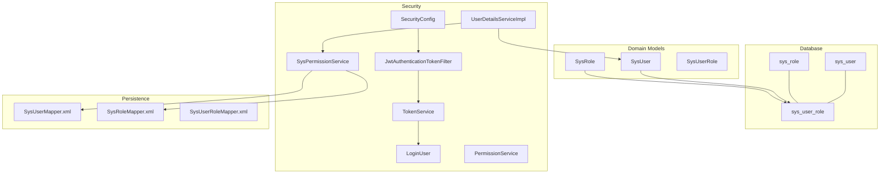
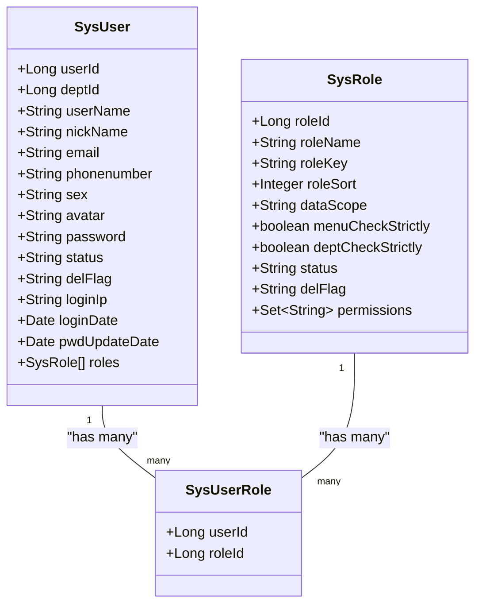
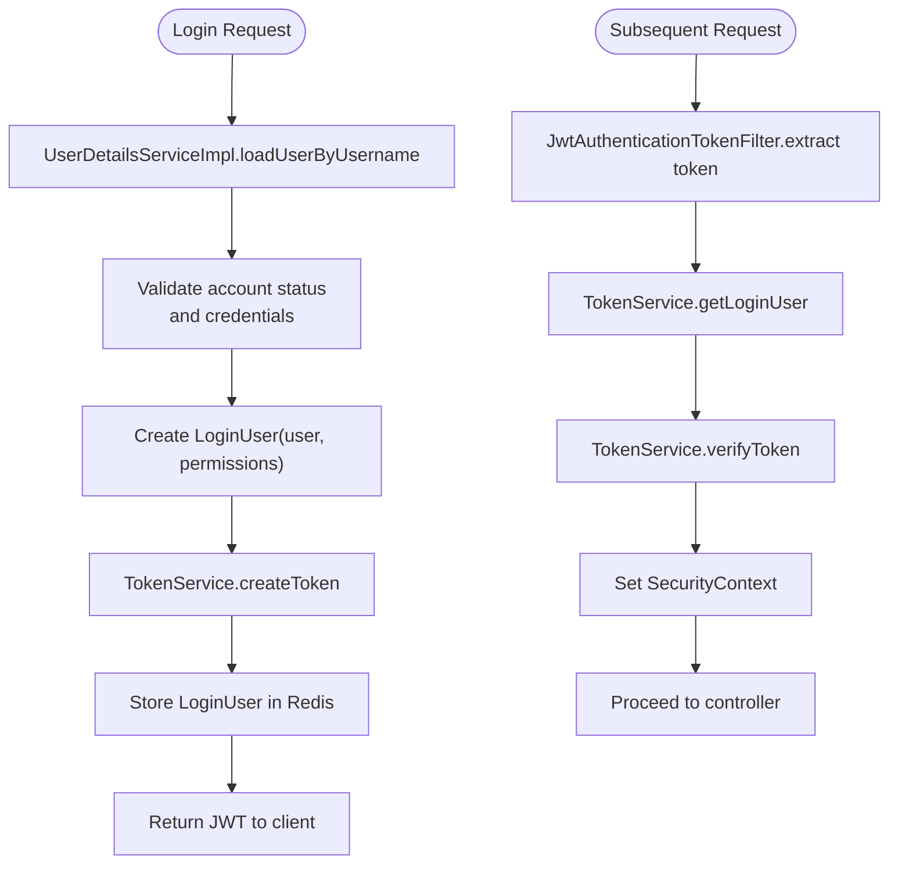
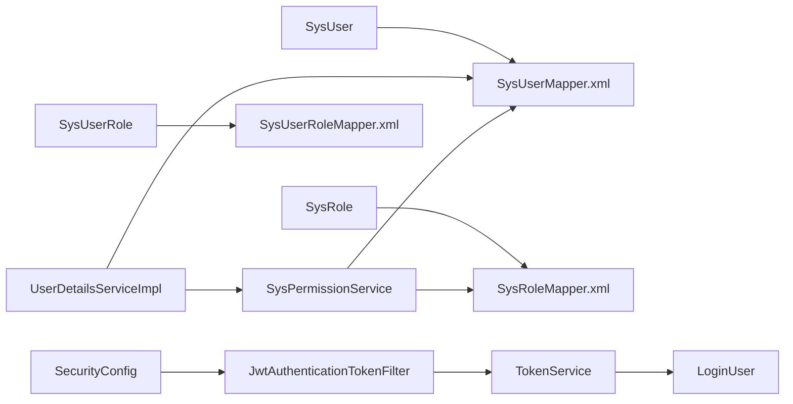

# User & Role Management

<cite>
**Referenced Files in This Document**
- [ry_20250522.sql](file://sql/ry_20250522.sql)
- [SysUser.java](file://src/main/java/com/ruoyi/project/system/domain/SysUser.java)
- [SysRole.java](file://src/main/java/com/ruoyi/project/system/domain/SysRole.java)
- [SysUserRole.java](file://src/main/java/com/ruoyi/project/system/domain/SysUserRole.java)
- [SysUserMapper.xml](file://src/main/resources/mybatis/system/SysUserMapper.xml)
- [SysUserRoleMapper.xml](file://src/main/resources/mybatis/system/SysUserRoleMapper.xml)
- [SysRoleMapper.xml](file://src/main/resources/mybatis/system/SysRoleMapper.xml)
- [UserDetailsServiceImpl.java](file://src/main/java/com/ruoyi/framework/security/service/UserDetailsServiceImpl.java)
- [SysPermissionService.java](file://src/main/java/com/ruoyi/framework/security/service/SysPermissionService.java)
- [PermissionService.java](file://src/main/java/com/ruoyi/framework/security/service/PermissionService.java)
- [TokenService.java](file://src/main/java/com/ruoyi/framework/security/service/TokenService.java)
- [JwtAuthenticationTokenFilter.java](file://src/main/java/com/ruoyi/framework/security/filter/JwtAuthenticationTokenFilter.java)
- [SecurityConfig.java](file://src/main/java/com/ruoyi/framework/config/SecurityConfig.java)
- [Constants.java](file://src/main/java/com/ruoyi/common/constant/Constants.java)
</cite>

## Table of Contents
1. [Introduction](#introduction)
2. [Project Structure](#project-structure)
3. [Core Components](#core-components)
4. [Architecture Overview](#architecture-overview)
5. [Detailed Component Analysis](#detailed-component-analysis)
6. [Dependency Analysis](#dependency-analysis)
7. [Performance Considerations](#performance-considerations)
8. [Troubleshooting Guide](#troubleshooting-guide)
9. [Conclusion](#conclusion)

## Introduction
This document explains the user and role management tables in the RuoYi-Vue system, focusing on:
- Purpose and structure of sys_user, sys_role, and sys_user_role
- Field-level details relevant to authentication (password, status) and authorization (role_key, data_scope)
- Many-to-many relationship between users and roles
- Initialization data including the default admin user (user_id=1) and role assignments
- How these tables integrate with the security framework to support authentication, authorization, and permission checking
- Interaction between entities and security components such as LoginUser, TokenService, and PermissionService
- Example MyBatis mapper queries for user-role resolution and permission validation

## Project Structure
The user and role management functionality spans SQL schema, domain models, MyBatis mappers, and Spring Security integration:
- Database schema defines the three core tables and initial data
- Domain models represent entities and relationships
- MyBatis mappers resolve joins and aggregates for user-role and role-permission resolution
- Security components bind authentication, token management, and permission checks



**Diagram sources**
- [ry_20250522.sql](file://sql/ry_20250522.sql#L41-L63)
- [ry_20250522.sql](file://sql/ry_20250522.sql#L102-L121)
- [ry_20250522.sql](file://sql/ry_20250522.sql#L265-L279)
- [SysUser.java](file://src/main/java/com/ruoyi/project/system/domain/SysUser.java#L21-L341)
- [SysRole.java](file://src/main/java/com/ruoyi/project/system/domain/SysRole.java#L1-L242)
- [SysUserRole.java](file://src/main/java/com/ruoyi/project/system/domain/SysUserRole.java#L1-L47)
- [UserDetailsServiceImpl.java](file://src/main/java/com/ruoyi/framework/security/service/UserDetailsServiceImpl.java#L36-L66)
- [SysPermissionService.java](file://src/main/java/com/ruoyi/framework/security/service/SysPermissionService.java#L37-L88)
- [PermissionService.java](file://src/main/java/com/ruoyi/framework/security/service/PermissionService.java#L27-L159)
- [TokenService.java](file://src/main/java/com/ruoyi/framework/security/service/TokenService.java#L58-L171)
- [JwtAuthenticationTokenFilter.java](file://src/main/java/com/ruoyi/framework/security/filter/JwtAuthenticationTokenFilter.java#L31-L44)
- [SecurityConfig.java](file://src/main/java/com/ruoyi/framework/config/SecurityConfig.java#L96-L129)
- [SysUserMapper.xml](file://src/main/resources/mybatis/system/SysUserMapper.xml#L50-L58)
- [SysRoleMapper.xml](file://src/main/resources/mybatis/system/SysRoleMapper.xml#L24-L31)
- [SysUserRoleMapper.xml](file://src/main/resources/mybatis/system/SysUserRoleMapper.xml#L12-L18)

**Section sources**
- [ry_20250522.sql](file://sql/ry_20250522.sql#L41-L63)
- [ry_20250522.sql](file://sql/ry_20250522.sql#L102-L121)
- [ry_20250522.sql](file://sql/ry_20250522.sql#L265-L279)
- [SysUser.java](file://src/main/java/com/ruoyi/project/system/domain/SysUser.java#L21-L341)
- [SysRole.java](file://src/main/java/com/ruoyi/project/system/domain/SysRole.java#L1-L242)
- [SysUserRole.java](file://src/main/java/com/ruoyi/project/system/domain/SysUserRole.java#L1-L47)
- [SysUserMapper.xml](file://src/main/resources/mybatis/system/SysUserMapper.xml#L50-L58)
- [SysRoleMapper.xml](file://src/main/resources/mybatis/system/SysRoleMapper.xml#L24-L31)
- [SysUserRoleMapper.xml](file://src/main/resources/mybatis/system/SysUserRoleMapper.xml#L12-L18)

## Core Components
- sys_user: Stores user identity and authentication fields (username, password, status, login metadata) and links to department via dept_id.
- sys_role: Defines roles with role_key (used for authorization checks), data_scope (controls data visibility), and status.
- sys_user_role: Junction table implementing many-to-many relationship between users and roles.

Initialization highlights:
- Default admin user (user_id=1) with role_key=admin assigned via sys_user_role.
- Normal user (user_id=2) with role_key=common assigned via sys_user_role.

These tables underpin:
- Authentication: username/password retrieval and validation
- Authorization: role_key and data_scope for permission and data scope checks
- Permission aggregation: combined permissions derived from roles and menus

**Section sources**
- [ry_20250522.sql](file://sql/ry_20250522.sql#L41-L63)
- [ry_20250522.sql](file://sql/ry_20250522.sql#L102-L121)
- [ry_20250522.sql](file://sql/ry_20250522.sql#L265-L279)
- [SysUser.java](file://src/main/java/com/ruoyi/project/system/domain/SysUser.java#L21-L341)
- [SysRole.java](file://src/main/java/com/ruoyi/project/system/domain/SysRole.java#L1-L242)
- [SysUserRole.java](file://src/main/java/com/ruoyi/project/system/domain/SysUserRole.java#L1-L47)

## Architecture Overview
The security architecture integrates database-backed user/role data with Spring Security and JWT tokens:

```mermaid
sequenceDiagram
participant Client as "Client"
participant Filter as "JwtAuthenticationTokenFilter"
participant Token as "TokenService"
participant Details as "UserDetailsServiceImpl"
participant Perm as "SysPermissionService"
participant DB as "MyBatis Mappers"
Client->>Filter : "HTTP request with Authorization header"
Filter->>Token : "getLoginUser(request)"
Token->>Token : "parse token and build userKey"
Token->>Token : "getCacheObject(userKey)"
Token-->>Filter : "LoginUser"
Filter->>Token : "verifyToken(loginUser)"
Filter->>Filter : "set SecurityContext"
Client->>Details : "Subsequent requests"
Details->>DB : "selectUserByUserName"
DB-->>Details : "SysUser with roles"
Details->>Perm : "getMenuPermission(user)"
Perm->>DB : "selectRolePermissionByUserId / selectMenuPermsByRoleId"
DB-->>Perm : "roleKey and menu perms"
Perm-->>Details : "Set<String> permissions"
Details-->>Client : "Authenticated with authorities"
```

**Diagram sources**
- [JwtAuthenticationTokenFilter.java](file://src/main/java/com/ruoyi/framework/security/filter/JwtAuthenticationTokenFilter.java#L31-L44)
- [TokenService.java](file://src/main/java/com/ruoyi/framework/security/service/TokenService.java#L58-L171)
- [UserDetailsServiceImpl.java](file://src/main/java/com/ruoyi/framework/security/service/UserDetailsServiceImpl.java#L36-L66)
- [SysPermissionService.java](file://src/main/java/com/ruoyi/framework/security/service/SysPermissionService.java#L37-L88)
- [SysUserMapper.xml](file://src/main/resources/mybatis/system/SysUserMapper.xml#L124-L132)
- [SysRoleMapper.xml](file://src/main/resources/mybatis/system/SysRoleMapper.xml#L59-L62)

## Detailed Component Analysis

### Database Schema and Initialization
- sys_user fields relevant to authentication and profile:
  - user_id (PK), dept_id, user_name, nick_name, email, phonenumber, sex, avatar, password, status, del_flag, login_ip, login_date, pwd_update_date, timestamps
- sys_role fields relevant to authorization:
  - role_id (PK), role_name, role_key, role_sort, data_scope, menu_check_strictly, dept_check_strictly, status, del_flag, timestamps
- sys_user_role implements many-to-many:
  - composite PK (user_id, role_id) linking sys_user and sys_role

Initialization data:
- Admin user (user_id=1) assigned role_key=admin via sys_user_role
- Normal user (user_id=2) assigned role_key=common via sys_user_role

These tables enable:
- User lookup by username and password verification
- Role assignment and data scope enforcement
- Permission aggregation from roles and menus

**Section sources**
- [ry_20250522.sql](file://sql/ry_20250522.sql#L41-L63)
- [ry_20250522.sql](file://sql/ry_20250522.sql#L102-L121)
- [ry_20250522.sql](file://sql/ry_20250522.sql#L265-L279)

### Domain Models and Relationships
- SysUser: Holds user attributes and a list of SysRole instances loaded via MyBatis joins
- SysRole: Holds role attributes including roleKey and permissions populated by SysPermissionService
- SysUserRole: Minimal entity representing the junction record



**Diagram sources**
- [SysUser.java](file://src/main/java/com/ruoyi/project/system/domain/SysUser.java#L21-L341)
- [SysRole.java](file://src/main/java/com/ruoyi/project/system/domain/SysRole.java#L1-L242)
- [SysUserRole.java](file://src/main/java/com/ruoyi/project/system/domain/SysUserRole.java#L1-L47)

**Section sources**
- [SysUser.java](file://src/main/java/com/ruoyi/project/system/domain/SysUser.java#L21-L341)
- [SysRole.java](file://src/main/java/com/ruoyi/project/system/domain/SysRole.java#L1-L242)
- [SysUserRole.java](file://src/main/java/com/ruoyi/project/system/domain/SysUserRole.java#L1-L47)

### MyBatis Mappers: User-Role Resolution and Permission Validation
- SysUserMapper.xml:
  - Joins sys_user with sys_dept and sys_user_role and sys_role to populate SysUser.roles
  - Provides queries for user lists, allocated/unallocated users by role, and unique checks
- SysRoleMapper.xml:
  - Selects roles by user, role keys, and IDs; resolves role permissions by user
- SysUserRoleMapper.xml:
  - Manages deletion and batch insertion of user-role assignments

Common query patterns:
- User by username with roles: [SysUserMapper.xml](file://src/main/resources/mybatis/system/SysUserMapper.xml#L124-L132)
- Roles by user ID: [SysRoleMapper.xml](file://src/main/resources/mybatis/system/SysRoleMapper.xml#L59-L62)
- Role IDs by user ID: [SysRoleMapper.xml](file://src/main/resources/mybatis/system/SysRoleMapper.xml#L68-L74)
- Count user-role associations by role ID: [SysUserRoleMapper.xml](file://src/main/resources/mybatis/system/SysUserRoleMapper.xml#L16-L18)
- Batch insert user-role pairs: [SysUserRoleMapper.xml](file://src/main/resources/mybatis/system/SysUserRoleMapper.xml#L27-L32)

These mappers support:
- Loading user profiles with role collections
- Resolving role keys and permissions for authorization
- Managing role assignments during user creation/editing

**Section sources**
- [SysUserMapper.xml](file://src/main/resources/mybatis/system/SysUserMapper.xml#L50-L58)
- [SysUserMapper.xml](file://src/main/resources/mybatis/system/SysUserMapper.xml#L124-L132)
- [SysRoleMapper.xml](file://src/main/resources/mybatis/system/SysRoleMapper.xml#L59-L62)
- [SysRoleMapper.xml](file://src/main/resources/mybatis/system/SysRoleMapper.xml#L68-L74)
- [SysUserRoleMapper.xml](file://src/main/resources/mybatis/system/SysUserRoleMapper.xml#L16-L18)
- [SysUserRoleMapper.xml](file://src/main/resources/mybatis/system/SysUserRoleMapper.xml#L27-L32)

### Security Integration: Authentication, Tokens, and Permissions
- UserDetailsServiceImpl:
  - Loads SysUser by username, validates account status, delegates password validation, and constructs LoginUser with permissions
- SysPermissionService:
  - Computes role permissions (roleKey) and menu permissions for a user; administrators receive wildcard permissions
- PermissionService:
  - Exposes hasPermi, hasAnyPermi, hasRole, hasAnyRoles for runtime checks
- TokenService:
  - Creates JWT tokens, stores LoginUser in Redis keyed by token, refreshes expirations, and extracts user from token
- JwtAuthenticationTokenFilter:
  - Reads Authorization header, retrieves LoginUser from Redis, sets SecurityContext, and refreshes token TTL
- SecurityConfig:
  - Configures stateless session policy, permits anonymous access to selected endpoints, and registers filters



**Diagram sources**
- [UserDetailsServiceImpl.java](file://src/main/java/com/ruoyi/framework/security/service/UserDetailsServiceImpl.java#L36-L66)
- [SysPermissionService.java](file://src/main/java/com/ruoyi/framework/security/service/SysPermissionService.java#L37-L88)
- [PermissionService.java](file://src/main/java/com/ruoyi/framework/security/service/PermissionService.java#L27-L159)
- [TokenService.java](file://src/main/java/com/ruoyi/framework/security/service/TokenService.java#L114-L171)
- [JwtAuthenticationTokenFilter.java](file://src/main/java/com/ruoyi/framework/security/filter/JwtAuthenticationTokenFilter.java#L31-L44)
- [SecurityConfig.java](file://src/main/java/com/ruoyi/framework/config/SecurityConfig.java#L96-L129)

**Section sources**
- [UserDetailsServiceImpl.java](file://src/main/java/com/ruoyi/framework/security/service/UserDetailsServiceImpl.java#L36-L66)
- [SysPermissionService.java](file://src/main/java/com/ruoyi/framework/security/service/SysPermissionService.java#L37-L88)
- [PermissionService.java](file://src/main/java/com/ruoyi/framework/security/service/PermissionService.java#L27-L159)
- [TokenService.java](file://src/main/java/com/ruoyi/framework/security/service/TokenService.java#L58-L171)
- [JwtAuthenticationTokenFilter.java](file://src/main/java/com/ruoyi/framework/security/filter/JwtAuthenticationTokenFilter.java#L31-L44)
- [SecurityConfig.java](file://src/main/java/com/ruoyi/framework/config/SecurityConfig.java#L96-L129)

### Field-Level Details and Their Roles
- sys_user.password:
  - Used for authentication; validated against submitted credentials
- sys_user.status:
  - Controls whether an account is enabled/disabled
- sys_user.del_flag:
  - Soft-deletion marker; affects visibility in queries
- sys_user.login_ip/login_date:
  - Audit fields updated upon successful login
- sys_role.role_key:
  - Primary authorization identifier; checked by PermissionService.hasRole
- sys_role.data_scope:
  - Determines data visibility rules for reports and filtering
- sys_user_role:
  - Enforces many-to-many mapping; used for role assignment and bulk operations

**Section sources**
- [ry_20250522.sql](file://sql/ry_20250522.sql#L41-L63)
- [ry_20250522.sql](file://sql/ry_20250522.sql#L102-L121)
- [ry_20250522.sql](file://sql/ry_20250522.sql#L265-L279)
- [SysUser.java](file://src/main/java/com/ruoyi/project/system/domain/SysUser.java#L21-L341)
- [SysRole.java](file://src/main/java/com/ruoyi/project/system/domain/SysRole.java#L1-L242)
- [SysUserRole.java](file://src/main/java/com/ruoyi/project/system/domain/SysUserRole.java#L1-L47)

### Initialization Data and Assignments
- Admin user (user_id=1):
  - Assigned role_key=admin via sys_user_role
  - Grants super-admin privileges in PermissionService checks
- Normal user (user_id=2):
  - Assigned role_key=common via sys_user_role
  - Inherits permissions from associated roles and menus

**Section sources**
- [ry_20250522.sql](file://sql/ry_20250522.sql#L69-L71)
- [ry_20250522.sql](file://sql/ry_20250522.sql#L126-L128)
- [ry_20250522.sql](file://sql/ry_20250522.sql#L277-L279)

## Dependency Analysis
- Domain models depend on MyBatis resultMaps to hydrate relationships
- UserDetailsServiceImpl depends on ISysUserService and SysPermissionService
- SysPermissionService depends on ISysRoleService and ISysMenuService to compute permissions
- PermissionService depends on SecurityUtils and Constants for runtime checks
- TokenService depends on RedisCache and JWT libraries
- JwtAuthenticationTokenFilter depends on TokenService and SecurityUtils
- SecurityConfig wires filters and permits anonymous endpoints



**Diagram sources**
- [SysUser.java](file://src/main/java/com/ruoyi/project/system/domain/SysUser.java#L21-L341)
- [SysRole.java](file://src/main/java/com/ruoyi/project/system/domain/SysRole.java#L1-L242)
- [SysUserRole.java](file://src/main/java/com/ruoyi/project/system/domain/SysUserRole.java#L1-L47)
- [SysUserMapper.xml](file://src/main/resources/mybatis/system/SysUserMapper.xml#L50-L58)
- [SysRoleMapper.xml](file://src/main/resources/mybatis/system/SysRoleMapper.xml#L24-L31)
- [SysUserRoleMapper.xml](file://src/main/resources/mybatis/system/SysUserRoleMapper.xml#L12-L18)
- [UserDetailsServiceImpl.java](file://src/main/java/com/ruoyi/framework/security/service/UserDetailsServiceImpl.java#L36-L66)
- [SysPermissionService.java](file://src/main/java/com/ruoyi/framework/security/service/SysPermissionService.java#L37-L88)
- [JwtAuthenticationTokenFilter.java](file://src/main/java/com/ruoyi/framework/security/filter/JwtAuthenticationTokenFilter.java#L31-L44)
- [TokenService.java](file://src/main/java/com/ruoyi/framework/security/service/TokenService.java#L58-L171)
- [SecurityConfig.java](file://src/main/java/com/ruoyi/framework/config/SecurityConfig.java#L96-L129)

**Section sources**
- [SysUser.java](file://src/main/java/com/ruoyi/project/system/domain/SysUser.java#L21-L341)
- [SysRole.java](file://src/main/java/com/ruoyi/project/system/domain/SysRole.java#L1-L242)
- [SysUserRole.java](file://src/main/java/com/ruoyi/project/system/domain/SysUserRole.java#L1-L47)
- [SysUserMapper.xml](file://src/main/resources/mybatis/system/SysUserMapper.xml#L50-L58)
- [SysRoleMapper.xml](file://src/main/resources/mybatis/system/SysRoleMapper.xml#L24-L31)
- [SysUserRoleMapper.xml](file://src/main/resources/mybatis/system/SysUserRoleMapper.xml#L12-L18)
- [UserDetailsServiceImpl.java](file://src/main/java/com/ruoyi/framework/security/service/UserDetailsServiceImpl.java#L36-L66)
- [SysPermissionService.java](file://src/main/java/com/ruoyi/framework/security/service/SysPermissionService.java#L37-L88)
- [JwtAuthenticationTokenFilter.java](file://src/main/java/com/ruoyi/framework/security/filter/JwtAuthenticationTokenFilter.java#L31-L44)
- [TokenService.java](file://src/main/java/com/ruoyi/framework/security/service/TokenService.java#L58-L171)
- [SecurityConfig.java](file://src/main/java/com/ruoyi/framework/config/SecurityConfig.java#L96-L129)

## Performance Considerations
- Token caching in Redis reduces repeated database lookups for authenticated sessions
- MyBatis joins in SysUserMapper.xml and SysRoleMapper.xml minimize round-trips by loading user-role and role-menu relationships in a single query
- Data scope filtering via SQL conditions avoids unnecessary data transfer
- Consider indexing on sys_user(user_name), sys_user_role(user_id, role_id), and sys_role(role_key) for large datasets

[No sources needed since this section provides general guidance]

## Troubleshooting Guide
Common issues and resolutions:
- User not found or deleted:
  - UserDetailsServiceImpl throws exceptions for missing or soft-deleted users
  - Verify sys_user.del_flag and sys_user.status
- Disabled account:
  - Check sys_user.status for disabled accounts
- Incorrect password:
  - Password validation occurs in SysPasswordService (referenced by UserDetailsServiceImpl)
- Token invalid/expired:
  - TokenService parses and verifies tokens; ensure Authorization header format and Redis connectivity
- Permission denied:
  - PermissionService.hasPermi/hasRole checks rely on LoginUser.permissions and SysRole.roleKey
  - Confirm role assignments in sys_user_role and role permissions via mappers

**Section sources**
- [UserDetailsServiceImpl.java](file://src/main/java/com/ruoyi/framework/security/service/UserDetailsServiceImpl.java#L36-L66)
- [PermissionService.java](file://src/main/java/com/ruoyi/framework/security/service/PermissionService.java#L27-L159)
- [TokenService.java](file://src/main/java/com/ruoyi/framework/security/service/TokenService.java#L58-L171)
- [SysUserMapper.xml](file://src/main/resources/mybatis/system/SysUserMapper.xml#L124-L132)
- [SysRoleMapper.xml](file://src/main/resources/mybatis/system/SysRoleMapper.xml#L59-L62)

## Conclusion
The RuoYi-Vue user and role management system is built around three core tables that define authentication and authorization semantics:
- sys_user stores identity and authentication fields
- sys_role defines authorization identifiers and data scope
- sys_user_role implements many-to-many relationships

The security framework integrates these tables with Spring Security and JWT:
- Authentication loads users and validates credentials
- Tokens cache LoginUser for efficient subsequent requests
- Permissions are computed from roles and menus and enforced at runtime
- MyBatis mappers resolve relationships and support role assignments and permission validation

This design enables robust, scalable authentication and authorization with clear separation of concerns across persistence, domain models, and security layers.