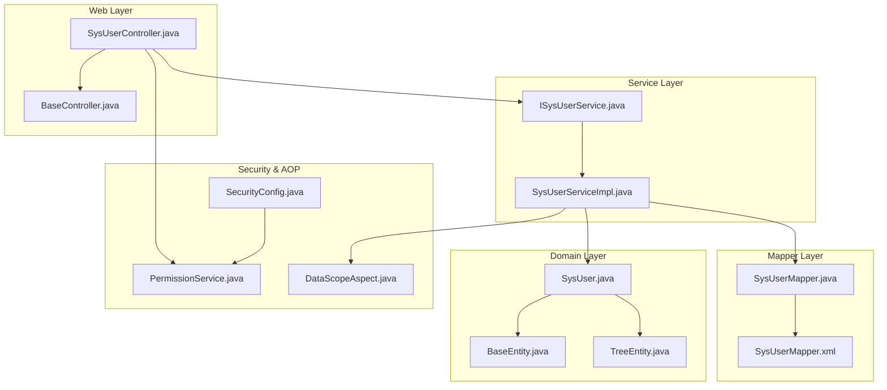
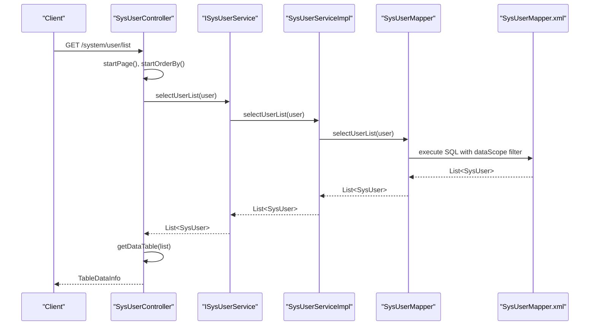
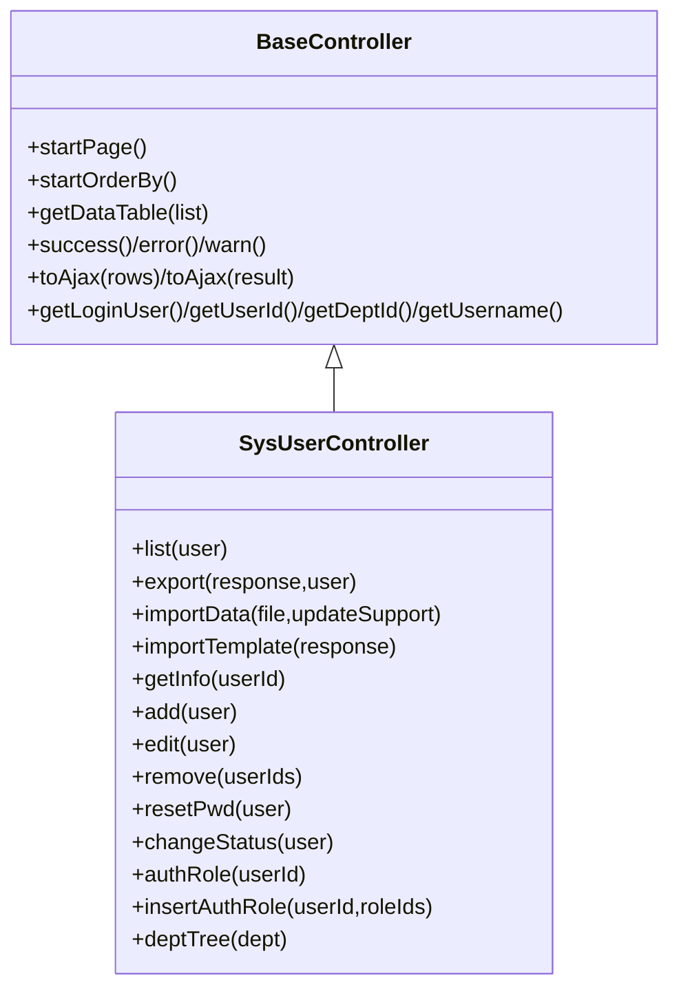
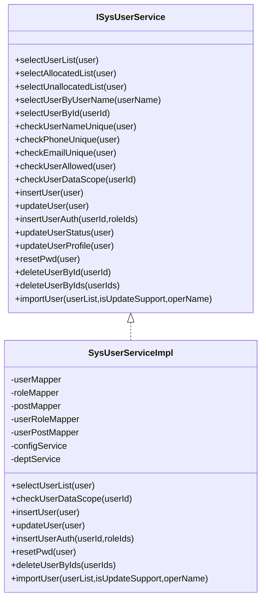
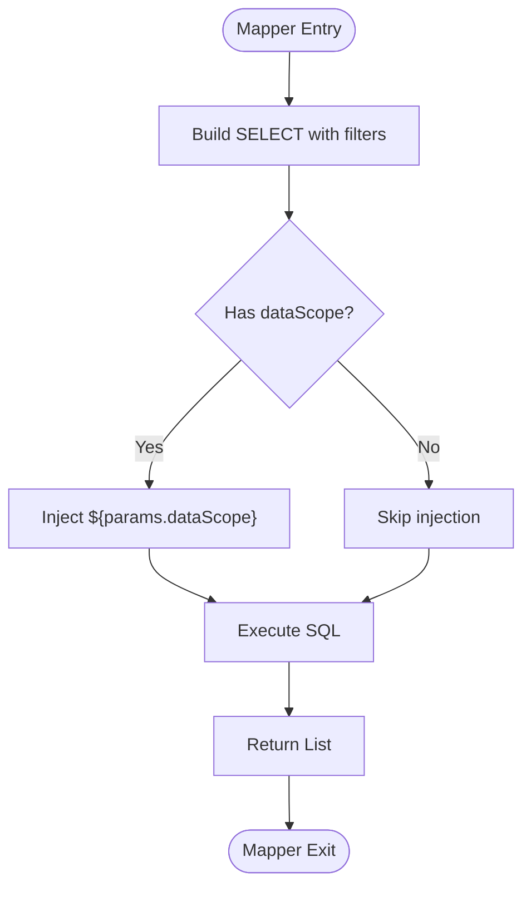
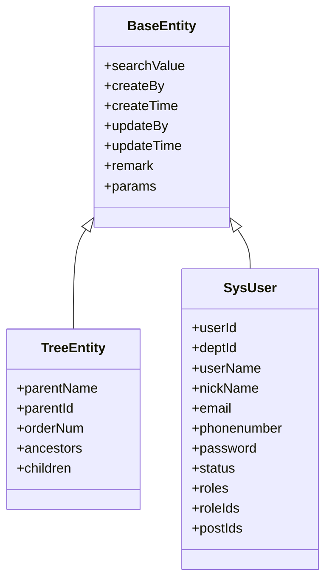
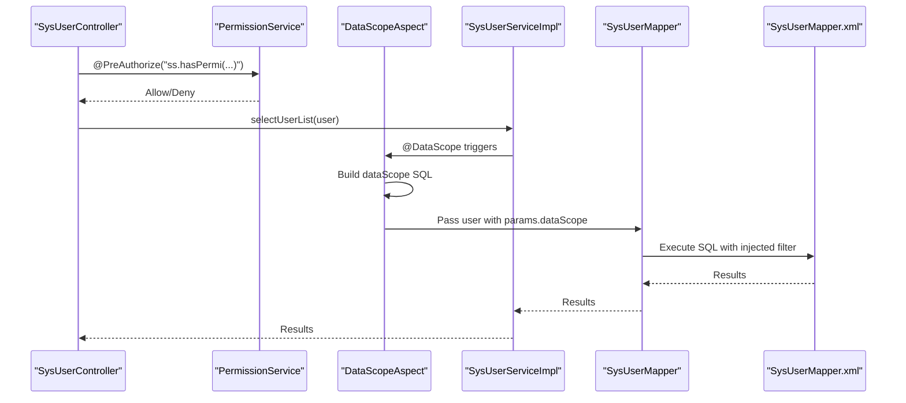
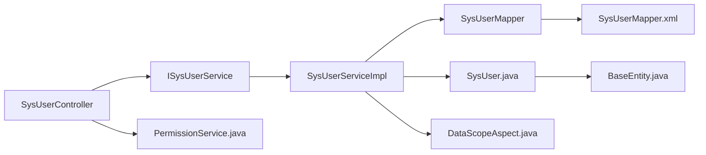

# Adding New Modules

<cite>
**Referenced Files in This Document**
- [BaseController.java](file://src/main/java/com/ruoyi/framework/web/controller/BaseController.java)
- [SysUserController.java](file://src/main/java/com/ruoyi/project/system/controller/SysUserController.java)
- [ISysUserService.java](file://src/main/java/com/ruoyi/project/system/service/ISysUserService.java)
- [SysUserServiceImpl.java](file://src/main/java/com/ruoyi/project/system/service/impl/SysUserServiceImpl.java)
- [SysUserMapper.java](file://src/main/java/com/ruoyi/project/system/mapper/SysUserMapper.java)
- [SysUserMapper.xml](file://src/main/resources/mybatis/system/SysUserMapper.xml)
- [BaseEntity.java](file://src/main/java/com/ruoyi/framework/web/domain/BaseEntity.java)
- [TreeEntity.java](file://src/main/java/com/ruoyi/framework/web/domain/TreeEntity.java)
- [SysUser.java](file://src/main/java/com/ruoyi/project/system/domain/SysUser.java)
- [DataScopeAspect.java](file://src/main/java/com/ruoyi/framework/aspectj/DataScopeAspect.java)
- [PermissionService.java](file://src/main/java/com/ruoyi/framework/security/service/PermissionService.java)
- [SecurityConfig.java](file://src/main/java/com/ruoyi/framework/config/SecurityConfig.java)
- [SysDeptServiceImpl.java](file://src/main/java/com/ruoyi/project/system/service/impl/SysDeptServiceImpl.java)
- [SysDeptMapper.xml](file://src/main/resources/mybatis/system/SysDeptMapper.xml)
- [pom.xml](file://pom.xml)
</cite>

## Table of Contents
1. [Introduction](#introduction)
2. [Project Structure](#project-structure)
3. [Core Components](#core-components)
4. [Architecture Overview](#architecture-overview)
5. [Detailed Component Analysis](#detailed-component-analysis)
6. [Dependency Analysis](#dependency-analysis)
7. [Performance Considerations](#performance-considerations)
8. [Troubleshooting Guide](#troubleshooting-guide)
9. [Conclusion](#conclusion)
10. [Appendices](#appendices)

## Introduction
This document explains how to add new modules to the RuoYi-Vue framework following the established MVC pattern. It covers the controller-service-mapper-domain layers, dependency injection, RESTful endpoint design, permission checks, data scope filtering, logging, and common pitfalls. The goal is to enable both beginners and experienced developers to implement new features consistently with the existing codebase.

## Project Structure
The application follows a layered architecture:
- Controller layer: REST endpoints under project/*/controller packages
- Service layer: interfaces and implementations under project/*/service
- Mapper layer: MyBatis interfaces under project/*/mapper
- Domain layer: entity classes under project/*/domain
- Web infrastructure: BaseController, AjaxResult, TableDataInfo, BaseEntity, TreeEntity
- Security and AOP: PermissionService, DataScopeAspect, SecurityConfig
- Persistence: MyBatis XML mappings under resources/mybatis

**Diagram sources**
- [SysUserController.java](file://src/main/java/com/ruoyi/project/system/controller/SysUserController.java#L1-L257)
- [BaseController.java](file://src/main/java/com/ruoyi/framework/web/controller/BaseController.java#L1-L195)
- [ISysUserService.java](file://src/main/java/com/ruoyi/project/system/service/ISysUserService.java#L1-L218)
- [SysUserServiceImpl.java](file://src/main/java/com/ruoyi/project/system/service/impl/SysUserServiceImpl.java#L1-L566)
- [SysUserMapper.java](file://src/main/java/com/ruoyi/project/system/mapper/SysUserMapper.java#L1-L148)
- [SysUserMapper.xml](file://src/main/resources/mybatis/system/SysUserMapper.xml#L1-L227)
- [SysUser.java](file://src/main/java/com/ruoyi/project/system/domain/SysUser.java#L1-L341)
- [BaseEntity.java](file://src/main/java/com/ruoyi/framework/web/domain/BaseEntity.java#L1-L119)
- [TreeEntity.java](file://src/main/java/com/ruoyi/framework/web/domain/TreeEntity.java#L1-L80)
- [PermissionService.java](file://src/main/java/com/ruoyi/framework/security/service/PermissionService.java#L1-L85)
- [DataScopeAspect.java](file://src/main/java/com/ruoyi/framework/aspectj/DataScopeAspect.java#L1-L185)
- [SecurityConfig.java](file://src/main/java/com/ruoyi/framework/config/SecurityConfig.java#L21-L98)

**Section sources**
- [SysUserController.java](file://src/main/java/com/ruoyi/project/system/controller/SysUserController.java#L1-L257)
- [pom.xml](file://pom.xml#L1-L200)

## Core Components
- BaseController: Provides pagination helpers, response wrappers, and user context retrieval for controllers.
- Domain models: BaseEntity and TreeEntity define common metadata and tree structure; SysUser demonstrates validation, Excel annotations, and associations.
- Service interfaces and implementations: Define business operations and coordinate mappers and cross-service calls.
- Mapper interfaces and XML: Define SQL operations and result mappings; support joins and dynamic filters.
- Security and AOP: PermissionService exposes @PreAuthorize-compatible methods; DataScopeAspect injects data scope filters; SecurityConfig enables method-level security.

**Section sources**
- [BaseController.java](file://src/main/java/com/ruoyi/framework/web/controller/BaseController.java#L1-L195)
- [BaseEntity.java](file://src/main/java/com/ruoyi/framework/web/domain/BaseEntity.java#L1-L119)
- [TreeEntity.java](file://src/main/java/com/ruoyi/framework/web/domain/TreeEntity.java#L1-L80)
- [SysUser.java](file://src/main/java/com/ruoyi/project/system/domain/SysUser.java#L1-L341)
- [ISysUserService.java](file://src/main/java/com/ruoyi/project/system/service/ISysUserService.java#L1-L218)
- [SysUserServiceImpl.java](file://src/main/java/com/ruoyi/project/system/service/impl/SysUserServiceImpl.java#L1-L566)
- [SysUserMapper.java](file://src/main/java/com/ruoyi/project/system/mapper/SysUserMapper.java#L1-L148)
- [SysUserMapper.xml](file://src/main/resources/mybatis/system/SysUserMapper.xml#L1-L227)
- [PermissionService.java](file://src/main/java/com/ruoyi/framework/security/service/PermissionService.java#L1-L85)
- [DataScopeAspect.java](file://src/main/java/com/ruoyi/framework/aspectj/DataScopeAspect.java#L1-L185)
- [SecurityConfig.java](file://src/main/java/com/ruoyi/framework/config/SecurityConfig.java#L21-L98)

## Architecture Overview
The MVC flow for a typical request:
- Controller receives HTTP requests, validates inputs, applies permissions, and delegates to service.
- Service enforces business rules, performs data scope checks, and coordinates mappers.
- Mapper executes SQL via MyBatis and returns domain objects with associations.
- Controller returns standardized AjaxResult or TableDataInfo.

**Diagram sources**
- [SysUserController.java](file://src/main/java/com/ruoyi/project/system/controller/SysUserController.java#L56-L66)
- [ISysUserService.java](file://src/main/java/com/ruoyi/project/system/service/ISysUserService.java#L1-L218)
- [SysUserServiceImpl.java](file://src/main/java/com/ruoyi/project/system/service/impl/SysUserServiceImpl.java#L70-L106)
- [SysUserMapper.java](file://src/main/java/com/ruoyi/project/system/mapper/SysUserMapper.java#L1-L148)
- [SysUserMapper.xml](file://src/main/resources/mybatis/system/SysUserMapper.xml#L50-L122)
- [BaseController.java](file://src/main/java/com/ruoyi/framework/web/controller/BaseController.java#L50-L91)

## Detailed Component Analysis

### Controller Layer: SysUserController
- Extends BaseController to inherit pagination, sorting, and response helpers.
- Uses @PreAuthorize for method-level permission checks via the "ss" bean.
- Uses @Log for audit logging with business type and title.
- Supports RESTful endpoints:
  - GET /system/user/list for paginated lists
  - POST /system/user/export for Excel export
  - POST /system/user/importData for Excel import
  - GET /system/user/deptTree for department tree
  - PUT /system/user/resetPwd for password reset
  - PUT /system/user/changeStatus for status updates
  - PUT /system/user/authRole for role assignment
  - DELETE /system/user/{userIds} for deletion
- Validates inputs with @Validated and handles cross-service validations (e.g., data scope checks).

**Diagram sources**
- [BaseController.java](file://src/main/java/com/ruoyi/framework/web/controller/BaseController.java#L1-L195)
- [SysUserController.java](file://src/main/java/com/ruoyi/project/system/controller/SysUserController.java#L1-L257)

**Section sources**
- [SysUserController.java](file://src/main/java/com/ruoyi/project/system/controller/SysUserController.java#L56-L256)
- [BaseController.java](file://src/main/java/com/ruoyi/framework/web/controller/BaseController.java#L50-L194)

### Service Layer: ISysUserService and SysUserServiceImpl
- Interface defines business operations: list, allocation queries, uniqueness checks, CRUD, profile/password updates, role assignment, and import handling.
- Implementation:
  - Applies @DataScope to enforce data scope filters.
  - Orchestrates multiple mappers (user, role, post) and cross-service calls (dept, config).
  - Uses transactions for atomic operations (insert/update/delete).
  - Validates inputs and throws exceptions for invalid states.
  - Implements data scope checks by proxying to self to reuse AOP filters.

**Diagram sources**
- [ISysUserService.java](file://src/main/java/com/ruoyi/project/system/service/ISysUserService.java#L1-L218)
- [SysUserServiceImpl.java](file://src/main/java/com/ruoyi/project/system/service/impl/SysUserServiceImpl.java#L1-L566)

**Section sources**
- [ISysUserService.java](file://src/main/java/com/ruoyi/project/system/service/ISysUserService.java#L1-L218)
- [SysUserServiceImpl.java](file://src/main/java/com/ruoyi/project/system/service/impl/SysUserServiceImpl.java#L70-L566)

### Mapper Layer: SysUserMapper and SysUserMapper.xml
- Mapper interface declares CRUD and query methods with parameterized types.
- XML mapping:
  - Defines result maps for SysUser, Dept, Role.
  - Joins sys_user with sys_dept and sys_user_role/sys_role.
  - Supports dynamic filters (by fields, dates, and dataScope).
  - Uses ${params.dataScope} to inject AOP-filtered conditions.

**Diagram sources**
- [SysUserMapper.xml](file://src/main/resources/mybatis/system/SysUserMapper.xml#L50-L122)
- [DataScopeAspect.java](file://src/main/java/com/ruoyi/framework/aspectj/DataScopeAspect.java#L91-L170)

**Section sources**
- [SysUserMapper.java](file://src/main/java/com/ruoyi/project/system/mapper/SysUserMapper.java#L1-L148)
- [SysUserMapper.xml](file://src/main/resources/mybatis/system/SysUserMapper.xml#L1-L227)

### Domain Model: BaseEntity, TreeEntity, SysUser
- BaseEntity: Common fields for audit and request parameters.
- TreeEntity: Extends BaseEntity with parent/children and ordering for hierarchical structures.
- SysUser: Extends BaseEntity, adds user-specific fields, validation constraints, and associations to Dept and Role.

**Diagram sources**
- [BaseEntity.java](file://src/main/java/com/ruoyi/framework/web/domain/BaseEntity.java#L1-L119)
- [TreeEntity.java](file://src/main/java/com/ruoyi/framework/web/domain/TreeEntity.java#L1-L80)
- [SysUser.java](file://src/main/java/com/ruoyi/project/system/domain/SysUser.java#L1-L341)

**Section sources**
- [BaseEntity.java](file://src/main/java/com/ruoyi/framework/web/domain/BaseEntity.java#L1-L119)
- [TreeEntity.java](file://src/main/java/com/ruoyi/framework/web/domain/TreeEntity.java#L1-L80)
- [SysUser.java](file://src/main/java/com/ruoyi/project/system/domain/SysUser.java#L1-L341)

### Security and Data Scope
- Method-level permissions: Controllers use @PreAuthorize with the "ss" bean to check permissions.
- Data scope filtering: @DataScope on service methods injects SQL filters based on roles and departments.
- AOP aspect: DataScopeAspect builds and injects dataScope conditions into the query parameters.

**Diagram sources**
- [SysUserController.java](file://src/main/java/com/ruoyi/project/system/controller/SysUserController.java#L56-L66)
- [PermissionService.java](file://src/main/java/com/ruoyi/framework/security/service/PermissionService.java#L1-L85)
- [DataScopeAspect.java](file://src/main/java/com/ruoyi/framework/aspectj/DataScopeAspect.java#L66-L170)
- [SysUserServiceImpl.java](file://src/main/java/com/ruoyi/project/system/service/impl/SysUserServiceImpl.java#L70-L106)
- [SysUserMapper.xml](file://src/main/resources/mybatis/system/SysUserMapper.xml#L50-L87)

**Section sources**
- [PermissionService.java](file://src/main/java/com/ruoyi/framework/security/service/PermissionService.java#L1-L85)
- [DataScopeAspect.java](file://src/main/java/com/ruoyi/framework/aspectj/DataScopeAspect.java#L1-L185)
- [SecurityConfig.java](file://src/main/java/com/ruoyi/framework/config/SecurityConfig.java#L21-L98)

## Dependency Analysis
- Controllers depend on services via autowired interfaces.
- Services depend on mappers and other services (e.g., dept, config).
- Domain models are POJOs with validation and annotations.
- MyBatis XML depends on mapper interfaces and injects dataScope via params.

**Diagram sources**
- [SysUserController.java](file://src/main/java/com/ruoyi/project/system/controller/SysUserController.java#L1-L257)
- [ISysUserService.java](file://src/main/java/com/ruoyi/project/system/service/ISysUserService.java#L1-L218)
- [SysUserServiceImpl.java](file://src/main/java/com/ruoyi/project/system/service/impl/SysUserServiceImpl.java#L1-L566)
- [SysUserMapper.java](file://src/main/java/com/ruoyi/project/system/mapper/SysUserMapper.java#L1-L148)
- [SysUserMapper.xml](file://src/main/resources/mybatis/system/SysUserMapper.xml#L1-L227)
- [SysUser.java](file://src/main/java/com/ruoyi/project/system/domain/SysUser.java#L1-L341)
- [BaseEntity.java](file://src/main/java/com/ruoyi/framework/web/domain/BaseEntity.java#L1-L119)
- [DataScopeAspect.java](file://src/main/java/com/ruoyi/framework/aspectj/DataScopeAspect.java#L1-L185)
- [PermissionService.java](file://src/main/java/com/ruoyi/framework/security/service/PermissionService.java#L1-L85)

**Section sources**
- [SysUserController.java](file://src/main/java/com/ruoyi/project/system/controller/SysUserController.java#L1-L257)
- [SysUserServiceImpl.java](file://src/main/java/com/ruoyi/project/system/service/impl/SysUserServiceImpl.java#L1-L566)
- [SysUserMapper.xml](file://src/main/resources/mybatis/system/SysUserMapper.xml#L1-L227)

## Performance Considerations
- Pagination: BaseController.startPage() and startOrderBy() integrate with PageHelper; ensure ORDER BY is sanitized via SqlUtil to prevent SQL injection.
- Data scope: @DataScope reduces result sets early; avoid unnecessary joins or selects in XML unless required.
- Transactions: Group related writes (e.g., user-role/post associations) in a single transaction to maintain consistency.
- Validation: Use BeanValidators to fail fast on invalid inputs before hitting the database.

[No sources needed since this section provides general guidance]

## Troubleshooting Guide
Common issues and resolutions:
- Permission denied:
  - Ensure the "ss" bean is available and @PreAuthorize expressions match the user’s permissions.
  - Verify SecurityConfig enables method security.
  - Check PermissionContextHolder context propagation for dynamic permissions.
- Data scope mismatch:
  - Confirm @DataScope is present on service methods and aliases match XML table aliases.
  - Validate that params.dataScope is injected and not overridden elsewhere.
  - Use checkUserDataScope/checkDeptDataScope to guard sensitive operations.
- Validation errors:
  - Inputs annotated with @Validated trigger constraint violations; return appropriate AjaxResult.error() messages.
  - For imports, use BeanValidators.validateWithException() to surface validation failures.
- Duplicate uniqueness:
  - Use checkUserNameUnique/checkPhoneUnique/checkEmailUnique to prevent duplicates; return clear error messages.
- Cross-service dependencies:
  - When updating roles/posts, ensure related mappers are invoked within the same transaction.
- Logging:
  - @Log records businessType and title; ensure the aspect is enabled and logs are configured.

**Section sources**
- [SysUserController.java](file://src/main/java/com/ruoyi/project/system/controller/SysUserController.java#L100-L202)
- [SysUserServiceImpl.java](file://src/main/java/com/ruoyi/project/system/service/impl/SysUserServiceImpl.java#L166-L252)
- [DataScopeAspect.java](file://src/main/java/com/ruoyi/framework/aspectj/DataScopeAspect.java#L91-L170)
- [PermissionService.java](file://src/main/java/com/ruoyi/framework/security/service/PermissionService.java#L1-L85)
- [SecurityConfig.java](file://src/main/java/com/ruoyi/framework/config/SecurityConfig.java#L21-L98)

## Conclusion
To add a new module:
- Create domain classes extending BaseEntity or TreeEntity as appropriate.
- Implement IService and ServiceImpl with @DataScope where applicable.
- Add Mapper interface and MyBatis XML with result maps and dynamic filters.
- Create a Controller extending BaseController with REST endpoints and @PreAuthorize/@Log.
- Ensure dependencies are injected via @Autowired and cross-service validations are enforced.
- Test permissions, data scope, and validation thoroughly.

[No sources needed since this section summarizes without analyzing specific files]

## Appendices

### Best Practices Checklist
- Use BaseController helpers for pagination and response formatting.
- Apply @PreAuthorize("ss.hasPermi('...')") on all endpoints requiring authorization.
- Annotate sensitive operations with @Log(title, businessType).
- Enforce data scope via @DataScope on list/query methods.
- Validate inputs with @Validated and BeanValidators.
- Keep transactions tight around related writes.
- Use ExcelUtil for import/export where applicable.

[No sources needed since this section provides general guidance]